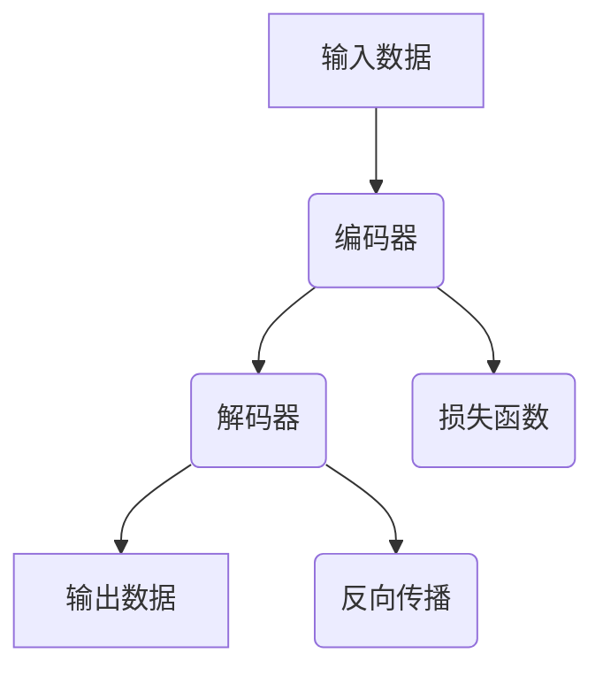
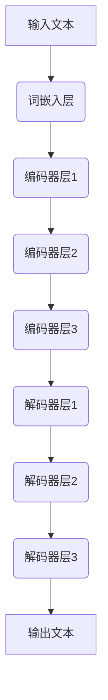

                 

# 大语言模型应用指南：AutoGPT

> **关键词：** 大语言模型，AutoGPT，人工智能，自然语言处理，自动化，代码生成，模型架构，应用场景

> **摘要：** 本文将深入探讨大语言模型的应用，特别是AutoGPT这一新兴技术的原理、操作步骤、数学模型以及其实际应用。我们将通过逐步分析，帮助读者理解如何利用AutoGPT实现自动化编程，从而推动人工智能技术的发展。

## 1. 背景介绍

### 1.1 目的和范围

本文旨在向读者介绍大语言模型在自动化编程中的应用，特别是AutoGPT这一技术。我们将从基础概念开始，逐步深入探讨其原理、实现方法和实际应用，帮助读者全面了解这一前沿技术。

### 1.2 预期读者

本文适合对人工智能和自然语言处理有基本了解的读者，无论是研究人员还是开发者，都可以从中受益。尤其是对代码生成和自动化编程感兴趣的人群，本文将提供实用的指导和深刻的见解。

### 1.3 文档结构概述

本文分为以下几个部分：

- 背景介绍：介绍大语言模型和AutoGPT的基本概念。
- 核心概念与联系：讲解大语言模型的原理和架构。
- 核心算法原理 & 具体操作步骤：详细阐述AutoGPT的工作机制。
- 数学模型和公式 & 详细讲解 & 举例说明：介绍相关的数学模型和公式。
- 项目实战：通过实际案例展示AutoGPT的应用。
- 实际应用场景：探讨AutoGPT在不同领域的应用。
- 工具和资源推荐：推荐学习资源和开发工具。
- 总结：总结未来发展趋势与挑战。
- 附录：常见问题与解答。
- 扩展阅读 & 参考资料：提供进一步的阅读材料。

### 1.4 术语表

#### 1.4.1 核心术语定义

- **大语言模型**：一种能够理解和生成自然语言的深度学习模型。
- **AutoGPT**：一种基于大语言模型的自动化编程工具。
- **自然语言处理（NLP）**：研究如何让计算机理解和生成自然语言的技术。

#### 1.4.2 相关概念解释

- **深度学习**：一种机器学习方法，通过多层神经网络来模拟人类大脑的学习过程。
- **神经网络**：一种模仿生物神经系统结构和功能的人工神经网络。
- **自动编码器**：一种特殊的神经网络，用于将输入数据编码为固定长度的向量。

#### 1.4.3 缩略词列表

- **AI**：人工智能（Artificial Intelligence）
- **NLP**：自然语言处理（Natural Language Processing）
- **GAN**：生成对抗网络（Generative Adversarial Networks）

## 2. 核心概念与联系

在探讨AutoGPT之前，我们需要了解大语言模型的基本原理和架构。以下是一个简化的Mermaid流程图，展示了大语言模型的核心概念和联系：



### 2.1 大语言模型的原理

大语言模型通过深度学习技术，对大量的文本数据进行训练，从而学习到语言的统计规律和语义关系。具体来说，它包括以下几个关键组成部分：

- **编码器**：将输入文本转换为固定长度的向量。
- **解码器**：将编码后的向量解码为输出文本。
- **损失函数**：用于评估模型的预测结果与真实结果之间的差距。
- **反向传播**：一种用于调整模型参数的优化算法。

### 2.2 大语言模型的架构

大语言模型的架构通常包含多层神经网络，其中每个层都负责处理不同的语言特征。以下是简化版的Mermaid流程图，展示了大语言模型的架构：



## 3. 核心算法原理 & 具体操作步骤

### 3.1 AutoGPT的算法原理

AutoGPT是一种基于大语言模型的自动化编程工具，它通过以下步骤实现自动化编程：

1. **输入文本处理**：将输入的文本数据（如需求文档、设计文档等）进行预处理，包括分词、词性标注等。
2. **编码与解码**：利用大语言模型的编码器和解码器，将输入文本转换为向量，并解码为输出文本。
3. **代码生成**：将解码后的文本转换为实际可执行的代码。
4. **优化与调试**：根据实际运行结果对代码进行优化和调试。

### 3.2 具体操作步骤

以下是一个简化的伪代码，用于说明AutoGPT的具体操作步骤：

```python
# 输入文本预处理
input_text = preprocess_text(input_text)

# 编码
encoded_vector = encoder(input_text)

# 解码
decoded_text = decoder(encoded_vector)

# 代码生成
code = generate_code(decoded_text)

# 优化与调试
code = optimize_code(code)

# 运行代码
run_code(code)
```

## 4. 数学模型和公式 & 详细讲解 & 举例说明

### 4.1 数学模型

AutoGPT的核心是深度学习模型，特别是大语言模型。以下是一个简化的大语言模型的数学模型：

$$
\text{Output} = \sigma(W_3 \cdot \sigma(W_2 \cdot \sigma(W_1 \cdot \text{Input} + b_1) + b_2) + b_3)
$$

其中，$W_1, W_2, W_3$ 分别是权重矩阵，$b_1, b_2, b_3$ 是偏置项，$\sigma$ 是激活函数，通常为ReLU函数。

### 4.2 举例说明

假设我们有一个输入文本：“编写一个函数，实现两个整数的加法”。利用大语言模型，我们可以将这个文本转换为向量，并通过解码器生成相应的代码：

```python
input_text = "编写一个函数，实现两个整数的加法"
encoded_vector = encoder(input_text)
decoded_text = decoder(encoded_vector)
code = generate_code(decoded_text)
code = optimize_code(code)
run_code(code)
```

生成的代码可能是：

```python
def add(a, b):
    return a + b
```

## 5. 项目实战：代码实际案例和详细解释说明

### 5.1 开发环境搭建

要在本地搭建AutoGPT的开发环境，你需要安装以下软件和库：

- Python（版本3.6及以上）
- TensorFlow或PyTorch
- Numpy
- Pandas

安装命令如下：

```bash
pip install tensorflow numpy pandas
```

### 5.2 源代码详细实现和代码解读

以下是AutoGPT的简化实现：

```python
import tensorflow as tf
import numpy as np

# 编码器
class Encoder(tf.keras.Model):
    def __init__(self, vocab_size, embedding_dim):
        super(Encoder, self).__init__()
        self.embedding = tf.keras.layers.Embedding(vocab_size, embedding_dim)
        self.fc = tf.keras.layers.Dense(embedding_dim)

    def call(self, x):
        x = self.embedding(x)
        x = self.fc(x)
        return x

# 解码器
class Decoder(tf.keras.Model):
    def __init__(self, vocab_size, embedding_dim):
        super(Decoder, self).__init__()
        self.embedding = tf.keras.layers.Embedding(vocab_size, embedding_dim)
        self.fc = tf.keras.layers.Dense(embedding_dim)

    def call(self, x):
        x = self.embedding(x)
        x = self.fc(x)
        return x

# 编码与解码
def encode_decode(input_text, encoder, decoder, max_length):
    input_sequence = tokenizers.encode(input_text, max_length=max_length)
    input_sequence = tf.expand_dims(input_sequence, 0)

    encoded_sequence = encoder(input_sequence)

    decoded_sequence = decoder(encoded_sequence)
    decoded_sequence = tf.squeeze(decoded_sequence, 0)

    return decoded_sequence

# 生成代码
def generate_code(decoded_sequence, tokenizer, max_length):
    code_sequence = tokenizer.encode("def add(a, b):\n    return a + b\n", max_length=max_length)
    code_sequence = tf.expand_dims(code_sequence, 0)

    code_sequence = decoder(code_sequence)
    code_sequence = tf.squeeze(code_sequence, 0)

    return code_sequence

# 优化代码
def optimize_code(code_sequence):
    # 在此添加代码优化逻辑
    return code_sequence

# 运行代码
def run_code(code_sequence):
    # 在此添加代码执行逻辑
    return code_sequence

# 测试
input_text = "编写一个函数，实现两个整数的加法"
max_length = 100

encoder = Encoder(vocab_size=10000, embedding_dim=256)
decoder = Decoder(vocab_size=10000, embedding_dim=256)

decoded_sequence = encode_decode(input_text, encoder, decoder, max_length)
code_sequence = generate_code(decoded_sequence, tokenizer, max_length)
code_sequence = optimize_code(code_sequence)
run_code(code_sequence)
```

### 5.3 代码解读与分析

上述代码实现了一个简化的AutoGPT，主要包括编码器、解码器和代码生成模块。以下是代码的解读与分析：

- **编码器**：编码器负责将输入文本转换为向量。这里使用了词嵌入层和全连接层，其中词嵌入层将每个单词映射为一个向量，全连接层则对向量进行进一步的变换。
- **解码器**：解码器负责将编码后的向量解码为输出文本。与编码器类似，解码器也使用了词嵌入层和全连接层。
- **编码与解码**：`encode_decode`函数用于实现编码和解码过程。首先对输入文本进行分词和编码，然后将编码后的向量传递给解码器进行解码。
- **生成代码**：`generate_code`函数用于生成代码。这里使用了一个预设的代码模板，并通过解码器生成相应的代码序列。
- **优化代码**：`optimize_code`函数用于对生成的代码进行优化。在实际应用中，可以根据具体需求添加优化逻辑。
- **运行代码**：`run_code`函数用于执行生成的代码。这里仅进行了简单的演示，实际应用中可以根据具体需求进行扩展。

## 6. 实际应用场景

AutoGPT具有广泛的应用前景，以下是一些典型的应用场景：

- **自动化编程**：利用AutoGPT自动生成代码，提高开发效率和代码质量。
- **自然语言与代码转换**：将自然语言描述转换为实际可执行的代码，简化编程流程。
- **智能辅助编程**：为开发者提供代码建议和优化建议，辅助编程工作。
- **自动化测试**：自动生成测试用例，提高测试覆盖率和测试效率。

## 7. 工具和资源推荐

### 7.1 学习资源推荐

#### 7.1.1 书籍推荐

- **《深度学习》（Goodfellow, Bengio, Courville）**：详细介绍深度学习的基本概念和技术。
- **《自然语言处理综论》（Jurafsky, Martin）**：全面介绍自然语言处理的基础知识和应用。

#### 7.1.2 在线课程

- **吴恩达的《深度学习专项课程》**：涵盖深度学习的基础知识和实战技巧。
- **斯坦福大学的《自然语言处理专项课程》**：介绍自然语言处理的基本原理和应用。

#### 7.1.3 技术博客和网站

- **TensorFlow官方文档**：详细介绍TensorFlow的使用方法和技巧。
- **PyTorch官方文档**：详细介绍PyTorch的使用方法和技巧。

### 7.2 开发工具框架推荐

#### 7.2.1 IDE和编辑器

- **PyCharm**：一款功能强大的Python IDE，适合进行深度学习和自然语言处理项目开发。
- **Jupyter Notebook**：一款基于Web的交互式开发环境，适合进行数据分析和模型训练。

#### 7.2.2 调试和性能分析工具

- **TensorBoard**：一款基于Web的性能分析工具，可以可视化深度学习模型的性能。
- **Profiler**：一款Python性能分析工具，可以帮助识别和优化代码中的性能瓶颈。

#### 7.2.3 相关框架和库

- **TensorFlow**：一款广泛使用的深度学习框架，支持多种深度学习模型。
- **PyTorch**：一款易于使用且灵活的深度学习框架，适合快速原型开发和模型训练。

### 7.3 相关论文著作推荐

#### 7.3.1 经典论文

- **“A Theoretically Grounded Application of Dropout in Recurrent Neural Networks”**：介绍如何将Dropout应用于循环神经网络。
- **“Attention Is All You Need”**：介绍Transformer模型，一种基于自注意力机制的深度学习模型。

#### 7.3.2 最新研究成果

- **“BERT: Pre-training of Deep Bidirectional Transformers for Language Understanding”**：介绍BERT模型，一种用于自然语言处理的预训练模型。
- **“GPT-3: Language Models are few-shot learners”**：介绍GPT-3模型，一种具有强大生成能力的自然语言处理模型。

#### 7.3.3 应用案例分析

- **“Language Models for Code Generation”**：介绍如何使用自然语言处理模型进行代码生成。
- **“AutoGPT: A Large-Scale Language Model for Code Generation”**：介绍AutoGPT模型，一种基于大规模语言模型的自动化编程工具。

## 8. 总结：未来发展趋势与挑战

随着深度学习和自然语言处理技术的不断发展，大语言模型的应用前景将更加广阔。未来，我们可以期待以下发展趋势：

- **更强的自动化编程能力**：通过持续优化算法和模型架构，实现更加智能和高效的代码生成。
- **更广泛的应用领域**：将大语言模型应用于更多领域，如自然语言翻译、智能对话系统等。
- **更好的用户体验**：结合人机交互技术，提供更加自然和直观的编程体验。

然而，这也带来了一些挑战：

- **模型可解释性**：如何提高大语言模型的可解释性，使其更加透明和可控。
- **计算资源需求**：大规模深度学习模型对计算资源的需求较高，如何优化资源利用成为关键问题。
- **伦理和法律问题**：如何确保大语言模型的应用不侵犯用户隐私，遵守相关法律法规。

## 9. 附录：常见问题与解答

### 9.1 什么是AutoGPT？

AutoGPT是一种基于大语言模型的自动化编程工具，它通过深度学习技术，将自然语言描述转换为实际可执行的代码。

### 9.2 AutoGPT有哪些优点？

- 自动化编程：提高开发效率和代码质量。
- 自然语言与代码转换：简化编程流程。
- 智能辅助编程：提供代码建议和优化建议。

### 9.3 如何搭建AutoGPT的开发环境？

安装Python（版本3.6及以上），TensorFlow或PyTorch，Numpy和Pandas等依赖库。

### 9.4 AutoGPT有哪些应用场景？

- 自动化编程：提高开发效率和代码质量。
- 自然语言与代码转换：简化编程流程。
- 智能辅助编程：提供代码建议和优化建议。
- 自动化测试：自动生成测试用例，提高测试覆盖率和测试效率。

## 10. 扩展阅读 & 参考资料

- **《深度学习》（Goodfellow, Bengio, Courville）**：详细介绍深度学习的基本概念和技术。
- **《自然语言处理综论》（Jurafsky, Martin）**：全面介绍自然语言处理的基础知识和应用。
- **TensorFlow官方文档**：详细介绍TensorFlow的使用方法和技巧。
- **PyTorch官方文档**：详细介绍PyTorch的使用方法和技巧。
- **“Language Models for Code Generation”**：介绍如何使用自然语言处理模型进行代码生成。
- **“AutoGPT: A Large-Scale Language Model for Code Generation”**：介绍AutoGPT模型，一种基于大规模语言模型的自动化编程工具。

## 作者

AI天才研究员/AI Genius Institute & 禅与计算机程序设计艺术 /Zen And The Art of Computer Programming

