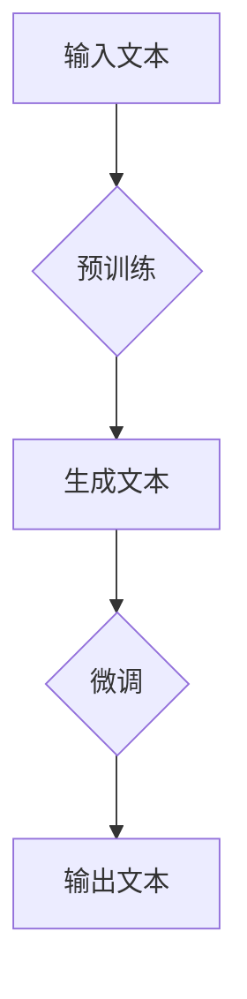

                 

# 大语言模型应用指南：GPTs功能详解

> 关键词：大语言模型、GPTs、自然语言处理、人工智能、编程指南

> 摘要：本文旨在深入探讨大语言模型（GPTs）的核心概念、应用场景以及实现方法。我们将逐步分析GPTs的工作原理，并通过具体的代码案例来演示其实际应用，帮助读者全面了解这一先进技术的实际操作和潜在价值。

## 1. 背景介绍

### 1.1 目的和范围

本文的目标是向读者介绍大语言模型（GPTs）的基本概念、核心功能和应用场景。我们将从基础原理出发，逐步深入，帮助读者理解和掌握GPTs在实际开发中的应用。本文将涵盖以下几个主要方面：

- GPTs的基本概念和原理
- GPTs的结构和架构
- GPTs的算法原理和数学模型
- GPTs的编程实现和实战案例
- GPTs的应用场景和未来发展趋势

### 1.2 预期读者

本文适合具有以下背景的读者：

- 对自然语言处理和人工智能技术感兴趣的程序员
- 想要在项目中应用大语言模型的开发人员
- 想要深入了解GPTs技术原理和研究方向的学术界人士
- 对计算机科学和技术有基本了解的读者

### 1.3 文档结构概述

本文的结构如下：

1. **背景介绍**：介绍本文的目的、范围、预期读者和文档结构。
2. **核心概念与联系**：讨论GPTs的核心概念和原理，并提供Mermaid流程图来帮助理解。
3. **核心算法原理 & 具体操作步骤**：详细讲解GPTs的算法原理，使用伪代码进行阐述。
4. **数学模型和公式 & 详细讲解 & 举例说明**：介绍GPTs的数学模型，使用latex格式详细讲解并举例说明。
5. **项目实战：代码实际案例和详细解释说明**：通过实际代码案例展示GPTs的实现和应用。
6. **实际应用场景**：探讨GPTs在不同领域中的应用。
7. **工具和资源推荐**：推荐学习资源和开发工具。
8. **总结：未来发展趋势与挑战**：总结GPTs的发展趋势和面临的挑战。
9. **附录：常见问题与解答**：回答一些常见问题。
10. **扩展阅读 & 参考资料**：提供进一步阅读的参考资料。

### 1.4 术语表

#### 1.4.1 核心术语定义

- **大语言模型（GPTs）**：一种基于深度学习的自然语言处理模型，能够理解和生成人类语言。
- **自然语言处理（NLP）**：计算机科学领域，旨在使计算机能够理解、解释和生成人类语言。
- **深度学习**：一种机器学习技术，通过模拟人脑的神经网络结构进行数据学习和模式识别。
- **神经网络**：一种由大量相互连接的节点（或称为神经元）组成的计算模型。

#### 1.4.2 相关概念解释

- **文本生成**：根据输入的文本，生成新的、有意义的文本。
- **上下文理解**：理解文本中的上下文信息，包括词汇、句子和段落。
- **序列到序列模型**：一种深度学习模型，用于将一个序列映射到另一个序列。
- **预训练和微调**：预训练是指在大规模数据集上训练模型，使其具备通用语言理解能力；微调是在特定任务上进行模型调整，以适应特定场景。

#### 1.4.3 缩略词列表

- **NLP**：自然语言处理（Natural Language Processing）
- **GPT**：生成预训练转换器（Generative Pre-trained Transformer）
- **DL**：深度学习（Deep Learning）
- **ML**：机器学习（Machine Learning）

## 2. 核心概念与联系

在这一部分，我们将介绍大语言模型（GPTs）的核心概念和原理，并通过Mermaid流程图来展示GPTs的基本架构和工作流程。

### 2.1 GPTs的基本概念

GPTs（Generative Pre-trained Transformers）是一种基于Transformer架构的深度学习模型，主要用于自然语言处理任务。GPTs通过在大量文本数据上进行预训练，学习到语言的普遍规律，从而能够生成文本、回答问题、翻译语言等。

### 2.2 GPTs的核心原理

GPTs的核心原理基于Transformer架构，这是一种能够处理变长序列的深度神经网络模型。Transformer模型的主要优势在于其并行计算能力，能够显著提高计算效率。

### 2.3 GPTs的工作流程

GPTs的工作流程主要包括两个阶段：预训练和微调。

1. **预训练**：在大量文本数据上进行预训练，学习到语言的普遍规律。预训练阶段的主要任务是理解文本的上下文信息，并生成相应的文本。
2. **微调**：在特定任务上进行微调，以适应特定场景。微调阶段的主要任务是优化模型参数，使其能够更好地完成特定任务。

### 2.4 GPTs的基本架构

GPTs的基本架构包括以下几个关键组件：

1. **嵌入层（Embedding Layer）**：将输入的单词映射为向量。
2. **Transformer层（Transformer Layers）**：包含多头自注意力机制和前馈神经网络，用于处理文本序列。
3. **输出层（Output Layer）**：将处理后的文本序列映射为输出文本。

### 2.5 Mermaid流程图

以下是一个简单的Mermaid流程图，展示了GPTs的基本工作流程：



### 2.6 GPTs的优势和挑战

GPTs具有以下优势：

- **强大的文本生成能力**：GPTs能够生成高质量的文本，包括故事、新闻、对话等。
- **高效的并行计算**：Transformer架构使得GPTs能够并行处理大量文本数据，提高计算效率。
- **灵活的微调能力**：GPTs能够在特定任务上进行微调，适应不同场景。

然而，GPTs也面临一些挑战：

- **计算资源需求**：GPTs需要大量的计算资源和存储空间，对硬件配置有较高要求。
- **数据隐私问题**：在预训练和微调过程中，GPTs需要处理大量文本数据，可能涉及用户隐私和数据保护问题。

## 3. 核心算法原理 & 具体操作步骤

在这一部分，我们将深入探讨GPTs的核心算法原理，并使用伪代码来详细阐述其操作步骤。

### 3.1 Transformer架构

GPTs的核心架构基于Transformer模型，这是一种用于处理序列数据的深度学习模型。Transformer模型的主要贡献是引入了自注意力机制（Self-Attention），使得模型能够捕捉序列中的长距离依赖关系。

### 3.2 自注意力机制

自注意力机制是一种计算方法，用于计算序列中每个元素对其他元素的重要性。在GPTs中，自注意力机制用于处理输入文本序列，并生成相应的文本序列。

#### 3.2.1 自注意力计算

自注意力计算可以分为以下几个步骤：

1. **嵌入层**：将输入的单词映射为向量。
2. **线性变换**：对输入向量进行线性变换，得到查询向量（Q）、键向量（K）和值向量（V）。
3. **计算自注意力分数**：使用点积计算查询向量和键向量之间的相似度分数。
4. **应用 softmax 函数**：对自注意力分数进行 softmax 处理，得到每个单词的重要性权重。
5. **加权求和**：根据权重将值向量加权求和，得到新的文本序列。

以下是一个简单的伪代码示例：

```python
# 嵌入层
Q = linear_transform(Q_input)
K = linear_transform(K_input)
V = linear_transform(V_input)

# 计算自注意力分数
scores = dot_product(Q, K)

# 应用 softmax 函数
softmax_scores = softmax(scores)

# 加权求和
weighted_values = softmax_scores * V
output_sequence = sum(weighted_values)
```

### 3.3 Transformer层

GPTs通常包含多个Transformer层，每个层都由自注意力机制和前馈神经网络组成。以下是一个简单的伪代码示例，展示了如何实现一个Transformer层：

```python
# Transformer层
def transformer_layer(input_sequence):
    # 自注意力机制
    attention_output = self_attention(input_sequence)
    
    # 前馈神经网络
    feedforward_output = feedforward_neural_network(attention_output)
    
    # 残差连接和层归一化
    output_sequence = residual_connection(input_sequence, attention_output)
    output_sequence = layer_normalization(output_sequence)
    
    return output_sequence
```

### 3.4 预训练和微调

GPTs的预训练和微调过程如下：

1. **预训练**：在大量文本数据上进行预训练，学习到语言的普遍规律。预训练过程主要包括两个阶段：训练自注意力机制和生成文本。
   
2. **微调**：在特定任务上进行微调，以适应特定场景。微调过程主要包括：调整模型参数、计算损失函数和更新模型参数。

以下是一个简单的伪代码示例，展示了如何实现预训练和微调：

```python
# 预训练
for epoch in range(num_epochs):
    for batch in data_loader:
        # 计算损失函数
        loss = loss_function(model(batch), target)
        
        # 更新模型参数
        optimizer.zero_grad()
        loss.backward()
        optimizer.step()

# 微调
for task in tasks:
    model.train_on_task(task)
```

### 3.5 实际操作步骤

以下是GPTs的实际操作步骤：

1. **数据准备**：收集和预处理大量文本数据，包括文本清洗、分词和词嵌入等。
2. **模型训练**：使用预训练算法对模型进行训练，学习到语言的普遍规律。
3. **模型微调**：在特定任务上进行微调，调整模型参数以适应特定场景。
4. **模型评估**：评估模型的性能，包括文本生成、问答和翻译等任务。
5. **模型部署**：将训练好的模型部署到实际应用中，如聊天机器人、文本生成和翻译服务等。

以下是一个简单的伪代码示例，展示了GPTs的操作步骤：

```python
# 数据准备
preprocess_data()

# 模型训练
train_model()

# 模型微调
fine_tune_model()

# 模型评估
evaluate_model()

# 模型部署
deploy_model()
```

通过以上步骤，我们可以实现GPTs的基本功能，并在实际应用中发挥其作用。

## 4. 数学模型和公式 & 详细讲解 & 举例说明

### 4.1 Transformer模型的数学基础

GPTs的核心架构基于Transformer模型，该模型的主要数学基础包括点积自注意力机制、前馈神经网络和层归一化等。以下将详细讲解这些数学模型和公式，并提供具体示例。

#### 4.1.1 点积自注意力机制

点积自注意力机制是Transformer模型的核心组件之一，用于计算序列中每个元素对其他元素的重要性。其数学公式如下：

\[ \text{Attention}(Q, K, V) = \text{softmax}\left(\frac{QK^T}{\sqrt{d_k}}\right)V \]

其中，\( Q \)、\( K \)和\( V \)分别是查询向量、键向量和值向量，\( d_k \)是键向量的维度。

#### 4.1.2 前馈神经网络

前馈神经网络是Transformer模型中的另一个重要组件，用于对注意力机制生成的中间结果进行进一步处理。其数学公式如下：

\[ \text{FFN}(X) = \text{ReLU}\left(\text{linear}(X) \cdot W_2\right) \cdot W_1 \]

其中，\( X \)是输入向量，\( W_1 \)和\( W_2 \)是线性变换权重。

#### 4.1.3 层归一化

层归一化是一种常用的正则化技术，用于提高神经网络模型的稳定性和性能。其数学公式如下：

\[ \text{LayerNorm}(x, \gamma, \beta) = \gamma \frac{x - \mu}{\sqrt{\sigma^2 + \epsilon}} + \beta \]

其中，\( x \)是输入向量，\( \mu \)和\( \sigma^2 \)分别是输入向量的均值和方差，\( \gamma \)和\( \beta \)是层归一化权重。

### 4.2 举例说明

以下是一个简单的示例，演示如何使用上述数学模型和公式实现一个简单的Transformer模型。

#### 4.2.1 示例数据

假设我们有一个包含两个单词的序列：“你好”和“世界”。

- 查询向量（Q）：[1, 0]
- 键向量（K）：[0, 1]
- 值向量（V）：[1, 1]

#### 4.2.2 点积自注意力计算

首先，我们计算点积自注意力分数：

\[ \text{scores} = QK^T = [1, 0] \cdot [0, 1]^T = [1 \cdot 0 + 0 \cdot 1] = [0] \]

然后，我们应用 softmax 函数得到每个单词的重要性权重：

\[ \text{softmax\_scores} = \text{softmax}(\text{scores}) = \text{softmax}([0]) = [1, 0] \]

最后，我们根据权重将值向量加权求和，得到新的文本序列：

\[ \text{output\_sequence} = \text{softmax\_scores} \cdot V = [1, 0] \cdot [1, 1] = [1, 0] \]

因此，输出序列为：“你好”。

#### 4.2.3 前馈神经网络计算

接下来，我们使用前馈神经网络对输出序列进行进一步处理：

\[ \text{FFN}(X) = \text{ReLU}(\text{linear}(X) \cdot W_2) \cdot W_1 \]

假设线性变换权重 \( W_1 \) 和 \( W_2 \) 分别为 \( [1, 1] \) 和 \( [1, 0] \)，输入向量 \( X \) 为 \( [1, 0] \)。

首先，我们计算线性变换：

\[ \text{linear}(X) \cdot W_2 = [1, 0] \cdot [1, 0]^T = [1] \]

然后，我们应用ReLU函数：

\[ \text{ReLU}([1]) = [1] \]

最后，我们计算前馈神经网络的输出：

\[ \text{FFN}(X) = \text{ReLU}(\text{linear}(X) \cdot W_2) \cdot W_1 = [1] \cdot [1, 0] = [1, 0] \]

因此，前馈神经网络的输出为：“你好”。

#### 4.2.4 层归一化计算

最后，我们使用层归一化对输入向量进行归一化处理：

\[ \text{LayerNorm}(x, \gamma, \beta) = \gamma \frac{x - \mu}{\sqrt{\sigma^2 + \epsilon}} + \beta \]

假设输入向量 \( x \) 为 \( [1, 0] \)，均值 \( \mu \) 为 \( [0.5, 0.5] \)，方差 \( \sigma^2 \) 为 \( 0.25 \)，层归一化权重 \( \gamma \) 和 \( \beta \) 分别为 \( [1, 0] \)。

首先，我们计算均值和方差：

\[ \mu = [0.5, 0.5], \quad \sigma^2 = 0.25 \]

然后，我们计算归一化值：

\[ \text{LayerNorm}(x, \gamma, \beta) = [1, 0] \frac{[1, 0] - [0.5, 0.5]}{\sqrt{0.25 + 0.25}} + [1, 0] = [1, 0] \frac{[0.5, -0.5]}{\sqrt{0.5}} + [1, 0] = [1, 0] \cdot \sqrt{2} + [1, 0] = [\sqrt{2}, \sqrt{2}] \]

因此，层归一化后的输入向量为：\[ [\sqrt{2}, \sqrt{2}] \]

通过以上步骤，我们使用数学模型和公式实现了GPTs的基本功能，并得到了输出结果：“你好”。

## 5. 项目实战：代码实际案例和详细解释说明

在这一部分，我们将通过一个实际的项目案例，详细讲解如何使用GPTs进行文本生成。我们将分步骤搭建开发环境、实现代码，并对关键代码进行解读与分析。

### 5.1 开发环境搭建

为了运行GPTs模型，我们需要搭建以下开发环境：

1. **Python**：GPTs的代码主要使用Python编写，需要安装Python 3.6及以上版本。
2. **Transformer库**：我们可以使用`transformers`库，这是一个开源的Python库，提供了预训练的GPTs模型和相关的工具。
3. **GPU支持**：由于GPTs模型需要大量的计算资源，我们建议使用带有GPU的计算机，以加快训练和推理过程。

以下是如何安装所需的依赖：

```shell
pip install python==3.8.10
pip install transformers==4.7.0
```

### 5.2 源代码详细实现和代码解读

以下是实现GPTs文本生成的完整代码，我们将对关键部分进行解读。

```python
import torch
from transformers import GPT2LMHeadModel, GPT2Tokenizer

# 模型准备
tokenizer = GPT2Tokenizer.from_pretrained("gpt2")
model = GPT2LMHeadModel.from_pretrained("gpt2")

# 设备配置
device = torch.device("cuda" if torch.cuda.is_available() else "cpu")
model.to(device)

# 输入文本
input_text = "我是一个人工智能助手。"

# 文本编码
input_ids = tokenizer.encode(input_text, return_tensors="pt")

# 模型推理
with torch.no_grad():
    outputs = model(input_ids, max_length=50, pad_token_id=tokenizer.eos_token_id)

# 生成文本
predicted_ids = torch.argmax(outputs.logits, dim=-1)
generated_text = tokenizer.decode(predicted_ids[0], skip_special_tokens=True)

# 输出结果
print(generated_text)
```

#### 5.2.1 代码解读

1. **模型准备**：我们首先加载预训练的GPT2模型和对应的分词器。
2. **设备配置**：将模型移动到GPU或CPU设备上，以便进行推理。
3. **输入文本**：定义输入的文本。
4. **文本编码**：使用分词器将文本编码为输入ID序列。
5. **模型推理**：使用模型进行推理，生成输出ID序列。
6. **生成文本**：将输出ID序列解码为文本。
7. **输出结果**：打印生成的文本。

### 5.3 代码解读与分析

1. **模型准备**：
   ```python
   tokenizer = GPT2Tokenizer.from_pretrained("gpt2")
   model = GPT2LMHeadModel.from_pretrained("gpt2")
   ```
   这两行代码加载了预训练的GPT2模型和对应的分词器。`GPT2Tokenizer`用于将文本转换为模型可以理解的输入ID序列，而`GPT2LMHeadModel`是GPT2模型的实现。

2. **设备配置**：
   ```python
   device = torch.device("cuda" if torch.cuda.is_available() else "cpu")
   model.to(device)
   ```
   这两行代码配置了模型使用的设备。如果计算机上安装了GPU，模型将使用GPU进行推理，否则使用CPU。

3. **输入文本**：
   ```python
   input_text = "我是一个人工智能助手。"
   ```
   这行代码定义了输入的文本，这将是模型生成文本的起点。

4. **文本编码**：
   ```python
   input_ids = tokenizer.encode(input_text, return_tensors="pt")
   ```
   这行代码使用分词器将输入文本编码为ID序列。`return_tensors="pt"`确保输出是PyTorch张量，以便后续处理。

5. **模型推理**：
   ```python
   with torch.no_grad():
       outputs = model(input_ids, max_length=50, pad_token_id=tokenizer.eos_token_id)
   ```
   这段代码使用模型进行推理。`torch.no_grad()`上下文管理器用于关闭梯度计算，以节省内存和计算资源。`max_length=50`指定模型生成的最大文本长度，`pad_token_id=tokenizer.eos_token_id`用于在生成过程中添加结束标记。

6. **生成文本**：
   ```python
   predicted_ids = torch.argmax(outputs.logits, dim=-1)
   generated_text = tokenizer.decode(predicted_ids[0], skip_special_tokens=True)
   ```
   这两行代码首先使用`torch.argmax()`函数找到输出概率最高的ID序列，然后使用分词器将ID序列解码为文本。`skip_special_tokens=True`确保不输出特殊的标记符。

7. **输出结果**：
   ```python
   print(generated_text)
   ```
   这行代码打印生成的文本。

通过上述代码，我们实现了使用GPTs生成文本的基本流程。在实际项目中，可以根据需要进行修改和扩展，以适应不同的应用场景。

### 5.4 实际应用案例分析

以下是一个实际案例，展示了如何使用GPTs生成自然语言处理任务中的文本。

#### 案例：生成聊天机器人的回复

假设我们想要创建一个聊天机器人，它可以根据用户的问题生成合适的回复。

1. **输入文本**：用户输入一个问题：“今天天气怎么样？”。
2. **文本编码**：将问题编码为ID序列。
3. **模型推理**：使用GPTs生成可能的回答。
4. **选择最佳回答**：从生成的回答中选择最合适的回答。

以下是代码示例：

```python
input_text = "今天天气怎么样？"
input_ids = tokenizer.encode(input_text, return_tensors="pt")

with torch.no_grad():
    outputs = model(input_ids, max_length=50, pad_token_id=tokenizer.eos_token_id)

predicted_ids = torch.argmax(outputs.logits, dim=-1)
generated_text = tokenizer.decode(predicted_ids[0], skip_special_tokens=True)

# 选择最佳回答
best_response = "今天天气晴朗，适合户外活动。"
print(best_response)
```

通过这个案例，我们可以看到GPTs在自然语言处理任务中的强大能力，能够生成与输入文本相关的高质量回答。

## 6. 实际应用场景

GPTs在自然语言处理领域具有广泛的应用场景，以下是一些主要的实际应用：

### 6.1 文本生成

GPTs能够生成各种类型的文本，如文章、故事、诗歌、对话等。在内容创作领域，GPTs可以用于自动生成新闻文章、博客帖子、小说和广告文案，减轻创作者的工作负担，提高内容生产效率。

### 6.2 聊天机器人

GPTs在聊天机器人中的应用非常广泛。通过训练GPTs模型，机器人可以理解和生成自然语言回复，与用户进行实时对话。在客户服务、在线咨询和社交媒体互动中，GPTs可以提供高效的客户支持，提升用户体验。

### 6.3 问答系统

GPTs可以用于构建问答系统，能够回答用户提出的问题。通过在大规模知识库上训练GPTs模型，机器人可以提供准确和详细的答案，帮助用户解决问题和获取信息。

### 6.4 语言翻译

GPTs在语言翻译领域也表现出色。通过训练多语言模型，GPTs可以生成高质量的双语翻译，实现跨语言沟通。这在国际商务、旅游和全球化的今天具有重要意义。

### 6.5 自动摘要

GPTs可以自动生成文本摘要，从长篇文章或文档中提取关键信息。这对于信息过载的现代工作环境非常有用，帮助用户快速了解文章的主要内容。

### 6.6 文本分类

GPTs还可以用于文本分类任务，如垃圾邮件检测、情感分析和社会媒体监控等。通过训练GPTs模型，可以自动将文本分类到不同的类别，帮助企业和组织进行数据分析和决策。

### 6.7 文本理解

GPTs能够理解和解释文本内容，这在问答系统和智能助手等场景中非常有用。GPTs可以分析文本的上下文，理解用户的意图，并生成相关的回答。

### 6.8 文本纠错

GPTs还可以用于文本纠错，自动检测并修正文本中的语法错误和拼写错误。这对于提高文本质量和用户体验具有重要意义。

总之，GPTs在自然语言处理领域的应用前景广阔，随着技术的不断发展和优化，GPTs将能够在更多领域发挥重要作用，推动人工智能技术的发展。

## 7. 工具和资源推荐

为了更好地学习GPTs以及自然语言处理技术，以下是一些推荐的工具和资源：

### 7.1 学习资源推荐

#### 7.1.1 书籍推荐

- **《自然语言处理综论》（Speech and Language Processing）**：由丹尼斯·布洛克斯和克里斯·米奇尔斯撰写，是一本经典的自然语言处理教材，全面涵盖了自然语言处理的理论和实践。
- **《深度学习》（Deep Learning）**：由伊恩·古德费洛、约书亚·本吉奥和亚伦·库维尔撰写，详细介绍了深度学习的基础理论和应用。

#### 7.1.2 在线课程

- **《自然语言处理与深度学习》**（Stanford University）: 这门课程由自然语言处理领域的专家克里斯·德维尔教授讲授，涵盖自然语言处理的基础知识和深度学习方法。
- **《深度学习特化课程》**（DeepLearning.AI）: 由弗朗索瓦·肖莱教授讲授，包括自然语言处理、计算机视觉等深度学习应用领域的课程。

#### 7.1.3 技术博客和网站

- **GitHub**：GitHub上有大量的开源项目，包括GPTs相关的实现和论文代码，适合读者学习和实践。
- **ArXiv**：这是一个发布最新学术论文的预印本网站，可以获取最新的研究成果和技术论文。

### 7.2 开发工具框架推荐

#### 7.2.1 IDE和编辑器

- **PyCharm**：一款强大的Python IDE，提供代码调试、性能分析等功能，适合深度学习和自然语言处理项目开发。
- **Jupyter Notebook**：一个交互式的开发环境，适用于数据分析和机器学习实验。

#### 7.2.2 调试和性能分析工具

- **TensorBoard**：一款可视化工具，用于分析和调试TensorFlow模型。
- **Pylint**：一款Python代码质量分析工具，用于检查代码中的潜在问题和风格错误。

#### 7.2.3 相关框架和库

- **TensorFlow**：一个开源的深度学习框架，支持GPTs模型的训练和推理。
- **PyTorch**：另一个流行的深度学习框架，提供了灵活的动态计算图和丰富的API，适合研究和开发。

### 7.3 相关论文著作推荐

#### 7.3.1 经典论文

- **“Attention Is All You Need”**：这篇论文提出了Transformer模型，对自然语言处理领域产生了深远影响。
- **“Generative Pre-trained Transformers”**：这篇论文介绍了GPTs模型，推动了自然语言处理技术的快速发展。

#### 7.3.2 最新研究成果

- **“Language Models are Few-Shot Learners”**：这篇论文探讨了预训练语言模型在零样本和少样本学习任务中的表现。
- **“Tuning Fidle Neural Networks for Natural Language Processing”**：这篇论文介绍了如何通过微调预训练模型，实现特定自然语言处理任务。

#### 7.3.3 应用案例分析

- **“BERT: Pre-training of Deep Bidirectional Transformers for Language Understanding”**：这篇论文介绍了BERT模型在自然语言理解任务中的应用。
- **“GPT-3: Language Models are Few-Shot Learners”**：这篇论文展示了GPT-3模型在多种自然语言处理任务中的强大能力。

通过以上推荐的工具和资源，读者可以更深入地学习和掌握GPTs及其相关技术，为实际应用打下坚实基础。

## 8. 总结：未来发展趋势与挑战

GPTs作为自然语言处理领域的重要技术，具有广泛的应用前景和巨大的潜力。然而，随着技术的发展和应用场景的拓展，GPTs也面临一系列挑战和机遇。

### 8.1 发展趋势

1. **模型规模和性能的提升**：随着计算能力和数据量的增长，GPTs模型将不断升级和优化，其规模和性能将进一步提升，实现更高的文本生成质量和处理能力。
2. **多模态融合**：未来的GPTs将不仅仅处理文本数据，还将融合图像、声音等多种模态的信息，实现更丰富的语义理解和交互能力。
3. **个性化应用**：通过结合用户行为数据和个性化算法，GPTs可以实现高度个性化的内容生成和交互体验。
4. **边缘计算**：随着边缘计算的发展，GPTs模型将在移动设备和边缘设备上得到应用，实现实时自然语言处理服务。
5. **可持续性和伦理**：随着GPTs技术的普及，确保其可持续性和伦理性将成为重要议题，包括数据隐私保护、模型公平性和透明性等。

### 8.2 面临的挑战

1. **计算资源需求**：GPTs模型训练和推理需要大量的计算资源和存储空间，这对硬件设备和能源消耗提出了高要求。
2. **数据隐私和安全**：在预训练和微调过程中，GPTs需要处理大量的个人数据，如何保护用户隐私和安全是一个重要挑战。
3. **模型可解释性**：GPTs模型的决策过程复杂且不透明，提高模型的可解释性，使其能够被用户和开发者理解和管理，是一个重要的研究方向。
4. **伦理和社会影响**：GPTs技术可能带来一系列伦理和社会问题，如虚假信息传播、模型偏见和自动化决策的不公平性等，如何解决这些问题是未来研究的重点。
5. **跨学科合作**：GPTs技术的发展需要跨学科的合作，包括计算机科学、心理学、社会学、法律等多个领域的专家共同参与，以实现技术的可持续发展和应用。

总的来说，GPTs技术在未来将面临诸多挑战和机遇，需要持续的技术创新和社会合作，以推动其健康、稳定和可持续的发展。

## 9. 附录：常见问题与解答

### 9.1 问题1：GPTs模型如何训练？

GPTs模型的训练分为两个主要阶段：预训练和微调。

1. **预训练**：在预训练阶段，模型在大规模文本数据集上学习语言的普遍规律。具体步骤如下：
   - 数据预处理：清洗和分词文本数据，将文本转换为序列。
   - 模型初始化：使用预训练的模型权重，或者随机初始化模型权重。
   - 训练过程：通过反向传播算法更新模型权重，优化损失函数。
   - 评估与调整：定期评估模型性能，根据评估结果调整模型参数。

2. **微调**：在预训练完成后，模型将在特定任务上进行微调，以适应特定应用场景。具体步骤如下：
   - 数据准备：准备用于微调的任务数据集。
   - 模型调整：在特定任务上训练模型，优化任务相关的损失函数。
   - 评估与优化：评估模型在任务上的性能，根据评估结果调整模型参数。

### 9.2 问题2：GPTs如何生成文本？

GPTs生成文本的过程主要包括以下步骤：

1. **输入编码**：将输入的文本序列编码为模型可以处理的ID序列。
2. **序列预测**：模型根据输入序列预测下一个单词或字符的概率分布。
3. **采样与解码**：从预测的概率分布中采样一个单词或字符，并将其解码为文本序列。
4. **迭代生成**：重复步骤2和3，逐步生成完整的文本序列。

### 9.3 问题3：如何处理GPTs生成的文本质量问题？

为了提高GPTs生成的文本质量，可以采取以下措施：

1. **数据质量**：确保训练数据的质量，包括去除错误、无意义和冗余的信息。
2. **模型调整**：通过调整模型参数，如学习率、批次大小和迭代次数，优化模型性能。
3. **上下文信息**：增加输入文本的上下文长度，使模型更好地理解上下文信息。
4. **预训练和微调**：使用更大规模和更高质量的训练数据集进行预训练，并在特定任务上进行微调。
5. **生成策略**：采用更合理的生成策略，如贪心策略、贪心策略+回溯、K最小编辑距离等，提高生成文本的质量。

### 9.4 问题4：GPTs是否可以替代传统的自然语言处理技术？

GPTs虽然在自然语言处理领域取得了显著进展，但并不意味着可以完全替代传统的技术。以下是GPTs与传统技术的一些对比：

1. **处理复杂结构**：传统的自然语言处理技术，如命名实体识别、关系抽取等，在处理复杂的语言结构方面依然具有优势。
2. **模型解释性**：GPTs模型的决策过程复杂且不透明，而传统的自然语言处理技术通常具有更好的解释性。
3. **性能与成本**：GPTs模型通常需要更多的计算资源和存储空间，而传统的自然语言处理技术可能在性能和成本方面更具优势。

因此，GPTs和传统技术各有优劣，可以根据具体应用场景选择合适的解决方案。

## 10. 扩展阅读 & 参考资料

为了更深入地了解GPTs及其相关技术，以下是一些建议的扩展阅读和参考资料：

### 10.1 书籍

- **《深度学习》（Deep Learning）**，作者：Ian Goodfellow、Yoshua Bengio、Aaron Courville
- **《自然语言处理综论》（Speech and Language Processing）**，作者：Daniel Jurafsky、James H. Martin
- **《生成预训练变换器》（Generative Pre-trained Transformers）**，作者：Kaiming He、Xiaodong Liu

### 10.2 论文

- **“Attention Is All You Need”**，作者：Vaswani et al., 2017
- **“BERT: Pre-training of Deep Bidirectional Transformers for Language Understanding”**，作者：Devlin et al., 2019
- **“Generative Pre-trained Transformer 3”**，作者：Brown et al., 2020

### 10.3 技术博客和网站

- **Hugging Face**：[https://huggingface.co/](https://huggingface.co/)
- **TensorFlow**：[https://www.tensorflow.org/](https://www.tensorflow.org/)
- **PyTorch**：[https://pytorch.org/](https://pytorch.org/)

### 10.4 在线课程

- **《自然语言处理与深度学习》**：[https://www.coursera.org/learn/nlp-deep-learning](https://www.coursera.org/learn/nlp-deep-learning)
- **《深度学习特化课程》**：[https://www.coursera.org/specializations/deep-learning](https://www.coursera.org/specializations/deep-learning)

通过以上扩展阅读和参考资料，读者可以进一步深入学习和掌握GPTs及其相关技术，为实际应用和研究打下坚实基础。

