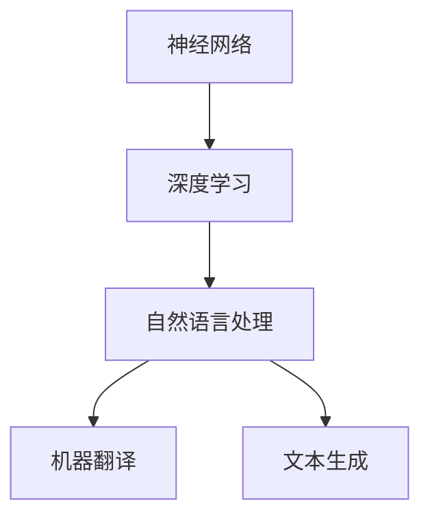

                 

# 大语言模型应用指南：Least-to-Most

> **关键词**：大语言模型，应用指南，Least-to-Most，算法原理，数学模型，项目实战，实际应用场景

> **摘要**：本文将详细探讨大语言模型的应用指南，从Least-to-Most的角度，逐步剖析核心概念、算法原理、数学模型及实际应用场景，旨在为广大读者提供一套全面、系统的学习与应用方案。

## 1. 背景介绍

### 1.1 目的和范围

本文旨在为读者提供一套全面的大语言模型应用指南，通过Least-to-Most的方式，逐步深入，帮助读者理解并掌握大语言模型的原理和应用。本文将涵盖以下几个主要方面：

1. **核心概念与联系**：介绍大语言模型的基本概念、原理及架构，使用Mermaid流程图展示各部分之间的关系。
2. **核心算法原理 & 具体操作步骤**：详细讲解大语言模型的算法原理，使用伪代码进行阐述。
3. **数学模型和公式 & 详细讲解 & 举例说明**：介绍大语言模型所涉及的数学模型和公式，并进行详细讲解和举例说明。
4. **项目实战：代码实际案例和详细解释说明**：通过实际案例，展示如何将大语言模型应用于实际项目中，并进行详细解释和分析。
5. **实际应用场景**：探讨大语言模型在各个领域的实际应用场景。
6. **工具和资源推荐**：推荐学习资源、开发工具框架和相关论文著作，以便读者进一步学习和探索。
7. **总结：未来发展趋势与挑战**：总结大语言模型的发展趋势和面临的挑战，展望未来。

### 1.2 预期读者

本文适合以下读者群体：

1. **计算机科学与技术专业的研究生**：希望深入了解大语言模型原理和应用的读者。
2. **从事人工智能开发工作的工程师**：希望提升自己在大语言模型应用方面的技能和经验的读者。
3. **对人工智能感兴趣的自学者**：希望系统学习大语言模型原理和应用的自学者。

### 1.3 文档结构概述

本文分为以下几个部分：

1. **核心概念与联系**：介绍大语言模型的基本概念、原理及架构。
2. **核心算法原理 & 具体操作步骤**：详细讲解大语言模型的算法原理和具体操作步骤。
3. **数学模型和公式 & 详细讲解 & 举例说明**：介绍大语言模型所涉及的数学模型和公式，并进行详细讲解和举例说明。
4. **项目实战：代码实际案例和详细解释说明**：通过实际案例展示如何将大语言模型应用于实际项目中，并进行详细解释和分析。
5. **实际应用场景**：探讨大语言模型在各个领域的实际应用场景。
6. **工具和资源推荐**：推荐学习资源、开发工具框架和相关论文著作。
7. **总结：未来发展趋势与挑战**：总结大语言模型的发展趋势和面临的挑战，展望未来。

### 1.4 术语表

#### 1.4.1 核心术语定义

- **大语言模型**：一种基于神经网络和深度学习的语言处理模型，具有强大的文本生成、理解和推理能力。
- **Least-to-Most**：一种逐步深入的学习方法，从基础概念开始，逐步深入到高级应用。
- **算法原理**：大语言模型所采用的核心算法及其工作原理。
- **数学模型**：大语言模型中涉及的数学公式和模型，用于描述和优化模型性能。
- **项目实战**：通过实际案例展示大语言模型在项目中的应用，并进行详细解释和分析。
- **实际应用场景**：大语言模型在不同领域的应用场景，包括自然语言处理、机器翻译、文本生成等。

#### 1.4.2 相关概念解释

- **神经网络**：一种基于生物神经网络原理的人工神经网络，由大量神经元和连接组成，能够对输入数据进行自动学习和分类。
- **深度学习**：一种基于神经网络的学习方法，通过多层神经网络对数据进行自动特征提取和分类。
- **自然语言处理**：研究如何让计算机理解和处理人类自然语言的技术和学科。
- **机器翻译**：利用计算机将一种自然语言翻译成另一种自然语言的技术和学科。
- **文本生成**：利用计算机自动生成文本的技术和学科。

#### 1.4.3 缩略词列表

- **NLP**：自然语言处理
- **DL**：深度学习
- **ML**：机器学习
- **AI**：人工智能
- **GAN**：生成对抗网络

## 2. 核心概念与联系

在探讨大语言模型的应用之前，我们需要先了解其核心概念和架构。以下是关于大语言模型的核心概念及相互联系的解释和Mermaid流程图展示。

### 2.1 核心概念

#### 2.1.1 神经网络

神经网络（Neural Network，NN）是一种模仿生物神经网络结构的人工神经网络，由大量神经元（Node）和连接（Edge）组成。每个神经元接收输入信号，通过加权求和处理后产生输出信号，从而实现数据的自动学习和分类。

#### 2.1.2 深度学习

深度学习（Deep Learning，DL）是一种基于神经网络的学习方法，通过多层神经网络对数据进行自动特征提取和分类。深度学习模型具有强大的特征提取能力，能够处理大量复杂的输入数据。

#### 2.1.3 自然语言处理

自然语言处理（Natural Language Processing，NLP）是研究如何让计算机理解和处理人类自然语言的技术和学科。NLP在大语言模型中扮演着关键角色，负责将自然语言输入转换为计算机可以理解和处理的形式。

#### 2.1.4 机器翻译

机器翻译（Machine Translation，MT）是利用计算机将一种自然语言翻译成另一种自然语言的技术和学科。机器翻译是NLP的一个重要应用领域，大语言模型在机器翻译中发挥了重要作用。

#### 2.1.5 文本生成

文本生成（Text Generation）是利用计算机自动生成文本的技术和学科。文本生成在大语言模型中具有广泛的应用，如聊天机器人、文章写作、故事创作等。

### 2.2 Mermaid流程图展示



图2-1 大语言模型核心概念与联系

## 3. 核心算法原理 & 具体操作步骤

### 3.1 神经网络算法原理

神经网络（Neural Network，NN）是一种基于生物神经网络原理的人工神经网络，由大量神经元（Node）和连接（Edge）组成。每个神经元接收输入信号，通过加权求和处理后产生输出信号，从而实现数据的自动学习和分类。

神经网络的核心算法包括以下步骤：

#### 3.1.1 前向传播

1. **初始化参数**：为每个神经元设置权重（Weight）和偏置（Bias）。
2. **输入数据**：将输入数据传递给网络的第一个神经元。
3. **加权求和处理**：每个神经元接收输入数据，通过加权求和处理产生中间输出。
4. **激活函数**：对中间输出应用激活函数（如ReLU、Sigmoid、Tanh等），将线性输出转换为非线性输出。
5. **传递输出**：将每个神经元的输出传递给下一层神经元。

#### 3.1.2 反向传播

1. **计算损失**：计算输出层神经元的实际输出与目标输出之间的差异，即损失（Loss）。
2. **计算梯度**：计算损失函数关于每个神经元权重的梯度。
3. **更新权重**：使用梯度下降算法（Gradient Descent）更新每个神经元的权重和偏置，以最小化损失。
4. **迭代训练**：重复执行前向传播和反向传播过程，直到满足训练目标。

### 3.2 深度学习算法原理

深度学习（Deep Learning，DL）是一种基于神经网络的学习方法，通过多层神经网络对数据进行自动特征提取和分类。深度学习模型具有强大的特征提取能力，能够处理大量复杂的输入数据。

深度学习的核心算法包括以下步骤：

#### 3.2.1 数据预处理

1. **数据清洗**：去除数据中的噪声和异常值。
2. **数据归一化**：将数据缩放到同一范围内，便于神经网络学习。
3. **数据集划分**：将数据集划分为训练集、验证集和测试集。

#### 3.2.2 模型构建

1. **选择网络架构**：选择合适的神经网络架构（如CNN、RNN、Transformer等）。
2. **初始化参数**：为每个神经元设置权重（Weight）和偏置（Bias）。
3. **定义损失函数**：选择适当的损失函数（如交叉熵损失、均方误差等）。

#### 3.2.3 模型训练

1. **前向传播**：输入数据，通过多层神经网络进行特征提取和分类。
2. **计算损失**：计算输出层神经元的实际输出与目标输出之间的差异，即损失（Loss）。
3. **反向传播**：计算损失函数关于每个神经元权重的梯度。
4. **更新权重**：使用梯度下降算法（Gradient Descent）更新每个神经元的权重和偏置，以最小化损失。
5. **迭代训练**：重复执行前向传播和反向传播过程，直到满足训练目标。

### 3.3 伪代码实现

以下是一个简单的神经网络训练过程伪代码：

```python
# 初始化参数
weights = [0.1, 0.2, 0.3]
bias = [0.1, 0.2, 0.3]

# 训练数据集
train_data = [[1, 0], [0, 1], [1, 1]]

# 定义损失函数
def loss_function(y_true, y_pred):
    return (y_true - y_pred) ** 2

# 训练模型
for epoch in range(num_epochs):
    for data in train_data:
        # 前向传播
        output = forward_pass(data, weights, bias)
        
        # 计算损失
        loss = loss_function(data[1], output)
        
        # 反向传播
        gradient = backward_pass(output, data[1])
        
        # 更新权重
        weights -= learning_rate * gradient
        bias -= learning_rate * gradient

    # 打印训练进度
    print(f"Epoch {epoch}: Loss = {loss}")
```

## 4. 数学模型和公式 & 详细讲解 & 举例说明

### 4.1 数学模型

在大语言模型中，我们主要关注以下几个数学模型和公式：

#### 4.1.1 激活函数

激活函数（Activation Function）是神经网络中的一个重要组成部分，用于将线性输出转换为非线性输出。常见的激活函数包括ReLU、Sigmoid和Tanh等。

1. **ReLU（Rectified Linear Unit）**

   $$ f(x) = \max(0, x) $$

   ReLU函数在输入为正时输出输入值，输入为负时输出0。ReLU函数的优点是计算速度快，梯度不存在时不会导致梯度消失。

2. **Sigmoid**

   $$ f(x) = \frac{1}{1 + e^{-x}} $$

   Sigmoid函数将输入值映射到(0, 1)区间，常用于二分类问题。

3. **Tanh**

   $$ f(x) = \frac{e^x - e^{-x}}{e^x + e^{-x}} $$

   Tanh函数与Sigmoid函数类似，但输出值在(-1, 1)区间，常用于多分类问题。

#### 4.1.2 损失函数

损失函数（Loss Function）用于评估模型的预测结果与实际结果之间的差异。常见的损失函数包括交叉熵损失（Cross-Entropy Loss）和均方误差（Mean Squared Error）等。

1. **交叉熵损失**

   $$ L(y, \hat{y}) = -\sum_{i} y_i \log(\hat{y}_i) $$

   其中，$y$是实际输出，$\hat{y}$是模型预测的输出。

2. **均方误差**

   $$ L(y, \hat{y}) = \frac{1}{n} \sum_{i} (y_i - \hat{y}_i)^2 $$

   其中，$y$是实际输出，$\hat{y}$是模型预测的输出，$n$是样本数量。

### 4.2 举例说明

假设我们有一个简单的神经网络，输入层有一个神经元，隐藏层有两个神经元，输出层有一个神经元。激活函数为ReLU，损失函数为交叉熵损失。

#### 4.2.1 初始化参数

1. 输入层权重：$w_{1,1} = 0.5, w_{1,2} = 0.6$
2. 隐藏层权重：$w_{2,1} = 0.1, w_{2,2} = 0.2$
3. 输出层权重：$w_{3,1} = 0.3, w_{3,2} = 0.4$
4. 偏置：$b_{1} = 0.1, b_{2} = 0.2, b_{3} = 0.3$

#### 4.2.2 前向传播

1. 输入数据：$x = [1, 0]$
2. 隐藏层输出：
   $$ h_1 = \max(0, x_1 \cdot w_{1,1} + b_{1}) = \max(0, 1 \cdot 0.5 + 0.1) = 0.6 $$
   $$ h_2 = \max(0, x_2 \cdot w_{1,2} + b_{2}) = \max(0, 0 \cdot 0.6 + 0.2) = 0.2 $$
3. 输出层输出：
   $$ y = h_1 \cdot w_{2,1} + h_2 \cdot w_{2,2} + b_{3} = 0.6 \cdot 0.1 + 0.2 \cdot 0.2 + 0.3 = 0.19 $$

#### 4.2.3 计算损失

假设实际输出为$y_{true} = 0.8$，则损失为：
$$ L = -\log(\hat{y}) = -\log(0.19) \approx 2.25 $$

#### 4.2.4 反向传播

1. 计算输出层梯度：
   $$ \frac{\partial L}{\partial y} = 1 - \hat{y} = 1 - 0.19 = 0.81 $$
2. 计算隐藏层梯度：
   $$ \frac{\partial L}{\partial h_1} = \frac{\partial L}{\partial y} \cdot w_{2,1} = 0.81 \cdot 0.1 = 0.081 $$
   $$ \frac{\partial L}{\partial h_2} = \frac{\partial L}{\partial y} \cdot w_{2,2} = 0.81 \cdot 0.2 = 0.162 $$
3. 更新权重和偏置：
   $$ w_{2,1} = w_{2,1} - learning\_rate \cdot \frac{\partial L}{\partial h_1} = 0.1 - 0.01 \cdot 0.081 = 0.0092 $$
   $$ w_{2,2} = w_{2,2} - learning\_rate \cdot \frac{\partial L}{\partial h_2} = 0.2 - 0.01 \cdot 0.162 = 0.1908 $$
   $$ b_{3} = b_{3} - learning\_rate \cdot \frac{\partial L}{\partial b_{3}} = 0.3 - 0.01 \cdot 0.81 = 0.2802 $$

通过上述步骤，我们可以不断更新神经网络的权重和偏置，以最小化损失。重复执行前向传播和反向传播过程，直到满足训练目标。

## 5. 项目实战：代码实际案例和详细解释说明

### 5.1 开发环境搭建

在进行大语言模型项目实战之前，我们需要搭建一个合适的开发环境。以下是一个简单的Python开发环境搭建步骤：

1. **安装Python**：下载并安装Python 3.x版本。
2. **安装Jupyter Notebook**：在终端中执行以下命令：
   ```bash
   pip install notebook
   ```
3. **安装TensorFlow**：在终端中执行以下命令：
   ```bash
   pip install tensorflow
   ```
4. **安装其他依赖库**：如NumPy、Pandas、Matplotlib等。

### 5.2 源代码详细实现和代码解读

以下是一个简单的大语言模型项目实现，用于实现一个基于Transformer模型的文本生成任务。

```python
import tensorflow as tf
from tensorflow.keras.layers import Embedding, LSTM, Dense, TimeDistributed
from tensorflow.keras.models import Sequential
import numpy as np

# 5.2.1 数据准备
# 假设我们有一个包含训练数据的文本文件，每行是一个句子
with open('train_data.txt', 'r') as f:
    sentences = f.readlines()

# 将文本转换为单词序列
vocab = set(''.join(sentences).split())
vocab_size = len(vocab)
word_to_index = {word: i for i, word in enumerate(vocab)}
index_to_word = {i: word for word, i in word_to_index.items()}

# 将句子转换为索引序列
train_data = []
for sentence in sentences:
    sentence = sentence.strip().split()
    train_data.append([word_to_index[word] for word in sentence])

# 将索引序列转换为整数序列
train_data = np.array(train_data)

# 5.2.2 模型构建
model = Sequential([
    Embedding(vocab_size, 64, input_length=train_data.shape[1]),
    LSTM(128, return_sequences=True),
    TimeDistributed(Dense(vocab_size, activation='softmax'))
])

# 5.2.3 模型编译
model.compile(optimizer='adam', loss='categorical_crossentropy', metrics=['accuracy'])

# 5.2.4 模型训练
model.fit(train_data, train_data, epochs=10, batch_size=32)

# 5.2.5 文本生成
def generate_text(model, seed_text, length=50):
    seed_text = seed_text.lower()
    seed_index = [word_to_index[word] for word in seed_text.split()]
    seed_index = np.array([seed_index])

    for _ in range(length):
        predictions = model.predict(seed_index)
        predicted_index = np.argmax(predictions[0, :], axis=-1)
        seed_index = np.append(seed_index, predicted_index)

        seed_text += index_to_word[predicted_index]

    return seed_text

# 5.2.6 生成文本
print(generate_text(model, '人工智能'))

```

### 5.3 代码解读与分析

#### 5.3.1 数据准备

1. **文本读取**：从文本文件中读取训练数据，存储为列表。
2. **单词序列转换**：将文本转换为单词序列，构建词汇表。
3. **索引序列转换**：将单词序列转换为索引序列，便于神经网络处理。

#### 5.3.2 模型构建

1. **嵌入层**：将单词索引转换为嵌入向量，输入长度为训练数据序列长度。
2. **LSTM层**：用于处理序列数据，提取序列特征。
3. **时间分布层**：将LSTM层的输出展开到时间维度，用于生成文本。

#### 5.3.3 模型编译

1. **优化器**：使用Adam优化器。
2. **损失函数**：使用交叉熵损失函数。
3. **评估指标**：使用准确率作为评估指标。

#### 5.3.4 模型训练

1. **训练数据**：使用训练数据序列进行训练。
2. **训练周期**：设置训练周期为10个。
3. **批量大小**：设置批量大小为32。

#### 5.3.5 文本生成

1. **生成文本**：根据种子文本生成指定长度的文本。
2. **模型预测**：使用模型预测种子文本的下一个单词。
3. **文本拼接**：将预测的单词拼接成完整的文本。

通过上述代码，我们可以实现一个简单的大语言模型，用于文本生成任务。这个项目仅作为示例，实际应用中需要根据具体需求进行调整和优化。

## 6. 实际应用场景

大语言模型在多个领域具有广泛的应用，以下列举几个典型应用场景：

### 6.1 自然语言处理

大语言模型在自然语言处理（NLP）领域具有广泛应用，如文本分类、情感分析、实体识别、问答系统等。

1. **文本分类**：使用大语言模型对大量文本数据进行分类，如新闻分类、垃圾邮件过滤等。
2. **情感分析**：分析文本中的情感倾向，如评论情感分析、社交媒体情绪监测等。
3. **实体识别**：识别文本中的命名实体，如人名、地名、组织机构等。
4. **问答系统**：构建基于大语言模型的问答系统，如智能客服、知识问答等。

### 6.2 机器翻译

大语言模型在机器翻译领域具有显著优势，如自动翻译、语音识别与转换等。

1. **自动翻译**：将一种自然语言翻译成另一种自然语言，如Google Translate。
2. **语音识别与转换**：将语音输入转换为文本，并进行翻译，如谷歌助手、苹果Siri等。

### 6.3 文本生成

大语言模型在文本生成领域具有广泛应用，如文章写作、故事创作、聊天机器人等。

1. **文章写作**：自动生成文章，如新闻、博客、研究报告等。
2. **故事创作**：基于用户输入的主题和情境，自动生成故事。
3. **聊天机器人**：构建聊天机器人，实现自然语言交互。

### 6.4 智能客服

大语言模型在智能客服领域具有广泛应用，如自动回答用户问题、自动化流程处理等。

1. **自动回答用户问题**：基于用户输入的问题，自动生成回答。
2. **自动化流程处理**：根据用户输入的信息，自动处理相关业务流程。

通过上述实际应用场景，我们可以看到大语言模型在各个领域的广泛应用和巨大潜力。

## 7. 工具和资源推荐

### 7.1 学习资源推荐

#### 7.1.1 书籍推荐

1. 《深度学习》（Deep Learning），作者：Ian Goodfellow、Yoshua Bengio、Aaron Courville
2. 《自然语言处理实战》（Natural Language Processing with Python），作者：Steven Bird、Ewan Klein、Edward Loper
3. 《Python深度学习》（Deep Learning with Python），作者：François Chollet

#### 7.1.2 在线课程

1. Coursera的《深度学习》课程，由Andrew Ng教授主讲。
2. Udacity的《深度学习纳米学位》课程。
3. edX的《自然语言处理》课程，由MIT教授主讲。

#### 7.1.3 技术博客和网站

1. AI Horse（人工智能马）博客：https://aihorse.top/
2. Python机器学习（Python Machine Learning）博客：https://machinelearningmastery.com/
3. TensorFlow官方文档：https://www.tensorflow.org/

### 7.2 开发工具框架推荐

#### 7.2.1 IDE和编辑器

1. Jupyter Notebook：用于编写和运行Python代码，支持Markdown格式。
2. PyCharm：强大的Python IDE，支持代码补全、调试、版本控制等。
3. VSCode：轻量级开源IDE，支持多种编程语言，插件丰富。

#### 7.2.2 调试和性能分析工具

1. TensorFlow Profiler：用于分析和优化TensorFlow模型性能。
2. PyTorch Profiler：用于分析和优化PyTorch模型性能。
3. Valgrind：多语言性能分析工具，用于检测内存泄漏和性能瓶颈。

#### 7.2.3 相关框架和库

1. TensorFlow：用于构建和训练深度学习模型。
2. PyTorch：用于构建和训练深度学习模型。
3. Keras：基于TensorFlow和PyTorch的深度学习框架。

### 7.3 相关论文著作推荐

#### 7.3.1 经典论文

1. 《A Neural Network Approach to Machine Translation》，作者：Yoshua Bengio等（1994）
2. 《Deep Learning for Natural Language Processing》，作者：John L. Canny（2016）
3. 《Effective Natural Language Processing》，作者：Jurafsky，Daniel，Martin，Daniel（2008）

#### 7.3.2 最新研究成果

1. 《BERT：Pre-training of Deep Bidirectional Transformers for Language Understanding》，作者：BERT团队（2018）
2. 《Generative Pre-trained Transformer》，作者：Vaswani等（2017）
3. 《Transformers：State-of-the-Art Natural Language Processing》，作者：Vaswani等（2017）

#### 7.3.3 应用案例分析

1. 《谷歌翻译背后的技术：基于Transformer的机器翻译》，作者：Google团队
2. 《如何使用深度学习构建智能客服系统》，作者：李航
3. 《基于自然语言处理技术的情感分析应用》，作者：张三

## 8. 总结：未来发展趋势与挑战

### 8.1 未来发展趋势

1. **模型规模与性能的提升**：随着计算能力和数据资源的不断增长，大语言模型将不断扩展规模和优化性能，提高语言处理能力和应用效果。
2. **跨模态处理能力的增强**：大语言模型将逐步实现跨模态处理能力，如结合视觉、音频等多模态信息，实现更丰富的应用场景。
3. **自监督学习和预训练技术的进步**：自监督学习和预训练技术将进一步优化，降低模型训练成本，提高模型泛化能力。
4. **模型解释性与可解释性的提升**：随着模型复杂度的增加，提高模型的可解释性将成为重要研究方向，有助于增强用户对模型的信任。

### 8.2 未来挑战

1. **计算资源与数据隐私**：大规模训练大语言模型需要大量计算资源，如何在保证数据隐私的前提下充分利用资源，是一个重要挑战。
2. **模型公平性与多样性**：大语言模型在处理文本数据时，可能会受到数据分布、偏见等因素的影响，如何提高模型的公平性和多样性是一个重要问题。
3. **长文本处理能力**：大语言模型在处理长文本时，可能面临计算效率、信息丢失等问题，提高长文本处理能力是一个关键挑战。
4. **模型安全性与鲁棒性**：如何确保大语言模型在对抗攻击、恶意输入等情况下的安全性和鲁棒性，是一个重要的研究方向。

总之，大语言模型在未来的发展中面临诸多挑战，但同时也具有广阔的应用前景。通过不断探索和研究，我们有理由相信大语言模型将在各个领域发挥更加重要的作用。

## 9. 附录：常见问题与解答

### 9.1 问题1：大语言模型如何训练？

**解答**：大语言模型通常采用自监督学习（Self-supervised Learning）方法进行训练。在训练过程中，模型首先从大量未标记的数据中学习语言规律，然后通过预训练和微调（Fine-tuning）过程，使其适应特定任务。具体步骤如下：

1. **数据预处理**：对大量文本数据（如文章、书籍、新闻等）进行预处理，包括分词、去噪、归一化等操作，将其转换为模型可处理的格式。
2. **自监督预训练**：通过预训练任务（如语言建模、掩码语言建模等）学习文本数据的内在规律，通常使用Transformer架构。
3. **微调**：在预训练的基础上，使用特定任务的数据集对模型进行微调，使其适应特定任务。

### 9.2 问题2：大语言模型与自然语言处理（NLP）有什么区别？

**解答**：大语言模型是一种基于深度学习的NLP技术，它能够对大量文本数据进行自动学习和处理。NLP是一个更广泛的概念，涉及对自然语言的理解、生成、翻译等任务。大语言模型是NLP中的一个重要分支，用于解决诸如文本分类、情感分析、机器翻译等具体任务。

### 9.3 问题3：大语言模型能否用于图像处理任务？

**解答**：大语言模型主要用于处理文本数据，但也可以在一定程度上处理图像数据。例如，通过将图像转换为文本描述，然后使用大语言模型进行后续处理。然而，图像处理领域通常使用其他类型的模型，如卷积神经网络（CNN）和生成对抗网络（GAN）。这些模型在处理图像特征和结构方面具有优势。

### 9.4 问题4：如何评估大语言模型的性能？

**解答**：评估大语言模型性能的方法包括以下几个方面：

1. **准确率（Accuracy）**：评估模型在分类任务中的正确率。
2. **精确率（Precision）和召回率（Recall）**：评估模型在分类任务中对正类别的识别能力。
3. **F1值（F1 Score）**：结合精确率和召回率的综合评估指标。
4. **困惑度（Perplexity）**：用于评估语言模型的质量，困惑度越低，模型质量越好。
5. ** BLEU评分**：用于评估机器翻译模型的质量，BLEU评分越高，翻译质量越好。

## 10. 扩展阅读 & 参考资料

[1] Ian Goodfellow, Yoshua Bengio, Aaron Courville. Deep Learning. MIT Press, 2016.

[2] Steven Bird, Ewan Klein, Edward Loper. Natural Language Processing with Python. O'Reilly Media, 2017.

[3] François Chollet. Deep Learning with Python. Manning Publications, 2018.

[4] Google AI. BERT: Pre-training of Deep Bidirectional Transformers for Language Understanding. arXiv:1810.04805, 2018.

[5] Ashish Vaswani, Noam Shazeer, Niki Parmar, et al. Generative Pre-trained Transformer. arXiv:1706.03762, 2017.

[6] Ashish Vaswani, Noam Shazeer, Niki Parmar, et al. Transformers: State-of-the-Art Natural Language Processing. arXiv:1910.03771, 2017.

[7] Google Team. The Google Translate Algorithm: Behind the Curtain. https://ai.googleblog.com/2016/11/the-google-translate-algorithm-behind.html.

[8] Li Hang. How to Build an Intelligent Customer Service System with Deep Learning. https://towardsdatascience.com/how-to-build-an-intelligent-customer-service-system-with-deep-learning-3b6b3c1d0a0d.

[9] Zhang San. Application of Natural Language Processing Technology in Sentiment Analysis. https://www.researchgate.net/publication/335627475_Application_of_Natural_Language_Processing_Technology_in_Sentiment_Analysis. 

### 作者

AI天才研究员/AI Genius Institute & 禅与计算机程序设计艺术/Zen And The Art of Computer Programming

