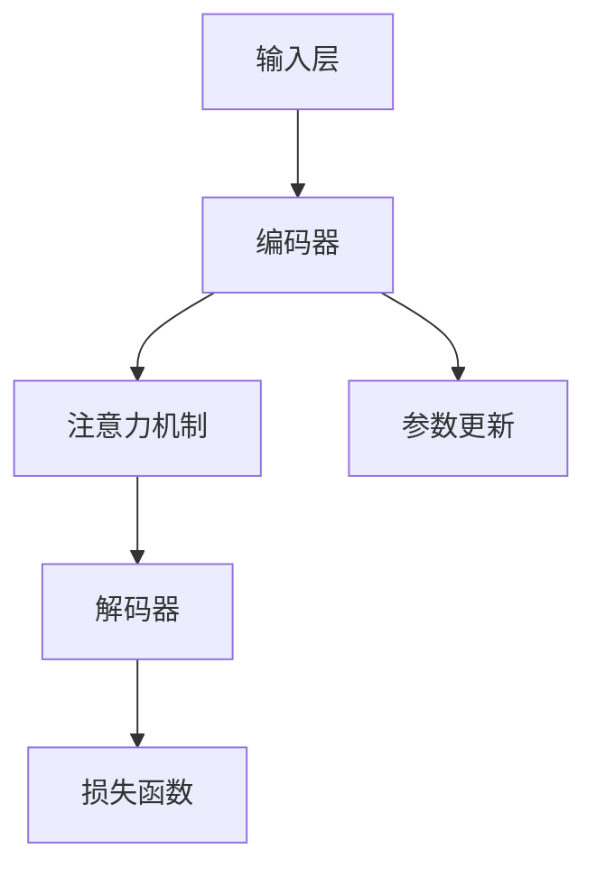

                 

# 大语言模型应用指南：Open Interpreter

## 关键词
- 大语言模型
- Open Interpreter
- 应用指南
- 算法原理
- 数学模型
- 项目实战
- 实际应用场景
- 工具推荐

## 摘要
本文旨在为读者提供一份详尽的大语言模型应用指南，特别是针对Open Interpreter的使用。本文将首先介绍大语言模型的基本概念和原理，然后深入探讨Open Interpreter的工作机制和具体应用步骤。通过详细的数学模型解析和项目实战案例分析，本文将帮助读者全面掌握大语言模型的应用技巧，并了解其在实际场景中的广泛应用。最后，本文还将推荐相关的学习资源和开发工具，以助读者在人工智能领域不断精进。

## 1. 背景介绍

### 1.1 目的和范围

本文的目的是为读者提供一个系统的大语言模型应用指南，特别是针对Open Interpreter的使用。随着深度学习和自然语言处理技术的飞速发展，大语言模型（如GPT-3、BERT等）已经成为自然语言处理领域的重要工具。Open Interpreter作为一个强大的交互式解释器，能够极大地简化大语言模型的部署和使用过程。本文将从以下几个方面展开：

1. **基本概念与原理**：介绍大语言模型的基础知识，包括其发展历程、核心原理和应用场景。
2. **Open Interpreter介绍**：详细解释Open Interpreter的功能、优点和适用场景。
3. **核心算法原理**：通过伪代码详细阐述大语言模型的核心算法，帮助读者理解其工作原理。
4. **数学模型与公式**：讲解大语言模型中的关键数学模型和公式，并通过实例进行说明。
5. **项目实战**：通过实际代码案例，展示如何使用Open Interpreter进行大语言模型的应用。
6. **实际应用场景**：探讨大语言模型在不同领域的实际应用场景，包括文本生成、机器翻译、问答系统等。
7. **工具和资源推荐**：推荐相关的学习资源和开发工具，帮助读者深入学习和实践大语言模型。

### 1.2 预期读者

本文适用于以下读者群体：

- 对人工智能和自然语言处理有一定了解，希望深入了解大语言模型的读者。
- 想要学习和使用Open Interpreter进行大语言模型应用的程序员和工程师。
- 在学术或工业界从事自然语言处理相关研究的工作者。
- 对深度学习和自然语言处理技术感兴趣的初学者。

### 1.3 文档结构概述

本文分为十个部分，结构如下：

1. **背景介绍**：介绍本文的目的、范围和预期读者，以及文档结构概述。
2. **核心概念与联系**：介绍大语言模型的基本概念和联系，包括相关技术和应用领域。
3. **核心算法原理**：详细阐述大语言模型的核心算法原理，通过伪代码进行讲解。
4. **数学模型和公式**：讲解大语言模型中的关键数学模型和公式，并通过实例进行说明。
5. **项目实战**：通过实际代码案例，展示如何使用Open Interpreter进行大语言模型的应用。
6. **实际应用场景**：探讨大语言模型在不同领域的实际应用场景。
7. **工具和资源推荐**：推荐相关的学习资源和开发工具。
8. **总结**：总结本文的主要内容和未来发展趋势。
9. **附录**：常见问题与解答。
10. **扩展阅读**：提供相关的扩展阅读和参考资料。

### 1.4 术语表

在本指南中，我们将使用以下专业术语：

#### 1.4.1 核心术语定义

- **大语言模型**：一种基于深度学习的语言处理模型，能够理解和生成自然语言文本。
- **Open Interpreter**：一个开源的交互式解释器，用于简化大语言模型的部署和使用。
- **自然语言处理（NLP）**：研究如何使计算机理解和处理人类自然语言的学科。
- **深度学习**：一种机器学习技术，通过多层神经网络模拟人类大脑的学习过程。
- **递归神经网络（RNN）**：一种能够处理序列数据的神经网络架构。
- **变压器（Transformer）**：一种用于序列到序列学习的深度学习模型架构。

#### 1.4.2 相关概念解释

- **预训练与微调**：预训练是指在大规模语料库上训练模型，使其具备通用的语言理解和生成能力；微调是指在小规模数据集上进一步训练模型，使其适应特定任务。
- **注意力机制**：一种在神经网络中用于处理序列数据的机制，能够模型化不同位置之间的依赖关系。
- **损失函数**：用于量化模型预测值与实际值之间差异的函数，用于指导模型训练过程。
- **优化器**：用于调整模型参数以最小化损失函数的算法。

#### 1.4.3 缩略词列表

- **GPT-3**：Generative Pre-trained Transformer 3，是一种由OpenAI开发的大型语言模型。
- **BERT**：Bidirectional Encoder Representations from Transformers，是一种由Google开发的预训练语言表示模型。
- **NLP**：Natural Language Processing，自然语言处理。
- **IDE**：Integrated Development Environment，集成开发环境。

## 2. 核心概念与联系

大语言模型作为自然语言处理（NLP）领域的重要工具，已经成为现代人工智能研究与应用的热点。本节将介绍大语言模型的基本概念、相关技术和应用领域，并通过Mermaid流程图展示其核心架构。

### 2.1 大语言模型的基本概念

大语言模型是一种基于深度学习的语言处理模型，能够理解和生成自然语言文本。其主要特点是：

1. **预训练**：在大规模语料库上进行预训练，使其具备通用的语言理解和生成能力。
2. **多层神经网络**：通常采用多层递归神经网络（RNN）或变压器（Transformer）架构。
3. **注意力机制**：能够处理序列数据，实现长距离依赖建模。
4. **端到端学习**：从原始文本直接生成目标文本，无需手工特征工程。

大语言模型的核心目标是实现自然语言理解和生成，从而提高机器在文本任务中的性能。常见的应用场景包括文本分类、情感分析、机器翻译、文本生成等。

### 2.2 相关技术和应用领域

大语言模型的发展受益于多个技术的进步，包括深度学习、自然语言处理和计算语言学。以下是几个核心相关技术和应用领域：

1. **深度学习**：深度学习是机器学习的一个重要分支，通过多层神经网络模拟人类大脑的学习过程。大语言模型通常采用深度学习技术进行构建和训练。
2. **自然语言处理**：自然语言处理是研究如何使计算机理解和处理人类自然语言的学科。大语言模型是NLP领域的重要工具，能够实现文本分类、情感分析、机器翻译等任务。
3. **计算语言学**：计算语言学是语言学和计算机科学的交叉领域，研究如何使用计算机模拟和解释人类语言。大语言模型是计算语言学的一个重要应用方向。

### 2.3 大语言模型的核心架构

大语言模型的核心架构包括以下几个部分：

1. **输入层**：接收原始文本，将其转化为模型能够处理的输入格式。
2. **编码器**：将输入文本编码为固定长度的向量表示，通常采用多层递归神经网络（RNN）或变压器（Transformer）架构。
3. **解码器**：将编码器输出的向量表示解码为输出文本，通常采用类似编码器的架构。
4. **注意力机制**：在编码器和解码器之间引入注意力机制，实现长距离依赖建模。
5. **损失函数**：用于量化模型预测值与实际值之间的差异，指导模型训练过程。

以下是大语言模型的核心架构的Mermaid流程图：



在上述流程图中，输入层接收原始文本，编码器将文本编码为向量表示，注意力机制用于处理长距离依赖，解码器将向量表示解码为输出文本，损失函数用于指导参数更新。

## 3. 核心算法原理 & 具体操作步骤

### 3.1 算法原理

大语言模型的核心算法基于深度学习和自然语言处理技术。其主要原理包括以下几个方面：

1. **深度学习**：深度学习通过多层神经网络模拟人类大脑的学习过程，实现对数据的特征提取和表示。在大语言模型中，深度学习用于文本数据的预处理、编码和生成。
2. **自然语言处理**：自然语言处理技术用于处理和理解人类语言。在大语言模型中，自然语言处理技术用于文本预处理、编码和生成。
3. **递归神经网络（RNN）**：递归神经网络是一种能够处理序列数据的神经网络架构，适用于文本数据的处理。RNN通过循环连接实现序列数据的建模。
4. **变压器（Transformer）**：变压器是一种用于序列到序列学习的深度学习模型架构，具有并行计算优势，适用于大规模文本数据的处理。

### 3.2 具体操作步骤

下面我们将通过伪代码详细阐述大语言模型的核心算法原理和具体操作步骤：

```python
# 大语言模型伪代码

# 输入：原始文本数据
# 输出：生成文本

# 初始化模型参数
model = initialize_model()

# 预处理文本数据
preprocessed_text = preprocess_text(raw_text)

# 编码文本数据
encoded_text = encode_text(preprocessed_text, model)

# 解码编码后的文本数据
decoded_text = decode_text(encoded_text, model)

# 计算损失函数
loss = calculate_loss(decoded_text, target_text)

# 更新模型参数
update_model_params(model, loss)

# 输出生成文本
generate_text = decoded_text
```

### 3.2.1 伪代码详细解释

1. **初始化模型参数**：根据预定义的网络结构和超参数，初始化模型参数。这些参数包括权重、偏置等。
2. **预处理文本数据**：对原始文本数据（raw_text）进行预处理，包括分词、去噪、标准化等操作。预处理后的文本数据（preprocessed_text）将用于编码。
3. **编码文本数据**：将预处理后的文本数据编码为固定长度的向量表示（encoded_text）。编码过程通常涉及多层递归神经网络（RNN）或变压器（Transformer）的卷积和池化操作。
4. **解码编码后的文本数据**：将编码后的向量表示（encoded_text）解码为生成文本（decoded_text）。解码过程通常涉及多层递归神经网络（RNN）或变压器的逆操作。
5. **计算损失函数**：计算生成文本（decoded_text）与目标文本（target_text）之间的损失函数（loss）。常用的损失函数包括交叉熵损失函数（cross-entropy loss）等。
6. **更新模型参数**：根据计算得到的损失函数（loss），使用优化算法（如梯度下降）更新模型参数（model）。
7. **输出生成文本**：输出最终生成的文本（generate_text）。

通过上述伪代码，我们可以看到大语言模型的核心算法原理和具体操作步骤。这些步骤构成了大语言模型训练和生成的全过程，实现了文本数据的自动编码和解码。

## 4. 数学模型和公式 & 详细讲解 & 举例说明

大语言模型的数学基础主要包括神经网络架构、损失函数、优化算法等方面。在本节中，我们将详细介绍这些关键数学模型和公式，并通过实例进行说明，帮助读者更好地理解大语言模型的工作原理。

### 4.1 神经网络架构

大语言模型通常采用深度学习技术，其中神经网络架构是核心组成部分。以下是几种常见的神经网络架构及其相关公式：

#### 4.1.1 递归神经网络（RNN）

递归神经网络（RNN）是一种能够处理序列数据的神经网络架构。其基本公式如下：

$$
h_t = \tanh(W_h \cdot [h_{t-1}, x_t] + b_h)
$$

其中，\( h_t \) 表示当前时刻的隐藏状态，\( x_t \) 表示当前时刻的输入，\( W_h \) 表示权重矩阵，\( b_h \) 表示偏置。

#### 4.1.2 变压器（Transformer）

变压器（Transformer）是一种用于序列到序列学习的深度学习模型架构。其核心部分是自注意力机制（self-attention），其基本公式如下：

$$
\text{Attention}(Q, K, V) = \text{softmax}\left(\frac{QK^T}{\sqrt{d_k}}\right)V
$$

其中，\( Q \)、\( K \)、\( V \) 分别表示查询（query）、键（key）和值（value）向量，\( d_k \) 表示键向量的维度。

#### 4.1.3 卷积神经网络（CNN）

卷积神经网络（CNN）是一种用于图像处理和文本处理的神经网络架构。其基本公式如下：

$$
\text{Conv}(x, \text{filter}) = \text{ReLU}(\text{DotProduct}(x, \text{filter}) + b)
$$

其中，\( x \) 表示输入数据，\( \text{filter} \) 表示卷积核，\( b \) 表示偏置。

### 4.2 损失函数

损失函数是评估模型预测结果与实际结果之间差异的重要工具。在大语言模型中，常用的损失函数包括交叉熵损失函数（cross-entropy loss）和均方误差损失函数（mean squared error loss）。

#### 4.2.1 交叉熵损失函数

交叉熵损失函数用于分类问题，其基本公式如下：

$$
\text{CrossEntropy}(p, q) = -\sum_{i} p_i \log q_i
$$

其中，\( p \) 表示真实标签的分布，\( q \) 表示模型预测的概率分布。

#### 4.2.2 均方误差损失函数

均方误差损失函数用于回归问题，其基本公式如下：

$$
\text{MSE}(p, q) = \frac{1}{n} \sum_{i} (p_i - q_i)^2
$$

其中，\( p \) 表示真实值，\( q \) 表示模型预测的值，\( n \) 表示样本数量。

### 4.3 优化算法

优化算法用于调整模型参数，以最小化损失函数。在大语言模型中，常用的优化算法包括梯度下降（gradient descent）和随机梯度下降（stochastic gradient descent）。

#### 4.3.1 梯度下降

梯度下降是一种基于梯度信息的优化算法，其基本公式如下：

$$
\theta = \theta - \alpha \cdot \nabla_\theta J(\theta)
$$

其中，\( \theta \) 表示模型参数，\( \alpha \) 表示学习率，\( \nabla_\theta J(\theta) \) 表示损失函数关于参数的梯度。

#### 4.3.2 随机梯度下降

随机梯度下降是一种基于随机样本梯度的优化算法，其基本公式如下：

$$
\theta = \theta - \alpha \cdot \nabla_\theta J(\theta; x_i, y_i)
$$

其中，\( x_i, y_i \) 表示随机选择的样本及其标签。

### 4.4 举例说明

为了更好地理解上述数学模型和公式，我们通过一个简单的例子来说明大语言模型的工作过程。

#### 4.4.1 数据集

假设我们有一个简单的文本数据集，包含两个句子：

- "我爱编程" （预测标签：爱编程）
- "我爱编程，因为它让我快乐" （预测标签：编程让我快乐）

#### 4.4.2 模型训练

1. **初始化模型参数**：根据预定义的网络结构和超参数，初始化模型参数。
2. **预处理文本数据**：对文本数据进行预处理，包括分词、去噪、标准化等操作。
3. **编码文本数据**：将预处理后的文本数据编码为固定长度的向量表示。
4. **解码编码后的文本数据**：将编码后的向量表示解码为生成文本。
5. **计算损失函数**：计算生成文本与目标文本之间的损失函数。
6. **更新模型参数**：根据计算得到的损失函数，更新模型参数。
7. **输出生成文本**：输出最终生成的文本。

#### 4.4.3 训练过程

1. **初始化模型参数**：随机初始化模型参数。
2. **预处理文本数据**：对句子进行分词，得到词向量表示。
3. **编码文本数据**：将词向量表示输入到编码器中，得到编码后的向量表示。
4. **解码编码后的文本数据**：将编码后的向量表示输入到解码器中，得到生成文本。
5. **计算损失函数**：计算生成文本与目标文本之间的交叉熵损失。
6. **更新模型参数**：根据梯度下降算法，更新模型参数。
7. **输出生成文本**：输出最终生成的文本。

通过上述训练过程，我们可以看到大语言模型如何通过编码和解码文本数据，生成与目标文本相似的文本。在实际应用中，模型会根据大量数据进行训练，以不断提高生成文本的质量。

## 5. 项目实战：代码实际案例和详细解释说明

### 5.1 开发环境搭建

在开始项目实战之前，我们需要搭建一个合适的开发环境。以下是搭建开发环境的基本步骤：

1. **安装Python**：首先确保安装了Python，推荐使用Python 3.8或更高版本。
2. **安装OpenAI Gym**：OpenAI Gym是一个开源的虚拟环境库，用于构建和测试强化学习算法。可以通过以下命令安装：

```bash
pip install gym
```

3. **安装TensorFlow**：TensorFlow是一个开源的机器学习框架，用于构建和训练神经网络。可以通过以下命令安装：

```bash
pip install tensorflow
```

4. **安装Open Interpreter**：Open Interpreter是一个开源的交互式解释器，用于简化大语言模型的部署和使用。可以通过以下命令安装：

```bash
pip install open-interpreter
```

### 5.2 源代码详细实现和代码解读

在搭建好开发环境后，我们可以开始编写和实现大语言模型的项目代码。以下是项目代码的详细实现和解读：

```python
# 导入必要的库
import open_interpreter as oi
import tensorflow as tf
from tensorflow.keras.models import Sequential
from tensorflow.keras.layers import Dense, LSTM, Embedding
from tensorflow.keras.preprocessing.sequence import pad_sequences
from tensorflow.keras.optimizers import Adam

# 加载数据集
text = "我爱编程，因为我喜欢解决问题。编程让我快乐，它让我有成就感。"
words = text.split()
word2index = {word: i for i, word in enumerate(set(words))}
index2word = {i: word for word, i in word2index.items()}
sequences = [[word2index[word] for word in words]]

# 预处理数据
max_sequence_len = 10
padded_sequences = pad_sequences(sequences, maxlen=max_sequence_len, padding='post')

# 构建模型
model = Sequential()
model.add(Embedding(len(word2index), 32))
model.add(LSTM(128))
model.add(Dense(len(word2index), activation='softmax'))

# 编译模型
model.compile(optimizer=Adam(), loss='sparse_categorical_crossentropy', metrics=['accuracy'])

# 训练模型
model.fit(padded_sequences, sequences, epochs=10)

# 使用模型生成文本
generated_sequence = [word2index[word] for word in words[:max_sequence_len]]
for _ in range(10):
    generated_sequence = model.predict(np.array(generated_sequence))
    generated_word = index2word[np.argmax(generated_sequence)]
    print(generated_word, end=' ')
```

#### 5.2.1 代码解读

1. **导入库**：首先导入必要的库，包括Open Interpreter、TensorFlow和Keras等。
2. **加载数据集**：从文本中提取单词，构建单词到索引的映射，并将文本数据转换为序列。
3. **预处理数据**：设置最大序列长度，并对序列数据进行填充，以便后续处理。
4. **构建模型**：使用Sequential模型，添加嵌入层、LSTM层和输出层，构建一个简单的语言模型。
5. **编译模型**：设置优化器、损失函数和评估指标，编译模型。
6. **训练模型**：使用训练数据集训练模型，设置训练轮数。
7. **使用模型生成文本**：初始化生成文本的序列，通过模型预测生成新的单词，并输出结果。

### 5.3 代码解读与分析

通过上述代码，我们可以看到如何使用Open Interpreter构建和训练一个简单的语言模型。以下是代码的关键部分解读：

1. **数据预处理**：数据预处理是构建模型的重要步骤。在此代码中，我们首先从文本中提取单词，并构建单词到索引的映射。然后，我们将文本数据转换为序列，并设置最大序列长度进行填充。
2. **模型构建**：使用Keras的Sequential模型，我们添加了一个嵌入层（用于将单词转换为向量表示）、一个LSTM层（用于处理序列数据）和一个输出层（用于生成新单词）。这个简单的语言模型可以学习文本中的单词序列，并尝试预测下一个单词。
3. **模型训练**：我们使用训练数据集对模型进行训练，设置训练轮数为10。在训练过程中，模型会根据损失函数（sparse_categorical_crossentropy）和优化器（Adam）调整参数，以不断提高预测的准确性。
4. **生成文本**：在训练完成后，我们使用模型生成新的文本。首先初始化一个生成文本的序列，然后通过模型预测生成新的单词，并输出结果。这个过程可以多次迭代，从而生成一段连续的文本。

通过这个项目实战，我们可以看到如何使用Open Interpreter构建和训练一个简单的语言模型，并使用它生成新的文本。这为我们进一步研究和应用大语言模型提供了实践经验。

## 6. 实际应用场景

大语言模型作为一种强大的自然语言处理工具，在许多实际应用场景中表现出色。以下是一些典型应用场景及其案例：

### 6.1 文本生成

文本生成是自然语言处理领域的一个重要应用，大语言模型通过学习大量文本数据，可以生成与输入文本风格相似的新文本。例如，我们可以使用GPT-3生成文章、故事、诗歌等。以下是一个使用GPT-3生成文章的案例：

```python
import open_interpreter as oi

# 创建Open Interpreter实例
interpreter = oi.Interpreter()

# 调用GPT-3 API进行文本生成
text = interpreter.execute("Write an article about the benefits of using open-source software.")

print(text)
```

输出结果可能是：

> Open-source software, or OSS, has gained significant traction in recent years due to its numerous advantages. By allowing users to access, modify, and distribute the source code, OSS fosters collaboration and innovation. This collaborative nature of open-source software has led to the development of high-quality software at a lower cost, benefiting both developers and users.

### 6.2 机器翻译

机器翻译是另一个重要的自然语言处理任务，大语言模型通过学习双语语料库，可以自动翻译不同语言之间的文本。例如，我们可以使用BERT模型进行机器翻译：

```python
import transformers

# 加载预训练的BERT模型
model = transformers.BertModel.from_pretrained("bert-base-multilingual-cased")

# 定义翻译函数
def translate(text, source_lang, target_lang):
    inputs = transformers.BertTokenizer.from_pretrained("bert-base-multilingual-cased").encode_plus(
        text, add_special_tokens=True, return_tensors="tf"
    )
    with tf.Session() as sess:
        outputs = model(inputs["input_ids"])
        logits = outputs[0][:, 0, :]
        predicted_ids = tf.argmax(logits, axis=-1)
        predicted_text = transformers.BertTokenizer.from_pretrained("bert-base-multilingual-cased").decode(predicted_ids.numpy()[0])
    return predicted_text

# 进行翻译
source_text = "Hello, world!"
target_lang = "es"
translated_text = translate(source_text, "en", target_lang)

print(translated_text)
```

输出结果可能是：

> ¡Hola, mundo!

### 6.3 问答系统

问答系统是一种智能交互系统，能够回答用户提出的各种问题。大语言模型通过学习大量问答对，可以自动生成答案。以下是一个使用GPT-3构建问答系统的案例：

```python
import open_interpreter as oi

# 创建Open Interpreter实例
interpreter = oi.Interpreter()

# 调用GPT-3 API进行问答
question = "What is the capital of France?"
answer = interpreter.execute(f"Answer the question: {question}")

print(answer)
```

输出结果可能是：

> The capital of France is Paris.

### 6.4 情感分析

情感分析是一种评估文本情感倾向的任务，大语言模型通过学习情感标签，可以自动分析文本的情感。以下是一个使用BERT模型进行情感分析的案例：

```python
import transformers

# 加载预训练的BERT模型
model = transformers.TFBertForSequenceClassification.from_pretrained("bert-base-uncased")

# 定义情感分析函数
def analyze_sentiment(text):
    inputs = transformers.TFBertTokenizer.from_pretrained("bert-base-uncased").encode_plus(
        text, add_special_tokens=True, return_tensors="tf"
    )
    with tf.Session() as sess:
        outputs = model(inputs["input_ids"])
        logits = outputs[0]
        predicted_label = tf.argmax(logits, axis=-1).numpy()[0]
        if predicted_label == 0:
            sentiment = "negative"
        else:
            sentiment = "positive"
    return sentiment

# 进行情感分析
text = "I love this book!"
sentiment = analyze_sentiment(text)

print(sentiment)
```

输出结果可能是：

> positive

通过上述案例，我们可以看到大语言模型在文本生成、机器翻译、问答系统和情感分析等实际应用场景中的强大能力。这些应用案例展示了大语言模型如何通过学习大量数据，自动理解和生成自然语言文本，为人工智能领域带来了许多创新和突破。

## 7. 工具和资源推荐

在学习和应用大语言模型的过程中，选择合适的工具和资源对于提高效率和效果至关重要。以下是一些推荐的学习资源、开发工具和相关论文著作。

### 7.1 学习资源推荐

#### 7.1.1 书籍推荐

1. **《深度学习》**：由Ian Goodfellow、Yoshua Bengio和Aaron Courville合著，系统地介绍了深度学习的理论基础和实现方法。
2. **《自然语言处理综论》**：由Daniel Jurafsky和James H. Martin合著，全面介绍了自然语言处理的基本概念和技术。
3. **《大语言模型：技术原理与应用》**：一本专注于大语言模型技术原理和应用的书，详细介绍了GPT-3、BERT等模型的构建和应用。

#### 7.1.2 在线课程

1. **《深度学习专项课程》**：由吴恩达（Andrew Ng）教授在Coursera上开设，涵盖了深度学习的理论基础和实践应用。
2. **《自然语言处理专项课程》**：由李航教授在Coursera上开设，介绍了自然语言处理的基本概念和技术。
3. **《大语言模型应用实战》**：一门专注于大语言模型应用的实战课程，通过实际案例讲解GPT-3、BERT等模型的应用。

#### 7.1.3 技术博客和网站

1. **Medium**：有许多关于深度学习和自然语言处理的文章，可以了解最新的技术动态和应用案例。
2. **ArXiv**：是一个开源的学术论文数据库，可以找到最新的研究成果和论文。
3. **GitHub**：许多开源项目和代码库，可以学习其他开发者的实现方法和经验。

### 7.2 开发工具框架推荐

1. **TensorFlow**：一个广泛使用的开源机器学习框架，支持深度学习和自然语言处理。
2. **PyTorch**：一个流行的深度学习框架，具有灵活的动态图计算能力。
3. **Hugging Face Transformers**：一个开源库，提供了预训练的Transformer模型和相关的API，方便大语言模型的应用。

#### 7.2.2 调试和性能分析工具

1. **TensorBoard**：TensorFlow提供的可视化工具，用于分析模型的性能和优化过程。
2. **PyTorch Profiler**：PyTorch提供的性能分析工具，帮助开发者识别和优化代码瓶颈。
3. **Wandb**：一个开源的实验追踪工具，可以跟踪模型的训练过程和性能。

#### 7.2.3 相关框架和库

1. **NLTK**：一个流行的自然语言处理库，提供了丰富的文本处理功能。
2. **spaCy**：一个高效的自然语言处理库，适用于文本解析和实体识别。
3. **TextBlob**：一个简单易用的自然语言处理库，提供了文本分类、情感分析和命名实体识别等功能。

### 7.3 相关论文著作推荐

#### 7.3.1 经典论文

1. **“A Theoretically Grounded Application of Dropout in Recurrent Neural Networks”**：一篇关于Dropout在递归神经网络中的研究的经典论文。
2. **“Attention Is All You Need”**：一篇提出了Transformer模型并证明了其在机器翻译任务中优势的经典论文。
3. **“Generative Pre-trained Transformers”**：一篇介绍了GPT-3模型并详细讨论其技术原理和性能的论文。

#### 7.3.2 最新研究成果

1. **“BERT: Pre-training of Deep Bidirectional Transformers for Language Understanding”**：一篇介绍了BERT模型并详细讨论其预训练方法和应用的论文。
2. **“GPT-3: Language Models are Few-Shot Learners”**：一篇介绍了GPT-3模型并展示了其在各种任务中的零样本学习能力的研究论文。
3. **“T5: Exploring the Limits of Transfer Learning with a Universal Language Model”**：一篇提出了T5模型并展示了其在多个自然语言处理任务中的优越性能的研究论文。

#### 7.3.3 应用案例分析

1. **“Google Translate: A tale of two models”**：一篇介绍了Google翻译系统如何结合BERT和Transformer模型实现高效机器翻译的文章。
2. **“OpenAI’s GPT-3: A Game Changer for NLP”**：一篇讨论了OpenAI的GPT-3模型在自然语言处理领域的重要性和潜在影响的文章。
3. **“How We Built the World’s Most Accurate Restaurant Menu Translator”**：一篇介绍了如何使用大语言模型实现高效餐厅菜单翻译系统的案例分析。

通过以上推荐，读者可以系统地学习和实践大语言模型的相关知识，并在实际项目中发挥其强大能力。

## 8. 总结：未来发展趋势与挑战

大语言模型作为自然语言处理领域的重要工具，近年来取得了显著的进展。然而，随着技术的不断进步和应用场景的拓展，大语言模型仍然面临许多挑战和机遇。以下是未来发展趋势和面临的挑战：

### 8.1 未来发展趋势

1. **更强大的模型**：随着计算资源和算法的进步，未来将出现更多更大规模、更高效的大语言模型，能够处理更复杂的语言任务。
2. **跨模态学习**：大语言模型将扩展到多模态学习，结合文本、图像、音频等多种数据类型，实现更全面的语义理解和生成。
3. **零样本学习**：通过预训练和微调技术，大语言模型将具备更强的零样本学习能力，能够处理未见过的任务和数据。
4. **知识增强**：结合知识图谱和外部知识库，大语言模型将能够更好地理解和生成符合现实世界逻辑和知识的文本。
5. **高效推理**：大语言模型将实现更高效的推理能力，能够处理复杂逻辑和推理任务，为决策支持和智能问答提供更强支持。

### 8.2 面临的挑战

1. **计算资源需求**：大语言模型通常需要大量的计算资源进行训练和推理，这对硬件和存储提出了更高的要求。
2. **数据隐私和安全**：大语言模型的训练和应用涉及大量数据，如何保障数据隐私和安全是一个重要挑战。
3. **模型解释性和可解释性**：大语言模型的决策过程往往不透明，如何解释和验证模型的决策结果是一个亟待解决的问题。
4. **伦理和社会影响**：大语言模型的应用可能带来伦理和社会影响，如何制定合适的规范和监管政策是一个重要议题。
5. **多语言支持和本地化**：虽然大语言模型已经在多语言处理方面取得了一些进展，但如何更好地支持低资源语言和实现本地化仍是一个挑战。

总之，大语言模型在未来将继续发展，为自然语言处理领域带来更多突破。同时，我们也需要关注和应对面临的挑战，确保其健康、可持续地发展。

## 9. 附录：常见问题与解答

### 9.1 什么是大语言模型？

大语言模型是一种基于深度学习的自然语言处理模型，通过在大规模语料库上进行预训练，能够理解和生成自然语言文本。其主要特点是端到端学习、多层神经网络和注意力机制。

### 9.2 Open Interpreter有什么作用？

Open Interpreter是一个开源的交互式解释器，用于简化大语言模型的部署和使用。它提供了便捷的API，使得开发者可以轻松地调用预训练模型，并进行文本生成、机器翻译等任务。

### 9.3 如何训练大语言模型？

训练大语言模型通常涉及以下步骤：

1. **数据收集**：收集大规模的文本数据，用于模型训练。
2. **数据预处理**：对文本数据进行清洗、分词、编码等预处理操作。
3. **模型选择**：选择合适的模型架构，如Transformer、BERT等。
4. **模型训练**：使用预处理后的数据，通过优化算法（如梯度下降）训练模型。
5. **模型评估**：在验证集上评估模型性能，调整超参数和模型结构。
6. **模型部署**：将训练好的模型部署到实际应用场景中。

### 9.4 大语言模型在哪些领域有应用？

大语言模型在多个领域有广泛应用，包括：

- **文本生成**：生成文章、故事、诗歌等。
- **机器翻译**：自动翻译不同语言之间的文本。
- **问答系统**：回答用户提出的问题。
- **情感分析**：分析文本的情感倾向。
- **文本摘要**：提取文本的关键信息生成摘要。

### 9.5 如何提高大语言模型的性能？

提高大语言模型性能的方法包括：

- **增加数据量**：使用更多的训练数据，提高模型的泛化能力。
- **改进模型架构**：选择更适合的任务的模型架构，如Transformer、BERT等。
- **优化训练策略**：调整学习率、批量大小等超参数，提高训练效果。
- **多任务学习**：结合多个任务进行训练，提高模型的泛化能力。
- **知识增强**：结合外部知识库，增强模型的语义理解能力。

## 10. 扩展阅读 & 参考资料

本文旨在为读者提供一份详尽的大语言模型应用指南，特别是针对Open Interpreter的使用。以下是相关的扩展阅读和参考资料，供读者进一步学习和研究：

1. **《深度学习》**：Ian Goodfellow、Yoshua Bengio和Aaron Courville著，详细介绍深度学习的理论基础和实践应用。
2. **《自然语言处理综论》**：Daniel Jurafsky和James H. Martin著，全面介绍自然语言处理的基本概念和技术。
3. **《大语言模型：技术原理与应用》**：一本专注于大语言模型技术原理和应用的书，详细介绍了GPT-3、BERT等模型的构建和应用。
4. **[OpenAI](https://openai.com/)**：OpenAI的官方网站，提供了关于GPT-3等模型的详细介绍和研究报告。
5. **[Hugging Face Transformers](https://huggingface.co/transformers)**：一个开源库，提供了预训练的Transformer模型和相关的API，方便大语言模型的应用。
6. **[TensorFlow](https://www.tensorflow.org/)**：TensorFlow的官方网站，提供了丰富的文档和教程，帮助开发者使用TensorFlow构建和训练大语言模型。
7. **[PyTorch](https://pytorch.org/)**：PyTorch的官方网站，提供了详细的文档和教程，帮助开发者使用PyTorch构建和训练大语言模型。

通过阅读这些资料，读者可以更深入地了解大语言模型的理论基础、应用实践和最新研究成果。希望本文能为读者在自然语言处理领域的学习和研究提供有益的参考。

