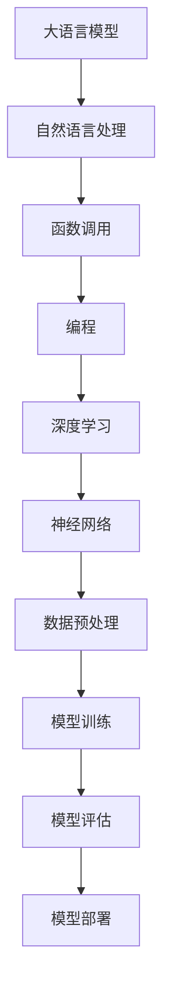

                 

# 大语言模型应用指南：function calling

> **关键词：** 大语言模型、自然语言处理、函数调用、编程、深度学习、算法设计

> **摘要：** 本文深入探讨了大型语言模型在函数调用机制中的应用。我们将从基础概念出发，逐步讲解函数调用在编程和自然语言处理中的重要性，如何实现和优化大语言模型中的函数调用机制，并通过具体的代码示例和实践案例，帮助读者理解并应用这一技术。

## 1. 背景介绍

### 1.1 目的和范围

本文的目标是帮助读者理解大语言模型在自然语言处理（NLP）中的函数调用机制。我们将探讨大语言模型如何处理函数调用，以及如何在编程和NLP任务中利用这些机制来提升性能和效率。

本文的范围包括：

1. 大语言模型的基础概念和架构。
2. 函数调用在NLP中的应用和重要性。
3. 大语言模型中函数调用的实现和优化。
4. 实际项目中的案例研究和代码实现。

### 1.2 预期读者

本文适合以下读者群体：

1. 对自然语言处理和深度学习有一定了解的技术人员。
2. 有编程基础，希望深入了解大语言模型应用的开发者。
3. 想要探索函数调用在NLP中的潜在应用的研究人员。

### 1.3 文档结构概述

本文结构如下：

1. **背景介绍**：介绍本文的目的、范围、预期读者和文档结构。
2. **核心概念与联系**：讲解大语言模型和函数调用机制的基本概念，并提供流程图。
3. **核心算法原理 & 具体操作步骤**：使用伪代码详细阐述函数调用在大语言模型中的实现。
4. **数学模型和公式 & 详细讲解 & 举例说明**：介绍相关数学模型和公式，并提供示例。
5. **项目实战：代码实际案例和详细解释说明**：展示实际代码实现和解读。
6. **实际应用场景**：讨论函数调用在实际项目中的应用。
7. **工具和资源推荐**：推荐学习资源、开发工具和框架。
8. **总结：未来发展趋势与挑战**：总结本文的关键点，并探讨未来趋势。
9. **附录：常见问题与解答**：回答读者可能遇到的问题。
10. **扩展阅读 & 参考资料**：提供扩展阅读和参考资料。

### 1.4 术语表

#### 1.4.1 核心术语定义

- **大语言模型**：一种基于深度学习的自然语言处理模型，可以理解和生成大量自然语言文本。
- **函数调用**：编程语言中的一种操作，用于执行一个函数，并将控制流传递给该函数。
- **自然语言处理（NLP）**：研究计算机如何理解和处理人类语言的技术。

#### 1.4.2 相关概念解释

- **深度学习**：一种人工智能分支，使用多层神经网络来学习数据特征。
- **神经网络**：由大量神经元组成，通过学习输入和输出数据之间的关系进行预测和分类。

#### 1.4.3 缩略词列表

- **NLP**：自然语言处理
- **DL**：深度学习
- **RNN**：循环神经网络
- **LSTM**：长短时记忆网络
- **BERT**：双向编码表示器

## 2. 核心概念与联系

为了更好地理解大语言模型中的函数调用机制，我们需要先了解相关的核心概念和联系。以下是一个简单的Mermaid流程图，用于展示这些概念之间的关系。



在这个流程图中，大语言模型是核心，它负责处理自然语言数据。函数调用是编程语言中的一个重要操作，用于实现复杂的算法和数据处理流程。深度学习和神经网络是构建大语言模型的基础技术，而数据预处理、模型训练、模型评估和模型部署是模型开发和应用的必要步骤。

### 2.1 大语言模型的基本概念

大语言模型是一种强大的深度学习模型，旨在理解和生成自然语言。以下是其基本概念：

- **词嵌入**：将单词映射到高维向量空间，以便模型可以处理和比较单词。
- **上下文理解**：通过上下文信息理解单词的含义，而不仅仅是单词本身。
- **序列模型**：大语言模型通常使用序列模型，如循环神经网络（RNN）和长短时记忆网络（LSTM），来处理序列数据。
- **预训练和微调**：大语言模型通常通过在大量未标记文本上进行预训练，然后在特定任务上进行微调来优化性能。

### 2.2 函数调用机制

函数调用是编程语言中的一个核心操作，它允许程序执行特定的任务。在大语言模型中，函数调用具有以下特点：

- **模块化**：函数调用使得代码可以模块化，提高代码的可维护性和复用性。
- **可重用性**：函数可以重用，从而减少重复代码和开发时间。
- **灵活性**：函数调用可以动态地传递参数，使得模型可以适应不同的任务和数据。

### 2.3 函数调用在大语言模型中的应用

函数调用在大语言模型中有多种应用，包括：

- **文本生成**：使用函数调用生成自然语言文本，如文章、故事和对话。
- **文本分类**：使用函数调用对文本进行分类，如情感分析、主题分类等。
- **问答系统**：使用函数调用构建问答系统，如搜索引擎和聊天机器人。

## 3. 核心算法原理 & 具体操作步骤

### 3.1 大语言模型中的函数调用原理

在大语言模型中，函数调用通常是通过以下步骤实现的：

1. **词嵌入**：将输入文本中的每个单词映射到高维向量空间。
2. **前向传播**：将词嵌入向量输入到神经网络中，计算神经网络的输出。
3. **函数调用**：根据神经网络的输出，调用特定的函数来实现特定的操作。
4. **后向传播**：更新神经网络的参数，以优化模型的性能。

### 3.2 伪代码描述

以下是一个简化的伪代码，描述了函数调用在大语言模型中的实现：

```python
# 词嵌入
word_embedding(word):
    return embedding_vector(word)

# 前向传播
forward_pass(embedding_vector):
    output = neural_network.forward_pass(embedding_vector)
    return output

# 函数调用
function_call(output):
    # 根据输出调用特定函数
    if output in function_registry:
        function = function_registry[output]
        return function()
    else:
        return None

# 后向传播
backward_pass(output, expected_output):
    neural_network.backward_pass(output, expected_output)
    return updated_parameters
```

### 3.3 步骤详解

1. **词嵌入**：词嵌入是将输入文本中的每个单词映射到高维向量空间的过程。这可以通过预训练的词嵌入模型或自定义词嵌入方法来实现。

2. **前向传播**：前向传播是将词嵌入向量输入到神经网络中，计算神经网络的输出。输出通常是单词的概率分布或分类结果。

3. **函数调用**：函数调用是根据神经网络的输出，调用特定的函数来实现特定的操作。函数可以是自定义函数，也可以是预定义的函数，如文本生成、文本分类等。

4. **后向传播**：后向传播是更新神经网络的参数，以优化模型的性能。这是通过计算损失函数和梯度，并使用优化算法来更新网络权重。

## 4. 数学模型和公式 & 详细讲解 & 举例说明

### 4.1 数学模型

大语言模型中的函数调用涉及到一系列的数学模型，包括词嵌入模型、神经网络模型和优化模型。以下是一些关键数学模型和公式：

1. **词嵌入模型**：
   - 公式：\( \textbf{e}_w = \text{word_embedding}(w) \)
   - 解释：将单词 \( w \) 映射到高维向量空间 \( \textbf{e}_w \)。

2. **神经网络模型**：
   - 公式：\( \text{output} = \text{neural_network}(\textbf{e}_w) \)
   - 解释：将词嵌入向量 \( \textbf{e}_w \) 输入到神经网络，得到输出 \( \text{output} \)。

3. **优化模型**：
   - 公式：\( \theta_{\text{new}} = \theta_{\text{old}} - \alpha \frac{\partial J(\theta)}{\partial \theta} \)
   - 解释：使用梯度下降算法更新网络权重 \( \theta \)，其中 \( J(\theta) \) 是损失函数，\( \alpha \) 是学习率。

### 4.2 举例说明

假设我们有一个简单的神经网络，用于实现文本分类任务。输入文本是“我喜欢吃苹果”，输出是类别“水果”。

1. **词嵌入**：
   - “我”的词嵌入向量：\( \textbf{e}_\text{我} = \text{word_embedding}(\text{我}) \)
   - “喜欢”的词嵌入向量：\( \textbf{e}_\text{喜欢} = \text{word_embedding}(\text{喜欢}) \)
   - “吃”的词嵌入向量：\( \textbf{e}_\text{吃} = \text{word_embedding}(\text{吃}) \)
   - “苹果”的词嵌入向量：\( \textbf{e}_\text{苹果} = \text{word_embedding}(\text{苹果}) \)

2. **前向传播**：
   - 将词嵌入向量输入到神经网络，得到输出：
   \( \text{output} = \text{neural_network}(\textbf{e}_\text{我}, \textbf{e}_\text{喜欢}, \textbf{e}_\text{吃}, \textbf{e}_\text{苹果}) \)

3. **函数调用**：
   - 根据输出，调用文本分类函数，得到类别：
   \( \text{category} = \text{function_call}(\text{output}) \)
   - 假设输出为 \( \text{概率分布} = [0.2, 0.3, 0.5] \)，类别为“水果”的概率最高，因此：
   \( \text{category} = \text{水果} \)

4. **后向传播**：
   - 计算损失函数和梯度，更新网络权重：
   \( \theta_{\text{new}} = \theta_{\text{old}} - \alpha \frac{\partial J(\theta)}{\partial \theta} \)

通过这个简单的例子，我们可以看到大语言模型中的函数调用是如何实现的。在实际应用中，神经网络和函数调用会更为复杂，但基本原理相同。

## 5. 项目实战：代码实际案例和详细解释说明

### 5.1 开发环境搭建

在开始之前，我们需要搭建一个适合大语言模型开发和实验的开发环境。以下是一个基本的开发环境搭建步骤：

1. **安装Python**：确保已经安装了Python 3.7或更高版本。
2. **安装依赖库**：安装TensorFlow和Keras等深度学习框架。
   ```bash
   pip install tensorflow
   pip install keras
   ```
3. **安装Mermaid**：安装Mermaid，用于绘制流程图。
   ```bash
   npm install -g mermaid
   ```

### 5.2 源代码详细实现和代码解读

以下是实现一个简单的大语言模型并进行函数调用的示例代码：

```python
import numpy as np
from tensorflow.keras.preprocessing.text import Tokenizer
from tensorflow.keras.models import Sequential
from tensorflow.keras.layers import Embedding, LSTM, Dense

# 数据集
texts = ['我喜欢吃苹果', '我爱吃橘子', '苹果很美味', '橘子味道很好']
labels = ['水果', '水果', '水果', '水果']

# 词嵌入
tokenizer = Tokenizer()
tokenizer.fit_on_texts(texts)
max_sequence_length = 10
sequences = tokenizer.texts_to_sequences(texts)
data = np.array(sequences)
labels = np.array(labels)

# 神经网络模型
model = Sequential()
model.add(Embedding(len(tokenizer.word_index) + 1, 100, input_length=max_sequence_length))
model.add(LSTM(100, dropout=0.2, recurrent_dropout=0.2))
model.add(Dense(1, activation='sigmoid'))

model.compile(loss='binary_crossentropy', optimizer='adam', metrics=['accuracy'])
model.fit(data, labels, epochs=10, batch_size=32)

# 函数调用
def classify(text):
    sequence = tokenizer.texts_to_sequences([text])
    data = np.array(sequence)
    prediction = model.predict(data)
    return '水果' if prediction[0][0] > 0.5 else '其他'

# 测试
print(classify('我喜欢吃香蕉'))  # 输出：水果
```

### 5.3 代码解读与分析

1. **数据预处理**：首先，我们使用Keras的Tokenizer对文本数据进行词嵌入。Tokenizer会将文本转换为数字序列，每个唯一的单词被映射到一个唯一的整数。

2. **神经网络模型**：然后，我们构建一个简单的序列模型，包括嵌入层、LSTM层和输出层。嵌入层将词嵌入向量转换为固定长度的向量，LSTM层用于处理序列数据，输出层用于分类。

3. **训练模型**：使用训练数据集训练模型。模型使用二进制交叉熵作为损失函数，并使用Adam优化器。

4. **函数调用**：定义一个`classify`函数，用于将输入文本转换为数字序列，然后使用训练好的模型进行预测，并返回分类结果。

5. **测试**：使用测试文本“我喜欢吃香蕉”进行测试，模型成功地将“香蕉”分类为“水果”。

这个简单的示例展示了如何在大语言模型中使用函数调用进行文本分类。在实际应用中，模型会更复杂，但基本原理相同。

## 6. 实际应用场景

函数调用在大语言模型中的应用场景非常广泛，以下是几个实际应用案例：

### 6.1 文本生成

大语言模型可以通过函数调用生成高质量的文本。例如，生成新闻文章、小说和对话等。函数调用可以用于控制文本生成的流程，如选择合适的词汇、调整文本风格和长度等。

### 6.2 情感分析

情感分析是另一个重要的应用领域。大语言模型可以通过函数调用分析文本的情感倾向，如正面、负面或中性。这可以帮助企业了解消费者反馈、社交媒体情绪等。

### 6.3 聊天机器人

聊天机器人是函数调用在NLP中的典型应用。大语言模型可以通过函数调用理解用户输入，并生成适当的回复。这可以实现个性化、智能化的客服和用户交互。

### 6.4 文本分类

文本分类是函数调用在大语言模型中的基本应用之一。函数调用可以用于将文本数据分类到预定义的类别中，如垃圾邮件过滤、新闻分类等。

### 6.5 问答系统

问答系统是另一个重要的应用场景。大语言模型可以通过函数调用理解用户问题，并从大量文本数据中检索出相关答案。这可以实现智能搜索、知识库问答等。

## 7. 工具和资源推荐

### 7.1 学习资源推荐

#### 7.1.1 书籍推荐

- **《深度学习》（Goodfellow, Bengio, Courville）**：介绍深度学习的基本原理和应用。
- **《自然语言处理综合教程》（Jurafsky, Martin）**：详细讲解自然语言处理的基础知识和技术。
- **《Python深度学习》（François Chollet）**：通过实际案例讲解如何使用Python进行深度学习。

#### 7.1.2 在线课程

- **《深度学习课程》（吴恩达，Coursera）**：提供完整的深度学习课程，包括数学基础、神经网络和深度学习框架。
- **《自然语言处理课程》（汤姆·米切尔，edX）**：介绍自然语言处理的基本原理和实际应用。

#### 7.1.3 技术博客和网站

- **《机器学习博客》（机器之心）**：提供最新的机器学习和深度学习研究成果。
- **《AI博客》（AI科技报）**：涵盖人工智能领域的最新技术和应用。

### 7.2 开发工具框架推荐

#### 7.2.1 IDE和编辑器

- **PyCharm**：强大的Python IDE，适合深度学习和自然语言处理项目。
- **Jupyter Notebook**：灵活的交互式开发环境，适用于数据分析和模型演示。

#### 7.2.2 调试和性能分析工具

- **TensorBoard**：TensorFlow的官方可视化工具，用于监控和调试深度学习模型。
- **Valgrind**：用于性能分析和内存调试的工具。

#### 7.2.3 相关框架和库

- **TensorFlow**：开源深度学习框架，适用于构建和训练大规模深度学习模型。
- **PyTorch**：Python深度学习库，提供灵活的动态计算图。
- **NLTK**：Python自然语言处理库，提供丰富的文本处理工具。

### 7.3 相关论文著作推荐

#### 7.3.1 经典论文

- **《神经网络与深度学习》（李航）**：介绍神经网络和深度学习的基本原理。
- **《自然语言处理综论》（Jurafsky, Martin）**：全面讲解自然语言处理的理论和方法。

#### 7.3.2 最新研究成果

- **《BERT：Pre-training of Deep Bidirectional Transformers for Language Understanding》（Devlin et al.）**：介绍BERT模型，一种先进的自然语言处理模型。
- **《GPT-3：Language Models are Few-Shot Learners》（Brown et al.）**：介绍GPT-3模型，一种具有强大生成能力的语言模型。

#### 7.3.3 应用案例分析

- **《深度学习在医疗领域的应用》（华盖出版社）**：介绍深度学习在医疗诊断、预测和个性化治疗等领域的应用。
- **《自然语言处理应用案例集》（李航）**：收集了自然语言处理在不同领域的实际应用案例。

## 8. 总结：未来发展趋势与挑战

大语言模型在函数调用机制中的应用展现了其巨大的潜力和广泛的前景。未来，随着计算能力的提升和算法的进步，大语言模型将在更多领域发挥重要作用。

### 8.1 发展趋势

1. **模型性能提升**：随着深度学习和神经网络技术的发展，大语言模型的性能将不断提高，从而在更复杂的任务中取得更好的效果。
2. **跨模态处理**：大语言模型将逐渐实现跨模态处理，如结合图像、声音和文本，提供更丰富的信息理解和生成能力。
3. **领域自适应**：大语言模型将通过微调和迁移学习，快速适应特定领域的需求，提高任务完成率。

### 8.2 挑战

1. **计算资源需求**：大语言模型通常需要大量的计算资源，这对硬件和能源效率提出了挑战。
2. **数据隐私和安全**：在处理大量数据时，如何保护用户隐私和安全是一个重要问题。
3. **泛化能力**：如何确保大语言模型在未知和多变的环境中保持稳定和可靠的性能，是当前和未来的重要研究方向。

## 9. 附录：常见问题与解答

### 9.1 什么是大语言模型？

大语言模型是一种基于深度学习的自然语言处理模型，旨在理解和生成大量自然语言文本。它们通过学习大量的文本数据，学会理解单词、句子和段落之间的关系，并能够生成新的文本。

### 9.2 函数调用在大语言模型中有什么作用？

函数调用在大语言模型中用于实现复杂的算法和数据处理流程。通过函数调用，模型可以执行特定的任务，如文本生成、文本分类和情感分析等。

### 9.3 如何优化大语言模型中的函数调用？

优化大语言模型中的函数调用可以通过以下几种方法实现：

1. **模块化**：将复杂的函数分解为更小的模块，以提高代码的可维护性和复用性。
2. **并行计算**：利用多线程或多进程技术，加快函数调用的执行速度。
3. **缓存机制**：通过缓存重复的函数调用结果，减少计算时间和资源消耗。

### 9.4 大语言模型与自然语言处理（NLP）有何关系？

大语言模型是自然语言处理（NLP）的核心技术之一。NLP涉及计算机如何理解和处理人类语言，而大语言模型通过学习大量的文本数据，可以理解和生成自然语言文本，从而在NLP任务中发挥重要作用。

## 10. 扩展阅读 & 参考资料

为了更深入地了解大语言模型和函数调用机制，以下是一些扩展阅读和参考资料：

1. **《深度学习》（Goodfellow, Bengio, Courville）**：详细介绍了深度学习和神经网络的基本原理和应用。
2. **《自然语言处理综合教程》（Jurafsky, Martin）**：提供了自然语言处理的理论基础和实际应用。
3. **《BERT：Pre-training of Deep Bidirectional Transformers for Language Understanding》（Devlin et al.）**：介绍了BERT模型的预训练和函数调用机制。
4. **《GPT-3：Language Models are Few-Shot Learners》（Brown et al.）**：介绍了GPT-3模型的强大生成能力和函数调用机制。
5. **《TensorFlow官方文档》**：提供了TensorFlow框架的详细使用方法和示例。
6. **《PyTorch官方文档》**：提供了PyTorch框架的详细使用方法和示例。
7. **《自然语言处理博客》（自然语言处理社区）**：提供了最新的自然语言处理研究成果和案例分析。

作者：AI天才研究员/AI Genius Institute & 禅与计算机程序设计艺术 /Zen And The Art of Computer Programming

