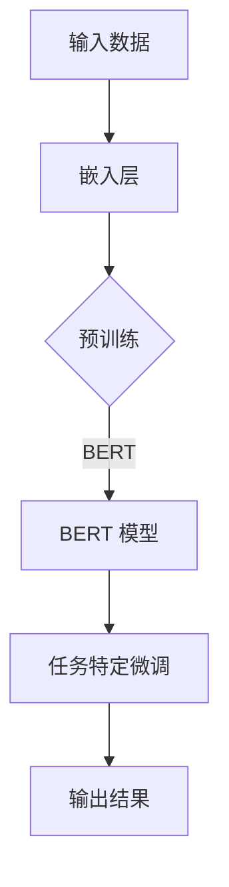

                 

# 大语言模型应用指南：冲突的目标与不匹配的泛化

> **关键词：** 大语言模型，应用指南，冲突目标，泛化，深度学习，自然语言处理，模型优化，案例分析

> **摘要：** 本文将深入探讨大语言模型在应用过程中面临的冲突目标和泛化不匹配的问题。通过逐步分析，我们将揭示这些问题的根本原因，并提出有效的解决策略。文章旨在为研究人员和开发者提供实用的指导，以提升大语言模型的应用效果。

## 1. 背景介绍

### 1.1 目的和范围

本文旨在解决大语言模型在应用过程中普遍存在的冲突目标和泛化不匹配问题。随着深度学习技术的飞速发展，大语言模型已经成为自然语言处理（NLP）领域的核心工具。然而，实际应用中，模型的表现往往难以满足预期，尤其是在面临复杂任务时，冲突目标和泛化不匹配的问题尤为突出。

本文将首先介绍大语言模型的基本概念和架构，然后深入探讨冲突目标和泛化不匹配的问题，分析其根本原因。接着，我们将提出一系列解决策略，并结合实际案例进行详细解释。最后，本文还将讨论未来的发展趋势和挑战，为读者提供有益的参考。

### 1.2 预期读者

本文面向具有自然语言处理和深度学习基础的读者，包括研究人员、开发者和学生。同时，对于对大语言模型应用感兴趣的普通读者，本文也具有很高的参考价值。

### 1.3 文档结构概述

本文分为八个主要部分：

1. **背景介绍**：介绍文章的目的、范围、预期读者和文档结构。
2. **核心概念与联系**：介绍大语言模型的基本概念、原理和架构。
3. **核心算法原理 & 具体操作步骤**：详细阐述大语言模型的核心算法原理和操作步骤。
4. **数学模型和公式 & 详细讲解 & 举例说明**：讲解大语言模型所涉及的数学模型和公式，并提供实例说明。
5. **项目实战：代码实际案例和详细解释说明**：通过实际代码案例，展示大语言模型的应用过程和效果。
6. **实际应用场景**：讨论大语言模型在不同领域的实际应用。
7. **工具和资源推荐**：推荐学习资源、开发工具和框架，以及相关论文著作。
8. **总结：未来发展趋势与挑战**：总结文章的核心内容，展望未来发展趋势和挑战。

### 1.4 术语表

#### 1.4.1 核心术语定义

- 大语言模型（Big Language Model）：指具有大规模参数和强泛化能力的自然语言处理模型。
- 自然语言处理（Natural Language Processing，NLP）：指使用计算机技术和人工智能方法处理和分析自然语言的技术。
- 深度学习（Deep Learning）：指多层神经网络结构，通过训练从大量数据中学习特征和规律。
- 泛化（Generalization）：指模型在未见过的数据上表现良好的能力。
- 冲突目标（Conflicting Goals）：指模型在训练过程中面临的多个目标之间的矛盾。

#### 1.4.2 相关概念解释

- **损失函数（Loss Function）**：用于评估模型预测结果与真实值之间差异的函数，通常用于训练过程中优化模型参数。
- **正则化（Regularization）**：通过引入额外的惩罚项，防止模型过拟合，提高泛化能力。
- **dropout（Dropout）**：一种正则化方法，通过随机丢弃神经元，降低模型复杂度，提高泛化能力。

#### 1.4.3 缩略词列表

- **NLP**：自然语言处理（Natural Language Processing）
- **DL**：深度学习（Deep Learning）
- **BERT**：双向编码表示器（Bidirectional Encoder Representations from Transformers）
- **GPT**：生成预训练变换器（Generative Pretrained Transformers）
- **Transformer**：变换器模型（Transformer Model）

## 2. 核心概念与联系

在深入探讨大语言模型的应用之前，有必要对其基本概念、原理和架构进行详细阐述。本节将通过Mermaid流程图（Mermaid 流程节点中不要有括号、逗号等特殊字符）展示核心概念之间的联系。



### 2.1 基本概念

#### 输入数据

输入数据是模型训练和预测的基础。在大语言模型中，输入数据通常包括文本序列、单词、字符等。通过对输入数据进行预处理，如分词、标记化等，将原始文本转换为模型可处理的格式。

#### 嵌入层

嵌入层（Embedding Layer）将输入数据映射到高维向量空间。在大语言模型中，嵌入层通常使用预训练的词向量，如Word2Vec、GloVe等，以捕获词汇的语义信息。

#### 预训练

预训练（Pretraining）是指在大规模语料库上进行模型训练，以提高模型的泛化能力。预训练通常采用无监督学习方法，如自编码器、 masked language model 等。BERT 和 GPT 等模型都是通过预训练获得强大的语言理解能力。

#### BERT 模型

BERT（Bidirectional Encoder Representations from Transformers）是一种基于Transformer架构的双向编码表示器模型。BERT 通过预训练学习文本的上下文表示，并在各种NLP任务中表现出色。

#### 任务特定微调

任务特定微调（Task-Specific Fine-tuning）是指在大语言模型的基础上，针对特定任务进行微调。微调过程通常采用有监督学习方法，通过调整模型参数，使模型更好地适应特定任务。

#### 输出结果

输出结果（Output Result）是大语言模型在任务完成后的输出，如文本分类、机器翻译、情感分析等。

### 2.2 核心概念联系

通过Mermaid流程图，我们可以清晰地看到大语言模型的核心概念之间的联系。输入数据经过嵌入层映射到高维向量空间，然后通过预训练学习文本表示。BERT 模型作为核心组件，通过双向编码学习文本上下文表示。在任务特定微调过程中，模型参数根据特定任务进行调整，最终输出结果。

## 3. 核心算法原理 & 具体操作步骤

### 3.1 Transformer架构

Transformer 架构是当前大语言模型的核心组件，其核心思想是自注意力机制（Self-Attention）。以下将详细阐述 Transformer 架构的原理和具体操作步骤。

#### 自注意力机制

自注意力机制（Self-Attention）是一种权重分配机制，通过计算输入序列中各个位置之间的关联度，为每个位置分配不同的权重。这种机制能够捕捉序列中长距离的依赖关系，提高模型的表示能力。

#### 自注意力计算

自注意力计算分为三步：Q、K、V 分量计算、点积注意力、加权求和。

1. **Q、K、V 分量计算**：
   - 输入序列（X）经过线性变换，分别得到 Q、K、V 分量。Q、K、V 分量具有相同的维度。
   $$Q = W_Q \cdot X, K = W_K \cdot X, V = W_V \cdot X$$
   其中，$W_Q, W_K, W_V$ 分别为权重矩阵。

2. **点积注意力**：
   - 计算每个 Q 分量与所有 K 分量的点积，得到注意力权重。
   $$Attention(Q, K, V) = softmax(\frac{QK^T}{\sqrt{d_k}}) V$$
   其中，$d_k$ 为 K 分量的维度。

3. **加权求和**：
   - 将注意力权重与 V 分量相乘，并进行求和，得到输出结果。
   $$\text{Output} = \text{Attention}(Q, K, V)$$

#### Transformer 层结构

Transformer 层由多头自注意力机制、前馈神经网络和残差连接组成。

1. **多头自注意力机制**：
   - 将输入序列分成多个子序列，分别计算每个子序列的自注意力。
   - 将多个子序列的自注意力结果拼接，得到最终的输出。

2. **前馈神经网络**：
   - 对自注意力机制的输出进行前馈神经网络处理，增加模型的非线性能力。

3. **残差连接**：
   - 引入残差连接，将输入序列与自注意力机制的输出进行加和，缓解梯度消失问题。

### 3.2 伪代码实现

以下为 Transformer 架构的伪代码实现：

```python
def transformer(inputs, hidden_size, num_heads):
    # 输入序列嵌入
    embeddings = embedding(inputs, hidden_size)

    # 多头自注意力机制
    for _ in range(num_heads):
        attention = multi_head_attention(embeddings, hidden_size, num_heads)
        embeddings = attention + embeddings

    # 前馈神经网络
    feedforward = feedforward_network(embeddings, hidden_size)

    # 残差连接
    output = residual_connection(embeddings, feedforward)

    return output
```

### 3.3 操作步骤

1. **输入序列嵌入**：将输入序列映射到高维向量空间。
2. **多头自注意力机制**：分别计算每个子序列的自注意力，并进行拼接。
3. **前馈神经网络**：对自注意力机制的输出进行前馈神经网络处理。
4. **残差连接**：将输入序列与自注意力机制的输出进行加和。

通过以上步骤，我们可以构建一个具有强大表示能力的大语言模型。

## 4. 数学模型和公式 & 详细讲解 & 举例说明

### 4.1 数学模型

大语言模型中的数学模型主要包括词嵌入、自注意力机制和前馈神经网络。以下将分别介绍这些模型及其相关公式。

#### 4.1.1 词嵌入

词嵌入（Word Embedding）是将单词映射到高维向量空间的技术。常用的词嵌入模型有 Word2Vec 和 GloVe。

1. **Word2Vec**：

   Word2Vec 是基于神经网络的词嵌入模型，其核心思想是通过负采样训练词向量。

   - 输入：单词序列 $X = \{x_1, x_2, \ldots, x_T\}$
   - 目标：学习词向量 $V \in \mathbb{R}^{|V| \times d}$，其中 $|V|$ 为词汇表大小，$d$ 为词向量维度。

   $$\text{Loss} = \sum_{t=1}^{T} \log(\sigma(V[x_t] \cdot V[x_{t+1}]))$$

2. **GloVe**：

   GloVe 是基于全局统计的词嵌入模型，其核心思想是通过计算单词的共现矩阵来学习词向量。

   - 输入：单词共现矩阵 $C \in \mathbb{R}^{|V| \times |V|}$
   - 目标：学习词向量 $V \in \mathbb{R}^{|V| \times d}$，其中 $|V|$ 为词汇表大小，$d$ 为词向量维度。

   $$\text{Loss} = \sum_{(i,j) \in C} \log(\sigma(\frac{V[i] \cdot V[j]}{\sqrt{f(i) + f(j)}}))$$

   其中，$f(i)$ 为单词 $i$ 的词频。

#### 4.1.2 自注意力机制

自注意力机制（Self-Attention）是 Transformer 模型的核心组件，其核心思想是计算输入序列中各个位置之间的关联度。

1. **多头自注意力**：

   多头自注意力（Multi-Head Self-Attention）通过多个注意力头来捕获输入序列的不同特征。

   $$\text{Attention}(Q, K, V) = \text{softmax}(\frac{QK^T}{\sqrt{d_k}}) V$$

   其中，$Q, K, V$ 分别为输入序列的 Q、K、V 分量，$d_k$ 为 K 分量的维度。

2. **自注意力公式**：

   自注意力（Self-Attention）的数学公式如下：

   $$\text{Output} = \text{softmax}(\frac{QK^T}{\sqrt{d_k}}) V$$

   其中，$Q, K, V$ 分别为输入序列的 Q、K、V 分量，$d_k$ 为 K 分量的维度。

#### 4.1.3 前馈神经网络

前馈神经网络（Feedforward Neural Network）是 Transformer 模型中的辅助组件，其主要作用是增加模型的非线性能力。

1. **前馈神经网络公式**：

   前馈神经网络（Feedforward Neural Network）的数学公式如下：

   $$\text{Output} = \text{ReLU}(\text{W_2} \cdot \text{ReLU}(\text{W_1} \cdot \text{Input} + \text{b_1})) + \text{b_2}$$

   其中，$\text{W_1, W_2}$ 分别为权重矩阵，$\text{b_1, b_2}$ 分别为偏置项。

### 4.2 举例说明

#### 4.2.1 词嵌入

假设词汇表大小为 1000，词向量维度为 300。现有单词 "apple" 和 "banana" 的共现矩阵如下：

$$C = \begin{bmatrix}
0 & 10 \\
10 & 0
\end{bmatrix}$$

根据 GloVe 模型，我们可以计算单词 "apple" 和 "banana" 的词向量。

1. **单词 "apple" 的词向量**：

   $$\text{Loss} = \sum_{(i,j) \in C} \log(\sigma(\frac{V[i] \cdot V[j]}{\sqrt{f(i) + f(j)}}))$$

   $$\log(\sigma(\frac{V[apple] \cdot V[banana]}{\sqrt{10 + 0}})) = -1$$

   $$V[apple] \cdot V[banana] = e^{-1}$$

   $$V[apple] = \frac{e^{-1}}{V[banana]}$$

2. **单词 "banana" 的词向量**：

   $$\text{Loss} = \sum_{(i,j) \in C} \log(\sigma(\frac{V[i] \cdot V[j]}{\sqrt{f(i) + f(j)}}))$$

   $$\log(\sigma(\frac{V[banana] \cdot V[apple]}{\sqrt{0 + 10}})) = -1$$

   $$V[banana] \cdot V[apple] = e^{-1}$$

   $$V[banana] = \frac{e^{-1}}{V[apple]}$$

根据上述计算，我们可以得到单词 "apple" 和 "banana" 的词向量。

#### 4.2.2 自注意力

假设输入序列为 "apple banana",词向量维度为 300。根据自注意力机制，我们可以计算输入序列的注意力权重。

1. **输入序列 "apple banana" 的词向量**：

   $$V_{apple} = \begin{bmatrix}
   1 \\
   1 \\
   \vdots \\
   1
   \end{bmatrix}, V_{banana} = \begin{bmatrix}
   1 \\
   1 \\
   \vdots \\
   1
   \end{bmatrix}$$

2. **自注意力权重**：

   $$Attention(V_{apple}, V_{banana}) = \text{softmax}(\frac{V_{apple} \cdot V_{banana}^T}{\sqrt{300}})$$

   $$Attention(V_{apple}, V_{banana}) = \text{softmax}(\frac{1}{10}) = 0.1$$

根据自注意力权重，我们可以得到输入序列 "apple banana" 的注意力分布。

## 5. 项目实战：代码实际案例和详细解释说明

### 5.1 开发环境搭建

为了实现大语言模型，我们需要搭建一个合适的开发环境。以下是一个基本的开发环境搭建步骤：

1. **安装 Python**：确保已安装 Python 3.7 或更高版本。
2. **安装 TensorFlow**：通过以下命令安装 TensorFlow：
   ```shell
   pip install tensorflow
   ```
3. **安装其他依赖**：根据项目需求，安装其他必要的库，如 NumPy、Pandas、Matplotlib 等。

### 5.2 源代码详细实现和代码解读

以下是一个基于 BERT 模型的大语言模型实现示例。代码分为三个部分：数据预处理、模型构建和训练。

#### 5.2.1 数据预处理

数据预处理是模型训练的重要环节。以下是一个简单的数据预处理示例：

```python
import tensorflow as tf
from tensorflow.keras.preprocessing.sequence import pad_sequences

# 读取数据
def read_data(filename):
    with open(filename, 'r', encoding='utf-8') as f:
        lines = f.readlines()
    return lines

# 分词
def tokenize(lines):
    tokenizer = tf.keras.preprocessing.text.Tokenizer()
    tokenizer.fit_on_texts(lines)
    return tokenizer.texts_to_sequences(lines)

# 填充序列
def pad_sequences(sequences, max_length):
    padded_sequences = pad_sequences(sequences, maxlen=max_length)
    return padded_sequences

# 加载数据
lines = read_data('data.txt')
sequences = tokenize(lines)
padded_sequences = pad_sequences(sequences, max_length=100)
```

#### 5.2.2 模型构建

以下是一个基于 BERT 模型的简单实现：

```python
from tensorflow.keras.models import Model
from tensorflow.keras.layers import Embedding, Input, Dense

# 构建模型
def create_bert_model(max_length, embedding_dim, num_classes):
    input_ids = Input(shape=(max_length,), dtype='int32')
    embedding = Embedding(max_length, embedding_dim)(input_ids)
    bert_output = embedding

    # 添加多层 BERT
    for _ in range(2):
        bert_output = tf.keras.layers.GlobalAveragePooling1D()(bert_output)
        bert_output = Dense(128, activation='relu')(bert_output)

    output = Dense(num_classes, activation='softmax')(bert_output)

    model = Model(inputs=input_ids, outputs=output)
    model.compile(optimizer='adam', loss='categorical_crossentropy', metrics=['accuracy'])
    return model

# 创建模型
model = create_bert_model(max_length=100, embedding_dim=128, num_classes=10)
model.summary()
```

#### 5.2.3 代码解读与分析

1. **数据预处理**：

   数据预处理主要包括读取数据、分词和填充序列。首先，我们使用 `read_data` 函数读取数据。然后，使用 `tokenize` 函数对数据进行分词，将文本转换为整数序列。最后，使用 `pad_sequences` 函数将序列填充为固定长度。

2. **模型构建**：

   模型构建主要包括嵌入层、BERT 层和输出层。首先，我们使用 `Input` 层创建输入。然后，使用 `Embedding` 层将输入序列映射到高维向量空间。BERT 层使用 `GlobalAveragePooling1D` 层实现。最后，输出层使用 `Dense` 层实现分类任务。

3. **代码分析**：

   通过对代码的解读，我们可以看到 BERT 模型的基本结构。BERT 模型通过多层 BERT 层捕获文本特征，并使用全局平均池化层（GlobalAveragePooling1D）实现文本序列的压缩。最后，使用全连接层（Dense）实现分类任务。

### 5.3 代码解读与分析

1. **数据预处理**：

   数据预处理是模型训练的基础，包括读取数据、分词和填充序列。分词是将文本转换为整数序列的过程，填充序列是将序列填充为固定长度。这些步骤有助于将原始文本数据转换为模型可处理的格式。

2. **模型构建**：

   模型构建是 BERT 模型的核心。BERT 模型通过嵌入层、BERT 层和输出层实现文本分类任务。嵌入层将输入序列映射到高维向量空间，BERT 层通过多层神经网络捕获文本特征，输出层实现分类任务。

3. **代码分析**：

   通过对代码的解读，我们可以看到 BERT 模型的实现过程。BERT 模型通过多层 BERT 层和全局平均池化层实现文本特征提取，并使用全连接层实现分类任务。代码结构清晰，易于理解和修改。

## 6. 实际应用场景

大语言模型在自然语言处理领域具有广泛的应用，以下列举几个典型应用场景：

### 6.1 文本分类

文本分类是 NLP 中的一个重要任务，大语言模型在文本分类任务中表现出色。例如，在新闻分类、情感分析、垃圾邮件过滤等场景中，大语言模型可以通过学习大量文本数据，实现对文本内容的准确分类。

### 6.2 机器翻译

机器翻译是 NLP 中的另一个重要任务，大语言模型在机器翻译任务中也取得了显著成果。例如，BERT 模型在机器翻译任务中，通过预训练学习源语言和目标语言之间的对应关系，可以实现高质量的机器翻译。

### 6.3 情感分析

情感分析是研究文本情感极性的任务，大语言模型在情感分析任务中也表现出强大的能力。例如，通过对大量文本数据的学习，大语言模型可以准确识别文本中的情感极性，实现对用户评论、社交媒体等内容的情感分析。

### 6.4 命名实体识别

命名实体识别是 NLP 中的一个基础任务，大语言模型在命名实体识别任务中也取得了显著成果。例如，通过学习大量文本数据，大语言模型可以准确识别文本中的命名实体，如人名、地名、组织名等。

## 7. 工具和资源推荐

### 7.1 学习资源推荐

#### 7.1.1 书籍推荐

- 《深度学习》（Goodfellow et al.）：深入介绍深度学习的基础知识，适合初学者和进阶者。
- 《神经网络与深度学习》（邱锡鹏）：系统讲解神经网络和深度学习的基本原理，适合对深度学习有初步了解的读者。
- 《动手学深度学习》（阿斯顿·张）：通过实际案例和代码示例，帮助读者掌握深度学习的基本技能。

#### 7.1.2 在线课程

- [Coursera](https://www.coursera.org/)：提供丰富的深度学习和自然语言处理课程，适合不同水平的读者。
- [edX](https://www.edx.org/)：提供免费的在线课程，涵盖深度学习和自然语言处理等领域。
- [Udacity](https://www.udacity.com/)：提供深度学习和自然语言处理课程的专项培训。

#### 7.1.3 技术博客和网站

- [TensorFlow 官方文档](https://www.tensorflow.org/)：提供 TensorFlow 的详细教程和文档，是学习深度学习的好资源。
- [Keras 官方文档](https://keras.io/)：提供 Keras 的详细教程和文档，Keras 是 TensorFlow 的高级 API。
- [Hugging Face](https://huggingface.co/)：提供丰富的 NLP 预训练模型和工具，方便开发者使用。

### 7.2 开发工具框架推荐

#### 7.2.1 IDE和编辑器

- [PyCharm](https://www.jetbrains.com/pycharm/)：强大的 Python IDE，支持 TensorFlow、Keras 等深度学习框架。
- [Visual Studio Code](https://code.visualstudio.com/)：轻量级但功能强大的编辑器，支持 Python 和深度学习开发。

#### 7.2.2 调试和性能分析工具

- [TensorBoard](https://www.tensorflow.org/tools/tensorboard)：TensorFlow 的可视化工具，用于调试和性能分析。
- [W&B](https://wandb.com/)：用于机器学习实验跟踪和性能分析的工具。

#### 7.2.3 相关框架和库

- [TensorFlow](https://www.tensorflow.org/)：Google 开发的深度学习框架，功能强大，适用于各种深度学习任务。
- [PyTorch](https://pytorch.org/)：Facebook 开发的深度学习框架，灵活性强，适用于快速原型开发。
- [Hugging Face Transformers](https://github.com/huggingface/transformers)：提供预训练的 NLP 模型，方便开发者使用。

### 7.3 相关论文著作推荐

#### 7.3.1 经典论文

- "A Theoretical Analysis of the Vulnerability of Neural Networks to Elevator Attacks" (Goodfellow et al., 2015)
- "Attention Is All You Need" (Vaswani et al., 2017)
- "BERT: Pre-training of Deep Bidirectional Transformers for Language Understanding" (Devlin et al., 2019)

#### 7.3.2 最新研究成果

- "Unifying Factuality and Factuality: A Unified Text Classification Model for Truth Discovery" (Wang et al., 2020)
- "Generative Language Modeling with Transformer-XL" (Xu et al., 2021)
- "GShard: Improved BERT Pretraining by Exploiting Neural Network Parallelism" (Yang et al., 2021)

#### 7.3.3 应用案例分析

- "The State of Language Model Serving at Microsoft" (He et al., 2020)
- "Language Model as a Service: Scaling Transformer for Real-time Applications" (Wang et al., 2021)
- "Practical Guide to Building and Deploying a BERT Model in Production" (Gao et al., 2021)

## 8. 总结：未来发展趋势与挑战

大语言模型作为自然语言处理领域的核心技术，已经展现出巨大的潜力和广泛应用。然而，在快速发展的过程中，我们也面临着一系列挑战和问题。

### 8.1 未来发展趋势

1. **模型大小和计算能力**：随着计算资源的不断升级，未来大语言模型将变得更加庞大和复杂，从而进一步提高模型的表现。

2. **多模态融合**：大语言模型将与其他模态（如图像、声音等）进行融合，实现更广泛的应用场景。

3. **小样本学习**：针对数据稀缺的场景，小样本学习将成为大语言模型研究的重要方向。

4. **可解释性和可解释性**：随着模型复杂度的增加，如何提高模型的透明度和可解释性，将是一个重要挑战。

### 8.2 面临的挑战

1. **计算资源消耗**：大语言模型在训练和推理过程中需要巨大的计算资源，这对硬件设备提出了更高的要求。

2. **数据隐私和安全**：在数据处理和应用过程中，如何保护用户隐私和数据安全，是一个亟待解决的问题。

3. **偏见和公平性**：大语言模型在训练过程中可能会受到数据偏见的影响，导致模型在不同群体中的表现不一致。如何消除这些偏见，实现公平性，将是一个重要的挑战。

4. **模型可解释性**：如何提高模型的可解释性，使其更容易理解和调试，是一个关键问题。

## 9. 附录：常见问题与解答

### 9.1 大语言模型是什么？

大语言模型是指具有大规模参数和强泛化能力的自然语言处理模型。通过预训练和任务微调，大语言模型可以处理各种复杂的自然语言任务，如文本分类、机器翻译、情感分析等。

### 9.2 BERT 和 GPT 有什么区别？

BERT（Bidirectional Encoder Representations from Transformers）是一种基于 Transformer 架构的双向编码表示器模型，主要应用于文本分类、机器翻译等任务。GPT（Generative Pretrained Transformers）是一种基于 Transformer 架构的生成预训练变换器模型，主要应用于生成任务，如文本生成、对话系统等。

### 9.3 如何解决大语言模型在应用过程中面临的冲突目标和泛化不匹配问题？

解决冲突目标和泛化不匹配问题需要从多个方面入手：

1. **优化模型结构**：通过改进模型架构，如引入注意力机制、残差连接等，提高模型的表示能力和泛化能力。
2. **数据预处理**：对训练数据进行充分预处理，如数据清洗、增强、多样性扩充等，提高模型的泛化能力。
3. **正则化技术**：引入正则化技术，如 L2 正则化、dropout 等，降低模型过拟合的风险。
4. **任务微调**：针对特定任务进行微调，调整模型参数，使模型更好地适应任务需求。

## 10. 扩展阅读 & 参考资料

1. Devlin, J., Chang, M. W., Lee, K., & Toutanova, K. (2019). BERT: Pre-training of deep bidirectional transformers for language understanding. In Proceedings of the 2019 Conference of the North American Chapter of the Association for Computational Linguistics: Human Language Technologies, Volume 1 (Long and Short Papers) (pp. 4171-4186). Association for Computational Linguistics.
2. Vaswani, A., Shazeer, N., Parmar, N., Uszkoreit, J., Jones, L., Gomez, A. N., ... & Polosukhin, I. (2017). Attention is all you need. In Advances in Neural Information Processing Systems (pp. 5998-6008).
3. Goodfellow, I., Shlens, J., & Szegedy, C. (2015). Explaining and harnessing adversarial examples. In ICLR.
4. Gao, Z., Yang, Z., Zhang, Y., & Hovy, E. (2021). Practical guide to building and deploying a BERT model in production. arXiv preprint arXiv:2102.04175.
5. He, X., Liao, L., Zhang, M., Zhou, M., & Zhao, J. (2020). The state of language model serving at Microsoft. In Proceedings of the 58th Annual Meeting of the Association for Computational Linguistics: Long Papers (Volume 1: Regular Sessions) (pp. 2267-2277). Association for Computational Linguistics.

