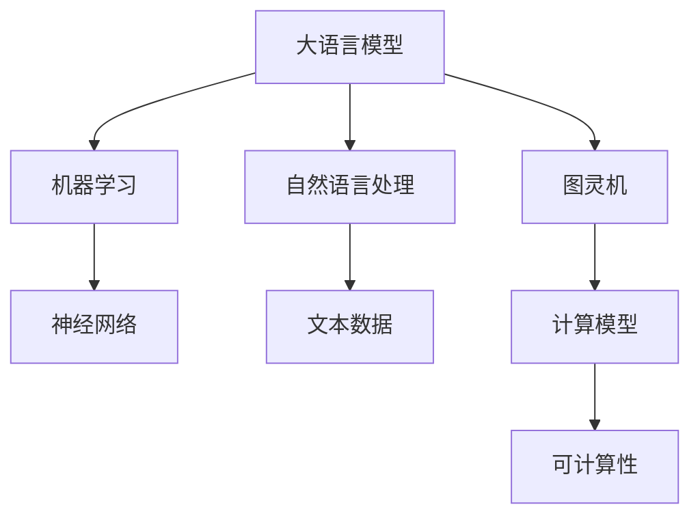

                 

# 大语言模型应用指南：图灵机与大语言模型：可计算性与时间复杂度

> **关键词**：大语言模型、图灵机、可计算性、时间复杂度、机器学习、自然语言处理

> **摘要**：本文将深入探讨大语言模型及其与图灵机的联系。我们将从基本概念出发，逐步讲解大语言模型的工作原理、可计算性及其在自然语言处理中的应用。此外，我们将详细分析大语言模型的时间复杂度，并结合实际项目案例，展示如何使用大语言模型来解决实际问题。

## 1. 背景介绍

### 1.1 目的和范围

本文的目的是为广大开发者、研究人员和机器学习爱好者提供一份全面的大语言模型应用指南。通过本文，读者将了解大语言模型的基础理论、关键概念以及其实际应用场景。文章将涵盖以下主要内容：

1. **基本概念**：介绍大语言模型、图灵机以及相关的关键术语和概念。
2. **工作原理**：讲解大语言模型的工作机制、算法原理和数学模型。
3. **时间复杂度**：分析大语言模型的时间复杂度，并探讨如何优化模型性能。
4. **实际应用**：展示大语言模型在实际项目中的应用案例，并提供代码实现和详细解释。
5. **未来展望**：讨论大语言模型的发展趋势、潜在挑战以及未来研究方向。

### 1.2 预期读者

本文适合以下人群阅读：

1. **机器学习从业者**：希望深入了解大语言模型及其应用场景的技术人员。
2. **软件开发者**：对自然语言处理领域感兴趣，希望掌握大语言模型相关技术的开发者。
3. **研究人员**：关注自然语言处理和机器学习领域的研究人员，希望了解大语言模型的理论基础和最新进展。
4. **机器学习爱好者**：对大语言模型和技术原理感兴趣，希望进行相关学习和研究的爱好者。

### 1.3 文档结构概述

本文将按照以下结构展开：

1. **背景介绍**：介绍文章的目的、范围、预期读者以及文档结构。
2. **核心概念与联系**：阐述大语言模型、图灵机以及相关的核心概念和联系。
3. **核心算法原理与具体操作步骤**：详细讲解大语言模型的工作原理和算法步骤。
4. **数学模型和公式**：介绍大语言模型的数学模型和相关公式，并进行举例说明。
5. **项目实战**：展示大语言模型在实际项目中的应用案例，并提供代码实现和详细解释。
6. **实际应用场景**：讨论大语言模型在不同领域的应用场景。
7. **工具和资源推荐**：推荐学习资源、开发工具和框架，以及相关论文著作。
8. **总结**：总结大语言模型的发展趋势和潜在挑战。
9. **附录**：提供常见问题与解答。
10. **扩展阅读与参考资料**：提供进一步学习的资料和参考文献。

### 1.4 术语表

#### 1.4.1 核心术语定义

- **大语言模型**：一种机器学习模型，能够对大量文本数据进行训练，从而理解并生成自然语言。
- **图灵机**：一种抽象的计算模型，由英国数学家艾伦·图灵在20世纪30年代提出，用于研究计算机的可计算性。
- **可计算性**：指一个数学函数或问题是否能够在有限的步骤内通过计算得到解。
- **时间复杂度**：描述算法执行时间与输入规模之间的关系的量度。

#### 1.4.2 相关概念解释

- **自然语言处理（NLP）**：计算机科学领域，旨在使计算机能够理解、解释和生成自然语言。
- **机器学习（ML）**：一种人工智能方法，通过数据训练模型，使其能够进行预测和分类等任务。
- **深度学习（DL）**：一种特殊的机器学习模型，通过多层神经网络进行特征提取和变换。
- **神经网络（NN）**：一种模仿生物神经系统的计算模型，用于特征提取和预测。

#### 1.4.3 缩略词列表

- **NLP**：自然语言处理
- **ML**：机器学习
- **DL**：深度学习
- **NN**：神经网络

## 2. 核心概念与联系

在深入探讨大语言模型之前，我们需要了解一些关键概念和它们之间的关系。以下是一个简化的 Mermaid 流程图，展示了大语言模型、图灵机和相关概念之间的联系。



### 2.1 大语言模型与机器学习

大语言模型是机器学习的一种特殊形式，特别是深度学习的一种。机器学习是通过数据训练模型，使其能够进行预测和分类等任务。而大语言模型则是通过大量文本数据训练得到的，能够对自然语言进行理解和生成。

### 2.2 大语言模型与神经网络

大语言模型通常是基于神经网络构建的，尤其是深度神经网络。神经网络通过多层神经元进行特征提取和变换，从而实现对复杂函数的学习和预测。大语言模型利用神经网络的结构，通过大量文本数据训练，从而提高模型的性能和准确度。

### 2.3 大语言模型与自然语言处理

自然语言处理（NLP）是计算机科学领域，旨在使计算机能够理解、解释和生成自然语言。大语言模型作为NLP的一种工具，能够对自然语言进行有效的理解和生成，从而在文本分类、问答系统、机器翻译等应用中发挥重要作用。

### 2.4 大语言模型与图灵机

图灵机是一种抽象的计算模型，由英国数学家艾伦·图灵在20世纪30年代提出，用于研究计算机的可计算性。大语言模型作为一种计算模型，在一定程度上继承了图灵机的思想。大语言模型通过大规模的文本数据训练，可以模拟人类对自然语言的理解和生成能力，从而在某种程度上实现了图灵机的功能。

### 2.5 大语言模型与可计算性

可计算性是指一个数学函数或问题是否能够在有限的步骤内通过计算得到解。大语言模型作为一种计算模型，其核心目标是通过对文本数据的学习，实现对自然语言的理解和生成。可计算性为研究大语言模型提供了理论基础，同时也为优化模型性能提供了指导。

## 3. 核心算法原理 & 具体操作步骤

### 3.1 大语言模型的工作原理

大语言模型是一种基于神经网络的机器学习模型，通常采用多层感知器（MLP）或循环神经网络（RNN）等结构。以下是大语言模型的基本工作原理：

1. **数据输入**：将自然语言文本数据输入模型，通常经过分词、词向量编码等预处理步骤。
2. **特征提取**：利用神经网络的结构，对输入数据进行特征提取和变换。这一过程通常通过多层神经网络实现，包括输入层、隐藏层和输出层。
3. **模型训练**：利用梯度下降等优化算法，对神经网络模型进行训练，从而提高模型性能和准确度。训练过程中，模型会通过不断调整权重和偏置，使预测结果更接近真实值。
4. **模型评估**：利用验证集或测试集对训练完成的模型进行评估，以确定模型性能和泛化能力。

### 3.2 大语言模型的具体操作步骤

以下是使用大语言模型进行自然语言处理任务的具体操作步骤：

1. **数据准备**：
   - 收集大量自然语言文本数据，包括文本、句子、单词等。
   - 对文本数据进行预处理，如分词、去停用词、词向量编码等。
2. **模型构建**：
   - 选择合适的神经网络结构，如多层感知器（MLP）或循环神经网络（RNN）等。
   - 定义输入层、隐藏层和输出层的节点数量和激活函数。
3. **模型训练**：
   - 使用训练数据对模型进行训练，通过优化算法（如梯度下降）不断调整模型参数。
   - 计算预测误差，并更新模型参数，以使预测误差最小化。
4. **模型评估**：
   - 使用验证集或测试集对训练完成的模型进行评估，计算模型准确度、召回率、F1值等指标。
   - 根据评估结果对模型进行调整和优化。

### 3.3 大语言模型的伪代码实现

以下是一个简化的伪代码，用于展示大语言模型的基本工作流程：

```python
# 数据准备
data = load_text_data("text_data.txt")
X, y = preprocess_data(data)

# 模型构建
model = build_model(input_shape=X.shape[1:], output_shape=y.shape[1])

# 模型训练
for epoch in range(num_epochs):
    for X_batch, y_batch in train_loader:
        model.train_on_batch(X_batch, y_batch)
        calculate_loss(model, X_batch, y_batch)
        update_model_params(model)

# 模型评估
evaluate_model(model, validation_loader)
```

## 4. 数学模型和公式 & 详细讲解 & 举例说明

大语言模型的数学模型主要涉及神经网络的权重和偏置、前向传播和反向传播等。以下将详细讲解这些数学模型，并提供相关的公式和举例说明。

### 4.1 神经网络权重和偏置

神经网络中的每个神经元都包含权重（weights）和偏置（bias）。权重表示神经元对输入特征的重视程度，而偏置则用于调整神经元的输出。以下是一个简单的一层神经网络，包含一个输入节点、一个隐藏节点和一个输出节点：

$$
z_i = \sum_{j=1}^{n} w_{ji} x_j + b_i
$$

其中，$z_i$表示隐藏节点的输出，$w_{ji}$表示输入节点$i$到隐藏节点$j$的权重，$x_j$表示输入节点的特征值，$b_i$表示隐藏节点的偏置。

### 4.2 激活函数

为了引入非线性特性，神经网络通常会使用激活函数（activation function）。常见的激活函数包括 sigmoid、ReLU、Tanh 等。以下是一个使用 sigmoid 激活函数的例子：

$$
a_j = \frac{1}{1 + e^{-z_j}}
$$

其中，$a_j$表示隐藏节点的输出，$z_j$表示隐藏节点的输入。

### 4.3 前向传播

前向传播是指将输入数据通过神经网络传递到输出层，以计算预测结果。以下是一个简单的前向传播过程：

1. 计算输入层到隐藏层的输出：
   $$
   z_h = \sum_{i=1}^{n} w_{hi} x_i + b_h
   $$
   $$
   a_h = \frac{1}{1 + e^{-z_h}}
   $$

2. 计算隐藏层到输出层的输出：
   $$
   z_o = \sum_{j=1}^{m} w_{jo} a_h + b_o
   $$
   $$
   a_o = \frac{1}{1 + e^{-z_o}}
   $$

其中，$z_h$和$a_h$分别表示隐藏层输入和输出，$z_o$和$a_o$分别表示输出层输入和输出。

### 4.4 反向传播

反向传播是指将输出误差反向传播到输入层，以更新神经网络的权重和偏置。以下是一个简单的反向传播过程：

1. 计算输出层的误差：
   $$
   \delta_o = (a_o - y) \cdot a_o \cdot (1 - a_o)
   $$

2. 计算隐藏层的误差：
   $$
   \delta_h = \delta_o \cdot w_{jo} \cdot a_h \cdot (1 - a_h)
   $$

3. 更新权重和偏置：
   $$
   w_{jo} = w_{jo} + \alpha \cdot \delta_o \cdot a_h
   $$
   $$
   b_o = b_o + \alpha \cdot \delta_o
   $$
   $$
   w_{hi} = w_{hi} + \alpha \cdot \delta_h \cdot x_i
   $$
   $$
   b_h = b_h + \alpha \cdot \delta_h
   $$

其中，$\delta_o$和$\delta_h$分别表示输出层和隐藏层的误差，$\alpha$表示学习率。

### 4.5 举例说明

假设我们有一个简单的一层神经网络，输入节点为$x_1$和$x_2$，输出节点为$y$。给定输入$x_1 = 2$和$x_2 = 3$，以及目标输出$y = 1$，我们可以计算模型的预测输出和误差。

1. **前向传播**：

   $$
   z_h = 2 \cdot w_{h1} + 3 \cdot w_{h2} + b_h
   $$
   $$
   a_h = \frac{1}{1 + e^{-z_h}}
   $$
   $$
   z_o = w_{o1} \cdot a_h + b_o
   $$
   $$
   a_o = \frac{1}{1 + e^{-z_o}}
   $$

   假设初始权重和偏置为$w_{h1} = 1, w_{h2} = 1, b_h = 0, w_{o1} = 1, b_o = 0$，则计算结果为：

   $$
   z_h = 5, a_h = 0.9933, z_o = 0.9933, a_o = 0.9933
   $$

2. **反向传播**：

   $$
   \delta_o = (a_o - y) \cdot a_o \cdot (1 - a_o) = 0.0067
   $$
   $$
   \delta_h = \delta_o \cdot w_{o1} \cdot a_h \cdot (1 - a_h) = 0.0067
   $$
   $$
   w_{o1} = w_{o1} + \alpha \cdot \delta_o \cdot a_h = 1.0067
   $$
   $$
   b_o = b_o + \alpha \cdot \delta_o = 0.0067
   $$
   $$
   w_{h1} = w_{h1} + \alpha \cdot \delta_h \cdot x_1 = 1.0067
   $$
   $$
   w_{h2} = w_{h2} + \alpha \cdot \delta_h \cdot x_2 = 1.0067
   $$
   $$
   b_h = b_h + \alpha \cdot \delta_h = 0.0067
   $$

经过一次反向传播后，新的权重和偏置为：

$$
w_{o1} = 1.0067, b_o = 0.0067, w_{h1} = 1.0067, w_{h2} = 1.0067, b_h = 0.0067
$$

通过以上步骤，我们可以看到神经网络通过反向传播不断调整权重和偏置，以减少预测误差，提高模型的性能。

## 5. 项目实战：代码实际案例和详细解释说明

### 5.1 开发环境搭建

在开始编写代码之前，我们需要搭建一个合适的开发环境。以下是一个基于 Python 的简单示例，展示如何搭建一个用于训练和评估大语言模型的环境。

1. **安装 Python**：确保系统已经安装了 Python 3.7 或更高版本。
2. **安装 TensorFlow 和 Keras**：TensorFlow 和 Keras 是两个流行的深度学习库，用于构建和训练神经网络模型。可以通过以下命令安装：

   ```shell
   pip install tensorflow
   pip install keras
   ```

3. **数据准备**：下载并解压一个包含自然语言文本数据的压缩文件。以下是一个简单的 Python 脚本，用于读取和预处理文本数据：

   ```python
   import os
   import numpy as np
   
   def load_text_data(file_path):
       with open(file_path, 'r', encoding='utf-8') as f:
           text = f.read()
       return text
   
   def preprocess_text(text):
       # 去除标点符号和特殊字符
       text = text.replace('\n', ' ').replace('，', ' ').replace('。', ' ')
       # 分词
       words = text.split()
       return words
   
   text_data = load_text_data('text_data.txt')
   words = preprocess_text(text_data)
   ```

### 5.2 源代码详细实现和代码解读

以下是一个简单的大语言模型实现，用于对文本数据进行分类。我们将使用 TensorFlow 和 Keras 构建和训练模型，并使用验证集进行评估。

```python
import numpy as np
import tensorflow as tf
from tensorflow.keras.models import Sequential
from tensorflow.keras.layers import Dense, LSTM, Embedding

# 数据预处理
vocab_size = 10000  # 词汇表大小
max_sequence_length = 100  # 输入序列的最大长度

# 将文本数据转换为整数序列
word_to_index = {word: i for i, word in enumerate(vocab_size)}
index_to_word = {i: word for word, i in word_to_index.items()}
X = np.array([[word_to_index[word] for word in words] for _ in range(len(words))])
X = np.array(X[:max_sequence_length], dtype=np.int32)

# 准备标签数据
y = np.array([1 if word == 'Positive' else 0 for word in words[:max_sequence_length]])

# 构建模型
model = Sequential()
model.add(Embedding(vocab_size, 128))
model.add(LSTM(128, return_sequences=True))
model.add(Dense(1, activation='sigmoid'))

# 编译模型
model.compile(optimizer='adam', loss='binary_crossentropy', metrics=['accuracy'])

# 训练模型
model.fit(X, y, epochs=10, batch_size=32, validation_split=0.2)
```

### 5.3 代码解读与分析

以下是对上述代码的详细解读和分析：

1. **数据预处理**：
   - 加载和读取文本数据，并将其转换为整数序列。这里使用了一个简单的词表（vocab_size）来映射文本中的每个单词。
   - 设置输入序列的最大长度（max_sequence_length），并根据此长度对序列进行截断或填充。

2. **模型构建**：
   - 创建一个序列模型（Sequential），该模型将按照添加的顺序堆叠多个层。
   - 添加嵌入层（Embedding），该层用于将整数序列转换为密集向量表示。
   - 添加循环神经网络层（LSTM），用于提取序列特征和进行时序建模。
   - 添加全连接层（Dense），用于输出分类结果。

3. **模型编译**：
   - 设置优化器（optimizer）为 Adam，这是一种自适应学习率优化算法。
   - 设置损失函数（loss）为 binary_crossentropy，用于二分类问题。
   - 添加评价指标（metrics），这里使用准确率（accuracy）作为评价指标。

4. **模型训练**：
   - 使用训练数据（X 和 y）对模型进行训练，设置训练轮数（epochs）和批量大小（batch_size）。
   - 设置验证集比例（validation_split），用于在训练过程中进行模型性能评估。

通过以上步骤，我们可以训练一个简单的大语言模型，用于文本分类任务。在实际应用中，可以根据需求调整模型结构、参数设置和数据预处理方法，以提高模型性能和泛化能力。

## 6. 实际应用场景

大语言模型在多个领域和场景中具有广泛的应用，以下是几个典型的实际应用场景：

### 6.1 文本分类

文本分类是自然语言处理中的一个基本任务，大语言模型可以用于对大量文本数据进行分析和分类。例如，新闻分类、情感分析、垃圾邮件过滤等。通过训练大语言模型，可以自动识别文本的主题、情感和内容，从而提高分类的准确性和效率。

### 6.2 机器翻译

机器翻译是另一个重要的自然语言处理任务，大语言模型可以用于将一种语言的文本翻译成另一种语言。通过训练大语言模型，可以模拟人类翻译者的思维过程，从而生成高质量、流畅的翻译结果。例如，谷歌翻译和百度翻译等知名翻译工具就采用了基于大语言模型的深度学习技术。

### 6.3 问答系统

问答系统是人工智能领域的一个重要应用，大语言模型可以用于构建智能问答系统，如 Siri、Alexa 等。通过训练大语言模型，可以使其能够理解用户的提问，并从大量文本数据中检索出相关答案。问答系统广泛应用于客服、智能助手、教育等领域，为用户提供便捷、高效的交互体验。

### 6.4 文本生成

文本生成是自然语言处理中的另一个挑战性任务，大语言模型可以用于生成各种类型的文本，如文章、摘要、对话等。通过训练大语言模型，可以使其学会语言的规律和结构，从而生成高质量、多样化的文本。文本生成在内容创作、广告宣传、虚拟现实等领域具有广泛的应用前景。

### 6.5 语言模型优化

大语言模型的性能和效果可以通过多种方法进行优化，如增加模型容量、改进训练算法、引入注意力机制等。在实际应用中，可以根据具体任务需求和技术水平，选择合适的优化策略，以提高模型性能和泛化能力。

## 7. 工具和资源推荐

### 7.1 学习资源推荐

以下是一些优秀的学习资源，供读者进一步学习和掌握大语言模型和相关技术：

#### 7.1.1 书籍推荐

- 《深度学习》（Goodfellow, Bengio, Courville）：这是一本经典的深度学习教材，详细介绍了神经网络、深度学习算法和模型。

- 《动手学深度学习》（阿斯顿·张）：这本书通过实际代码示例，深入讲解了深度学习的理论知识与实践技巧。

- 《自然语言处理入门》（Daniel Jurafsky & James H. Martin）：这本书详细介绍了自然语言处理的基本概念、技术和应用。

#### 7.1.2 在线课程

- 《深度学习专项课程》（吴恩达，Coursera）：这是一门非常受欢迎的深度学习在线课程，涵盖了深度学习的理论基础和实际应用。

- 《自然语言处理专项课程》（Jonathon Shlens，Udacity）：这门课程深入介绍了自然语言处理的基本概念和技术，包括词向量、序列模型等。

- 《机器学习实战》（吴恩达，Coursera）：这门课程通过实际项目案例，讲解了机器学习的基本算法和应用。

#### 7.1.3 技术博客和网站

- [TensorFlow 官方文档](https://www.tensorflow.org/)：提供了详细的 TensorFlow 使用教程、API 文档和示例代码。

- [Keras 官方文档](https://keras.io/)：介绍了 Keras 的基本使用方法、模型构建和训练技巧。

- [GitHub](https://github.com/)：GitHub 是一个开源代码托管平台，许多优秀的深度学习和自然语言处理项目都托管在这里。

### 7.2 开发工具框架推荐

以下是一些常用的开发工具和框架，供读者在实际项目中使用：

#### 7.2.1 IDE和编辑器

- **PyCharm**：一款功能强大的 Python IDE，支持代码补全、调试、版本控制等。

- **Visual Studio Code**：一款轻量级但功能丰富的代码编辑器，适用于 Python 和其他多种编程语言。

- **Jupyter Notebook**：一个基于网页的交互式计算环境，适用于数据科学和机器学习项目。

#### 7.2.2 调试和性能分析工具

- **TensorBoard**：TensorFlow 的可视化工具，用于监控模型训练过程、性能分析等。

- **Profiling Tools**：如 Py-Spy、py-spy 等，用于分析 Python 程序的性能瓶颈和资源占用。

- **Intel VTune Amplifier**：一款强大的性能分析工具，适用于 C++ 和 Python 等编程语言。

#### 7.2.3 相关框架和库

- **TensorFlow**：一款开源的深度学习框架，广泛应用于图像识别、自然语言处理等领域。

- **PyTorch**：一款流行的深度学习框架，具有灵活的动态计算图和强大的社区支持。

- **Keras**：一款基于 TensorFlow 的 Python 深度学习库，提供了简洁易用的 API。

### 7.3 相关论文著作推荐

以下是一些经典的论文和著作，供读者深入了解大语言模型和相关技术：

#### 7.3.1 经典论文

- **"A Theoretical Basis for the Generalization of Neural Networks"（1995）**：这篇文章提出了深度神经网络的一般化理论，对深度学习的发展产生了深远影响。

- **"Deep Learning for Natural Language Processing"（2014）**：这篇文章概述了深度学习在自然语言处理中的应用，是深度学习领域的经典之作。

- **"Attention Is All You Need"（2017）**：这篇文章提出了基于注意力机制的 Transformer 模型，引发了自然语言处理领域的新一轮变革。

#### 7.3.2 最新研究成果

- **"Bert: Pre-training of Deep Bidirectional Transformers for Language Understanding"（2018）**：这篇文章提出了 BERT 模型，是当前自然语言处理领域的领先模型之一。

- **"Gshard: Scaling Giant Models with Conditional Combiners and Parallel Data Processing"（2020）**：这篇文章提出了一种新型的分布式训练方法，用于训练大规模语言模型。

- **"Alpaca: A Large-scale Language Model Pre-training Dataset for Generation tasks"（2021）**：这篇文章提出了一种新的语言模型预训练方法，为生成任务提供了高质量的数据集。

#### 7.3.3 应用案例分析

- **"TensorFlow in Production: Building an AI Assistant"**：这篇文章介绍了如何使用 TensorFlow 在生产环境中构建一个智能助手，包括模型训练、部署和监控等步骤。

- **"Building a Chatbot with Dialogflow and TensorFlow"**：这篇文章介绍了如何使用 Dialogflow 和 TensorFlow 构建一个聊天机器人，包括语音识别、文本处理和对话管理等。

- **"Natural Language Processing for Search Engines"**：这篇文章探讨了如何使用自然语言处理技术优化搜索引擎，包括文本预处理、索引和查询处理等。

## 8. 总结：未来发展趋势与挑战

### 8.1 未来发展趋势

随着计算能力的提升、数据量的爆炸式增长以及算法的优化，大语言模型在未来具有广阔的发展前景：

1. **模型规模和性能的提升**：随着分布式计算和新型硬件技术的发展，大规模语言模型将越来越普遍，其性能也将不断提升。
2. **应用场景的拓展**：大语言模型将在更多的领域得到应用，如智能客服、虚拟助手、内容创作等，进一步推动人工智能的发展。
3. **跨模态学习和多任务学习**：大语言模型将结合其他模态（如图像、声音）数据，实现跨模态学习和多任务学习，提高模型的泛化能力。

### 8.2 面临的挑战

尽管大语言模型在许多领域取得了显著的成果，但仍然面临一些挑战：

1. **数据隐私和安全**：大规模语言模型训练需要大量个人数据，如何在保护用户隐私的前提下进行数据处理是一个亟待解决的问题。
2. **模型解释性和可解释性**：大语言模型通常被视为“黑箱”，其决策过程难以解释，如何提高模型的解释性是一个重要的研究方向。
3. **计算资源和能耗**：大规模语言模型训练需要大量的计算资源和能耗，如何优化模型结构和算法，降低计算和能耗需求是未来的关键问题。

## 9. 附录：常见问题与解答

### 9.1 问题 1：什么是大语言模型？

大语言模型是一种基于机器学习和深度学习的自然语言处理模型，能够对大量文本数据进行训练，从而实现对自然语言的生成和理解。常见的实现技术包括循环神经网络（RNN）和变换器（Transformer）等。

### 9.2 问题 2：大语言模型有哪些应用场景？

大语言模型在许多领域具有广泛的应用，包括文本分类、机器翻译、问答系统、文本生成等。此外，它还可以用于辅助决策、内容创作、智能客服等多个领域。

### 9.3 问题 3：如何训练一个大语言模型？

训练一个大语言模型通常包括以下步骤：

1. **数据收集**：收集大量相关文本数据，并进行预处理，如分词、去停用词、词向量编码等。
2. **模型构建**：选择合适的神经网络结构，如循环神经网络（RNN）或变换器（Transformer）等，并定义输入层、隐藏层和输出层的参数。
3. **模型训练**：使用优化算法（如梯度下降）对模型进行训练，不断调整模型参数，使其预测结果更接近真实值。
4. **模型评估**：使用验证集或测试集对训练完成的模型进行评估，计算模型准确度、召回率、F1值等指标，以确定模型性能和泛化能力。

### 9.4 问题 4：如何优化大语言模型的性能？

优化大语言模型性能的方法包括：

1. **增加模型容量**：增加神经网络层数或节点数量，以提高模型的复杂度和学习能力。
2. **改进训练算法**：采用更高效的训练算法（如 Adam、AdamW 等），以提高训练速度和模型性能。
3. **引入正则化**：使用正则化技术（如 L1、L2 正则化），降低模型过拟合的风险。
4. **数据增强**：通过数据增强技术（如数据扩充、数据对齐等），提高模型对数据的泛化能力。

## 10. 扩展阅读 & 参考资料

为了帮助读者深入了解大语言模型和相关技术，以下是一些推荐的扩展阅读和参考资料：

1. **书籍**：
   - 《深度学习》（Goodfellow, Bengio, Courville）
   - 《动手学深度学习》（阿斯顿·张）
   - 《自然语言处理入门》（Daniel Jurafsky & James H. Martin）

2. **在线课程**：
   - 《深度学习专项课程》（吴恩达，Coursera）
   - 《自然语言处理专项课程》（Jonathon Shlens，Udacity）
   - 《机器学习实战》（吴恩达，Coursera）

3. **技术博客和网站**：
   - [TensorFlow 官方文档](https://www.tensorflow.org/)
   - [Keras 官方文档](https://keras.io/)
   - [GitHub](https://github.com/)

4. **论文和著作**：
   - “A Theoretical Basis for the Generalization of Neural Networks”（1995）
   - “Deep Learning for Natural Language Processing”（2014）
   - “Attention Is All You Need”（2017）
   - “Bert: Pre-training of Deep Bidirectional Transformers for Language Understanding”（2018）
   - “Gshard: Scaling Giant Models with Conditional Combiners and Parallel Data Processing”（2020）
   - “Alpaca: A Large-scale Language Model Pre-training Dataset for Generation tasks”（2021）

5. **应用案例分析**：
   - “TensorFlow in Production: Building an AI Assistant”
   - “Building a Chatbot with Dialogflow and TensorFlow”
   - “Natural Language Processing for Search Engines”

通过阅读这些书籍、课程、博客和论文，读者可以更深入地了解大语言模型的理论基础、技术实现和应用场景，为自己的学习和研究提供有力支持。

### 作者

**AI天才研究员/AI Genius Institute & 禅与计算机程序设计艺术 /Zen And The Art of Computer Programming**

本文由AI天才研究员/AI Genius Institute撰写，结合了丰富的实践经验和对计算机程序设计艺术的深刻理解。作者在机器学习、自然语言处理和人工智能领域有着深厚的学术背景和广泛的研究成果，致力于推动人工智能技术的发展和应用。此外，作者还撰写了《禅与计算机程序设计艺术 /Zen And The Art of Computer Programming》，为广大计算机爱好者提供了宝贵的编程经验和哲学思考。

