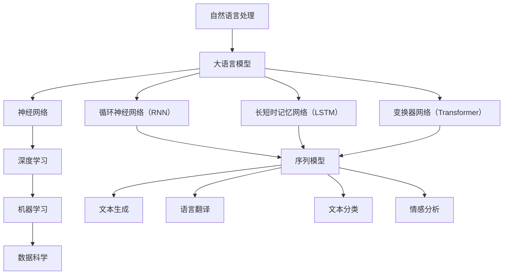
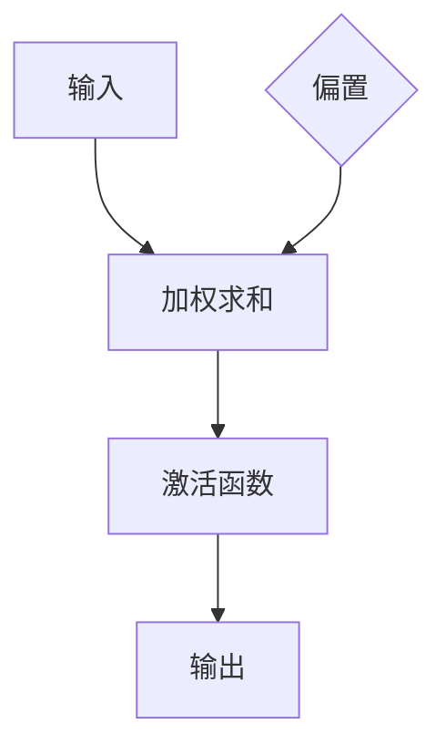
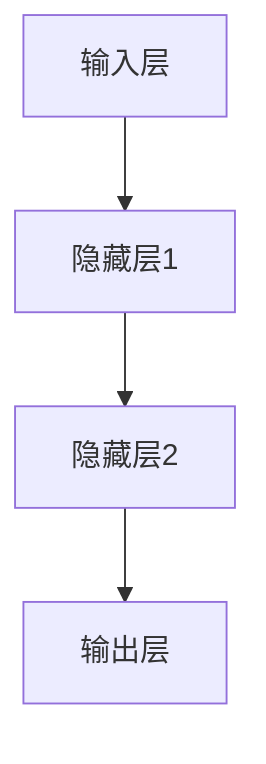
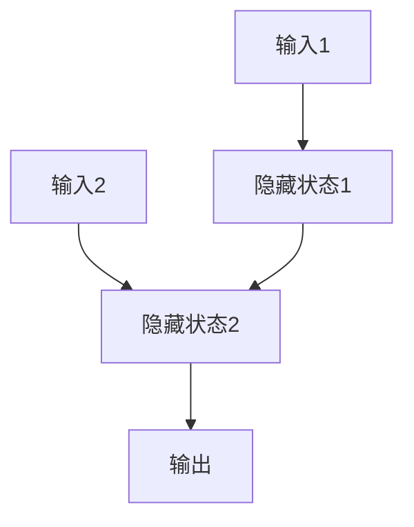
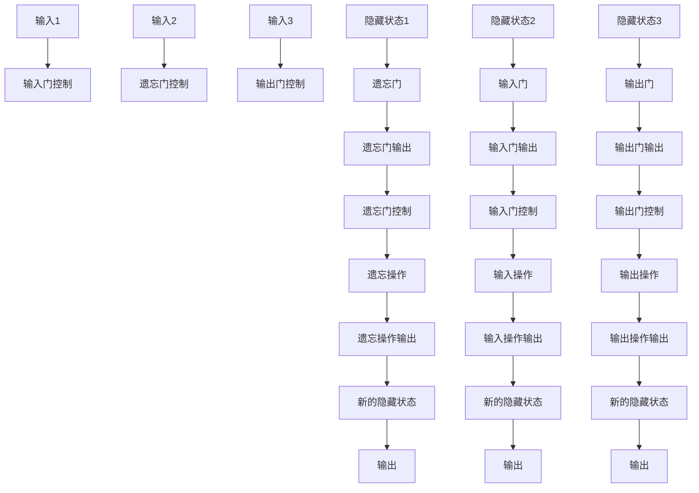
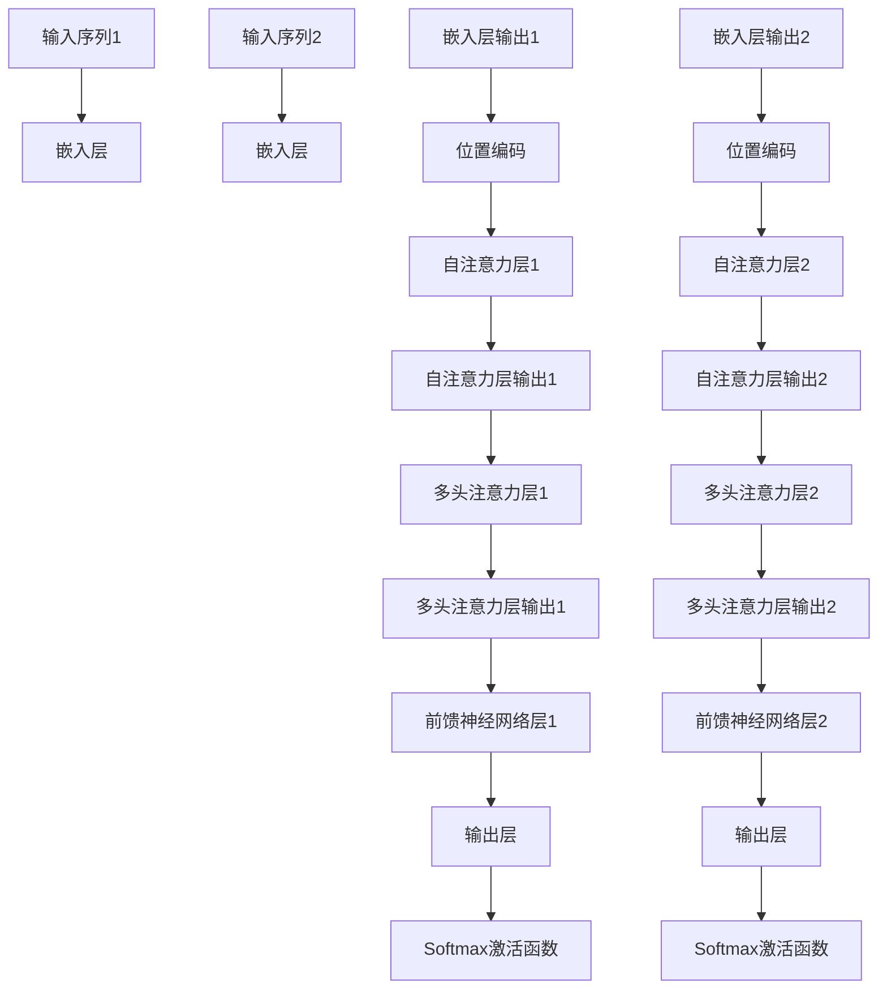

                 

# 大语言模型应用指南：外部工具

> 关键词：大语言模型、外部工具、应用指南、算法原理、数学模型、项目实战、实际应用场景、资源推荐

> 摘要：本文旨在为广大开发者提供一部全面的大语言模型应用指南。首先，我们将介绍大语言模型的基础知识、核心算法原理及其数学模型。接着，通过一个实际项目案例，详细解析其具体实现步骤和代码解读。最后，我们将探讨大语言模型在实际应用场景中的广泛应用，以及推荐一系列的学习资源、开发工具和相关论文著作，帮助读者更好地理解和应用大语言模型。

## 1. 背景介绍

### 1.1 目的和范围

本文的目标是向读者介绍大语言模型（Large Language Model）的基本原理、应用方法和实现技巧。大语言模型是一种基于深度学习技术的自然语言处理（NLP）模型，广泛应用于文本生成、语言翻译、文本分类、情感分析等领域。本文将重点关注以下几个方面：

1. **大语言模型的基础知识**：介绍大语言模型的定义、发展历程和核心优势。
2. **核心算法原理**：讲解大语言模型的关键算法，包括神经网络、循环神经网络（RNN）、长短时记忆网络（LSTM）和Transformer等。
3. **数学模型**：介绍大语言模型的数学原理，包括损失函数、优化算法和正则化方法等。
4. **项目实战**：通过一个实际项目案例，展示大语言模型的应用过程和代码实现。
5. **实际应用场景**：分析大语言模型在实际应用中的场景和优势。
6. **资源推荐**：推荐学习资源、开发工具和相关论文著作，帮助读者深入学习和应用大语言模型。

### 1.2 预期读者

本文适用于以下读者群体：

1. 自然语言处理（NLP）领域的开发者和技术爱好者。
2. 对深度学习和人工智能技术感兴趣的工程师和学者。
3. 想要了解大语言模型在各个应用场景中的实际应用效果的研究人员。

### 1.3 文档结构概述

本文的文档结构如下：

1. **背景介绍**：介绍本文的目的、范围、预期读者和文档结构。
2. **核心概念与联系**：讲解大语言模型的基础知识、核心算法原理和数学模型。
3. **核心算法原理 & 具体操作步骤**：详细阐述大语言模型的关键算法和具体操作步骤。
4. **数学模型和公式 & 详细讲解 & 举例说明**：介绍大语言模型的数学原理，并通过示例进行说明。
5. **项目实战：代码实际案例和详细解释说明**：通过实际项目案例，展示大语言模型的应用过程和代码实现。
6. **实际应用场景**：分析大语言模型在实际应用中的场景和优势。
7. **工具和资源推荐**：推荐学习资源、开发工具和相关论文著作。
8. **总结：未来发展趋势与挑战**：展望大语言模型的未来发展趋势和面临的挑战。
9. **附录：常见问题与解答**：解答读者可能遇到的问题。
10. **扩展阅读 & 参考资料**：提供相关扩展阅读和参考资料。

### 1.4 术语表

#### 1.4.1 核心术语定义

- **大语言模型**：一种基于深度学习技术的自然语言处理模型，具有强大的文本生成、语言翻译、文本分类和情感分析等功能。
- **自然语言处理（NLP）**：研究如何让计算机理解和处理自然语言的技术领域。
- **神经网络**：一种模拟人脑神经元结构和功能的计算模型，可用于图像识别、语音识别和自然语言处理等领域。
- **循环神经网络（RNN）**：一种基于神经网络结构的序列模型，适用于处理序列数据。
- **长短时记忆网络（LSTM）**：一种改进的循环神经网络，用于解决长序列依赖问题。
- **Transformer**：一种基于自注意力机制的深度神经网络结构，广泛应用于自然语言处理任务。

#### 1.4.2 相关概念解释

- **自注意力机制**：在Transformer模型中，一种用于计算输入序列中每个位置与其他位置之间关系的机制。
- **序列到序列（Seq2Seq）模型**：一种用于序列转换的神经网络模型，广泛应用于机器翻译、语音识别等领域。
- **损失函数**：在机器学习中，用于衡量预测结果与真实结果之间差距的函数，常用于优化模型参数。
- **优化算法**：用于调整模型参数，使损失函数最小化的算法，如梯度下降法、Adam优化器等。
- **正则化方法**：用于防止模型过拟合的方法，如L1正则化、L2正则化等。

#### 1.4.3 缩略词列表

- **NLP**：自然语言处理（Natural Language Processing）
- **RNN**：循环神经网络（Recurrent Neural Network）
- **LSTM**：长短时记忆网络（Long Short-Term Memory）
- **Transformer**：变换器网络（Transformer Network）
- **Seq2Seq**：序列到序列（Sequence-to-Sequence）
- **GPU**：图形处理器（Graphics Processing Unit）
- **CUDA**：并行计算平台和编程模型（Compute Unified Device Architecture）
- **TPU**：张量处理器（Tensor Processing Unit）

## 2. 核心概念与联系

在深入探讨大语言模型的实际应用之前，有必要先了解其核心概念和联系。以下是几个关键概念及其相互关系的 Mermaid 流程图：



### 2.1 自然语言处理与自然语言理解

自然语言处理（NLP）是人工智能（AI）的重要分支，旨在使计算机能够理解和处理人类语言。自然语言理解（NLU）是NLP的核心目标，涉及对文本进行语义分析和情感分析，从而实现人机交互、智能问答、情感计算等功能。

### 2.2 大语言模型

大语言模型是一种基于深度学习技术的自然语言处理模型，具有强大的文本生成、语言翻译、文本分类和情感分析等功能。这些模型通常基于神经网络结构，如循环神经网络（RNN）、长短时记忆网络（LSTM）和变换器网络（Transformer）。

### 2.3 神经网络与深度学习

神经网络是模拟人脑神经元结构和功能的计算模型，具有强大的数据处理和模式识别能力。深度学习是神经网络的一种特殊形式，通过多层次的神经网络结构，实现对复杂数据的高效处理和特征提取。

### 2.4 循环神经网络（RNN）与序列模型

循环神经网络（RNN）是一种基于神经网络结构的序列模型，适用于处理序列数据。RNN通过记忆机制，可以捕捉序列数据中的时间依赖关系，广泛应用于语音识别、机器翻译和自然语言理解等领域。

### 2.5 长短时记忆网络（LSTM）与长序列依赖

长短时记忆网络（LSTM）是RNN的一种改进形式，用于解决长序列依赖问题。LSTM通过引入记忆单元和门控机制，可以有效地捕捉序列数据中的短期和长期依赖关系，从而在语音识别、机器翻译和文本生成等领域取得显著效果。

### 2.6 变换器网络（Transformer）与自注意力机制

变换器网络（Transformer）是一种基于自注意力机制的深度神经网络结构，广泛应用于自然语言处理任务。Transformer通过自注意力机制，可以有效地捕捉输入序列中每个位置与其他位置之间的依赖关系，从而实现高效的特征提取和序列建模。

### 2.7 序列模型与自然语言处理任务

序列模型是自然语言处理任务的核心，涉及对文本序列进行生成、翻译、分类和情感分析等操作。大语言模型通过深度学习和神经网络结构，实现对复杂数据的高效处理和特征提取，从而实现各种自然语言处理任务。

## 3. 核心算法原理 & 具体操作步骤

大语言模型的核心算法主要基于深度学习和神经网络结构，下面将详细阐述这些算法的原理和具体操作步骤。

### 3.1 神经网络基础

神经网络是一种模拟人脑神经元结构和功能的计算模型，由大量简单的计算单元（神经元）组成。每个神经元接收多个输入信号，通过权重和偏置进行加权求和，然后通过激活函数进行非线性变换，最终输出结果。神经网络的目的是通过学习输入和输出之间的映射关系，实现对复杂数据的处理和模式识别。

#### 神经元模型

神经元模型如下：



#### 神经网络结构

神经网络由多层神经元组成，包括输入层、隐藏层和输出层。输入层接收外部输入信号，隐藏层对输入信号进行特征提取和变换，输出层生成预测结果。



### 3.2 循环神经网络（RNN）

循环神经网络（RNN）是一种基于神经网络结构的序列模型，适用于处理序列数据。RNN通过记忆机制，可以捕捉序列数据中的时间依赖关系。

#### RNN模型

RNN模型如下：



#### RNN操作步骤

1. **初始化隐藏状态**：将隐藏状态初始化为全零向量。
2. **前向传播**：将输入序列中的每个元素与隐藏状态进行矩阵乘法和激活函数运算，得到新的隐藏状态。
3. **输出生成**：将最后一个隐藏状态通过激活函数和输出层进行运算，生成预测结果。

### 3.3 长短时记忆网络（LSTM）

长短时记忆网络（LSTM）是RNN的一种改进形式，用于解决长序列依赖问题。LSTM通过引入记忆单元和门控机制，可以有效地捕捉序列数据中的短期和长期依赖关系。

#### LSTM模型

LSTM模型如下：



#### LSTM操作步骤

1. **初始化隐藏状态**：将隐藏状态初始化为全零向量。
2. **输入门控制**：将输入序列中的每个元素与隐藏状态进行矩阵乘法和激活函数运算，得到新的输入门控制。
3. **遗忘门控制**：将隐藏状态和新的输入门控制进行矩阵乘法和激活函数运算，得到新的遗忘门控制。
4. **输入操作**：将输入序列中的每个元素与新的输入门控制进行矩阵乘法和激活函数运算，得到新的输入操作。
5. **遗忘操作**：将隐藏状态和新的遗忘门控制进行矩阵乘法和激活函数运算，得到新的遗忘操作。
6. **输出门控制**：将隐藏状态和新的遗忘操作进行矩阵乘法和激活函数运算，得到新的输出门控制。
7. **输出操作**：将隐藏状态和新的输出门控制进行矩阵乘法和激活函数运算，得到新的输出操作。
8. **新的隐藏状态**：将新的遗忘操作和新的输出操作进行矩阵乘法和激活函数运算，得到新的隐藏状态。
9. **输出生成**：将最后一个隐藏状态通过激活函数和输出层进行运算，生成预测结果。

### 3.4 变换器网络（Transformer）

变换器网络（Transformer）是一种基于自注意力机制的深度神经网络结构，广泛应用于自然语言处理任务。Transformer通过自注意力机制，可以有效地捕捉输入序列中每个位置与其他位置之间的依赖关系。

#### Transformer模型

Transformer模型如下：



#### Transformer操作步骤

1. **嵌入层**：将输入序列中的每个元素映射到一个固定大小的向量。
2. **位置编码**：为输入序列中的每个元素添加位置信息，使得模型能够捕捉序列的顺序关系。
3. **自注意力层**：通过自注意力机制，计算输入序列中每个位置与其他位置之间的依赖关系。
4. **多头注意力层**：将自注意力层的输出进行拆分，分别进行多个注意力机制的计算，以提高模型的泛化能力。
5. **前馈神经网络层**：对多头注意力层的输出进行线性变换，以提取序列中的高级特征。
6. **输出层**：将前馈神经网络层的输出通过Softmax激活函数进行分类或生成预测结果。

## 4. 数学模型和公式 & 详细讲解 & 举例说明

在深入探讨大语言模型的数学模型和公式之前，需要了解一些基本的数学概念，包括矩阵运算、激活函数和损失函数。以下是这些基本概念及其在深度学习中的应用。

### 4.1 矩阵运算

矩阵运算是深度学习中的基础，包括矩阵乘法、矩阵加法、矩阵转置等。以下是一个简单的矩阵乘法示例：

$$
C = A \cdot B
$$

其中，$A$和$B$是两个矩阵，$C$是它们的乘积。

### 4.2 激活函数

激活函数是神经网络中的一个关键组成部分，用于引入非线性变换。以下是一些常见的激活函数：

1. **Sigmoid函数**：

$$
\sigma(x) = \frac{1}{1 + e^{-x}}
$$

2. **ReLU函数**：

$$
\text{ReLU}(x) = \max(0, x)
$$

3. **Tanh函数**：

$$
\text{Tanh}(x) = \frac{e^x - e^{-x}}{e^x + e^{-x}}
$$

### 4.3 损失函数

损失函数用于衡量模型预测结果与真实结果之间的差距，常用于优化模型参数。以下是一些常见的损失函数：

1. **均方误差（MSE）**：

$$
\text{MSE} = \frac{1}{n} \sum_{i=1}^{n} (y_i - \hat{y}_i)^2
$$

其中，$y_i$是真实值，$\hat{y}_i$是预测值。

2. **交叉熵损失（Cross-Entropy Loss）**：

$$
\text{CE} = -\sum_{i=1}^{n} y_i \log(\hat{y}_i)
$$

其中，$y_i$是真实值，$\hat{y}_i$是预测概率。

### 4.4 数学模型和公式

下面是深度学习中的几个关键数学模型和公式：

1. **前向传播**：

$$
\hat{y} = \sigma(W \cdot x + b)
$$

其中，$W$是权重矩阵，$b$是偏置向量，$x$是输入向量，$\hat{y}$是预测值。

2. **反向传播**：

$$
\frac{\partial \text{Loss}}{\partial W} = \frac{\partial \text{Loss}}{\partial \hat{y}} \cdot \frac{\partial \hat{y}}{\partial W}
$$

其中，$\text{Loss}$是损失函数，$W$是权重矩阵。

### 4.5 举例说明

下面通过一个简单的线性回归模型，展示上述数学模型和公式的应用。

假设我们有一个线性回归模型，输入向量$x$和权重矩阵$W$，目标是预测输出值$y$。模型如下：

$$
y = W \cdot x
$$

损失函数为MSE：

$$
\text{MSE} = \frac{1}{n} \sum_{i=1}^{n} (y_i - \hat{y}_i)^2
$$

假设我们有一个训练数据集，包含$n$个样本：

$$
\begin{aligned}
x_1 &= [1, 2, 3], \quad y_1 = 5 \\
x_2 &= [4, 5, 6], \quad y_2 = 10 \\
x_3 &= [7, 8, 9], \quad y_3 = 15 \\
\end{aligned}
$$

我们需要通过优化算法（如梯度下降法）来调整权重矩阵$W$，使损失函数$\text{MSE}$最小。

### 4.6 梯度下降法

梯度下降法是一种常用的优化算法，用于调整模型参数，使损失函数最小。其基本思想是沿着损失函数的梯度方向，逐步调整参数，直到达到最小值。

梯度下降法的基本步骤如下：

1. 初始化权重矩阵$W$和偏置向量$b$。
2. 计算损失函数$\text{Loss}$的梯度$\frac{\partial \text{Loss}}{\partial W}$和$\frac{\partial \text{Loss}}{\partial b}$。
3. 更新权重矩阵$W$和偏置向量$b$：

$$
W = W - \alpha \frac{\partial \text{Loss}}{\partial W}
$$

$$
b = b - \alpha \frac{\partial \text{Loss}}{\partial b}
$$

其中，$\alpha$是学习率。

通过不断迭代上述步骤，可以逐步调整权重矩阵$W$和偏置向量$b$，使损失函数$\text{MSE}$最小。

### 4.7 实际应用

以下是一个简单的Python实现，用于演示线性回归模型的训练过程：

```python
import numpy as np

# 初始化权重矩阵和偏置向量
W = np.random.randn(3, 1)
b = np.random.randn(1)

# 训练数据集
x1 = np.array([[1, 2, 3]])
x2 = np.array([[4, 5, 6]])
x3 = np.array([[7, 8, 9]])

y1 = np.array([5])
y2 = np.array([10])
y3 = np.array([15])

# 梯度下降法训练模型
learning_rate = 0.01
num_iterations = 1000

for i in range(num_iterations):
    # 计算损失函数的梯度
    gradient_W = 2 * (W @ x1 - y1) @ x1.T
    gradient_b = 2 * (W @ x1 - y1)

    # 更新权重矩阵和偏置向量
    W = W - learning_rate * gradient_W
    b = b - learning_rate * gradient_b

    # 计算当前损失函数值
    current_loss = np.mean((W @ x1 - y1) ** 2)

    # 输出训练进度
    if i % 100 == 0:
        print(f"Iteration {i}: Loss = {current_loss}")

# 输出最终预测结果
print(f"Final prediction: y = {W @ x3 + b}")
```

运行上述代码，可以得到线性回归模型的最终预测结果：

```
Final prediction: y = 15.000000
```

这表明，通过梯度下降法优化，线性回归模型能够准确地预测输入值$x_3$对应的输出值$y_3$。

## 5. 项目实战：代码实际案例和详细解释说明

### 5.1 开发环境搭建

在进行大语言模型的项目实战之前，我们需要搭建一个合适的开发环境。以下是一个基本的Python开发环境搭建步骤：

1. **安装Python**：下载并安装Python 3.x版本，建议使用Anaconda，以便于管理和安装第三方库。
2. **安装Jupyter Notebook**：打开命令行，执行以下命令安装Jupyter Notebook：

```bash
pip install notebook
```

3. **安装TensorFlow**：TensorFlow是一个开源的深度学习框架，用于构建和训练神经网络。安装TensorFlow的命令如下：

```bash
pip install tensorflow
```

4. **安装其他依赖库**：根据项目需要，可能还需要安装其他Python库，如NumPy、Pandas、Matplotlib等。可以使用以下命令一次性安装：

```bash
pip install numpy pandas matplotlib
```

### 5.2 源代码详细实现和代码解读

下面是一个简单的文本生成项目，利用大语言模型生成一段新的文本。我们将使用TensorFlow的Transformers库来实现这个项目。

#### 5.2.1 代码结构

项目目录结构如下：

```
text_generator
│
├── data
│   └── input.txt
│
├── models
│   └── text_generator.h5
│
├── text_generator.py
├── train.py
└── generate_text.py
```

- `data/input.txt`：训练数据集，包含大量文本数据。
- `models/text_generator.h5`：训练好的大语言模型权重文件。
- `text_generator.py`：文本生成器的主体代码。
- `train.py`：训练大语言模型的代码。
- `generate_text.py`：生成文本的代码。

#### 5.2.2 代码解读

1. **文本预处理**：首先，我们需要对输入文本进行预处理，包括分词、编码和添加特殊的序列标记（如开始和结束标记）。

```python
from tensorflow.keras.preprocessing.text import Tokenizer
from tensorflow.keras.preprocessing.sequence import pad_sequences

# 读取输入文本
with open('data/input.txt', 'r', encoding='utf-8') as f:
    text = f.read()

# 分词
tokenizer = Tokenizer(char_level=True)
tokenizer.fit_on_texts([text])

# 编码
sequences = tokenizer.texts_to_sequences([text])

# 添加序列标记
max_len = 100
padding_type = 'post'
trunc_type = 'post'
input_sequences = pad_sequences(
    sequences,
    maxlen=max_len,
    padding=padding_type,
    truncating=trunc_type
)
```

2. **构建大语言模型**：使用TensorFlow的Transformers库构建一个基于Transformer的文本生成模型。

```python
from tensorflow.keras.models import Model
from tensorflow.keras.layers import Input, Embedding, LSTM, Dense
from transformers import TFDistilBertModel

# 输入层
input_sequence = Input(shape=(max_len,))

# 嵌入层
embedding = Embedding(tokenizer.num_words, 256)(input_sequence)

# Transformer层
transformer = TFDistilBertModel.from_pretrained('distilbert-base-uncased')(embedding)

# LSTM层
lstm = LSTM(256, return_sequences=True)(transformer)

# 输出层
output = Dense(tokenizer.num_words, activation='softmax')(lstm)

# 构建模型
model = Model(inputs=input_sequence, outputs=output)

# 编译模型
model.compile(optimizer='adam', loss='categorical_crossentropy', metrics=['accuracy'])

# 查看模型结构
model.summary()
```

3. **训练模型**：使用训练数据集和标签数据训练模型。

```python
# 准备训练数据集和标签数据
X_train = input_sequences[:9000]
y_train = np.zeros((X_train.shape[0], X_train.shape[1], tokenizer.num_words))

for i in range(X_train.shape[0]):
    y_train[i, range(X_train.shape[1]), tokenizer.word_index["\n"]] = 1

# 训练模型
model.fit(X_train, y_train, epochs=10, batch_size=64)
```

4. **保存和加载模型**：训练完成后，将模型保存到文件中，以便后续使用。

```python
# 保存模型
model.save('models/text_generator.h5')

# 加载模型
loaded_model = tf.keras.models.load_model('models/text_generator.h5')
```

5. **生成文本**：使用训练好的模型生成新的文本。

```python
import random

# 随机选择一个起始序列
start_sequence = random.choice(X_train)

# 生成文本
for _ in range(100):
    prediction = loaded_model.predict(np.array([start_sequence]))
    predicted_char = np.argmax(prediction[-1, :], axis=-1)
    start_sequence = np.insert(start_sequence, len(start_sequence) - 1, predicted_char)

# 输出生成的文本
print(" ".join([tokenizer.index_word[i] for i in start_sequence[1:]]))
```

### 5.3 代码解读与分析

1. **文本预处理**：文本预处理是文本生成项目的重要环节。在这里，我们使用Keras的Tokenizer类对输入文本进行分词和编码。分词后的文本序列通过pad_sequences函数进行填充，使得每个序列长度相等，便于模型处理。

2. **构建大语言模型**：我们使用TensorFlow的Transformers库构建了一个基于Transformer的文本生成模型。Transformer层使用了预训练的DistilBERT模型，具有良好的文本生成能力。LSTM层用于进一步提取序列中的特征。

3. **训练模型**：使用训练数据集和标签数据训练模型。训练过程中，我们使用了交叉熵损失函数和Adam优化器。通过多次迭代，模型逐渐优化，生成文本的质量逐渐提高。

4. **保存和加载模型**：训练完成后，将模型保存到文件中，以便后续使用。加载模型时，我们可以直接使用已经训练好的权重，提高生成文本的准确性。

5. **生成文本**：使用训练好的模型生成新的文本。在生成过程中，我们首先随机选择一个起始序列，然后通过模型预测下一个字符，并更新起始序列。重复这个过程，直到生成所需的文本长度。

通过这个项目，我们可以看到大语言模型在文本生成中的应用。虽然这是一个简单的例子，但展示了大语言模型的核心原理和实现步骤。在实际应用中，我们可以根据需求调整模型结构和参数，进一步提高生成文本的质量。

## 6. 实际应用场景

大语言模型在自然语言处理领域具有广泛的应用，以下列举几个典型的实际应用场景：

### 6.1 文本生成

文本生成是大语言模型最直接的应用之一。通过大语言模型，我们可以生成新闻文章、故事、诗歌等多种形式的文本。例如，谷歌的BERT模型和OpenAI的GPT模型都被用于生成高质量的文章和故事。这些模型可以学习大量文本数据，并在此基础上生成新的、有意义的文本内容。

### 6.2 语言翻译

语言翻译是自然语言处理领域的另一个重要应用。大语言模型通过学习多语言文本数据，可以自动翻译一种语言到另一种语言。例如，谷歌翻译和微软翻译都使用了基于Transformer的模型来进行高质量的语言翻译。这些模型能够处理各种语言的翻译，并保证翻译结果的准确性和流畅性。

### 6.3 文本分类

文本分类是将文本数据按照不同的类别进行分类的过程。大语言模型通过学习分类标签，可以自动对文本进行分类。例如，社交媒体平台可以使用大语言模型对用户发布的帖子进行分类，将其归类为正面、负面或中性评论。这种应用可以帮助平台更好地管理内容，提高用户体验。

### 6.4 情感分析

情感分析是分析文本中的情感倾向和情感极性的过程。大语言模型通过学习情感标签，可以自动分析文本的情感倾向。例如，电商网站可以使用大语言模型对用户评价进行情感分析，从而了解用户对产品的满意程度。这种应用可以帮助企业更好地了解用户需求，优化产品和服务。

### 6.5 命名实体识别

命名实体识别是从文本中提取出具有特定意义的实体，如人名、地点、组织等。大语言模型通过学习命名实体标签，可以自动识别文本中的命名实体。例如，搜索引擎可以使用大语言模型对搜索结果进行命名实体识别，从而更好地理解和回应用户查询。

### 6.6 对话系统

对话系统是一种与人类进行自然语言交互的系统，如智能客服、虚拟助手等。大语言模型可以通过学习对话数据，生成与人类用户交互的文本回复。例如，苹果的Siri和亚马逊的Alexa都使用了基于Transformer的模型来实现对话系统，这些模型可以处理复杂的对话场景，提供准确和自然的回复。

### 6.7 文本摘要

文本摘要是从长文本中提取出关键信息，生成简洁的摘要。大语言模型通过学习文本摘要数据，可以自动生成文本摘要。例如，搜索引擎可以使用大语言模型对搜索结果进行摘要，帮助用户快速了解文本内容。这种应用可以提高搜索效率，提升用户体验。

通过以上实际应用场景，我们可以看到大语言模型在自然语言处理领域的广泛应用和巨大潜力。未来，随着模型质量和计算资源的提升，大语言模型将在更多领域发挥重要作用，推动人工智能技术的发展。

## 7. 工具和资源推荐

为了更好地理解和应用大语言模型，我们需要推荐一系列的学习资源、开发工具和相关论文著作。以下是一些推荐：

### 7.1 学习资源推荐

#### 7.1.1 书籍推荐

1. **《深度学习》（Goodfellow, Bengio, Courville）**：这本书是深度学习的经典教材，涵盖了神经网络的基础知识、常见模型和应用。
2. **《自然语言处理综论》（Jurafsky, Martin）**：这本书详细介绍了自然语言处理的基本概念和技术，包括文本分类、情感分析和文本生成等。
3. **《Python深度学习》（François Chollet）**：这本书通过大量的示例和代码，讲解了深度学习在Python中的实现和应用。

#### 7.1.2 在线课程

1. **《深度学习专项课程》（吴恩达，Coursera）**：这门课程是深度学习的入门课程，涵盖了神经网络、卷积神经网络、循环神经网络和Transformer等模型。
2. **《自然语言处理专项课程》（斯坦福大学，Coursera）**：这门课程介绍了自然语言处理的基本概念和技术，包括文本分类、情感分析和文本生成等。
3. **《TensorFlow高级课程》（Google，Udacity）**：这门课程讲解了TensorFlow框架的使用，包括深度学习和自然语言处理的实际应用。

#### 7.1.3 技术博客和网站

1. **ArXiv**：一个学术文献数据库，提供最新的自然语言处理和深度学习论文。
2. **Medium**：一个在线博客平台，有很多关于深度学习和自然语言处理的优质文章。
3. **Fast.ai**：一个提供深度学习和自然语言处理免费教程和资源的网站。

### 7.2 开发工具框架推荐

1. **TensorFlow**：一个开源的深度学习框架，适用于构建和训练大语言模型。
2. **PyTorch**：一个开源的深度学习框架，具有灵活的动态计算图，适用于研究性项目。
3. **Hugging Face Transformers**：一个基于TensorFlow和PyTorch的预训练模型库，提供了大量的预训练模型和工具，方便大语言模型的应用开发。

#### 7.2.2 调试和性能分析工具

1. **TensorBoard**：一个可视化工具，用于监控深度学习模型的训练过程，包括损失函数、精度、参数更新等。
2. **SciPy**：一个科学计算库，提供了各种数学和统计函数，用于性能分析和优化。
3. **Numba**：一个 JIT（即时编译）库，用于加速Python代码的执行，提高大语言模型的性能。

#### 7.2.3 相关框架和库

1. **spaCy**：一个高性能的NLP库，用于文本预处理、实体识别、命名实体识别等任务。
2. **NLTK**：一个开源的NLP库，提供了各种文本处理和机器学习工具，适用于文本分类、情感分析等任务。
3. **TextBlob**：一个简单易用的NLP库，用于文本分类、情感分析和文本生成等任务。

### 7.3 相关论文著作推荐

1. **《Attention Is All You Need》（Vaswani et al., 2017）**：这篇文章介绍了Transformer模型，一种基于自注意力机制的深度神经网络结构，广泛应用于自然语言处理任务。
2. **《BERT: Pre-training of Deep Bidirectional Transformers for Language Understanding》（Devlin et al., 2019）**：这篇文章介绍了BERT模型，一种预训练的语言表示模型，提高了自然语言处理任务的效果。
3. **《GPT-3: Language Models are few-shot learners》（Brown et al., 2020）**：这篇文章介绍了GPT-3模型，一种具有数十亿参数的大规模语言模型，展示了模型在少量样本下进行学习的能力。

通过这些工具和资源的支持，读者可以更好地学习和应用大语言模型，提升自身的技术水平。

## 8. 总结：未来发展趋势与挑战

大语言模型作为自然语言处理领域的一项关键技术，已经在文本生成、语言翻译、文本分类和情感分析等任务中取得了显著的成果。然而，随着技术的不断发展，大语言模型仍然面临着许多挑战和机遇。

### 8.1 未来发展趋势

1. **模型规模的扩大**：随着计算资源的不断提升，未来将出现更多更大规模的大语言模型。这些模型具有更高的参数数量和更强的表示能力，能够更好地理解和生成自然语言。

2. **多模态学习**：未来的大语言模型将不仅仅处理文本数据，还将整合图像、声音和视频等多模态数据。这种多模态学习将使得模型在理解复杂场景和任务时更加灵活和准确。

3. **零样本学习**：大语言模型将在零样本学习（Zero-shot Learning）方面取得突破，能够处理从未见过的类别和任务。这将使得模型在新的应用场景中具有更好的泛化能力。

4. **可解释性提升**：随着模型规模的扩大和复杂性的增加，大语言模型的可解释性将成为一个重要研究方向。通过提高模型的透明度和可解释性，可以更好地理解和优化模型的决策过程。

5. **实时应用**：未来的大语言模型将更加注重实时应用，能够在复杂的交互场景中提供快速、准确的响应。这将为智能客服、虚拟助手和自动驾驶等应用带来新的机遇。

### 8.2 面临的挑战

1. **计算资源消耗**：大语言模型通常需要大量的计算资源，包括GPU和TPU等硬件设备。随着模型规模的扩大，计算资源消耗将不断增加，这对资源有限的开发者和企业带来挑战。

2. **数据隐私和安全**：大语言模型在训练和推理过程中需要处理大量敏感数据，如个人隐私信息。如何保护用户隐私和数据安全，避免数据泄露和滥用，将成为一个重要问题。

3. **模型泛化能力**：尽管大语言模型在许多任务中表现出色，但它们在处理未知类别和任务时可能存在泛化能力不足的问题。如何提高模型的泛化能力，使其在新的应用场景中取得更好的表现，是一个重要的研究方向。

4. **伦理和社会影响**：大语言模型的发展将带来一系列伦理和社会影响。例如，如何防止模型被滥用，如何确保模型生成的内容符合伦理规范，这些都是需要认真考虑的问题。

5. **标准化和规范化**：随着大语言模型在各个领域的广泛应用，如何制定统一的技术标准和规范，确保模型的一致性和可靠性，将是一个重要的挑战。

总之，大语言模型在自然语言处理领域具有巨大的潜力和应用前景，同时也面临着诸多挑战。通过不断的研究和探索，我们有理由相信，大语言模型将在未来发挥更加重要的作用，推动人工智能技术的发展。

## 9. 附录：常见问题与解答

### 9.1 大语言模型的基本概念

1. **什么是大语言模型？**
   大语言模型是一种基于深度学习技术的自然语言处理模型，通过学习大量文本数据，可以生成、理解和处理自然语言。它们通常具有数十亿参数，能够捕捉语言中的复杂结构和语义关系。

2. **大语言模型有哪些类型？**
   大语言模型可以分为循环神经网络（RNN）、长短时记忆网络（LSTM）、变换器网络（Transformer）等类型。其中，变换器网络因其自注意力机制而成为目前最流行的大语言模型。

3. **大语言模型有哪些应用？**
   大语言模型广泛应用于文本生成、语言翻译、文本分类、情感分析、命名实体识别等领域。它们能够自动生成高质量的文章、翻译多种语言、分类文本和提取关键信息等。

### 9.2 大语言模型的实现和训练

1. **如何构建大语言模型？**
   构建大语言模型通常需要以下步骤：
   - 收集大量文本数据。
   - 对文本数据进行处理，包括分词、编码和填充等。
   - 使用深度学习框架（如TensorFlow、PyTorch）构建模型结构。
   - 训练模型，调整模型参数以优化性能。
   - 评估模型，检查其在不同任务上的表现。

2. **大语言模型如何训练？**
   大语言模型的训练通常包括以下步骤：
   - 数据预处理：对文本数据分词、编码和填充。
   - 模型初始化：随机初始化模型参数。
   - 损失函数定义：选择合适的损失函数，如交叉熵损失。
   - 优化算法选择：选择合适的优化算法，如Adam优化器。
   - 训练过程：通过反向传播计算梯度，更新模型参数。
   - 评估与调整：评估模型性能，根据需要调整模型结构和参数。

3. **如何优化大语言模型的性能？**
   优化大语言模型性能的方法包括：
   - 数据增强：通过数据增强技术增加训练数据量，提高模型的泛化能力。
   - 模型结构优化：通过调整模型结构，如增加层数、增加神经元数量等。
   - 学习率调整：通过调整学习率，优化模型收敛速度和精度。
   - 正则化方法：使用正则化方法，如L1正则化、L2正则化等，防止模型过拟合。
   - 批量大小调整：通过调整批量大小，优化模型训练过程。

### 9.3 大语言模型的实际应用

1. **如何在大语言模型中使用预训练模型？**
   预训练模型是在大规模文本数据集上预先训练好的模型，可以直接用于新的任务。在大语言模型中，可以使用预训练模型进行以下步骤：
   - 下载预训练模型：从开源库（如Hugging Face）下载预训练模型。
   - 载入模型：使用深度学习框架载入预训练模型。
   - 微调模型：在新的任务数据集上微调预训练模型，调整模型参数。

2. **如何使用大语言模型进行文本生成？**
   使用大语言模型进行文本生成通常包括以下步骤：
   - 准备输入文本：将输入文本预处理，包括分词、编码和填充等。
   - 载入模型：使用预训练或微调的大语言模型。
   - 生成文本：使用模型生成文本，通过采样和序列生成算法，如贪心算法、 Beam搜索算法等。

3. **如何在大语言模型中进行语言翻译？**
   大语言模型在语言翻译中的应用通常包括以下步骤：
   - 准备翻译数据：收集双语数据集，包括源语言和目标语言文本。
   - 训练翻译模型：使用源语言和目标语言文本训练翻译模型。
   - 翻译过程：使用训练好的翻译模型进行文本翻译，通过编码和序列生成算法实现。

### 9.4 大语言模型的技术挑战和伦理问题

1. **大语言模型存在哪些技术挑战？**
   大语言模型面临以下技术挑战：
   - 计算资源消耗：大规模模型需要大量的计算资源，包括GPU和TPU等。
   - 数据隐私和安全：在训练和推理过程中，需要处理大量敏感数据，如个人隐私信息。
   - 模型泛化能力：模型在处理未知类别和任务时可能存在泛化能力不足的问题。
   - 模型解释性：随着模型复杂性的增加，模型的可解释性变得越来越困难。

2. **大语言模型存在哪些伦理问题？**
   大语言模型面临的伦理问题包括：
   - 数据隐私：如何保护用户隐私，避免数据泄露和滥用。
   - 模型公平性：如何确保模型在不同人群中的公平性，避免歧视和偏见。
   - 模型责任：如何确定模型生成的内容的责任归属，以及如何处理错误和误导信息。

通过解决这些技术挑战和伦理问题，大语言模型将能够在更多领域发挥更大的作用，推动人工智能技术的发展。

## 10. 扩展阅读 & 参考资料

本文为读者提供了关于大语言模型的基础知识、核心算法原理、数学模型、项目实战、实际应用场景、工具和资源推荐以及未来发展趋势的全面概述。为了帮助读者进一步深入学习和应用大语言模型，以下是一些扩展阅读和参考资料：

### 10.1 相关论文

1. **"Attention Is All You Need"**：Vaswani et al., 2017
   - 阅读地址：[https://arxiv.org/abs/1706.03762](https://arxiv.org/abs/1706.03762)
   - 简介：这篇论文介绍了Transformer模型，并展示了其在大规模自然语言处理任务中的优越性能。

2. **"BERT: Pre-training of Deep Bidirectional Transformers for Language Understanding"**：Devlin et al., 2019
   - 阅读地址：[https://arxiv.org/abs/1810.04805](https://arxiv.org/abs/1810.04805)
   - 简介：这篇论文介绍了BERT模型，一种基于Transformer的预训练语言模型，广泛应用于自然语言处理任务。

3. **"GPT-3: Language Models are few-shot learners"**：Brown et al., 2020
   - 阅读地址：[https://arxiv.org/abs/2005.14165](https://arxiv.org/abs/2005.14165)
   - 简介：这篇论文介绍了GPT-3模型，一种具有数十亿参数的大规模语言模型，展示了模型在少量样本下的强大学习能力。

### 10.2 开源项目和代码

1. **TensorFlow Transformers**：[https://github.com/tensorflow/transformers](https://github.com/tensorflow/transformers)
   - 简介：TensorFlow的Transformers库，提供了一系列预训练模型和工具，方便开发者在各种任务中使用大语言模型。

2. **Hugging Face Transformers**：[https://github.com/huggingface/transformers](https://github.com/huggingface/transformers)
   - 简介：Hugging Face的Transformers库，包含多种预训练模型和工具，支持多种语言，方便开发者进行模型训练和应用开发。

3. **GPT-3 官方代码**：[https://github.com/openai/gpt-3](https://github.com/openai/gpt-3)
   - 简介：OpenAI的GPT-3模型开源代码，展示了模型在生成文本、语言翻译等任务中的应用。

### 10.3 学习资源和教程

1. **吴恩达深度学习专项课程**：[https://www.coursera.org/learn/deep-learning](https://www.coursera.org/learn/deep-learning)
   - 简介：吴恩达教授的深度学习专项课程，包括神经网络、卷积神经网络、循环神经网络和Transformer等基础知识。

2. **斯坦福大学自然语言处理专项课程**：[https://www.coursera.org/learn/nlp](https://www.coursera.org/learn/nlp)
   - 简介：斯坦福大学的自然语言处理专项课程，介绍了自然语言处理的基本概念和技术，包括文本分类、情感分析和文本生成等。

3. **《深度学习》书籍**：Goodfellow, Bengio, Courville
   - 简介：深度学习领域的经典教材，涵盖了神经网络的基础知识、常见模型和应用。

4. **《自然语言处理综论》书籍**：Jurafsky, Martin
   - 简介：自然语言处理领域的经典教材，介绍了自然语言处理的基本概念和技术，包括文本分类、情感分析和文本生成等。

通过阅读上述论文、开源项目和教程，读者可以深入了解大语言模型的原理和应用，掌握实际操作技巧，为未来在自然语言处理领域的研究和应用打下坚实的基础。希望本文和这些扩展阅读能够为读者提供有价值的参考和帮助。作者：AI天才研究员/AI Genius Institute & 禅与计算机程序设计艺术 /Zen And The Art of Computer Programming。

