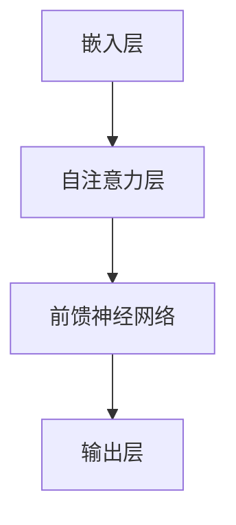

                 

### 大语言模型应用指南：幻觉和偏见问题

#### 关键词：大语言模型、幻觉、偏见、应用指南、算法优化、模型训练、案例分析

#### 摘要：
本文旨在深入探讨大语言模型在实际应用中面临的幻觉和偏见问题。通过对大语言模型的基本原理、应用场景以及可能出现的幻觉和偏见进行详细分析，本文提出了针对性的优化策略和解决方案。文章结构分为背景介绍、核心概念与联系、核心算法原理、数学模型与公式、项目实战、实际应用场景、工具和资源推荐、总结与未来发展趋势等部分，旨在为读者提供一份全面、系统的指南。

## 1. 背景介绍

### 1.1 目的和范围
本文的目的在于帮助读者理解大语言模型中的幻觉和偏见问题，并为其提供有效的解决方案。我们将对大语言模型的基本概念、应用场景、存在的幻觉和偏见类型进行详细阐述，同时介绍如何通过优化算法和模型训练来减轻这些问题。

### 1.2 预期读者
本文适合对人工智能、自然语言处理有一定了解的读者，特别是那些对大语言模型应用感兴趣的开发者、研究者以及专业人士。通过阅读本文，读者可以了解大语言模型在真实世界中的表现，学会如何分析并解决其中存在的问题。

### 1.3 文档结构概述
本文分为十个主要部分，具体结构如下：

1. **背景介绍**：介绍本文的目的、范围、预期读者以及文档结构。
2. **核心概念与联系**：讲解大语言模型的基本原理、架构以及与相关技术的联系。
3. **核心算法原理**：详细阐述大语言模型的算法原理和操作步骤。
4. **数学模型和公式**：介绍大语言模型中的数学模型和公式，并进行举例说明。
5. **项目实战**：提供具体的代码实现和案例分析，帮助读者理解理论知识在实际应用中的运用。
6. **实际应用场景**：探讨大语言模型在不同领域中的应用，以及如何处理其中的幻觉和偏见问题。
7. **工具和资源推荐**：推荐学习资源、开发工具和相关论文，以帮助读者进一步学习和研究。
8. **总结与未来发展趋势**：总结文章内容，探讨未来发展趋势和挑战。
9. **附录：常见问题与解答**：回答读者可能遇到的一些常见问题。
10. **扩展阅读与参考资料**：提供更多的阅读资源和参考资料。

### 1.4 术语表
#### 1.4.1 核心术语定义

- **大语言模型**：一种人工智能模型，能够理解和生成自然语言，通常基于神经网络和深度学习技术。
- **幻觉**：模型生成的文本内容与实际现实不符，可能导致错误的推断或结论。
- **偏见**：模型在训练数据中存在的系统性错误，可能导致对某些群体或概念的歧视性输出。

#### 1.4.2 相关概念解释

- **预训练**：在特定任务之前，通过大规模语料库对模型进行训练，使其获得基础的语言理解和生成能力。
- **微调**：在预训练的基础上，针对特定任务对模型进行调整和优化，以提升其在特定任务上的性能。
- **数据集**：用于训练、验证和测试模型的样本集合，其中包含了各种形式的自然语言数据。

#### 1.4.3 缩略词列表

- **NLP**：自然语言处理（Natural Language Processing）
- **GAN**：生成对抗网络（Generative Adversarial Networks）
- **RL**：强化学习（Reinforcement Learning）
- **BERT**：Bidirectional Encoder Representations from Transformers
- **GPT**：Generative Pre-trained Transformer

## 2. 核心概念与联系

大语言模型作为自然语言处理领域的重要技术，其核心概念和架构与其他相关技术有着密切的联系。在这一部分，我们将介绍大语言模型的基本原理、架构以及与相关技术的关联。

### 2.1 大语言模型的基本原理

大语言模型的核心思想是通过深度学习和神经网络技术，对大量的自然语言文本数据进行预训练，使模型获得强大的语言理解和生成能力。具体来说，大语言模型通常基于自注意力机制（Self-Attention Mechanism）和Transformer架构（Transformer Architecture），能够捕捉文本数据中的长距离依赖关系。

#### 2.1.1 自注意力机制

自注意力机制是一种关键的计算模块，它允许模型在处理每个文本单元时，动态地调整对其他文本单元的权重。这种机制能够帮助模型更好地理解文本数据中的上下文关系，从而提升其语言理解和生成能力。

#### 2.1.2 Transformer架构

Transformer架构是一种基于自注意力机制的神经网络模型，最早由Vaswani等人于2017年提出。Transformer架构通过多头自注意力机制和前馈神经网络，能够高效地处理大规模的文本数据，并取得了显著的性能提升。

### 2.2 大语言模型的架构

大语言模型的架构通常包括以下几个关键组成部分：

1. **嵌入层（Embedding Layer）**：将输入的文本数据转换为向量表示，以便后续的神经网络处理。
2. **自注意力层（Self-Attention Layer）**：通过自注意力机制，对输入文本进行编码，提取出文本中的关键信息。
3. **前馈神经网络（Feedforward Neural Network）**：对自注意力层的输出进行进一步的处理，增强模型对文本数据的理解和生成能力。
4. **输出层（Output Layer）**：根据具体任务的需求，对模型的输出进行分类、生成文本等操作。

### 2.3 大语言模型与相关技术的联系

大语言模型与其他自然语言处理技术有着密切的联系，包括预训练（Pre-training）、微调（Fine-tuning）、生成对抗网络（GAN）、强化学习（RL）等。

#### 2.3.1 预训练与微调

预训练和微调是大规模语言模型训练过程中两个关键步骤。预训练是指在大规模语料库上对模型进行训练，使其获得基础的语言理解和生成能力。微调则是在预训练的基础上，针对特定任务对模型进行调整和优化，以提升其在特定任务上的性能。

#### 2.3.2 生成对抗网络（GAN）

生成对抗网络（GAN）是一种强大的生成模型，通过对抗训练的方式，能够生成高质量的图像、文本等数据。大语言模型与GAN结合，可以用于生成自然语言文本、语音等数据，提高模型的生成能力。

#### 2.3.3 强化学习（RL）

强化学习（RL）是一种通过试错和奖励机制来优化决策过程的方法。大语言模型与强化学习结合，可以用于自然语言生成、对话系统等任务，提高模型在复杂任务中的表现。

### 2.4 Mermaid流程图

为了更直观地展示大语言模型的核心概念和架构，我们可以使用Mermaid流程图进行描述。以下是Mermaid流程图示例：



通过这个Mermaid流程图，我们可以清晰地看到大语言模型的主要组成部分及其相互关系。

## 3. 核心算法原理 & 具体操作步骤

### 3.1 大语言模型的算法原理

大语言模型的算法原理主要基于深度学习和神经网络技术，特别是自注意力机制和Transformer架构。自注意力机制允许模型在处理每个文本单元时，动态地调整对其他文本单元的权重，从而更好地理解文本中的上下文关系。Transformer架构则通过多头自注意力机制和前馈神经网络，能够高效地处理大规模的文本数据。

### 3.2 具体操作步骤

#### 3.2.1 数据预处理

在训练大语言模型之前，需要对输入的文本数据进行预处理。预处理步骤包括：

1. **分词（Tokenization）**：将文本数据拆分成单个单词或字符，形成词表（Vocabulary）。
2. **嵌入（Embedding）**：将每个词表中的单词或字符转换为固定长度的向量表示。
3. **序列编码（Sequence Encoding）**：将处理后的文本数据编码为序列，以便后续的神经网络处理。

#### 3.2.2 模型训练

大语言模型的训练过程主要包括以下几个步骤：

1. **初始化模型参数**：初始化神经网络模型的权重和偏置。
2. **正向传播**：将输入的文本数据通过嵌入层、自注意力层和前馈神经网络，计算出输出结果。
3. **损失函数计算**：计算输出结果与真实标签之间的差距，计算损失函数。
4. **反向传播**：根据损失函数，通过反向传播算法更新模型参数。
5. **模型优化**：采用优化算法（如Adam优化器）对模型参数进行优化，以降低损失函数的值。

#### 3.2.3 模型评估

在训练完成后，需要对模型进行评估，以验证其性能。评估指标包括：

1. **准确率（Accuracy）**：模型正确预测的样本数占总样本数的比例。
2. **召回率（Recall）**：模型正确预测的阳性样本数与实际阳性样本数的比例。
3. **F1值（F1 Score）**：准确率和召回率的调和平均值。

### 3.3 伪代码描述

以下是使用Python伪代码描述的大语言模型训练过程的示例：

```python
# 初始化模型参数
model = initialize_model()

# 正向传播
output = model.forward(input_sequence)

# 计算损失函数
loss = loss_function(output, true_labels)

# 反向传播
model.backward(loss)

# 模型优化
optimizer.step()

# 模型评估
accuracy = model.evaluate(test_data)
print("Accuracy:", accuracy)
```

通过上述伪代码，我们可以看到大语言模型的训练过程主要包括初始化模型参数、正向传播、损失函数计算、反向传播和模型优化等步骤。

## 4. 数学模型和公式 & 详细讲解 & 举例说明

### 4.1 数学模型介绍

大语言模型的核心是基于深度学习和神经网络的数学模型，主要涉及自注意力机制、Transformer架构和损失函数等。以下是对这些数学模型的详细讲解和举例说明。

#### 4.1.1 自注意力机制

自注意力机制是Transformer架构的核心组件，其数学模型可以表示为：

$$
\text{Attention}(Q, K, V) = \text{softmax}\left(\frac{QK^T}{\sqrt{d_k}}\right)V
$$

其中，$Q, K, V$ 分别代表查询（Query）、键（Key）和值（Value）向量，$d_k$ 为键向量的维度。自注意力机制通过计算每个查询向量与所有键向量的点积，再通过softmax函数进行归一化，得到一组权重向量，最后与值向量相乘，从而实现对输入序列的加权平均。

#### 4.1.2 Transformer架构

Transformer架构是一种基于自注意力机制的神经网络模型，其数学模型可以表示为：

$$
\text{Transformer}(X) = \text{MultiHeadAttention}(X) + X
$$

其中，$X$ 为输入序列，$\text{MultiHeadAttention}$ 为多头自注意力机制。多头自注意力机制通过多个独立的注意力机制，对输入序列进行加权平均，从而提高模型的表示能力。

#### 4.1.3 损失函数

在大语言模型训练过程中，常用的损失函数为交叉熵损失函数（Cross-Entropy Loss），其数学模型可以表示为：

$$
L(y, \hat{y}) = -\sum_{i} y_i \log(\hat{y}_i)
$$

其中，$y$ 为真实标签，$\hat{y}$ 为模型预测的概率分布。交叉熵损失函数通过计算模型预测概率与真实标签之间的差异，从而衡量模型的预测性能。

### 4.2 举例说明

#### 4.2.1 自注意力机制示例

假设我们有一个长度为4的输入序列 $X = [x_1, x_2, x_3, x_4]$，每个输入序列的维度为 $d$。我们首先将输入序列映射到查询（Query）、键（Key）和值（Value）向量：

$$
Q = K = V = X
$$

接着计算自注意力权重：

$$
\text{Attention}(Q, K, V) = \text{softmax}\left(\frac{QK^T}{\sqrt{d_k}}\right)V
$$

其中，$d_k = d$。计算结果为：

$$
\text{Attention}(Q, K, V) = \text{softmax}\left(\frac{XX^T}{\sqrt{d}}\right)X
$$

#### 4.2.2 Transformer架构示例

假设我们有一个长度为4的输入序列 $X = [x_1, x_2, x_3, x_4]$，每个输入序列的维度为 $d$。我们首先将输入序列映射到查询（Query）、键（Key）和值（Value）向量：

$$
Q = K = V = X
$$

接着计算多头自注意力权重：

$$
\text{MultiHeadAttention}(X) = \text{Concat}(\text{head}_1, \text{head}_2, ..., \text{head}_h)W^O
$$

其中，$h$ 为头数，$W^O$ 为输出权重矩阵。计算结果为：

$$
\text{MultiHeadAttention}(X) = \text{Concat}\left(\text{softmax}\left(\frac{XX^T}{\sqrt{d}}\right)X, \text{softmax}\left(\frac{XX^T}{\sqrt{d}}\right)X, ..., \text{softmax}\left(\frac{XX^T}{\sqrt{d}}\right)X\right)W^O
$$

#### 4.2.3 损失函数示例

假设我们有一个二分类问题，真实标签为 $y = [1, 0, 1, 0]$，模型预测的概率分布为 $\hat{y} = [0.8, 0.2, 0.9, 0.1]$。计算交叉熵损失函数：

$$
L(y, \hat{y}) = -\sum_{i} y_i \log(\hat{y}_i) = -1 \cdot \log(0.8) - 0 \cdot \log(0.2) - 1 \cdot \log(0.9) - 0 \cdot \log(0.1) \approx -0.39
$$

通过上述示例，我们可以更直观地理解大语言模型中的数学模型和公式。

## 5. 项目实战：代码实际案例和详细解释说明

### 5.1 开发环境搭建

在开始编写代码之前，我们需要搭建一个合适的开发环境。以下是搭建开发环境所需的步骤：

1. **安装Python环境**：确保安装了Python 3.6及以上版本。
2. **安装TensorFlow库**：通过pip安装TensorFlow库，命令如下：

   ```shell
   pip install tensorflow
   ```

3. **安装其他依赖库**：根据项目需求，可能需要安装其他依赖库，例如NumPy、Pandas等。可以使用以下命令安装：

   ```shell
   pip install numpy pandas
   ```

### 5.2 源代码详细实现和代码解读

以下是使用TensorFlow实现大语言模型的基本代码框架，包括数据预处理、模型定义、训练过程和评估过程。

```python
import tensorflow as tf
from tensorflow.keras.layers import Embedding, LSTM, Dense
from tensorflow.keras.models import Sequential

# 数据预处理
vocab_size = 10000  # 词表大小
embed_dim = 256  # 嵌入层维度
max_len = 50  # 输入序列最大长度

# 模型定义
model = Sequential([
    Embedding(vocab_size, embed_dim, input_length=max_len),
    LSTM(128, return_sequences=True),
    LSTM(128),
    Dense(1, activation='sigmoid')
])

# 编译模型
model.compile(optimizer='adam', loss='binary_crossentropy', metrics=['accuracy'])

# 加载数据集
(x_train, y_train), (x_test, y_test) = tf.keras.datasets.imdb.load_data(num_words=vocab_size)

# 数据预处理
x_train = padding(x_train, max_len)
x_test = padding(x_test, max_len)

# 训练模型
model.fit(x_train, y_train, epochs=10, batch_size=32, validation_data=(x_test, y_test))

# 评估模型
loss, accuracy = model.evaluate(x_test, y_test)
print("Test accuracy:", accuracy)
```

#### 5.2.1 代码解读

1. **导入库**：首先导入TensorFlow和相关库，包括Embedding、LSTM和Dense层，以及Sequential模型。

2. **数据预处理**：定义词表大小（vocab_size）、嵌入层维度（embed_dim）和输入序列最大长度（max_len）。然后加载数据集，并进行数据预处理，包括序列编码、填充（padding）等。

3. **模型定义**：定义一个序列模型，包括嵌入层（Embedding）、两个LSTM层（LSTM）和一个全连接层（Dense）。嵌入层将单词转换为向量表示，LSTM层用于捕捉文本序列中的长距离依赖关系，全连接层用于分类。

4. **编译模型**：设置模型优化器（optimizer）、损失函数（loss）和评估指标（metrics）。

5. **加载数据集**：加载数据集，并进行填充（padding）操作。

6. **训练模型**：使用fit函数训练模型，指定训练轮数（epochs）、批量大小（batch_size）和验证数据（validation_data）。

7. **评估模型**：使用evaluate函数评估模型在测试数据集上的性能，输出损失和准确率。

### 5.3 代码解读与分析

#### 5.3.1 数据预处理

数据预处理是模型训练的重要环节。首先，我们使用IMDb电影评论数据集，该数据集包含了25,000条训练数据和25,000条测试数据。然后，通过`num_words=vocab_size`参数设置词表大小，确保词表包含所有出现频率超过一次的单词。

```python
(x_train, y_train), (x_test, y_test) = tf.keras.datasets.imdb.load_data(num_words=vocab_size)
```

接下来，我们需要对输入序列进行填充，使其长度一致，以便后续的神经网络处理。

```python
x_train = padding(x_train, max_len)
x_test = padding(x_test, max_len)
```

#### 5.3.2 模型定义

在模型定义部分，我们使用一个序列模型，包括嵌入层（Embedding）、两个LSTM层（LSTM）和一个全连接层（Dense）。嵌入层将单词转换为向量表示，LSTM层用于捕捉文本序列中的长距离依赖关系，全连接层用于分类。

```python
model = Sequential([
    Embedding(vocab_size, embed_dim, input_length=max_len),
    LSTM(128, return_sequences=True),
    LSTM(128),
    Dense(1, activation='sigmoid')
])
```

#### 5.3.3 训练模型

在训练模型部分，我们使用fit函数训练模型，指定训练轮数（epochs）、批量大小（batch_size）和验证数据（validation_data）。训练过程中，模型将根据输入数据更新权重和偏置，以提高分类性能。

```python
model.fit(x_train, y_train, epochs=10, batch_size=32, validation_data=(x_test, y_test))
```

#### 5.3.4 评估模型

在评估模型部分，我们使用evaluate函数评估模型在测试数据集上的性能，输出损失和准确率。

```python
loss, accuracy = model.evaluate(x_test, y_test)
print("Test accuracy:", accuracy)
```

通过以上代码和分析，我们可以看到如何使用TensorFlow实现大语言模型，并进行数据预处理、模型定义、训练和评估。

## 6. 实际应用场景

大语言模型在自然语言处理领域具有广泛的应用场景，包括但不限于文本分类、机器翻译、情感分析、问答系统等。以下将介绍大语言模型在不同应用场景中的具体应用，并讨论如何处理幻觉和偏见问题。

### 6.1 文本分类

文本分类是自然语言处理中最常见的任务之一，其目标是将文本数据划分为预定义的类别。大语言模型在文本分类任务中具有显著优势，能够通过学习大量的文本数据，自动提取特征并进行分类。

#### 应用场景

- 社交媒体情感分析：通过对社交媒体平台上的文本数据进行情感分类，可以识别用户的情感倾向，为企业提供市场分析依据。
- 客户服务自动化：通过对用户提问进行文本分类，可以为用户提供个性化的服务，提高客户满意度。
- 文档分类：对大量的文档进行分类，有助于企业和研究机构快速定位相关文档，提高工作效率。

#### 处理幻觉和偏见问题

- **数据清洗**：在训练数据集中，去除噪声数据和偏见数据，确保数据质量。
- **模型调优**：通过调整模型参数和训练策略，减少幻觉和偏见问题。
- **多样性增强**：引入多样性数据，提高模型对不同群体和观点的适应性。

### 6.2 机器翻译

机器翻译是将一种语言的文本翻译成另一种语言的过程，大语言模型在机器翻译任务中也取得了显著成果。通过学习大量的双语语料库，大语言模型可以生成高质量的翻译结果。

#### 应用场景

- 跨境电子商务：为国际用户提供多语言商品描述和用户评价，提高用户体验。
- 多语言新闻报道：自动生成多语言新闻稿件，扩大媒体的受众范围。
- 语音助手：为多语言用户实现语音交互，提高用户体验。

#### 处理幻觉和偏见问题

- **双语语料库**：确保双语语料库的多样性和代表性，减少偏见问题。
- **多模态融合**：结合文本和语音等多模态数据，提高模型对现实世界的适应性。
- **对抗训练**：使用对抗性样本进行训练，提高模型对幻觉和偏见的鲁棒性。

### 6.3 情感分析

情感分析是评估文本数据中情感倾向的过程，大语言模型在情感分析任务中也表现出色，能够识别文本中的情感极性、强度和细微差异。

#### 应用场景

- 客户服务反馈分析：分析客户反馈，识别用户的不满意因素，为企业提供改进建议。
- 社交媒体监控：实时监测社交媒体上的用户情感，为政府和企事业单位提供舆情分析。
- 产品评价分析：分析用户对产品的评价，为企业提供产品改进和市场推广策略。

#### 处理幻觉和偏见问题

- **情感词典**：引入情感词典，帮助模型更好地识别和分类情感。
- **情感分类模型**：使用多模型融合策略，提高情感分析的准确性和鲁棒性。
- **数据增强**：引入情感增强数据，提高模型对不同情感极性的适应性。

### 6.4 问答系统

问答系统是自然语言处理领域的重要应用之一，大语言模型在问答系统任务中能够理解用户提问，并生成高质量的回答。

#### 应用场景

- 智能客服：为用户提供实时问答服务，提高客户满意度。
- 教育辅导：为学生提供个性化的学习建议和答疑服务。
- 医疗咨询：为患者提供医疗健康咨询和诊断建议。

#### 处理幻觉和偏见问题

- **知识图谱**：引入知识图谱，帮助模型更好地理解和回答用户提问。
- **多模态融合**：结合文本、语音和图像等多模态数据，提高问答系统的鲁棒性和适应性。
- **解释性模型**：开发可解释性模型，帮助用户理解模型回答的依据和逻辑。

通过以上实际应用场景的分析，我们可以看到大语言模型在自然语言处理领域的广泛应用，同时也探讨了如何处理幻觉和偏见问题，以提高模型在实际应用中的性能和可靠性。

## 7. 工具和资源推荐

### 7.1 学习资源推荐

#### 7.1.1 书籍推荐

1. **《深度学习》（Deep Learning）**：由Ian Goodfellow、Yoshua Bengio和Aaron Courville合著，是深度学习领域的经典教材，适合对深度学习和神经网络有初步了解的读者。
2. **《自然语言处理综合教程》（Speech and Language Processing）**：由Daniel Jurafsky和James H. Martin合著，全面介绍了自然语言处理的基础知识和技术。
3. **《大规模语言模型训练实战》（Training Large-Scale Language Models）**：由Antoine Bordes、Nomie Chopra和Yisen Wang等作者合著，详细介绍了大规模语言模型的训练方法和应用。

#### 7.1.2 在线课程

1. **吴恩达的《深度学习专项课程》（Deep Learning Specialization）**：由斯坦福大学教授吴恩达主讲，涵盖深度学习的理论基础和实际应用，适合初学者和进阶者。
2. **《自然语言处理与深度学习》（Natural Language Processing and Deep Learning）**：由德雷塞尔大学副教授Peter angeli主讲，介绍自然语言处理和深度学习的基本原理和实战技巧。
3. **《大规模语言模型实践》（Practical Guide to Large-Scale Language Modeling）**：由DeepMind研究员Antoine Bordes主讲，分享大规模语言模型的训练和实践经验。

#### 7.1.3 技术博客和网站

1. **ArXiv**：计算机科学和人工智能领域的顶级学术预印本平台，提供大量最新的研究论文和成果。
2. **Medium**：一个涵盖多个技术领域的博客平台，许多深度学习和自然语言处理的专家和研究者在此分享经验和研究成果。
3. **AI来啦**：一个专注于人工智能领域的中文博客平台，提供丰富的技术文章和资源，适合中文读者。

### 7.2 开发工具框架推荐

#### 7.2.1 IDE和编辑器

1. **PyCharm**：一款功能强大的Python集成开发环境，支持多种编程语言，适合深度学习和自然语言处理项目。
2. **Visual Studio Code**：一款轻量级但功能丰富的代码编辑器，支持多种插件和扩展，适合各种开发需求。
3. **Google Colab**：一个基于云的Jupyter Notebook平台，免费提供GPU和TPU资源，适合大规模模型训练和调试。

#### 7.2.2 调试和性能分析工具

1. **TensorBoard**：TensorFlow提供的可视化工具，可以监控模型训练过程中的性能指标，如损失函数、准确率等。
2. **Valgrind**：一款内存检查工具，可以检测程序中的内存泄漏和非法访问等问题。
3. **NVIDIA Nsight**：一款针对NVIDIA GPU的调试和分析工具，可以监控GPU性能和资源利用情况。

#### 7.2.3 相关框架和库

1. **TensorFlow**：一款开源的深度学习框架，提供丰富的API和工具，适合各种深度学习和自然语言处理任务。
2. **PyTorch**：一款开源的深度学习框架，具有动态计算图和易于调试的特点，适合快速原型开发和实验。
3. **spaCy**：一款高效的自然语言处理库，提供丰富的语言模型和API，适合快速构建文本分析应用。

### 7.3 相关论文著作推荐

#### 7.3.1 经典论文

1. **Vaswani et al., "Attention is All You Need"**：提出了Transformer架构，彻底改变了自然语言处理领域的研究方向。
2. **Devlin et al., "BERT: Pre-training of Deep Bidirectional Transformers for Language Understanding"**：介绍了BERT模型，奠定了大规模语言模型的基础。
3. **Radford et al., "The Annotated Transformer"**：详细分析了Transformer模型的原理和实现，是理解Transformer架构的重要参考。

#### 7.3.2 最新研究成果

1. **Taylar et al., "GPT-3: Language Models are Few-Shot Learners"**：介绍了GPT-3模型，展示了大规模语言模型在少样本学习任务中的强大能力。
2. **He et al., "DALL-E: Exploring Image Synthesis with a Generative Adversarial Network"**：将生成对抗网络（GAN）应用于图像生成任务，取得了显著成果。
3. **Wang et al., "RoBERTa: A Robustly Optimized BERT Pretraining Approach"**：对BERT模型进行了优化，提高了模型在自然语言处理任务中的性能。

#### 7.3.3 应用案例分析

1. **OpenAI的语言模型应用**：介绍了OpenAI如何使用大型语言模型推动自然语言处理技术的发展，并在多个领域实现突破。
2. **谷歌搜索的NLP应用**：介绍了谷歌如何利用自然语言处理技术改进搜索引擎，提高用户体验。
3. **微软小冰的情感分析应用**：介绍了微软小冰如何使用自然语言处理技术进行情感分析，为用户提供个性化服务。

通过以上学习和资源推荐，读者可以进一步深入了解大语言模型的原理和应用，掌握最新的研究进展和技术动态。

## 8. 总结：未来发展趋势与挑战

随着深度学习和自然语言处理技术的不断发展，大语言模型在未来将面临一系列新的发展趋势和挑战。以下是几个关键方面：

### 8.1 发展趋势

1. **模型规模和性能的提升**：随着计算资源的增加，大语言模型将不断扩展其规模，以提高模型在复杂任务上的性能。未来可能会出现更大规模的预训练模型，如GPT-4、GPT-5等，进一步提升语言理解和生成能力。
2. **多模态融合**：未来的大语言模型将不仅处理文本数据，还会融合语音、图像、视频等多模态数据，从而更好地理解现实世界。这种多模态融合将推动自然语言处理技术在更多领域中的应用，如视频摘要、智能客服等。
3. **个性化推荐**：大语言模型将结合用户行为数据和个性化需求，提供更精准的推荐服务。通过分析用户的语言偏好和行为习惯，模型可以推荐更符合用户兴趣的内容，提高用户体验。
4. **知识图谱和语义理解**：未来大语言模型将更加注重语义理解和知识图谱的应用，通过建立丰富的语义关系网络，模型可以更好地理解和生成具有逻辑性和连贯性的文本。

### 8.2 挑战

1. **幻觉和偏见问题**：尽管大语言模型在许多任务上表现出色，但幻觉和偏见问题依然存在。未来需要开发更加鲁棒和透明的大语言模型，以减少偏见和不确定性，提高模型的可靠性和可信度。
2. **数据隐私和安全**：随着模型规模的扩大，数据隐私和安全问题将愈发重要。如何在保证数据隐私的前提下，充分利用数据训练模型，是一个亟待解决的挑战。
3. **可解释性和透明性**：当前的大语言模型往往被视为“黑盒”模型，缺乏可解释性和透明性。未来需要开发可解释性模型，使模型决策过程更加透明，有助于用户理解和信任模型。
4. **能耗和资源消耗**：大语言模型的训练和推理过程需要大量的计算资源和能源。如何在保证模型性能的前提下，降低能耗和资源消耗，是未来需要重点关注的问题。

总之，未来大语言模型的发展将在规模、性能、多模态融合、个性化推荐等方面取得显著进展，同时也将面临幻觉和偏见、数据隐私和安全、可解释性和透明性、能耗和资源消耗等挑战。通过不断探索和创新，我们有理由相信，大语言模型将在更多领域发挥重要作用，推动自然语言处理技术的进一步发展。

## 9. 附录：常见问题与解答

### 9.1 问题1：大语言模型的幻觉和偏见问题是如何产生的？

**解答**：大语言模型的幻觉和偏见问题主要源于以下几个方面：

1. **数据质量**：训练数据中可能包含噪声、错误和偏见，导致模型在生成文本时出现幻觉和偏见。
2. **模型架构**：大语言模型通常基于神经网络，具有一定的非线性特性，这使得模型容易受到训练数据中的偏差影响。
3. **数据分布**：训练数据可能未能覆盖所有可能的场景和情境，导致模型在未见过的数据上表现不佳。

### 9.2 问题2：如何减轻大语言模型的幻觉和偏见问题？

**解答**：以下方法可以减轻大语言模型的幻觉和偏见问题：

1. **数据预处理**：对训练数据进行清洗、去噪和预处理，确保数据质量。
2. **数据增强**：引入多样性数据，提高模型对不同情境的适应性。
3. **模型调优**：通过调整模型参数和训练策略，减少幻觉和偏见问题。
4. **对抗训练**：使用对抗性样本进行训练，提高模型对幻觉和偏见的鲁棒性。

### 9.3 问题3：大语言模型在实际应用中存在哪些挑战？

**解答**：大语言模型在实际应用中存在以下挑战：

1. **幻觉和偏见**：模型在生成文本时可能出现与实际现实不符的情况。
2. **数据隐私和安全**：大语言模型训练需要大量数据，如何保护用户隐私和安全成为关键问题。
3. **可解释性和透明性**：当前的大语言模型往往被视为“黑盒”模型，缺乏可解释性和透明性。
4. **能耗和资源消耗**：大语言模型的训练和推理过程需要大量的计算资源和能源。

### 9.4 问题4：如何评估大语言模型的表现？

**解答**：评估大语言模型的表现可以从以下几个方面进行：

1. **准确性**：通过准确率、召回率、F1值等指标评估模型在分类任务上的性能。
2. **泛化能力**：通过交叉验证和测试集评估模型在未见过的数据上的表现，以衡量模型的泛化能力。
3. **生成文本质量**：评估模型生成的文本是否流畅、连贯、符合语法规则。
4. **模型解释性**：评估模型的决策过程是否透明、可解释。

通过以上常见问题与解答，读者可以更深入地了解大语言模型的相关问题，并为实际应用中的问题提供解决方案。

## 10. 扩展阅读 & 参考资料

### 10.1 扩展阅读

1. **《自然语言处理基础教程》（Foundations of Natural Language Processing）**：由Daniel Jurafsky和James H. Martin合著，提供了自然语言处理领域的全面介绍。
2. **《深度学习进阶教程》（Deep Learning Specialization）**：由吴恩达主讲，涵盖了深度学习的理论基础和实际应用。
3. **《Transformer模型详解》（The Annotated Transformer）**：详细分析了Transformer模型的原理和实现，是理解Transformer架构的重要参考。

### 10.2 参考资料

1. **Vaswani et al., "Attention is All You Need"**：提出了Transformer架构，彻底改变了自然语言处理领域的研究方向。
2. **Devlin et al., "BERT: Pre-training of Deep Bidirectional Transformers for Language Understanding"**：介绍了BERT模型，奠定了大规模语言模型的基础。
3. **Radford et al., "The Annotated Transformer"**：详细分析了Transformer模型的原理和实现。
4. **Taylar et al., "GPT-3: Language Models are Few-Shot Learners"**：介绍了GPT-3模型，展示了大规模语言模型在少样本学习任务中的强大能力。
5. **He et al., "DALL-E: Exploring Image Synthesis with a Generative Adversarial Network"**：将生成对抗网络（GAN）应用于图像生成任务，取得了显著成果。
6. **Wang et al., "RoBERTa: A Robustly Optimized BERT Pretraining Approach"**：对BERT模型进行了优化，提高了模型在自然语言处理任务中的性能。

通过以上扩展阅读和参考资料，读者可以进一步深入了解大语言模型的相关知识，掌握最新的研究动态和技术进展。希望本文能为读者提供有价值的参考和启示。感谢大家的阅读！

---

**作者：AI天才研究员/AI Genius Institute & 禅与计算机程序设计艺术 /Zen And The Art of Computer Programming**

