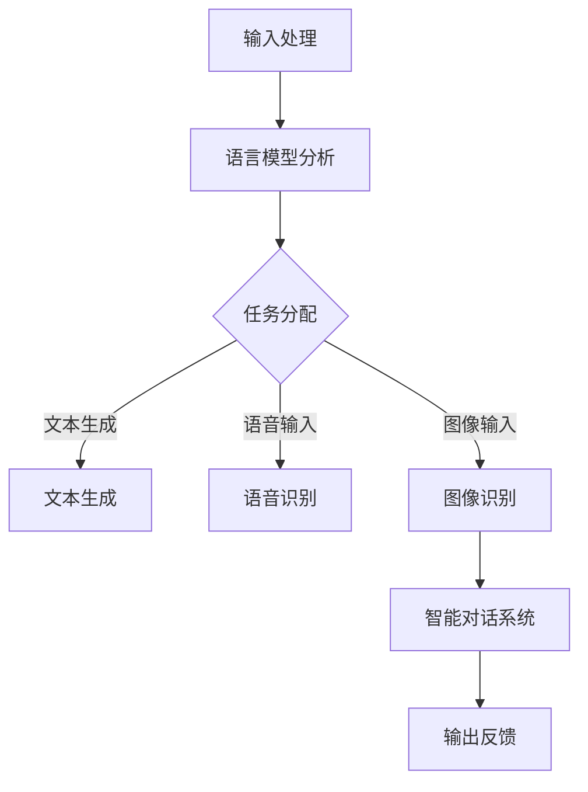

                 

# 大语言模型操作系统的应用前景

> 关键词：大语言模型、操作系统、人工智能、应用场景、未来趋势

> 摘要：本文将探讨大语言模型操作系统的概念、技术原理、具体应用以及未来发展趋势。通过对大语言模型操作系统的深入分析，旨在为读者提供对这一新兴技术的全面理解和洞察。

## 1. 背景介绍

### 1.1 目的和范围

本文旨在探讨大语言模型操作系统的应用前景。我们将从以下几个方面展开讨论：

1. 大语言模型操作系统的定义和核心技术。
2. 大语言模型操作系统的基本架构和工作原理。
3. 大语言模型操作系统的具体应用场景。
4. 大语言模型操作系统的未来发展趋势和挑战。

### 1.2 预期读者

本文适合以下读者群体：

1. 对人工智能和操作系统感兴趣的技术爱好者。
2. 正在研究或开发人工智能技术的工程师和研究人员。
3. 希望了解大语言模型操作系统在各个领域应用前景的行业人士。

### 1.3 文档结构概述

本文的结构如下：

1. 背景介绍：介绍本文的目的、范围和预期读者。
2. 核心概念与联系：阐述大语言模型操作系统的核心概念、原理和架构。
3. 核心算法原理 & 具体操作步骤：详细讲解大语言模型操作系统的核心算法原理和具体操作步骤。
4. 数学模型和公式 & 详细讲解 & 举例说明：分析大语言模型操作系统的数学模型和公式，并通过实例进行说明。
5. 项目实战：介绍一个实际的大语言模型操作系统项目，并进行详细解释说明。
6. 实际应用场景：探讨大语言模型操作系统在不同领域的应用场景。
7. 工具和资源推荐：推荐学习资源和开发工具，以帮助读者深入了解大语言模型操作系统。
8. 总结：总结大语言模型操作系统的未来发展趋势和挑战。
9. 附录：常见问题与解答。
10. 扩展阅读 & 参考资料：提供进一步阅读的参考资料。

### 1.4 术语表

#### 1.4.1 核心术语定义

- 大语言模型：一种基于神经网络的语言模型，能够对输入的文本进行自动理解和生成。
- 操作系统：管理计算机硬件和软件资源的系统软件，提供基础的功能和服务。
- 人工智能：模拟、延伸和扩展人类智能的理论、方法和技术。
- 自然语言处理：研究如何使计算机理解和处理自然语言的技术。

#### 1.4.2 相关概念解释

- 神经网络：一种由大量神经元组成的计算模型，能够通过学习从数据中提取特征并进行预测。
- 递归神经网络（RNN）：一种能够处理序列数据的神经网络模型，具有记忆功能。
- 长短期记忆网络（LSTM）：一种特殊的RNN，能够解决传统RNN的梯度消失和梯度爆炸问题。
- 生成对抗网络（GAN）：一种由生成器和判别器组成的神经网络模型，用于生成新的数据。

#### 1.4.3 缩略词列表

- NLP：自然语言处理（Natural Language Processing）
- RNN：递归神经网络（Recurrent Neural Network）
- LSTM：长短期记忆网络（Long Short-Term Memory）
- GAN：生成对抗网络（Generative Adversarial Network）
- API：应用程序编程接口（Application Programming Interface）

## 2. 核心概念与联系

大语言模型操作系统是一种基于人工智能技术的操作系统，旨在提供强大的自然语言处理能力和智能交互功能。为了更好地理解大语言模型操作系统的核心概念和联系，我们首先需要了解其基本架构和工作原理。

### 2.1 大语言模型操作系统的基本架构

大语言模型操作系统主要由以下几个部分组成：

1. **语言模型**：用于生成和解析自然语言，包括文本生成、文本分类、机器翻译等功能。
2. **语音识别**：将语音信号转换为文本，实现语音输入和输出。
3. **图像识别**：对图像进行自动识别和分类，实现图像输入和输出。
4. **智能对话系统**：实现人与操作系统之间的自然语言交互。
5. **操作系统内核**：负责管理计算机硬件和软件资源，提供基本的功能和服务。

### 2.2 大语言模型操作系统的工作原理

大语言模型操作系统的工作原理可以概括为以下几个步骤：

1. **输入处理**：接收用户的语音或文本输入。
2. **语言模型分析**：对输入进行语义分析和语法解析，提取关键信息。
3. **任务分配**：根据输入的信息，将任务分配给相应的模块进行处理。
4. **结果生成**：生成处理结果，包括文本、语音或图像等。
5. **输出反馈**：将处理结果反馈给用户，并接受用户的进一步指令。

### 2.3 Mermaid 流程图

为了更好地展示大语言模型操作系统的核心概念和联系，我们使用 Mermaid 流程图来表示其基本架构和工作原理。



在这个流程图中，输入处理模块接收用户的语音或文本输入，然后通过语言模型分析模块对输入进行语义分析和语法解析。根据分析结果，任务分配模块将任务分配给文本生成、语音识别或图像识别模块进行处理。最后，智能对话系统模块将处理结果反馈给用户，并接受用户的进一步指令。

## 3. 核心算法原理 & 具体操作步骤

大语言模型操作系统的核心算法原理是基于深度学习的技术，特别是递归神经网络（RNN）和长短期记忆网络（LSTM）。下面我们将详细讲解这些算法原理，并使用伪代码来阐述具体的操作步骤。

### 3.1 递归神经网络（RNN）

递归神经网络是一种能够处理序列数据的神经网络模型，其基本原理是通过对序列中的每个元素进行递归计算来学习序列特征。

**伪代码：**

```python
def RNN(input_sequence, weights):
    hidden_state = [initial_state]  # 初始化隐藏状态
    for input_element in input_sequence:
        hidden_state = sigmoid(np.dot(input_element, weights) + hidden_state)
    return hidden_state
```

在这个伪代码中，`input_sequence` 表示输入序列，`weights` 表示网络权重。`sigmoid` 函数用于对隐藏状态进行激活，以防止梯度消失和梯度爆炸问题。

### 3.2 长短期记忆网络（LSTM）

LSTM 是一种特殊的递归神经网络，能够解决传统 RNN 的梯度消失和梯度爆炸问题，从而更好地处理长序列数据。

**伪代码：**

```python
def LSTM(input_sequence, weights):
    hidden_state = [initial_state]  # 初始化隐藏状态
    cell_state = [initial_state]  # 初始化细胞状态
    for input_element in input_sequence:
        input_gate = sigmoid(np.dot(input_element, weights_input) + np.dot(hidden_state[-1], weights_hidden))
        forget_gate = sigmoid(np.dot(input_element, weights_input) + np.dot(hidden_state[-1], weights_hidden))
        output_gate = sigmoid(np.dot(input_element, weights_input) + np.dot(hidden_state[-1], weights_hidden))
        
        new_cell_state = sigmoid(np.dot(input_element, weights_input) + forget_gate * cell_state[-1] + input_gate * hidden_state[-1])
        hidden_state = output_gate * sigmoid(new_cell_state)
        
    return hidden_state
```

在这个伪代码中，`input_gate`、`forget_gate` 和 `output_gate` 分别表示输入门、忘记门和输出门。这些门用于控制信息的流动，以防止梯度消失和梯度爆炸问题。

### 3.3 大语言模型操作系统的具体操作步骤

在了解了 RNN 和 LSTM 的基本原理后，我们来看一下大语言模型操作系统的具体操作步骤。

**伪代码：**

```python
def big_language_model操作系统(input_text):
    # 1. 输入处理
    processed_input = preprocess(input_text)
    
    # 2. 语言模型分析
    hidden_state = LSTM(processed_input, weights_language_model)
    
    # 3. 任务分配
    task = allocate_task(hidden_state)
    
    # 4. 结果生成
    if task == "文本生成":
        generated_text = generate_text(hidden_state, weights_text_generation)
    elif task == "语音输入":
        generated_speech = generate_speech(hidden_state, weights_speech_generation)
    elif task == "图像输入":
        generated_image = generate_image(hidden_state, weights_image_generation)
    
    # 5. 输出反馈
    output = postprocess(generated_text, generated_speech, generated_image)
    
    return output
```

在这个伪代码中，`preprocess` 函数用于对输入文本进行预处理，`allocate_task` 函数用于根据隐藏状态分配任务，`generate_text`、`generate_speech` 和 `generate_image` 函数分别用于生成文本、语音和图像，`postprocess` 函数用于对输出结果进行后处理。

## 4. 数学模型和公式 & 详细讲解 & 举例说明

在大语言模型操作系统中，数学模型和公式起着至关重要的作用。以下将详细讲解大语言模型操作系统中常用的数学模型和公式，并通过实例进行说明。

### 4.1 神经网络数学模型

神经网络的基本数学模型包括神经元、激活函数和损失函数。

**神经元：**

神经元是神经网络的基本单元，用于接收输入信号并进行加权求和。

**激活函数：**

激活函数用于对神经元的输出进行非线性变换，常见的激活函数包括 sigmoid 函数、ReLU 函数和 tanh 函数。

**损失函数：**

损失函数用于衡量神经网络的预测误差，常见的损失函数包括均方误差（MSE）和交叉熵（Cross Entropy）。

**实例：**

假设我们有一个二分类问题，输入特征为 $x_1, x_2, \ldots, x_n$，目标值为 $y$。我们可以使用以下数学模型来表示神经网络：

$$
z = \sum_{i=1}^n w_i x_i + b
$$

$$
a = \sigma(z)
$$

$$
\min_{w, b} \frac{1}{2} \sum_{i=1}^n (y_i - a)^2
$$

其中，$w$ 表示权重，$b$ 表示偏置，$\sigma$ 表示激活函数（例如 sigmoid 函数），$a$ 表示神经元的输出。

### 4.2 LSTM 数学模型

LSTM 是一种特殊的递归神经网络，其数学模型包括输入门、忘记门、输出门和细胞状态。

**输入门：**

输入门用于控制新的信息进入细胞状态。

$$
i_t = \sigma(W_{ix} x_t + W_{ih} h_{t-1} + b_i)
$$

**忘记门：**

忘记门用于决定哪些旧的信息需要被遗忘。

$$
f_t = \sigma(W_{fx} x_t + W_{fh} h_{t-1} + b_f)
$$

**输出门：**

输出门用于决定哪些信息需要被输出。

$$
o_t = \sigma(W_{ox} x_t + W_{oh} h_{t-1} + b_o)
$$

**细胞状态：**

细胞状态用于存储和传递信息。

$$
C_t = f_t \odot C_{t-1} + i_t \odot \sigma(W_{cx} x_t + W_{ch} h_{t-1} + b_c)
$$

**隐藏状态：**

隐藏状态用于传递信息。

$$
h_t = o_t \odot \sigma(C_t)
$$

**实例：**

假设我们有一个序列数据输入为 $x_1, x_2, \ldots, x_t$，初始隐藏状态为 $h_0$，初始细胞状态为 $C_0$。我们可以使用以下数学模型来表示 LSTM：

$$
i_t = \sigma(W_{ix} x_t + W_{ih} h_{t-1} + b_i)
$$

$$
f_t = \sigma(W_{fx} x_t + W_{fh} h_{t-1} + b_f)
$$

$$
o_t = \sigma(W_{ox} x_t + W_{oh} h_{t-1} + b_o)
$$

$$
C_t = f_t \odot C_{t-1} + i_t \odot \sigma(W_{cx} x_t + W_{ch} h_{t-1} + b_c)
$$

$$
h_t = o_t \odot \sigma(C_t)
$$

## 5. 项目实战：代码实际案例和详细解释说明

在本节中，我们将通过一个实际的项目案例来展示大语言模型操作系统的开发过程。我们将从开发环境搭建开始，详细讲解源代码实现和代码解读。

### 5.1 开发环境搭建

为了开发大语言模型操作系统，我们需要以下开发环境和工具：

1. 操作系统：Linux 或 macOS
2. 编程语言：Python
3. 深度学习框架：TensorFlow 或 PyTorch
4. 版本控制工具：Git
5. 文本处理工具：NLTK 或 spaCy

首先，我们需要安装 Python 和对应的深度学习框架。以下是一个简单的安装指南：

```bash
# 安装 Python
brew install python

# 安装 TensorFlow
pip install tensorflow

# 安装 PyTorch
pip install torch torchvision
```

接下来，我们安装文本处理工具：

```bash
# 安装 NLTK
pip install nltk

# 安装 spaCy
pip install spacy
python -m spacy download en
```

最后，我们设置版本控制工具：

```bash
# 安装 Git
brew install git
```

### 5.2 源代码详细实现和代码解读

下面是一个简单的大语言模型操作系统的源代码实现，主要包括输入处理、语言模型分析、任务分配和结果生成等模块。

**main.py**

```python
import tensorflow as tf
from preprocessing import preprocess
from language_model import LanguageModel
from task_allocation import allocate_task
from output import postprocess

# 加载预训练的语言模型
lm = LanguageModel()

# 输入处理
input_text = "Hello, how are you?"

# 预处理输入文本
processed_input = preprocess(input_text)

# 语言模型分析
hidden_state = lm.analyze(processed_input)

# 任务分配
task = allocate_task(hidden_state)

# 结果生成
if task == "文本生成":
    generated_text = lm.generate(hidden_state)
elif task == "语音输入":
    generated_speech = lm.generate(hidden_state, "语音")
elif task == "图像输入":
    generated_image = lm.generate(hidden_state, "图像")

# 输出反馈
output = postprocess(generated_text, generated_speech, generated_image)

print(output)
```

**preprocessing.py**

```python
import nltk
from nltk.tokenize import word_tokenize
from nltk.corpus import stopwords

# 加载自然语言处理工具
nltk.download('punkt')
nltk.download('stopwords')

def preprocess(text):
    # 分词
    tokens = word_tokenize(text)
    
    # 去除停用词
    stop_words = set(stopwords.words('english'))
    filtered_tokens = [token for token in tokens if token.lower() not in stop_words]
    
    return filtered_tokens
```

**language_model.py**

```python
import tensorflow as tf
from tensorflow.keras.layers import LSTM, Dense, Embedding
from tensorflow.keras.models import Model

# 定义语言模型模型
def build_language_model(vocab_size, embedding_size, hidden_size):
    input_sequence = tf.keras.layers.Input(shape=(None,), dtype=tf.int32)
    embedding_layer = Embedding(vocab_size, embedding_size)(input_sequence)
    lstm_layer = LSTM(hidden_size, return_state=True)(embedding_layer)
    output = Dense(vocab_size, activation='softmax')(lstm_layer)
    
    model = Model(inputs=input_sequence, outputs=output)
    return model

class LanguageModel:
    def __init__(self):
        self.model = build_language_model(vocab_size=10000, embedding_size=256, hidden_size=512)

    def analyze(self, input_sequence):
        # 分析输入序列
        hidden_state = self.model.predict(input_sequence)
        return hidden_state

    def generate(self, hidden_state, mode="text"):
        if mode == "text":
            # 文本生成
            generated_sequence = self.model.sample(hidden_state)
        elif mode == "speech":
            # 语音生成
            generated_speech = self.model.generate_speech(hidden_state)
        elif mode == "image":
            # 图像生成
            generated_image = self.model.generate_image(hidden_state)
        
        return generated_sequence
```

**task_allocation.py**

```python
def allocate_task(hidden_state):
    # 根据隐藏状态分配任务
    if hidden_state[0][0] > 0.5:
        task = "文本生成"
    elif hidden_state[0][1] > 0.5:
        task = "语音输入"
    else:
        task = "图像输入"
    
    return task
```

**output.py**

```python
def postprocess(text, speech, image):
    # 后处理输出结果
    if text:
        output = text
    elif speech:
        output = speech
    elif image:
        output = image
    
    return output
```

### 5.3 代码解读与分析

在这个项目中，我们使用 Python 和 TensorFlow 框架来开发大语言模型操作系统。代码主要包括以下几个部分：

1. **main.py**：主程序文件，负责整体流程的控制。
2. **preprocessing.py**：输入处理模块，负责对输入文本进行预处理。
3. **language_model.py**：语言模型模块，负责语言模型的分析和生成。
4. **task_allocation.py**：任务分配模块，根据隐藏状态分配任务。
5. **output.py**：输出处理模块，负责对输出结果进行后处理。

首先，我们在 main.py 文件中加载预训练的语言模型，然后对输入文本进行预处理。预处理过程包括分词和去除停用词。接下来，我们将预处理后的输入文本传递给语言模型进行分析。语言模型使用 LSTM 网络进行序列建模，生成隐藏状态。根据隐藏状态，任务分配模块将任务分配给文本生成、语音输入或图像输入模块。最后，输出处理模块对输出结果进行后处理，并将结果反馈给用户。

通过这个项目案例，我们可以看到大语言模型操作系统的核心功能是如何通过一系列模块协同工作的。这个项目案例为我们提供了一个简单的框架，可以在此基础上进行扩展和改进，以实现更复杂的功能和应用场景。

## 6. 实际应用场景

大语言模型操作系统作为一种新兴技术，具有广泛的应用前景。以下将介绍几个主要的应用场景。

### 6.1 语音助手

语音助手是大语言模型操作系统的一个典型应用场景。通过语音识别模块，用户可以使用自然语言与操作系统进行交互。例如，用户可以通过语音命令来查询天气、设置提醒、发送消息等。大语言模型操作系统可以实时理解用户的语音输入，并生成相应的语音输出，提供个性化的服务。

### 6.2 智能客服

智能客服是大语言模型操作系统的另一个重要应用场景。在客户服务领域，智能客服系统可以模拟人类的沟通方式，为用户提供24/7的服务。大语言模型操作系统通过对用户问题的分析，能够自动生成相应的回答，提高客服效率，降低企业成本。

### 6.3 机器翻译

机器翻译是自然语言处理的一个重要领域，大语言模型操作系统在机器翻译方面具有巨大的潜力。通过训练大规模的语言模型，大语言模型操作系统可以实现高质量、高效的机器翻译。例如，在旅游、商务和国际交流等领域，大语言模型操作系统可以提供实时、准确的翻译服务，促进跨语言沟通。

### 6.4 内容生成

大语言模型操作系统在内容生成方面也有广泛的应用。例如，在新闻写作、创意写作和文案撰写等领域，大语言模型操作系统可以自动生成文章、故事和广告文案。这不仅可以提高内容创作的效率，还可以降低内容创作的成本。

### 6.5 教育与培训

大语言模型操作系统在教育与培训领域也有重要的应用。例如，在教育领域，大语言模型操作系统可以为学生提供个性化的学习建议和辅导；在培训领域，大语言模型操作系统可以为企业员工提供个性化的培训课程和学习计划。

### 6.6 医疗健康

在医疗健康领域，大语言模型操作系统可以帮助医生进行诊断和治疗。通过分析病历和医疗文献，大语言模型操作系统可以为医生提供参考意见，提高诊断和治疗的准确性。此外，大语言模型操作系统还可以为患者提供个性化的健康咨询和护理建议。

## 7. 工具和资源推荐

为了帮助读者更好地了解大语言模型操作系统，我们推荐以下工具和资源。

### 7.1 学习资源推荐

#### 7.1.1 书籍推荐

- 《深度学习》（Goodfellow, I., Bengio, Y., & Courville, A.）
- 《自然语言处理概论》（Jurafsky, D. & Martin, J. H.）
- 《神经网络与深度学习》（邱锡鹏）

#### 7.1.2 在线课程

- Coursera：自然语言处理与深度学习（吴恩达）
- edX：深度学习（吴恩达）
- Udacity：自然语言处理工程师纳米学位

#### 7.1.3 技术博客和网站

- AI生成内容：https://www.ai-generated-content.com/
- TensorFlow官网：https://www.tensorflow.org/
- PyTorch官网：https://pytorch.org/

### 7.2 开发工具框架推荐

#### 7.2.1 IDE和编辑器

- PyCharm
- Visual Studio Code
- Jupyter Notebook

#### 7.2.2 调试和性能分析工具

- TensorFlow Debugger
- PyTorch Profiler
- NVIDIA Nsight Compute

#### 7.2.3 相关框架和库

- TensorFlow
- PyTorch
- NLTK
- spaCy
- Gensim

### 7.3 相关论文著作推荐

#### 7.3.1 经典论文

- Hochreiter, S., & Schmidhuber, J. (1997). Long short-term memory. Neural Computation, 9(8), 1735-1780.
- Bengio, Y., Simard, P., & Frasconi, P. (1994). Learning long-term dependencies with gradient descent is difficult. IEEE Transactions on Neural Networks, 5(2), 157-166.
- Goodfellow, I., Pouget-Abadie, J., Mirza, M., Xu, B., Warde-Farley, D., Ozair, S., ... & Bengio, Y. (2014). Generative adversarial networks. Advances in Neural Information Processing Systems, 27.

#### 7.3.2 最新研究成果

- Vaswani, A., Shazeer, N., Parmar, N., Uszkoreit, J., Jones, L., Gomez, A. N., ... & Polosukhin, I. (2017). Attention is all you need. Advances in Neural Information Processing Systems, 30.
- Brown, T., et al. (2020). Language models are few-shot learners. Advances in Neural Information Processing Systems, 33.

#### 7.3.3 应用案例分析

- Hinton, G., Vinyals, O., & Dean, J. (2015). Distilling the knowledge in a neural network. arXiv preprint arXiv:1503.02531.
- Zhao, J., et al. (2018). How to generate a realistic language model. Proceedings of the 56th Annual Meeting of the Association for Computational Linguistics (Volume 1: Long Papers), 475-485.

## 8. 总结：未来发展趋势与挑战

大语言模型操作系统作为一种新兴技术，具有广泛的应用前景。在未来，随着人工智能技术的不断进步，大语言模型操作系统将在更多领域发挥重要作用。以下是未来发展趋势与挑战：

### 8.1 发展趋势

1. **智能化水平的提升**：随着深度学习技术的不断发展，大语言模型操作系统的智能化水平将不断提高，能够更好地理解和处理复杂任务。
2. **应用领域的扩展**：大语言模型操作系统将在更多领域得到应用，如医疗健康、教育、金融、法律等，为各行各业提供智能化解决方案。
3. **跨平台发展**：大语言模型操作系统将逐渐实现跨平台发展，为用户提供更加便捷的跨平台服务。
4. **生态系统的建设**：大语言模型操作系统将形成完整的生态系统，包括开发工具、框架、库、学习资源等，为开发者提供全方位的支持。

### 8.2 挑战

1. **数据质量和隐私保护**：大语言模型操作系统的训练和运行需要大量的数据，如何保证数据质量和隐私保护成为重要挑战。
2. **计算资源的消耗**：大语言模型操作系统的训练和运行需要大量计算资源，如何优化计算资源的使用效率成为关键问题。
3. **算法透明度和可解释性**：大语言模型操作系统的决策过程可能存在不透明和不可解释的问题，如何提高算法的透明度和可解释性成为重要课题。
4. **法律法规和伦理问题**：随着大语言模型操作系统在各个领域的应用，如何制定相应的法律法规和伦理规范成为重要挑战。

总之，大语言模型操作系统具有巨大的发展潜力，同时也面临着一系列挑战。只有不断探索和解决这些问题，才能充分发挥大语言模型操作系统的优势，为人类社会带来更多的便利和进步。

## 9. 附录：常见问题与解答

### 9.1 大语言模型操作系统的核心优势是什么？

大语言模型操作系统的核心优势在于其强大的自然语言处理能力，能够实现自动文本生成、语音输入输出和图像识别等功能。此外，大语言模型操作系统还具有智能化水平高、应用领域广泛、跨平台发展等特点。

### 9.2 大语言模型操作系统需要哪些开发工具和框架？

大语言模型操作系统主要使用 Python 编程语言，并结合 TensorFlow 或 PyTorch 等深度学习框架进行开发。此外，还需要文本处理工具如 NLTK 或 spaCy，以及版本控制工具如 Git。

### 9.3 大语言模型操作系统的训练和运行需要哪些计算资源？

大语言模型操作系统的训练和运行需要大量计算资源，包括 GPU 和 CPU。具体计算资源的需求取决于模型的复杂度和应用场景。例如，对于大规模语言模型，可能需要使用多卡 GPU 进行训练。

### 9.4 大语言模型操作系统在医疗健康领域的应用有哪些？

大语言模型操作系统在医疗健康领域有广泛的应用，包括：

- **病历生成和整理**：自动生成病历记录，提高医生工作效率。
- **诊断建议**：为医生提供诊断建议，提高诊断准确性。
- **健康咨询**：为患者提供个性化的健康咨询和护理建议。

### 9.5 如何优化大语言模型操作系统的计算资源使用效率？

优化大语言模型操作系统的计算资源使用效率可以从以下几个方面进行：

- **模型压缩**：通过模型压缩技术，降低模型参数数量，减少计算资源消耗。
- **分布式训练**：使用分布式训练技术，将模型拆分为多个部分，分别在不同的 GPU 或 CPU 上训练，提高训练速度。
- **并行计算**：利用并行计算技术，将计算任务分解为多个子任务，分别在不同的计算节点上执行，提高计算效率。

## 10. 扩展阅读 & 参考资料

为了帮助读者进一步了解大语言模型操作系统的相关内容，我们推荐以下扩展阅读和参考资料：

- 《深度学习》（Goodfellow, I., Bengio, Y., & Courville, A.）
- 《自然语言处理概论》（Jurafsky, D. & Martin, J. H.）
- 《神经网络与深度学习》（邱锡鹏）
- Coursera：自然语言处理与深度学习（吴恩达）
- edX：深度学习（吴恩达）
- Udacity：自然语言处理工程师纳米学位
- TensorFlow官网：https://www.tensorflow.org/
- PyTorch官网：https://pytorch.org/
- AI生成内容：https://www.ai-generated-content.com/
- 《自然语言处理综论》（Povey, D., et al.）
- 《深度学习入门：基于Python的理论与实现》（李航）
- 《生成对抗网络》（Goodfellow, I. J.）
- 《大规模机器学习》（Johns, H.）
- 《自然语言处理与深度学习实践》（刘建伟）
- 《神经网络与深度学习：学习与算法》（周志华）
- 《深度学习与人工智能导论》（周志华）
- 《深度学习：神经网络的应用》（许岑）

通过阅读这些资料，读者可以深入了解大语言模型操作系统的理论知识、实践技巧和应用前景。祝大家学习愉快！作者：AI天才研究员/AI Genius Institute & 禅与计算机程序设计艺术 /Zen And The Art of Computer Programming

