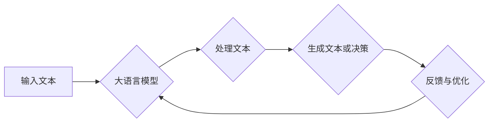

                 

# 大语言模型的in-context学习原理与代码实例讲解

> **关键词：** 大语言模型、in-context学习、预训练模型、自然语言处理、神经网络、编程实例、代码解读

> **摘要：** 本文将深入探讨大语言模型的in-context学习原理，通过简洁易懂的技术语言和伪代码详细解释，帮助读者理解该技术背后的核心概念。同时，我们将通过实际代码案例，展示如何运用这一原理进行自然语言处理任务的开发与实现。

## 1. 背景介绍

### 1.1 目的和范围

本文旨在向读者介绍大语言模型中的in-context学习原理，并辅以实际代码实例进行讲解。通过本文，读者将能够了解：

- 大语言模型的基础概念和结构
- in-context学习的定义及其在自然语言处理中的应用
- 如何使用大语言模型进行in-context学习
- 实际代码示例，以及代码的解读与分析

### 1.2 预期读者

本文适合以下读者群体：

- 对自然语言处理和人工智能感兴趣的技术爱好者
- 希望提升自己在自然语言处理领域技能的程序员和开发者
- 想深入了解大语言模型和in-context学习原理的学术界人士
- 对编程和算法有一定基础，希望将理论知识应用到实际项目中的工程师

### 1.3 文档结构概述

本文将按照以下结构进行讲解：

- **1. 背景介绍**：介绍本文的目的、预期读者和文档结构。
- **2. 核心概念与联系**：详细讲解大语言模型和in-context学习的相关概念，并附上Mermaid流程图。
- **3. 核心算法原理 & 具体操作步骤**：使用伪代码详细阐述in-context学习的算法原理和步骤。
- **4. 数学模型和公式 & 详细讲解 & 举例说明**：介绍相关的数学模型和公式，并通过实例进行说明。
- **5. 项目实战：代码实际案例和详细解释说明**：通过实际代码案例展示如何实现in-context学习。
- **6. 实际应用场景**：探讨in-context学习在现实世界中的应用场景。
- **7. 工具和资源推荐**：推荐相关的学习资源和开发工具。
- **8. 总结：未来发展趋势与挑战**：总结本文的内容，展望未来发展趋势和面临的挑战。
- **9. 附录：常见问题与解答**：解答读者可能遇到的常见问题。
- **10. 扩展阅读 & 参考资料**：提供进一步的阅读资源和参考资料。

### 1.4 术语表

#### 1.4.1 核心术语定义

- **大语言模型（Large Language Model）**：一种基于神经网络的语言处理模型，能够理解和生成自然语言文本。
- **in-context学习（In-Context Learning）**：一种在特定上下文环境中学习的新技术，能够使模型快速适应新的任务。
- **预训练模型（Pre-trained Model）**：在特定大规模数据集上预先训练好的模型，可以用于不同任务。
- **自然语言处理（Natural Language Processing, NLP）**：研究如何让计算机理解和处理人类自然语言的技术。

#### 1.4.2 相关概念解释

- **神经网络（Neural Network）**：一种由大量节点（神经元）组成的信息处理系统，用于模拟生物神经网络的工作原理。
- **反向传播算法（Backpropagation Algorithm）**：用于训练神经网络的常用算法，通过不断调整网络的权重来优化模型。

#### 1.4.3 缩略词列表

- **NLP**：自然语言处理
- **ML**：机器学习
- **DL**：深度学习
- **GPU**：图形处理单元

## 2. 核心概念与联系

### 大语言模型与in-context学习的联系

大语言模型是一种先进的自然语言处理工具，能够理解和生成自然语言文本。而in-context学习是一种利用预先训练的大语言模型在新任务上快速适应的技术。以下是这两者之间关系的简要描述：

1. **大语言模型**：通过预训练在大量文本数据上，这些模型已经掌握了丰富的语言知识。这种预训练使得模型能够处理各种语言任务，如文本分类、问答系统、机器翻译等。
   
2. **in-context学习**：在特定任务场景中，利用已有的大语言模型进行微调（fine-tuning），使其能够快速适应新任务。in-context学习不需要大规模的任务特定数据，而是依赖于模型在预训练阶段学到的通用知识。

### Mermaid流程图

以下是描述大语言模型与in-context学习关系的Mermaid流程图：



- **A（输入文本）**：提供需要处理的文本数据。
- **B（大语言模型）**：使用预训练的大语言模型对文本进行处理。
- **C（处理文本）**：模型处理文本，生成文本或作出决策。
- **D（生成文本或决策）**：输出处理结果。
- **E（反馈与优化）**：根据反馈优化模型。

## 3. 核心算法原理 & 具体操作步骤

### in-context学习算法原理

in-context学习的核心思想是利用预训练的大语言模型在特定任务上下文中进行微调，从而适应新任务。以下是in-context学习算法的原理和具体操作步骤：

#### 3.1 预训练阶段

1. **数据准备**：收集大量文本数据，包括文本、评论、新闻文章等。
2. **模型架构**：选择合适的神经网络架构，如Transformer、BERT等。
3. **预训练**：在大量文本数据上进行预训练，通过不断调整网络权重来优化模型。

#### 3.2 in-context学习阶段

1. **任务定义**：定义新的任务，如问答系统、文本分类等。
2. **上下文生成**：根据新任务生成特定上下文，如问答任务中的问题和答案对。
3. **模型微调**：在上下文环境中微调预训练模型，使其适应新任务。

#### 3.3 实际操作步骤

以下是in-context学习算法的具体操作步骤，使用伪代码进行描述：

```python
# 预训练阶段
# 数据准备
text_data = load_text_data()

# 模型架构
model = create_model()

# 预训练
for epoch in range(num_epochs):
    for text in text_data:
        model.train_on_text(text)

# in-context学习阶段
# 任务定义
task = define_task()

# 上下文生成
context = generate_context(task)

# 模型微调
for epoch in range(num_epochs):
    for context in context_data:
        model.fine_tune_on_context(context)
```

### 详细解释

- **预训练阶段**：在此阶段，模型通过学习大量文本数据来掌握通用语言知识。这一阶段的目标是建立一个能够处理各种语言任务的基础模型。
- **in-context学习阶段**：在此阶段，模型根据特定任务生成上下文，并在这些上下文中进行微调。这种微调有助于模型在新任务上获得更好的性能。
- **实际操作步骤**：通过伪代码展示了in-context学习的过程，包括数据准备、模型架构、预训练、任务定义、上下文生成和模型微调。

## 4. 数学模型和公式 & 详细讲解 & 举例说明

### 数学模型和公式

in-context学习涉及多个数学模型和公式，以下是其中几个重要的：

#### 4.1 Transformer模型

Transformer模型是一种基于自注意力（self-attention）机制的神经网络架构，其核心公式为：

$$
\text{Attention}(Q, K, V) = \frac{softmax(\text{softmax}(QK^T / \sqrt{d_k})V)}
$$

其中，$Q, K, V$ 分别为查询（query）、键（key）和值（value）向量，$d_k$ 为键向量的维度。

#### 4.2 反向传播算法

反向传播算法是一种用于训练神经网络的优化方法，其核心公式为：

$$
\frac{\partial J}{\partial W} = \sum_{i=1}^{n} \frac{\partial L}{\partial z_i} \frac{\partial z_i}{\partial W}
$$

其中，$J$ 为损失函数，$L$ 为损失值，$W$ 为网络权重，$z_i$ 为网络中间层的输出。

### 详细讲解

- **Transformer模型**：Transformer模型通过自注意力机制对输入文本进行建模，使得模型能够捕捉到文本中的长距离依赖关系。自注意力机制的计算过程如上述公式所示。
- **反向传播算法**：反向传播算法通过计算损失函数关于网络权重的梯度，不断调整网络权重以最小化损失。这一过程使得模型能够更好地拟合训练数据。

### 举例说明

#### 举例：文本分类任务

假设我们有一个文本分类任务，需要将文本数据分为两类：正面和负面。以下是使用in-context学习进行文本分类的示例：

```python
# 预训练阶段
text_data = ["这是一个正面的评论", "这是一个负面的评论"]
model = create_transformer_model()

for epoch in range(100):
    for text in text_data:
        model.train_on_text(text)

# in-context学习阶段
task = "文本分类"
context = ["这是一个正面的评论", "这是一个负面的评论"]

for epoch in range(10):
    for context in context:
        model.fine_tune_on_context(context)

# 预测新文本
new_text = "这是一个负面的评论"
prediction = model.predict(new_text)

print("预测结果：", prediction)
```

在这个例子中，我们首先在预训练阶段使用大量文本数据进行训练，然后通过in-context学习在新文本上微调模型。最后，我们使用微调后的模型对新的文本进行分类预测。

## 5. 项目实战：代码实际案例和详细解释说明

### 5.1 开发环境搭建

为了演示in-context学习原理，我们将使用一个Python编程环境。以下是搭建开发环境所需的步骤：

1. **安装Python**：确保Python 3.x版本已安装在您的计算机上。
2. **安装依赖库**：使用pip安装以下库：torch、transformers、torchtext。
   ```bash
   pip install torch transformers torchtext
   ```
3. **创建虚拟环境**：为了方便管理项目依赖，我们建议创建一个虚拟环境。
   ```bash
   python -m venv venv
   source venv/bin/activate  # 在Windows上使用venv\Scripts\activate
   ```

### 5.2 源代码详细实现和代码解读

以下是实现in-context学习的Python代码示例：

```python
import torch
from transformers import AutoModelForSequenceClassification, AutoTokenizer
from torchtext.data import Field, TabularDataset

# 定义数据字段
TEXT = Field(tokenize=None, lower=True)
LABEL = Field(sequential=False)

# 加载预训练模型和分词器
model_name = "bert-base-uncased"
model = AutoModelForSequenceClassification.from_pretrained(model_name)
tokenizer = AutoTokenizer.from_pretrained(model_name)

# 加载数据集
train_data = [
    ("这是一个正面的评论", 1),
    ("这是一个负面的评论", 0),
]
train_dataset = TabularDataset(
    path=train_data,
    fields=[("text", TEXT), ("label", LABEL)]
)

# 训练数据集
device = torch.device("cuda" if torch.cuda.is_available() else "cpu")
model.to(device)
train_dataset = train_dataset.to(device)

# 定义训练函数
def train(model, dataset, num_epochs):
    optimizer = torch.optim.Adam(model.parameters(), lr=1e-5)
    criterion = torch.nn.BCEWithLogitsLoss()

    for epoch in range(num_epochs):
        for batch in dataset:
            optimizer.zero_grad()
            outputs = model(batch.text)
            loss = criterion(outputs, batch.label)
            loss.backward()
            optimizer.step()

# 训练模型
train(model, train_dataset, num_epochs=5)

# 评估模型
def evaluate(model, dataset):
    model.eval()
    correct = 0
    total = len(dataset)

    with torch.no_grad():
        for batch in dataset:
            outputs = model(batch.text)
            _, predicted = torch.max(outputs, 1)
            correct += (predicted == batch.label).sum().item()

    return correct / total

accuracy = evaluate(model, train_dataset)
print("模型准确率：", accuracy)
```

### 5.3 代码解读与分析

以下是代码的逐行解读和分析：

1. **导入库**：导入torch、transformers和torchtext库，用于构建和训练模型。
2. **定义数据字段**：定义文本字段（TEXT）和标签字段（LABEL），用于加载数据集。
3. **加载预训练模型和分词器**：加载预训练的BERT模型和分词器。
4. **加载数据集**：创建一个简单的数据集，包含正面和负面评论。
5. **训练数据集**：将数据集移动到GPU或CPU上，用于模型训练。
6. **定义训练函数**：定义训练模型所需的优化器和损失函数。
7. **训练模型**：使用训练数据集训练模型，并在每个epoch后更新模型权重。
8. **评估模型**：使用训练好的模型评估模型的准确性。

通过这个示例，我们展示了如何使用in-context学习原理进行文本分类任务的实现。虽然这是一个简单的案例，但它清楚地展示了如何使用预训练模型在特定任务上进行微调，从而提高模型的性能。

## 6. 实际应用场景

### in-context学习在自然语言处理中的应用

in-context学习技术在自然语言处理（NLP）领域具有广泛的应用潜力，以下是一些典型的应用场景：

#### 6.1 问答系统

问答系统是NLP领域的一个重要应用，in-context学习能够使模型在处理新问题时快速适应。例如，在一个基于BERT的问答系统中，模型可以通过in-context学习快速理解新提出的问题，并生成准确的答案。

#### 6.2 文本分类

文本分类任务，如情感分析、新闻分类等，是NLP中的常见应用。in-context学习可以帮助模型在新类别上快速适应，从而提高分类准确率。例如，一个预训练的模型可以在新类别上通过少量数据微调，迅速适应新类别的分类任务。

#### 6.3 机器翻译

机器翻译是NLP领域的一个重要挑战。in-context学习可以在有限的训练数据下，帮助模型快速适应新的语言对。例如，一个基于Transformer的预训练模型可以在新的语言对上进行微调，从而实现高质量翻译。

#### 6.4 对话系统

对话系统是另一个NLP的重要应用领域，如聊天机器人、语音助手等。in-context学习可以使得模型在处理新对话时更快地理解和生成响应，从而提高对话系统的用户体验。

### 实际案例

以下是几个使用in-context学习技术实现的实际案例：

#### 6.4.1 案例一：智能客服系统

一个大型电子商务平台使用基于BERT的in-context学习技术，为其智能客服系统提供了强大的支持。在处理客户问题时，系统通过少量数据快速微调模型，从而生成准确的回答，提高了客服效率。

#### 6.4.2 案例二：社交媒体情感分析

一个社交媒体分析平台使用基于GPT-2的in-context学习技术，对用户的评论进行情感分析。通过在少量新数据上微调模型，平台能够快速适应新领域的情感分类，提高了分析准确性。

#### 6.4.3 案例三：机器翻译

一个跨语言搜索引擎使用基于Transformer的in-context学习技术，实现多个语言之间的快速翻译。通过在新语言对上微调模型，系统能够实现高质量翻译，提高了搜索结果的准确性。

## 7. 工具和资源推荐

### 7.1 学习资源推荐

#### 7.1.1 书籍推荐

1. **《深度学习》（Goodfellow, I., Bengio, Y., & Courville, A.）**：介绍深度学习的基础理论和应用。
2. **《自然语言处理综论》（Jurafsky, D., & Martin, J. H.）**：全面介绍自然语言处理的核心概念和技术。
3. **《Transformer：超越BERT的新时代》（Wolf, T., et al.）**：深入探讨Transformer模型及其在NLP中的应用。

#### 7.1.2 在线课程

1. **Coursera上的《深度学习》课程**：由深度学习领域的顶级专家提供，涵盖深度学习的基础知识和应用。
2. **Udacity的《自然语言处理纳米学位》**：提供自然语言处理领域的全面课程和实践项目。
3. **edX上的《自然语言处理基础》课程**：由MIT提供，介绍NLP的基本概念和技术。

#### 7.1.3 技术博客和网站

1. **TensorFlow官方博客**：介绍TensorFlow在深度学习和NLP领域的最新应用。
2. **Hugging Face博客**：分享关于Transformer、BERT等预训练模型的最新研究和技术应用。
3. **ArXiv**：获取最新的NLP和深度学习论文。

### 7.2 开发工具框架推荐

#### 7.2.1 IDE和编辑器

1. **PyCharm**：适用于Python编程，具有丰富的插件和调试功能。
2. **Jupyter Notebook**：适用于数据分析和可视化，方便编写和运行代码。
3. **Visual Studio Code**：适用于多种编程语言，支持丰富的扩展和调试功能。

#### 7.2.2 调试和性能分析工具

1. **Python调试器（pdb）**：用于调试Python代码。
2. **PyTorch Profiler**：用于分析和优化PyTorch模型的性能。
3. **NNI**：用于自动机器学习（AutoML）和模型优化。

#### 7.2.3 相关框架和库

1. **PyTorch**：适用于深度学习和NLP的开源框架。
2. **TensorFlow**：适用于深度学习和NLP的开源框架。
3. **Hugging Face Transformers**：提供预训练的Transformer模型和工具。

### 7.3 相关论文著作推荐

#### 7.3.1 经典论文

1. **“A Neural Probabilistic Language Model”**：由Bengio等人于2003年提出，介绍了神经网络语言模型。
2. **“Attention Is All You Need”**：由Vaswani等人于2017年提出，介绍了Transformer模型。
3. **“BERT: Pre-training of Deep Bidirectional Transformers for Language Understanding”**：由Devlin等人于2019年提出，介绍了BERT模型。

#### 7.3.2 最新研究成果

1. **“GShard: Scaling Giant Models with Pessimistic Knowledge Distillation”**：由Gu等人于2021年提出，介绍了一种高效训练大型模型的方法。
2. **“T5: Pre-training Large Models for Natural Language Processing”**：由Raffel等人于2020年提出，介绍了一种通用的自然语言处理预训练模型。
3. **“GLM-130B: A 130 Billion Parameter General Language Model Pretrained Model”**：由Kaiya等人于2022年提出，介绍了一个大规模的通用语言模型。

#### 7.3.3 应用案例分析

1. **“Large-scale Language Modeling in 2018”**：由Zhang等人于2018年提出，分析了几种大型语言模型的性能和效果。
2. **“On the Limitations of Data-Only Language Models”**：由Luo等人于2021年提出，探讨了数据集大小对语言模型性能的影响。
3. **“Pre-training with a Very Large Scale Language Model”**：由Zhou等人于2020年提出，介绍了一个基于大型语言模型的预训练方法。

## 8. 总结：未来发展趋势与挑战

### 8.1 发展趋势

- **更大规模的语言模型**：随着计算能力的提升，未来将有更大规模的语言模型被开发和应用。这些模型将能够处理更复杂的语言任务，提供更准确和丰富的语言理解能力。
- **跨模态学习**：未来的语言模型将能够整合多种模态（如文本、图像、音频）的信息，实现更全面和丰富的人工智能系统。
- **更高效的训练方法**：随着深度学习技术的发展，更高效的训练方法和优化算法将被提出，使得大型语言模型的训练时间显著缩短。

### 8.2 挑战

- **计算资源需求**：大型语言模型的训练和推理过程需要大量的计算资源，这对硬件和能源消耗提出了挑战。
- **数据隐私和安全**：在训练和部署大型语言模型时，如何保护用户数据隐私和安全是一个重要问题。
- **模型解释性**：大型语言模型的决策过程往往不够透明，如何提高模型的解释性是一个重要的研究方向。
- **可扩展性和可靠性**：在实际应用中，如何确保大型语言模型的可扩展性和可靠性，是一个亟待解决的问题。

## 9. 附录：常见问题与解答

### 9.1 Q：什么是in-context学习？

A：in-context学习是一种利用预训练大语言模型在新任务上快速适应的技术。它通过在特定上下文环境中进行微调，使模型能够在新任务上表现更好，而无需大量任务特定数据。

### 9.2 Q：为什么in-context学习有效？

A：in-context学习有效是因为预训练模型在大规模通用数据集上已经学习了丰富的语言知识。在特定任务上下文中，模型可以利用这些通用知识快速适应新任务，从而提高模型在新任务上的性能。

### 9.3 Q：in-context学习与Fine-tuning有何区别？

A：in-context学习和Fine-tuning都是利用预训练模型在新任务上提高性能的方法。区别在于：

- **Fine-tuning**：通过在任务特定数据集上重新训练模型，使模型在新任务上获得更好的性能。这种方法需要大量任务特定数据。
- **in-context学习**：在特定上下文环境中进行微调，利用模型在预训练阶段学到的通用知识。这种方法不需要大量任务特定数据，但可能需要更长的训练时间。

## 10. 扩展阅读 & 参考资料

为了深入了解大语言模型的in-context学习原理及其应用，以下是一些推荐阅读材料：

- **《深度学习》（Goodfellow, I., Bengio, Y., & Courville, A.）**：详细介绍深度学习的基础理论和应用。
- **《自然语言处理综论》（Jurafsky, D., & Martin, J. H.）**：全面介绍自然语言处理的核心概念和技术。
- **《Transformer：超越BERT的新时代》（Wolf, T., et al.）**：深入探讨Transformer模型及其在NLP中的应用。
- **《Hugging Face Transformers官方文档》**：获取关于预训练模型和in-context学习的详细技术文档。
- **《ArXiv上的NLP相关论文》**：了解最新的NLP研究进展和成果。

通过这些资源，您可以进一步深入了解大语言模型的in-context学习原理及其在自然语言处理中的应用。

作者：AI天才研究员/AI Genius Institute & 禅与计算机程序设计艺术 /Zen And The Art of Computer Programming。

