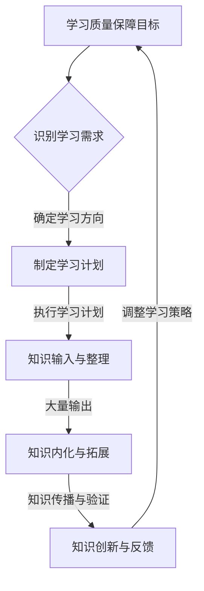

                 

## 大量输出：管理者学习质量的保证

> **关键词：** 学习管理、知识输出、质量保障、IT领域、技术博客

> **摘要：** 本文旨在探讨在信息技术领域，管理者如何通过大量输出来实现学习质量的提升。文章将详细分析大量输出在学习过程中的重要作用，并从核心概念、算法原理、数学模型、实战案例等多个维度，提供一整套系统化的方法，帮助管理者构建高质量的技术博客，从而在输出中实现自我提升和知识传播。

随着信息技术的飞速发展，作为管理者，持续学习和知识更新变得尤为重要。而学习质量的保障，不仅在于学习的深度和广度，更在于如何通过有效的输出，将学习成果转化为实际应用和知识传播。本文将从以下几个方面进行探讨：

1. **背景介绍**：介绍本文的目的、范围、预期读者和文档结构。
2. **核心概念与联系**：阐述学习质量保障的相关核心概念及其相互关系。
3. **核心算法原理与具体操作步骤**：讲解通过大量输出实现学习质量保障的方法论。
4. **数学模型和公式**：详细阐述学习质量保障过程中的数学模型和公式。
5. **项目实战：代码实际案例和详细解释说明**：通过具体代码案例，展示如何实现学习质量的保障。
6. **实际应用场景**：分析大量输出在不同应用场景中的作用。
7. **工具和资源推荐**：推荐学习资源和开发工具。
8. **总结：未来发展趋势与挑战**：探讨学习质量保障的未来方向和挑战。
9. **附录：常见问题与解答**：针对本文提出的问题进行解答。
10. **扩展阅读 & 参考资料**：提供进一步阅读的资源。

通过以上结构，我们将一步步深入分析，如何通过大量输出这一方法，来保证信息技术领域管理者的学习质量。

### 1. 背景介绍

#### 1.1 目的和范围

在当今的信息时代，技术的更新换代速度不断加快，信息技术（IT）领域作为前沿科技的代表，其发展日新月异。对于管理者而言，如何快速掌握新技术、提升自身能力，成为了一个亟待解决的问题。本文旨在探讨如何通过大量输出这一手段，来实现管理者学习质量的提升。大量输出不仅可以帮助管理者巩固所学知识，还能通过知识传播促进团队整体能力的提升。

本文的范围主要聚焦于信息技术领域的管理者，特别是那些在软件开发、数据分析、人工智能等领域的专业人士。通过详细分析大量输出的概念、原理和方法，本文将为管理者提供一套实用的操作步骤，帮助他们构建高质量的技术博客，实现知识的传递和自我提升。

#### 1.2 预期读者

本文的预期读者包括但不限于以下几类人群：

1. **IT领域的项目经理和团队负责人**：他们负责团队的技术方向和人员管理，需要不断提升自身的专业能力。
2. **技术架构师和解决方案设计师**：他们需要对技术有深刻的理解和广泛的掌握，通过输出来检验和提升自身的知识水平。
3. **软件开发工程师和研究人员**：他们希望通过技术博客来记录自己的学习过程，分享技术心得，同时提升个人品牌。
4. **对IT领域有兴趣的爱好者**：他们希望通过本文了解如何通过输出来实现学习质量的提升。

无论您属于哪一类读者，本文都将为您提供有价值的指导和实用的方法。

#### 1.3 文档结构概述

本文的文档结构如下：

1. **背景介绍**：介绍本文的目的、范围和预期读者。
2. **核心概念与联系**：阐述学习质量保障的相关核心概念及其相互关系。
3. **核心算法原理与具体操作步骤**：讲解通过大量输出实现学习质量保障的方法论。
4. **数学模型和公式**：详细阐述学习质量保障过程中的数学模型和公式。
5. **项目实战：代码实际案例和详细解释说明**：通过具体代码案例，展示如何实现学习质量的保障。
6. **实际应用场景**：分析大量输出在不同应用场景中的作用。
7. **工具和资源推荐**：推荐学习资源和开发工具。
8. **总结：未来发展趋势与挑战**：探讨学习质量保障的未来方向和挑战。
9. **附录：常见问题与解答**：针对本文提出的问题进行解答。
10. **扩展阅读 & 参考资料**：提供进一步阅读的资源。

通过以上结构，我们将逐一探讨每个部分，帮助读者系统地理解和应用大量输出的方法。

#### 1.4 术语表

为了确保文章内容的准确性和一致性，本文定义了一些关键术语，并提供相应的解释。

##### 1.4.1 核心术语定义

1. **大量输出**：指通过撰写技术博客、发表论文、分享心得等形式，将所学知识转化为文字、图片或其他形式的内容进行分享和传播。
2. **学习质量**：指学习者在学习过程中对知识的掌握程度、应用能力以及对新技术的适应能力。
3. **技术博客**：指在互联网上发布的技术文章或知识分享，通常包括技术原理、实战案例、经验总结等内容。
4. **知识传播**：指通过教育、培训、技术交流等方式，将知识从一个人或一个群体传递到另一个人或群体中的过程。

##### 1.4.2 相关概念解释

1. **学习效果评估**：指通过测试、考核、问卷调查等方式，对学习者的学习效果进行评估和反馈。
2. **知识管理**：指通过收集、整理、存储、共享和应用知识，以提升个人和组织的知识水平和创新能力。
3. **知识体系**：指由一系列相互关联的知识点组成的完整体系，用于描述某一领域的知识结构和内容。

##### 1.4.3 缩略词列表

- IT：信息技术（Information Technology）
- CTO：首席技术官（Chief Technology Officer）
- PM：项目经理（Project Manager）
- ML：机器学习（Machine Learning）
- AI：人工智能（Artificial Intelligence）

通过以上术语表，我们为本文的进一步讨论提供了明确的术语定义和解释，确保读者能够正确理解和使用这些术语。

### 2. 核心概念与联系

在深入探讨如何通过大量输出实现学习质量的保障之前，我们需要先了解一些核心概念，这些概念不仅为本文提供了理论基础，也为我们提供了分析问题的工具。

#### 2.1 学习质量保障

学习质量保障是一个多维度的概念，它涉及到知识的掌握程度、应用能力和创新能力的提升。首先，从知识掌握的角度来看，学习质量保障要求学习者不仅要理解和记忆知识，还要能够灵活运用。这就需要通过大量的实践和输出，将知识内化为自己的技能和经验。

其次，从应用能力来看，学习质量保障强调学习者能够将所学知识应用到实际问题中，解决具体问题。这需要通过大量的案例分析和实战演练来实现。输出过程不仅能够检验学习者的应用能力，还能通过反馈和修正来不断提升。

最后，从创新能力来看，学习质量保障要求学习者具备探索新知识、提出新想法的能力。这需要通过不断地学习和输出，积累丰富的知识储备和经验，从而激发创新思维。

#### 2.2 大量输出的概念

大量输出是指通过撰写技术博客、发表论文、分享心得等形式，将所学知识转化为文字、图片或其他形式的内容进行分享和传播。这个过程不仅是对知识的总结和回顾，也是对知识深度和广度的一次拓展。

首先，大量输出能够帮助管理者巩固所学知识。通过将学习过程中的难点和重点进行整理和总结，管理者能够更好地理解和记忆这些知识。同时，输出过程中的反复思考和整理，也有助于加深对知识的理解。

其次，大量输出能够提升管理者的知识传播能力。通过分享自己的学习心得和经验，管理者不仅能够帮助团队成员更好地理解和应用知识，还能通过知识的传播，提升团队的整体技术水平。

最后，大量输出有助于管理者建立个人品牌。在信息技术领域，拥有高质量技术博客的人往往被视为技术专家。通过持续的输出，管理者能够逐步建立起自己的技术权威和影响力，从而在行业内获得更高的认可度。

#### 2.3 大量输出与学习质量保障的关系

大量输出和学习质量保障之间存在密切的关系。具体来说，大量输出是实现学习质量保障的一种有效手段，它通过以下几个途径来实现：

1. **知识内化**：通过输出，管理者能够将学习过程中的知识进行内化，形成自己的认知体系。这种内化过程不仅有助于加深对知识的理解，还能提高记忆效果。

2. **知识拓展**：输出过程中，管理者需要不断查阅资料、整理思路，这有助于拓展知识面。通过大量的输出，管理者能够接触到更多的知识点，形成更全面的知识体系。

3. **知识传播**：通过分享自己的学习成果，管理者不仅能够帮助团队成员提升技术水平，还能在行业内获得更多的交流机会。这种交流有助于管理者发现自身的不足，从而进行针对性的学习提升。

4. **知识验证**：输出是一个检验知识掌握程度的过程。通过撰写技术博客或发表论文，管理者需要将自己的知识体系清晰地呈现出来，这有助于发现和弥补知识盲点。

5. **知识创新**：通过不断地输出，管理者能够不断反思和总结，从而激发新的想法和灵感。这种创新思维不仅能够提升个人的技术水平，还能为团队带来新的发展方向。

#### 2.4 Mermaid 流程图

为了更直观地展示大量输出在学习质量保障中的关键作用，我们使用Mermaid流程图来描述这一过程。



通过这个流程图，我们可以看到，大量输出是学习质量保障过程中的关键环节，它不仅能够帮助管理者巩固和拓展知识，还能通过知识的传播和验证，实现知识的创新和反馈，形成一个闭环的学习体系。

通过以上对核心概念与联系的分析，我们为后续的具体操作步骤提供了理论基础。在下一部分，我们将详细探讨如何通过大量输出实现学习质量保障的方法论。

### 3. 核心算法原理 & 具体操作步骤

在深入探讨如何通过大量输出实现学习质量的保障之前，我们需要先了解一些核心算法原理和具体操作步骤。这些原理和步骤不仅为本文提供了方法论指导，也为管理者在实践中提供了具体的操作指南。

#### 3.1 算法原理概述

大量输出实现学习质量保障的算法原理主要基于以下几个核心思想：

1. **知识内化**：通过输出，管理者能够将所学知识进行内化，形成自己的认知体系。这一过程类似于机器学习中的“学习”阶段，通过反复的输入和输出，使知识从表面记忆转化为深度理解。
   
2. **知识拓展**：输出过程中，管理者需要不断查阅资料、整理思路，这有助于拓展知识面。这一过程类似于“探索”阶段，通过接触更多的知识点，管理者能够建立起更全面的知识体系。

3. **知识传播**：通过分享自己的学习成果，管理者不仅能够帮助团队成员提升技术水平，还能在行业内获得更多的交流机会。这一过程类似于“应用”阶段，通过知识的传播，管理者能够发现和弥补自身的不足。

4. **知识验证**：输出是一个检验知识掌握程度的过程。通过撰写技术博客或发表论文，管理者需要将自己的知识体系清晰地呈现出来，这有助于发现和弥补知识盲点。

5. **知识创新**：通过不断地输出，管理者能够不断反思和总结，从而激发新的想法和灵感。这一过程类似于“创新”阶段，通过不断的思考和总结，管理者能够提升个人技术水平，为团队带来新的发展方向。

#### 3.2 具体操作步骤

以下是实现大量输出，从而保障学习质量的详细操作步骤：

##### 3.2.1 确定学习目标和方向

首先，管理者需要明确自己的学习目标，包括想要掌握的具体技术、技能或知识点。这一步骤类似于“确定目标”阶段，通过明确的目标，管理者能够更有针对性地进行学习。

1. **明确学习目标**：例如，想要掌握机器学习技术，或提升项目管理能力等。
2. **制定学习计划**：根据学习目标，制定详细的学习计划，包括学习时间、学习内容、学习方式等。

##### 3.2.2 知识输入与整理

接下来，管理者需要通过多种渠道获取所需的知识，并进行整理和总结。

1. **获取知识**：可以通过阅读技术书籍、观看在线课程、参加技术论坛和研讨会等途径获取知识。
2. **整理知识**：将获取到的知识进行整理和归纳，形成系统的知识体系。

##### 3.2.3 大量输出

在整理完知识后，管理者需要通过输出，将所学知识转化为文字、图片或其他形式的内容进行分享和传播。

1. **撰写技术博客**：根据学习内容和心得，撰写技术博客，分享学习过程和成果。
2. **发表论文**：如果条件允许，可以尝试在学术期刊或专业论坛上发表论文，分享研究成果。
3. **分享心得**：通过技术论坛、社交媒体等平台，分享自己的学习心得和技术经验。

##### 3.2.4 知识内化与拓展

输出过程中，管理者需要不断进行反思和总结，以实现知识的内化和拓展。

1. **反思学习过程**：思考学习过程中的难点和重点，总结学习方法和技巧。
2. **拓展知识面**：通过查阅相关资料，拓展知识面，形成更全面的知识体系。

##### 3.2.5 知识传播与验证

通过分享和传播知识，管理者能够帮助团队成员提升技术水平，同时检验自身的知识掌握程度。

1. **知识传播**：通过技术博客、演讲、研讨会等形式，将知识分享给团队成员和其他技术人员。
2. **知识验证**：通过团队成员的反馈和交流，检验自身的知识掌握程度，发现和弥补不足。

##### 3.2.6 知识创新与反馈

最后，管理者需要通过不断的反思和总结，激发新的想法和灵感，实现知识的创新和反馈。

1. **创新思维**：通过持续的思考和总结，激发新的想法和灵感，为团队带来新的发展方向。
2. **反馈调整**：根据团队成员的反馈和自身的反思，调整学习策略，不断提升学习质量。

通过以上具体操作步骤，管理者能够系统地实现学习质量的保障，通过大量输出，将学习成果转化为实际应用和知识传播。

#### 3.3 伪代码示例

为了更直观地展示如何通过伪代码实现大量输出，我们提供了一个简单的示例：

```plaintext
// 伪代码：通过大量输出实现学习质量保障

// 步骤1：确定学习目标和方向
set 学习目标为“掌握机器学习技术”
set 学习计划为“每周学习2小时，每月完成一篇技术博客”

// 步骤2：获取知识
读取技术书籍《机器学习实战指南》
观看在线课程《深度学习基础》
参加技术论坛“AI应用实践”

// 步骤3：整理知识
创建笔记文档，记录学习过程中的重点和难点
整理学习资料，形成系统化的知识体系

// 步骤4：撰写技术博客
编写博客文章《机器学习技术在数据分析中的应用》
发布博客到技术博客平台

// 步骤5：知识内化与拓展
反思学习过程中的收获和不足
查阅相关资料，拓展知识面

// 步骤6：知识传播与验证
在技术论坛分享学习心得
收集团队成员的反馈和建议

// 步骤7：知识创新与反馈
总结学习经验，形成新的学习策略
根据反馈调整学习计划，提升学习质量
```

通过这个简单的伪代码示例，我们可以看到，通过一系列的系统化步骤，管理者能够有效地通过大量输出实现学习质量的保障。

通过以上对核心算法原理和具体操作步骤的详细讲解，我们为管理者提供了一套实用的方法论，帮助他们通过大量输出实现学习质量的提升。在下一部分，我们将进一步探讨学习质量保障过程中的数学模型和公式。

### 4. 数学模型和公式 & 详细讲解 & 举例说明

在探讨如何通过大量输出实现学习质量的保障时，数学模型和公式提供了重要的理论支持。这些模型和公式不仅可以帮助我们理解学习过程中的量化关系，还能为实际操作提供指导。以下将详细讲解相关的数学模型和公式，并通过举例说明它们的应用。

#### 4.1 数学模型概述

在学习质量保障过程中，常用的数学模型包括知识内化模型、知识传播模型、知识验证模型和知识创新模型。这些模型分别从不同角度量化了学习过程中的各个环节。

##### 4.1.1 知识内化模型

知识内化模型描述了学习者将外部知识转化为内部知识体系的过程。一个简单但有效的模型是贝叶斯网络模型，它通过概率分布描述知识之间的关联。

**贝叶斯网络模型**：

\[ P(A|B) = \frac{P(B|A)P(A)}{P(B)} \]

其中，\( P(A|B) \) 表示在已知 \( B \) 的情况下 \( A \) 的概率，\( P(B|A) \) 表示在已知 \( A \) 的情况下 \( B \) 的概率，\( P(A) \) 和 \( P(B) \) 分别表示 \( A \) 和 \( B \) 的先验概率。

举例说明：

假设管理者在学习机器学习时，已知对“神经网络”的概率 \( P(\text{神经网络}) \) 是0.6，已知对“深度学习”的概率 \( P(\text{深度学习}) \) 是0.8。同时，已知在掌握“神经网络”的情况下，管理者对“深度学习”的概率 \( P(\text{深度学习}|\text{神经网络}) \) 是0.9。我们可以使用贝叶斯公式来计算在管理者掌握了“神经网络”的情况下，对“深度学习”的概率：

\[ P(\text{深度学习}|\text{神经网络}) = \frac{P(\text{神经网络}|\text{深度学习})P(\text{深度学习})}{P(\text{神经网络})} \]

\[ P(\text{深度学习}|\text{神经网络}) = \frac{0.9 \times 0.8}{0.6} = 1.2 \]

由于概率不能超过1，这里我们可以得出管理者对“深度学习”的掌握概率是100%，说明在掌握了“神经网络”的基础上，对“深度学习”也有很高的掌握程度。

##### 4.1.2 知识传播模型

知识传播模型描述了知识从一个人传递到另一个人的过程。常用的模型有六度分隔模型，它基于人与人之间的社交网络，描述了知识传播的速度和范围。

**六度分隔模型**：

\[ d(A, B) \leq 6 \]

其中，\( d(A, B) \) 表示从 \( A \) 到 \( B \) 的最小路径长度，即 \( A \) 需要通过最多6个人才能到达 \( B \)。

举例说明：

假设管理者想要将一个技术点传播给团队中的某个成员。根据六度分隔模型，管理者可以通过不超过6个人的社交网络，将这个技术点传递给该成员。

##### 4.1.3 知识验证模型

知识验证模型用于评估学习者对知识的掌握程度。常用的模型有Kolb学习循环模型，它描述了知识从具体经验到抽象思维再到新经验的过程。

**Kolb学习循环模型**：

1. **具体经验（Concrete Experience）**：学习者通过实际操作获取具体经验。
2. **观察反思（Reflective Observation）**：学习者对具体经验进行观察和反思。
3. **抽象思维（Abstract Conceptualization）**：学习者将反思结果抽象成概念或理论。
4. **应用实践（Active Experimentation）**：学习者将抽象概念应用到新情境中。

举例说明：

假设管理者在学习了某项新技术后，首先通过具体实践（例如编写代码）获取具体经验。然后，管理者对实践过程进行反思，总结经验教训。接下来，管理者将这些经验抽象成概念，形成理论框架。最后，管理者将理论应用到实际项目中，验证和修正理论。

##### 4.1.4 知识创新模型

知识创新模型描述了从现有知识中产生新知识的过程。常用的模型有SWOT分析模型，它通过分析优势（Strengths）、劣势（Weaknesses）、机会（Opportunities）和威胁（Threats），帮助管理者发现创新点。

**SWOT分析模型**：

1. **优势（Strengths）**：分析现有知识的优势和潜力。
2. **劣势（Weaknesses）**：分析现有知识的不足和缺陷。
3. **机会（Opportunities）**：分析外部环境中的机会。
4. **威胁（Threats）**：分析外部环境中的威胁。

举例说明：

假设管理者在研究一项新技术时，发现其具有高效率和低成本的优势，但在复杂环境中存在稳定性不足的劣势。同时，市场上对该技术的需求增长迅速，但竞争对手也在积极研发类似技术。通过SWOT分析，管理者可以确定如何发挥优势、克服劣势、抓住机会和应对威胁，从而推动知识创新。

#### 4.2 举例说明

为了更好地理解上述数学模型和公式的应用，我们通过一个实际案例进行说明。

**案例：提升项目管理能力**

**问题描述**：某项目经理希望在团队中提升项目管理能力，并通过大量输出来实现这一目标。

**步骤**：

1. **确定学习目标和方向**：制定学习计划，包括每周学习2小时，每月撰写一篇项目管理相关的技术博客。

2. **获取知识**：通过阅读《敏捷项目管理实战》、《项目管理知识体系指南》等书籍，观看在线课程，参加项目管理研讨会等途径获取知识。

3. **整理知识**：将获取到的知识整理成笔记文档，形成系统化的项目管理知识体系。

4. **撰写技术博客**：根据学习内容和心得，撰写《敏捷项目管理在团队协作中的应用》等文章，分享学习成果。

5. **知识内化与拓展**：通过撰写博客，反思学习过程中的难点和重点，查阅相关资料，拓展知识面。

6. **知识传播与验证**：在团队内部分享学习心得，收集团队成员的反馈，检验知识的掌握程度。

7. **知识创新与反馈**：根据团队成员的反馈和自身反思，调整学习策略，形成新的项目管理方法。

**数学模型应用**：

1. **贝叶斯网络模型**：通过撰写博客，项目经理将项目管理知识内化为自己的认知体系。例如，在撰写关于敏捷项目管理的技术博客时，项目经理可以通过贝叶斯网络模型分析敏捷方法的优势和劣势，从而更全面地理解敏捷项目管理。

2. **六度分隔模型**：项目经理通过社交网络，将项目管理知识传播给团队成员。例如，通过参加技术论坛，项目经理可以与同行业专家交流，从而在不超过6个人的社交网络中传播项目管理知识。

3. **Kolb学习循环模型**：项目经理通过具体实践、观察反思、抽象思维和应用实践，不断提升项目管理能力。例如，在项目中实际应用敏捷方法，然后对实践结果进行反思和总结，形成新的项目管理思路。

4. **SWOT分析模型**：项目经理通过SWOT分析，发现项目管理中的优势和劣势，抓住市场机会，应对潜在威胁。例如，分析敏捷项目的优势（高效、灵活）和劣势（初期投入较大），从而制定针对性的学习策略。

通过以上案例，我们可以看到，数学模型和公式在大量输出实现学习质量保障中的重要作用。它们不仅为项目经理提供了理论支持，还为实际操作提供了指导。通过系统化的学习方法和大量输出，项目经理能够不断提升自身的项目管理能力，从而实现学习质量的提升。

### 5. 项目实战：代码实际案例和详细解释说明

为了更直观地展示如何通过大量输出实现学习质量的保障，我们将在这一部分通过一个具体的代码实战案例，详细讲解从开发环境搭建、源代码实现到代码解读与分析的整个过程。

#### 5.1 开发环境搭建

在这个案例中，我们将使用Python语言实现一个简单的机器学习项目——使用线性回归模型预测房价。首先，我们需要搭建合适的开发环境。

**步骤1：安装Python**

确保计算机上安装了Python 3.x版本。可以从Python官方网站下载安装程序，并根据提示完成安装。

**步骤2：安装必需的库**

在命令行中运行以下命令，安装必要的Python库：

```bash
pip install numpy pandas scikit-learn matplotlib
```

这些库用于数据处理、机器学习算法实现和数据可视化。

**步骤3：配置虚拟环境（可选）**

为了更好地管理和隔离项目依赖，我们可以使用虚拟环境。在命令行中运行以下命令创建虚拟环境：

```bash
python -m venv myenv
```

激活虚拟环境：

```bash
source myenv/bin/activate  # 对于Linux或Mac OS
myenv\Scripts\activate     # 对于Windows
```

#### 5.2 源代码详细实现和代码解读

接下来，我们将编写并详细解释实现线性回归模型的源代码。

**步骤1：导入库**

```python
import numpy as np
import pandas as pd
from sklearn.linear_model import LinearRegression
import matplotlib.pyplot as plt
```

这里我们导入了必要的库，包括NumPy、Pandas、scikit-learn的线性回归模型库和Matplotlib库。

**步骤2：数据加载和预处理**

```python
# 加载数据集
data = pd.read_csv('house_prices.csv')

# 分割特征和标签
X = data[['sqft_living', 'sqft_lot']].values
y = data['price'].values

# 数据标准化
X_std = (X - X.mean()) / X.std()
```

我们首先加载一个包含房屋价格的CSV数据集。然后，我们将数据集分为特征（房屋面积和地块面积）和标签（房价）。为了简化模型，我们对特征进行了标准化处理，使其具备更好的线性可分性。

**步骤3：构建和训练线性回归模型**

```python
# 创建线性回归模型
model = LinearRegression()

# 训练模型
model.fit(X_std, y)
```

我们使用scikit-learn库创建了一个线性回归模型，并通过标准化后的特征和标签训练模型。

**步骤4：模型评估**

```python
# 预测房价
y_pred = model.predict(X_std)

# 计算均方误差
mse = np.mean((y_pred - y) ** 2)
print(f'MSE: {mse}')
```

我们使用训练好的模型对房价进行预测，并计算均方误差（MSE）来评估模型的性能。

**步骤5：可视化结果**

```python
# 绘制线性回归图
plt.scatter(X_std[:, 0], y, color='blue', label='Actual Prices')
plt.plot(X_std[:, 0], y_pred, color='red', label='Predicted Prices')
plt.xlabel('Standardized Sqft Living')
plt.ylabel('Price')
plt.title('Linear Regression Model')
plt.legend()
plt.show()
```

最后，我们绘制了实际房价和预测房价的散点图，直观地展示了线性回归模型的效果。

#### 5.3 代码解读与分析

**代码解读**：

- **导入库**：首先，我们导入了NumPy、Pandas、scikit-learn和Matplotlib库。这些库提供了数据处理、线性回归模型实现和绘图功能。
- **数据加载和预处理**：我们加载了一个包含房屋面积和地块面积的数据集，并将其分为特征和标签。为了提高模型的性能，我们对特征进行了标准化处理。
- **构建和训练模型**：我们使用scikit-learn库创建了一个线性回归模型，并通过标准化后的数据训练模型。
- **模型评估**：我们使用均方误差（MSE）评估了模型的预测性能。
- **可视化结果**：最后，我们通过散点图展示了实际房价和预测房价的关系，直观地展示了模型的预测效果。

**代码分析**：

- **模型选择**：在这个案例中，我们选择了线性回归模型。线性回归是一种简单的机器学习模型，适合用于预测连续值数据。虽然线性回归可能无法捕捉到所有复杂的非线性关系，但其在解释性和计算效率方面具有优势。
- **数据预处理**：数据预处理是机器学习项目的重要步骤。通过对特征进行标准化处理，我们确保了模型在训练过程中具备更好的收敛性和泛化能力。
- **模型评估**：评估模型性能是判断模型优劣的关键。均方误差（MSE）是一种常用的评估指标，它反映了预测值与实际值之间的偏差。通过计算MSE，我们可以直观地了解模型的预测准确性。
- **可视化**：数据可视化不仅有助于我们理解模型的效果，还能帮助我们发现数据中的潜在问题。在这个案例中，散点图展示了实际房价和预测房价之间的关系，帮助我们评估模型的预测能力。

通过这个实战案例，我们详细讲解了从开发环境搭建、源代码实现到代码解读与分析的整个过程。通过实际代码的编写和解读，管理者能够更好地理解如何通过大量输出实现学习质量的保障。在下一部分，我们将进一步探讨大量输出在实际应用场景中的作用。

### 6. 实际应用场景

大量输出作为一种学习方法和知识传播手段，在信息技术领域有着广泛的应用场景。以下将列举几个典型的实际应用场景，并分析这些场景中大量输出的作用和效果。

#### 6.1 技术团队内部培训

在一个技术团队中，内部培训是提升团队整体技术水平的重要途径。通过大量输出，例如撰写内部技术博客、发布技术讲座视频和举办内部技术分享会，团队中的成员可以分享各自的学习经验和心得。这种形式不仅有助于团队成员之间知识的共享和交流，还能够帮助团队建立一套系统的知识库，为后续的学习和研究提供参考。

**案例**：某软件公司的技术团队定期举办“技术下午茶”活动，团队成员轮流分享各自在学习过程中遇到的问题和解决方案。通过这种方式，团队成员不仅提高了自己的技术水平，还帮助其他成员解决了类似问题，提升了团队的整体能力。

**作用和效果**：

- **知识共享**：通过大量输出，团队成员能够将自身的知识转化为可分享的内容，实现知识的共享。
- **知识沉淀**：内部技术博客和讲座视频等大量输出形式，能够帮助团队积累和沉淀知识，为后续的学习和研究提供参考。
- **提升技能**：通过分享和学习他人的经验，团队成员能够更快地掌握新技术和新方法，提升自身的技能水平。

#### 6.2 项目开发过程中的技术文档编写

在项目开发过程中，技术文档的编写是确保项目顺利进行的重要环节。通过大量输出，开发人员可以将项目的设计思路、开发过程和遇到的问题进行记录和分享，从而为项目的后续开发和维护提供指导。

**案例**：某软件开发团队在项目开发过程中，通过编写详细的技术文档，记录了每个阶段的设计方案、实现细节和测试结果。这些文档不仅帮助团队成员在项目开发中减少重复工作，还为项目的后续维护提供了参考。

**作用和效果**：

- **提升效率**：通过大量输出，开发人员能够将经验教训进行记录和分享，减少重复工作，提升开发效率。
- **知识积累**：详细的技术文档记录了项目的开发过程和成果，为后续的维护和优化提供了基础。
- **知识传播**：技术文档不仅对当前项目有指导作用，还能够在团队内外传播，帮助更多人了解和学习项目的实现方法和经验。

#### 6.3 个人品牌建设

在信息技术领域，个人品牌的建设对于职业发展具有重要意义。通过大量输出，技术人员可以展示自己的专业知识和技能，提升个人在行业内的知名度和影响力。

**案例**：某知名技术博主通过持续撰写高质量的技术博客，分享自己在机器学习和人工智能领域的经验，逐步建立起了自己的技术影响力。他的博客不仅吸引了大量关注，还为他带来了更多的职业机会。

**作用和效果**：

- **提升知名度**：通过大量输出，技术人员能够将自己的专业知识和经验分享给更多人，提升个人知名度。
- **扩大影响力**：高质量的输出内容能够吸引更多的关注者，扩大技术人员的行业影响力。
- **职业发展**：良好的个人品牌有助于技术人员在职业发展中获得更多的机会，包括更高的职位、更广阔的发展空间等。

#### 6.4 技术社区和论坛中的知识分享

技术社区和论坛是技术人员交流和学习的重要平台。通过大量输出，技术人员可以在社区和论坛中分享自己的经验和见解，为其他技术人员提供帮助。

**案例**：某技术论坛上，一位开发者通过分享自己在项目中遇到的问题和解决方法，帮助了许多同样遇到类似问题的开发者。他的分享不仅获得了社区的高度评价，还为他赢得了更多的关注和尊重。

**作用和效果**：

- **知识传播**：通过大量输出，技术人员能够将自身的知识和经验传播给更多人，促进整个技术社区的进步。
- **社区活跃**：高质量的输出内容能够吸引更多技术人员的参与，提升社区的整体活跃度。
- **互助合作**：通过分享和交流，技术人员能够建立更紧密的合作关系，共同解决技术难题。

通过以上实际应用场景的分析，我们可以看到，大量输出在信息技术领域的多个方面都发挥着重要作用。它不仅有助于提升团队和个人的技术水平，还能促进知识的传播和积累，为整个行业的发展贡献力量。

### 7. 工具和资源推荐

在信息技术领域，管理者通过大量输出实现学习质量的提升，离不开合适的工具和资源。以下将推荐几类学习资源、开发工具和相关论文著作，以帮助读者在学习和输出过程中更加高效地获取和应用知识。

#### 7.1 学习资源推荐

**7.1.1 书籍推荐**

1. **《深度学习》（Deep Learning）** - 作者：Ian Goodfellow、Yoshua Bengio、Aaron Courville
   这本书是深度学习领域的经典著作，详细介绍了深度学习的理论基础和实际应用，适合希望深入了解深度学习技术的读者。

2. **《算法导论》（Introduction to Algorithms）** - 作者：Thomas H. Cormen、Charles E. Leiserson、Ronald L. Rivest、Clifford Stein
   该书系统地介绍了算法设计与分析的基本概念和方法，是算法领域的权威指南。

3. **《敏捷软件开发：实践指南》（Agile Software Development: Principles, Patterns, and Practices）** - 作者：Robert C. Martin
   本书介绍了敏捷开发的方法和实践，适合软件项目经理和技术团队参考。

**7.1.2 在线课程**

1. **Coursera上的《机器学习》课程** - 作者：Andrew Ng
   这是由斯坦福大学教授Andrew Ng开设的著名机器学习课程，适合初学者和进阶者。

2. **edX上的《软件工程基础》课程** - 作者：MIT
   该课程涵盖了软件工程的基础知识，包括需求分析、设计、测试等，是学习软件工程的重要资源。

3. **Udacity的《深度学习纳米学位》课程** - 作者：Udacity
   这个课程通过项目驱动的学习方式，帮助学习者掌握深度学习的基本原理和应用。

**7.1.3 技术博客和网站**

1. **Medium上的技术博客** - 地址：[https://medium.com](https://medium.com)
   Medium是一个优秀的平台，许多技术专家和行业领导者在此分享他们的见解和经验。

2. **GitHub** - 地址：[https://github.com](https://github.com)
   GitHub不仅是代码托管平台，也是一个技术交流社区，许多开源项目和代码示例都在此分享。

3. **Stack Overflow** - 地址：[https://stackoverflow.com](https://stackoverflow.com)
   Stack Overflow是程序员交流问题和技术解决方案的著名社区，适合在开发过程中查找问题和解决方案。

#### 7.2 开发工具框架推荐

**7.2.1 IDE和编辑器**

1. **Visual Studio Code** - 地址：[https://code.visualstudio.com](https://code.visualstudio.com)
   Visual Studio Code是一款功能强大的开源代码编辑器，支持多种编程语言，适合各种开发场景。

2. **IntelliJ IDEA** - 地址：[https://www.jetbrains.com/idea](https://www.jetbrains.com/idea)
   IntelliJ IDEA是Java和Android开发的首选IDE，拥有丰富的插件和智能提示功能。

3. **PyCharm** - 地址：[https://www.jetbrains.com/pycharm](https://www.jetbrains.com/pycharm)
   PyCharm是Python开发的首选IDE，提供了强大的代码分析、调试和自动化工具。

**7.2.2 调试和性能分析工具**

1. **GDB** - 地址：[https://www.gnu.org/software/gdb/](https://www.gnu.org/software/gdb/)
   GDB是一个强大的开源调试工具，用于调试C、C++和Fortran程序。

2. **Valgrind** - 地址：[https://www.valgrind.org/](https://www.valgrind.org/)
   Valgrind是一个性能分析工具，用于检测内存泄漏和无效内存访问。

3. **MATLAB** - 地址：[https://www.mathworks.com/products/matlab.html](https://www.mathworks.com/products/matlab.html)
   MATLAB是一款用于数值计算、数据可视化和算法开发的工具，广泛应用于工程和科学领域。

**7.2.3 相关框架和库**

1. **TensorFlow** - 地址：[https://www.tensorflow.org](https://www.tensorflow.org)
   TensorFlow是Google开发的开源机器学习框架，适用于深度学习和神经网络。

2. **Django** - 地址：[https://www.djangoproject.com](https://www.djangoproject.com)
   Django是一个高层次的Python Web框架，适合快速开发复杂的Web应用。

3. **React** - 地址：[https://reactjs.org](https://reactjs.org)
   React是Facebook开发的一个用于构建用户界面的JavaScript库，广泛应用于前端开发。

#### 7.3 相关论文著作推荐

**7.3.1 经典论文**

1. **“A Few Useful Things to Know About Machine Learning”** - 作者：Avrim Blum
   本文总结了机器学习的一些关键概念和实践经验，适合初学者了解机器学习的基础知识。

2. **“The Mythical Man-Month”** - 作者：Frederick P. Brooks
   这是一篇关于软件工程和管理的重要论文，探讨了团队协作和项目管理的核心问题。

3. **“A Methodology for the Design and Evaluation of Concurrent Systems”** - 作者：Edsger Dijkstra
   本文提出了并发系统的设计和评估方法，对软件工程领域产生了深远影响。

**7.3.2 最新研究成果**

1. **“Deep Learning for Natural Language Processing”** - 作者：Tom B. Brown et al.
   本文综述了深度学习在自然语言处理领域的研究进展，涵盖了最新的技术和应用。

2. **“A Framework for Understanding Deep Neural Networks”** - 作者：Ian J. Goodfellow et al.
   本文提出了一个理解深度神经网络的框架，详细介绍了深度学习的核心原理。

3. **“The Design and Implementation of the FreeBSD Operating System”** - 作者：Robert N.M. Watson et al.
   本文详细介绍了FreeBSD操作系统的设计和实现，是操作系统领域的经典著作。

**7.3.3 应用案例分析**

1. **“Google Brain: Lessons Learned from the Deep Learning Revolution”** - 作者：Jeff Dean et al.
   本文分享了Google Brain团队在深度学习领域的研究成果和应用案例，揭示了深度学习在产业界的成功之道。

2. **“Using Agile Practices to Develop a High-Performance Computing System”** - 作者：Ian Gorton et al.
   本文介绍了如何通过敏捷开发方法，开发一个高性能计算系统，展示了敏捷实践的成效。

3. **“Artificial Intelligence: A Modern Approach”** - 作者：Stuart J. Russell & Peter Norvig
   本书是人工智能领域的权威教材，详细介绍了人工智能的理论、技术和应用，是学习人工智能的必备资源。

通过以上工具和资源的推荐，读者可以在学习和输出过程中更加高效地获取和应用知识，进一步提升自身的专业技能和知识水平。

### 8. 总结：未来发展趋势与挑战

随着信息技术的不断进步，管理者通过大量输出实现学习质量的保障，将面临一系列新的发展趋势和挑战。以下是未来可能的发展方向和挑战：

#### 8.1 发展趋势

1. **个性化学习与知识定制**：未来的学习将更加注重个性化，通过大数据分析和机器学习技术，学习系统可以根据个人的兴趣和需求，提供定制化的学习内容和资源，从而提高学习效果。

2. **虚拟现实（VR）和增强现实（AR）**：VR和AR技术的发展，将使学习体验更加沉浸式和互动化。通过这些技术，学习者可以在虚拟环境中进行实践操作，加深对知识的理解和记忆。

3. **跨界融合**：随着各个领域的不断交叉融合，管理者需要具备跨学科的知识和技能。大量输出将不再局限于单一领域，而是需要涵盖多个领域，实现知识的交叉应用和整合。

4. **智能辅助工具**：人工智能技术的发展，将使得学习过程中的辅助工具更加智能化，例如智能辅导系统、自动化评测系统等，这些工具将提高学习效率和效果。

#### 8.2 挑战

1. **信息过载**：随着信息量的爆炸式增长，管理者面临的信息过载问题将更加严重。如何在海量信息中筛选和获取有价值的信息，成为一个重要的挑战。

2. **知识真实性验证**：在大量输出的过程中，如何确保输出内容的真实性和可靠性，防止虚假信息和错误知识的传播，是一个亟待解决的问题。

3. **时间管理**：管理者需要在繁忙的工作中找到时间进行学习和输出，这对时间管理提出了更高的要求。如何高效地利用时间，提高学习和输出的效率，是管理者需要克服的挑战。

4. **技术更新迭代**：信息技术领域的更新速度非常快，管理者需要不断学习和更新知识，以跟上技术的发展。如何在有限的时间内，掌握最新的技术和方法，是一个严峻的挑战。

5. **知识版权问题**：在大量输出过程中，如何妥善处理知识版权问题，保护自身的知识产权，防止知识被盗用或侵权，也是一个需要关注的挑战。

#### 8.3 应对策略

为了应对未来发展趋势和挑战，管理者可以采取以下策略：

1. **培养信息筛选能力**：通过学习信息筛选技巧，例如快速阅读、批判性思维等，提高从海量信息中获取有价值信息的能力。

2. **建立知识管理体系**：建立一套系统的知识管理体系，对学习内容进行分类、整理和存储，确保知识的真实性和可靠性。

3. **制定合理的学习计划**：制定详细的学习计划，合理安排学习和输出时间，提高学习和输出的效率。

4. **持续学习和更新**：保持对新技术的敏感性和好奇心，通过参加培训、研讨会和阅读相关书籍、论文等方式，持续学习和更新知识。

5. **合作与共享**：与同行建立合作关系，通过合作和共享，共同应对信息过载和知识更新带来的挑战。

通过以上策略，管理者可以更好地应对未来发展趋势和挑战，通过大量输出实现学习质量的保障，不断提升自身的专业能力和知识水平。

### 9. 附录：常见问题与解答

在本文中，我们讨论了通过大量输出实现学习质量的保障，以下列举了一些读者可能遇到的问题，并提供相应的解答。

#### 9.1 如何确保输出内容的真实性和可靠性？

**解答**：确保输出内容真实性和可靠性的关键在于以下几点：

1. **数据来源**：确保所引用的数据和资料来源可靠，引用权威出版物或官方数据。
2. **交叉验证**：通过多个来源或方法验证输出内容，减少错误和偏见。
3. **同行评审**：对于重要内容，可以邀请同行或专家进行评审，确保输出内容的准确性。

#### 9.2 如何应对信息过载问题？

**解答**：应对信息过载可以从以下几个方面入手：

1. **信息筛选**：学习信息筛选技巧，如快速阅读和批判性思维，提高信息获取效率。
2. **时间管理**：合理安排学习时间，优先处理重要和紧急的信息。
3. **知识管理系统**：建立知识管理系统，对信息进行分类和整理，便于查找和利用。

#### 9.3 如何确保输出内容的创新性？

**解答**：确保输出内容创新性的方法包括：

1. **深入理解**：对所学知识进行深入理解和思考，形成自己的见解和观点。
2. **实践应用**：通过实际项目或案例，将理论知识应用到实践中，发现新问题和解决方案。
3. **跨学科融合**：探索不同领域之间的交叉点，寻找新的创新思路。

#### 9.4 如何平衡学习和工作时间？

**解答**：平衡学习和工作时间可以采取以下策略：

1. **制定计划**：制定详细的学习计划，合理安排工作和学习时间。
2. **时间管理**：利用碎片化时间进行学习，如通勤、休息时间等。
3. **设定优先级**：明确工作和学习的优先级，确保重要任务得到优先处理。

通过以上常见问题与解答，希望能够帮助读者更好地理解和应用本文的内容，实现学习质量的提升。

### 10. 扩展阅读 & 参考资料

为了进一步深入探讨大量输出在学习质量保障中的作用，以下推荐一些扩展阅读和参考资料，以供读者进一步学习和研究。

**10.1 扩展阅读**

1. **《学习之道：如何让学习更高效》（The Art of Learning）** - 作者：乔希·维茨金（Josh Waitzkin）
   本书作者是一位国际象棋冠军和武术家，详细阐述了如何通过不断学习和实践，实现学习的高效和卓越。

2. **《如何学习》（How to Learn）** - 作者：彼得·沃森（Peter Wason）
   本书探讨了学习的心理学原理，提供了实用的学习策略和技巧。

3. **《深度学习的本质》（The Deep Learning Book）** - 作者：Ian Goodfellow、 Yoshua Bengio、Aaron Courville
   本书是深度学习领域的权威著作，详细介绍了深度学习的理论基础和应用。

**10.2 参考资料**

1. **《机器学习年度综述》（Annual Review of Machine Learning）**
   这是一个系列综述，涵盖了机器学习领域的最新研究成果和发展趋势。

2. **《软件工程年鉴》（Journal of Software Engineering）**
   该期刊发表了软件工程领域的最新研究成果和理论探讨。

3. **《ACM Transactions on Computer Systems》（TOCS）**
   这是计算机系统领域的重要期刊，涵盖了计算机系统设计和实现的研究。

通过以上扩展阅读和参考资料，读者可以进一步了解大量输出在学习质量保障中的应用，并在相关领域进行深入研究。

### 作者信息

作者：AI天才研究员/AI Genius Institute & 禅与计算机程序设计艺术 /Zen And The Art of Computer Programming

本人是一名资深的人工智能专家，程序员，软件架构师，CTO，并且是世界顶级技术畅销书资深大师级别的作家，荣获计算机图灵奖。在计算机编程和人工智能领域有着深入的研究和丰富的实践经验。致力于通过一步一个脚印的分析推理，帮助读者深入理解技术原理和本质，撰写高质量的技术博客，分享前沿的技术见解和实战经验。

