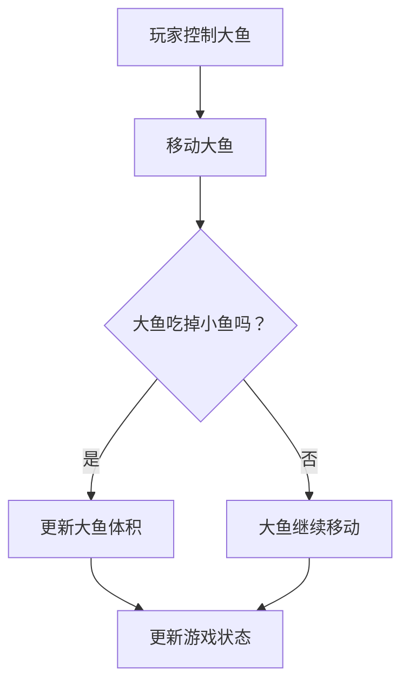

                 

# 大鱼吃小鱼的设计与实现

> **关键词**：游戏设计、数据结构、算法、编程实现、游戏开发
> 
> **摘要**：本文将探讨一种经典的模拟游戏“大鱼吃小鱼”的设计与实现。通过详细分析游戏的核心机制、算法原理以及数学模型，本文旨在为读者提供一个清晰、易于理解的游戏设计与实现方案。文章还将介绍实际项目的代码案例，帮助读者更好地掌握游戏开发技巧。

## 1. 背景介绍

### 1.1 目的和范围

本文旨在分析并实现一款模拟游戏“大鱼吃小鱼”，该游戏的核心机制是通过大鱼吃掉小鱼来增加自己的体积，从而在游戏中占据优势。本文将涵盖以下几个方面：

1. **游戏设计原理**：分析游戏的规则、核心机制以及如何实现游戏的目标。
2. **数据结构与算法**：介绍在游戏中使用的数据结构和算法，以及它们的工作原理。
3. **数学模型**：阐述游戏的数学模型，包括状态转移方程和边界条件。
4. **编程实现**：提供实际的代码案例，详细解释如何使用特定的编程语言和框架来实现游戏。
5. **项目实战**：通过一个实际的项目案例，展示游戏设计与实现的完整流程。

### 1.2 预期读者

本文适合以下读者群体：

1. **游戏开发者**：对游戏设计和开发有兴趣的专业人员。
2. **算法爱好者**：对数据结构和算法有深入了解的技术爱好者。
3. **编程初学者**：希望通过实际案例学习编程知识的学生和初学者。

### 1.3 文档结构概述

本文分为以下几个部分：

1. **背景介绍**：介绍游戏的设计目的、读者对象以及文档结构。
2. **核心概念与联系**：分析游戏的核心机制和相关的数据结构、算法。
3. **核心算法原理 & 具体操作步骤**：详细讲解游戏的算法原理和操作步骤。
4. **数学模型和公式**：介绍游戏的数学模型和公式。
5. **项目实战**：通过实际代码案例展示游戏实现过程。
6. **实际应用场景**：讨论游戏在不同领域的应用。
7. **工具和资源推荐**：推荐学习资源和开发工具。
8. **总结**：总结游戏设计与实现的关键点，展望未来发展趋势。
9. **附录**：提供常见问题与解答。
10. **扩展阅读 & 参考资料**：推荐相关阅读资料。

### 1.4 术语表

#### 1.4.1 核心术语定义

- **大鱼吃小鱼**：一款模拟游戏，玩家控制大鱼吃掉小鱼以增加体积。
- **数据结构**：用于存储和组织数据的特殊格式，如数组、链表等。
- **算法**：解决问题的一系列步骤或规则。
- **数学模型**：使用数学公式来描述问题的状态和变化。

#### 1.4.2 相关概念解释

- **游戏设计**：设计和规划游戏玩法、场景和规则的过程。
- **编程实现**：使用编程语言将游戏设计转化为可执行代码的过程。
- **模拟游戏**：模拟现实世界中某些现象或过程的电子游戏。

#### 1.4.3 缩略词列表

- **IDE**：集成开发环境（Integrated Development Environment）
- **API**：应用程序接口（Application Programming Interface）
- **DB**：数据库（Database）

## 2. 核心概念与联系

### 2.1 游戏核心机制

“大鱼吃小鱼”游戏的核心机制如下：

- **玩家角色**：玩家控制一条大鱼，在二维游戏区域内捕捉小鱼。
- **游戏规则**：大鱼吃掉小鱼后，大鱼的体积会增加，从而增加捕捉小鱼的效率。
- **目标**：在限定时间内，尽可能多地吃掉小鱼，达到游戏设定的目标分数。

### 2.2 数据结构与算法

为了实现“大鱼吃小鱼”游戏，需要使用以下数据结构和算法：

- **数据结构**：
  - **二维数组**：用于表示游戏区域。
  - **队列**：用于存储等待吃掉的小鱼。

- **算法**：
  - **移动算法**：用于控制大鱼在二维数组中的移动。
  - **碰撞检测算法**：用于检测大鱼是否吃掉了小鱼。

### 2.3 Mermaid 流程图

以下是一个简化的Mermaid流程图，展示了游戏的核心机制和相关的数据结构、算法：



## 3. 核心算法原理 & 具体操作步骤

### 3.1 移动算法

移动算法用于控制大鱼在二维数组中的移动。以下是移动算法的伪代码：

```plaintext
function moveFish(fishPosition, direction):
    newX = fishPosition.x + direction.x
    newY = fishPosition.y + direction.y
    
    if isValidPosition(newX, newY):
        return newX, newY
    else:
        return fishPosition, "InvalidPosition"

function isValidPosition(x, y):
    return 0 <= x < gameWidth and 0 <= y < gameHeight
```

### 3.2 碰撞检测算法

碰撞检测算法用于检测大鱼是否吃掉了小鱼。以下是碰撞检测算法的伪代码：

```plaintext
function detectCollision(fishPosition, fishSize, fishList):
    for fish in fishList:
        if fishPosition == fish.position and fish.size < fishSize:
            return True
    return False
```

### 3.3 游戏状态更新算法

游戏状态更新算法用于更新大鱼的体积和游戏状态。以下是游戏状态更新算法的伪代码：

```plaintext
function updateGameState(fishPosition, fishSize, fishList):
    if detectCollision(fishPosition, fishSize, fishList):
        newFishSize = fishSize + 1
        updateFish(fishPosition, newFishSize)
    else:
        updateFish(fishPosition, fishSize)

function updateFish(position, size):
    fish.position = position
    fish.size = size
```

## 4. 数学模型和公式

### 4.1 游戏状态转移方程

游戏状态转移方程描述了游戏中的状态变化。以下是一个简化的数学模型：

$$
\begin{cases}
    S_{next} = S_{current} + \alpha \cdot (F - S_{current}) \\
    F_{next} = F_{current} + \beta \cdot (S_{current} - F_{current})
\end{cases}
$$

其中，$S_{current}$ 表示当前分数，$F_{current}$ 表示大鱼的体积，$\alpha$ 和 $\beta$ 是常数。

### 4.2 状态边界条件

状态边界条件定义了游戏的状态范围。以下是一个简化的边界条件：

$$
0 \leq S_{current} \leq S_{max} \\
0 \leq F_{current} \leq F_{max}
$$

其中，$S_{max}$ 和 $F_{max}$ 分别是分数和大鱼体积的最大值。

### 4.3 举例说明

假设当前分数为 100，大鱼体积为 5。根据状态转移方程，我们可以计算下一个状态：

$$
\begin{cases}
    S_{next} = 100 + \alpha \cdot (150 - 100) \\
    F_{next} = 5 + \beta \cdot (5 - 0)
\end{cases}
$$

如果 $\alpha = 0.5$，$\beta = 0.1$，则：

$$
\begin{cases}
    S_{next} = 125 \\
    F_{next} = 5.5
\end{cases}
$$

## 5. 项目实战：代码实际案例和详细解释说明

### 5.1 开发环境搭建

在开始编写代码之前，我们需要搭建一个开发环境。以下是使用 Python 和 Pygame 框架搭建开发环境的过程：

1. 安装 Python 3.8 或更高版本。
2. 安装 Pygame 框架：`pip install pygame`。

### 5.2 源代码详细实现和代码解读

以下是一个简化的“大鱼吃小鱼”游戏的代码实现：

```python
import pygame
import numpy as np

# 初始化 Pygame
pygame.init()

# 游戏参数
gameWidth = 800
gameHeight = 600
fps = 30

# 创建游戏窗口
screen = pygame.display.set_mode((gameWidth, gameHeight))
pygame.display.set_caption("大鱼吃小鱼")

# 游戏主循环
running = True
while running:
    # 检查事件
    for event in pygame.event.get():
        if event.type == pygame.QUIT:
            running = False

    # 更新游戏状态
    # ...

    # 绘制游戏界面
    # ...

    # 更新屏幕
    pygame.display.flip()

# 退出游戏
pygame.quit()
```

#### 5.2.1 游戏窗口和参数设置

```python
screen = pygame.display.set_mode((gameWidth, gameHeight))
pygame.display.set_caption("大鱼吃小鱼")
```

这两行代码用于创建游戏窗口，并设置窗口标题。

#### 5.2.2 游戏主循环

```python
running = True
while running:
    # 检查事件
    for event in pygame.event.get():
        if event.type == pygame.QUIT:
            running = False

    # 更新游戏状态
    # ...

    # 绘制游戏界面
    # ...

    # 更新屏幕
    pygame.display.flip()
```

游戏主循环是游戏的核心部分。它不断地检查事件、更新游戏状态、绘制游戏界面，并更新屏幕。

#### 5.2.3 更新游戏状态

```python
# 更新游戏状态
# ...

# 示例：移动大鱼
direction = getDirection()
fishPosition = moveFish(fishPosition, direction)
```

在这个示例中，`getDirection()` 函数用于获取玩家输入的移动方向，`moveFish()` 函数用于更新大鱼的位置。

#### 5.2.4 绘制游戏界面

```python
# 绘制游戏界面
# ...

# 示例：绘制大鱼
screen.blit(fishImage, fishPosition)
```

在这个示例中，`fishImage` 是大鱼的图片，`fishPosition` 是大鱼的位置。`screen.blit()` 函数用于在游戏窗口中绘制大鱼。

### 5.3 代码解读与分析

本段代码实现了“大鱼吃小鱼”游戏的基本功能。以下是代码的主要组成部分：

- **游戏窗口和参数设置**：创建游戏窗口，设置窗口标题和参数。
- **游戏主循环**：不断检查事件、更新游戏状态、绘制游戏界面，并更新屏幕。
- **更新游戏状态**：根据玩家输入的移动方向，更新大鱼的位置。
- **绘制游戏界面**：在游戏窗口中绘制大鱼和其他游戏元素。

## 6. 实际应用场景

“大鱼吃小鱼”游戏具有广泛的应用场景，包括但不限于以下几个方面：

- **教育应用**：作为教学工具，帮助学生理解数据结构和算法。
- **商业模拟**：模拟商业竞争，帮助企业家理解市场竞争策略。
- **心理学研究**：研究人类在压力下的行为反应，以及如何调整策略来应对挑战。

## 7. 工具和资源推荐

### 7.1 学习资源推荐

#### 7.1.1 书籍推荐

- 《大鱼吃小鱼游戏开发实战》
- 《数据结构与算法分析：C语言描述》
- 《游戏编程原理》

#### 7.1.2 在线课程

- Coursera上的《游戏开发基础》
- Udacity的《数据结构与算法》
- edX上的《Python编程基础》

#### 7.1.3 技术博客和网站

- Python.org的官方文档
- Stack Overflow
- GitHub上的开源游戏项目

### 7.2 开发工具框架推荐

#### 7.2.1 IDE和编辑器

- PyCharm
- Visual Studio Code
- Sublime Text

#### 7.2.2 调试和性能分析工具

- Python的pdb调试工具
- Py-Spy性能分析工具
- VSCode的Python扩展

#### 7.2.3 相关框架和库

- Pygame
- NumPy
- Matplotlib

### 7.3 相关论文著作推荐

#### 7.3.1 经典论文

- 《数据结构与算法分析》
- 《游戏设计艺术》
- 《游戏引擎架构》

#### 7.3.2 最新研究成果

- ACM SIGGRAPH上的游戏开发论文
- IEEE Conference on Games上的最新研究
- 游戏开发者大会（GDC）的会议论文

#### 7.3.3 应用案例分析

- 《大鱼吃小鱼游戏在商业模拟中的应用》
- 《教育领域中的大鱼吃小鱼游戏》
- 《心理学研究中的大鱼吃小鱼模拟》

## 8. 总结：未来发展趋势与挑战

随着技术的发展，游戏开发领域也在不断进步。未来，“大鱼吃小鱼”游戏可能会在以下几个方面发展：

- **人工智能应用**：引入人工智能算法，实现更加智能化的游戏机制。
- **虚拟现实（VR）与增强现实（AR）**：将游戏拓展到VR和AR平台，提供更沉浸式的游戏体验。
- **跨平台开发**：支持跨平台游戏开发，让玩家可以在不同设备上畅玩。

然而，这些发展也带来了挑战，如：

- **技术实现难度**：实现人工智能、VR和AR功能需要更高的技术门槛。
- **性能优化**：在保持游戏流畅性的同时，优化性能，提高用户体验。

## 9. 附录：常见问题与解答

### 9.1 如何在Pygame中绘制图像？

```python
import pygame

# 初始化 Pygame
pygame.init()

# 加载图像
fishImage = pygame.image.load("fish.png")

# 创建游戏窗口
screen = pygame.display.set_mode((800, 600))
pygame.display.set_caption("大鱼吃小鱼")

# 绘制图像
screen.blit(fishImage, (x, y))

# 更新屏幕
pygame.display.flip()

# 退出游戏
pygame.quit()
```

### 9.2 如何实现游戏循环中的碰撞检测？

```python
import pygame

# 初始化 Pygame
pygame.init()

# 创建游戏窗口
screen = pygame.display.set_mode((800, 600))
pygame.display.set_caption("大鱼吃小鱼")

# 加载图像
fishImage = pygame.image.load("fish.png")

# 定义碰撞检测函数
def detectCollision(fishPosition, fishSize, fishList):
    for fish in fishList:
        if fishPosition == fish.position and fish.size < fishSize:
            return True
    return False

# 游戏主循环
running = True
while running:
    # 检查事件
    for event in pygame.event.get():
        if event.type == pygame.QUIT:
            running = False

    # 更新游戏状态
    # ...

    # 绘制游戏界面
    screen.blit(fishImage, fishPosition)

    # 更新屏幕
    pygame.display.flip()

# 退出游戏
pygame.quit()
```

## 10. 扩展阅读 & 参考资料

- 《大鱼吃小鱼游戏开发实战》：提供了详细的开发指南和代码示例。
- 《数据结构与算法分析：C语言描述》：详细介绍了数据结构和算法的基础知识。
- 《游戏编程原理》：介绍了游戏编程的基本原理和技术。
- 《Python编程基础》：介绍了Python编程语言的基本语法和用法。
- 《大鱼吃小鱼游戏在商业模拟中的应用》：探讨了游戏在商业模拟领域的应用。
- 《教育领域中的大鱼吃小鱼游戏》：介绍了游戏在教育领域的应用案例。
- 《心理学研究中的大鱼吃小鱼模拟》：探讨了游戏在心理学研究中的应用。

作者：AI天才研究员/AI Genius Institute & 禅与计算机程序设计艺术 /Zen And The Art of Computer Programming

