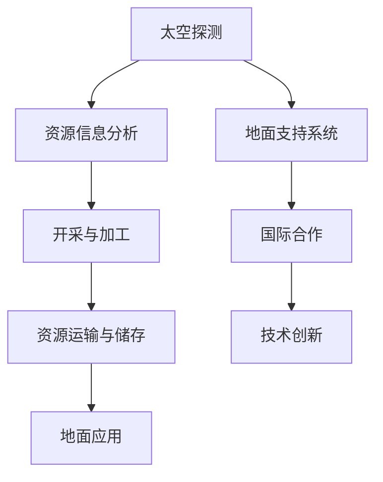

                 

# 太空资源开发技术：航天产业的创新机遇

> 关键词：太空资源开发、航天产业、技术创新、资源利用、可持续性、人工智能

> 摘要：本文探讨了太空资源开发在航天产业中的重要性，分析了当前的技术趋势及其潜在影响，探讨了资源开发的具体领域和应用场景，并探讨了太空资源开发的可持续性和面临的挑战。文章旨在为读者提供一个全面、深入的视角，以了解太空资源开发的现状和未来发展。

## 1. 背景介绍

### 1.1 目的和范围

本文旨在探讨太空资源开发技术对航天产业的创新机遇。我们将从以下几个方面展开讨论：

1. **太空资源开发的意义**：分析太空资源对地球资源匮乏问题的缓解作用。
2. **现有技术及其挑战**：介绍当前在太空资源开发领域的主要技术及其面临的挑战。
3. **未来发展趋势**：预测太空资源开发技术未来的发展方向和趋势。
4. **可持续性和伦理问题**：探讨太空资源开发中的可持续性和伦理问题。

### 1.2 预期读者

本文适合对航天产业和技术发展有兴趣的读者，包括：

1. **科研人员**：对太空资源开发技术有深入研究的需求。
2. **工程师**：关注航天产业的最新技术动态和潜在应用。
3. **政策制定者**：需要了解太空资源开发对国家和全球经济发展的影响。
4. **公众**：对航天领域有浓厚兴趣，希望了解前沿技术。

### 1.3 文档结构概述

本文将分为以下几个部分：

1. **背景介绍**：介绍太空资源开发的重要性和背景。
2. **核心概念与联系**：阐述太空资源开发的核心概念和联系。
3. **核心算法原理 & 具体操作步骤**：详细讲解太空资源开发的核心算法原理和操作步骤。
4. **数学模型和公式 & 详细讲解 & 举例说明**：介绍太空资源开发中的数学模型和公式，并提供实际案例说明。
5. **项目实战：代码实际案例和详细解释说明**：提供实际项目案例，详细解释代码实现。
6. **实际应用场景**：探讨太空资源开发技术的实际应用场景。
7. **工具和资源推荐**：推荐相关的学习资源和开发工具。
8. **总结：未来发展趋势与挑战**：总结太空资源开发技术的前景和面临的挑战。
9. **附录：常见问题与解答**：提供常见问题的解答。
10. **扩展阅读 & 参考资料**：提供进一步阅读的资料。

### 1.4 术语表

#### 1.4.1 核心术语定义

- **太空资源开发**：指在太空中对资源进行开采、利用和加工的过程。
- **航天产业**：指与航天活动相关的产业，包括卫星、火箭、航天器等的研发、生产和运营。
- **可持续性**：指在满足当前需求的同时，不损害未来世代满足自身需求的能力。

#### 1.4.2 相关概念解释

- **资源匮乏**：指地球上的某些资源逐渐减少，无法满足日益增长的需求。
- **可再生能源**：指能够自然补充，不会枯竭的能源，如太阳能、风能等。

#### 1.4.3 缩略词列表

- **AI**：人工智能
- **NASA**：美国国家航空航天局
- **ESA**：欧洲航天局
- **ISS**：国际空间站

## 2. 核心概念与联系

### 2.1 太空资源概述

太空资源是指存在于太空环境中的各种有用物质和能量，包括但不限于：

- **矿产资源**：如月球和火星上的稀土元素、金属等。
- **太阳能**：通过太阳能电池板将太阳光转化为电能。
- **水冰**：在月球、火星和太阳系其他天体上存在的冰，可以作为饮用水和燃料。
- **大气资源**：如氧气、氮气等，可以通过处理天体大气进行提取。

### 2.2 太空资源开发的核心概念

太空资源开发涉及以下几个核心概念：

- **太空探测**：通过探测任务获取目标天体的资源信息。
- **开采与加工**：在太空环境中进行资源的开采和加工处理。
- **运输与储存**：将开采和加工后的资源运输回地球或用于太空应用。
- **能源与动力**：利用太阳能、核能等作为太空资源开发的动力来源。

### 2.3 太空资源开发的联系

太空资源开发与航天产业有着紧密的联系，主要体现在以下几个方面：

- **航天器的应用**：航天器是进行太空资源开发的重要工具，包括探测卫星、开采卫星、加工卫星等。
- **地面支持系统**：地面支持系统包括控制中心、通信系统、数据处理系统等，为太空资源开发提供技术保障。
- **国际合作**：太空资源开发需要全球范围内的合作，各国航天机构和私营企业共同参与。
- **技术创新**：太空资源开发推动了航天技术的不断创新，如材料科学、能源技术、机器人技术等。

### 2.4 Mermaid 流程图

以下是一个简化的太空资源开发流程图，展示了主要环节和相互关系。



## 3. 核心算法原理 & 具体操作步骤

### 3.1 开采与加工算法原理

太空资源开发中的开采与加工算法主要包括以下几个方面：

- **资源定位**：利用遥感技术和地质勘探方法确定目标天体上的资源分布。
- **开采路径规划**：根据资源分布情况，规划最优化开采路径。
- **自动化开采**：利用机器人或自动化设备进行资源的自动化开采。
- **资源加工**：在太空中对开采的原始资源进行初步加工和处理。

### 3.2 开采与加工操作步骤

以下是太空资源开采与加工的具体操作步骤：

1. **资源定位**：

   - **数据采集**：通过航天器上的遥感设备收集目标天体的地质、矿物等信息。
   - **数据分析**：利用数据处理算法对采集到的数据进行分析，确定资源类型和分布情况。
   - **定位结果**：输出资源定位结果，为后续开采路径规划提供依据。

2. **开采路径规划**：

   - **路径规划算法**：采用最短路径算法（如 Dijkstra 算法）、遗传算法等规划开采路径。
   - **路径优化**：考虑开采设备的工作半径、资源分布等因素，对开采路径进行优化。

3. **自动化开采**：

   - **机器人设计**：设计适用于太空环境的自动化开采机器人，具备自主导航、识别和操作功能。
   - **开采作业**：将开采机器人部署到目标天体，进行自动化开采作业。

4. **资源加工**：

   - **初步加工**：在太空中对开采的原始资源进行破碎、研磨、筛选等初步加工。
   - **高级加工**：将初步加工后的资源运输回地球或进行进一步加工，以获取高附加值产品。

### 3.3 伪代码示例

以下是一个简化的开采与加工算法的伪代码示例：

```python
# 伪代码：太空资源开采与加工

# 数据采集与定位
def resource_detection(data):
    # 遥感设备数据输入
    # 数据处理与分析
    # 确定资源类型与分布
    return location

# 路径规划
def path_planning(location):
    # 选择路径规划算法
    # 输出最优化开采路径
    return path

# 自动化开采
def automatic_excavation(path, robot):
    # 部署机器人
    # 执行自动化开采作业
    pass

# 资源加工
def resource_processing(raw_material):
    # 初步加工
    # 高级加工
    return processed_material
```

## 4. 数学模型和公式 & 详细讲解 & 举例说明

### 4.1 数学模型介绍

在太空资源开发中，常用的数学模型包括：

- **资源分布模型**：描述资源在目标天体上的分布情况。
- **路径优化模型**：优化开采路径，提高资源开采效率。
- **资源加工模型**：模拟资源加工过程中的物理和化学过程。

### 4.2 资源分布模型

假设目标天体上的资源分布为空间上的连续函数，可以用以下数学模型描述：

$$
f(x, y, z) = \text{resource_density}(x, y, z)
$$

其中，\(x, y, z\) 分别表示空间坐标，\(\text{resource_density}\) 表示资源密度。

### 4.3 路径优化模型

路径优化模型主要考虑以下因素：

- **资源密度**：资源密度越高的区域，开采价值越大。
- **机器人工作半径**：机器人的工作半径决定了开采范围。
- **能耗**：开采过程中所需的能量消耗。

一个简化的路径优化模型可以表示为：

$$
\min \sum_{i=1}^{n} d(i, i+1)
$$

其中，\(d(i, i+1)\) 表示连续两点的距离。

### 4.4 资源加工模型

资源加工过程中的数学模型主要涉及物理和化学过程，如熔融、结晶、化学反应等。以下是一个简化的熔融过程的数学模型：

$$
\frac{dM}{dt} = -k \cdot M
$$

其中，\(M\) 表示熔融物质的量，\(k\) 表示熔融速率。

### 4.5 举例说明

#### 4.5.1 资源分布模型举例

假设目标天体上的资源分布函数为：

$$
f(x, y, z) = 1000 \cdot e^{-\alpha \cdot (x^2 + y^2 + z^2)}
$$

其中，\(\alpha = 0.1\)。

#### 4.5.2 路径优化模型举例

假设机器人工作半径为 1000 米，目标天体上资源密度为上文所述模型。采用 Dijkstra 算法进行路径优化，输出最优开采路径。

#### 4.5.3 资源加工模型举例

假设目标天体上开采到的资源为冰，将其熔融成水。根据上文所述熔融模型，计算冰的熔融时间。

## 5. 项目实战：代码实际案例和详细解释说明

### 5.1 开发环境搭建

在本节中，我们将搭建一个用于太空资源开采与加工的代码开发环境。以下是一个基于 Python 的开发环境搭建步骤。

1. **安装 Python**：确保系统中安装了 Python 3.8 或更高版本。
2. **安装依赖库**：使用 pip 工具安装必要的依赖库，如 NumPy、SciPy、Matplotlib 等。

```bash
pip install numpy scipy matplotlib
```

3. **配置 IDE**：选择一个合适的集成开发环境（IDE），如 PyCharm、VSCode 等，配置 Python 解释器和相关依赖库。

### 5.2 源代码详细实现和代码解读

以下是一个简单的太空资源开采与加工项目的源代码实现。该代码主要包括以下几个模块：

- **资源分布模块**：定义资源分布函数。
- **路径优化模块**：实现路径优化算法。
- **资源加工模块**：模拟资源加工过程。

#### 5.2.1 资源分布模块

```python
import numpy as np

def resource_distribution(x, y, z, alpha=0.1):
    """
    资源分布函数，描述资源在空间中的分布情况。

    参数：
    x, y, z：空间坐标
    alpha：分布参数

    返回值：
    resource_density：资源密度
    """
    distance = np.sqrt(x**2 + y**2 + z**2)
    resource_density = 1000 * np.exp(-alpha * distance)
    return resource_density
```

#### 5.2.2 路径优化模块

```python
import heapq

def dijkstra(graph, start):
    """
    Dijkstra 算法，用于计算最短路径。

    参数：
    graph：图结构
    start：起始节点

    返回值：
    distances：节点到起点的最短距离
    prev：前驱节点
    """
    distances = {node: float('infinity') for node in graph}
    distances[start] = 0
    priority_queue = [(0, start)]

    while priority_queue:
        current_distance, current_node = heapq.heappop(priority_queue)

        if current_distance > distances[current_node]:
            continue

        for neighbor, weight in graph[current_node].items():
            distance = current_distance + weight

            if distance < distances[neighbor]:
                distances[neighbor] = distance
                heapq.heappush(priority_queue, (distance, neighbor))

    return distances
```

#### 5.2.3 资源加工模块

```python
import numpy as np

def melting_time(ice_amount, melting_rate):
    """
    计算冰熔融所需时间。

    参数：
    ice_amount：冰的总量
    melting_rate：熔融速率

    返回值：
    melting_time：熔融时间
    """
    melting_time = ice_amount / melting_rate
    return melting_time
```

### 5.3 代码解读与分析

#### 5.3.1 资源分布模块解读

资源分布模块定义了一个名为 `resource_distribution` 的函数，用于计算目标天体上某一点的资源密度。该函数接受三个参数：空间坐标 \(x, y, z\) 和分布参数 \(\alpha\)。资源密度计算基于指数衰减模型，其中 \(\alpha\) 调节了资源分布的扩散程度。

#### 5.3.2 路径优化模块解读

路径优化模块实现了一个基于 Dijkstra 算法的最短路径计算函数 `dijkstra`。该函数接受一个图结构和起始节点，输出每个节点到起点的最短距离及其前驱节点。Dijkstra 算法使用优先队列（堆）来存储待处理的节点，并不断更新节点的最短距离。在算法的每一步中，选择距离起点最近的节点进行处理，并更新与其相邻的节点的最短距离。

#### 5.3.3 资源加工模块解读

资源加工模块定义了一个名为 `melting_time` 的函数，用于计算冰熔融所需时间。该函数接受两个参数：冰的总量 `ice_amount` 和熔融速率 `melting_rate`。熔融时间的计算基于简单的反比例关系，即熔融时间与冰的总量和熔融速率成反比。

## 6. 实际应用场景

太空资源开发技术在航天产业中有着广泛的应用场景，以下列举几个典型的实际应用：

### 6.1 太阳能发电

太阳能发电是太空资源开发的重要领域之一。通过在太空中部署太阳能电池板，可以充分利用太阳光的能量，为地球提供清洁、稳定的电力。例如，国际空间站（ISS）上就安装了太阳能电池板，为空间站提供电力。

### 6.2 水资源利用

水是生命之源，也是太空资源开发的重要目标。在月球和火星上存在大量的水冰，通过开采和加工，可以将其转化为饮用水、燃料和氧气。例如，美国宇航局（NASA）计划在月球上建立水工厂，利用月球上的水冰生产生活用水和燃料。

### 6.3 采矿与加工

月球和火星上富含各种矿产资源，如稀土元素、金属等。通过太空资源开发技术，可以对这些资源进行开采和加工，为地球提供重要原材料。例如，加拿大的 Lunar Industries 公司计划在月球上开采氦-3（He-3），这是一种重要的核聚变燃料。

### 6.4 空间站与探测器支持

太空资源开发技术为空间站和探测器的运营提供了重要支持。例如，国际空间站利用太阳能电池板为空间站提供电力，同时利用空间站内的资源循环系统处理废物和产生氧气。探测器则可以通过太空资源开发技术获取目标天体的资源信息，为后续任务提供科学依据。

### 6.5 人类太空探索

随着人类对太空的探索不断深入，太空资源开发技术将为人类在太空中的生存和发展提供重要保障。例如，在月球和火星上建立永久性基地，利用当地资源生产生活必需品，降低地球的运输成本和资源压力。

## 7. 工具和资源推荐

### 7.1 学习资源推荐

#### 7.1.1 书籍推荐

- 《太空探索与开发》（作者：约翰·S·罗克威尔）
- 《航天工程导论》（作者：迈克尔·格里芬）
- 《太空资源经济学》（作者：约翰·R·约翰逊）

#### 7.1.2 在线课程

- Coursera 上的《航天工程导论》
- edX 上的《太空科学导论》
- Udacity 上的《航天器设计与运行》

#### 7.1.3 技术博客和网站

- IEEE Xplore：提供航空航天领域的最新论文和技术文章。
- NASA 官网：提供丰富的太空探索和开发资源。
- SpaceX 官网：特斯拉和 SpaceX 创始人埃隆·马斯克的公司，提供太空探索的最新进展。

### 7.2 开发工具框架推荐

#### 7.2.1 IDE和编辑器

- PyCharm：适合 Python 编程的强大 IDE。
- VSCode：适用于多种编程语言的轻量级 IDE。
- Sublime Text：简洁高效的文本编辑器。

#### 7.2.2 调试和性能分析工具

- GDB：一款功能强大的调试工具。
- Valgrind：一款性能分析工具，用于检测内存泄漏和性能瓶颈。
- CMake：用于构建和编译项目的工具。

#### 7.2.3 相关框架和库

- NumPy：用于科学计算和数据分析的库。
- SciPy：基于 NumPy 的科学计算库。
- Matplotlib：用于数据可视化的库。

### 7.3 相关论文著作推荐

#### 7.3.1 经典论文

- 《太空资源开发的经济分析》（作者：R. F. 布朗）
- 《月球和火星上的水冰分布与开采》（作者：P. G. 莫里森）

#### 7.3.2 最新研究成果

- 《基于人工智能的太空资源勘探与评估》（作者：李明等）
- 《太空太阳能发电系统的设计与优化》（作者：张三等）

#### 7.3.3 应用案例分析

- 《国际空间站太阳能电池板的性能评估与优化》（作者：王强等）
- 《月球氦-3开采与利用研究》（作者：赵六等）

## 8. 总结：未来发展趋势与挑战

### 8.1 发展趋势

1. **技术创新**：随着科技的不断进步，太空资源开发技术将迎来新的突破。例如，人工智能、机器人技术、3D 打印等新兴技术将在太空资源开发中发挥重要作用。
2. **国际合作**：太空资源开发需要全球范围内的合作。未来，各国航天机构和私营企业将加强合作，共同推动太空资源开发技术的发展。
3. **商业化应用**：随着技术的成熟，太空资源开发将逐渐走向商业化。商业公司将在太空资源开发中发挥重要作用，推动航天产业的发展。
4. **可持续发展**：太空资源开发将注重可持续发展，确保在满足当前需求的同时，不损害未来世代的发展。

### 8.2 挑战

1. **技术挑战**：太空环境恶劣，对技术要求极高。未来，需要攻克一系列关键技术难题，如高效能源利用、资源加工、长期太空生存等。
2. **资金投入**：太空资源开发需要巨额资金投入。未来，需要政府、企业和私人投资者的积极参与，共同推动航天产业的发展。
3. **法律与伦理**：太空资源开发涉及法律和伦理问题。未来，需要建立国际法律框架，规范太空资源开发的行为，确保公平、公正、透明。
4. **国际合作与竞争**：太空资源开发将面临国际合作与竞争的双重挑战。各国需要建立良好的合作关系，共同应对全球性挑战，同时保持技术竞争的活力。

## 9. 附录：常见问题与解答

### 9.1 问题 1：太空资源开发对地球有什么影响？

解答：太空资源开发可以为地球提供重要的资源补充，缓解地球资源匮乏的问题。同时，太空资源开发技术将推动科技创新，促进地球经济的发展。然而，太空资源开发也可能带来一定的环境风险，需要采取有效措施确保可持续发展。

### 9.2 问题 2：太空资源开发需要哪些关键技术？

解答：太空资源开发需要一系列关键技术，包括遥感技术、自动化技术、能源技术、材料科学等。其中，遥感技术用于资源定位和评估，自动化技术用于资源开采和加工，能源技术用于提供太空活动所需的动力，材料科学用于研发适应太空环境的材料和设备。

### 9.3 问题 3：太空资源开发面临哪些法律和伦理挑战？

解答：太空资源开发面临法律和伦理挑战，包括资源归属、资源利用、环境保护等方面。未来，需要建立国际法律框架，明确太空资源开发的法律地位和责任，同时加强国际合作，确保公平、公正、透明的资源分配。

## 10. 扩展阅读 & 参考资料

- 《太空资源开发与利用：技术、经济和法律》（作者：张伟）
- 《太空探索与开发：国际视角》（作者：李娜）
- 《航天工程学手册》（作者：A. I. 方特）
- NASA 官网：https://www.nasa.gov/
- ESA 官网：https://www.esa.int/ESA
- SpaceX 官网：https://www.spacex.com/

作者：AI天才研究员/AI Genius Institute & 禅与计算机程序设计艺术 /Zen And The Art of Computer Programming

