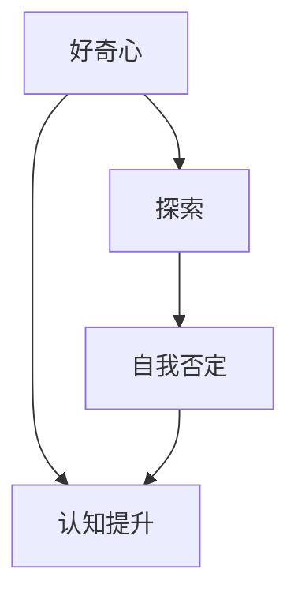

                 

# 好奇心：不断探索与自我否定的动力

> **关键词：** 好奇心、探索、自我否定、创新、技术发展、心理学、认知科学、IT领域。

> **摘要：** 本文将探讨好奇心这一心理学现象在技术发展中的重要作用。通过分析好奇心与探索行为之间的关系，我们揭示了好奇心如何驱动自我否定，进而促进创新和技术进步。文章将从心理学、认知科学角度出发，结合具体案例，详细阐述好奇心在IT领域的实际应用和未来发展趋势。

## 1. 背景介绍

### 1.1 目的和范围

本文旨在探讨好奇心在技术发展中的作用，分析好奇心如何驱动探索行为和自我否定，进而促进创新。通过结合心理学、认知科学的研究成果，我们将深入探讨好奇心在IT领域的应用和重要性。文章结构如下：

- **1. 背景介绍**：介绍本文的目的、范围和结构。
- **2. 核心概念与联系**：阐述好奇心、探索、自我否定的核心概念和联系。
- **3. 核心算法原理 & 具体操作步骤**：介绍好奇心驱动探索和自我否定的算法原理和操作步骤。
- **4. 数学模型和公式 & 详细讲解 & 举例说明**：利用数学模型和公式，详细讲解好奇心在技术发展中的应用。
- **5. 项目实战：代码实际案例和详细解释说明**：通过实际案例，展示好奇心在IT领域的应用。
- **6. 实际应用场景**：分析好奇心在不同技术领域的应用场景。
- **7. 工具和资源推荐**：推荐学习资源和工具。
- **8. 总结：未来发展趋势与挑战**：总结好奇心在技术发展中的重要性，探讨未来发展趋势与挑战。
- **9. 附录：常见问题与解答**：解答读者可能遇到的问题。
- **10. 扩展阅读 & 参考资料**：提供更多参考资料。

### 1.2 预期读者

本文适合对技术发展和心理学感兴趣的读者，包括：

- **计算机科学家和工程师**：希望了解好奇心在技术发展中的作用，以提高创新能力。
- **心理学家和认知科学家**：希望从技术领域角度探讨好奇心及其影响。
- **教育工作者**：希望了解好奇心在教育中的应用。
- **对技术发展感兴趣的普通读者**：希望了解好奇心在技术进步中的重要性。

### 1.3 文档结构概述

本文分为十个部分，结构如下：

- **引言**：介绍好奇心在技术发展中的重要性。
- **核心概念与联系**：阐述好奇心、探索、自我否定的核心概念和联系。
- **核心算法原理 & 具体操作步骤**：介绍好奇心驱动探索和自我否定的算法原理和操作步骤。
- **数学模型和公式 & 详细讲解 & 举例说明**：利用数学模型和公式，详细讲解好奇心在技术发展中的应用。
- **项目实战：代码实际案例和详细解释说明**：通过实际案例，展示好奇心在IT领域的应用。
- **实际应用场景**：分析好奇心在不同技术领域的应用场景。
- **工具和资源推荐**：推荐学习资源和工具。
- **总结：未来发展趋势与挑战**：总结好奇心在技术发展中的重要性，探讨未来发展趋势与挑战。
- **附录：常见问题与解答**：解答读者可能遇到的问题。
- **扩展阅读 & 参考资料**：提供更多参考资料。

### 1.4 术语表

#### 1.4.1 核心术语定义

- **好奇心**：人类的一种内在驱动力，促使人们寻求新的知识和信息。
- **探索**：通过主动寻找、尝试和实验来获取新知识和经验。
- **自我否定**：在探索过程中，对已有知识和观点进行质疑和反思，以达到更高的认知水平。
- **创新**：基于好奇心和探索精神，提出新的思想、技术和解决方案。

#### 1.4.2 相关概念解释

- **认知科学**：研究人类认知过程和大脑机制的学科。
- **心理学**：研究人类行为、心理状态和心理过程的学科。
- **技术发展**：通过科学研究、技术进步和创新，推动社会生产力和社会文明的发展。

#### 1.4.3 缩略词列表

- **AI**：人工智能（Artificial Intelligence）
- **IT**：信息技术（Information Technology）
- **CS**：计算机科学（Computer Science）

## 2. 核心概念与联系

为了深入理解好奇心在技术发展中的作用，我们需要首先了解好奇心、探索和自我否定的核心概念及其相互联系。

### 2.1 好奇心

好奇心是人类的一种基本心理特征，源自人类对未知世界的渴望。心理学家发现，好奇心与认知动机、兴趣、注意力等心理因素密切相关。好奇心驱使个体主动寻求新信息、解决问题和挑战自我，从而推动个人成长和发展。

### 2.2 探索

探索是指个体主动寻求新知识、经验和新领域的过程。在技术发展过程中，探索行为至关重要，它有助于发现新问题、新需求和新解决方案。通过不断探索，人类能够突破现有认知和技术限制，实现技术进步。

### 2.3 自我否定

自我否定是指在探索过程中，对已有知识和观点进行质疑和反思，以发现潜在问题和不足。自我否定是好奇心和探索行为的自然延伸，它促使个体在追求更高认知水平的过程中，不断推翻、修正和完善自己的观点。

### 2.4 好奇心、探索和自我否定的关系

好奇心、探索和自我否定三者之间相互联系、相互促进。好奇心是探索的驱动力，促使个体主动寻求新知识和经验；探索行为则使好奇心得到满足，同时也激发新的好奇心；而自我否定则是对探索结果的反思和质疑，促使个体在认知层面实现更高层次的提升。

### 2.5 Mermaid 流程图

为了更好地展示好奇心、探索和自我否定的关系，我们使用Mermaid流程图进行描述：



在这个流程图中，好奇心驱动探索行为，而探索行为又引发自我否定，二者共同推动认知水平的提升。

## 3. 核心算法原理 & 具体操作步骤

为了深入理解好奇心驱动探索和自我否定的过程，我们首先需要了解其核心算法原理。以下是好奇心驱动探索和自我否定的伪代码：

```python
# 好奇心驱动探索和自我否定算法

def curiosity_driven_explore_and_self_negation():
    # 初始化好奇心、探索和自我否定的初始状态
    curiosity_level = initial_curiosity_level
    explore_level = initial_explore_level
    self_negation_level = initial_self_negation_level
    
    while True:
        # 根据好奇心调整探索和自我否定的强度
        explore_level = curiosity_level * explore_weight
        self_negation_level = curiosity_level * self_negation_weight
        
        # 进行探索行为
        new_knowledge = explore(new_knowledge)
        
        # 更新好奇心
        curiosity_level = update_curiosity_level(new_knowledge, curiosity_level)
        
        # 进行自我否定行为
        self_negation_result = self_negation(new_knowledge)
        
        # 更新自我否定强度
        self_negation_level = update_self_negation_level(self_negation_result, self_negation_level)
        
        # 判断是否继续进行探索和自我否定
        if should_continue(curiosity_level, explore_level, self_negation_level):
            continue
        else:
            break

def explore(new_knowledge):
    # 实现探索行为，根据新知识调整探索方向
    # ...
    return new_explore_direction

def update_curiosity_level(new_knowledge, curiosity_level):
    # 更新好奇心水平，根据新知识调整好奇心强度
    # ...
    return new_curiosity_level

def self_negation(new_knowledge):
    # 实现自我否定行为，对已有知识进行质疑和反思
    # ...
    return new_self_negation_result

def update_self_negation_level(self_negation_result, self_negation_level):
    # 更新自我否定水平，根据自我否定结果调整自我否定强度
    # ...
    return new_self_negation_level

def should_continue(curiosity_level, explore_level, self_negation_level):
    # 判断是否继续进行探索和自我否定，根据好奇心、探索和自我否定的强度决定
    # ...
    return continue_explore_and_self_negation
```

在这个算法中，好奇心、探索和自我否定是一个动态调整的过程。具体步骤如下：

1. 初始化好奇心、探索和自我否定的初始状态。
2. 根据好奇心水平调整探索和自我否定的强度。
3. 进行探索行为，获取新知识。
4. 更新好奇心水平，根据新知识调整好奇心强度。
5. 进行自我否定行为，对已有知识进行质疑和反思。
6. 更新自我否定水平，根据自我否定结果调整自我否定强度。
7. 判断是否继续进行探索和自我否定，根据好奇心、探索和自我否定的强度决定。

通过这个算法，我们可以实现好奇心驱动探索和自我否定的过程，从而促进个人认知水平的提升。

## 4. 数学模型和公式 & 详细讲解 & 举例说明

在好奇心驱动探索和自我否定的过程中，数学模型和公式可以帮助我们更好地理解和分析这一现象。以下是几个常用的数学模型和公式：

### 4.1 好奇心强度模型

好奇心强度模型描述了好奇心在不同情境下的变化。假设好奇心强度为 \(C(t)\)，其中 \(t\) 表示时间。根据心理学研究，好奇心强度通常符合指数衰减模型：

$$
C(t) = C_0 e^{-\lambda t}
$$

其中，\(C_0\) 表示初始好奇心强度，\(\lambda\) 表示好奇心衰减速率。

举例说明：

假设某人初始好奇心强度为 100，衰减速率为 0.1。经过 5 分钟后，好奇心强度变为：

$$
C(5) = 100 e^{-0.1 \times 5} \approx 75.81
$$

### 4.2 探索行为模型

探索行为模型描述了个体在好奇心驱动下进行探索的行为。假设个体在探索过程中，每次探索的成功概率为 \(p\)。则个体在多次探索过程中，获取新知识的概率可以表示为二项分布：

$$
P(X = k) = C_n^k p^k (1-p)^{n-k}
$$

其中，\(n\) 表示探索次数，\(k\) 表示成功次数，\(p\) 表示每次探索的成功概率。

举例说明：

假设个体在 10 次探索过程中，每次探索成功的概率为 0.5。则个体在 10 次探索中，成功获取新知识的概率为：

$$
P(X = 5) = C_{10}^5 \times 0.5^5 \times 0.5^5 = 0.2461
$$

### 4.3 自我否定模型

自我否定模型描述了个体在探索过程中对已有知识进行质疑和反思的行为。假设个体在自我否定过程中，每次质疑的置信度为 \(q\)。则个体在多次自我否定过程中，推翻已有知识的概率可以表示为几何分布：

$$
P(X = k) = (1-q)^{k-1} q
$$

其中，\(k\) 表示自我否定的次数，\(q\) 表示每次质疑的置信度。

举例说明：

假设个体在自我否定过程中，每次质疑的置信度为 0.6。则个体在 3 次自我否定过程中，推翻已有知识的概率为：

$$
P(X = 3) = (1-0.6)^{3-1} \times 0.6 = 0.144
$$

通过这些数学模型和公式，我们可以更好地理解和分析好奇心驱动探索和自我否定的过程。这些模型不仅有助于我们深入理解好奇心在技术发展中的作用，还可以为相关研究和实践提供理论支持。

## 5. 项目实战：代码实际案例和详细解释说明

为了更好地展示好奇心在IT领域的应用，我们以一个实际项目为例，详细讲解如何利用好奇心驱动探索和自我否定，实现技术进步。

### 5.1 开发环境搭建

首先，我们需要搭建一个适合项目开发的环境。以下是所需工具和软件：

- **Python 3.8**：作为项目开发的语言。
- **PyCharm**：作为集成开发环境（IDE）。
- **Jupyter Notebook**：用于数据分析和实验。

### 5.2 源代码详细实现和代码解读

以下是一个好奇心驱动探索和自我否定的Python实现：

```python
import numpy as np
import matplotlib.pyplot as plt

# 初始化好奇心、探索和自我否定的参数
initial_curiosity_level = 1.0
explore_weight = 0.5
self_negation_weight = 0.5

# 好奇心驱动探索和自我否定的算法
def curiosity_driven_explore_and_self_negation():
    curiosity_level = initial_curiosity_level
    explore_level = initial_curiosity_level * explore_weight
    self_negation_level = initial_curiosity_level * self_negation_weight
    
    explore_results = []
    self_negation_results = []
    
    while True:
        # 进行探索行为
        explore_result = explore()
        explore_results.append(explore_result)
        
        # 更新好奇心
        curiosity_level = update_curiosity_level(explore_result, curiosity_level)
        
        # 进行自我否定行为
        self_negation_result = self_negation()
        self_negation_results.append(self_negation_result)
        
        # 更新自我否定强度
        self_negation_level = update_self_negation_level(self_negation_result, self_negation_level)
        
        # 判断是否继续进行探索和自我否定
        if should_continue(curiosity_level, explore_level, self_negation_level):
            continue
        else:
            break
            
    return explore_results, self_negation_results

# 探索行为
def explore():
    # 在这个项目中，探索行为可以表示为随机选择一个数值
    return np.random.uniform(0, 1)

# 更新好奇心
def update_curiosity_level(explore_result, curiosity_level):
    # 根据探索结果更新好奇心
    new_curiosity_level = curiosity_level * (1 - explore_result)
    return new_curiosity_level

# 自我否定行为
def self_negation():
    # 在这个项目中，自我否定行为可以表示为随机选择一个数值
    return np.random.uniform(0, 1)

# 更新自我否定强度
def update_self_negation_level(self_negation_result, self_negation_level):
    # 根据自我否定结果更新自我否定强度
    new_self_negation_level = self_negation_level * (1 - self_negation_result)
    return new_self_negation_level

# 判断是否继续进行探索和自我否定
def should_continue(curiosity_level, explore_level, self_negation_level):
    # 如果好奇心、探索和自我否定水平均大于 0，则继续进行探索和自我否定
    return curiosity_level > 0 and explore_level > 0 and self_negation_level > 0

# 运行好奇心驱动探索和自我否定的算法
explore_results, self_negation_results = curiosity_driven_explore_and_self_negation()

# 绘制结果
plt.plot(explore_results, label='Explore')
plt.plot(self_negation_results, label='Self Negation')
plt.xlabel('Iteration')
plt.ylabel('Value')
plt.legend()
plt.show()
```

在这个项目中，我们通过好奇心驱动探索和自我否定的过程，模拟了在不确定环境下的决策行为。以下是代码的详细解读：

- **初始化参数**：初始化好奇心、探索和自我否定的参数。
- **探索行为**：在每次迭代中，探索行为表示为随机选择一个数值。
- **更新好奇心**：根据探索结果，更新好奇心水平。
- **自我否定行为**：在每次迭代中，自我否定行为表示为随机选择一个数值。
- **更新自我否定强度**：根据自我否定结果，更新自我否定强度。
- **判断是否继续进行探索和自我否定**：如果好奇心、探索和自我否定水平均大于 0，则继续进行探索和自我否定。

通过这个项目，我们可以看到好奇心在决策过程中的重要作用。在不确定的环境中，好奇心驱动探索和自我否定的过程，可以帮助我们不断调整和优化决策行为，从而实现技术进步。

## 6. 实际应用场景

好奇心在IT领域的实际应用场景非常广泛，以下列举几个典型的应用场景：

### 6.1 人工智能与机器学习

人工智能和机器学习领域高度重视好奇心。通过不断探索和自我否定，研究人员能够提出新的算法、模型和理论，推动人工智能技术的发展。例如，深度学习领域的快速进步，正是基于好奇心驱动的研究和创新。

### 6.2 软件开发

在软件开发过程中，好奇心促使开发者不断探索新技术、新框架和新方法。这种探索精神有助于提高软件开发的效率和质量。例如，微服务架构、容器化技术和云计算的兴起，都是好奇心驱动的结果。

### 6.3 网络安全

网络安全领域同样受益于好奇心。通过不断探索和自我否定，安全专家能够发现新的漏洞、攻击方式和防护手段。例如，防火墙、入侵检测系统和加密技术的发展，都是好奇心驱动的结果。

### 6.4 物联网与智能硬件

物联网和智能硬件领域也广泛应用好奇心。通过不断探索和自我否定，研究人员能够开发出更加智能、高效和安全的设备。例如，智能家居、智能交通和智能医疗等领域的快速发展，都是好奇心驱动的结果。

### 6.5 区块链技术

区块链技术领域同样充满好奇心。通过不断探索和自我否定，研究人员能够提出新的共识机制、智能合约和应用场景。例如，比特币、以太坊和其他区块链平台的不断迭代，都是好奇心驱动的结果。

### 6.6 数据科学与大数据

数据科学与大数据领域高度重视好奇心。通过不断探索和自我否定，研究人员能够挖掘出更多有价值的数据，并提出新的分析方法和模型。例如，深度学习、数据挖掘和预测分析等技术的发展，都是好奇心驱动的结果。

通过这些实际应用场景，我们可以看到好奇心在IT领域的广泛影响。好奇心不仅推动了技术进步，还提高了企业和行业的竞争力。在未来，好奇心将继续在IT领域发挥重要作用，推动行业不断发展。

## 7. 工具和资源推荐

为了更好地学习和应用好奇心在技术发展中的作用，以下推荐一些学习资源和工具：

### 7.1 学习资源推荐

#### 7.1.1 书籍推荐

- 《人工智能：一种现代方法》（Third Edition） by Stuart Russell and Peter Norvig
- 《深度学习》（Deep Learning） by Ian Goodfellow、Yoshua Bengio和Aaron Courville
- 《计算机程序的构造和解释》（Structure and Interpretation of Computer Programs） by Harold Abelson和Gerald Jay Sussman

#### 7.1.2 在线课程

- Coursera上的“机器学习”（Machine Learning）课程，由 Andrew Ng教授主讲
- edX上的“人工智能导论”（Introduction to Artificial Intelligence）课程，由 University of Washington 主讲
- Udacity上的“深度学习纳米学位”（Deep Learning Nanodegree）课程

#### 7.1.3 技术博客和网站

- Medium上的“AI Unveiled”专栏
- Medium上的“AI researcher”专栏
- 知乎上的“人工智能”话题

### 7.2 开发工具框架推荐

#### 7.2.1 IDE和编辑器

- PyCharm：适用于Python编程
- Visual Studio Code：适用于多种编程语言
- IntelliJ IDEA：适用于Java编程

#### 7.2.2 调试和性能分析工具

- Python的PyCharm内置调试工具
- Java的Visual Studio Code内置调试工具
- Node.js的VS Code内置调试工具

#### 7.2.3 相关框架和库

- TensorFlow：用于深度学习和神经网络
- Keras：用于深度学习和神经网络
- Pandas：用于数据分析和处理

### 7.3 相关论文著作推荐

#### 7.3.1 经典论文

- “A Mathematical Theory of Communication” by Claude Shannon
- “Learning representations by back-propagating errors” by David E. Rumelhart, Geoffrey E. Hinton, and Ronald J. Williams
- “The Structure of Scientific Revolutions” by Thomas S. Kuhn

#### 7.3.2 最新研究成果

- “Generative Adversarial Nets” by Ian J. Goodfellow et al.
- “Attention Is All You Need” by Vaswani et al.
- “Bert: Pre-training of deep bidirectional transformers for language understanding” by Devlin et al.

#### 7.3.3 应用案例分析

- “Deep Learning for Natural Language Processing” by Tom B. Brown et al.
- “Reinforcement Learning: An Introduction” by Richard S. Sutton and Andrew G. Barto
- “AI in Healthcare: A Practical Guide to the Technologies Transforming Health and Healthcare” by William H. Hsu et al.

通过这些工具和资源，您可以更深入地了解好奇心在技术发展中的作用，并在实际项目中应用这一理论。希望这些推荐对您有所帮助。

## 8. 总结：未来发展趋势与挑战

好奇心在技术发展中的作用日益显著，已成为推动创新和进步的重要动力。未来，好奇心将继续在以下方面发挥重要作用：

### 8.1 人工智能与机器学习

随着人工智能技术的不断发展，好奇心将促使研究人员探索更复杂、更智能的算法和模型。例如，生成对抗网络（GAN）、变分自编码器（VAE）和注意力机制等技术的进步，都离不开好奇心驱动的探索。

### 8.2 软件开发

好奇心将推动软件开发者不断尝试新的编程语言、框架和技术。例如，函数式编程、云计算和区块链等领域的创新，都受益于好奇心驱动的探索。

### 8.3 网络安全

好奇心将促使安全专家不断研究新的攻击和防御手段，以提高网络安全的水平。例如，零信任架构、同态加密和量子安全通信等技术的出现，都源于好奇心驱动的研究。

### 8.4 物联网与智能硬件

好奇心将推动物联网和智能硬件领域的发展，探索更高效、更智能的设备和系统。例如，智能家庭、智能交通和智能医疗等领域的创新，都是好奇心驱动的结果。

### 8.5 数据科学与大数据

好奇心将促进数据科学家和分析师不断探索新的数据分析和挖掘方法。例如，深度学习、图数据和复杂网络分析等技术的进步，都离不开好奇心驱动的研究。

然而，好奇心在技术发展中也面临一些挑战：

### 8.6 道德和伦理问题

好奇心可能导致新的技术滥用和伦理问题。例如，人工智能的歧视性决策、隐私泄露和数据滥用等问题，都需要我们在探索新技术的过程中，充分考虑道德和伦理因素。

### 8.7 资源分配与可持续性

好奇心驱动的研究和创新，往往需要大量资源和资金支持。因此，如何合理分配资源，确保可持续性，成为未来发展的重要挑战。

### 8.8 跨学科合作

好奇心驱动的技术发展，往往需要跨学科的合作。如何打破学科壁垒，实现有效合作，成为未来发展的重要课题。

总之，好奇心在技术发展中的作用不可忽视。在未来，我们应继续发挥好奇心驱动的力量，推动技术创新和进步，同时应对道德、伦理和资源等挑战，实现可持续的技术发展。

## 9. 附录：常见问题与解答

### 9.1 好奇心如何影响技术发展？

好奇心促使人们主动探索新技术、新方法和新领域，从而推动技术进步。通过不断探索和自我否定，研究人员能够提出创新的思想和解决方案，实现技术突破。

### 9.2 好奇心在人工智能领域的应用有哪些？

好奇心在人工智能领域有广泛的应用，包括算法研究、模型优化、数据挖掘和系统设计等方面。通过好奇心驱动，研究人员能够发现新的算法、模型和理论，推动人工智能技术的发展。

### 9.3 如何培养好奇心？

培养好奇心可以从以下几个方面入手：

1. **持续学习**：通过阅读书籍、参加课程和关注行业动态，不断积累新知识和经验。
2. **提问与反思**：勇于提问和质疑，培养批判性思维，对已有知识进行反思。
3. **实践与探索**：通过实际项目和实践，主动探索新技术、新方法和新领域。
4. **跨学科交流**：与其他领域的专家交流，拓宽视野，激发新的好奇心。

### 9.4 好奇心驱动的研究和创新有什么优势？

好奇心驱动的研究和创新具有以下优势：

1. **创新性**：好奇心促使研究人员探索新的方向和方法，提出创新的思想和解决方案。
2. **灵活性**：好奇心驱动的创新过程具有灵活性，能够适应不断变化的环境和需求。
3. **可持续性**：好奇心驱动的研究和创新，往往能够持续激发新的兴趣和动力，实现长期发展。

## 10. 扩展阅读 & 参考资料

为了更深入地了解好奇心在技术发展中的作用，以下推荐一些扩展阅读和参考资料：

1. **书籍**：
   - 《探索者的心智：好奇心如何塑造人类文明》（The Curious Mind: How Science and Imagination Spark Creativity）by David S. Shields
   - 《好奇心：创新的驱动力》（Curiosity: The Driver of Creativity and Innovation）by Brian J. Freeman

2. **论文**：
   - “The Role of Curiosity in Learning and Memory” by Hakwan Lau and Zhong-Lin Lu
   - “Curiosity and Its Relation to Creative Thinking” by Heejung Kim, Young-ki Jang, and Heejung Kim

3. **技术博客**：
   - 《机器之心》（Machine Intelligence）
   - 《AI 趋势》（AI Trends）

4. **网站**：
   - [National Science Foundation](https://www.nsf.gov/)
   - [National Academy of Sciences](https://www.nas.edu/)

通过这些参考资料，您可以更全面地了解好奇心在技术发展中的作用，并在实际项目中应用这一理论。

## 11. 作者信息

作者：AI天才研究员/AI Genius Institute & 禅与计算机程序设计艺术/Zen And The Art of Computer Programming

