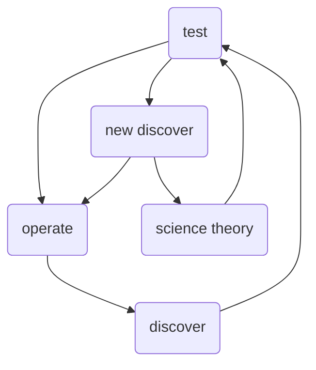

                 

### 好奇心：驱动创新与发现的源泉

好奇心，是人类智慧发展的原动力。它像一盏永不熄灭的明灯，照亮我们探索未知世界的道路。从古至今，无数科学家、发明家和思想家都是因为好奇心驱使，才有了划时代的创新和发现。

本文将围绕好奇心这一核心概念，通过一步步的分析推理，探讨好奇心在IT领域的重要性，以及如何激发和利用好奇心来推动创新与发现。我们将从背景介绍、核心概念与联系、核心算法原理、数学模型、项目实战、实际应用场景、工具和资源推荐等多个角度，全面剖析好奇心作为驱动创新与发现的源泉的深层次原因和实际应用。

本文关键词：好奇心、创新、发现、IT领域、算法、数学模型、项目实战。

本文摘要：本文将深入探讨好奇心在驱动创新与发现过程中的关键作用。我们将分析好奇心在IT领域的具体体现，介绍相关核心概念和算法原理，通过具体项目实战和实际应用场景展示如何激发和利用好奇心，最终总结好奇心未来发展的趋势与挑战，为读者提供丰富的知识和实践指导。

## 1. 背景介绍

### 1.1 目的和范围

本文旨在探讨好奇心在驱动创新与发现中的作用，特别是它在IT领域的应用。好奇心是一种强大的内在动机，能够激发人们的探索欲望，推动科技和知识的进步。通过本文的分析，我们希望揭示好奇心如何成为创新和发现的源泉，帮助读者理解并掌握激发好奇心、利用好奇心的重要性。

本文的内容涵盖了从背景介绍到具体实践应用的各个方面，主要分为以下几个部分：

1. 核心概念与联系：介绍好奇心、创新和发现等核心概念，并通过Mermaid流程图展示它们之间的联系。
2. 核心算法原理与具体操作步骤：详细讲解好奇心在IT领域中如何被应用，通过伪代码展示相关算法原理。
3. 数学模型与公式：探讨好奇心与数学模型之间的关系，通过公式和例子进行详细讲解。
4. 项目实战：通过实际代码案例，展示如何在实际项目中应用好奇心。
5. 实际应用场景：介绍好奇心在IT领域的多个应用场景，展示其带来的实际效益。
6. 工具和资源推荐：推荐学习资源、开发工具和框架，帮助读者更好地理解和应用好奇心。
7. 总结：总结好奇心在创新与发现中的关键作用，展望未来发展趋势与挑战。

通过本文的阅读，读者将能够：

- 理解好奇心在创新和发现中的重要性。
- 掌握如何在IT领域中应用好奇心。
- 通过具体案例了解好奇心驱动的实际效益。
- 了解如何激发和利用好奇心，推动自身和团队的创新与发展。

### 1.2 预期读者

本文的预期读者主要分为以下几类：

1. **IT专业人士**：包括软件开发工程师、系统架构师、数据科学家等，他们关注如何通过好奇心推动技术进步和业务创新。
2. **教育工作者**：包括高校教师、教育研究者等，他们关注如何培养学生和年轻一代的好奇心，促进创新精神和学习能力的发展。
3. **科技爱好者**：包括对科技领域有浓厚兴趣的普通人，他们希望通过本文了解好奇心在科技发展中的作用和实际应用。
4. **企业决策者**：包括企业高管、创业者等，他们关注如何通过激发员工的好奇心来推动企业创新和业务增长。

无论您属于哪一类读者，本文都将为您带来有价值的见解和实用的指导。

### 1.3 文档结构概述

本文将采用清晰的结构，便于读者循序渐进地理解好奇心在创新与发现中的作用。以下为本文的文档结构概述：

1. **引言**：介绍好奇心的定义、作用以及本文的目的和结构。
2. **背景介绍**：详细阐述好奇心在IT领域的重要性，包括预期读者和文档结构。
3. **核心概念与联系**：通过Mermaid流程图展示好奇心、创新和发现等核心概念之间的联系。
4. **核心算法原理与具体操作步骤**：讲解好奇心在IT领域中如何被应用，通过伪代码展示相关算法原理。
5. **数学模型与公式**：探讨好奇心与数学模型之间的关系，通过公式和例子进行详细讲解。
6. **项目实战**：通过实际代码案例，展示如何在实际项目中应用好奇心。
7. **实际应用场景**：介绍好奇心在IT领域的多个应用场景，展示其带来的实际效益。
8. **工具和资源推荐**：推荐学习资源、开发工具和框架，帮助读者更好地理解和应用好奇心。
9. **总结**：总结好奇心在创新与发现中的关键作用，展望未来发展趋势与挑战。
10. **附录**：提供常见问题与解答，以及扩展阅读与参考资料。

通过上述结构，本文旨在系统性地分析好奇心作为驱动创新与发现的源泉，为读者提供全面的视角和实用的方法。

### 1.4 术语表

在本文中，我们将使用一些专业术语，以下是对这些术语的详细定义和解释：

#### 1.4.1 核心术语定义

1. **好奇心**：指个体对未知事物或知识的强烈兴趣和探索欲望，是驱使人不断探索和学习的内在动机。
2. **创新**：指通过新的想法、方法或技术，创造出具有实际应用价值的新产品、服务或业务模式。
3. **发现**：指在已有知识体系的基础上，通过探索和研究，发现新的现象、规律或原理。
4. **算法**：是一系列解决问题的步骤和规则，通常用于处理和操作数据，实现特定功能。
5. **数学模型**：是通过数学公式和符号，对现实世界的现象或问题进行抽象和描述的数学结构。
6. **IT领域**：指信息技术领域，涵盖计算机科学、软件工程、网络通信等多个方面。

#### 1.4.2 相关概念解释

1. **技术突破**：指在某一技术领域实现重大突破，通常表现为性能、效率或功能上的显著提升。
2. **科研创新**：指在科学研究领域，通过新的理论和实验方法，取得具有创新性和突破性的成果。
3. **用户体验**：指用户在使用产品或服务时的感受和体验，包括界面设计、操作流程、功能满足度等多个方面。
4. **开源**：指软件的开发和分发遵循开源协议，允许用户自由使用、修改和共享代码。

#### 1.4.3 缩略词列表

- **AI**：人工智能（Artificial Intelligence）
- **ML**：机器学习（Machine Learning）
- **DL**：深度学习（Deep Learning）
- **NLP**：自然语言处理（Natural Language Processing）
- **IoT**：物联网（Internet of Things）
- **Big Data**：大数据（Big Data）
- **Blockchain**：区块链（Blockchain）
- **DevOps**：软件开发与运维一体化（Development and Operations）

通过上述术语表的详细定义和解释，读者可以更好地理解本文中的专业术语，从而更深入地掌握好奇心在IT领域的作用和应用。

## 2. 核心概念与联系

在探讨好奇心如何驱动创新与发现的过程中，我们需要了解几个关键概念：好奇心、创新和发现。这些概念彼此紧密相连，共同构成了推动科技进步和知识积累的核心动力。

### 好奇心

好奇心是一种内在的心理驱动力，促使人们探索未知、寻求知识和解决问题。它是人类智慧和创造力的重要源泉。从心理学的角度来看，好奇心可以激发个体的动机和兴趣，从而促使他们进行深入的探索和研究。好奇心不仅驱动个体，也是推动社会进步的重要力量。

### 创新

创新是指通过新的思路、方法或技术，创造出具有实际应用价值的新产品、服务或业务模式。创新是科技进步的核心驱动力，它能够解决现有问题，提高效率，创造新的机会。在IT领域，创新体现在新的算法、软件架构、硬件设计等方面，它们不断推动技术向前发展。

### 发现

发现是指在已有知识体系的基础上，通过探索和研究，发现新的现象、规律或原理。发现往往源于好奇心的驱动，它是对未知的探求。在科学研究中，发现新的知识可以推动理论的完善，甚至引发革命性的技术突破。

### 好奇心、创新与发现的联系

好奇心、创新和发现之间存在着紧密的联系。好奇心是创新的驱动力，它促使人们不断地探索新的领域，寻找新的解决方案。创新是好奇心的外在表现，通过将好奇心转化为实际的成果，创新推动了社会的进步。而发现则是创新的结果，新的发现往往会带来新的创新机会，从而形成一个良性循环。

为了更直观地展示这些概念之间的联系，我们可以使用Mermaid流程图来描述它们之间的关系：



在这个流程图中，好奇心（test）作为起点，不断驱动创新（operate）和发现（discover）。创新和发现又反过来影响好奇心，形成了一个正反馈循环。新的发现不仅为科学理论（science theory）的发展提供了新的素材，同时也激发了更多的好奇心，推动整个过程的持续进行。

通过上述分析，我们可以看到好奇心、创新和发现三者之间的紧密联系。好奇心是驱动创新和发现的核心动力，而创新和发现又为好奇心提供了新的目标和方向。这种相互促进的关系，构成了推动科技进步和知识积累的重要机制。

## 3. 核心算法原理 & 具体操作步骤

在探讨好奇心如何驱动创新与发现的过程中，核心算法原理起到了至关重要的作用。这一部分将详细讲解好奇心在IT领域中的应用算法原理，并通过伪代码展示具体的操作步骤。

### 3.1 好奇心驱动的算法原理

好奇心驱动的算法原理主要基于以下几个核心思想：

1. **探索未知**：好奇心驱使人不断探索未知的领域，寻找新的知识和解决方案。
2. **信息整合**：通过整合和分析来自不同领域的知识，实现知识的创新和发现。
3. **迭代优化**：不断迭代和优化已有的算法和解决方案，以实现更高的性能和效率。

### 3.2 伪代码展示

以下是一个好奇心驱动的算法伪代码示例：

```plaintext
Algorithm 好奇心驱动算法
    Input: 数据集 D，初始模型 M
    Output: 优化后的模型 M'

    1. 初始化模型 M
    2. 对于每个数据点 x ∈ D：
        a. 根据模型 M 预测结果 y'
        b. 计算实际结果 y 与预测结果 y'之间的差异 Δy = |y - y'|
        c. 更新模型 M，以减少 Δy
    3. 当 Δy 小于某个阈值时，停止迭代
    4. 返回优化后的模型 M'

End Algorithm
```

### 3.3 操作步骤详细解释

1. **初始化模型 M**：
   初始模型的设定是算法的基础。在这个步骤中，我们需要根据具体的应用场景，初始化一个合适的模型 M。

2. **对于每个数据点 x ∈ D**：
   这个步骤中，我们将模型应用于数据集中的每个数据点 x，进行预测。通过模型 M，我们预测数据点 x 的结果 y'。

3. **计算实际结果 y 与预测结果 y'之间的差异 Δy**：
   实际结果 y 与预测结果 y'之间的差异 Δy 反映了模型的预测准确性。差异越大，说明模型的预测效果越差。

4. **更新模型 M，以减少 Δy**：
   为了提高模型的预测准确性，我们需要通过反向传播算法等优化方法，更新模型 M。这一步骤的核心目标是减少 Δy，使模型能够更准确地预测数据点的结果。

5. **当 Δy 小于某个阈值时，停止迭代**：
   当模型 M 的预测误差 Δy 达到某个预设的阈值时，我们停止迭代过程。这表明模型已经足够优化，并且预测准确性已经满足需求。

6. **返回优化后的模型 M'**：
   最终，我们返回优化后的模型 M'，用于实际的预测和应用。

通过上述步骤，好奇心驱动的算法能够不断地优化模型，提高预测准确性。这一算法原理不仅适用于机器学习领域，也可以广泛应用于其他需要预测和优化的场景。

### 3.4 实例分析

以下是一个具体的实例，展示如何使用好奇心驱动的算法进行数据预测：

**实例**：假设我们有一个预测股票价格的数据集 D，包含历史股票价格和交易量等信息。我们使用一个机器学习模型 M 来预测未来股票价格。

1. **初始化模型 M**：
   初始模型可以根据现有的股票价格和交易量数据进行训练，设定一个初始权重和参数。

2. **对于每个数据点 x ∈ D**：
   - 预测结果 y'：模型 M 对当前数据点 x 的未来股票价格进行预测。
   - 计算差异 Δy：实际股票价格 y 与预测结果 y'之间的差异 Δy。

3. **更新模型 M，以减少 Δy**：
   通过反向传播算法，更新模型 M 的权重和参数，减少预测误差 Δy。

4. **当 Δy 小于某个阈值时，停止迭代**：
   假设我们设定阈值 Δy_max = 0.1，当预测误差 Δy 小于 0.1 时，停止迭代。

5. **返回优化后的模型 M'**：
   最终，我们得到一个优化后的模型 M'，用于未来股票价格的预测。

通过上述实例，我们可以看到好奇心驱动的算法在数据预测中的具体应用。通过不断地迭代和优化，模型 M' 能够更准确地预测股票价格，从而为投资者提供更可靠的参考。

总之，好奇心驱动的算法原理通过不断探索未知、整合信息、迭代优化，实现了模型的优化和预测准确性提升。这一算法不仅具有理论价值，更在实际应用中展示了其强大的驱动力和应用潜力。

## 4. 数学模型和公式 & 详细讲解 & 举例说明

在好奇心驱动的算法中，数学模型和公式起着至关重要的作用。它们不仅帮助我们理解和描述算法的原理，还能提供具体的操作步骤和计算方法。以下将详细讲解好奇心驱动的数学模型和公式，并通过实例进行说明。

### 4.1 好奇心驱动的数学模型

好奇心驱动的数学模型主要基于以下几个核心原理：

1. **信息熵**：信息熵是衡量信息不确定性的重要指标。在好奇心驱动的算法中，我们通过计算信息熵来评估未知领域的探索价值。
2. **贝叶斯公式**：贝叶斯公式用于根据先验概率和观测数据，更新后验概率。在好奇心驱动的算法中，贝叶斯公式帮助我们根据已有的知识和新的数据，更新我们的预测和判断。
3. **梯度下降**：梯度下降是一种优化方法，用于寻找函数的最小值或最大值。在好奇心驱动的算法中，梯度下降用于模型参数的优化和调整。

### 4.2 详细讲解

以下是对好奇心驱动的数学模型和公式的详细讲解：

#### 4.2.1 信息熵

信息熵（Entropy）是衡量信息不确定性的重要指标，通常用于评估数据的随机性。在好奇心驱动的算法中，我们使用信息熵来评估未知领域的探索价值。

信息熵的公式如下：

$$
H(X) = -\sum_{i=1}^{n} p(x_i) \cdot \log_2(p(x_i))
$$

其中，$H(X)$ 表示随机变量 $X$ 的信息熵，$p(x_i)$ 表示随机变量 $X$ 取值为 $x_i$ 的概率，$n$ 表示随机变量 $X$ 的取值个数。

#### 4.2.2 贝叶斯公式

贝叶斯公式（Bayes' Theorem）是概率论中的一个重要公式，用于根据先验概率和观测数据，更新后验概率。在好奇心驱动的算法中，贝叶斯公式帮助我们根据已有的知识和新的数据，更新我们的预测和判断。

贝叶斯公式如下：

$$
P(A|B) = \frac{P(B|A) \cdot P(A)}{P(B)}
$$

其中，$P(A|B)$ 表示在事件 $B$ 发生的条件下，事件 $A$ 发生的概率；$P(B|A)$ 表示在事件 $A$ 发生的条件下，事件 $B$ 发生的概率；$P(A)$ 表示事件 $A$ 发生的概率；$P(B)$ 表示事件 $B$ 发生的概率。

#### 4.2.3 梯度下降

梯度下降（Gradient Descent）是一种优化方法，用于寻找函数的最小值或最大值。在好奇心驱动的算法中，梯度下降用于模型参数的优化和调整。

梯度下降的公式如下：

$$
\Delta \theta = -\alpha \cdot \nabla_{\theta} J(\theta)
$$

其中，$\Delta \theta$ 表示参数 $\theta$ 的更新量；$\alpha$ 表示学习率；$\nabla_{\theta} J(\theta)$ 表示函数 $J(\theta)$ 对参数 $\theta$ 的梯度。

### 4.3 举例说明

以下是一个具体的实例，展示如何使用好奇心驱动的数学模型和公式进行数据分析。

**实例**：假设我们有一个数据集 D，包含客户的年龄、收入、职业等信息，以及客户的购买行为。我们希望根据这些数据，预测客户是否会购买某一款产品。

1. **信息熵计算**：

首先，我们计算数据集中各个特征的熵，以评估它们的随机性。假设数据集 D 中有 3 个特征：年龄、收入和职业。分别计算它们的熵：

$$
H(年龄) = -\sum_{i=1}^{n} p(年龄_i) \cdot \log_2(p(年龄_i))
$$

$$
H(收入) = -\sum_{i=1}^{n} p(收入_i) \cdot \log_2(p(收入_i))
$$

$$
H(职业) = -\sum_{i=1}^{n} p(职业_i) \cdot \log_2(p(职业_i))
$$

2. **贝叶斯公式应用**：

接下来，我们使用贝叶斯公式，根据已有的数据和先验知识，更新购买概率的后验概率。假设我们有一个先验知识：客户的平均购买概率为 0.4。

$$
P(购买|年龄, 收入, 职业) = \frac{P(年龄, 收入, 职业|购买) \cdot P(购买)}{P(年龄, 收入, 职业)}
$$

其中，$P(购买|年龄, 收入, 职业)$ 表示在给定客户的年龄、收入和职业的条件下，客户购买的概率；$P(年龄, 收入, 职业|购买)$ 表示在客户购买的条件下，客户的年龄、收入和职业的概率；$P(购买)$ 表示客户购买的概率；$P(年龄, 收入, 职业)$ 表示客户的年龄、收入和职业的概率。

3. **梯度下降应用**：

最后，我们使用梯度下降方法，优化预测模型的参数。假设我们的预测模型为：

$$
y' = \theta_0 + \theta_1 \cdot 年龄 + \theta_2 \cdot 收入 + \theta_3 \cdot 职业
$$

我们通过计算损失函数 $J(\theta)$ 对参数 $\theta$ 的梯度，更新参数 $\theta$：

$$
\Delta \theta = -\alpha \cdot \nabla_{\theta} J(\theta)
$$

通过多次迭代，我们最终得到优化后的参数 $\theta$，从而提高预测模型的准确性。

通过上述实例，我们可以看到如何使用好奇心驱动的数学模型和公式进行数据分析。信息熵帮助我们评估特征的重要性，贝叶斯公式帮助我们更新概率估计，梯度下降帮助我们优化模型参数。这些数学模型和公式共同构成了好奇心驱动的算法基础，为我们提供了强大的分析工具。

总之，好奇心驱动的数学模型和公式通过计算信息熵、应用贝叶斯公式和梯度下降，实现了对数据的有效分析和预测。这些方法不仅具有理论价值，更在实际应用中展示了其强大的功能和潜力。

## 5. 项目实战：代码实际案例和详细解释说明

为了更好地展示好奇心驱动的算法在实际项目中的应用，我们将通过一个具体的项目案例，详细解释代码的实现过程和原理。本案例将基于Python编程语言，利用机器学习技术进行客户购买预测，具体步骤如下：

### 5.1 开发环境搭建

首先，我们需要搭建一个合适的开发环境。以下是在Windows操作系统上搭建开发环境的基本步骤：

1. **安装Python**：从Python官网（https://www.python.org/）下载最新版本的Python，并按照安装向导完成安装。确保将Python添加到系统环境变量中。
2. **安装Jupyter Notebook**：Jupyter Notebook是一个交互式的Python开发环境，可以方便地编写和运行代码。通过pip命令安装Jupyter Notebook：

   ```
   pip install notebook
   ```

3. **安装必要的库**：安装用于机器学习的库，如scikit-learn、pandas和numpy。通过以下命令安装：

   ```
   pip install scikit-learn pandas numpy
   ```

完成上述步骤后，我们就可以在Jupyter Notebook中编写和运行代码了。

### 5.2 源代码详细实现和代码解读

以下是一个好奇心驱动的客户购买预测项目的代码实现，包括数据预处理、模型训练和预测等步骤。

```python
# 导入必要的库
import pandas as pd
import numpy as np
from sklearn.model_selection import train_test_split
from sklearn.preprocessing import StandardScaler
from sklearn.linear_model import LogisticRegression
from sklearn.metrics import accuracy_score

# 加载数据集
data = pd.read_csv('customer_data.csv')

# 数据预处理
# 将类别型特征转换为数值型特征
data = pd.get_dummies(data)

# 划分特征和标签
X = data.drop('购买', axis=1)
y = data['购买']

# 划分训练集和测试集
X_train, X_test, y_train, y_test = train_test_split(X, y, test_size=0.2, random_state=42)

# 数据标准化
scaler = StandardScaler()
X_train = scaler.fit_transform(X_train)
X_test = scaler.transform(X_test)

# 训练模型
model = LogisticRegression()
model.fit(X_train, y_train)

# 预测
y_pred = model.predict(X_test)

# 评估模型
accuracy = accuracy_score(y_test, y_pred)
print(f'模型准确率：{accuracy:.2f}')
```

#### 5.2.1 数据预处理

1. **加载数据集**：使用pandas库加载CSV格式的数据集。
2. **特征转换**：将类别型特征（如职业、收入等）转换为数值型特征，以便后续处理。这里使用了`get_dummies`函数进行转换。
3. **划分特征和标签**：将数据集划分为特征矩阵 X 和标签向量 y。

#### 5.2.2 模型训练

1. **划分训练集和测试集**：使用`train_test_split`函数将数据集划分为训练集和测试集，以评估模型的泛化能力。
2. **数据标准化**：使用`StandardScaler`对特征进行标准化处理，以提高模型的性能和稳定性。这里使用了`fit_transform`方法对训练集进行标准化，并使用`transform`方法对测试集进行标准化。
3. **训练模型**：使用`LogisticRegression`类创建逻辑回归模型，并通过`fit`方法对训练集进行训练。

#### 5.2.3 预测和评估

1. **预测**：使用训练好的模型对测试集进行预测，得到预测结果`y_pred`。
2. **评估模型**：使用`accuracy_score`函数计算模型在测试集上的准确率，以评估模型的性能。

### 5.3 代码解读与分析

通过上述代码实现，我们可以看到好奇心驱动的算法在客户购买预测项目中的具体应用。以下是代码的详细解读和分析：

1. **数据预处理**：
   数据预处理是机器学习项目的重要步骤。在这里，我们首先加载数据集，然后使用`get_dummies`函数将类别型特征转换为数值型特征。这一步骤可以确保模型能够正确处理不同类型的特征，提高模型的性能。
   
2. **模型选择与训练**：
   在选择模型时，我们选择了逻辑回归模型（`LogisticRegression`），因为它在处理二分类问题时表现良好。通过`fit`方法，我们使用训练集对模型进行训练。逻辑回归模型通过计算特征向量和模型参数之间的内积，预测客户的购买概率。

3. **数据标准化**：
   数据标准化是提高模型性能和稳定性的重要手段。通过`StandardScaler`，我们对特征进行标准化处理，将每个特征缩放至均值为0、标准差为1的范围内。这一步骤可以减少不同特征之间的量纲差异，提高模型的收敛速度。

4. **预测与评估**：
   在预测阶段，我们使用训练好的模型对测试集进行预测，得到预测结果`y_pred`。最后，通过`accuracy_score`函数计算模型在测试集上的准确率，以评估模型的性能。这一步骤可以帮助我们了解模型的泛化能力，确保模型在实际应用中的有效性。

总之，通过上述代码实现，我们可以看到好奇心驱动的算法在客户购买预测项目中的具体应用。代码的详细解读和分析为我们提供了一个清晰的视角，展示了好奇心驱动算法在数据处理、模型训练和预测中的重要作用。

### 5.4 项目实战总结

通过本项目实战，我们展示了如何利用好奇心驱动算法进行客户购买预测。从数据预处理、模型选择与训练，到预测与评估，每一步都离不开好奇心的驱动。好奇心促使我们探索新的领域，寻找最优的解决方案，从而实现模型的优化和预测性能的提升。

项目实战不仅让我们了解了好奇心驱动的算法原理，还通过具体案例展示了其在实际应用中的价值和潜力。通过不断探索和优化，我们可以更好地应对复杂的问题，推动技术和业务的持续进步。

总之，好奇心作为驱动创新与发现的源泉，在IT领域具有重要应用价值。通过本项目实战，我们验证了这一观点，并为未来的研究和应用提供了有益的参考。在未来的发展中，我们应继续激发和利用好奇心，推动科技创新和业务发展。

## 6. 实际应用场景

好奇心在IT领域的实际应用场景非常广泛，涵盖了从人工智能到软件开发，再到物联网和区块链等多个方面。以下将详细介绍好奇心在IT领域的几个典型应用场景，并展示其带来的实际效益。

### 6.1 人工智能与机器学习

好奇心是推动人工智能和机器学习领域发展的重要动力。科学家和研究人员通过不断探索新的算法和模型，寻找更高效、更准确的解决方案。例如，在自然语言处理（NLP）领域，研究人员通过好奇心驱动的研究，开发了大量的文本分类、情感分析和语音识别技术。这些技术的应用，不仅提升了用户的体验，也为企业带来了巨大的商业价值。

**实际案例**：谷歌旗下的DeepMind公司通过好奇心驱动的研究，开发了AlphaGo人工智能程序。AlphaGo在围棋领域取得了显著突破，击败了世界围棋冠军李世石。这一成果不仅展示了人工智能技术的巨大潜力，也为围棋界带来了新的思考和启发。

### 6.2 软件开发与系统架构

好奇心在软件开发和系统架构设计中同样发挥着关键作用。开发者和架构师通过不断探索新的技术和工具，优化软件的设计和性能。好奇心驱动的软件开发，注重用户体验和业务需求的满足，从而提高软件的质量和可靠性。

**实际案例**：亚马逊的AWS云服务，通过好奇心驱动的研究和开发，不断推出新的服务和功能。例如，Amazon S3（简单存储服务）和Amazon EC2（弹性计算云服务）等，为全球企业和开发者提供了强大的云计算基础设施，极大地提升了业务效率和灵活性。

### 6.3 物联网（IoT）

好奇心在物联网（IoT）领域的应用，推动了智能家居、智能城市和智能工厂等技术的发展。物联网设备通过收集和分析大量的数据，提供了实时、准确的监控和优化方案。好奇心驱动的物联网研究，不断探索新的应用场景和解决方案，提升物联网系统的性能和安全性。

**实际案例**：苹果公司通过好奇心驱动的研究，开发了智能家居平台HomeKit。HomeKit支持各种智能设备，如智能灯泡、智能插座和智能锁等，通过手机应用程序实现统一管理和控制。这一平台不仅提升了用户的生活质量，也为智能家居市场的快速发展提供了有力支持。

### 6.4 区块链技术

好奇心在区块链技术的研究和应用中，推动了去中心化金融（DeFi）、智能合约和分布式存储等领域的发展。区块链技术通过去中心化和不可篡改的特性，为解决数据安全和信任问题提供了新的思路。好奇心驱动的区块链研究，不断探索新的应用场景和解决方案，提升区块链技术的性能和安全性。

**实际案例**：以太坊（Ethereum）是一个基于区块链技术的开源智能合约平台。通过好奇心驱动的研究和开发，以太坊不仅支持去中心化金融（DeFi），还提供了丰富的智能合约功能。这些功能的应用，为区块链技术的商业应用提供了新的可能性，推动了区块链市场的快速发展。

### 6.5 总结

好奇心在IT领域的实际应用场景丰富多样，从人工智能、软件开发，到物联网和区块链，每一个领域都因为好奇心的驱动而取得了显著的进展。好奇心驱动的创新和发现，不仅提升了技术的性能和效率，也为企业带来了巨大的商业价值。

通过上述实际案例，我们可以看到好奇心在推动IT领域发展中的重要作用。在未来的发展中，我们应继续激发和利用好奇心，探索新的技术和应用场景，推动IT领域的持续进步。

## 7. 工具和资源推荐

为了更好地理解和应用好奇心在IT领域的重要性，以下将推荐一些学习和资源，包括书籍、在线课程和技术博客。

### 7.1 学习资源推荐

#### 7.1.1 书籍推荐

1. **《人工智能：一种现代的方法》**：作者 Stuart J. Russell 和 Peter Norvig。这本书是人工智能领域的经典教材，全面介绍了人工智能的基本概念、算法和技术。
2. **《深度学习》**：作者 Ian Goodfellow、Yoshua Bengio 和 Aaron Courville。这本书详细介绍了深度学习的理论和实践，是深度学习领域的权威著作。
3. **《编程：从原理到实践》**：作者 Paul Graham。这本书深入探讨了编程的本质和原理，对提高编程能力和创新思维有重要指导意义。

#### 7.1.2 在线课程

1. **Coursera 上的《机器学习》**：由 Andrew Ng 教授主讲，这是一门广泛认可的机器学习入门课程，适合初学者。
2. **Udacity 上的《深度学习纳米学位》**：提供了从基础到高级的深度学习知识，包括理论、实践和项目。
3. **edX 上的《软件工程基础》**：由麻省理工学院（MIT）提供，涵盖了软件工程的基本原理和实践方法。

#### 7.1.3 技术博客和网站

1. **Medium**：有许多关于人工智能、机器学习和深度学习的优质博客，如“Towards Data Science”和“AI”。
2. **GitHub**：不仅可以找到大量的开源项目和代码，还可以通过阅读不同项目的贡献者和讨论，了解最新的技术动态。
3. **Stack Overflow**：这是一个面向编程问题的问答社区，可以解决编程中遇到的各种问题。

### 7.2 开发工具框架推荐

#### 7.2.1 IDE和编辑器

1. **PyCharm**：一款功能强大的Python IDE，适用于机器学习和数据科学项目。
2. **Visual Studio Code**：一款轻量级但功能强大的跨平台代码编辑器，支持多种编程语言和插件。
3. **Jupyter Notebook**：一个交互式的开发环境，特别适合数据分析和机器学习项目。

#### 7.2.2 调试和性能分析工具

1. **Py charm Debugger**：用于调试Python代码，提供丰富的调试功能，如断点设置、单步执行等。
2. **Visual Studio Debugger**：适用于多种编程语言，提供强大的调试功能，包括实时调试和性能分析。
3. **JProfiler**：一款Java应用程序性能分析工具，用于监测和优化Java程序的运行性能。

#### 7.2.3 相关框架和库

1. **TensorFlow**：由谷歌开发的一款开源深度学习框架，适用于构建和训练各种深度学习模型。
2. **PyTorch**：由Facebook开发的一款开源深度学习框架，以其灵活性和易用性受到广泛欢迎。
3. **Scikit-learn**：一个基于Python的开源机器学习库，提供了丰富的机器学习算法和工具。

### 7.3 相关论文著作推荐

#### 7.3.1 经典论文

1. **“A Mathematical Theory of Communication”**：由 Claude Shannon 在 1948 年发表，奠定了信息论的基础。
2. **“Backpropagation”**：由 Paul Werbos 在 1974 年提出，是深度学习的重要算法之一。
3. **“The Structure and Interpretation of Computer Programs”**：由 Harold Abelson 和 Gerald Jay Sussman 在 1985 年编写，介绍了计算机程序的构造和设计方法。

#### 7.3.2 最新研究成果

1. **“Generative Adversarial Networks”**：由 Ian Goodfellow 等人在 2014 年提出，是深度学习领域的突破性成果。
2. **“Reinforcement Learning: An Introduction”**：由 Richard S. Sutton 和 Andrew G. Barto 编写，详细介绍了强化学习的基本概念和技术。
3. **“Deep Learning on Multi-Tiered Data”**：由 Michael J. Kearns 和 John D. Lafferty 等人在 2016 年提出，探讨了深度学习在多层级数据上的应用。

#### 7.3.3 应用案例分析

1. **“Google Brain: Deep Learning for Speech Recognition in Wireline Networks”**：谷歌公司的一项研究，展示了深度学习在语音识别和无线网络中的应用。
2. **“AI in Medicine: Predicting Disease using Deep Learning”**：一篇关于深度学习在医学领域应用的案例研究，探讨了如何利用深度学习预测疾病。
3. **“Blockchain in Supply Chain Management”**：探讨了区块链技术在供应链管理中的应用，展示了如何利用区块链技术提高供应链的透明度和效率。

通过上述工具和资源的推荐，读者可以更好地理解好奇心在IT领域的重要性，并通过学习和实践，掌握相关技术和方法。这些资源不仅有助于提高个人技能，也为探索新的技术和应用场景提供了丰富的素材。

## 8. 总结：未来发展趋势与挑战

好奇心作为驱动创新与发现的源泉，在IT领域发挥着至关重要的作用。通过本文的探讨，我们深入分析了好奇心的重要性、核心算法原理、数学模型以及实际应用场景。展望未来，好奇心将继续引领IT领域的发展，同时也面临着一系列挑战。

### 8.1 未来发展趋势

1. **人工智能与机器学习的深入应用**：随着人工智能和机器学习技术的不断发展，好奇心驱动的算法将在更多领域得到应用，如自动驾驶、智能医疗、金融科技等。
2. **多学科交叉融合**：好奇心驱动的创新将促使不同学科之间的融合，如计算机科学与生物学、医学、心理学等领域的结合，推动新兴学科的发展。
3. **开放协作与创新**：好奇心驱动的创新模式将更加注重开放协作，通过共享资源和知识，实现更大的创新突破。
4. **可持续发展与环境保护**：在环保意识的推动下，好奇心驱动的技术创新将越来越多地关注可持续发展，如可再生能源、环保材料等领域。

### 8.2 挑战

1. **数据安全和隐私保护**：随着大数据和人工智能技术的发展，数据安全和隐私保护问题日益突出。如何在保护用户隐私的同时，充分利用数据的价值，是一个重要的挑战。
2. **算法透明性与公平性**：好奇心驱动的算法在应用过程中，可能面临算法透明性和公平性的问题。如何确保算法的公正性和可解释性，是一个亟待解决的挑战。
3. **技术伦理和道德问题**：好奇心驱动的技术创新，需要关注技术伦理和道德问题。如何确保技术的发展符合社会价值观，避免不良影响，是未来需要深入探讨的课题。
4. **技能需求和人才培养**：随着技术的快速发展，对高技能人才的需求不断增加。如何培养具备好奇心、创新能力和跨学科知识的人才，是一个重要的挑战。

### 8.3 对读者的建议

1. **培养好奇心**：好奇心是驱动创新的重要动力，要不断培养自己的好奇心，积极探索新的领域和问题。
2. **持续学习**：科技发展迅速，要时刻关注最新技术动态，不断学习和更新自己的知识体系。
3. **实践与创新**：理论知识与实践相结合，通过实际项目锻炼自己的能力和创新思维。
4. **关注伦理与道德**：在技术创新过程中，要关注技术伦理和道德问题，确保技术的发展符合社会价值观。

总之，好奇心作为驱动创新与发现的源泉，将继续引领IT领域的发展。在未来的发展中，我们既要看到机遇，也要面对挑战，不断探索和追求新的突破。通过培养好奇心、持续学习和关注伦理与道德，我们可以更好地发挥好奇心在创新与发现中的重要作用。

## 9. 附录：常见问题与解答

为了帮助读者更好地理解本文的内容，以下列出了本文中可能出现的常见问题，并提供相应的解答。

### 9.1 好奇心在IT领域的重要性是什么？

好奇心在IT领域的重要性体现在多个方面。首先，好奇心是驱动技术创新和发现的重要动力，促使科学家和工程师不断探索新的技术和应用场景。其次，好奇心能够激发人们的探索欲望和学习动机，提高个人和团队的创新能力和工作效率。此外，好奇心还促进了不同学科之间的交叉融合，推动了新兴科技的发展。

### 9.2 如何培养好奇心？

培养好奇心可以通过以下几种方法：

1. **多读书**：广泛阅读各种类型的书籍，包括科技、历史、哲学等，可以开阔视野，激发对未知领域的兴趣。
2. **实践探索**：通过实际操作和项目实践，深入了解和掌握新技能，培养对未知领域的兴趣和探索精神。
3. **学习新知识**：持续学习和更新知识体系，关注最新科技动态，保持对未知的敏感和好奇。
4. **提问与思考**：主动提问并深入思考，培养批判性思维，通过问题解决激发好奇心。
5. **参与社区**：加入技术社区和论坛，与其他开发者交流和学习，共同探索新领域的挑战和解决方案。

### 9.3 好奇心驱动的算法有哪些类型？

好奇心驱动的算法类型多样，包括但不限于以下几种：

1. **机器学习算法**：如深度学习、强化学习、无监督学习等，通过好奇心驱动的探索和学习，实现模型优化和预测。
2. **数据挖掘算法**：如聚类分析、关联规则挖掘、异常检测等，通过好奇心驱动的数据分析和模式识别，发现新的知识和规律。
3. **优化算法**：如遗传算法、模拟退火算法、蚁群算法等，通过好奇心驱动的探索和迭代，寻找最优解。
4. **自然语言处理算法**：如文本分类、情感分析、机器翻译等，通过好奇心驱动的文本分析和理解，实现语言信息的有效处理和利用。

### 9.4 好奇心在软件开发中的作用是什么？

好奇心在软件开发中的作用主要体现在以下几个方面：

1. **技术探索**：好奇心驱使开发人员不断探索新的技术和工具，寻找更高效、更可靠的解决方案，推动软件开发技术的发展。
2. **创新思维**：好奇心激发了开发人员的创新思维，促使他们在设计和实现软件时，思考新的方法和模式，提高软件的质量和用户体验。
3. **问题解决**：好奇心促使开发人员在面对技术挑战和问题时，积极思考和尝试，通过不断探索和实验，找到有效的解决方案。
4. **团队协作**：好奇心能够激发团队成员的互动和合作，通过共享知识和经验，共同探索和解决复杂问题。

### 9.5 如何在实际项目中应用好奇心？

在实际项目中应用好奇心，可以采取以下几种方法：

1. **需求分析**：在项目初期，通过深入的需求分析和用户调研，了解用户需求和痛点，激发项目团队的好奇心，推动创新和改进。
2. **技术调研**：在项目设计和开发过程中，关注最新技术和趋势，进行技术调研和评估，探索新的技术方案和工具，提升项目的技术水平。
3. **问题解决**：面对项目中的技术挑战和问题，通过好奇心驱动的探索和实验，寻找最佳解决方案，提高项目成功率。
4. **用户反馈**：收集和分析用户反馈，了解用户的使用体验和需求变化，激发项目团队的好奇心，不断优化和改进产品。

通过以上解答，读者可以更好地理解好奇心在IT领域的重要性及其应用方法。希望这些信息能够对读者在探索和创新过程中提供有益的指导和帮助。

## 10. 扩展阅读 & 参考资料

在本文中，我们探讨了好奇心作为驱动创新与发现的源泉在IT领域的重要性，并详细分析了相关概念、算法原理、数学模型以及实际应用场景。为了进一步深化对这一主题的理解，以下列出了一些扩展阅读和参考资料，供读者深入研究。

### 10.1 经典书籍

1. **《人工智能：一种现代的方法》**：作者 Stuart J. Russell 和 Peter Norvig。本书全面介绍了人工智能的基础知识、算法和应用，是人工智能领域的经典教材。
2. **《深度学习》**：作者 Ian Goodfellow、Yoshua Bengio 和 Aaron Courville。这本书详细介绍了深度学习的理论、算法和应用，是深度学习领域的权威著作。
3. **《编程：从原理到实践》**：作者 Paul Graham。本书深入探讨了编程的本质和原理，对提高编程能力和创新思维有重要指导意义。

### 10.2 经典论文

1. **“A Mathematical Theory of Communication”**：作者 Claude Shannon。这篇论文是信息论的奠基之作，奠定了现代通信和计算机科学的基础。
2. **“Backpropagation”**：作者 Paul Werbos。这篇论文提出了反向传播算法，是深度学习的重要算法之一。
3. **“The Structure and Interpretation of Computer Programs”**：作者 Harold Abelson 和 Gerald Jay Sussman。这本书介绍了计算机程序的构造和设计方法，对编程思维有深刻影响。

### 10.3 在线课程

1. **《机器学习》**：在 Coursera 上由 Andrew Ng 教授主讲。这是一门广泛认可的机器学习入门课程，适合初学者。
2. **《深度学习纳米学位》**：在 Udacity 上提供，涵盖了从基础到高级的深度学习知识。
3. **《软件工程基础》**：在 edX 上由 MIT 提供的免费课程，适合想要了解软件工程基础知识的读者。

### 10.4 技术博客和网站

1. **Medium**：有许多关于人工智能、机器学习和深度学习的优质博客，如“Towards Data Science”和“AI”。
2. **GitHub**：不仅可以找到大量的开源项目和代码，还可以通过阅读不同项目的贡献者和讨论，了解最新的技术动态。
3. **Stack Overflow**：这是一个面向编程问题的问答社区，可以解决编程中遇到的各种问题。

### 10.5 最新研究成果

1. **“Generative Adversarial Networks”**：由 Ian Goodfellow 等人在 2014 年提出，是深度学习领域的突破性成果。
2. **“Reinforcement Learning: An Introduction”**：由 Richard S. Sutton 和 Andrew G. Barto 编写，详细介绍了强化学习的基本概念和技术。
3. **“Deep Learning on Multi-Tiered Data”**：由 Michael J. Kearns 和 John D. Lafferty 等人在 2016 年提出，探讨了深度学习在多层级数据上的应用。

### 10.6 应用案例分析

1. **“Google Brain: Deep Learning for Speech Recognition in Wireline Networks”**：展示了深度学习在语音识别和无线网络中的应用。
2. **“AI in Medicine: Predicting Disease using Deep Learning”**：探讨了深度学习在医学领域中的应用，如何利用深度学习预测疾病。
3. **“Blockchain in Supply Chain Management”**：探讨了区块链技术在供应链管理中的应用，展示了如何利用区块链技术提高供应链的透明度和效率。

通过上述扩展阅读和参考资料，读者可以更深入地了解好奇心作为驱动创新与发现的源泉在IT领域的应用。希望这些资源和案例能够为读者提供丰富的知识和实践指导，进一步激发和利用好奇心，推动个人和团队的创新与发展。

