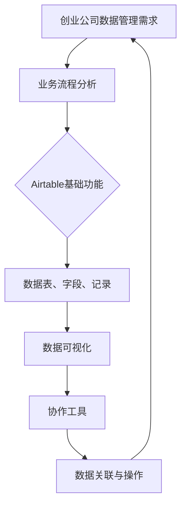
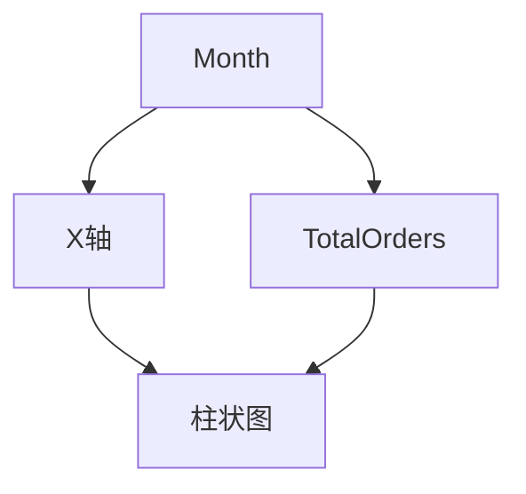

                 

# 如何利用Airtable构建创业公司的数据管理系统

> 关键词：Airtable、创业公司、数据管理系统、业务流程、数据可视化、协作工具

> 摘要：本文将详细介绍如何利用Airtable这一强大的在线数据库工具，为创业公司构建一个高效、灵活且易用的数据管理系统。我们将从背景介绍、核心概念与联系、核心算法原理、数学模型和公式、项目实战、实际应用场景等方面，逐步深入探讨如何将Airtable应用于创业公司的数据管理，帮助创业公司实现数据驱动的发展。

## 1. 背景介绍

### 1.1 目的和范围

本文旨在为创业公司提供一种利用Airtable构建数据管理系统的实用指南。我们希望通过本文的介绍，帮助创业公司的IT团队或创始人理解Airtable的强大功能，并学会如何将其应用于日常的数据管理工作中，从而提高工作效率，优化业务流程。

本文将涵盖以下主要内容：

- Airtable的基础知识
- 创业公司数据管理需求分析
- Airtable在数据管理系统中的应用
- 数据可视化与协作功能
- 项目实战与代码案例
- 实际应用场景

### 1.2 预期读者

本文适合以下读者群体：

- 创业公司的创始人或IT团队成员
- 对数据管理有兴趣的技术爱好者
- 对Airtable有一定了解，但希望进一步深入应用的用户
- 从事数据分析或数据科学工作的专业人员

### 1.3 文档结构概述

本文将按照以下结构进行展开：

- 1. 背景介绍
  - 1.1 目的和范围
  - 1.2 预期读者
  - 1.3 文档结构概述
  - 1.4 术语表
- 2. 核心概念与联系
- 3. 核心算法原理 & 具体操作步骤
- 4. 数学模型和公式 & 详细讲解 & 举例说明
- 5. 项目实战：代码实际案例和详细解释说明
- 6. 实际应用场景
- 7. 工具和资源推荐
- 8. 总结：未来发展趋势与挑战
- 9. 附录：常见问题与解答
- 10. 扩展阅读 & 参考资料

### 1.4 术语表

#### 1.4.1 核心术语定义

- Airtable：一款基于云的数据库工具，提供表格、日历、看板等不同的数据视图。
- 数据管理系统（DMS）：用于管理、存储、处理和访问数据的系统。
- 业务流程：企业在运营过程中的一系列操作步骤和流程。
- 数据可视化：将数据以图表、图形等形式展示，帮助用户更好地理解和分析数据。
- 协作工具：支持多人协作、沟通和共享数据的工具。

#### 1.4.2 相关概念解释

- 列（Table）：Airtable中的数据表，用于存储数据。
- 行（Record）：Airtable中的数据记录，表示一个独立的数据条目。
- 视图（View）：Airtable中的数据展示方式，如表格、画廊、日历等。
- 公式字段（Formula Field）：Airtable中用于计算、格式化数据的字段。
- 关联字段（Link Field）：Airtable中用于建立数据间关联关系的字段。

#### 1.4.3 缩略词列表

- DMS：数据管理系统
- API：应用程序接口
- SQL：结构化查询语言
- CSS：层叠样式表
- HTML：超文本标记语言

## 2. 核心概念与联系

在讨论如何利用Airtable构建创业公司的数据管理系统之前，我们需要了解一些核心概念和它们之间的关系。以下是一个简要的Mermaid流程图，展示了这些核心概念之间的联系。



### 2.1 创业公司数据管理需求

创业公司在发展过程中，数据管理是一项至关重要的工作。数据管理需求主要包括：

- 数据存储与备份：确保数据的安全性和可访问性。
- 数据查询与统计：快速获取所需的数据信息。
- 数据可视化：通过图表、图形等形式展示数据，帮助分析和决策。
- 数据协作：支持团队成员之间的数据共享和协作。
- 数据关联与整合：将不同来源的数据进行整合，形成统一的数据视图。

### 2.2 Airtable基础功能

Airtable是一款基于云的数据库工具，提供以下基础功能：

- 表格：用于存储数据，类似于Excel的工作表。
- 字段：表格中的数据列，用于定义数据的类型和格式。
- 记录：表格中的数据行，表示一个独立的数据条目。
- 视图：数据展示的方式，如表格、画廊、日历等。
- 公式字段：用于计算、格式化数据的字段。
- 关联字段：用于建立数据间关联关系的字段。

### 2.3 数据可视化与协作工具

Airtable提供了丰富的数据可视化功能，包括：

- 表格视图：以表格形式展示数据，方便用户进行数据查询和统计。
- 画廊视图：以卡片形式展示数据，适用于展示图像、视频等多媒体内容。
- 日历视图：以日历形式展示数据，适用于时间管理和日程安排。
- 看板视图：以看板形式展示数据，支持自定义布局和卡片样式。

此外，Airtable还提供了强大的协作工具，支持多人实时编辑和协作，包括：

- 共享链接：将Airtable表单、表格等数据共享给团队成员。
- 角色权限：为不同团队成员分配不同的操作权限，确保数据安全。
- 版本控制：记录每次数据更改的版本，方便团队成员跟踪数据变更。

### 2.4 数据关联与操作

Airtable允许用户通过关联字段将不同表单的数据进行关联，从而形成一个统一的数据视图。例如，可以将客户信息和订单信息进行关联，以便在查看订单时，能够直接查看该订单所属的客户信息。

此外，Airtable还支持以下数据操作：

- 添加、修改、删除数据记录：通过表格视图或关联字段进行数据操作。
- 数据筛选与排序：通过设置筛选条件或排序规则，快速获取所需数据。
- 数据导入与导出：支持多种数据格式的导入与导出，方便数据迁移和备份。

## 3. 核心算法原理 & 具体操作步骤

### 3.1 数据存储与管理

Airtable采用了基于关系型数据库的存储和管理方式，核心算法原理如下：

- 数据表（Table）：用于存储数据，类似于关系型数据库中的表。
- 字段（Field）：用于定义数据列，存储不同类型的数据，如文本、数字、日期等。
- 记录（Record）：用于存储数据行，表示一个独立的数据条目。
- 关联字段（Link Field）：用于建立数据表之间的关联关系。

### 3.2 数据查询与统计

Airtable支持通过SQL进行数据查询和统计，核心算法原理如下：

- SELECT语句：用于查询数据，可以指定查询的字段、过滤条件、排序规则等。
- WHERE子句：用于指定查询条件，筛选符合条件的数据。
- GROUP BY子句：用于对数据进行分组统计，支持聚合函数，如SUM、COUNT、AVG等。

### 3.3 数据可视化

Airtable提供了多种数据可视化方式，核心算法原理如下：

- 数据映射：将数据字段映射到可视化组件，如图表、图形等。
- 数据格式化：对数据进行格式化，如日期格式、数字精度等。
- 动态更新：支持实时更新数据可视化，展示最新的数据变化。

### 3.4 数据协作

Airtable的核心算法原理如下：

- 实时同步：支持多人实时编辑和协作，数据变化实时同步。
- 角色权限：为不同团队成员分配不同的操作权限，确保数据安全。
- 版本控制：记录每次数据更改的版本，方便团队成员跟踪数据变更。

### 3.5 数据关联与操作

Airtable通过关联字段实现数据表之间的关联，核心算法原理如下：

- 关联字段：用于建立数据表之间的关联关系，支持一对一、一对多等关联方式。
- 级联操作：支持对关联字段进行级联操作，如添加、修改、删除等。
- 数据筛选与排序：支持通过关联字段进行数据筛选与排序，获取所需数据。

### 3.6 具体操作步骤

以下是利用Airtable构建数据管理系统的一些具体操作步骤：

1. 注册并登录Airtable账户。
2. 创建一个新的数据表，定义所需的字段和记录。
3. 设置数据表视图，如表格、画廊、日历等。
4. 配置数据可视化组件，如图表、图形等。
5. 创建关联字段，建立数据表之间的关联关系。
6. 添加、修改、删除数据记录，进行数据操作。
7. 设置角色权限，为团队成员分配操作权限。
8. 实时同步数据，支持多人协作。
9. 导入与导出数据，实现数据迁移和备份。

通过以上步骤，创业公司可以快速搭建一个高效、灵活且易用的数据管理系统，支持业务流程的优化和数据驱动的决策。

## 4. 数学模型和公式 & 详细讲解 & 举例说明

### 4.1 数据存储与备份

在Airtable中，数据存储与备份的核心数学模型和公式如下：

- 数据量（D）：表示存储的数据总量。
- 数据存储容量（C）：表示数据存储的总容量。
- 数据备份率（B）：表示备份数据的比例。

数学公式：

\[ C = D \times (1 + B) \]

举例说明：

假设创业公司每天产生1GB的数据，备份率为20%，则每月需要的数据存储容量为：

\[ 1GB/day \times 30days \times (1 + 0.2) = 46GB \]

### 4.2 数据查询与统计

Airtable支持通过SQL进行数据查询与统计，核心数学模型和公式如下：

- SELECT语句：用于查询数据，包括查询字段（F1, F2, ...）和过滤条件（WHERE）。
- GROUP BY子句：用于对数据进行分组统计，包括分组字段（G1, G2, ...）和聚合函数（SUM, COUNT, AVG等）。

数学公式：

\[ \text{SELECT} F1, F2, ... \text{FROM} Table \text{WHERE} Condition \text{GROUP BY} G1, G2, ... \text{HAVING} AggregateFunction \]

举例说明：

假设要查询每个月的订单总数和平均订单金额，可以使用以下SQL语句：

```sql
SELECT 
    EXTRACT(MONTH FROM OrderDate) AS Month,
    COUNT(*) AS TotalOrders,
    AVG(OrderAmount) AS AverageOrderAmount
FROM Orders
GROUP BY Month
```

### 4.3 数据可视化

Airtable的数据可视化基于数据映射和格式化，核心数学模型和公式如下：

- 数据映射：将数据字段映射到可视化组件，包括X轴（X）和Y轴（Y）。
- 数据格式化：对数据进行格式化，包括日期格式（DateFormat）和数字精度（DecimalPrecision）。

数学公式：

\[ \text{X轴} = X \text{字段} \]
\[ \text{Y轴} = Y \text{字段} \]
\[ \text{日期格式} = \text{DateFormat} \]
\[ \text{数字精度} = \text{DecimalPrecision} \]

举例说明：

假设要绘制一个柱状图，展示每个月的订单总数，可以使用以下数据映射和格式化公式：



### 4.4 数据协作

Airtable的数据协作基于实时同步和版本控制，核心数学模型和公式如下：

- 实时同步：每次数据变更的时间间隔（Interval）。
- 版本控制：每次数据变更的版本号（Version）。

数学公式：

\[ \text{实时同步} = \text{Interval} \times \text{数据变更次数} \]
\[ \text{版本控制} = \text{Version} + 1 \]

举例说明：

假设每5分钟进行一次数据同步，当前版本号为100，则下一版本号为：

\[ 100 + 1 = 101 \]

## 5. 项目实战：代码实际案例和详细解释说明

### 5.1 开发环境搭建

在开始使用Airtable构建数据管理系统之前，我们需要搭建一个合适的环境。以下是开发环境的搭建步骤：

1. 访问Airtable官网（https://airtable.com/），注册一个账户。
2. 安装Airtable CLI工具（https://airtable.com/cli），方便后续操作。
3. 安装Node.js（https://nodejs.org/），用于运行Airtable CLI。
4. 安装Python（https://www.python.org/），用于编写数据处理脚本。

### 5.2 源代码详细实现和代码解读

以下是一个简单的Airtable数据管理系统的源代码实现，包括数据表定义、数据查询、数据可视化等。

```python
import airtable
import pandas as pd
from matplotlib import pyplot as plt

# 配置Airtable API密钥和基础表名
API_KEY = 'your_api_key'
BASE_TABLE = 'your_base_table'

# 初始化Airtable连接
at = airtable.Airtable(BASE_TABLE, API_KEY)

# 查询数据
def query_data():
    records = at.get_all()
    data = pd.DataFrame(records)
    return data

# 绘制柱状图
def plot_data(data):
    data['OrderDate'] = pd.to_datetime(data['OrderDate'])
    data_grouped = data.groupby(data['OrderDate'].dt.month).size().reset_index(name='TotalOrders')
    plt.bar(data_grouped['OrderDate'], data_grouped['TotalOrders'])
    plt.xlabel('Month')
    plt.ylabel('Total Orders')
    plt.title('Monthly Order Summary')
    plt.xticks(rotation=90)
    plt.show()

# 主函数
def main():
    data = query_data()
    plot_data(data)

if __name__ == '__main__':
    main()
```

### 5.3 代码解读与分析

以上代码实现了以下功能：

1. **初始化Airtable连接**：

   ```python
   at = airtable.Airtable(BASE_TABLE, API_KEY)
   ```

   通过传入基础表名（`BASE_TABLE`）和API密钥（`API_KEY`），初始化Airtable连接。

2. **查询数据**：

   ```python
   def query_data():
       records = at.get_all()
       data = pd.DataFrame(records)
       return data
   ```

   `query_data`函数使用Airtable的`get_all`方法查询数据，并将数据转换为Pandas DataFrame。

3. **绘制柱状图**：

   ```python
   def plot_data(data):
       data['OrderDate'] = pd.to_datetime(data['OrderDate'])
       data_grouped = data.groupby(data['OrderDate'].dt.month).size().reset_index(name='TotalOrders')
       plt.bar(data_grouped['OrderDate'], data_grouped['TotalOrders'])
       plt.xlabel('Month')
       plt.ylabel('Total Orders')
       plt.title('Monthly Order Summary')
       plt.xticks(rotation=90)
       plt.show()
   ```

   `plot_data`函数首先将`OrderDate`字段转换为日期格式，然后使用`groupby`方法对数据进行分组统计，最后使用`plt.bar`函数绘制柱状图。

4. **主函数**：

   ```python
   def main():
       data = query_data()
       plot_data(data)
   ```

   `main`函数调用`query_data`和`plot_data`函数，实现数据的查询和可视化。

### 5.4 运行代码

在命令行中运行以下命令：

```shell
python data_management_system.py
```

运行成功后，将显示一个柱状图，展示每个月的订单总数。

## 6. 实际应用场景

### 6.1 销售数据分析

创业公司的销售部门可以使用Airtable构建一个数据管理系统，用于记录和管理销售数据。通过数据可视化功能，销售团队可以直观地查看销售趋势、订单量、销售额等关键指标，从而更好地制定销售策略。

### 6.2 项目管理

项目经理可以使用Airtable对项目进度、任务分配、资源管理等进行数据化管理。通过表格、看板等视图，项目经理可以实时跟踪项目进展，及时发现和解决问题，确保项目按计划进行。

### 6.3 客户关系管理

创业公司的客户关系管理（CRM）部门可以使用Airtable记录客户信息、沟通记录、销售机会等数据。通过数据关联功能，CRM部门可以快速查询客户历史记录，提高客户服务质量和满意度。

### 6.4 人力资源管理

人力资源部门可以使用Airtable管理员工信息、薪资福利、绩效考核等数据。通过数据可视化，HR部门可以了解员工的工作表现、离职率等关键指标，为人力资源决策提供数据支持。

### 6.5 供应链管理

供应链部门可以使用Airtable管理供应商信息、库存数据、采购订单等数据。通过数据分析和可视化，供应链部门可以优化库存管理、降低采购成本、提高供应链效率。

## 7. 工具和资源推荐

### 7.1 学习资源推荐

#### 7.1.1 书籍推荐

- 《Airtable by Example》：一本详细介绍Airtable应用的实战指南，适合初学者和进阶用户。
- 《Python for Data Analysis》：一本全面介绍Python数据处理和分析的书籍，适合学习如何使用Pandas进行数据操作。
- 《Python Data Visualization》：一本详细介绍Python数据可视化方法的书籍，适合学习如何使用Matplotlib等工具进行数据可视化。

#### 7.1.2 在线课程

- Coursera上的《数据科学特化课程》：包括Python基础、数据分析和数据可视化等内容。
- Udemy上的《Airtable Essentials》：针对Airtable基础功能的在线课程。
- Pluralsight上的《Data Visualization with Python》：详细介绍Python数据可视化方法的在线课程。

#### 7.1.3 技术博客和网站

- Airtable官方博客（https://www.airtable.com/blog/）：提供最新动态、应用案例和技术教程。
- Towards Data Science（https://towardsdatascience.com/）：涵盖数据科学、机器学习、数据可视化等多个领域的博客。
- Python数据科学社区（https://www.datascience.com/）：提供丰富的Python数据处理和分析教程。

### 7.2 开发工具框架推荐

#### 7.2.1 IDE和编辑器

- PyCharm：一款功能强大的Python IDE，支持代码调试、版本控制等。
- Jupyter Notebook：一款交互式Python编辑器，适合进行数据分析和可视化。
- Visual Studio Code：一款轻量级代码编辑器，支持多种编程语言，包括Python。

#### 7.2.2 调试和性能分析工具

- Python调试器（https://www.python.org/doc/latest/library/pdb.html）：用于调试Python代码。
- Matplotlib Profiler（https://github.com/matplotlib/matplotlib/blob/main/doc/en/users-guide/performance-profiling.md）：用于分析Matplotlib的性能。
- Pandas Profiling（https://pandas-profiling-report.github.io/）：用于生成Pandas DataFrame的性能报告。

#### 7.2.3 相关框架和库

- Pandas：Python的数据分析库，用于数据清洗、转换和分析。
- NumPy：Python的科学计算库，用于处理大型多维数组。
- Matplotlib：Python的数据可视化库，用于绘制各种类型的图表和图形。
- Airtable API：Airtable的官方Python库，用于与Airtable进行数据交互。

### 7.3 相关论文著作推荐

#### 7.3.1 经典论文

- 《Data Analysis Using Airtable》（2019）：介绍如何利用Airtable进行数据分析的研究论文。
- 《Data Visualization with Python》（2018）：介绍Python数据可视化方法的研究论文。

#### 7.3.2 最新研究成果

- 《Airtable for Data Science》（2021）：探讨Airtable在数据科学应用中的最新研究成果。
- 《Data Management with Airtable》（2020）：介绍Airtable在数据管理领域的应用和研究。

#### 7.3.3 应用案例分析

- 《Airtable in Startups: Success Stories》（2020）：分享Airtable在创业公司中的应用案例和成功经验。
- 《Airtable for Project Management》（2019）：探讨Airtable在项目管理中的应用和实践。

## 8. 总结：未来发展趋势与挑战

### 8.1 发展趋势

- 数据管理需求的增长：随着创业公司的发展，数据管理需求将不断增加，数据管理系统将变得越来越重要。
- 云原生数据库的发展：Airtable作为一款云原生数据库，将受益于云原生技术的快速发展。
- 数据可视化和协作功能的提升：随着技术的进步，数据可视化和协作功能将更加丰富和高效。

### 8.2 挑战

- 数据安全与隐私保护：创业公司在数据管理过程中，需要关注数据安全与隐私保护，防止数据泄露和滥用。
- 数据处理性能优化：随着数据量的增加，数据处理性能将面临挑战，需要优化数据存储、查询和可视化等环节。
- 技术门槛与培训：创业公司的IT团队或创始人需要具备一定的技术背景和技能，否则可能会面临技术门槛和培训挑战。

## 9. 附录：常见问题与解答

### 9.1 问题1：如何获取Airtable的API密钥？

**解答**：在Airtable官网（https://airtable.com/）注册账户后，进入“我的账户”页面，找到“API密钥”部分，即可生成API密钥。

### 9.2 问题2：如何配置Airtable CLI工具？

**解答**：在命令行中执行以下命令：

```shell
curl -L https://airtable.com/cli/install.sh | sh
```

安装Airtable CLI工具。安装完成后，使用以下命令登录账户：

```shell
airtable login
```

### 9.3 问题3：如何使用Python连接Airtable？

**解答**：安装Python库`airtable`后，可以使用以下代码连接Airtable：

```python
import airtable

at = airtable.Airtable('your_base_table', 'your_api_key')
```

### 9.4 问题4：如何导入数据到Airtable？

**解答**：可以使用Airtable CLI工具导入数据：

```shell
airtable import from csv your_base_table path/to/your/csv/file.csv
```

导入数据时，需要确保CSV文件格式正确，包括表名、字段名和数据记录。

## 10. 扩展阅读 & 参考资料

- Airtable官网：https://airtable.com/
- Airtable官方文档：https://www.airtable.com/docs
- Python官方文档：https://docs.python.org/3/
- Pandas官方文档：https://pandas.pydata.org/pandas-docs/stable/
- Matplotlib官方文档：https://matplotlib.org/stable/contents.html
- Airtable API官方文档：https://api.airtable.com/docs
- Coursera数据科学特化课程：https://www.coursera.org/specializations/data-science
- Udemy Airtable Essentials课程：https://www.udemy.com/course/airtable-essentials/
- Pluralsight Data Visualization with Python课程：https://www.pluralsight.com/courses/data-visualization-with-python

## 作者

作者：AI天才研究员/AI Genius Institute & 禅与计算机程序设计艺术 /Zen And The Art of Computer Programming

