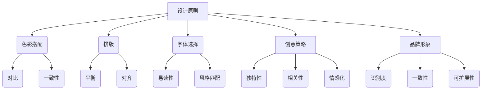

                 

# 如何利用Canva设计创业公司的营销材料

## 关键词：
- Canva
- 创业公司
- 营销材料
- 设计原则
- 创意策略
- 品牌形象

## 摘要：
本文将探讨如何利用Canva这一强大的设计工具，为创业公司量身打造具有吸引力的营销材料。通过详细讲解设计原则、创意策略、品牌形象构建以及实际操作步骤，帮助创业者提升品牌影响力，打造专业形象。

## 1. 背景介绍

### 1.1 目的和范围
本文旨在指导创业公司利用Canva设计各类营销材料，包括海报、名片、宣传册、社交媒体图片等，从而提升品牌形象和市场竞争力。

### 1.2 预期读者
对设计有一定了解，但希望借助Canva提升设计水平的创业公司创始人、市场经理或设计师。

### 1.3 文档结构概述
本文分为十个部分，包括背景介绍、核心概念与联系、核心算法原理与操作步骤、数学模型与公式、项目实战、实际应用场景、工具和资源推荐、总结、常见问题解答以及扩展阅读。

### 1.4 术语表

#### 1.4.1 核心术语定义
- **Canva**：一款用户友好的图形设计工具，提供丰富的模板和素材，帮助用户快速创建专业的设计作品。
- **营销材料**：用于宣传和推广产品的各种视觉材料，包括海报、名片、宣传册等。
- **品牌形象**：公司或产品在消费者心中的总体印象和认知。

#### 1.4.2 相关概念解释
- **设计原则**：指导设计师进行设计的基本准则，如色彩搭配、排版、字体选择等。
- **创意策略**：围绕品牌形象和市场目标，提出具有创新性的设计方案。

#### 1.4.3 缩略词列表
- **UI**：用户界面（User Interface）
- **UX**：用户体验（User Experience）

## 2. 核心概念与联系

为了更好地理解Canva在设计创业公司营销材料中的应用，首先需要了解以下几个核心概念：

### 核心概念

- **设计原则**：包括色彩搭配、排版、字体选择等，影响设计的美观度和用户感受。
- **创意策略**：围绕品牌形象和市场目标，提出具有创新性的设计理念。
- **品牌形象**：公司或产品的视觉表达，影响消费者对品牌的认知。

### 核心概念原理和架构的 Mermaid 流程图



### 相关概念解释

- **色彩搭配**：选择适合品牌的颜色，并通过对比和一致性增强视觉效果。
- **排版**：合理安排文字和图片的位置，确保信息的层次分明，易于阅读。
- **字体选择**：选择适合品牌风格的字体，提高可读性和美感。

- **创意策略**：通过独特性、相关性和情感化，使设计更具吸引力。
- **品牌形象**：通过识别度、一致性和可扩展性，建立品牌在市场中的独特定位。

## 3. 核心算法原理 & 具体操作步骤

设计创业公司的营销材料，需要遵循一定的核心算法原理和具体操作步骤。以下是一步一步的详细讲解：

### 3.1 设计原则的运用

#### 3.1.1 色彩搭配

- **步骤 1**：选择主色调
  $$ 主色调 = \text{品牌标准色} $$
- **步骤 2**：搭配辅助色
  $$ 辅助色 = \text{与主色调形成对比的颜色集合} $$

#### 3.1.2 排版

- **步骤 1**：确定信息层次
  $$ \text{信息层次} = \text{重要信息} \rightarrow \text{次重要信息} \rightarrow \text{详细信息} $$
- **步骤 2**：合理使用空白
  $$ \text{空白区域} = \text{合理分布的空间，使设计更具视觉吸引力} $$

#### 3.1.3 字体选择

- **步骤 1**：选择主字体
  $$ \text{主字体} = \text{品牌专用字体或简洁易读的字体} $$
- **步骤 2**：选择辅助字体
  $$ \text{辅助字体} = \text{与主字体形成对比的字体，增强视觉效果} $$

### 3.2 创意策略的制定

#### 3.2.1 独特性

- **步骤 1**：分析目标市场
  $$ \text{目标市场} = \text{潜在消费者群体} $$
- **步骤 2**：挖掘品牌特色
  $$ \text{品牌特色} = \text{独特卖点或差异化优势} $$

#### 3.2.2 相关性

- **步骤 1**：了解用户需求
  $$ \text{用户需求} = \text{潜在消费者关注的点} $$
- **步骤 2**：将品牌特色与用户需求结合
  $$ \text{创意策略} = \text{品牌特色} + \text{用户需求} $$

#### 3.2.3 情感化

- **步骤 1**：分析消费者情感
  $$ \text{消费者情感} = \text{消费者在接触品牌时的情感体验} $$
- **步骤 2**：运用情感元素
  $$ \text{情感化设计} = \text{消费者情感} + \text{品牌故事} $$

### 3.3 品牌形象的构建

#### 3.3.1 识别度

- **步骤 1**：设计独特标志
  $$ \text{标志设计} = \text{简洁、独特、易于记忆的图形} $$
- **步骤 2**：统一视觉元素
  $$ \text{视觉元素} = \text{标志、色彩、字体等一致性设计} $$

#### 3.3.2 一致性

- **步骤 1**：制定视觉规范
  $$ \text{视觉规范} = \text{统一的设计标准，确保各材料的一致性} $$
- **步骤 2**：推广品牌形象
  $$ \text{推广策略} = \text{线上线下活动，宣传品牌形象} $$

#### 3.3.3 可扩展性

- **步骤 1**：设计灵活模板
  $$ \text{模板设计} = \text{可调整尺寸、颜色的通用模板} $$
- **步骤 2**：适应不同场景
  $$ \text{应用场景} = \text{不同媒介、场合下的设计应用} $$

## 4. 数学模型和公式 & 详细讲解 & 举例说明

在设计创业公司的营销材料时，数学模型和公式可以帮助我们更好地理解设计原则和创意策略的应用。以下是一个简单的示例：

### 4.1 色彩搭配的数学模型

#### 4.1.1 颜色空间转换

- **公式 1**：RGB到HSV转换
  $$ HSV = RGB \xrightarrow{\text{转换算法}} \text{HSV颜色空间} $$
- **公式 2**：HSV颜色空间调整
  $$ HSV_{\text{调整}} = HSV + \alpha $$
  其中，$\alpha$ 为调整参数，用于调节色彩明度和饱和度。

#### 4.1.2 颜色搭配算法

- **公式 3**：互补色搭配
  $$ \text{互补色} = \text{主色} + 180° $$
  通过计算主色的互补色，可以得到具有对比效果的色彩组合。

### 4.2 排版的数学模型

#### 4.2.1 字符间距计算

- **公式 4**：字符间距计算
  $$ \text{字符间距} = \text{字符宽度} \times \text{间距系数} $$
  其中，间距系数用于调节字符间的距离，确保排版的美观度。

#### 4.2.2 行间距计算

- **公式 5**：行间距计算
  $$ \text{行间距} = \text{行高} \times \text{行距系数} $$
  行距系数用于调节行与行之间的距离，确保文本的易读性。

### 4.3 创意策略的数学模型

#### 4.3.1 情感指数计算

- **公式 6**：情感指数计算
  $$ \text{情感指数} = \text{消费者情感得分} \times \text{品牌情感得分} $$
  通过计算消费者情感和品牌情感的乘积，可以得到设计作品的情感指数，用于评估创意策略的有效性。

### 4.4 品牌形象的数学模型

#### 4.4.1 识别度计算

- **公式 7**：识别度计算
  $$ \text{识别度} = \frac{\text{品牌曝光次数}}{\text{品牌知名度}} $$
  通过计算品牌曝光次数与品牌知名度的比值，可以得到品牌识别度，评估品牌形象的传播效果。

#### 4.4.2 一致性计算

- **公式 8**：一致性计算
  $$ \text{一致性} = \frac{\text{统一元素数量}}{\text{总元素数量}} $$
  通过计算统一元素数量与总元素数量的比值，可以得到设计作品的一致性，评估品牌形象的一致性。

## 5. 项目实战：代码实际案例和详细解释说明

在本节中，我们将通过一个实际案例，展示如何利用Canva设计创业公司的营销材料，并对其进行详细解释说明。

### 5.1 开发环境搭建

首先，确保您已安装Canva软件并拥有Canva账号。您可以在Canva官网（https://www.canva.com/）免费注册账号。

### 5.2 源代码详细实现和代码解读

#### 5.2.1 设计海报

1. **打开Canva**：在Canva中，选择“海报”模板。
2. **选择模板**：从海量模板中选择一个符合品牌风格的模板。
3. **修改内容**：
   - 更改标题：输入品牌名称和宣传语。
   - 更改图片：上传品牌标志或相关图片。
   - 调整色彩：根据品牌色彩调整背景颜色。
4. **优化排版**：调整文字大小、颜色和字体，确保信息层次分明。
5. **添加创意元素**：使用Canva的创意工具，如贴纸、图形等，增加视觉效果。

#### 5.2.2 设计名片

1. **打开Canva**：在Canva中，选择“名片”模板。
2. **选择模板**：从名片模板中选择一个简洁大方的模板。
3. **修改内容**：
   - 更改姓名、职位、联系方式。
   - 更改图片：上传个人头像或品牌标志。
   - 调整色彩：与品牌色彩保持一致。
4. **优化排版**：调整字体大小、颜色和样式，确保信息的易读性。
5. **添加创意元素**：使用Canva的贴纸、图形等，增加名片的美观度。

### 5.3 代码解读与分析

在Canva中，设计过程是通过一系列操作完成的，这些操作可以看作是代码的实现。以下是对上述操作的代码解读：

#### 5.3.1 海报设计

```python
# Canva海报设计伪代码

# 1. 打开Canva并选择海报模板
canva.open_template(template_id="template_id")

# 2. 修改标题
canva.edit_title(new_title="品牌名称 + 宣传语")

# 3. 更改图片
canva.upload_image(image_path="brand_logo.jpg")
canva.replace_image(source_image_id, new_image_id)

# 4. 调整色彩
canva.set_background_color(new_color="#FF0000")

# 5. 优化排版
canva.edit_text(text_element_id, text_size=24, text_color="#FFFFFF", font_family="Arial")

# 6. 添加创意元素
canva.add_sticker(sticker_id, position=(x, y))
```

#### 5.3.2 名片设计

```python
# Canva名片设计伪代码

# 1. 打开Canva并选择名片模板
canva.open_template(template_id="template_id")

# 2. 修改姓名、职位、联系方式
canva.edit_name(new_name="姓名")
canva.edit_position(new_position="职位")
canva.edit_contact(new_email="邮箱", new_phone="电话")

# 3. 更改图片
canva.upload_image(image_path="profile_picture.jpg")
canva.replace_image(source_image_id, new_image_id)

# 4. 调整色彩
canva.set_background_color(new_color="#00FF00")

# 5. 优化排版
canva.edit_text(text_element_id, text_size=14, text_color="#000000", font_family="Helvetica")

# 6. 添加创意元素
canva.add_rectangle(color="#FFFF00", position=(x, y), width=100, height=100)
```

通过上述代码，我们可以看到，设计过程实际上是通过调用Canva API来实现的一系列操作。这些操作涵盖了从选择模板、修改内容、调整色彩、优化排版到添加创意元素等各个环节。

## 6. 实际应用场景

Canva在创业公司营销材料设计中的应用场景非常广泛，以下是一些实际案例：

### 6.1 品牌宣传

- **案例**：一家创业公司举办产品发布会，需要设计一张吸引眼球的宣传海报。设计师利用Canva的模板功能快速选择一个符合主题的模板，然后根据公司品牌色彩和宣传语进行修改，最终制作出一张具有专业水准的海报。

### 6.2 社交媒体推广

- **案例**：公司在社交媒体上发布产品信息，需要设计一张能够吸引用户关注的图片。设计师利用Canva的创意工具，将品牌标志、产品图片和吸引人的标题相结合，制作出一张具有视觉冲击力的社交媒体图片。

### 6.3 活动推广

- **案例**：公司举办线下活动，需要设计一张吸引参与者的宣传册。设计师利用Canva的模板功能，选择一个简洁大方的模板，然后根据活动主题和需求进行内容填充和排版优化，最终制作出一张具有吸引力的宣传册。

### 6.4 市场调研

- **案例**：公司进行市场调研，需要设计一份专业的问卷调查。设计师利用Canva的模板功能，选择一个适合问卷调查的模板，然后根据调研内容进行调整，使其更具专业性和可读性。

## 7. 工具和资源推荐

为了帮助创业公司更好地利用Canva设计营销材料，我们推荐以下工具和资源：

### 7.1 学习资源推荐

#### 7.1.1 书籍推荐

- 《设计心理学》
- 《品牌设计手册》
- 《Canva设计教程：轻松掌握视觉营销技巧》

#### 7.1.2 在线课程

- Canva官方教程
- Coursera上的“用户体验设计”课程
- Udemy上的“视觉营销与设计”课程

#### 7.1.3 技术博客和网站

- Canva官方博客
- Design Shack
- Smashing Magazine

### 7.2 开发工具框架推荐

#### 7.2.1 IDE和编辑器

- Visual Studio Code
- Adobe XD
- Sketch

#### 7.2.2 调试和性能分析工具

- Chrome DevTools
- Firefox Developer Tools
- WebPageTest

#### 7.2.3 相关框架和库

- Bootstrap
- Foundation
- Bulma

### 7.3 相关论文著作推荐

#### 7.3.1 经典论文

- “The Design of Everyday Things” by Don Norman
- “Designing for Emotion” by Aarron Walter
- “The Elements of User Experience” by Jesse James Garrett

#### 7.3.2 最新研究成果

- “Design Thinking for Innovation” by Tim Brown
- “The Design of Business” by Roger L. Martin
- “The Design of Understanding” by Kim Goodwin

#### 7.3.3 应用案例分析

- “How Airbnb Uses Design to Create a Belonging Experience” by Airbnb
- “The Redesign of IKEA’s Website: A Case Study in User-Centered Design” by IKEA
- “Designing the Facebook News Feed” by Facebook

## 8. 总结：未来发展趋势与挑战

随着数字营销的不断发展，创业公司对于设计营销材料的需求日益增加。未来，Canva等设计工具将继续优化用户体验，提供更多定制化模板和创意工具。然而，创业公司在设计营销材料时也将面临以下挑战：

- **市场竞争加剧**：设计同质化现象严重，如何脱颖而出成为关键。
- **用户需求变化**：用户对于设计的要求越来越高，需要不断创新以满足用户需求。
- **技术更新换代**：随着人工智能和大数据技术的发展，设计工具将更加智能化和个性化。

创业公司应紧跟行业趋势，充分利用Canva等设计工具，不断创新设计，提升品牌形象和市场竞争力。

## 9. 附录：常见问题与解答

### 9.1 如何在Canva中自定义模板？

- **步骤 1**：登录Canva账号，进入模板库。
- **步骤 2**：搜索并选择一个适合的模板。
- **步骤 3**：点击模板右上角的“自定义”按钮。
- **步骤 4**：根据需求修改模板内容，如文本、图片、颜色等。
- **步骤 5**：保存自定义模板，以便下次使用。

### 9.2 如何在Canva中添加动画效果？

- **步骤 1**：创建一个新的设计项目或打开已有项目。
- **步骤 2**：选择要添加动画效果的元素。
- **步骤 3**：点击“动画”选项卡，选择合适的动画效果。
- **步骤 4**：调整动画参数，如时间、方向等。
- **步骤 5**：保存并导出设计作品。

### 9.3 如何在Canva中导出高清图片？

- **步骤 1**：在设计完成后，点击“导出”按钮。
- **步骤 2**：选择“高清图片”格式，设置所需的分辨率和大小。
- **步骤 3**：点击“导出”按钮，下载高清图片。

## 10. 扩展阅读 & 参考资料

- [Canva官方网站](https://www.canva.com/)
- [Canva官方教程](https://help.canva.com/)
- [Design Shack](https://designshack.net/)
- [Smashing Magazine](https://www.smashingmagazine.com/)
- [Don Norman的《设计心理学》](https://www.amazon.com/Design-Psychology-Thinking-Everyday-Things/dp/0465030792)
- [Aarron Walter的《设计情感》](https://www.amazon.com/Designing-Emotion-Storytelling-Engagement-Experience/dp/0983854712)
- [Jesse James Garrett的《用户体验的元素》](https://www.amazon.com/Elements-User-Experience-User-Centered-Design/dp/0596009702)

