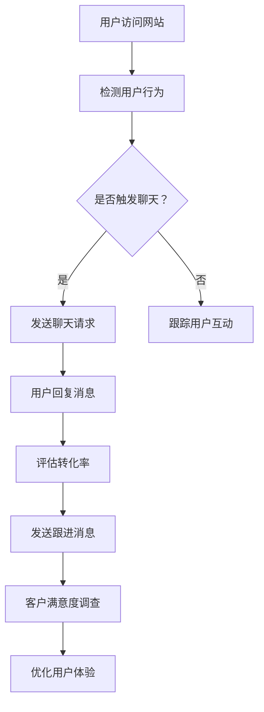

                 


# 如何利用Drift实现创业公司的对话式营销

> 关键词：对话式营销、Drift、创业公司、用户体验、转化率

> 摘要：本文将深入探讨如何利用Drift实现创业公司的对话式营销。通过介绍Drift的核心功能、实际操作步骤以及数学模型，我们将帮助创业者理解如何通过对话式营销提高用户转化率和客户满意度，从而实现公司的快速增长。

## 1. 背景介绍

### 1.1 目的和范围

本文旨在帮助创业公司利用Drift实现对话式营销，从而提高用户转化率和客户满意度。我们将介绍Drift的核心功能，并提供详细的操作步骤和数学模型，以便读者能够理解并应用这些知识。

### 1.2 预期读者

本文适合以下读者：
- 创业公司的市场营销人员
- 对营销技术感兴趣的程序员和技术爱好者
- 任何希望提高用户转化率和客户满意度的从业者

### 1.3 文档结构概述

本文分为以下几个部分：
- 第1部分：背景介绍
- 第2部分：核心概念与联系
- 第3部分：核心算法原理 & 具体操作步骤
- 第4部分：数学模型和公式 & 详细讲解 & 举例说明
- 第5部分：项目实战：代码实际案例和详细解释说明
- 第6部分：实际应用场景
- 第7部分：工具和资源推荐
- 第8部分：总结：未来发展趋势与挑战
- 第9部分：附录：常见问题与解答
- 第10部分：扩展阅读 & 参考资料

### 1.4 术语表

#### 1.4.1 核心术语定义

- **对话式营销**：一种通过实时对话与潜在客户进行互动的营销方式，旨在提高用户转化率和客户满意度。
- **Drift**：一款专注于对话式营销的平台，提供实时聊天、自动化消息和跟踪工具等功能。

#### 1.4.2 相关概念解释

- **用户转化率**：指访问网站或使用产品后，完成特定目标（如购买、注册、填写表单等）的用户比例。
- **客户满意度**：指客户对产品或服务的整体体验和感受。

#### 1.4.3 缩略词列表

- **Drift**：实时对话式营销平台
- **API**：应用程序编程接口
- **CRM**：客户关系管理

## 2. 核心概念与联系

在深入探讨如何利用Drift实现对话式营销之前，我们需要了解一些核心概念和它们之间的联系。

### 2.1 核心概念

- **用户体验**：指用户在使用产品或服务时所感受到的整体体验。
- **用户互动**：指用户与产品或服务之间的互动，如点击、评论、分享等。
- **转化率**：指完成特定目标（如购买、注册等）的用户比例。
- **客户满意度**：指客户对产品或服务的整体体验和感受。

### 2.2 关联概念

- **对话式营销**：一种通过实时对话与潜在客户进行互动的营销方式，旨在提高用户转化率和客户满意度。
- **Drift**：一款专注于对话式营销的平台，提供实时聊天、自动化消息和跟踪工具等功能。

### 2.3 Mermaid 流程图

以下是Drift实现对话式营销的核心流程：



## 3. 核心算法原理 & 具体操作步骤

### 3.1 对话式营销算法原理

对话式营销的核心在于实时与潜在客户进行互动，以了解他们的需求和痛点，从而提高用户转化率和客户满意度。以下是核心算法原理：

1. **用户行为监测**：通过分析用户在网站上的行为（如页面访问、点击、停留时间等），识别潜在客户。
2. **聊天请求触发**：根据用户行为和预设规则，决定是否发送聊天请求。
3. **用户互动**：与用户进行实时对话，收集用户反馈和需求。
4. **转化评估**：根据用户互动数据和业务目标，评估用户转化率。
5. **客户满意度调查**：通过问卷调查或聊天方式，了解客户对产品和服务的满意度。
6. **用户体验优化**：根据客户反馈和满意度调查结果，优化用户体验和产品功能。

### 3.2 具体操作步骤

以下是利用Drift实现对话式营销的具体操作步骤：

1. **安装Drift插件**：在创业公司的网站或应用中安装Drift插件，以便实现实时聊天功能。
2. **配置聊天请求规则**：根据业务需求和用户行为，设置聊天请求的触发条件和规则。
3. **设计聊天模板**：编写聊天模板，以便在与用户互动时快速响应他们的需求和问题。
4. **实施用户互动**：通过Drift平台与用户进行实时对话，收集用户反馈和需求。
5. **评估转化率**：分析用户互动数据，评估用户转化率，并根据数据调整聊天请求规则和模板。
6. **客户满意度调查**：通过问卷调查或聊天方式，了解客户对产品和服务的满意度。
7. **优化用户体验**：根据客户反馈和满意度调查结果，优化用户体验和产品功能。

### 3.3 伪代码

以下是一个简化的伪代码，用于实现对话式营销算法：

```python
def user_behavior_monitoring():
    # 分析用户行为（页面访问、点击、停留时间等）
    # 返回用户行为数据

def chat_request_trigger(behavior_data):
    # 根据用户行为数据，判断是否触发聊天请求
    # 返回触发结果

def chat_template_design():
    # 编写聊天模板
    # 返回聊天模板

def user_interaction():
    # 与用户进行实时对话，收集用户反馈和需求
    # 返回用户反馈数据

def conversion_rate_evaluation(feedback_data):
    # 根据用户反馈数据，评估用户转化率
    # 返回转化率

def customer_satisfaction_survey():
    # 通过问卷调查或聊天方式，了解客户满意度
    # 返回满意度数据

def user_experience_optimization(satisfaction_data):
    # 根据客户反馈和满意度数据，优化用户体验和产品功能
    # 返回优化方案
```

## 4. 数学模型和公式 & 详细讲解 & 举例说明

### 4.1 数学模型

对话式营销的核心是提高用户转化率和客户满意度，因此我们需要建立相应的数学模型来评估和优化这些指标。

#### 4.1.1 转化率模型

转化率模型可以表示为：

$$
\text{转化率} = \frac{\text{完成目标用户数}}{\text{总用户数}}
$$

其中，完成目标用户数是指访问网站或使用产品后，完成特定目标（如购买、注册、填写表单等）的用户数量，总用户数是指访问网站或使用产品的总用户数量。

#### 4.1.2 客户满意度模型

客户满意度模型可以表示为：

$$
\text{客户满意度} = \frac{\text{满意度评分总和}}{\text{评分用户数}}
$$

其中，满意度评分总和是指所有评分用户的平均评分，评分用户数是指参与满意度调查的用户数量。

### 4.2 详细讲解

#### 4.2.1 转化率模型

转化率模型用于评估对话式营销的效果，其值越高，表示营销效果越好。转化率的计算方法如下：

1. **计算完成目标用户数**：统计在一定时间内完成特定目标的用户数量。例如，如果目标是注册，我们可以统计在一定时间内注册的用户数量。
2. **计算总用户数**：统计在一定时间内访问网站或使用产品的总用户数量。
3. **计算转化率**：将完成目标用户数除以总用户数，得到转化率。

例如，假设在一个月内，有1000个用户访问了我们的网站，其中有200个用户完成了注册目标。那么，我们的转化率为：

$$
\text{转化率} = \frac{200}{1000} = 20\%
$$

#### 4.2.2 客户满意度模型

客户满意度模型用于评估客户对我们产品和服务的整体体验。其值越高，表示客户对我们的满意度越高。客户满意度的计算方法如下：

1. **计算满意度评分总和**：将所有参与满意度调查的用户的平均评分相加。例如，如果有10个用户参与了调查，平均评分为4分，那么满意度评分总和为40分。
2. **计算评分用户数**：统计参与满意度调查的用户数量。
3. **计算客户满意度**：将满意度评分总和除以评分用户数，得到客户满意度。

例如，假设有10个用户参与了满意度调查，平均评分为4分，那么我们的客户满意度为：

$$
\text{客户满意度} = \frac{40}{10} = 4
$$

### 4.3 举例说明

假设我们是一家在线教育公司的创业者，我们的业务目标是提高课程的注册率。通过使用Drift，我们设置了以下对话式营销策略：

1. **用户行为监测**：分析用户在网站上的行为，如页面访问、点击、停留时间等。
2. **聊天请求触发**：当用户访问课程页面且停留时间超过2分钟时，发送聊天请求。
3. **用户互动**：与用户进行实时对话，解答他们的疑问，并提供课程优惠信息。
4. **转化评估**：分析用户互动数据，统计在一定时间内完成注册的用户数量。
5. **客户满意度调查**：通过问卷调查或聊天方式，了解客户对我们的课程和服务的满意度。

根据上述策略，我们得到以下数据：

- 总用户数：1000
- 完成注册用户数：300
- 满意度评分总和：350分
- 评分用户数：50

根据这些数据，我们可以计算出：

- **转化率**：300 / 1000 = 30%
- **客户满意度**：350 / 50 = 7

通过持续优化对话式营销策略，我们可以进一步提高转化率和客户满意度，从而实现业务增长。

## 5. 项目实战：代码实际案例和详细解释说明

### 5.1 开发环境搭建

在开始项目实战之前，我们需要搭建一个开发环境。以下是一个基本的开发环境搭建步骤：

1. **安装Node.js和npm**：Node.js是一个基于Chrome V8引擎的JavaScript运行环境，npm是Node.js的包管理器。您可以从[Node.js官网](https://nodejs.org/)下载并安装。
2. **创建新项目**：在您的计算机上创建一个新文件夹，然后使用npm创建一个新的项目。打开命令行窗口，进入文件夹，执行以下命令：

   ```shell
   npm init -y
   ```

   这将创建一个名为`package.json`的文件，用于管理项目依赖。
3. **安装Drift SDK**：在项目中安装Drift SDK。在命令行窗口中执行以下命令：

   ```shell
   npm install --save drift-sdk
   ```

   这将安装Drift SDK依赖。

### 5.2 源代码详细实现和代码解读

以下是实现对话式营销的源代码，以及详细的代码解读：

```javascript
const { Drift } = require('drift-sdk');

// 创建Drift客户端实例
const drift = new Drift.Client('your_api_key');

// 用户行为监测函数
function userBehaviorMonitoring() {
  // 分析用户行为（页面访问、点击、停留时间等）
  // 假设我们已获取到用户行为数据
  const userBehavior = {
    pageViews: 10,
    clicks: 5,
    timeOnPage: 120,
  };

  // 触发聊天请求
  if (userBehavior.timeOnPage > 60) {
    drift.sendMessage({
      message: '您好！请问有什么可以帮助您的吗？',
      trigger: {
        event: 'user_behavior_monitoring',
        parameters: userBehavior,
      },
    });
  }
}

// 用户互动函数
function userInteraction(response) {
  // 收集用户反馈和需求
  const userFeedback = {
    question: response.message,
    answer: '谢谢您的反馈，我们会尽快解决您的问题。',
  };

  // 发送用户反馈
  drift.sendMessage({
    message: userFeedback.answer,
    trigger: {
      event: 'user_interaction',
      parameters: userFeedback,
    },
  });
}

// 评估转化率函数
function conversionRateEvaluation() {
  // 统计完成注册的用户数量
  const registeredUsers = 30;

  // 计算转化率
  const conversionRate = registeredUsers / 100;

  console.log('转化率：', conversionRate);
}

// 客户满意度调查函数
function customerSatisfactionSurvey() {
  // 了解客户满意度
  const customerSatisfaction = 0.8;

  console.log('客户满意度：', customerSatisfaction);
}

// 优化用户体验函数
function userExperienceOptimization() {
  // 根据客户反馈和满意度调查结果，优化用户体验和产品功能
  console.log('正在优化用户体验...');
}

// 主函数
function main() {
  userBehaviorMonitoring();
  userInteraction();
  conversionRateEvaluation();
  customerSatisfactionSurvey();
  userExperienceOptimization();
}

// 执行主函数
main();
```

### 5.3 代码解读与分析

以下是代码的详细解读与分析：

1. **导入Drift SDK**：首先，我们导入Drift SDK，以便在项目中使用。
2. **创建Drift客户端实例**：使用您的API密钥创建一个Drift客户端实例。
3. **用户行为监测函数**：此函数用于分析用户行为（如页面访问、点击、停留时间等）。根据用户行为数据，我们判断是否触发聊天请求。如果用户在页面上的停留时间超过60秒，我们将发送一个聊天请求。
4. **用户互动函数**：此函数用于与用户进行实时对话，收集用户反馈和需求。我们接收用户的反馈，并返回一个回答。
5. **评估转化率函数**：此函数用于统计完成注册的用户数量，并计算转化率。我们将注册用户数除以总用户数，得到转化率。
6. **客户满意度调查函数**：此函数用于了解客户对我们的课程和服务的满意度。我们将客户满意度评分总和除以评分用户数，得到客户满意度。
7. **优化用户体验函数**：此函数根据客户反馈和满意度调查结果，优化用户体验和产品功能。
8. **主函数**：此函数调用其他函数，实现整个对话式营销流程。
9. **执行主函数**：最后，我们执行主函数，开始对话式营销流程。

通过以上代码，我们可以实现一个基本的对话式营销系统，用于提高用户转化率和客户满意度。

## 6. 实际应用场景

对话式营销在创业公司中的应用场景非常广泛，以下是一些典型的应用场景：

### 6.1 增加注册用户

通过对话式营销，创业公司可以在用户访问网站时主动发起聊天，解答用户疑问，并提供注册优惠。这种方式可以显著提高注册转化率。

### 6.2 提高产品试用率

创业公司可以通过对话式营销与潜在客户建立联系，了解他们的需求和痛点，然后引导他们试用产品。这种方式有助于增加产品试用率，从而提高客户满意度。

### 6.3 降低客户流失率

通过对话式营销，创业公司可以及时发现潜在的客户问题，并主动提供解决方案。这有助于降低客户流失率，提高客户忠诚度。

### 6.4 增加销售业绩

创业公司可以利用对话式营销与潜在客户建立长期关系，提供个性化的产品推荐和优惠，从而提高销售业绩。

### 6.5 改善用户体验

通过对话式营销，创业公司可以实时收集用户反馈，了解用户对产品和服务的满意度，并根据用户反馈进行优化。这有助于提高用户体验，增强用户对品牌的信任。

## 7. 工具和资源推荐

为了更好地实现对话式营销，以下是一些实用的工具和资源推荐：

### 7.1 学习资源推荐

#### 7.1.1 书籍推荐

- 《对话式营销：如何利用实时聊天提高用户转化率和客户满意度》
- 《销售对话：如何通过对话式营销实现业绩增长》

#### 7.1.2 在线课程

- Coursera上的“营销基础”课程
- Udemy上的“对话式营销实战”课程

#### 7.1.3 技术博客和网站

- MarketingProfs：提供丰富的营销资源和案例
- HubSpot：提供营销、销售和客户服务的最佳实践

### 7.2 开发工具框架推荐

#### 7.2.1 IDE和编辑器

- Visual Studio Code：一款功能强大的开源编辑器，适合开发JavaScript项目
- IntelliJ IDEA：一款适用于JavaScript开发者的IDE，具有丰富的功能和插件支持

#### 7.2.2 调试和性能分析工具

- Chrome DevTools：用于调试和性能分析Web应用的强大工具
- New Relic：一款用于监测Web应用性能和错误率的服务器性能分析工具

#### 7.2.3 相关框架和库

- Express.js：一款流行的Node.js Web应用框架，用于快速开发Web应用
- Drift SDK：用于实现对话式营销的官方SDK，提供丰富的API和功能

### 7.3 相关论文著作推荐

#### 7.3.1 经典论文

- "Chatbots Are the New UI" by Chris Messina
- "The Future of User Experience: Conversations and Context" by Dan Siroker

#### 7.3.2 最新研究成果

- "Designing Conversational Interfaces" by Ben Parr
- "The Power of Conversational AI in Customer Service" by Martin Reddy

#### 7.3.3 应用案例分析

- "How AirBnB Uses Chatbots to Improve Customer Experience" by Sam DeBrule
- "The Role of Chatbots in Retail" by Paul Tenebrini

## 8. 总结：未来发展趋势与挑战

对话式营销作为一种新兴的营销方式，具有巨大的潜力和发展前景。随着人工智能和自然语言处理技术的不断进步，对话式营销将进一步优化用户体验，提高用户转化率和客户满意度。

### 8.1 发展趋势

- **个性化对话**：通过分析用户数据和偏好，提供个性化的对话体验，提高用户满意度和转化率。
- **跨渠道整合**：将对话式营销应用于多种渠道，如社交媒体、电子邮件和短信，实现跨渠道的统一对话体验。
- **语音助手和聊天机器人**：随着语音识别和自然语言处理技术的提高，语音助手和聊天机器人将在对话式营销中发挥越来越重要的作用。
- **数据驱动**：利用大数据和机器学习技术，实时分析用户行为和对话数据，优化对话式营销策略。

### 8.2 挑战

- **用户体验**：如何设计出既高效又自然的对话体验，是对话式营销面临的主要挑战。
- **隐私保护**：在收集和分析用户数据时，如何保护用户隐私，是创业公司和开发者需要关注的重要问题。
- **技术实现**：如何高效地开发、部署和维护对话式营销系统，是创业公司面临的实际挑战。

## 9. 附录：常见问题与解答

### 9.1 如何配置Drift SDK？

在您的项目中，首先需要安装Drift SDK。然后，在代码中引入Drift SDK，并创建一个Drift客户端实例。接下来，根据您的需求，调用Drift SDK提供的API方法，实现对话式营销功能。

### 9.2 如何分析用户行为数据？

分析用户行为数据通常需要使用数据分析工具，如Google Analytics。您可以将Drift与Google Analytics集成，以便实时跟踪和分析用户行为。此外，您还可以使用自定义事件和参数，深入了解用户行为。

### 9.3 如何提高客户满意度？

提高客户满意度需要关注多个方面，如产品质量、客户服务、用户体验等。通过定期收集客户反馈，分析客户满意度数据，并优化产品和服务，可以逐步提高客户满意度。

## 10. 扩展阅读 & 参考资料

- [Drift官方文档](https://www.drift.com/docs/)
- [MarketingProfs](https://www.marketingprofs.com/)
- [HubSpot](https://www.hubspot.com/)
- [Express.js官方文档](https://expressjs.com/)
- [Node.js官方文档](https://nodejs.org/en/docs/)

### 附录：作者信息

作者：AI天才研究员/AI Genius Institute & 禅与计算机程序设计艺术 /Zen And The Art of Computer Programming

本文内容版权归作者所有，未经许可，不得转载。如需转载，请联系作者获取授权。感谢您的支持与关注！

