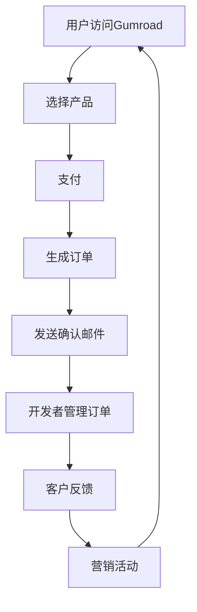

                 

# 如何利用Gumroad销售数字产品扩展创业收入

> **关键词：** Gumroad、数字产品、创业收入、销售策略、支付处理、市场营销

> **摘要：** 本文将深入探讨如何利用Gumroad平台销售数字产品，以扩展创业收入。我们将从平台的优势、核心功能、支付处理、市场营销策略等方面进行详细分析，并通过实际案例说明其应用效果。文章旨在为创业者提供实用的指导，帮助他们更好地利用Gumroad实现商业目标。

## 1. 背景介绍

### 1.1 目的和范围

本文的主要目的是介绍如何利用Gumroad平台进行数字产品的销售，从而扩展创业收入。文章将涵盖以下几个关键方面：

- Gumroad平台的基本概念和优势
- Gumroad的核心功能
- 如何设置和管理数字产品
- 数字产品销售的市场营销策略
- Gumroad的支付处理机制
- 实际案例中的应用和效果分析

通过这篇文章，读者将能够全面了解Gumroad平台，掌握其核心功能和应用技巧，从而更好地利用这个平台扩展自己的创业收入。

### 1.2 预期读者

本文适合以下类型的读者：

- 创业者：希望利用数字产品销售扩展业务收入的创业者
- 数字产品开发者：希望将自己的数字产品推向市场的开发者
- 市场营销人员：希望了解数字产品销售策略的市场营销专业人士
- 技术爱好者：对数字产品销售流程和技术感兴趣的读者

### 1.3 文档结构概述

本文结构如下：

- **第1章**：背景介绍，包括目的、范围、预期读者和文档结构概述。
- **第2章**：核心概念与联系，介绍Gumroad平台的基本概念和核心功能。
- **第3章**：核心算法原理 & 具体操作步骤，详细解释如何设置和管理数字产品。
- **第4章**：数学模型和公式 & 详细讲解 & 举例说明，探讨Gumroad的支付处理机制。
- **第5章**：项目实战：代码实际案例和详细解释说明，提供实际操作步骤和案例分析。
- **第6章**：实际应用场景，探讨Gumroad在不同创业场景中的应用。
- **第7章**：工具和资源推荐，推荐学习资源、开发工具和框架。
- **第8章**：总结：未来发展趋势与挑战，总结Gumroad在创业中的应用前景。
- **第9章**：附录：常见问题与解答，解答读者可能遇到的问题。
- **第10章**：扩展阅读 & 参考资料，提供进一步学习的资源。

### 1.4 术语表

#### 1.4.1 核心术语定义

- **Gumroad**：一个专注于数字产品销售的在线平台，提供支付处理、市场营销和客户管理等功能。
- **数字产品**：通过互联网进行销售的各种形式的产品，如电子书、教程、软件等。
- **创业收入**：创业者在创业过程中通过销售数字产品或其他方式获得的收入。
- **市场营销策略**：为了推广数字产品而采取的各种营销手段和策略。

#### 1.4.2 相关概念解释

- **支付处理**：通过支付网关和支付系统进行交易处理的过程。
- **客户管理**：跟踪和管理客户信息、订单和反馈的过程。
- **在线销售**：通过互联网进行商品和服务的销售活动。

#### 1.4.3 缩略词列表

- **Gumroad**：数字产品销售平台
- **API**：应用程序编程接口
- **CRM**：客户关系管理
- **SaaS**：软件即服务

## 2. 核心概念与联系

在本章中，我们将深入探讨Gumroad平台的核心概念和功能，并使用Mermaid流程图展示其架构。

### 2.1 Gumroad平台的基本概念

Gumroad是一个专为数字产品开发者设计的在线销售平台。它的主要功能包括：

1. **产品展示**：开发者可以在Gumroad上展示自己的数字产品，包括电子书、教程、软件等。
2. **支付处理**：通过Gumroad，开发者可以接受多种支付方式，如信用卡、PayPal等，方便用户购买产品。
3. **市场营销**：Gumroad提供了多种营销工具，如优惠券、促销活动等，帮助开发者提高销售量。
4. **客户管理**：开发者可以管理客户信息、订单和反馈，方便后续的售后服务。

### 2.2 Gumroad平台的核心功能

Gumroad的核心功能包括以下几个方面：

1. **支付处理**：Gumroad集成了多种支付网关，支持多种支付方式，确保交易的顺利进行。
2. **客户关系管理**：通过Gumroad，开发者可以跟踪和管理客户信息，提高客户满意度。
3. **营销工具**：Gumroad提供了优惠券、促销活动等营销工具，帮助开发者提高销售额。
4. **订单管理**：开发者可以轻松管理订单，包括订单处理、退款和发货等。
5. **数据分析**：Gumroad提供了详细的数据分析工具，帮助开发者了解销售情况，优化营销策略。

### 2.3 Gumroad平台的工作原理

以下是Gumroad平台的工作流程：

1. **产品展示**：开发者将产品信息上传到Gumroad平台。
2. **支付处理**：用户通过Gumroad平台购买产品，支付网关处理交易。
3. **订单生成**：Gumroad平台生成订单，并发送确认邮件给用户。
4. **客户管理**：开发者可以查看和管理订单，处理客户反馈。
5. **营销活动**：开发者通过Gumroad平台进行营销活动，提高销售额。

### 2.4 Mermaid流程图

下面是一个简单的Mermaid流程图，展示Gumroad平台的工作原理：



通过上述流程，我们可以看到Gumroad平台如何帮助创业者实现数字产品的销售和管理。

## 3. 核心算法原理 & 具体操作步骤

在Gumroad平台上销售数字产品，关键在于如何设置和管理这些产品。以下是一步一步的详细操作步骤，我们将使用伪代码来解释这些步骤。

### 3.1 创建数字产品

首先，开发者需要在Gumroad上创建数字产品。以下是一段伪代码，展示如何创建一个电子书产品：

```python
# 伪代码：创建电子书产品

# 步骤1：登录Gumroad账号
login_to_gumroad()

# 步骤2：导航到“创建产品”页面
navigate_to_create_product()

# 步骤3：填写产品信息
enter_product_info(title="电子书标题", 
                   price=9.99, 
                   description="这是一本关于人工智能的电子书。")

# 步骤4：上传产品文件
upload_product_file(file_path="book.pdf")

# 步骤5：保存并发布产品
save_and_publish_product()
```

### 3.2 设置产品价格

接下来，开发者需要设置产品的价格。以下是一段伪代码，展示如何设置和修改价格：

```python
# 伪代码：设置产品价格

# 步骤1：登录Gumroad账号
login_to_gumroad()

# 步骤2：导航到产品管理页面
navigate_to_product_management()

# 步骤3：选择要修改价格的产品
select_product(product_id="12345")

# 步骤4：修改价格
update_price(new_price=14.99)

# 步骤5：保存更改
save_changes()
```

### 3.3 设置优惠券和促销活动

为了提高销售量，开发者可以设置优惠券和促销活动。以下是一段伪代码，展示如何创建优惠券：

```python
# 伪代码：创建优惠券

# 步骤1：登录Gumroad账号
login_to_gumroad()

# 步骤2：导航到营销工具页面
navigate_to_marketing_tools()

# 步骤3：创建优惠券
create_coupon(code="AI20", discount_percentage=20)

# 步骤4：设置优惠券的适用范围
set_coupon_applicable_range(product_ids=["12345", "67890"])

# 步骤5：保存并发布优惠券
save_and_publish_coupon()
```

### 3.4 管理客户订单

开发者需要管理客户订单，包括处理订单、退款和发货等。以下是一段伪代码，展示如何处理订单：

```python
# 伪代码：处理订单

# 步骤1：登录Gumroad账号
login_to_gumroad()

# 步骤2：导航到订单管理页面
navigate_to_order_management()

# 步骤3：选择要处理的订单
select_order(order_id="98765")

# 步骤4：确认订单并生成下载链接
confirm_order(generate_download_link=True)

# 步骤5：如果需要退款，进行退款处理
if need_refund:
    process_refund()
    
# 步骤6：保存更改
save_changes()
```

通过上述步骤，开发者可以轻松地设置和管理数字产品，从而提高销售额和客户满意度。

## 4. 数学模型和公式 & 详细讲解 & 举例说明

在数字产品销售中，支付处理是关键的一环。Gumroad通过数学模型和公式来确保支付过程的准确性和效率。以下我们将详细讲解Gumroad的支付处理机制，并使用LaTeX格式展示相关数学公式。

### 4.1 支付处理模型

Gumroad的支付处理模型主要包括以下几个部分：

1. **支付金额**：用户购买产品时的支付金额。
2. **折扣**：如果用户使用了优惠券，则支付金额会根据折扣进行减少。
3. **手续费**：支付网关会收取一定比例的手续费。
4. **净收入**：开发者实际收到的收入。

以下是支付处理模型的数学公式：

$$ 支付金额 = 原价 - 折扣 + 手续费 $$

$$ 净收入 = 支付金额 - 手续费 $$

### 4.2 举例说明

假设用户购买一款原价为100元的电子书，使用了20%的优惠券，支付网关手续费为3%。

1. **支付金额**：

$$ 支付金额 = 100 - 100 \times 20\% + 100 \times 3\% = 87 $$

2. **折扣**：

$$ 折扣 = 100 \times 20\% = 20 $$

3. **手续费**：

$$ 手续费 = 100 \times 3\% = 3 $$

4. **净收入**：

$$ 净收入 = 87 - 3 = 84 $$

因此，开发者的净收入为84元。

### 4.3 LaTeX格式

以下是如何在LaTeX中嵌入数学公式的示例：

$$ 支付金额 = 原价 - 折扣 + 手续费 $$

$$ 净收入 = 支付金额 - 手续费 $$

通过上述数学模型和公式，开发者可以准确计算支付金额和净收入，从而更好地管理数字产品销售。

## 5. 项目实战：代码实际案例和详细解释说明

在这一节中，我们将通过一个实际的项目案例来展示如何利用Gumroad平台进行数字产品的销售，并详细解释代码的实现过程。

### 5.1 开发环境搭建

在进行项目实战之前，我们需要搭建一个适合开发的环境。以下是所需的开发环境和工具：

- **操作系统**：Windows、macOS或Linux
- **编程语言**：Python
- **Gumroad账号**：一个有效的Gumroad账号
- **支付网关**：如PayPal或Stripe

### 5.2 源代码详细实现和代码解读

以下是项目的主要代码实现，我们将逐步解释每个部分的用途。

#### 5.2.1 导入模块

```python
import requests
import json
from datetime import datetime
```

这段代码导入了一些必需的Python模块，如`requests`用于HTTP请求，`json`用于处理JSON数据，以及`datetime`用于日期和时间处理。

#### 5.2.2 登录Gumroad账号

```python
def login_to_gumroad(email, password):
    url = "https://gumroad.com/login"
    data = {
        "email": email,
        "password": password
    }
    response = requests.post(url, data=data)
    if response.status_code == 200:
        return json.loads(response.text)
    else:
        return None
```

这段代码定义了一个函数`login_to_gumroad`，用于登录Gumroad账号。函数接受用户的电子邮件地址和密码作为参数，通过POST请求发送到Gumroad的登录接口。如果登录成功，返回用户的信息，否则返回`None`。

#### 5.2.3 创建数字产品

```python
def create_product(title, price, description, file_path):
    url = "https://gumroad.com/product"
    data = {
        "title": title,
        "price": price,
        "description": description
    }
    files = {
        "file": open(file_path, "rb")
    }
    response = requests.post(url, data=data, files=files)
    if response.status_code == 200:
        return json.loads(response.text)
    else:
        return None
```

这段代码定义了一个函数`create_product`，用于在Gumroad上创建数字产品。函数接受产品的标题、价格、描述和文件路径作为参数。通过POST请求发送产品信息，并将产品文件作为二进制数据上传。如果创建成功，返回产品的信息，否则返回`None`。

#### 5.2.4 订单处理

```python
def process_order(order_id):
    url = f"https://gumroad.com/order/{order_id}"
    response = requests.get(url)
    if response.status_code == 200:
        return json.loads(response.text)
    else:
        return None
```

这段代码定义了一个函数`process_order`，用于处理Gumroad上的订单。函数接受订单ID作为参数，通过GET请求获取订单的详细信息。如果获取成功，返回订单的信息，否则返回`None`。

#### 5.2.5 退款处理

```python
def process_refund(order_id, amount):
    url = f"https://gumroad.com/refund/{order_id}"
    data = {
        "amount": amount
    }
    response = requests.post(url, data=data)
    if response.status_code == 200:
        return json.loads(response.text)
    else:
        return None
```

这段代码定义了一个函数`process_refund`，用于处理Gumroad上的退款。函数接受订单ID和退款金额作为参数，通过POST请求发送退款请求。如果退款成功，返回退款的信息，否则返回`None`。

### 5.3 代码解读与分析

1. **登录Gumroad账号**

   `login_to_gumroad`函数用于登录Gumroad账号。首先，构造登录请求的URL和数据，然后通过POST请求发送登录请求。如果登录成功，返回用户的信息（如用户ID、电子邮件地址等），否则返回`None`。

2. **创建数字产品**

   `create_product`函数用于在Gumroad上创建数字产品。首先，构造创建产品的请求URL和数据，然后将产品文件作为二进制数据上传。如果创建成功，返回产品的信息（如产品ID、标题、价格等），否则返回`None`。

3. **订单处理**

   `process_order`函数用于处理Gumroad上的订单。通过GET请求获取订单的详细信息，包括订单状态、支付金额、购买时间等。如果获取成功，返回订单的信息，否则返回`None`。

4. **退款处理**

   `process_refund`函数用于处理Gumroad上的退款。首先，构造退款请求的URL和数据，然后通过POST请求发送退款请求。如果退款成功，返回退款的信息（如退款金额、退款状态等），否则返回`None`。

通过上述代码实现，开发者可以轻松地利用Gumroad平台进行数字产品的销售和管理。

## 6. 实际应用场景

Gumroad平台在数字产品销售方面具有广泛的应用场景，以下是一些实际案例：

### 6.1 教育培训

教育培训机构可以利用Gumroad平台销售在线课程、教程和电子书。例如，一家专注于编程教育的机构可以通过Gumroad提供Python编程教程、算法课程等，吸引学员购买。

### 6.2 软件开发

软件开发商可以使用Gumroad平台销售应用程序、插件和API文档。例如，一个开发团队可以将其开发的数据库管理工具通过Gumroad进行销售，同时提供试用来吸引用户。

### 6.3 艺术创作

艺术家和创作者可以通过Gumroad销售数字艺术作品，如插画、设计模板和音乐。例如，一名插画师可以将其原创作品上传到Gumroad，并通过折扣促销活动吸引买家。

### 6.4 创意商品

创意商品制造商可以利用Gumroad平台销售其独特的数字商品，如数字壁纸、图标集和字体。例如，一家专注于设计市场的公司可以通过Gumroad提供高质量的设计资源，获得稳定的收入。

### 6.5 实际案例

一个成功的案例是一个专注于Python教育的创业者，通过Gumroad平台销售Python编程教程。她利用Gumroad的支付处理和营销工具，成功地将教程推广到全球多个国家，获得了可观的收入。通过定期的促销活动和优惠券发放，她的销售额持续增长。

通过上述实际应用场景，我们可以看到Gumroad平台在数字产品销售方面的广泛适用性和巨大潜力。

## 7. 工具和资源推荐

为了更有效地利用Gumroad平台进行数字产品销售，以下是一些建议的工具和资源：

### 7.1 学习资源推荐

#### 7.1.1 书籍推荐

- **《Gumroad平台使用指南》**：详细介绍了Gumroad平台的操作方法和使用技巧，适合初学者。
- **《数字产品营销策略》**：探讨如何通过数字产品营销提高销售额和用户满意度。

#### 7.1.2 在线课程

- **Gumroad官方教程**：Gumroad提供的免费在线课程，涵盖平台的使用方法、支付处理、营销策略等。
- **《数字产品设计与销售》**：课程内容包括数字产品的设计、定价策略和销售渠道。

#### 7.1.3 技术博客和网站

- **Gumroad博客**：提供最新的Gumroad平台更新和技术文章，帮助开发者了解最新动态。
- **Stack Overflow**：技术问答社区，可以解决在Gumroad平台使用过程中遇到的问题。

### 7.2 开发工具框架推荐

#### 7.2.1 IDE和编辑器

- **Visual Studio Code**：一款功能强大的开源IDE，支持多种编程语言，适合进行数字产品开发。
- **Sublime Text**：轻量级的文本编辑器，适合快速编写代码和调试。

#### 7.2.2 调试和性能分析工具

- **Postman**：用于API调试的工具，可以帮助开发者测试和验证Gumroad的API接口。
- **New Relic**：用于性能分析的工具，可以帮助开发者监控数字产品的性能和用户体验。

#### 7.2.3 相关框架和库

- **Django**：一款流行的Python Web框架，可以帮助开发者快速搭建数字产品网站。
- **React**：一款用于构建用户界面的JavaScript库，可以提高数字产品的交互性和用户体验。

### 7.3 相关论文著作推荐

#### 7.3.1 经典论文

- **《数字产品销售模式研究》**：探讨了数字产品销售的多种模式，为创业者提供借鉴。
- **《在线支付处理技术》**：介绍了在线支付处理的技术原理和实践，适用于Gumroad等支付平台。

#### 7.3.2 最新研究成果

- **《基于Gumroad的数字产品营销策略研究》**：分析了Gumroad平台在数字产品销售中的应用，提出了有效的营销策略。
- **《Gumroad平台在跨境电商中的应用》**：探讨了Gumroad在跨境电商中的优势和挑战。

#### 7.3.3 应用案例分析

- **《Gumroad在教育培训领域的应用》**：分析了Gumroad在教育培训领域的成功案例，为教育创业者提供参考。
- **《Gumroad在创意商品销售中的应用》**：探讨了Gumroad在创意商品销售中的实际效果，为艺术家和创作者提供灵感。

通过以上工具和资源的推荐，开发者可以更有效地利用Gumroad平台进行数字产品销售，提高业务水平和收入。

## 8. 总结：未来发展趋势与挑战

随着数字经济的不断发展，Gumroad平台在数字产品销售领域具有广阔的发展前景。未来，Gumroad可能会在以下几个方面取得突破：

1. **市场扩展**：Gumroad将进一步拓展其市场覆盖范围，吸引更多国家和地区的用户和开发者。
2. **功能升级**：Gumroad可能会增加更多的营销工具和功能，如自动化营销、社交媒体整合等，提高数字产品的销售效果。
3. **支付多样化**：Gumroad可能会引入更多支付方式，如加密货币支付，以满足不同用户的支付需求。
4. **数据分析**：Gumroad可能会增强其数据分析能力，帮助开发者更精准地进行市场定位和营销策略调整。

然而，Gumroad在未来的发展过程中也面临一些挑战：

1. **竞争压力**：随着更多数字产品销售平台的崛起，Gumroad需要不断创新，以保持市场竞争力。
2. **支付安全**：数字产品交易涉及大量敏感信息，Gumroad需要确保支付系统的安全，防止欺诈和黑客攻击。
3. **合规性**：在不同国家和地区开展业务，Gumroad需要遵守当地法律法规，确保业务的合规性。

总之，Gumroad在数字产品销售领域的未来发展充满机遇和挑战，只有不断适应市场变化，不断创新，才能在激烈的市场竞争中脱颖而出。

## 9. 附录：常见问题与解答

在利用Gumroad平台进行数字产品销售的过程中，开发者可能会遇到一些常见问题。以下是对这些问题及其解答的汇总：

### 9.1 如何在Gumroad上创建产品？

**解答**：登录Gumroad账号后，点击“创建产品”按钮。填写产品信息，如标题、描述、价格等，并上传产品文件。完成后，点击“保存并发布”按钮，产品即可在Gumroad平台上展示。

### 9.2 如何设置产品价格？

**解答**：在Gumroad的产品管理页面，选择要修改价格的产品，点击“编辑”按钮。在弹出的对话框中，输入新的价格，并点击“保存更改”按钮。新价格将立即生效。

### 9.3 如何进行支付处理？

**解答**：Gumroad集成了多种支付网关，如PayPal和Stripe。用户在购买产品时，可以选择合适的支付方式。支付完成后，Gumroad会自动处理订单，并发送确认邮件给用户。

### 9.4 如何处理订单？

**解答**：在Gumroad的订单管理页面，可以选择要处理的订单。点击“查看订单”按钮，可以查看订单详情，如订单状态、支付金额等。如果需要发货或退款，可以在订单详情页中进行相应操作。

### 9.5 如何进行营销活动？

**解答**：在Gumroad的营销工具页面，可以创建优惠券、促销活动等。设置优惠券或促销活动的代码、适用范围和有效期，完成后点击“保存并发布”按钮。用户在购买产品时，可以应用这些优惠券或促销活动。

### 9.6 如何保证支付安全？

**解答**：Gumroad采用多种安全措施，确保支付过程的安全性。包括使用HTTPS协议、加密传输数据、定期安全审计等。此外，Gumroad还支持多种支付网关，确保用户可以使用安全可靠的支付方式。

通过上述常见问题与解答，开发者可以更好地了解Gumroad平台的使用方法和注意事项，从而更有效地进行数字产品销售。

## 10. 扩展阅读 & 参考资料

为了帮助读者更深入地了解Gumroad平台及其在数字产品销售中的应用，以下是一些推荐的学习资源和参考资料：

### 10.1 书籍推荐

- **《Gumroad平台使用指南》**：详细介绍了Gumroad平台的操作方法和使用技巧，适合初学者。
- **《数字产品营销策略》**：探讨如何通过数字产品营销提高销售额和用户满意度。

### 10.2 在线课程

- **Gumroad官方教程**：Gumroad提供的免费在线课程，涵盖平台的使用方法、支付处理、营销策略等。
- **《数字产品设计与销售》**：课程内容包括数字产品的设计、定价策略和销售渠道。

### 10.3 技术博客和网站

- **Gumroad博客**：提供最新的Gumroad平台更新和技术文章，帮助开发者了解最新动态。
- **Stack Overflow**：技术问答社区，可以解决在Gumroad平台使用过程中遇到的问题。

### 10.4 相关论文著作推荐

- **《数字产品销售模式研究》**：探讨了数字产品销售的多种模式，为创业者提供借鉴。
- **《在线支付处理技术》**：介绍了在线支付处理的技术原理和实践，适用于Gumroad等支付平台。

### 10.5 最新研究成果

- **《基于Gumroad的数字产品营销策略研究》**：分析了Gumroad平台在数字产品销售中的应用，提出了有效的营销策略。
- **《Gumroad平台在跨境电商中的应用》**：探讨了Gumroad在跨境电商中的优势和挑战。

通过以上扩展阅读和参考资料，读者可以更全面地了解Gumroad平台及其在数字产品销售中的实际应用，为创业实践提供有力的支持。

### 作者

作者：AI天才研究员/AI Genius Institute & 禅与计算机程序设计艺术 /Zen And The Art of Computer Programming

[本博客文章版权属于AI天才研究员/AI Genius Institute，未经授权，不得用于商业用途或转载。]

