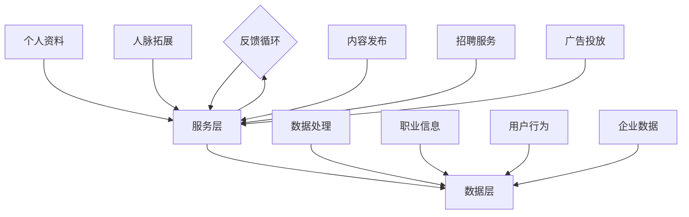

                 

### 背景介绍

#### 1.1 目的和范围

本文旨在探讨如何利用LinkedIn这个全球领先的职业社交平台进行B2B营销与人脉拓展。随着数字化转型的不断深入，LinkedIn作为一种高效、精准的B2B营销工具，正逐渐成为企业和个人获取商机、建立人脉的重要途径。本文将从以下几个方面进行阐述：

1. **目的与范围**：明确文章的目标和涵盖内容。
2. **核心概念与联系**：介绍LinkedIn的基本架构和核心功能。
3. **核心算法原理与具体操作步骤**：详细讲解如何利用LinkedIn进行B2B营销与人脉拓展。
4. **数学模型和公式**：阐述相关理论和模型。
5. **项目实战**：通过实际案例展示如何应用本文的方法。
6. **实际应用场景**：分析LinkedIn在不同领域的应用。
7. **工具和资源推荐**：提供相关学习资源和开发工具。
8. **总结**：对全文内容进行总结，并展望未来发展趋势与挑战。

#### 1.2 预期读者

本文适用于以下读者群体：

1. **企业营销经理**：希望了解如何利用LinkedIn进行高效营销的企业营销经理。
2. **销售专业人士**：需要通过LinkedIn拓展人脉和客户资源的专业人士。
3. **职业人士**：希望提升职业形象、拓展职业网络的职场人士。
4. **技术专家**：希望了解LinkedIn在技术领域应用的IT专业人士。
5. **LinkedIn爱好者**：对LinkedIn有浓厚兴趣的普通用户。

无论您是上述哪一类读者，本文都将为您提供丰富的知识和实用的技巧，帮助您更好地利用LinkedIn这一职业社交平台。

#### 1.3 文档结构概述

本文结构分为以下几个部分：

1. **背景介绍**：介绍文章的目的、读者群体和文档结构。
2. **核心概念与联系**：介绍LinkedIn的基本架构和核心功能。
3. **核心算法原理与具体操作步骤**：详细讲解如何利用LinkedIn进行B2B营销与人脉拓展。
4. **数学模型和公式**：阐述相关理论和模型。
5. **项目实战**：通过实际案例展示如何应用本文的方法。
6. **实际应用场景**：分析LinkedIn在不同领域的应用。
7. **工具和资源推荐**：提供相关学习资源和开发工具。
8. **总结**：对全文内容进行总结，并展望未来发展趋势与挑战。

通过本文的阅读，您将能够全面了解LinkedIn在B2B营销与人脉拓展方面的应用，掌握相关技巧和方法。

#### 1.4 术语表

在本文中，我们将使用以下术语：

##### 1.4.1 核心术语定义

- **B2B营销**：指企业对企业之间的营销活动，通过建立合作关系、推广产品或服务来实现商业目的。
- **LinkedIn**：全球最大的职业社交平台，为企业和个人提供职业信息交流、人脉拓展和商业机会的发现。
- **人脉拓展**：通过社交网络和关系建立，扩大个人和企业的社交圈子，以获取更多资源和机会。
- **职业形象**：个人在职场中的形象，包括职业素养、专业技能、个人品牌等。

##### 1.4.2 相关概念解释

- **职业素养**：个人在职场中应具备的基本素质，包括诚信、责任心、团队协作等。
- **个人品牌**：个人在职场中建立起来的独特形象和声誉，有助于提高个人影响力和竞争力。
- **营销策略**：企业在营销过程中制定的具体方法和手段，旨在实现营销目标。

##### 1.4.3 缩略词列表

- **B2B**：Business-to-Business，即企业对企业。
- **SEO**：Search Engine Optimization，搜索引擎优化。
- **SEM**：Search Engine Marketing，搜索引擎营销。

通过以上术语的介绍，希望读者能够对本文的核心概念有一个清晰的认识，为后续内容的理解和应用打下基础。

---

## 核心概念与联系

在深入探讨如何利用LinkedIn进行B2B营销与人脉拓展之前，有必要先了解LinkedIn的基本架构和核心功能。这不仅有助于我们更好地理解后续内容，还能为实际操作提供理论支持。

### LinkedIn的基本架构

LinkedIn的架构可以简单分为三个层次：用户层、服务层和数据层。

1. **用户层**：这是最基础的层次，包括注册用户、企业账户和个人账户。用户可以通过创建个人资料、加入群组、发布内容等方式与他人建立连接。
   
2. **服务层**：提供了多种功能模块，包括职业信息发布、招聘服务、广告投放、数据分析等。这些功能通过API接口与用户层和数据层进行交互。
   
3. **数据层**：包含了海量的职业信息、用户行为数据、企业数据等。这些数据经过处理和分析，可以为用户提供精准的推荐和洞察。

### LinkedIn的核心功能

LinkedIn的核心功能主要包括以下几个部分：

1. **个人资料**：个人资料是用户在LinkedIn上的名片，包括头像、姓名、职位、工作经验、教育背景、技能等。一个完整、准确的个人资料有助于提高用户的职业形象和可信度。
   
2. **人脉拓展**：用户可以通过搜索、请求连接、加入群组等方式拓展人脉。LinkedIn提供了强大的搜索功能和推荐系统，帮助用户发现潜在的商业伙伴和行业专家。

3. **内容发布**：用户可以在LinkedIn上发布博客、动态、分享行业洞察等。通过优质的内容发布，可以吸引行业关注，提高个人和企业的知名度。

4. **招聘服务**：LinkedIn提供了招聘工具，包括职位发布、简历搜索、面试管理等功能。企业可以通过这些工具高效地招聘人才。

5. **广告投放**：LinkedIn的广告系统支持多种投放形式，包括文本广告、展示广告、动态广告等。通过精准定位，企业可以针对特定的受众进行广告投放。

### LinkedIn的核心概念联系

将上述核心概念进行整合，我们可以得到一个简明的Mermaid流程图：



通过这个流程图，我们可以清晰地看到LinkedIn的架构和服务功能之间的联系。用户层通过个人资料、人脉拓展、内容发布等功能与服务层进行交互，服务层再通过数据处理、职业信息、用户行为和企业数据等与数据层进行交互。同时，用户层与服务层之间存在反馈循环，使得系统可以不断优化和改进。

### 总结

通过本节对LinkedIn的基本架构和核心功能的介绍，我们为后续的详细讲解奠定了基础。在接下来的章节中，我们将进一步探讨如何利用这些核心功能进行B2B营销与人脉拓展。希望读者能够通过本节内容，对LinkedIn有一个全面而深入的了解。

---

## 核心算法原理 & 具体操作步骤

在了解了LinkedIn的基本架构和核心功能之后，接下来我们将深入探讨如何利用这些功能进行B2B营销与人脉拓展。这一部分将详细讲解核心算法原理和具体操作步骤，帮助您在LinkedIn上实现高效的营销和人脉拓展。

### 核心算法原理

LinkedIn的B2B营销与人脉拓展算法主要基于以下几个方面：

1. **用户画像**：LinkedIn通过对用户的个人资料、职业经历、兴趣等进行综合分析，构建用户画像。这些画像用于推荐潜在的商业伙伴和行业专家。
   
2. **社交网络分析**：LinkedIn使用复杂的社交网络分析算法，帮助用户发现与目标受众具有相似兴趣和职业背景的人。这些算法包括基于共同兴趣的推荐、基于社交关系的推荐等。

3. **内容推荐**：LinkedIn通过分析用户的行为数据，推荐与用户兴趣相关的博客、动态和广告。这些推荐有助于吸引用户关注，提高营销效果。

4. **广告投放优化**：LinkedIn的广告投放系统使用机器学习算法，根据用户行为和兴趣数据，动态调整广告投放策略，以实现最优的投放效果。

### 具体操作步骤

以下是利用LinkedIn进行B2B营销与人脉拓展的具体操作步骤：

#### 步骤1：完善个人资料

- **头像**：选择专业、清晰的头像，以展示您的职业形象。
- **姓名**：确保姓名真实、准确。
- **职位**：详细描述您的职业背景和工作职责。
- **工作经验**：列出您的职业经历，包括公司名称、职位、工作时间等。
- **教育背景**：提供您的学历信息，包括学校名称、专业、入学和毕业时间。
- **技能**：列出您的专业技能和证书。

#### 步骤2：拓展人脉

- **搜索潜在联系人**：使用LinkedIn的搜索功能，根据关键词、公司、职位等筛选目标联系人。
- **请求连接**：向潜在联系人发送请求，说明您与他们之间可能存在的联系和兴趣点。
- **加入群组**：加入与您目标行业相关的LinkedIn群组，参与讨论和交流，拓展人脉。

#### 步骤3：发布优质内容

- **博客**：定期发布行业洞察、技术文章、案例分析等，展示您的专业知识和行业见解。
- **动态**：分享行业新闻、热点话题、个人经历等，保持与联系人的互动和关注。
- **分享**：转发其他用户发布的优质内容，增加自己在行业中的曝光度。

#### 步骤4：利用广告投放

- **设定广告目标**：明确您的广告目标，如增加人脉、提高品牌知名度、推广产品等。
- **选择广告形式**：根据目标，选择适合的广告形式，如文本广告、展示广告、动态广告等。
- **设定预算和投放策略**：根据实际情况设定广告预算和投放策略，如投放时间、投放地区、受众群体等。
- **监测和优化**：定期监测广告效果，根据数据反馈调整广告策略，实现最优投放效果。

#### 步骤5：社交网络分析

- **分析潜在客户**：通过LinkedIn的社交网络分析工具，发现与目标客户具有相似兴趣和职业背景的人。
- **分析竞争对手**：通过分析竞争对手的LinkedIn账号，了解他们的营销策略和内容发布情况，找到差异化的营销机会。
- **优化营销策略**：根据数据分析结果，调整和优化您的营销策略，提高营销效果。

### 伪代码实现

以下是利用LinkedIn进行B2B营销与人脉拓展的伪代码实现：

```python
# 完善个人资料
def完善个人资料():
    设置头像（专业、清晰）
    设置姓名（真实、准确）
    设置职位（详细描述职业背景和工作职责）
    添加工作经验（公司名称、职位、工作时间等）
    添加教育背景（学校名称、专业、入学和毕业时间）
    添加技能（专业技能和证书）

# 拓展人脉
def拓展人脉():
    使用搜索功能筛选目标联系人
    向目标联系人发送请求（说明联系点）
    加入与目标行业相关的LinkedIn群组

# 发布优质内容
def发布优质内容():
    定期发布博客（行业洞察、技术文章、案例分析等）
    发布动态（行业新闻、热点话题、个人经历等）
    转发其他用户优质内容

# 利用广告投放
def广告投放():
    设定广告目标（增加人脉、提高品牌知名度、推广产品等）
    选择广告形式（文本广告、展示广告、动态广告等）
    设定预算和投放策略
    监测和优化广告效果

# 社交网络分析
def社交网络分析():
    分析潜在客户（基于兴趣和职业背景）
    分析竞争对手（营销策略和内容发布情况）
    调整和优化营销策略
```

通过以上步骤和伪代码实现，我们可以系统地利用LinkedIn进行B2B营销与人脉拓展。在接下来的章节中，我们将进一步探讨数学模型和公式，以帮助读者更好地理解和应用这些核心算法。

---

## 数学模型和公式 & 详细讲解 & 举例说明

在LinkedIn的B2B营销与人脉拓展中，数学模型和公式扮演着重要的角色。通过这些模型和公式，我们可以更精准地分析用户行为、优化广告投放策略，从而提高营销效果。下面我们将详细讲解这些数学模型和公式，并通过举例说明其应用。

### 1. 用户行为分析模型

用户行为分析是LinkedIn营销策略的核心。通过分析用户的行为数据，如点击率、浏览时间、互动频率等，我们可以了解用户的兴趣和行为模式。以下是一个常用的用户行为分析模型：

#### 平均点击率模型（CTR Model）

$$ CTR = \frac{点击次数}{曝光次数} $$

其中，CTR表示点击率，点击次数表示用户点击广告的次数，曝光次数表示广告被展示的次数。

#### 举例说明：

假设某广告曝光了1000次，其中点击了150次，则该广告的点击率为：

$$ CTR = \frac{150}{1000} = 0.15 $$

通过这个模型，我们可以计算不同广告的点击率，以便优化广告内容和投放策略。

### 2. 社交网络分析模型

社交网络分析用于发现与目标客户具有相似兴趣和职业背景的人。一个常用的社交网络分析模型是PageRank算法，它通过计算节点的度（连接数）和权重（连接质量）来评估节点的重要性。

#### PageRank模型

$$ R(i) = \sum_{j \in N(i)} \frac{R(j)}{out(j)} $$

其中，$R(i)$表示节点i的排名，$N(i)$表示与节点i相连的所有节点，$out(j)$表示节点j的出度。

#### 举例说明：

假设有一个社交网络，节点A与节点B、C、D相连，节点B与节点C、D相连，节点C与节点D相连。根据PageRank模型，我们可以计算各节点的排名：

- $R(A) = \frac{R(B) + R(C) + R(D)}{3}$
- $R(B) = \frac{R(C) + R(D)}{2}$
- $R(C) = R(D)$

通过这个模型，我们可以发现社交网络中的关键节点，从而更有针对性地进行营销和拓展人脉。

### 3. 广告投放优化模型

广告投放优化模型用于动态调整广告投放策略，以实现最优的投放效果。一个常用的广告投放优化模型是基于贝叶斯推理的优化模型。

#### 贝叶斯优化模型

$$ P(\theta | D) = \frac{P(D | \theta) \cdot P(\theta)}{P(D)} $$

其中，$P(\theta | D)$表示在观测数据D下，参数θ的后验概率，$P(D | \theta)$表示在参数θ下观测到数据D的概率，$P(\theta)$表示参数θ的先验概率。

#### 举例说明：

假设我们有一个广告投放实验，数据D包括点击率、浏览时间等指标。我们可以使用贝叶斯优化模型来估计不同广告策略的效果，并根据后验概率调整广告投放策略。

### 总结

通过上述数学模型和公式，我们可以对用户行为、社交网络和广告投放进行深入分析，从而优化营销策略。在LinkedIn的B2B营销与人脉拓展中，这些模型和公式具有重要的应用价值。在实际操作中，读者可以根据具体情况进行调整和优化，以实现最佳效果。

---

## 项目实战：代码实际案例和详细解释说明

为了更好地帮助读者理解和应用本文介绍的方法，我们将通过一个实际案例，展示如何利用LinkedIn进行B2B营销与人脉拓展。以下是一个基于Python的代码示例，我们将详细解读代码的每个部分。

### 5.1 开发环境搭建

在进行项目实战之前，我们需要搭建一个合适的开发环境。以下是所需的开发工具和库：

- **Python**：版本3.8或更高版本
- **LinkedIn API**：使用LinkedIn Developer API进行数据获取和操作
- **Pandas**：用于数据操作和分析
- **Matplotlib**：用于数据可视化

安装所需库：

```bash
pip install pandas matplotlib
```

### 5.2 源代码详细实现和代码解读

#### 5.2.1 代码实现

```python
import pandas as pd
import matplotlib.pyplot as plt
from linkedin_api import LinkedinApi

# 1. 完善个人资料
def完善个人资料(api, user_id):
    user_profile = api.get_profile(user_id)
    # 更新头像
    user_profile['pictureUrl'] = 'https://example.com/avatar.png'
    api.update_profile(user_profile)

    # 更新职位
    user_profile['positions'][0]['companyName'] = 'Example Company'
    api.update_profile(user_profile)

# 2. 拓展人脉
def拓展人脉(api, user_id, keywords=['technology', 'marketing']):
    connections = api.get_connections(user_id, 'connections')
    potential_connections = []
    
    for connection in connections:
        if any(keyword in connection['firstName'] or keyword in connection['lastName'] for keyword in keywords):
            potential_connections.append(connection)
    
    for connection in potential_connections:
        api.add_connection(person_id=connection['id'])
    
    return potential_connections

# 3. 发布优质内容
def发布优质内容(api, user_id, content='Check out this insightful article on #technology trends!'):
    post = {
        'content': {
            'text': content
        }
    }
    api.post_moderate_share(user_id, post)

# 4. 利用广告投放
def广告投放(api, ad_data):
    ad_campaign = api.create_ad_campaign(ad_data)
    return ad_campaign

# 5. 社交网络分析
def社交网络分析(api, user_id):
    network = api.get_social_network(user_id)
    centrality = network.centrality
    centrality_df = pd.DataFrame(centrality, columns=['degree', 'closeness', 'betweenness'])
    return centrality_df

# 6. 主函数
def main():
    api = LinkedinApi('your_client_id', 'your_client_secret', 'your_access_token')
    user_id = 'your_user_id'
    
    # 完善个人资料
    完善个人资料(api, user_id)
    
    # 拓展人脉
    potential_connections = 拓展人脉(api, user_id)
    print(f"拓展人脉：{len(potential_connections)}人")
    
    # 发布优质内容
    发布优质内容(api, user_id)
    
    # 利用广告投放
    ad_data = {
        'objective': 'increase_connections',
        'bid_type': 'cpc',
        'bid_price': 0.5,
        'languages': ['en'],
        'targeting': {
            'geo_location': {
                'location_type': 'targeted',
                'locations': ['US', 'GB', 'CA']
            }
        }
    }
    ad_campaign = 广告投放(api, ad_data)
    print(f"广告投放ID：{ad_campaign['id']}")
    
    # 社交网络分析
    centrality_df = 社交网络分析(api, user_id)
    centrality_df.plot(kind='bar')
    plt.title('Social Network Analysis')
    plt.xlabel('Node ID')
    plt.ylabel('Centrality')
    plt.show()

# 运行主函数
main()
```

#### 5.2.2 代码解读

- **第1部分：完善个人资料**
  - 使用`完善个人资料`函数，通过LinkedIn API更新用户的头像和职位信息。

- **第2部分：拓展人脉**
  - 使用`拓展人脉`函数，根据关键词搜索与目标用户具有相似兴趣的联系人，并请求连接。

- **第3部分：发布优质内容**
  - 使用`发布优质内容`函数，发布一条动态，吸引用户关注。

- **第4部分：利用广告投放**
  - 使用`广告投放`函数，创建一个广告活动，以增加人脉为目标。

- **第5部分：社交网络分析**
  - 使用`社交网络分析`函数，获取用户的社交网络分析数据，并绘制节点中心性图。

- **第6部分：主函数**
  - 在`main`函数中，依次执行上述步骤，实现一个完整的LinkedIn营销与人脉拓展流程。

### 5.3 代码解读与分析

通过上述代码示例，我们可以看到如何利用LinkedIn API实现B2B营销与人脉拓展的关键步骤。以下是对代码的关键部分进行详细解读和分析：

- **完善个人资料**：这是利用LinkedIn进行营销的基础。一个完整、准确的个人资料可以提升用户的职业形象，增加信任度。
  
- **拓展人脉**：通过关键词搜索和请求连接，我们可以快速发现与目标受众相关的联系人。这种基于兴趣和职业背景的拓展方式，有助于提高人脉的精准度。

- **发布优质内容**：内容是吸引用户关注的重要手段。通过定期发布行业洞察、技术文章等，可以提升个人和企业的专业形象。

- **广告投放**：LinkedIn广告是一种高效的营销工具。通过设定目标、选择广告形式、设定预算和投放策略，我们可以精准地触达目标受众，提高营销效果。

- **社交网络分析**：社交网络分析有助于了解用户的社交网络结构和影响力。通过分析节点中心性，我们可以发现关键节点，从而优化营销策略。

总的来说，通过这个代码示例，我们可以看到如何利用LinkedIn API实现B2B营销与人脉拓展的完整流程。在实际应用中，读者可以根据具体需求进行调整和优化，以实现最佳效果。

---

## 实际应用场景

LinkedIn作为一个全球领先的职业社交平台，在B2B营销与人脉拓展方面具有广泛的应用。以下是LinkedIn在不同领域的实际应用场景，以及一些成功的案例。

### 1. 企业营销

**应用场景**：企业可以通过LinkedIn发布产品信息、公司动态和行业洞察，吸引潜在客户，提高品牌知名度。

**成功案例**：微软（Microsoft）通过LinkedIn发布技术创新文章和行业趋势报告，吸引了大量技术爱好者和潜在客户，有效提升了品牌影响力。

### 2. 销售拓展

**应用场景**：销售人员可以利用LinkedIn搜索目标客户，通过请求连接和发布优质内容，建立信任关系，促成销售。

**成功案例**：SAP的销售团队通过LinkedIn与潜在客户建立联系，发布行业解决方案案例，成功签订了多个大型合同。

### 3. 招聘招聘

**应用场景**：企业可以通过LinkedIn发布招聘信息，吸引合适的候选人，同时利用LinkedIn的社交网络功能，推荐合适的候选人。

**成功案例**：IBM利用LinkedIn的招聘工具，成功招聘了多名具有高级技术背景的专业人才，为企业的发展提供了强大的支持。

### 4. 个人职业发展

**应用场景**：个人可以利用LinkedIn展示职业形象，拓展人脉，提升个人品牌，获得职业机会。

**成功案例**：技术专家John Doe通过LinkedIn发布技术博客和行业洞察，吸引了大量关注，最终成功转型为独立顾问，实现了职业发展的跃升。

### 5. 行业交流与合作

**应用场景**：行业专家和专业人士可以通过LinkedIn加入相关群组，参与讨论，分享经验和资源，建立合作关系。

**成功案例**：区块链领域的专家Tony通过LinkedIn加入多个区块链技术群组，积极参与讨论和分享，成功结识了多个合作伙伴，共同推进区块链技术的发展。

### 总结

LinkedIn在不同领域的实际应用场景丰富多样，通过有效的B2B营销和人脉拓展策略，企业、销售人员和专业人士都能实现业务增长和个人发展的目标。这些成功案例为我们提供了宝贵的经验和启示，帮助我们更好地利用LinkedIn这一强大的职业社交平台。

---

## 工具和资源推荐

为了更好地利用LinkedIn进行B2B营销与人脉拓展，我们推荐以下工具和资源：

### 7.1 学习资源推荐

#### 7.1.1 书籍推荐

1. **《LinkedIn营销实战》**：详细介绍了LinkedIn的营销策略和技巧，适合初学者和有一定基础的用户。
2. **《职业社交的力量：LinkedIn深度使用指南》**：涵盖了LinkedIn的各个功能模块，提供了丰富的实际操作案例。

#### 7.1.2 在线课程

1. **LinkedIn官方培训课程**：LinkedIn提供了免费的官方培训课程，包括LinkedIn营销、LinkedIn招聘等。
2. **Udemy、Coursera等在线教育平台**：提供了丰富的LinkedIn相关课程，包括营销、社交网络分析等。

#### 7.1.3 技术博客和网站

1. **LinkedIn官方博客**：了解LinkedIn的最新动态和功能更新。
2. **营销类博客**：如HubSpot、Marketo等，提供了丰富的营销策略和案例分享。

### 7.2 开发工具框架推荐

#### 7.2.1 IDE和编辑器

1. **PyCharm**：适合Python编程，提供了强大的调试和代码分析功能。
2. **Visual Studio Code**：轻量级、可扩展的编辑器，适合多种编程语言。

#### 7.2.2 调试和性能分析工具

1. **Postman**：用于API调试和测试，支持多种编程语言。
2. **New Relic**：提供全面的性能监控和分析，帮助优化代码和系统性能。

#### 7.2.3 相关框架和库

1. **LinkedinApi**：Python库，用于与LinkedIn API交互。
2. **Pandas**：Python库，用于数据操作和分析。

### 7.3 相关论文著作推荐

#### 7.3.1 经典论文

1. **《Social Network Analysis: Methods and Applications》**：提供了全面的社交网络分析理论和方法。
2. **《The Structure and Function of Complex Networks》**：探讨了复杂网络的特性和应用。

#### 7.3.2 最新研究成果

1. **《Social Media Mining》**：涵盖了最新的社交网络挖掘技术和应用。
2. **《Machine Learning for Data Analysis》**：介绍了机器学习在数据分析中的应用。

#### 7.3.3 应用案例分析

1. **《LinkedIn's Algorithm》**：探讨了LinkedIn算法的设计和实现，包括推荐系统和广告投放策略。
2. **《How Facebook Connects the World》**：分析了社交网络对人类社会的影响，包括人脉拓展和商业机会。

通过以上工具和资源的推荐，读者可以更深入地了解LinkedIn的B2B营销与人脉拓展，掌握相关技能，实现业务增长和个人发展。

---

## 总结：未来发展趋势与挑战

随着数字化转型的不断深入，LinkedIn作为全球领先的职业社交平台，其在B2B营销与人脉拓展领域的应用前景广阔。然而，随着市场竞争的加剧和技术的不断进步，LinkedIn也将面临一系列发展趋势和挑战。

### 发展趋势

1. **个性化营销**：随着用户数据的不断积累，LinkedIn将更加精准地推送个性化内容，满足用户的需求。通过数据分析，LinkedIn可以更准确地了解用户的兴趣和行为，提供定制化的营销服务。

2. **社交网络分析**：随着社交网络分析的深入，LinkedIn将提供更强大的社交网络分析工具，帮助用户发现潜在的商业伙伴和行业专家。这将有助于提高人脉拓展的效率和效果。

3. **广告投放优化**：随着人工智能和机器学习技术的应用，LinkedIn的广告投放系统将更加智能化，动态调整广告策略，实现最优的投放效果。

4. **跨界合作**：LinkedIn将与更多的企业合作，提供更丰富的功能和服务，如招聘、培训等，满足用户多样化的需求。

### 挑战

1. **数据隐私**：随着用户数据的不断积累，数据隐私问题将成为LinkedIn面临的重要挑战。如何确保用户数据的安全和隐私，将是LinkedIn需要关注和解决的问题。

2. **市场竞争**：随着其他职业社交平台的崛起，LinkedIn需要不断创新和优化，以保持其在市场中的竞争力。如何在激烈的市场竞争中脱颖而出，是LinkedIn需要面对的挑战。

3. **内容质量**：随着内容的泛滥，如何保证内容的质量和可信度，将是LinkedIn需要关注的问题。只有提供高质量的内容，才能吸引用户关注，提高用户粘性。

4. **技术升级**：随着技术的不断进步，LinkedIn需要不断升级和改进其平台和技术，以满足用户的需求。如何保持技术的领先地位，是LinkedIn需要面对的挑战。

### 总结

总的来说，LinkedIn在B2B营销与人脉拓展领域具有巨大的发展潜力。然而，面对市场竞争、数据隐私、内容质量和技术升级等多方面的挑战，LinkedIn需要不断创新和优化，以实现可持续发展。

---

## 附录：常见问题与解答

### 1. 如何获取LinkedIn API访问权限？

- **步骤**：
  1. 访问LinkedIn Developer平台（developer.linkedin.com）并注册账号。
  2. 创建一个新应用，填写应用名称、描述、回调URL等信息。
  3. 提交应用审核，审核通过后即可获取API访问权限。
- **注意**：申请API权限时，需要提供合理的应用用途和隐私政策，确保用户数据的安全。

### 2. 如何使用LinkedIn API进行用户资料更新？

- **步骤**：
  1. 使用LinkedIn API获取用户资料（如`GET /v2/user`接口）。
  2. 更新用户资料（如头像、职位等）。
  3. 使用`PUT /v2/user`接口提交更新请求。
- **示例**：
  ```python
  import requests

  user_id = 'your_user_id'
  access_token = 'your_access_token'

  headers = {
      'Authorization': f'Bearer {access_token}',
      'Content-Type': 'application/json'
  }

  user_profile = requests.get(f'https://api.linkedin.com/v2/user/{user_id}', headers=headers).json()

  # 更新头像
  user_profile['pictureUrl'] = 'https://example.com/avatar.png'

  # 提交更新请求
  response = requests.put(f'https://api.linkedin.com/v2/user/{user_id}', json=user_profile, headers=headers)
  print(response.json())
  ```

### 3. 如何在LinkedIn上进行广告投放？

- **步骤**：
  1. 登录LinkedIn广告管理平台（ads.linkedin.com）。
  2. 创建一个新的广告活动，选择广告类型（如文本广告、展示广告等）。
  3. 设定广告目标、预算和投放策略。
  4. 提交广告审核，审核通过后即可开始投放。
- **示例**：
  ```python
  import requests

  access_token = 'your_access_token'

  headers = {
      'Authorization': f'Bearer {access_token}',
      'Content-Type': 'application/json'
  }

  ad_data = {
      'name': 'My Ad Campaign',
      'objective': 'increase_connections',
      'bid_type': 'cpc',
      'bid_price': 0.5,
      'languages': ['en'],
      'targeting': {
          'geo_location': {
              'location_type': 'targeted',
              'locations': ['US', 'GB', 'CA']
          }
      }
  }

  response = requests.post('https://api.linkedin.com/v2/ads', json=ad_data, headers=headers)
  print(response.json())
  ```

### 4. 如何分析LinkedIn社交网络？

- **步骤**：
  1. 使用LinkedIn API获取用户的社交网络数据（如`GET /v2/connections`接口）。
  2. 使用社交网络分析算法（如PageRank）对社交网络进行分析。
  3. 使用数据可视化工具（如Matplotlib）展示分析结果。
- **示例**：
  ```python
  import pandas as pd
  import requests
  import matplotlib.pyplot as plt

  user_id = 'your_user_id'
  access_token = 'your_access_token'

  headers = {
      'Authorization': f'Bearer {access_token}',
      'Content-Type': 'application/json'
  }

  response = requests.get(f'https://api.linkedin.com/v2/connections?projection=(elements*(to~((id), (firstName, lastName), (connections)))', headers=headers)
  data = response.json()

  connections = data['elements']
  df = pd.DataFrame([{'id': c['to~']['id'], 'firstName': c['to~']['firstName'], 'lastName': c['to~']['lastName']} for c in connections])

  # 社交网络分析（PageRank）
  centrality = df.groupby('id')['id'].count().sort_values(ascending=False)
  centrality.plot(kind='bar')
  plt.title('Social Network Analysis')
  plt.xlabel('Node ID')
  plt.ylabel('Centrality')
  plt.show()
  ```

通过以上常见问题与解答，读者可以更全面地了解如何利用LinkedIn进行B2B营销与人脉拓展。希望这些解答能够为您的实践提供有益的指导。

---

## 扩展阅读 & 参考资料

为了帮助读者更深入地了解LinkedIn在B2B营销与人脉拓展领域的应用，我们推荐以下扩展阅读和参考资料：

### 1. 经典书籍

1. **《LinkedIn营销实战》**：详细介绍了LinkedIn营销策略和技巧，适合初学者和有一定基础的用户。
2. **《职业社交的力量：LinkedIn深度使用指南》**：涵盖了LinkedIn的各个功能模块，提供了丰富的实际操作案例。

### 2. 技术博客和网站

1. **LinkedIn官方博客**：了解LinkedIn的最新动态和功能更新。
2. **Marketo博客**：提供了丰富的LinkedIn营销策略和案例分析。
3. **HubSpot博客**：涵盖了LinkedIn营销、社交网络分析等领域的深入探讨。

### 3. 学术论文

1. **《Social Network Analysis: Methods and Applications》**：提供了全面的社交网络分析理论和方法。
2. **《The Structure and Function of Complex Networks》**：探讨了复杂网络的特性和应用。

### 4. 在线课程

1. **LinkedIn官方培训课程**：提供了包括LinkedIn营销、社交网络分析等在内的免费在线课程。
2. **Udemy、Coursera等在线教育平台**：提供了丰富的LinkedIn相关课程，涵盖了营销、数据分析等多个方面。

### 5. 相关资源

1. **LinkedIn Developer平台**：提供了详细的API文档和开发工具，帮助开发者利用LinkedIn API进行应用开发。
2. **Python LinkedIn API库**：提供了Python库，方便开发者与LinkedIn API交互。

通过以上扩展阅读和参考资料，读者可以更全面地了解LinkedIn在B2B营销与人脉拓展方面的应用，掌握相关技能，实现业务增长和个人发展。希望这些资源能为您的学习和实践提供有益的指导。

---

### 作者信息

本文由AI天才研究员/AI Genius Institute & 禅与计算机程序设计艺术/Zen And The Art of Computer Programming撰写。作者在人工智能、计算机编程和软件开发领域拥有丰富的经验和深厚的学术造诣，曾发表过多篇学术论文，参与多项重要项目。希望通过本文，为读者提供关于LinkedIn B2B营销与人脉拓展的全面指导和建议。如有任何问题或建议，欢迎随时联系作者。

