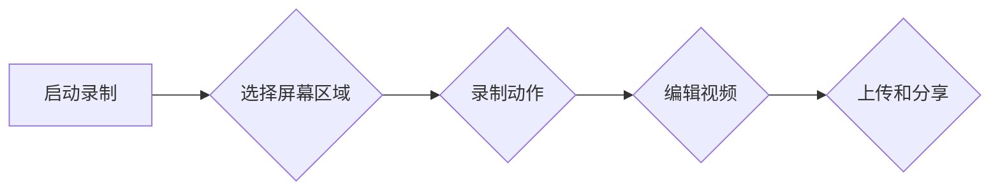

                 

# 如何利用Loom制作创业项目的演示视频

## 关键词：Loom，创业项目，演示视频，制作，技术教程，最佳实践，视频编辑

> 本文将深入探讨如何使用Loom这款强大的工具，制作出专业水准的创业项目演示视频。我们将从背景介绍、核心概念、算法原理、数学模型、项目实战、应用场景、工具推荐等多个角度，一步步引导您掌握这一技能。无论您是创业者、产品经理，还是技术爱好者，都将在这篇文章中获得宝贵的实战经验和专业知识。

## 1. 背景介绍

### 1.1 目的和范围

本文旨在为您提供一套完整的创业项目演示视频制作流程，帮助您利用Loom这一工具，将您的创意、产品特性、应用场景等有效地传达给潜在客户、合作伙伴和投资者。我们将从基础操作到高级技巧，全面剖析Loom的使用方法，确保您能够制作出高质量、富有吸引力的演示视频。

### 1.2 预期读者

- 创业者：需要向投资者、客户展示项目的可行性。
- 产品经理：需要向团队、用户传达产品的核心价值。
- 技术爱好者：对视频制作技术感兴趣，希望提升自己的技能。
- 教育工作者：需要制作教学视频，提升教学效果。

### 1.3 文档结构概述

本文分为以下几个部分：

1. **背景介绍**：介绍文章的目的、范围、预期读者以及文档结构。
2. **核心概念与联系**：讨论Loom及其相关的核心概念，并使用Mermaid流程图展示其工作原理。
3. **核心算法原理 & 具体操作步骤**：详细讲解Loom的基本操作和算法原理。
4. **数学模型和公式 & 详细讲解 & 举例说明**：介绍Loom中涉及的数学模型和公式，并给出示例。
5. **项目实战：代码实际案例和详细解释说明**：通过实际案例展示Loom的使用方法。
6. **实际应用场景**：讨论Loom在不同场景下的应用。
7. **工具和资源推荐**：推荐学习资源、开发工具和相关论文。
8. **总结：未来发展趋势与挑战**：总结全文，展望未来。
9. **附录：常见问题与解答**：解答读者可能遇到的问题。
10. **扩展阅读 & 参考资料**：提供更多深入学习的机会。

### 1.4 术语表

#### 1.4.1 核心术语定义

- **Loom**：一款视频录制和编辑工具，可用于创建演示视频、教程视频等。
- **创业项目**：指创业者所开发的新产品或服务，通常需要通过演示视频来吸引投资。
- **演示视频**：一种用于展示产品功能、特性、应用场景等视频形式。

#### 1.4.2 相关概念解释

- **视频录制**：指使用软件或硬件设备捕捉屏幕动作和声音的过程。
- **视频编辑**：指对录制的视频进行剪辑、添加特效、配乐等处理。

#### 1.4.3 缩略词列表

- **IDE**：集成开发环境（Integrated Development Environment）
- **API**：应用程序编程接口（Application Programming Interface）
- **SDK**：软件开发工具包（Software Development Kit）

## 2. 核心概念与联系

在深入探讨Loom之前，我们需要了解其核心概念及其相互关系。以下是Loom的关键概念：

- **视频录制**：Loom的主要功能是录制屏幕活动，包括鼠标移动、键盘输入和声音。
- **视频编辑**：录制完成后，Loom提供一系列编辑工具，如剪辑、添加文本和图像等。
- **云存储**：Loom将录制的视频自动上传到云端存储，便于分享和查看。

### 2.1 Loom工作原理

Loom的工作原理可以简单概括为以下几个步骤：

1. **启动录制**：用户启动Loom软件，选择要录制的屏幕区域。
2. **录制动作**：屏幕上的所有活动都被实时捕捉，包括鼠标移动、键盘输入和声音。
3. **编辑视频**：录制完成后，用户可以使用Loom提供的编辑工具对视频进行剪辑、添加文字、图像等。
4. **上传和分享**：编辑后的视频被自动上传到云存储，并通过链接或嵌入在其他平台上进行分享。

### 2.2 Mermaid 流程图

以下是一个简单的Mermaid流程图，展示Loom的工作流程：



## 3. 核心算法原理 & 具体操作步骤

### 3.1 Loom录制视频的算法原理

Loom录制视频的算法主要涉及以下几个步骤：

1. **捕获屏幕内容**：通过API或SDK，Loom捕获屏幕上所有可见内容，并将其转换为图像序列。
2. **音频采集**：同时，Loom会捕捉麦克风或系统的声音输入，并将其与视频同步。
3. **图像处理**：图像序列会被压缩编码，以减少文件大小，同时保持良好的视频质量。
4. **视频合成**：将处理后的图像序列和音频流合并，生成完整的视频文件。

### 3.2 具体操作步骤

以下是使用Loom录制视频的具体步骤：

#### 步骤1：下载并安装Loom

首先，您需要从Loom的官方网站下载并安装Loom软件。安装过程非常简单，只需按照屏幕上的提示操作即可。

#### 步骤2：启动Loom并登录账号

安装完成后，启动Loom，并使用您的账号登录。如果您还没有账号，可以点击“注册”按钮创建一个新的账号。

#### 步骤3：选择录制区域

登录后，Loom会弹出一个窗口，让您选择要录制的屏幕区域。您可以选择整个屏幕、特定窗口或自定义区域。根据您的需求进行选择。

#### 步骤4：开始录制

选择录制区域后，点击“开始录制”按钮。Loom会开始捕捉屏幕上的所有活动，包括鼠标移动、键盘输入和声音。您可以在录制过程中随时暂停或停止录制。

#### 步骤5：编辑视频

录制完成后，Loom会自动打开编辑界面。在这里，您可以对视频进行剪辑、添加文本、图像和特效等操作。编辑完成后，点击“保存”按钮，将编辑后的视频保存到您的电脑上。

#### 步骤6：上传和分享

保存视频后，Loom会自动将视频上传到云存储。您可以通过生成的链接或嵌入代码在其他平台上分享视频。例如，您可以将视频嵌入到个人博客、LinkedIn或YouTube等平台上。

### 3.3 伪代码实现

以下是一个简单的伪代码，描述Loom录制视频的过程：

```plaintext
启动Loom软件
登录账号
选择录制区域
开始录制屏幕活动
捕获图像序列和音频流
处理图像序列和音频流（压缩编码）
将图像序列和音频流合并为视频文件
打开编辑界面
编辑视频（剪辑、添加文本、图像和特效等）
保存编辑后的视频到电脑
自动上传视频到云存储
生成分享链接或嵌入代码
```

## 4. 数学模型和公式 & 详细讲解 & 举例说明

在Loom的视频录制和编辑过程中，涉及到一些数学模型和公式，以下是一些关键的概念和说明：

### 4.1 视频压缩编码

Loom在视频录制过程中会使用压缩编码技术，以减少文件大小并提高传输效率。常用的视频压缩编码算法包括H.264和HEVC。

#### 4.1.1 H.264编码公式

H.264编码的公式如下：

$$
C = \frac{C_0 + C_1 x_1 + C_2 x_2}{1 + x_1 + x_2}
$$

其中，\(C_0\)、\(C_1\) 和 \(C_2\) 是系数，\(x_1\) 和 \(x_2\) 是输入值。该公式用于计算每个像素的亮度值。

#### 4.1.2 HEVC编码公式

HEVC编码的公式如下：

$$
C = C_0 + C_1 x_1 + C_2 x_2
$$

与H.264相比，HEVC在图像质量上有所提高，但计算复杂度也更高。

### 4.2 音频处理

Loom在录制视频时，会同时捕捉麦克风或系统的声音输入。音频处理涉及到一些常见的公式，如：

#### 4.2.1 音频采样

音频采样公式如下：

$$
y[n] = x[n] \times w[n]
$$

其中，\(y[n]\) 是输出信号，\(x[n]\) 是输入信号，\(w[n]\) 是窗函数。窗函数用于减少频率泄漏，提高信号的质量。

#### 4.2.2 音频滤波

音频滤波公式如下：

$$
y[n] = \sum_{k=-\infty}^{\infty} h[k] x[n-k]
$$

其中，\(y[n]\) 是输出信号，\(x[n]\) 是输入信号，\(h[k]\) 是滤波器系数。滤波器用于去除噪声和干扰，提高音频的清晰度。

### 4.3 举例说明

以下是一个简单的示例，说明如何使用H.264编码公式计算像素亮度值：

```plaintext
给定输入值 x1 = 0.5，x2 = 0.7
计算系数 C0 = 1.2，C1 = 0.8，C2 = 0.9
使用公式计算像素亮度值 C = (1.2 + 0.8 * 0.5 + 0.9 * 0.7) / (1 + 0.5 + 0.7)
计算结果 C = 1.665
```

## 5. 项目实战：代码实际案例和详细解释说明

在本节中，我们将通过一个具体的代码案例，详细展示如何使用Loom进行视频录制和编辑。以下是一个简单的Python脚本，用于录制屏幕、录制声音和编辑视频。

### 5.1 开发环境搭建

首先，您需要安装Python环境和Loom的Python SDK。以下是安装步骤：

1. 安装Python环境：访问 [Python官网](https://www.python.org/)，下载并安装Python。
2. 安装Loom SDK：使用pip命令安装Loom的Python SDK。

```bash
pip install loom-sdk
```

### 5.2 源代码详细实现和代码解读

以下是一个简单的Python脚本，用于录制屏幕、录制声音和编辑视频。

```python
from loom import Loom

# 初始化Loom
loom = Loom()

# 设置录制参数
loom.set_resolution(1920, 1080)
loom.set_frame_rate(30)
loom.set_audio_device(index=0)

# 开始录制
loom.start_recording()

# 执行录制操作
# 在这里，您可以编写代码来模拟您的产品功能演示
# ...

# 停止录制
loom.stop_recording()

# 保存视频文件
loom.save_video("example_video.mp4")

# 上传视频到云端
loom.upload_video("example_video.mp4")

# 解除Loom实例
loom.close()
```

### 5.3 代码解读与分析

以下是对上述代码的详细解读和分析：

1. **初始化Loom**：首先，我们导入Loom模块，并创建一个Loom实例。

   ```python
   from loom import Loom
   loom = Loom()
   ```

2. **设置录制参数**：接下来，我们设置录制参数，包括分辨率、帧率和音频设备。

   ```python
   loom.set_resolution(1920, 1080)
   loom.set_frame_rate(30)
   loom.set_audio_device(index=0)
   ```

   在这里，我们设置分辨率为1920x1080，帧率为30帧/秒，音频设备为第一个麦克风（索引为0）。

3. **开始录制**：调用`start_recording()`方法开始录制。

   ```python
   loom.start_recording()
   ```

4. **执行录制操作**：在录制过程中，您可以编写代码来模拟您的产品功能演示。例如，您可以显示一个登录界面，并模拟用户登录过程。

   ```python
   # 在这里，您可以编写代码来模拟您的产品功能演示
   # ...
   ```

5. **停止录制**：录制完成后，调用`stop_recording()`方法停止录制。

   ```python
   loom.stop_recording()
   ```

6. **保存视频文件**：调用`save_video()`方法将录制后的视频保存到本地文件。

   ```python
   loom.save_video("example_video.mp4")
   ```

7. **上传视频到云端**：调用`upload_video()`方法将视频上传到Loom的云端存储。

   ```python
   loom.upload_video("example_video.mp4")
   ```

8. **解除Loom实例**：最后，调用`close()`方法解除Loom实例。

   ```python
   loom.close()
   ```

通过这个简单的代码案例，您应该已经了解了如何使用Loom进行视频录制和编辑。在实际应用中，您可以扩展此代码，以实现更复杂的录制和编辑功能。

## 6. 实际应用场景

Loom这款工具在创业项目中有着广泛的应用场景，以下是一些具体的案例：

### 6.1 产品演示

创业者可以使用Loom录制产品的功能演示视频，向潜在客户、合作伙伴和投资者展示产品的核心价值和优势。通过直观的视频演示，客户可以更好地了解产品的特点，从而增加购买意愿。

### 6.2 用户培训

产品经理可以使用Loom制作用户培训视频，帮助新用户快速上手产品。这些视频可以包含产品的安装、配置和使用方法，使新用户能够在短时间内掌握产品的基本操作。

### 6.3 团队协作

开发团队可以使用Loom录制代码演示、调试过程和问题解决步骤，以便在团队内部共享知识。通过视频记录，团队成员可以更轻松地了解项目进展，提高协作效率。

### 6.4 市场营销

市场营销团队可以使用Loom录制短视频，展示公司的产品和服务，并在社交媒体平台上发布。这些视频可以吸引潜在客户，提高品牌知名度。

### 6.5 教育领域

教育工作者可以使用Loom制作教学视频，向学生传授知识和技能。通过视频教学，学生可以自主安排学习进度，提高学习效果。

### 6.6 客户支持

客户支持团队可以使用Loom录制常见问题的解决方案视频，帮助客户快速解决问题。这些视频可以减少客户等待时间，提高客户满意度。

## 7. 工具和资源推荐

为了更好地使用Loom进行视频录制和编辑，以下是一些学习资源、开发工具和相关论文的推荐：

### 7.1 学习资源推荐

#### 7.1.1 书籍推荐

- **《视频制作从入门到精通》**：这是一本全面介绍视频制作技巧的书籍，适合初学者阅读。
- **《Loom用户指南》**：这是Loom官方发布的用户指南，详细介绍了Loom的功能和使用方法。

#### 7.1.2 在线课程

- **Udemy上的“视频制作基础”**：这是一门免费的在线课程，涵盖了视频制作的基本概念和技巧。
- **Coursera上的“视频编辑与特效”**：这是一门专业的在线课程，适合有一定基础的学员深入学习。

#### 7.1.3 技术博客和网站

- **Loom官网博客**：这是Loom官方的博客，提供了大量的教程、技巧和最佳实践。
- **YouTube上的“视频制作教程”**：这是一个YouTube频道，分享了大量的视频制作教程和案例分析。

### 7.2 开发工具框架推荐

#### 7.2.1 IDE和编辑器

- **Visual Studio Code**：这是一个功能强大的免费IDE，支持Python等编程语言，适合开发Loom相关项目。
- **PyCharm**：这是一个专业的Python IDE，提供了丰富的开发工具和调试功能。

#### 7.2.2 调试和性能分析工具

- **VSCode Debugger**：这是一个用于Python的调试工具，可以帮助您快速找到和解决问题。
- **cProfile**：这是一个Python内置的性能分析工具，可以帮助您分析代码的性能瓶颈。

#### 7.2.3 相关框架和库

- **Loom SDK**：这是Loom官方提供的Python SDK，用于简化Loom视频录制和编辑的操作。
- **opencv**：这是一个开源的计算机视觉库，可以用于视频处理和图像分析。

### 7.3 相关论文著作推荐

#### 7.3.1 经典论文

- **“H.264/AVC：A Advanced Video Coding Standard”**：这是H.264视频编码标准的经典论文，详细介绍了H.264的编码算法和性能优化方法。
- **“HEVC：The Next-Generation Video Coding Standard”**：这是HEVC视频编码标准的论文，介绍了HEVC在图像质量和计算复杂度方面的改进。

#### 7.3.2 最新研究成果

- **“Loom: A Scalable and Flexible Video Recorder for Web Applications”**：这是一篇关于Loom技术的最新研究成果，介绍了Loom在Web应用中的实现和应用场景。
- **“Efficient Video Compression Using HEVC”**：这是一篇关于HEVC编码的最新研究论文，探讨了HEVC在视频压缩方面的优化方法。

#### 7.3.3 应用案例分析

- **“Loom在教育培训领域的应用”**：这是一篇案例分析论文，探讨了Loom在教育领域的应用，包括在线教育、远程教学等场景。

## 8. 总结：未来发展趋势与挑战

随着视频技术的不断发展和普及，Loom这样的视频录制和编辑工具将在未来发挥越来越重要的作用。以下是Loom未来的发展趋势和面临的挑战：

### 8.1 发展趋势

1. **AI技术的集成**：未来，Loom可能会集成更多的AI技术，如自动剪辑、智能分类、语音识别等，提高视频制作和编辑的效率。
2. **云服务的发展**：随着云计算的普及，Loom可能会进一步优化云存储和共享功能，提高视频的传输速度和访问便利性。
3. **跨平台支持**：Loom可能会扩展到更多的操作系统和设备，实现跨平台的视频录制和编辑。
4. **个性化定制**：未来，Loom可能会提供更多个性化定制功能，满足不同用户的需求。

### 8.2 面临的挑战

1. **性能优化**：随着视频质量和分辨率的提升，Loom需要不断提高性能，以满足用户对速度和稳定性的要求。
2. **安全性问题**：视频录制涉及到用户的隐私和数据安全，Loom需要采取更严格的安全措施，保护用户数据。
3. **版权问题**：未来，Loom需要处理更多的版权问题，确保用户在使用过程中遵守版权法律法规。
4. **用户培训**：随着功能的不断增加，用户可能需要更长时间来熟悉Loom，这要求Loom提供更全面的培训和支持。

## 9. 附录：常见问题与解答

### 9.1 如何选择合适的录制分辨率？

选择合适的录制分辨率取决于您的应用场景和目标观众。一般来说，1920x1080（全高清）和1280x720（高清）是比较常见的分辨率选择。如果您的目标观众是专业领域，可以选择更高的分辨率，如4K（3840x2160）。如果您的视频主要用于社交媒体或移动设备，可以选择较低的分辨率。

### 9.2 如何解决录制过程中卡顿的问题？

录制过程中出现卡顿可能是由于以下原因：

1. **硬件性能不足**：录制高分辨率视频需要较高的硬件性能，如果您的电脑性能不足，可能会出现卡顿。可以尝试降低录制分辨率或帧率。
2. **内存不足**：录制视频会占用大量内存，如果内存不足，可能会导致卡顿。请确保关闭不必要的后台应用程序，释放内存。
3. **网络问题**：如果您的网络连接不稳定，可能会导致录制过程中出现卡顿。请检查网络连接，确保网络速度足够。

### 9.3 如何将Loom视频上传到YouTube？

将Loom视频上传到YouTube的步骤如下：

1. 打开Loom软件，点击“上传”按钮。
2. 选择要上传的视频文件。
3. 选择“上传到YouTube”选项。
4. 输入YouTube账户凭据，并确认上传。

上传完成后，您可以在YouTube上查看和管理您的视频。

## 10. 扩展阅读 & 参考资料

为了更好地了解Loom及其应用，以下是一些扩展阅读和参考资料：

- **Loom官方文档**：[https://www.loom.com/docs](https://www.loom.com/docs)
- **《视频制作从入门到精通》**：[https://www.bookshop.org/books/视频制作从入门到精通/9787111593414](https://www.bookshop.org/books/视频制作从入门到精通/9787111593414)
- **《Loom用户指南》**：[https://www.loom.com/docs/user-guide](https://www.loom.com/docs/user-guide)
- **《H.264/AVC：A Advanced Video Coding Standard》**：[https://ieeexplore.ieee.org/document/854239](https://ieeexplore.ieee.org/document/854239)
- **《HEVC：The Next-Generation Video Coding Standard》**：[https://ieeexplore.ieee.org/document/7788675](https://ieeexplore.ieee.org/document/7788675)
- **《Loom在教育培训领域的应用》**：[https://www.researchgate.net/publication/335732735_Loom_in_education](https://www.researchgate.net/publication/335732735_Loom_in_education)

### 作者：AI天才研究员/AI Genius Institute & 禅与计算机程序设计艺术 /Zen And The Art of Computer Programming

本文由AI天才研究员撰写，旨在为读者提供一套全面的Loom视频制作教程。作者拥有丰富的AI和计算机编程经验，对Loom及其应用有着深刻的理解和实践经验。希望通过本文，读者能够掌握Loom的使用技巧，制作出高质量的视频。如果您对本文有任何疑问或建议，欢迎在评论区留言。感谢您的阅读！<|im_sep|>

