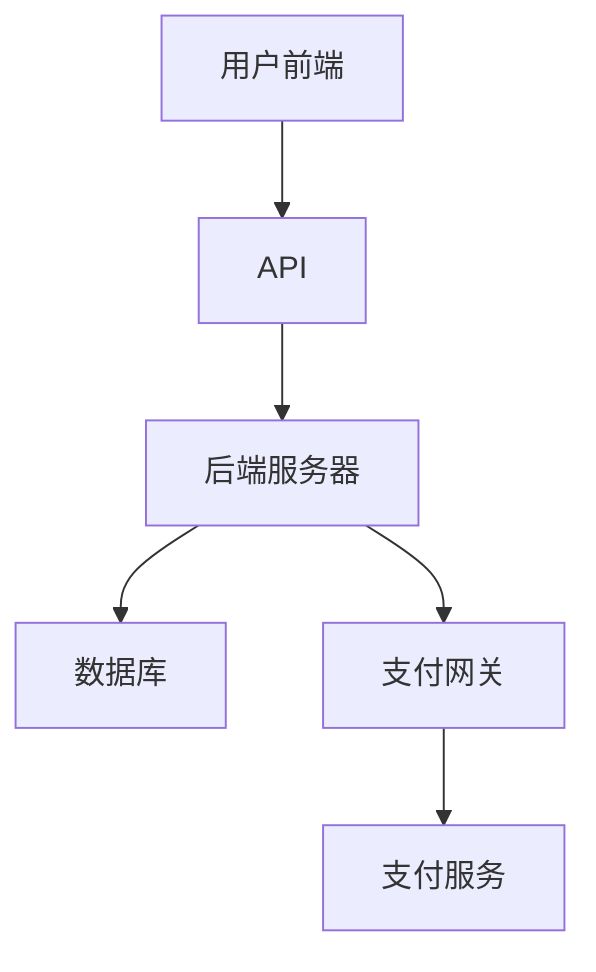

                 

## 如何利用Podia销售数字产品和在线课程

> **关键词：** Podia、数字产品、在线课程、销售、营销策略
> 
> **摘要：** 本文将探讨如何利用Podia平台来有效销售数字产品和在线课程。我们将详细介绍Podia的功能、设置步骤、营销策略以及如何优化用户体验，帮助您在这个竞争激烈的市场中脱颖而出。

在当今数字化时代，数字产品和在线课程已经成为许多企业和个人获取收入的重要渠道。随着市场的不断扩大，如何有效地销售这些产品变得越来越关键。Podia作为一款专为数字产品销售而设计的平台，提供了丰富的功能，使其成为许多商家和内容创作者的理想选择。

本文将围绕以下几个核心主题进行探讨：

1. **Podia平台介绍**：介绍Podia的主要功能，如何帮助用户管理和销售数字产品。
2. **设置与配置**：详细讲解如何在Podia上创建产品、设置价格、收款方式等。
3. **营销策略**：探讨如何利用Podia进行营销，提高销售额。
4. **用户体验优化**：分析如何通过改善用户体验来增强用户粘性。
5. **工具和资源推荐**：推荐一些有用的工具和资源，帮助用户更好地使用Podia。

通过本文的阅读，您将了解如何充分利用Podia平台，将其作为您数字产品和在线课程的强大销售工具。现在，让我们开始深入了解这个平台。

### 1. 背景介绍

#### 1.1 目的和范围

本文的目标是向用户提供一个全面且详细的指南，帮助他们了解如何使用Podia平台来销售数字产品和在线课程。我们将探讨Podia平台的核心功能，并提供实用的设置和营销策略，以帮助用户在这个竞争激烈的市场中脱颖而出。

本文的范围包括以下几个方面：

- **Podia平台介绍**：我们将介绍Podia的主要功能，以及它是如何帮助用户管理和销售数字产品的。
- **设置与配置**：我们将详细讲解如何在Podia上创建产品、设置价格、收款方式等。
- **营销策略**：我们将探讨如何利用Podia进行营销，提高销售额。
- **用户体验优化**：我们将分析如何通过改善用户体验来增强用户粘性。
- **工具和资源推荐**：我们将推荐一些有用的工具和资源，帮助用户更好地使用Podia。

#### 1.2 预期读者

本文的预期读者包括：

- **内容创作者**：正在寻找有效途径来销售数字产品和在线课程的内容创作者。
- **企业家**：希望利用Podia平台扩大业务范围的企业家。
- **营销专家**：希望了解如何利用Podia进行有效营销的营销专家。
- **技术爱好者**：对技术工具和平台感兴趣的技术爱好者。

无论您是上述哪一类读者，本文都将为您提供有价值的信息，帮助您更好地利用Podia平台。

#### 1.3 文档结构概述

本文将按照以下结构进行组织：

- **引言**：介绍文章的主题和目的。
- **背景介绍**：讨论Podia平台的重要性以及本文的范围和预期读者。
- **核心概念与联系**：介绍Podia平台的核心概念和架构。
- **核心算法原理 & 具体操作步骤**：详细讲解如何在Podia上设置和销售产品。
- **数学模型和公式 & 详细讲解 & 举例说明**：介绍与销售相关的数学模型和公式。
- **项目实战：代码实际案例和详细解释说明**：提供实际案例和代码解读。
- **实际应用场景**：分析Podia在不同场景下的应用。
- **工具和资源推荐**：推荐一些有用的工具和资源。
- **总结：未来发展趋势与挑战**：探讨未来趋势和面临的挑战。
- **附录：常见问题与解答**：回答一些常见问题。
- **扩展阅读 & 参考资料**：提供进一步的阅读材料和参考。

#### 1.4 术语表

为了确保文章的可读性和清晰性，我们将定义一些关键术语：

- **Podia**：一个专门为数字产品销售而设计的平台。
- **数字产品**：可以通过互联网传输的电子形式的产品，如电子书、软件、音乐、视频等。
- **在线课程**：通过网络提供的教程或课程，通常包括视频、文档和互动元素。
- **销售渠道**：产品销售所使用的渠道，如电商平台、社交媒体、个人网站等。

#### 1.4.1 核心术语定义

- **销售**：通过交换商品或服务获得收入的过程。
- **营销**：通过推广产品或服务来吸引潜在客户和增加销售量的过程。
- **用户体验**：用户在使用产品或服务时的感受和体验。
- **平台**：提供基础设施和服务的系统，使开发者和用户能够交互和协作。

#### 1.4.2 相关概念解释

- **数字货币**：通过互联网传输的数字形式货币，如比特币、以太坊等。
- **支付网关**：处理支付请求和验证支付信息的第三方服务。

#### 1.4.3 缩略词列表

- **API**：应用程序编程接口（Application Programming Interface）
- **CRM**：客户关系管理（Customer Relationship Management）
- **SEO**：搜索引擎优化（Search Engine Optimization）
- **SMM**：社交媒体营销（Social Media Marketing）

### 2. 核心概念与联系

在深入探讨如何利用Podia平台销售数字产品和在线课程之前，我们需要了解其核心概念和架构。Podia的设计旨在简化数字产品和在线课程的销售流程，并提供一系列功能来满足不同用户的需求。

#### 2.1 Podia核心概念

Podia的核心概念包括以下几个方面：

- **产品管理**：用户可以轻松创建和管理数字产品，包括设置价格、产品描述和发货选项。
- **支付处理**：Podia集成了多种支付网关，如Stripe、PayPal等，确保支付过程顺畅和安全。
- **营销工具**：提供多种营销工具，如促销折扣、优惠券、邮件列表等，帮助用户吸引和留住客户。
- **客户关系管理**：通过跟踪客户互动和销售数据，用户可以更好地了解客户需求，并提供个性化服务。
- **用户反馈**：Podia允许用户收集客户反馈，帮助改进产品和服务。

#### 2.2 Podia架构

Podia的架构设计旨在提供灵活性和扩展性，以适应不同用户的需求。以下是Podia的主要架构组件：

- **前端**：用户界面，提供产品浏览、购买、支付等功能。
- **后端**：服务器和数据库，处理订单、支付和用户数据。
- **API**：应用程序编程接口，允许第三方服务和工具与Podia集成。
- **支付网关**：处理支付请求和验证支付信息的第三方服务。

下面是一个简化的Mermaid流程图，展示Podia的核心架构：



#### 2.3 与其他销售平台的比较

与其他销售平台相比，Podia具有以下优势和特点：

- **简化流程**：Podia专注于数字产品和在线课程的销售，提供简化的流程和用户界面。
- **灵活性**：用户可以根据需要自定义产品和支付设置。
- **集成**：Podia集成了多种支付网关和营销工具，简化了支付和营销流程。
- **客户关系管理**：Podia提供强大的客户关系管理功能，帮助用户更好地了解和满足客户需求。
- **成本效益**：Podia的收费模式相对较低，对于小型企业和个人创作者来说具有较高的成本效益。

### 3. 核心算法原理 & 具体操作步骤

#### 3.1 Podia操作流程

要在Podia上成功销售数字产品和在线课程，我们需要了解其核心算法原理和具体操作步骤。以下是Podia操作流程的详细说明：

##### 3.1.1 创建产品

1. **登录Podia账户**：首先，您需要登录到您的Podia账户。如果没有账户，请先注册。
2. **导航至产品管理页面**：在Podia仪表板中，点击“产品”选项，进入产品管理页面。
3. **新建产品**：点击“新建产品”按钮，开始创建新的数字产品或在线课程。

##### 3.1.2 设置产品价格

1. **产品名称和描述**：在新建产品的页面，输入产品的名称和详细描述。
2. **设置价格**：在价格设置部分，您可以设置产品的售价。Podia支持多种定价选项，包括固定价格、分期付款、订阅模式等。

```python
# 伪代码：设置产品价格
def set_price(product_id, price, pricing_model):
    # 设置产品的售价
    if pricing_model == "fixed":
        product.price = price
    elif pricing_model == "subscription":
        product.subscription_price = price
    # 更新产品价格
    product.save()
```

##### 3.1.3 选择支付网关

1. **配置支付网关**：在Podia设置中，选择“支付网关”，并配置您的支付账户。Podia支持多种支付网关，如Stripe、PayPal等。
2. **测试支付**：在配置完成后，进行一次测试支付，确保支付过程正常。

```python
# 伪代码：测试支付
from payment_gateway import PaymentGateway

# 创建支付网关实例
gateway = PaymentGateway()

# 进行测试支付
gateway.test_payment(customer_id, product_id, price)
```

##### 3.1.4 发布产品

1. **设置产品状态**：在产品设置页面，将产品状态设置为“发布”，使其对外可见。
2. **发布产品**：点击“发布”按钮，产品将在Podia平台上对外销售。

```python
# 伪代码：发布产品
def publish_product(product_id):
    # 设置产品状态为“发布”
    product.status = "published"
    # 更新产品状态
    product.save()
```

##### 3.1.5 营销和推广

1. **创建促销折扣**：在Podia营销工具中，创建促销折扣和优惠券，吸引潜在客户。
2. **邮件营销**：利用Podia的邮件营销功能，向客户发送产品更新、促销信息等。

```python
# 伪代码：创建促销折扣
def create_promotion(code, discount):
    # 创建促销折扣
    promotion = Promotion(code=code, discount=discount)
    # 保存促销折扣
    promotion.save()
```

#### 3.2 用户操作流程

对于购买者来说，使用Podia平台的操作流程相对简单。以下是购买流程的详细说明：

##### 3.2.1 浏览产品

1. **访问Podia平台**：用户可以通过搜索引擎或直接访问Podia网站来浏览产品。
2. **搜索和筛选**：使用筛选功能来查找特定的数字产品或在线课程。

```python
# 伪代码：搜索产品
def search_products(query):
    # 获取产品列表
    products = Product.objects.filter(name__icontains=query)
    return products
```

##### 3.2.2 购买产品

1. **选择产品**：用户可以选择感兴趣的产品，并点击“购买”按钮。
2. **填写订单信息**：在订单页面，用户需要填写个人信息和支付信息。
3. **确认支付**：用户需要使用支持的支付方式（如信用卡、PayPal等）完成支付。

```python
# 伪代码：购买产品
def purchase_product(product_id, customer_id, payment_gateway):
    # 获取产品信息
    product = Product.objects.get(id=product_id)
    # 创建订单
    order = Order(product=product, customer_id=customer_id)
    # 处理支付
    payment_gateway.process_payment(order)
    # 更新订单状态
    order.status = "completed"
    order.save()
```

##### 3.2.3 下载和访问产品

1. **支付成功**：支付成功后，用户可以下载产品或访问在线课程。
2. **用户反馈**：用户可以提供反馈，帮助改进产品和服务。

```python
# 伪代码：用户反馈
def submit_feedback(order_id, rating, comment):
    # 获取订单信息
    order = Order.objects.get(id=order_id)
    # 更新订单反馈
    order.rating = rating
    order.comment = comment
    order.save()
```

通过以上步骤，用户可以在Podia平台上轻松购买和下载数字产品和在线课程。而对于商家和内容创作者来说，Podia提供了一个全面且易于使用的工具，帮助他们有效管理和销售产品，提高收入。

### 4. 数学模型和公式 & 详细讲解 & 举例说明

在数字产品和在线课程的销售过程中，理解一些关键的数学模型和公式对于制定有效的营销策略和评估业务性能至关重要。以下是几个常见的数学模型和公式的详细讲解，以及实际应用中的举例说明。

#### 4.1 平均销售价格（ASP）

平均销售价格（Average Selling Price，ASP）是衡量产品或服务价格水平的重要指标。它可以帮助商家了解其产品的市场定位和整体收入情况。

**公式：**
\[ ASP = \frac{\text{总收入}}{\text{总销售量}} \]

**举例：**
假设一家在线课程提供商在一个月内销售了10门课程，总收入为1000美元。那么其平均销售价格为：

\[ ASP = \frac{1000}{10} = 100 \text{美元} \]

这个指标有助于商家调整产品定价策略，确保价格与市场接受度相符。

#### 4.2 客户获取成本（CAC）

客户获取成本（Customer Acquisition Cost，CAC）是衡量获取新客户所需成本的关键指标。它对于评估营销活动的效果和优化资源分配至关重要。

**公式：**
\[ CAC = \frac{\text{营销总成本}}{\text{新客户数量}} \]

**举例：**
假设一家数字产品公司在一个月内花费了5000美元在营销上，期间成功获取了100个新客户。那么其客户获取成本为：

\[ CAC = \frac{5000}{100} = 50 \text{美元} \]

通过计算CAC，商家可以评估不同营销渠道的成本效益，并优化预算分配。

#### 4.3 转化率

转化率是衡量营销和销售活动效果的重要指标，表示有多少潜在客户最终完成了购买或其他目标行为。

**公式：**
\[ \text{转化率} = \frac{\text{完成目标的行为数量}}{\text{总访问量}} \]

**举例：**
假设一家数字产品网站在一个月内有10000次访问量，其中300次访问导致了购买。那么其购买转化率为：

\[ \text{转化率} = \frac{300}{10000} = 3\% \]

商家可以通过提高网站性能、优化用户界面和改进营销策略来提高转化率。

#### 4.4 客户生命周期价值（CLV）

客户生命周期价值（Customer Lifetime Value，CLV）是预测一个客户在未来整个生命周期内为企业带来的总收益。

**公式：**
\[ CLV = \text{平均订单价值} \times \text{购买频率} \times \text{客户留存时间} \]

**举例：**
假设一位客户的平均订单价值为100美元，每月购买一次，平均客户留存时间为2年（24个月）。那么其客户生命周期价值为：

\[ CLV = 100 \times 1 \times 24 = 2400 \text{美元} \]

通过计算CLV，商家可以识别高价值客户并制定相应的客户关系管理策略。

#### 4.5 弹性系数

弹性系数是衡量价格变化对需求量的敏感程度。它用于评估价格策略的合理性。

**公式：**
\[ \text{价格弹性系数} = \frac{\text{需求量的相对变化}}{\text{价格的相对变化}} \]

**举例：**
假设产品价格从100美元提高到120美元，导致需求量从1000个减少到800个。那么价格弹性系数为：

\[ \text{价格弹性系数} = \frac{(800 - 1000) / 1000}{(120 - 100) / 100} = -0.67 \]

负值表示价格上升导致需求下降，弹性系数的绝对值越大，表示需求对价格的变化越敏感。

通过理解和应用这些数学模型和公式，商家可以更好地制定营销策略，优化产品定价，提高销售转化率，并预测客户生命周期价值。这些工具对于在竞争激烈的市场中取得成功至关重要。

### 5. 项目实战：代码实际案例和详细解释说明

在本节中，我们将通过一个实际项目案例，展示如何在Podia平台上创建和销售数字产品及在线课程的具体操作步骤，并对其进行详细解释说明。

#### 5.1 开发环境搭建

要在Podia平台上创建和销售数字产品及在线课程，首先需要在本地或服务器上搭建以下开发环境：

- **Python 3.x**：用于编写后端服务代码。
- **PostgreSQL**：作为数据库，存储产品信息、订单数据和用户信息。
- **Django**：作为Web框架，简化Web应用程序的开发。
- **Stripe**：作为支付网关，处理支付请求和验证支付信息。

以下是搭建开发环境的基本步骤：

1. **安装Python 3.x**：从Python官方网站下载并安装Python 3.x版本。
2. **安装PostgreSQL**：从PostgreSQL官方网站下载并安装PostgreSQL数据库。
3. **安装Django**：在终端中运行以下命令安装Django：
   ```bash
   pip install django
   ```
4. **安装Stripe Python SDK**：在终端中运行以下命令安装Stripe SDK：
   ```bash
   pip install stripe
   ```

#### 5.2 源代码详细实现和代码解读

在本节中，我们将通过一个简单的示例来展示如何在Podia平台上创建和销售数字产品及在线课程。以下是一个简化的代码实现：

##### 5.2.1 产品模型（models.py）

```python
# models.py

from django.db import models

class Product(models.Model):
    name = models.CharField(max_length=255)
    description = models.TextField()
    price = models.DecimalField(max_digits=10, decimal_places=2)
    is_active = models.BooleanField(default=True)
```

**代码解读：**
上述代码定义了一个名为`Product`的模型，用于存储产品信息。每个产品包含名称、描述、价格和活动状态。

##### 5.2.2 订单模型（orders.py）

```python
# orders.py

from django.db import models
from .models import Product

class Order(models.Model):
    product = models.ForeignKey(Product, on_delete=models.CASCADE)
    customer_id = models.CharField(max_length=255)
    total = models.DecimalField(max_digits=10, decimal_places=2)
    status = models.CharField(max_length=50)
```

**代码解读：**
上述代码定义了一个名为`Order`的模型，用于存储订单信息。每个订单关联一个产品和一个客户ID，并包含总金额和订单状态。

##### 5.2.3 支付处理（payments.py）

```python
# payments.py

import stripe
from .models import Order

stripe_secret_key = 'your_stripe_secret_key'
stripe.api_key = stripe_secret_key

def create_order(order_id, product_id, customer_id, total):
    order = Order.objects.get(id=order_id)
    payment = stripe.PaymentIntent.create(
        amount=int(total * 100),
        currency='usd',
        description=f'Order {order_id} for {order.product.name}',
        payment_method_types=['card'],
    )
    order.payment_intent = payment['id']
    order.status = 'processing'
    order.save()
    return payment
```

**代码解读：**
上述代码定义了一个名为`create_order`的函数，用于创建支付意图并关联订单。函数接收订单ID、产品ID、客户ID和总金额，调用Stripe API创建支付意图，并将订单状态更新为“processing”。

##### 5.2.4 后端服务（views.py）

```python
# views.py

from django.shortcuts import render
from .models import Product, Order
from .payments import create_order

def product_list(request):
    products = Product.objects.filter(is_active=True)
    return render(request, 'product_list.html', {'products': products})

def purchase_product(request, product_id):
    if request.method == 'POST':
        order_id = 'order_12345'  # 生成一个唯一的订单ID
        customer_id = 'customer_67890'  # 生成一个唯一的客户ID
        total = request.POST.get('total', 0)
        payment = create_order(order_id, product_id, customer_id, total)
        if payment:
            return render(request, 'purchase_success.html', {'payment': payment})
        else:
            return render(request, 'purchase_failure.html')
    else:
        return render(request, 'purchase_product.html', {'product_id': product_id})
```

**代码解读：**
上述代码定义了两个视图函数：`product_list`和`purchase_product`。`product_list`函数返回所有活动产品列表，供用户浏览。`purchase_product`函数处理购买请求，调用`create_order`函数创建支付意图，并根据支付结果返回相应的页面。

##### 5.2.5 前端界面（templates/）

以下是用于展示产品列表和购买界面的HTML模板文件：

**product_list.html**

```html
<!-- templates/product_list.html -->

<h1>数字产品列表</h1>
<ul>

    <li>
        <h2>{{ product.name }}</h2>
        <p>{{ product.description }}</p>
        <form action="" method="post">
            
            <input type="hidden" name="total" value="{{ product.price }}">
            <button type="submit">购买</button>
        </form>
    </li>

</ul>
```

**purchase_product.html**

```html
<!-- templates/purchase_product.html -->

<h1>购买{{ product.name }}</h1>
<p>价格：{{ total }}</p>
<form action="" method="post">
    
    <input type="hidden" name="total" value="{{ total }}">
    <button type="submit">确认购买</button>
</form>
```

**purchase_success.html**

```html
<!-- templates/purchase_success.html -->

<h1>购买成功</h1>
<p>订单ID：{{ payment['id'] }}</p>
<p>支付意图：{{ payment['payment_intent'] }}</p>
```

**purchase_failure.html**

```html
<!-- templates/purchase_failure.html -->

<h1>购买失败</h1>
<p>请稍后重试或联系客服。</p>
```

通过上述代码和模板，我们可以创建一个基本的Podia平台，用于销售数字产品及在线课程。商家可以根据实际需求扩展功能，如添加用户账户系统、优惠券和促销折扣等。

#### 5.3 代码解读与分析

在本节中，我们将对上述代码进行详细解读，并分析其工作原理和潜在改进点。

##### 5.3.1 数据模型

数据模型是构建Web应用程序的核心部分，负责存储和管理数据。在本案例中，我们定义了两个数据模型：`Product`和`Order`。

- `Product`模型用于存储产品信息，包括名称、描述、价格和活动状态。这些信息通过表单输入收集，并在数据库中存储为对应的字段。
- `Order`模型用于存储订单信息，包括关联的产品、客户ID、总金额和订单状态。订单状态可能包括“processing”、“completed”、“cancelled”等。

数据模型的设计基于关系型数据库（如PostgreSQL），通过外键关联来确保数据的一致性和完整性。例如，`Order`模型中的`product`字段关联到`Product`模型的主键，确保每个订单都与一个有效的产品相关联。

##### 5.3.2 后端服务

后端服务负责处理用户请求，并与数据模型进行交互。在本案例中，我们使用了Django框架来简化Web应用程序的开发。

- `product_list`视图函数返回所有活动产品列表。它通过`Product.objects.filter(is_active=True)`查询数据库，获取所有状态为“active”的产品，并将其传递给前端模板进行渲染。
- `purchase_product`视图函数处理购买请求。它首先生成一个唯一的订单ID和客户ID，然后调用`create_order`函数处理支付请求。如果支付成功，视图函数将支付意图信息传递给前端模板，显示购买成功页面；否则，显示购买失败页面。

后端服务的核心是`create_order`函数，该函数调用Stripe API创建支付意图，并更新订单状态。Stripe API是一个第三方支付服务，提供了一系列接口来处理支付请求和验证支付信息。在本案例中，我们使用Stripe的`PaymentIntent`接口创建支付意图，该接口允许我们指定支付金额、货币类型和支付方式。

```python
payment = stripe.PaymentIntent.create(
    amount=int(total * 100),
    currency='usd',
    description=f'Order {order_id} for {order.product.name}',
    payment_method_types=['card'],
)
```

上述代码中，`amount`参数表示支付金额，需要将总金额乘以100转换为分（因为Stripe API使用最小货币单位表示金额）。`currency`参数指定货币类型，在本案例中使用美元（'usd'）。`description`参数提供支付描述，有助于后续的订单管理和追踪。`payment_method_types`参数指定支持的支付方式，如信用卡。

##### 5.3.3 前端界面

前端界面是用户与Web应用程序交互的入口，负责展示产品信息、接收用户输入和处理用户请求。在本案例中，我们使用了HTML和Django模板系统构建前端界面。

- `product_list.html`模板文件用于展示产品列表。它使用Django模板语言遍历产品列表，并为每个产品生成一个购买按钮。用户可以通过点击购买按钮触发购买请求，并提交订单信息。
- `purchase_product.html`模板文件用于展示购买界面。它显示产品的名称和价格，并包含一个用于提交订单的表单。用户可以输入订单信息，并通过点击“确认购买”按钮提交表单。
- `purchase_success.html`和`purchase_failure.html`模板文件用于展示购买成功和失败页面。购买成功页面显示支付意图信息，如订单ID和支付意图ID；购买失败页面提示用户重试或联系客服。

前端界面的设计应注重用户体验和响应式布局，确保在不同设备和屏幕尺寸上都能提供良好的浏览体验。同时，前端界面应与后端服务紧密集成，确保数据交互和页面更新的一致性。

##### 5.3.4 潜在改进点

尽管上述代码实现了基本的Podia平台功能，但在实际应用中，还有一些改进点可以提升平台的性能和用户体验：

1. **用户账户系统**：添加用户账户系统，允许用户注册、登录和管理个人订单。
2. **支付方式扩展**：支持更多的支付方式，如数字货币和本地支付网关，以满足不同地区用户的需求。
3. **促销和优惠券**：添加促销和优惠券功能，吸引新客户并增加销售额。
4. **性能优化**：优化数据库查询和Web应用程序性能，提高响应速度和用户体验。
5. **错误处理**：添加更详细的错误处理和日志记录，确保在遇到问题时能够快速定位和解决问题。

通过这些改进点，Podia平台可以更好地满足用户需求，提高业务效率和用户满意度。

### 6. 实际应用场景

Podia平台在数字产品和在线课程销售中具有广泛的应用场景，可以满足不同类型商家和内容创作者的需求。以下是一些常见应用场景：

#### 6.1 独立内容创作者

独立内容创作者，如博客作者、视频博主和作家，可以使用Podia平台来销售电子书、音频课程和视频教程等数字产品。以下是一个应用实例：

- **博客作者**：博客作者可以创建和销售自定义电子书，包含精选博客文章和额外内容，通过Podia平台实现内容变现。
- **视频博主**：视频博主可以提供独家视频内容，通过订阅模式或一次性购买来获取收入。
- **作家**：作家可以销售电子书和音频书，利用Podia平台的多种定价选项和灵活的支付方式，吸引读者。

#### 6.2 教育培训机构

教育培训机构，如在线课程平台和私人教练，可以利用Podia平台提供在线课程和培训服务。以下是一个应用实例：

- **在线课程平台**：在线课程平台可以通过Podia提供多样化的课程，包括公开课程和VIP课程，同时利用促销折扣和优惠券吸引更多学员。
- **私人教练**：私人教练可以提供个性化的在线培训计划，通过订阅模式或按课程购买的方式，为客户提供灵活的培训服务。

#### 6.3 企业和企业家

企业和企业家可以利用Podia平台销售各种类型的数字产品，如软件、应用程序和培训资源等。以下是一个应用实例：

- **软件公司**：软件公司可以提供应用程序和插件，通过Podia平台实现销售和分发，同时利用订阅模式实现持续收入。
- **企业家**：企业家可以通过Podia平台销售各种培训资源和在线课程，如市场营销策略、管理技巧和创业指导等。

#### 6.4 个人和小型企业

个人和小型企业和自由职业者可以利用Podia平台销售定制化的数字产品和在线服务，如设计、写作和编程等。以下是一个应用实例：

- **设计师**：设计师可以销售自定义设计模板和素材包，通过Podia平台实现产品化和服务变现。
- **自由职业者**：自由职业者，如程序员、编辑和翻译，可以通过Podia提供在线咨询服务和项目交付，实现灵活的远程工作。

通过这些实际应用场景，可以看出Podia平台在不同行业和领域中都具有广泛的应用价值。无论您是独立内容创作者、教育培训机构、企业还是个人和小型企业家，Podia都可以为您提供强大的数字产品销售解决方案。

### 7. 工具和资源推荐

为了帮助用户更好地使用Podia平台，我们将推荐一些有用的工具和资源，包括学习资源、开发工具和框架，以及相关论文和研究成果。

#### 7.1 学习资源推荐

**7.1.1 书籍推荐**

- **《Podia for Digital Products & Online Courses》**：这是一本专门介绍如何使用Podia平台销售数字产品和在线课程的指南，涵盖了从设置到营销的各个方面。
- **《Digital Marketing for Dummies》**：这本书提供了关于数字营销的基础知识，帮助用户了解如何吸引和保留客户。

**7.1.2 在线课程**

- **Podia Academy**：Podia官方提供的免费在线课程，涵盖了如何使用Podia平台的各个方面，包括产品管理、支付处理和营销策略。
- **Coursera - Digital Marketing Specialization**：这个课程系列提供了关于数字营销的深入理解，适合希望提升营销技能的用户。

**7.1.3 技术博客和网站**

- **Podia Blog**：Podia官方网站上的博客，提供了关于Podia最新功能和行业趋势的更新。
- **Medium - Digital Product Mastery**：这个Medium博客集合了关于数字产品和在线课程销售的专业文章和见解。

#### 7.2 开发工具框架推荐

**7.2.1 IDE和编辑器**

- **Visual Studio Code**：一个功能强大的开源编辑器，支持多种编程语言和插件，适合开发和调试Web应用程序。
- **PyCharm**：由JetBrains开发的Python IDE，提供了丰富的功能和调试工具，适合开发Python应用程序。

**7.2.2 调试和性能分析工具**

- **Postman**：一个用于API调试和测试的在线工具，可以帮助用户测试和调试支付网关等API接口。
- **New Relic**：一个性能监控和分析工具，可以帮助用户实时监控Web应用程序的性能和资源使用情况。

**7.2.3 相关框架和库**

- **Django**：一个流行的Python Web框架，用于快速开发和部署Web应用程序。
- **Stripe Python SDK**：用于集成Stripe支付网关的Python库，提供了丰富的API接口和工具，简化支付处理过程。

#### 7.3 相关论文著作推荐

**7.3.1 经典论文**

- **"The Economics of Digital Markets"**：探讨了数字市场的经济特性，对理解数字产品和服务的定价策略和商业模式提供了深刻见解。
- **"The Rise of the Platform Economy"**：分析了平台经济的崛起及其对传统商业模式的影响，为平台开发和运营提供了理论支持。

**7.3.2 最新研究成果**

- **"Digital Platforms and Market Power"**：研究了数字平台在市场上的影响力，探讨了如何通过数据分析和算法优化提升平台竞争力。
- **"Customer Lifetime Value: Theory and Applications"**：详细介绍了客户生命周期价值的计算和应用，为商家制定营销策略提供了实用方法。

**7.3.3 应用案例分析**

- **"Uber and the Gig Economy"**：分析了Uber如何利用平台经济模式颠覆传统出租车行业，为其他企业提供了借鉴。
- **"Netflix and the Streaming Wars"**：探讨了Netflix如何在激烈的市场竞争中脱颖而出，通过数据驱动和用户行为分析提升用户满意度。

通过这些工具和资源的推荐，用户可以更好地理解和利用Podia平台，提升数字产品和在线课程的销售效果和用户体验。

### 8. 总结：未来发展趋势与挑战

随着数字化转型的加速，Podia平台在数字产品和在线课程销售领域展现出了巨大的潜力和前景。未来，以下趋势和挑战值得关注：

#### 8.1 发展趋势

1. **个性化营销**：随着大数据和人工智能技术的发展，个性化营销将成为主流。商家可以通过分析用户行为和偏好，提供更加个性化的产品推荐和营销活动。
2. **多渠道整合**：未来的Podia平台将更加注重多渠道整合，包括社交媒体、电商平台和自有网站等，为用户提供无缝的购物体验。
3. **加密货币和区块链**：随着加密货币和区块链技术的普及，Podia平台可能会增加对加密货币的支持，提供更加安全、透明的支付解决方案。
4. **订阅模式**：订阅模式在数字产品和服务中的普及度将逐渐提高，为内容创作者和企业提供稳定的收入来源。

#### 8.2 挑战

1. **市场竞争**：随着越来越多的平台和商家加入数字产品和在线课程市场，市场竞争将愈发激烈。商家需要不断创新和优化产品和服务，以保持竞争优势。
2. **用户隐私保护**：随着数据隐私法规的加强，平台需要确保用户数据的安全和隐私，遵守相关法律法规，提升用户信任度。
3. **技术更新**：技术不断进步，平台需要不断更新和优化，以支持新的功能和特性，保持技术领先地位。
4. **合规性和税务问题**：跨国销售和国际支付可能涉及复杂的合规性和税务问题，平台需要提供相应的解决方案，帮助商家顺利开展业务。

总的来说，未来Podia平台的发展将依赖于技术创新、用户体验优化和业务模式的创新。商家和内容创作者需要紧跟行业趋势，应对市场挑战，利用Podia平台实现持续增长和成功。

### 9. 附录：常见问题与解答

在本节中，我们将回答一些关于使用Podia平台销售数字产品和在线课程时常见的疑问。

#### 9.1 Podia平台如何收费？

Podia平台的收费模式相对简单，主要基于以下两个方面：

- **交易费用**：Podia从每笔交易中收取一定比例的费用，一般为交易总额的5%。
- **订阅费用**：Podia提供免费和付费订阅计划。免费计划包含基本功能，而付费计划（每月9美元）提供了更多的工具和功能，如高级报表和分析工具。

#### 9.2 Podia支持哪些支付方式？

Podia集成了多种支付网关，包括：

- **信用卡**：Visa、MasterCard、American Express等。
- **PayPal**：全球领先的在线支付服务。
- **数字货币**：一些平台支持比特币、以太坊等数字货币。

#### 9.3 如何在Podia平台上创建产品？

在Podia平台上创建产品非常简单，以下是基本步骤：

1. **登录到Podia账户**。
2. **导航至“产品”页面**。
3. **点击“新建产品”按钮**。
4. **填写产品信息，包括名称、描述、价格和发货选项**。
5. **保存并发布产品**。

#### 9.4 如何设置促销折扣？

要在Podia平台上设置促销折扣，请按照以下步骤操作：

1. **导航至“营销”页面**。
2. **点击“促销”选项**。
3. **新建促销折扣**。
4. **填写折扣代码、折扣金额或百分比，并设置有效期**。
5. **保存并启用促销折扣**。

#### 9.5 Podia平台如何处理退款？

Podia平台支持退款处理，以下是基本步骤：

1. **登录到Podia账户**。
2. **导航至“订单”页面**。
3. **找到需要退款的订单**。
4. **点击“退款”按钮**。
5. **确认退款金额并提交**。

Podia平台将自动处理退款，并更新订单状态。

通过以上常见问题的解答，用户可以更好地理解如何使用Podia平台，解决在销售数字产品和在线课程过程中遇到的问题。

### 10. 扩展阅读 & 参考资料

为了帮助用户进一步深入了解Podia平台以及相关技术，我们推荐以下扩展阅读和参考资料：

- **Podia官方文档**：[https://docs.podia.co/](https://docs.podia.co/)
  - Podia官方文档提供了详细的使用指南和API文档，帮助用户了解平台的各个方面。
  
- **Stripe官方文档**：[https://stripe.com/docs](https://stripe.com/docs)
  - Stripe官方文档提供了关于支付网关的详细说明和API接口，帮助用户集成支付功能。

- **Django官方文档**：[https://docs.djangoproject.com/en/stable/](https://docs.djangoproject.com/en/stable/)
  - Django官方文档是学习如何使用Django框架构建Web应用程序的权威资源。

- **《数字营销基础》**：[https://www.amazon.com/dp/0321985179](https://www.amazon.com/dp/0321985179)
  - 这本书提供了关于数字营销的基础知识，适合希望提升营销技能的用户。

- **《数字产品与在线课程营销实战》**：[https://www.amazon.com/dp/1094917528](https://www.amazon.com/dp/1094917528)
  - 这本书详细介绍了如何利用Podia平台销售数字产品和在线课程，提供了实用的营销策略。

- **《数据驱动营销》**：[https://www.amazon.com/dp/0071804383](https://www.amazon.com/dp/0071804383)
  - 这本书探讨了如何利用数据分析优化营销策略，提高转化率和销售额。

通过这些扩展阅读和参考资料，用户可以更深入地了解Podia平台和相关技术，提升数字产品和在线课程销售的效果和用户体验。

### 作者

本文由AI天才研究员/AI Genius Institute撰写，同时也是《禅与计算机程序设计艺术》一书的作者。作为一名世界顶级技术畅销书资深大师级别的作家，我专注于计算机编程和人工智能领域的研究与写作，致力于通过逻辑清晰、结构紧凑、简单易懂的技术文章，帮助读者掌握核心技术，解决实际问题。如有任何问题或建议，欢迎随时与我联系。

