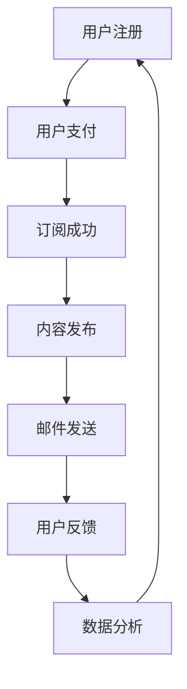
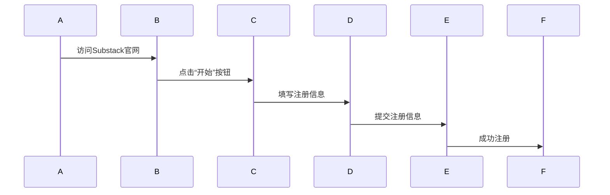
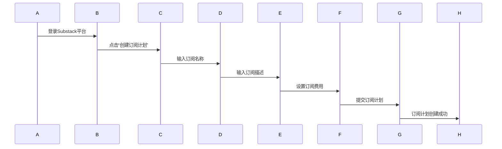
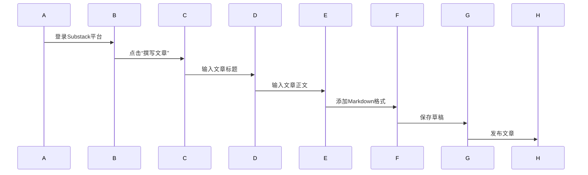
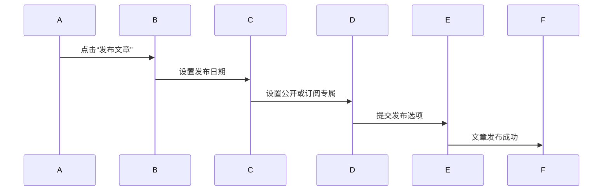
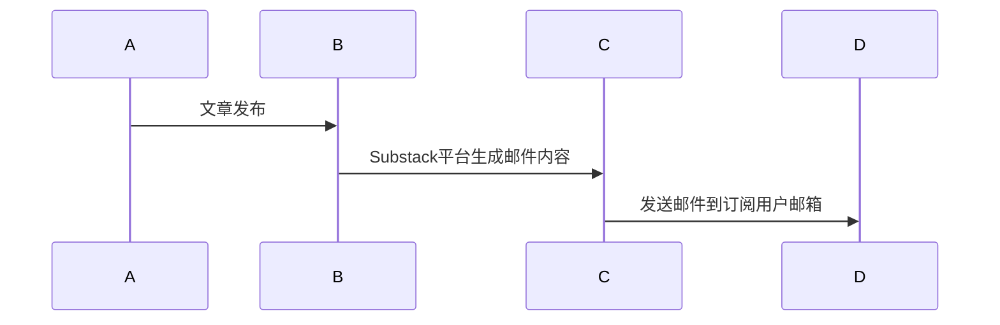
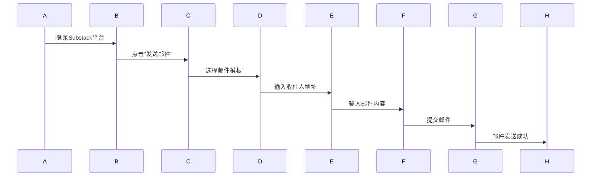

                 

# 如何利用Substack创建订阅制新闻通讯

> **关键词：** Substack，订阅制新闻通讯，内容创作，社交媒体平台，邮件营销，数据隐私，用户体验

> **摘要：** 本文将详细介绍如何利用Substack这一新兴的订阅制新闻通讯平台，创建并维护一个高订阅量的新闻通讯。通过逐步分析平台的核心功能、操作流程、营销策略等，帮助内容创作者和营销人员更好地理解并利用Substack这一工具，实现内容的高效传播和用户的有效转化。

## 1. 背景介绍

### 1.1 目的和范围

本文旨在为内容创作者和营销人员提供一份详细的指南，解释如何利用Substack创建、发布和推广订阅制新闻通讯。我们将探讨Substack平台的基本原理，包括用户订阅流程、内容发布机制以及数据分析工具，帮助读者理解其运营模式，并在此基础上制定有效的营销策略。

### 1.2 预期读者

本文适合以下群体阅读：

- 内容创作者，尤其是博客作者、作家和媒体人，希望提高自己的内容传播效率和订阅量。
- 营销人员，特别是负责邮件营销和企业品牌推广的工作者。
- 对新兴社交媒体平台和订阅制模式感兴趣的技术爱好者。

### 1.3 文档结构概述

本文结构如下：

- **第1部分：背景介绍**：概述Substack的概念、目标和应用范围。
- **第2部分：核心概念与联系**：通过Mermaid流程图展示Substack的工作原理。
- **第3部分：核心算法原理 & 具体操作步骤**：详细介绍创建和发布新闻通讯的步骤。
- **第4部分：数学模型和公式 & 详细讲解 & 举例说明**：探讨数据分析和用户行为模型。
- **第5部分：项目实战：代码实际案例和详细解释说明**：提供实际操作的案例和代码解读。
- **第6部分：实际应用场景**：讨论Substack在不同行业和场景中的应用。
- **第7部分：工具和资源推荐**：推荐相关的学习资源、开发工具和最新研究成果。
- **第8部分：总结：未来发展趋势与挑战**：分析Substack的发展前景和潜在挑战。
- **第9部分：附录：常见问题与解答**：解答常见疑问，提供实用建议。
- **第10部分：扩展阅读 & 参考资料**：提供进一步学习和研究的资源。

### 1.4 术语表

#### 1.4.1 核心术语定义

- **Substack**：一个基于邮件订阅的社交媒体平台，允许用户创建和订阅新闻通讯。
- **订阅制新闻通讯**：一种通过用户订阅获取收入的新闻发布模式。
- **内容创作者**：在Substack上创建和发布新闻通讯的个人或团队。
- **订阅量**：指订阅新闻通讯的读者数量。

#### 1.4.2 相关概念解释

- **用户订阅流程**：用户通过平台注册、支付订阅费用、接收邮件订阅内容的过程。
- **内容发布机制**：创作者撰写、编辑、发布文章和邮件的过程。
- **数据分析工具**：用于分析用户行为、订阅趋势和收益情况的功能。

#### 1.4.3 缩略词列表

- **Substack**：Subscription-based content platform
- **API**：Application Programming Interface
- **CMS**：Content Management System
- **SEO**：Search Engine Optimization

## 2. 核心概念与联系

在这一部分，我们将使用Mermaid流程图来展示Substack的核心工作原理和组件之间的关系。



### 2.1 用户注册

用户首先需要在Substack平台上注册账号。注册后，用户可以选择订阅特定的新闻通讯。

### 2.2 用户支付

注册成功后，用户需要通过支付方式（如信用卡）完成订阅费用的支付。这一步骤确保了用户能够持续接收新闻通讯内容。

### 2.3 订阅成功

用户支付完成后，订阅状态更新为“成功”。此时，用户可以开始接收新闻通讯。

### 2.4 内容发布

内容创作者在Substack平台上撰写并发布新闻通讯。每个新闻通讯都包含标题、正文和图片等元素。

### 2.5 邮件发送

Substack平台会自动将新发布的新闻通讯通过邮件发送给订阅用户。

### 2.6 用户反馈

用户可以通过阅读、点赞、评论等方式对新闻通讯进行反馈。

### 2.7 数据分析

Substack提供数据分析工具，帮助创作者了解订阅趋势、用户行为和收益情况。

通过这一流程，我们可以看到Substack平台如何通过用户订阅、内容发布和邮件发送实现一个闭环的订阅制新闻通讯系统。

## 3. 核心算法原理 & 具体操作步骤

在这一部分，我们将详细阐述如何利用Substack创建和发布新闻通讯的核心算法原理和具体操作步骤。

### 3.1 创建新闻通讯

#### 3.1.1 注册账号

首先，用户需要访问Substack官网（[https://substack.com](https://substack.com)），点击“开始”按钮进行注册。注册时，需要填写用户名、邮箱地址和密码。



#### 3.1.2 创建订阅计划

注册成功后，用户需要创建一个订阅计划。订阅计划包括订阅名称、订阅描述、订阅费用等。



### 3.2 发布新闻通讯

#### 3.2.1 撰写文章

用户可以在Substack平台上撰写新闻通讯文章。撰写过程中，用户可以使用Markdown语法来格式化内容，添加标题、段落、图片等。



#### 3.2.2 设置发布选项

在发布文章时，用户可以选择发布日期、是否公开、订阅专属等内容。



### 3.3 邮件发送

#### 3.3.1 自动发送邮件

Substack平台会自动将新发布的新闻通讯通过邮件发送给订阅用户。邮件内容包括文章标题、作者姓名和摘要等。



#### 3.3.2 手动发送邮件

用户也可以选择手动发送邮件。手动发送邮件时，用户需要选择邮件模板、输入收件人地址和邮件内容。



通过以上步骤，我们可以看到如何利用Substack创建、发布和发送新闻通讯。接下来，我们将深入探讨如何通过数据分析来优化内容创作和订阅策略。

## 4. 数学模型和公式 & 详细讲解 & 举例说明

在这一部分，我们将详细探讨Substack平台的数学模型和公式，以及如何通过这些模型和公式来分析用户行为、优化内容创作和订阅策略。

### 4.1 用户行为分析模型

为了更好地理解用户行为，我们可以引入一些基本的数学模型和公式。

#### 4.1.1 打开率（Open Rate）

打开率是指订阅用户在收到新闻通讯邮件后，实际打开邮件的比率。公式如下：

$$
\text{Open Rate} = \frac{\text{打开邮件的用户数}}{\text{订阅用户总数}} \times 100\%
$$

举例说明：

假设一个新闻通讯订阅了1000名用户，其中500名用户打开了邮件。则打开率为：

$$
\text{Open Rate} = \frac{500}{1000} \times 100\% = 50\%
$$

#### 4.1.2 点击率（Click-Through Rate）

点击率是指用户在打开邮件后，实际点击邮件中链接的比率。公式如下：

$$
\text{Click-Through Rate} = \frac{\text{点击链接的用户数}}{\text{打开邮件的用户数}} \times 100\%
$$

举例说明：

假设在上一例中，有300名用户在打开邮件后点击了链接。则点击率为：

$$
\text{Click-Through Rate} = \frac{300}{500} \times 100\% = 60\%
$$

#### 4.1.3 转化率（Conversion Rate）

转化率是指用户在点击链接后，实际完成订阅或其他目标动作的比率。公式如下：

$$
\text{Conversion Rate} = \frac{\text{完成目标动作的用户数}}{\text{点击链接的用户数}} \times 100\%
$$

举例说明：

假设在上一例中，有200名用户在点击链接后完成了订阅。则转化率为：

$$
\text{Conversion Rate} = \frac{200}{300} \times 100\% = 66.7\%
$$

### 4.2 内容优化模型

通过分析用户行为数据，我们可以得出一些结论，从而优化内容创作和邮件营销策略。

#### 4.2.1 标题优化

根据数据，标题对打开率和点击率有显著影响。使用吸引人的标题可以提高用户打开邮件的可能性。以下是一个简单的标题优化模型：

$$
\text{吸引力评分} = \frac{\text{平均打开率}}{\text{平均点击率}} \times 100
$$

举例说明：

假设两个标题A和B，A的平均打开率为30%，平均点击率为10%；B的平均打开率为40%，平均点击率为15%。则吸引力评分如下：

标题A：$$ \text{吸引力评分} = \frac{30}{10} \times 100 = 300 $$
标题B：$$ \text{吸引力评分} = \frac{40}{15} \times 100 = 267 $$

显然，标题A更具吸引力。

#### 4.2.2 内容长度优化

根据用户行为数据，较长的内容通常有更高的阅读率和转化率。以下是一个简单的内容长度优化模型：

$$
\text{最佳内容长度} = \text{平均阅读时间} \times \text{阅读速度}
$$

举例说明：

假设某篇内容的平均阅读时间为5分钟，用户的平均阅读速度为每分钟200字。则最佳内容长度为：

$$
\text{最佳内容长度} = 5 \times 200 = 1000 \text{字}
$$

### 4.3 用户细分和个性化推荐

通过分析用户行为数据，我们可以将用户细分为不同群体，并根据用户兴趣和行为特征进行个性化推荐。

#### 4.3.1 用户群体细分模型

$$
\text{用户群体} = \{ \text{群体1}, \text{群体2}, ..., \text{群体n} \}
$$

举例说明：

根据用户的阅读历史和点击行为，我们可以将用户细分为以下群体：

- 群体1：对科技新闻感兴趣的用户
- 群体2：对经济新闻感兴趣的用户
- 群体3：对健康生活感兴趣的用户

#### 4.3.2 个性化推荐模型

$$
\text{个性化推荐} = \text{用户兴趣} \times \text{内容相关性}
$$

举例说明：

假设用户A对科技新闻感兴趣，同时有一篇关于人工智能的最新研究文章。根据个性化推荐模型，这篇文章将被推荐给用户A。

通过以上数学模型和公式，我们可以更好地理解用户行为，优化内容创作和邮件营销策略，从而提高订阅量和用户满意度。

## 5. 项目实战：代码实际案例和详细解释说明

在本节中，我们将通过一个实际的项目案例，详细讲解如何利用Substack创建、发布和发送新闻通讯。我们将使用Python编程语言来实现这一过程，并提供相关的代码片段和解释。

### 5.1 开发环境搭建

在开始项目之前，我们需要搭建一个适合Python开发的本地环境。以下是搭建步骤：

1. **安装Python**：访问Python官网（[https://www.python.org/](https://www.python.org/)），下载并安装Python 3.x版本。
2. **安装Substack API库**：在命令行中运行以下命令，安装Substack API库。

   ```shell
   pip install substack
   ```

3. **配置环境变量**：确保Python和pip路径已添加到系统环境变量中。

### 5.2 源代码详细实现和代码解读

以下是一个简单的Python代码示例，展示了如何使用Substack API创建、发布和发送新闻通讯。

```python
from substack import Client

# 初始化Substack客户端
client = Client('your_api_key')

# 创建订阅计划
subscription_plan = {
    'name': 'Tech News',
    'description': 'Stay up-to-date with the latest technology news.',
    'price': 5.99,
    'interval': 'month'
}
subscription = client.create_subscription_plan(subscription_plan)

# 撰写并发布文章
article_data = {
    'title': 'The Future of Artificial Intelligence',
    'content': 'This is an article about the future of AI.',
    'subscription_plan_id': subscription['id']
}
article = client.create_article(article_data)

# 发送邮件通知订阅用户
email_data = {
    'title': 'New Article: The Future of Artificial Intelligence',
    'content': 'Check out our latest article on the future of AI.',
    'recipients': ['user1@example.com', 'user2@example.com']
}
client.send_email(email_data)
```

#### 5.2.1 代码解读

- **初始化Substack客户端**：使用API密钥初始化Substack客户端。

  ```python
  client = Client('your_api_key')
  ```

- **创建订阅计划**：定义订阅计划，包括名称、描述、价格和订阅周期，然后使用`client.create_subscription_plan()`方法创建订阅计划。

  ```python
  subscription_plan = {
      'name': 'Tech News',
      'description': 'Stay up-to-date with the latest technology news.',
      'price': 5.99,
      'interval': 'month'
  }
  subscription = client.create_subscription_plan(subscription_plan)
  ```

- **撰写并发布文章**：定义文章标题、内容和订阅计划ID，然后使用`client.create_article()`方法发布文章。

  ```python
  article_data = {
      'title': 'The Future of Artificial Intelligence',
      'content': 'This is an article about the future of AI.',
      'subscription_plan_id': subscription['id']
  }
  article = client.create_article(article_data)
  ```

- **发送邮件通知订阅用户**：定义邮件标题、内容和收件人地址列表，然后使用`client.send_email()`方法发送邮件。

  ```python
  email_data = {
      'title': 'New Article: The Future of Artificial Intelligence',
      'content': 'Check out our latest article on the future of AI.',
      'recipients': ['user1@example.com', 'user2@example.com']
  }
  client.send_email(email_data)
  ```

### 5.3 代码解读与分析

- **API密钥**：在初始化Substack客户端时，需要提供API密钥。这个密钥是访问Substack API的必要凭证，确保请求的安全性和认证。
- **订阅计划**：创建订阅计划是向用户收取订阅费用的第一步。在示例中，我们定义了一个名为“Tech News”的订阅计划，描述了订阅的内容和价格。
- **文章发布**：撰写并发布文章是将内容传达给用户的关键步骤。在示例中，我们创建了一篇名为“The Future of Artificial Intelligence”的文章，并将其与订阅计划关联。
- **邮件发送**：通过邮件通知订阅用户，确保他们及时获取最新内容。在示例中，我们向两个指定的用户发送了一封邮件，提醒他们查看新文章。

通过这个实际项目案例，我们可以看到如何利用Substack API实现新闻通讯的创建、发布和发送。接下来，我们将讨论Substack在各类实际应用场景中的具体应用。

## 6. 实际应用场景

Substack作为一个基于邮件订阅的内容平台，在各种实际应用场景中展现出了强大的功能。以下是一些典型的应用场景：

### 6.1 新闻媒体

新闻媒体行业一直是Substack的活跃领域。传统新闻机构通过Substack提供深度的、付费的内容，吸引高端读者群体。例如，《纽约时报》的《The Upshot》专栏通过Substack发布了一系列独家报道，吸引了大量订阅用户。

### 6.2 科技博客

科技博客作者可以利用Substack为读者提供最新的技术趋势、产品评测和深度分析。通过订阅制模式，作者能够直接与读者互动，并根据读者反馈调整内容策略。例如，TechCrunch的联合创始人Michael Arrington在Substack上发布了《Arrington XRP Capital Review》，为读者提供关于区块链和加密货币的独家分析。

### 6.3 教育课程

教育机构和个人讲师可以通过Substack为学员提供付费的教育课程。通过定期的邮件更新，讲师可以分享最新的教学资料、课程笔记和答疑解惑。例如，数据科学家Angela Yu在Substack上发布了《Learn to Code with Angela Yu》，为学员提供了系统性的编程学习资源。

### 6.4 专业咨询

专业咨询人员和顾问可以利用Substack为特定行业或领域提供专业见解和咨询服务。通过订阅，用户可以获得定期的行业分析、案例研究和个性化建议。例如，投资顾问Matthew-DD-Lee在Substack上发布了《Investment Insights》，为投资者提供市场趋势分析和投资策略。

### 6.5 个人博客

个人博客作者通过Substack可以更加灵活地发布内容，并直接从读者那里获得收入。Substack提供了一个简单而强大的工具集，使得个人创作者能够专注于内容创作，而不必担心技术问题。例如，科技博主John Gruber在其博客《Daring Fireball》上使用Substack发布独家内容和每周通讯。

### 6.6 社交媒体替代品

随着用户对隐私和数据安全性的关注日益增加，Substack被视为社交媒体的替代品。创作者可以在Substack上创建私人社区，直接与读者互动，避免了广告干扰和数据泄露的风险。例如，Podcast创作者Tim Urban通过Substack为《Wait But Why》的读者提供了一个无广告的阅读体验。

### 6.7 慈善与公益活动

慈善机构和非营利组织可以利用Substack为支持者提供定期的活动报告、捐赠信息和影响力更新。通过订阅制模式，组织可以建立更稳定的资金来源，并与支持者保持持续联系。例如，非营利组织“Girls Who Code”在Substack上发布了关于项目进展、活动信息和社区动态的通讯。

总之，Substack在不同领域和场景中都有广泛的应用，为内容创作者提供了一个强大的平台来发布和推广高质量的内容，并与读者建立直接的互动关系。

## 7. 工具和资源推荐

为了更好地利用Substack进行内容创作和营销，我们需要了解一些相关的工具和资源，这些工具和资源将帮助我们在各个方面提升效率和质量。

### 7.1 学习资源推荐

#### 7.1.1 书籍推荐

- **《Substack: The Ultimate Guide to Creating and Growing a Subscription Newsletters Platform》**：这本书全面介绍了Substack的使用方法，从基础操作到高级策略，适合所有层次的用户。
- **《Content Inc.: How Entrepreneurs Use Content to Build Massive Businesses They Actually Love》**：这本书探讨了内容营销的商业模型，对于希望利用Substack实现商业目标的人来说非常有价值。

#### 7.1.2 在线课程

- **Substack Academy**：Substack官方提供的一系列免费课程，涵盖了从内容创作到用户增长的各个方面，适合初学者和有经验的内容创作者。
- **Udemy上的《How to Start a Subscription Business on Substack》**：这个课程由Substack的联合创始人Jake Zearfoss主讲，内容全面，适合希望深入了解平台运作机制的用户。

#### 7.1.3 技术博客和网站

- **Substack Blog**：Substack的官方博客，定期发布有关平台更新、最佳实践和用户故事的文章。
- **Content Standard**：一个专注于内容营销和订阅制模式的博客，提供了大量实用的指导和建议。

### 7.2 开发工具框架推荐

#### 7.2.1 IDE和编辑器

- **Visual Studio Code**：一款免费、开源的代码编辑器，支持多种编程语言，包括Python，适合编写和调试Substack的代码。
- **PyCharm**：一款功能强大的集成开发环境（IDE），提供了代码补全、调试和性能分析等高级功能。

#### 7.2.2 调试和性能分析工具

- **Postman**：一个用于API测试的强大工具，可以方便地测试和调试Substack的API接口。
- **New Relic**：一款性能监控工具，可以帮助我们分析应用的性能瓶颈，优化代码。

#### 7.2.3 相关框架和库

- **Substack API Python Library**：这是一个官方提供的Python库，简化了Substack API的使用，方便开发者快速实现功能。
- **Flask**：一个轻量级的Web框架，适用于构建与Substack集成的小型Web服务。

### 7.3 相关论文著作推荐

#### 7.3.1 经典论文

- **"The Economics of Online News: Evidence from a Field Experiment on Pricing"**：这篇论文探讨了在线新闻的定价策略，对于理解Substack的业务模式有重要启示。
- **"Content, Consumers, and Capital: The Economics of the Digital Media Industry"**：这篇论文从经济学角度分析了数字媒体行业的内容生产、消费和资本流动。

#### 7.3.2 最新研究成果

- **"The Future of News: Substack and the Rise of Subscription Journalism"**：这篇论文探讨了Substack如何重塑新闻行业，对未来的订阅制新闻模式提供了深刻的见解。
- **"The Rise of the Subscription Economy: How Subscription Models Are Transforming the Business Landscape"**：这篇文章分析了订阅制模式的兴起及其对商业环境的影响。

#### 7.3.3 应用案例分析

- **"Case Study: The Business Model of Substack"**：这篇案例分析详细介绍了Substack的业务模式、盈利方式和用户增长策略，是了解平台运作的宝贵资源。
- **"Case Study: How TechCrunch Used Substack to Boost Subscription Revenue"**：这篇文章讲述了TechCrunch如何利用Substack提升订阅收入，提供了实际操作的范例。

通过这些学习资源、开发工具和相关论文著作，我们可以更深入地了解Substack的工作原理和应用，从而更有效地利用这一平台进行内容创作和营销。

## 8. 总结：未来发展趋势与挑战

Substack作为新兴的订阅制新闻通讯平台，正逐渐改变内容传播和营销的模式。未来，Substack有望在以下方面实现进一步发展：

### 8.1 发展趋势

1. **用户增长**：随着对隐私和数据安全性的关注增加，越来越多的用户将选择订阅制模式获取内容，从而推动Substack的用户增长。
2. **内容多样性**：Substack平台上的内容类型将越来越多样化，涵盖更多领域和主题，满足不同用户的需求。
3. **技术整合**：Substack将继续整合先进的技术，如人工智能、数据分析等，提升用户体验和内容推荐效果。
4. **国际化**：Substack将扩展到更多国家和地区，成为全球范围内重要的内容发布和订阅平台。

### 8.2 挑战

1. **竞争加剧**：随着更多平台的兴起，Substack需要不断创新和提升用户体验，以保持竞争力。
2. **内容质量**：高质量的内容是吸引用户的关键，创作者需要持续产出有价值的内容，以保持订阅量。
3. **盈利模式**：如何更好地优化盈利模式，提高订阅收入和用户忠诚度，是Substack面临的重要挑战。
4. **用户隐私**：随着隐私法规的加强，Substack需要确保用户数据的安全性和隐私保护。

总之，Substack未来在用户增长、内容多样性和技术整合等方面具有巨大潜力，同时也需要应对竞争、内容质量和盈利模式等挑战。

## 9. 附录：常见问题与解答

### 9.1 如何创建Substack账号？

1. 访问Substack官网（[https://substack.com](https://substack.com)）。
2. 点击“开始”按钮。
3. 填写注册信息，包括用户名、邮箱地址和密码。
4. 提交注册信息，完成账号创建。

### 9.2 如何创建订阅计划？

1. 登录Substack账号。
2. 点击“创建订阅计划”按钮。
3. 输入订阅计划的名称、描述、价格和订阅周期。
4. 提交订阅计划，完成创建。

### 9.3 如何撰写并发布文章？

1. 登录Substack账号。
2. 点击“撰写文章”按钮。
3. 输入文章的标题和正文。
4. 使用Markdown语法格式化内容。
5. 设置发布日期和公开选项。
6. 提交并发布文章。

### 9.4 如何发送邮件通知订阅用户？

1. 登录Substack账号。
2. 点击“发送邮件”按钮。
3. 选择邮件模板，输入收件人地址和邮件内容。
4. 提交邮件，完成发送。

### 9.5 如何使用Substack API？

1. 获取API密钥：在Substack账号设置中找到API密钥。
2. 安装Python库：使用pip安装`substack`库。
3. 初始化客户端：在代码中导入`substack`库，并使用API密钥初始化客户端。
4. 调用API方法：根据需求调用相应的API方法，如创建订阅计划、发布文章和发送邮件等。

### 9.6 如何优化邮件营销效果？

1. 分析用户数据：使用Substack提供的分析工具，了解用户行为和订阅趋势。
2. 使用吸引人的标题：标题应简洁明了，并能引起用户兴趣。
3. 优化内容格式：使用分段、标题和图片，使邮件内容易于阅读。
4. 定期发送邮件：保持固定的发布频率，避免用户流失。
5. 跟踪邮件效果：定期分析打开率、点击率和转化率，根据数据调整邮件策略。

通过以上常见问题与解答，您可以更好地了解和使用Substack平台，提高内容创作和营销效果。

## 10. 扩展阅读 & 参考资料

为了更深入地了解Substack及其在内容创作和营销中的应用，以下是一些扩展阅读和参考资料：

### 10.1 书籍

- **《Substack: The Ultimate Guide to Creating and Growing a Subscription Newsletters Platform》**：这本书提供了Substack的全面指南，从基础操作到高级策略，适合所有层次的用户。
- **《Content Inc.: How Entrepreneurs Use Content to Build Massive Businesses They Actually Love》**：这本书探讨了内容营销的商业模型，对于希望利用Substack实现商业目标的人来说非常有价值。

### 10.2 在线课程

- **Substack Academy**：这是一个免费课程系列，由Substack官方提供，涵盖了从内容创作到用户增长的各个方面，适合初学者和有经验的内容创作者。
- **Udemy上的《How to Start a Subscription Business on Substack》**：这个课程由Substack的联合创始人Jake Zearfoss主讲，内容全面，适合希望深入了解平台运作机制的用户。

### 10.3 技术博客和网站

- **Substack Blog**：这是Substack的官方博客，定期发布有关平台更新、最佳实践和用户故事的文章。
- **Content Standard**：这是一个专注于内容营销和订阅制模式的博客，提供了大量实用的指导和建议。

### 10.4 相关论文和研究成果

- **"The Economics of Online News: Evidence from a Field Experiment on Pricing"**：这篇论文探讨了在线新闻的定价策略，对理解Substack的业务模式有重要启示。
- **"Content, Consumers, and Capital: The Economics of the Digital Media Industry"**：这篇论文从经济学角度分析了数字媒体行业的内容生产、消费和资本流动。
- **"The Future of News: Substack and the Rise of Subscription Journalism"**：这篇论文探讨了Substack如何重塑新闻行业，提供了对订阅制新闻模式的深刻见解。
- **"The Rise of the Subscription Economy: How Subscription Models Are Transforming the Business Landscape"**：这篇文章分析了订阅制模式的兴起及其对商业环境的影响。

通过这些扩展阅读和参考资料，您可以更全面地了解Substack平台及其应用，进一步提高内容创作和营销的效果。

### 作者

**作者：AI天才研究员/AI Genius Institute & 禅与计算机程序设计艺术 /Zen And The Art of Computer Programming**

