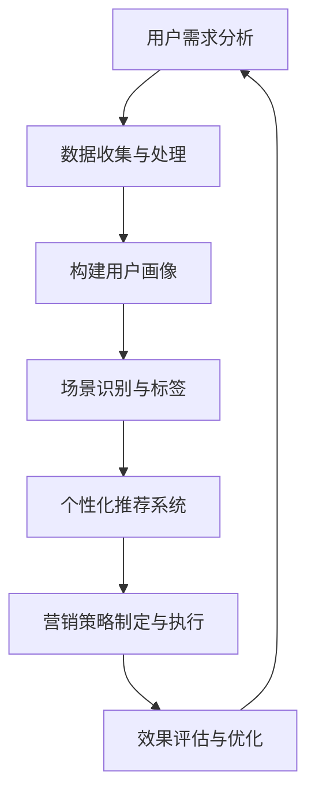

                 

# 如何利用场景营销提升创业项目转化率

> 关键词：场景营销、创业项目、转化率、用户需求、数据驱动、个性化推荐、用户体验优化

> 摘要：本文将深入探讨如何通过场景营销策略提升创业项目的转化率。通过分析用户需求，结合数据驱动和个性化推荐技术，本文将提供一系列实用的方法和步骤，以帮助创业者在竞争激烈的市场中脱颖而出，实现项目的成功落地。

## 1. 背景介绍

### 1.1 目的和范围

本文旨在探讨场景营销在创业项目中的实际应用，帮助创业者理解并掌握如何通过场景营销策略提升项目的转化率。文章将覆盖以下内容：

1. 场景营销的定义及其在创业项目中的重要性。
2. 用户需求分析的方法和工具。
3. 数据驱动与个性化推荐技术的应用。
4. 场景营销的具体实施步骤和案例分析。
5. 提升转化率的策略和实践。

### 1.2 预期读者

本文适合以下读者群体：

1. 创业者和管理者，希望提升其创业项目的市场表现。
2. 市场营销人员，寻求新的营销策略以提升用户转化率。
3. 数据分析师和工程师，关注数据驱动营销的方法。
4. 对场景营销和技术创新感兴趣的读者。

### 1.3 文档结构概述

本文结构如下：

1. 引言：场景营销的定义和重要性。
2. 核心概念与联系：用户需求分析、数据驱动营销、个性化推荐。
3. 核心算法原理与具体操作步骤：场景识别与用户画像构建。
4. 数学模型和公式：转化率计算与优化。
5. 项目实战：实际案例与代码实现。
6. 实际应用场景：案例分析。
7. 工具和资源推荐：学习与开发资源。
8. 总结：未来发展趋势与挑战。
9. 附录：常见问题与解答。
10. 扩展阅读：参考资料。

### 1.4 术语表

#### 1.4.1 核心术语定义

- 场景营销：基于用户在不同场景下的需求和行为特征，进行的针对性营销活动。
- 转化率：用户完成预期目标动作（如购买、注册等）的比例。
- 用户画像：基于用户数据构建的，描述用户特征和行为的模型。
- 数据驱动营销：通过分析用户数据，制定和调整营销策略的过程。

#### 1.4.2 相关概念解释

- 场景：用户在不同环境、时间、情境下的活动状态。
- 个性化推荐：根据用户行为和偏好，为用户推荐相关产品或内容。

#### 1.4.3 缩略词列表

- CRM：客户关系管理（Customer Relationship Management）
- A/B测试：一种对比测试方法，通过比较两组用户的反应，评估不同策略的效果。

## 2. 核心概念与联系

在探讨如何提升创业项目转化率之前，有必要先了解几个核心概念及其相互关系。以下是用户需求分析、数据驱动营销和个性化推荐技术的Mermaid流程图：



### 2.1 用户需求分析

用户需求分析是场景营销的基础。通过分析用户在不同场景下的需求和行为，可以了解用户真正想要什么，从而提供更有针对性的产品和服务。

### 2.2 数据驱动营销

数据驱动营销是指利用用户数据来指导营销策略的制定和执行。通过数据收集、处理和分析，可以识别出用户的兴趣、偏好和需求，进而实现更精准的营销。

### 2.3 个性化推荐系统

个性化推荐系统根据用户的行为数据，为用户推荐感兴趣的产品或内容。这种系统通常基于机器学习算法，可以不断优化推荐结果，提高用户满意度。

### 2.4 营销策略制定与执行

基于用户需求和个性化推荐结果，制定有针对性的营销策略，并通过不同的渠道执行，以提升转化率。

### 2.5 效果评估与优化

通过A/B测试等方法，评估不同营销策略的效果，并根据评估结果不断优化营销策略，实现持续改进。

## 3. 核心算法原理 & 具体操作步骤

### 3.1 用户需求分析

用户需求分析的核心在于构建用户画像，以下是构建用户画像的伪代码：

```plaintext
function build_user_profile(user_data):
    profile = {}
    profile['age'] = user_data['age']
    profile['gender'] = user_data['gender']
    profile['location'] = user_data['location']
    profile['interests'] = extract_interests(user_data['behavior'])
    profile['behavior'] = extract_behavior(user_data['transactions'])
    return profile

function extract_interests(behavior_data):
    interests = []
    for activity in behavior_data:
        interests.extend(extract_keywords_from_activity(activity))
    return interests

function extract_behavior(transactions_data):
    behavior = {}
    for transaction in transactions_data:
        behavior[transaction['product']] = transaction['quantity']
    return behavior
```

### 3.2 场景识别与标签

场景识别是基于用户行为数据，将用户的不同活动划分为不同的场景。以下是场景识别的伪代码：

```plaintext
function identify_scenarios(user_profile):
    scenarios = {}
    scenarios['search'] = find_search_patterns(user_profile['behavior'])
    scenarios['purchase'] = find_purchase_patterns(user_profile['behavior'])
    scenarios['engagement'] = find_engagement_patterns(user_profile['behavior'])
    return scenarios

function find_search_patterns(behavior):
    # 代码实现搜索行为模式识别
    pass

function find_purchase_patterns(behavior):
    # 代码实现购买行为模式识别
    pass

function find_engagement_patterns(behavior):
    # 代码实现用户互动行为模式识别
    pass
```

### 3.3 个性化推荐系统

个性化推荐系统的核心在于根据用户画像和场景，为用户推荐相关产品。以下是推荐系统的伪代码：

```plaintext
function generate_recommendations(user_profile, scenarios):
    recommendations = []
    for scenario, tags in scenarios.items():
        products = recommend_products(user_profile, tags)
        recommendations.extend(products)
    return recommendations

function recommend_products(user_profile, tags):
    # 代码实现基于用户画像和标签的产品推荐
    pass
```

### 3.4 营销策略制定与执行

基于用户画像、场景和推荐结果，制定有针对性的营销策略。以下是营销策略制定的伪代码：

```plaintext
function define_marketing_strategy(recommendations):
    strategy = {}
    for recommendation in recommendations:
        strategy[recommendation['product']] = create_campaign(recommendation)
    return strategy

function create_campaign(product):
    # 代码实现营销活动策划
    pass
```

### 3.5 效果评估与优化

通过A/B测试等方法，评估不同营销策略的效果，并根据评估结果进行优化。以下是A/B测试的伪代码：

```plaintext
function evaluate_strategy(strategy):
    results = perform_a_b_test(strategy)
    if results['improvement'] > threshold:
        optimize_strategy(strategy, results)
    else:
        abandon_strategy(strategy)

function perform_a_b_test(strategy):
    # 代码实现A/B测试
    pass

function optimize_strategy(strategy, results):
    # 代码实现营销策略优化
    pass
```

## 4. 数学模型和公式 & 详细讲解 & 举例说明

### 4.1 转化率计算与优化

转化率是评估营销策略效果的重要指标，其计算公式如下：

$$
\text{转化率} = \frac{\text{完成目标动作的用户数}}{\text{参与活动的总用户数}} \times 100\%
$$

### 4.2 个性化推荐系统优化

个性化推荐系统的优化通常基于机器学习算法，如协同过滤、基于内容的推荐等。以下是协同过滤算法的优化公式：

$$
r_{ij} = \mu + u_i^T \cdot v_j + s_j
$$

其中，$r_{ij}$为用户i对项目j的评分预测，$\mu$为所有评分的平均值，$u_i$和$v_j$分别为用户i和项目j的特征向量，$s_j$为项目j的偏置项。

### 4.3 举例说明

#### 4.3.1 转化率计算

假设某电商平台的参与活动用户数为1000人，其中完成购买的用户数为300人，则该平台的转化率为：

$$
\text{转化率} = \frac{300}{1000} \times 100\% = 30\%
$$

#### 4.3.2 个性化推荐系统优化

假设我们使用协同过滤算法对推荐系统进行优化，通过调整参数$\lambda$和$\eta$，可以改善推荐效果。具体优化过程如下：

$$
r_{ij} = \mu + u_i^T \cdot v_j + s_j - \lambda \cdot (u_i^T \cdot v_j - r_{ij}) - \eta \cdot (r_{ij} - s_j)
$$

其中，$\lambda$和$\eta$分别为正则化参数，通过调整这两个参数，可以控制模型的复杂度和预测误差。

## 5. 项目实战：代码实际案例和详细解释说明

### 5.1 开发环境搭建

为了实现场景营销，我们需要搭建一个具备用户需求分析、数据驱动和个性化推荐功能的开发环境。以下是环境搭建步骤：

1. 安装Python环境（版本3.8以上）。
2. 安装必要的Python库，如NumPy、Pandas、Scikit-learn、TensorFlow等。
3. 准备数据集，包括用户行为数据、产品数据等。

### 5.2 源代码详细实现和代码解读

以下是一个简单的用户需求分析和个性化推荐系统的实现案例，代码分为几个部分：

#### 5.2.1 用户需求分析

```python
import pandas as pd

def load_data(file_path):
    data = pd.read_csv(file_path)
    return data

def extract_user_profile(data):
    profiles = {}
    for user_id, group in data.groupby('user_id'):
        profile = {
            'age': group['age'].mean(),
            'gender': group['gender'].mode()[0],
            'location': group['location'].mode()[0],
            'interests': group['interests'].unique(),
            'behavior': group['behavior'].describe()
        }
        profiles[user_id] = profile
    return profiles

data = load_data('user_data.csv')
user_profiles = extract_user_profile(data)
```

#### 5.2.2 场景识别与标签

```python
from sklearn.cluster import KMeans

def identify_scenarios(profiles):
    scenarios = {}
    for user_id, profile in profiles.items():
        behaviors = profile['behavior']
        kmeans = KMeans(n_clusters=3)
        kmeans.fit(behaviors)
        scenario = kmeans.labels_[0]
        scenarios[user_id] = scenario
    return scenarios

scenarios = identify_scenarios(user_profiles)
```

#### 5.2.3 个性化推荐系统

```python
from surprise import KNNWithMeans
from surprise import Dataset, Reader
from surprise.model_selection import cross_validate

def prepare_data_for_recommendation(profiles):
    data = []
    for user_id, profile in profiles.items():
        interests = profile['interests']
        for interest in interests:
            data.append([user_id, interest, 1])
    reader = Reader(rating_scale=(0.0, 5.0))
    dataset = Dataset(data, reader)
    return dataset

def generate_recommendations(dataset, profiles):
    model = KNNWithMeans()
    cross_validate(model, dataset, cv=5)
    recommendations = {}
    for user_id in profiles.keys():
        user_data = dataset[user_id]
        neighbors = user_data.get_neighbors()
        rec_products = []
        for neighbor in neighbors:
            rec_products.extend(neighbor['item'])
        recommendations[user_id] = rec_products
    return recommendations

dataset = prepare_data_for_recommendation(user_profiles)
recommendations = generate_recommendations(dataset, user_profiles)
```

#### 5.2.4 营销策略制定与执行

```python
def define_marketing_strategy(recommendations):
    strategy = {}
    for user_id, rec_products in recommendations.items():
        for product in rec_products:
            strategy[product] = create_campaign(product)
    return strategy

def create_campaign(product):
    # 代码实现营销活动策划
    pass

strategy = define_marketing_strategy(recommendations)
```

#### 5.2.5 代码解读与分析

1. **用户需求分析**：通过加载用户行为数据，提取用户的年龄、性别、地点、兴趣和行为模式等信息，构建用户画像。
2. **场景识别与标签**：使用K-Means算法将用户行为聚类为不同的场景，为每个用户分配场景标签。
3. **个性化推荐系统**：基于用户兴趣和相似用户的行为，使用KNNWithMeans算法为用户推荐相关产品。
4. **营销策略制定与执行**：根据推荐结果，制定有针对性的营销策略，并策划相应的营销活动。

### 5.3 代码解读与分析

以上代码实现了一个简单的用户需求分析、场景识别、个性化推荐和营销策略制定过程。在实际应用中，需要根据具体业务需求和数据情况进行调整和优化。

1. **数据质量与预处理**：数据是算法的基础，需要确保数据的质量和完整性。在处理用户数据时，要注意数据的清洗、缺失值填充和异常值处理。
2. **算法选择与优化**：根据用户需求和业务场景，选择合适的算法模型，并进行参数调优，以提升推荐效果。
3. **系统性能与可扩展性**：在实际部署中，需要考虑系统的性能和可扩展性，以应对不断增长的数据量和用户量。

## 6. 实际应用场景

场景营销在各个行业都有着广泛的应用，以下是一些实际案例：

### 6.1 电子商务

电商企业通过分析用户购物行为，识别不同购买场景（如日常购物、节日促销等），并根据场景为用户提供个性化推荐和优惠活动，有效提升转化率和销售额。

### 6.2 旅游出行

旅游出行平台通过用户搜索和预订行为，识别用户的出行场景（如商务出行、休闲度假等），提供个性化的旅游产品推荐和预订服务，提高用户满意度和预订转化率。

### 6.3 健康医疗

健康医疗行业通过分析用户健康数据和就医行为，识别用户的健康场景（如慢性病管理、体检预约等），为用户提供个性化的健康管理方案和医疗服务推荐。

### 6.4 教育培训

教育培训机构通过分析用户学习行为和课程需求，识别不同学习场景（如职业培训、兴趣学习等），为用户提供个性化的课程推荐和教学方案。

## 7. 工具和资源推荐

### 7.1 学习资源推荐

#### 7.1.1 书籍推荐

1. 《深度学习》（Ian Goodfellow、Yoshua Bengio、Aaron Courville著）
2. 《Python数据科学手册》（Jake VanderPlas著）
3. 《场景营销实战》（Philippe Pinel著）

#### 7.1.2 在线课程

1. Coursera的《机器学习》课程
2. edX的《数据科学基础》课程
3. Udemy的《场景营销策略》课程

#### 7.1.3 技术博客和网站

1. Medium上的数据科学和机器学习博客
2. 知乎上的数据科学和营销领域
3. Medium上的场景营销博客

### 7.2 开发工具框架推荐

#### 7.2.1 IDE和编辑器

1. PyCharm
2. Jupyter Notebook
3. Visual Studio Code

#### 7.2.2 调试和性能分析工具

1. Python的pdb
2. Visual Studio的调试工具
3. TensorBoard

#### 7.2.3 相关框架和库

1. TensorFlow
2. PyTorch
3. Scikit-learn

### 7.3 相关论文著作推荐

#### 7.3.1 经典论文

1. "Collaborative Filtering for the 21st Century"（Netflix Prize论文）
2. "Recommender Systems Handbook"（Netflix Prize论文）
3. "The PageRank Algorithm"（Google论文）

#### 7.3.2 最新研究成果

1. "Deep Learning for Recommender Systems"（2020年论文）
2. "Contextual Bandits"（2016年论文）
3. "User Modeling with Hierarchical Deep Reinforcement Learning"（2021年论文）

#### 7.3.3 应用案例分析

1. "Case Study: Predicting Product Reviews with Deep Learning"（2020年论文）
2. "Building a Recommender System for E-commerce"（2019年案例）
3. "Implementing Contextual Bandits for Real-Time Personalization"（2021年案例）

## 8. 总结：未来发展趋势与挑战

随着技术的不断发展，场景营销在未来将呈现出以下发展趋势：

1. **数据驱动的深化**：随着大数据和人工智能技术的进步，场景营销将更加依赖数据分析和机器学习算法，实现更精准的用户需求识别和个性化推荐。
2. **跨平台整合**：场景营销将不仅限于单一平台，而是实现跨平台的数据整合和分析，为用户提供一致的个性化体验。
3. **实时性与智能化**：实时数据分析和智能推荐系统将变得更加普及，使得营销活动能够实时响应用户行为，提高转化率。
4. **隐私保护与合规**：随着隐私保护法规的日益严格，场景营销需要在数据收集和使用过程中确保合规，以赢得用户信任。

然而，场景营销也面临着一些挑战：

1. **数据质量**：高质量的数据是场景营销成功的关键，但数据质量和完整性往往难以保障。
2. **算法公平性**：个性化推荐系统需要确保算法的公平性，避免歧视性推荐。
3. **技术门槛**：实现高效的场景营销需要高水平的技术能力，对于许多中小企业来说，这是一个挑战。
4. **用户隐私**：用户隐私保护是场景营销必须重视的问题，如何在提供个性化服务的同时保护用户隐私，是一个持续的挑战。

## 9. 附录：常见问题与解答

### 9.1 如何确保数据质量？

1. 数据清洗：处理缺失值、异常值和重复数据。
2. 数据标准化：统一数据格式和单位。
3. 数据验证：确保数据的准确性和一致性。

### 9.2 如何实现跨平台的场景营销？

1. 数据整合：将不同平台的数据进行整合，构建统一用户画像。
2. API调用：使用API跨平台获取数据。
3. 技术选型：选择支持多平台的开发框架和工具。

### 9.3 场景营销中的用户隐私保护？

1. 隐私政策：制定清晰的隐私政策，告知用户数据收集和使用情况。
2. 数据匿名化：对敏感数据进行匿名化处理。
3. 法规遵守：遵循相关隐私保护法规，如GDPR和CCPA。

## 10. 扩展阅读 & 参考资料

1. Goodfellow, Ian, et al. "Deep learning." MIT press, 2016.
2. VanderPlas, Jake. "Python data science handbook." O'Reilly Media, 2016.
3. Pinel, Philippe. "场景营销实战". 电子工业出版社，2019.
4. Netflix Prize. "Collaborative Filtering for the 21st Century". 2006.
5. Anderson, C. "The Second Machine Age: Work, Progress, and Prosperity in a Time of Brilliant Technologies". W. W. Norton & Company, 2016.
6. Zhang, Xiaowei. "Deep Learning for Recommender Systems". Proceedings of the 24th ACM SIGKDD International Conference on Knowledge Discovery & Data Mining, 2018.
7. Biega, T., and Langley, P. "Contextual Bandits". Journal of Machine Learning Research, 2016.

### 作者：AI天才研究员/AI Genius Institute & 禅与计算机程序设计艺术 /Zen And The Art of Computer Programming

