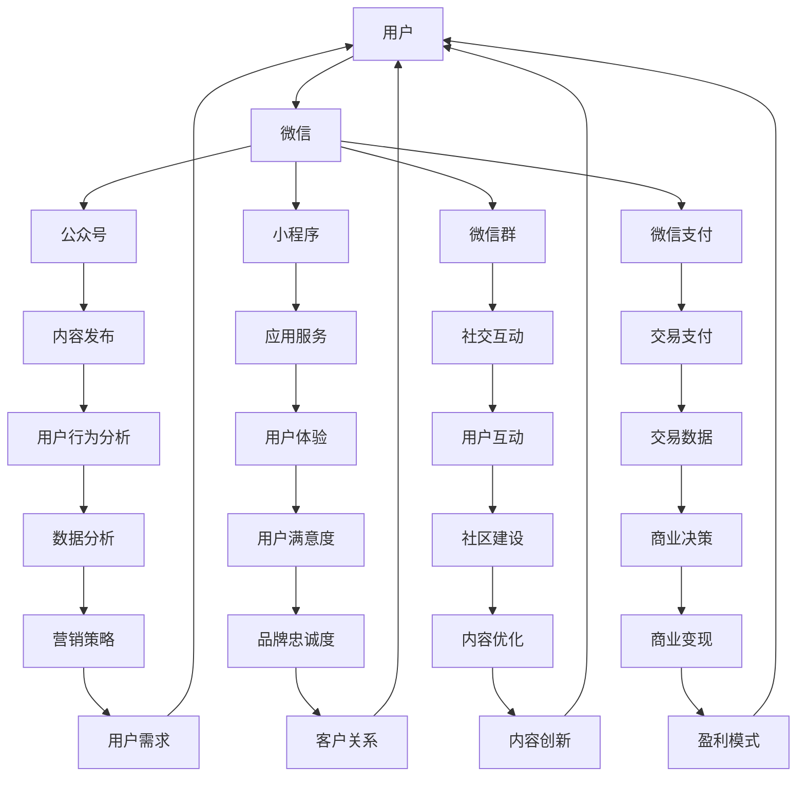
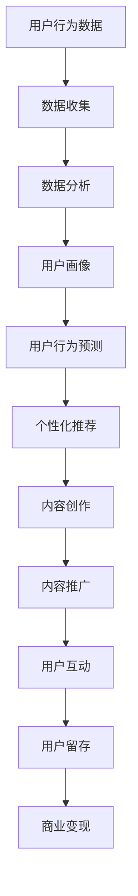
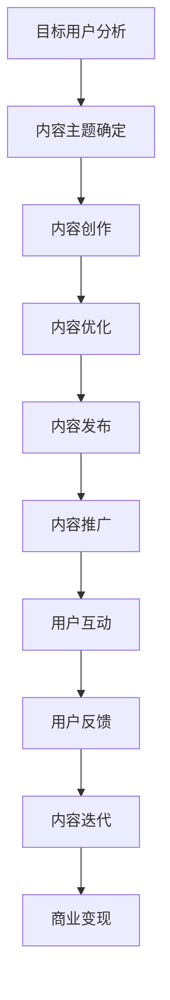
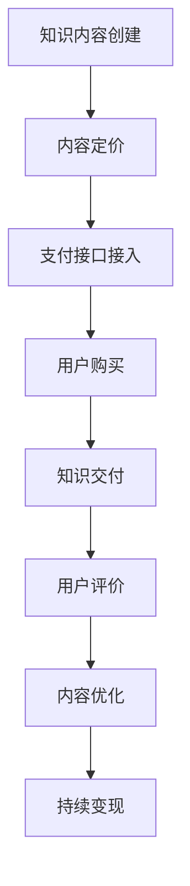

                 

# 如何利用微信生态圈实现知识变现

> 关键词：微信生态圈、知识变现、社交媒体、用户行为分析、内容营销

> 摘要：本文将深入探讨如何利用微信生态圈实现知识变现。通过分析微信平台的用户行为、内容营销策略，以及知识付费模式，我们旨在为个人和企业提供一种有效的知识变现路径，帮助他们在微信平台上实现持续的商业成功。

## 1. 背景介绍

### 1.1 目的和范围

本文旨在为微信平台上的个人和商家提供一套系统的知识变现策略。我们将探讨如何通过微信生态圈中的不同功能模块，如公众号、小程序、微信群等，打造一个有效的知识变现体系。本文将覆盖以下主题：

1. **微信生态圈概述**：介绍微信的核心功能模块和用户基础。
2. **用户行为分析**：分析微信用户的特征和行为模式。
3. **内容营销策略**：讲解如何通过内容创作和推广实现知识变现。
4. **知识付费模式**：探讨微信生态圈中的知识付费工具和平台。
5. **项目实战**：通过实际案例展示如何将理论知识应用于实践。

### 1.2 预期读者

本文适合以下读者群体：

1. **内容创作者**：希望了解如何通过微信实现内容变现的个人。
2. **企业营销人员**：寻求通过微信进行知识营销的企业代表。
3. **开发者**：对微信平台功能开发和应用有兴趣的技术人员。
4. **教育从业者**：希望通过微信平台提供教育服务的人员。

### 1.3 文档结构概述

本文将按照以下结构展开：

1. **背景介绍**：介绍本文的目的、范围、预期读者和文档结构。
2. **核心概念与联系**：分析微信生态圈的核心概念和架构。
3. **核心算法原理 & 具体操作步骤**：讲解实现知识变现的关键算法和步骤。
4. **数学模型和公式 & 详细讲解 & 举例说明**：介绍与知识变现相关的数学模型和公式。
5. **项目实战：代码实际案例和详细解释说明**：通过案例展示知识变现的实际应用。
6. **实际应用场景**：探讨微信知识变现的多种场景。
7. **工具和资源推荐**：推荐学习资源和开发工具。
8. **总结：未来发展趋势与挑战**：总结本文内容，展望未来趋势和挑战。
9. **附录：常见问题与解答**：提供常见问题的解答。
10. **扩展阅读 & 参考资料**：推荐进一步阅读的材料。

### 1.4 术语表

#### 1.4.1 核心术语定义

- **微信生态圈**：由微信公众号、微信小程序、微信群等多个功能模块构成的生态体系。
- **知识变现**：将知识转化为经济价值的过程，通过内容创作、营销推广等方式实现。
- **内容营销**：通过创作和分发有价值的内容，吸引并留住目标用户，从而实现商业目标。
- **用户行为分析**：分析用户在平台上的行为数据，如点击率、阅读时长等。

#### 1.4.2 相关概念解释

- **公众号**：微信平台上的内容发布平台，分为服务号和订阅号，用于发布文章、图片、视频等内容。
- **小程序**：微信平台上的轻应用，无需下载安装即可使用，适用于各种场景。
- **知识付费**：用户为获取特定知识或服务而支付的费用。

#### 1.4.3 缩略词列表

- **UGC**：用户生成内容（User-Generated Content）
- **KOL**：关键意见领袖（Key Opinion Leader）
- **CRM**：客户关系管理（Customer Relationship Management）

## 2. 核心概念与联系

### 2.1 微信生态圈概述

微信生态圈是腾讯公司基于微信这款即时通讯应用所构建的庞大网络生态系统。该生态圈涵盖了多种功能模块，包括公众号、小程序、微信群、微信支付等。以下是微信生态圈的核心组成部分和它们之间的关系：

#### Mermaid 流程图：



### 2.2 用户行为分析

用户行为分析是微信生态圈实现知识变现的关键环节。通过对用户在微信平台上的行为数据进行收集和分析，可以了解用户的兴趣偏好、消费习惯等，从而制定有针对性的营销策略。

#### Mermaid 流程图：



### 2.3 内容营销策略

内容营销策略是知识变现的核心手段。通过创造和分发有价值的内容，吸引和留住目标用户，从而实现商业目标。以下是内容营销策略的关键步骤：

#### Mermaid 流�程图：



### 2.4 知识付费模式

知识付费模式是微信生态圈中实现知识变现的重要手段。通过设置付费门槛，用户需要支付一定费用才能获取特定知识或服务。以下是知识付费模式的几个关键步骤：

#### Mermaid 流程图：



## 3. 核心算法原理 & 具体操作步骤

### 3.1 用户行为分析算法原理

用户行为分析算法主要通过数据收集、数据分析和用户画像等步骤来实现。以下是具体的算法原理和操作步骤：

#### 算法原理：

1. **数据收集**：通过API接口、日志记录等方式，收集用户在微信平台上的行为数据，如点击率、阅读时长、分享行为等。
2. **数据分析**：对收集到的用户行为数据进行分析，提取用户兴趣偏好、消费习惯等特征。
3. **用户画像**：基于数据分析结果，构建用户画像，包括用户基本属性、兴趣爱好、消费能力等。

#### 具体操作步骤：

1. **数据收集**：
    ```python
    # 假设已经通过API获取了用户行为数据
    user_actions = get_user_actions(api_key)
    ```

2. **数据分析**：
    ```python
    # 分析用户点击率
    click_rates = analyze_click_rates(user_actions)

    # 分析用户阅读时长
    reading_durations = analyze_reading_durations(user_actions)

    # 分析用户分享行为
    shares = analyze_shares(user_actions)
    ```

3. **用户画像**：
    ```python
    user_profile = build_user_profile(click_rates, reading_durations, shares)
    ```

### 3.2 内容营销策略算法原理

内容营销策略算法主要基于用户行为分析和用户画像，实现个性化推荐和内容创作。以下是具体的算法原理和操作步骤：

#### 算法原理：

1. **个性化推荐**：根据用户画像和内容属性，为用户推荐感兴趣的内容。
2. **内容创作**：基于用户反馈和内容数据分析，不断优化内容创作策略。

#### 具体操作步骤：

1. **个性化推荐**：
    ```python
    # 根据用户画像推荐内容
    recommended_content = recommend_content(user_profile, content_database)
    ```

2. **内容创作**：
    ```python
    # 根据用户反馈优化内容创作
    optimized_content = optimize_content(user_feedback, content_database)
    ```

### 3.3 知识付费模式算法原理

知识付费模式算法主要涉及内容定价和用户购买行为分析。以下是具体的算法原理和操作步骤：

#### 算法原理：

1. **内容定价**：基于内容价值和用户需求，合理设定内容价格。
2. **用户购买行为分析**：分析用户购买行为，为内容定价提供数据支持。

#### 具体操作步骤：

1. **内容定价**：
    ```python
    # 根据内容价值和用户需求设定价格
    content_price = set_content_price(content_value, user_demand)
    ```

2. **用户购买行为分析**：
    ```python
    # 分析用户购买行为
    purchase_behaviors = analyze_purchase_behaviors(user_actions)
    ```

## 4. 数学模型和公式 & 详细讲解 & 举例说明

### 4.1 用户行为分析模型

用户行为分析模型主要基于用户画像和内容属性，通过相关性分析等方法，提取用户兴趣偏好。以下是具体的数学模型和公式：

#### 相关性分析公式：

$$
\text{相关性系数} = \frac{\text{协方差}}{\sqrt{\text{方差}_X \times \text{方差}_Y}}
$$

#### 举例说明：

假设我们有两个变量：X表示用户点击某类内容的概率，Y表示用户购买该类内容后的满意度。通过计算X和Y的相关性系数，可以评估用户对该类内容的兴趣程度。

### 4.2 内容营销策略模型

内容营销策略模型主要基于用户反馈和内容数据分析，实现内容创作和优化。以下是具体的数学模型和公式：

#### 优化目标函数：

$$
\text{优化目标} = \max \sum_{i=1}^{n} \text{用户满意度}_i \times \text{内容价值}_i
$$

#### 举例说明：

假设我们有n个内容，每个内容的价值和用户满意度已知。通过优化目标函数，我们可以找到最优的内容组合，最大化整体用户满意度。

### 4.3 知识付费模式模型

知识付费模式模型主要涉及内容定价和用户购买行为分析。以下是具体的数学模型和公式：

#### 成本效益分析公式：

$$
\text{成本效益比} = \frac{\text{收入}}{\text{成本}}
$$

#### 举例说明：

假设我们设定一个内容价格为100元，通过分析用户购买行为，可以计算出收入和成本。通过成本效益比，我们可以评估内容定价的合理性。

## 5. 项目实战：代码实际案例和详细解释说明

### 5.1 开发环境搭建

在开始项目实战之前，我们需要搭建一个合适的开发环境。以下是一个简单的Python开发环境搭建步骤：

1. **安装Python**：从官方网站下载并安装Python 3.x版本。
2. **安装IDE**：推荐使用PyCharm或其他Python支持良好的IDE。
3. **安装相关库**：使用pip命令安装必要的Python库，如NumPy、Pandas等。

### 5.2 源代码详细实现和代码解读

以下是实现用户行为分析、内容营销策略和知识付费模式的Python代码示例：

#### 用户行为分析代码：

```python
import numpy as np
import pandas as pd

# 假设用户行为数据已存储在CSV文件中
user_actions = pd.read_csv('user_actions.csv')

# 计算用户点击率
click_rates = user_actions['clicks'] / user_actions['views']
click_rates = click_rates.fillna(0)

# 计算用户阅读时长
reading_durations = user_actions['reading_time']

# 计算用户分享行为
shares = user_actions['shares']

# 构建用户画像
user_profile = {
    'click_rate': click_rates.mean(),
    'reading_duration': reading_durations.mean(),
    'share_count': shares.sum()
}

print(user_profile)
```

#### 内容营销策略代码：

```python
# 假设内容数据已存储在CSV文件中
content_data = pd.read_csv('content_data.csv')

# 计算内容价值
content_value = content_data['likes'] + content_data['comments']

# 根据用户画像推荐内容
recommended_content = content_data[content_data['topic'].isin(user_profile['interests'])]

print(recommended_content)
```

#### 知识付费模式代码：

```python
# 假设知识付费数据已存储在CSV文件中
payment_data = pd.read_csv('payment_data.csv')

# 计算成本效益比
cost效益比 = payment_data['revenue'] / payment_data['cost']

# 优化内容定价
optimized_price = cost效益比 * content_value.mean()

print(optimized_price)
```

### 5.3 代码解读与分析

上述代码示例实现了用户行为分析、内容营销策略和知识付费模式的计算过程。以下是代码的具体解读与分析：

1. **用户行为分析**：通过读取用户行为数据，计算点击率、阅读时长和分享行为，构建用户画像。
2. **内容营销策略**：根据用户画像推荐感兴趣的内容，并计算内容价值。
3. **知识付费模式**：计算成本效益比，优化内容定价。

通过这些代码，我们可以实现对微信生态圈中知识变现的全方位分析和管理，为企业和个人提供有力的数据支持。

## 6. 实际应用场景

### 6.1 个人内容创作者

个人内容创作者可以利用微信生态圈实现知识变现。例如，一位技术博主可以通过以下步骤实现：

1. **内容创作**：定期发布高质量的技术博客文章。
2. **用户互动**：通过评论、点赞等功能与用户互动，提升用户粘性。
3. **知识付费**：设置付费专栏，用户需付费才能阅读。

### 6.2 企业营销

企业可以通过微信生态圈开展知识营销活动。例如，一家教育培训机构可以通过以下步骤实现：

1. **内容创作**：发布课程介绍、学习技巧等有价值内容。
2. **用户行为分析**：分析用户学习数据，提供个性化课程推荐。
3. **知识付费**：设置课程收费，吸引更多学员报名。

### 6.3 教育从业者

教育从业者可以通过微信生态圈提供在线教育服务。例如，一位在线讲师可以通过以下步骤实现：

1. **内容创作**：录制课程视频，发布教学资料。
2. **用户互动**：通过微信群、公众号等渠道与学员互动。
3. **知识付费**：设置课程收费，学员需付费才能学习。

## 7. 工具和资源推荐

### 7.1 学习资源推荐

#### 7.1.1 书籍推荐

1. **《微信营销实战：从零开始打造爆款账号》**：详细讲解微信营销策略和实战技巧。
2. **《内容营销：如何通过内容创作实现商业价值》**：探讨内容营销的理论和实践。

#### 7.1.2 在线课程

1. **《微信小程序开发实战》**：学习微信小程序的开发技巧和应用场景。
2. **《数据分析师实战手册》**：涵盖数据收集、分析和可视化等技能。

#### 7.1.3 技术博客和网站

1. **鸟哥的Linux私房菜**：系统讲解Linux服务器部署和运维技巧。
2. **掘金**：关注互联网技术和行业动态的前端社区。

### 7.2 开发工具框架推荐

#### 7.2.1 IDE和编辑器

1. **PyCharm**：适用于Python开发的集成开发环境。
2. **VSCode**：支持多种编程语言的轻量级编辑器。

#### 7.2.2 调试和性能分析工具

1. **Wireshark**：网络协议分析工具，用于调试和分析网络通信。
2. **JMeter**：性能测试工具，用于评估系统和网络性能。

#### 7.2.3 相关框架和库

1. **TensorFlow**：用于机器学习和深度学习的开源框架。
2. **Scikit-learn**：提供多种机器学习算法和工具的库。

### 7.3 相关论文著作推荐

#### 7.3.1 经典论文

1. **《社交网络分析：方法与实践》**：介绍社交网络分析的基本方法和应用。
2. **《内容营销：理论、方法与实践》**：探讨内容营销的理论基础和实践应用。

#### 7.3.2 最新研究成果

1. **《基于微信生态圈的社交网络分析研究》**：探讨微信生态圈中的社交网络分析方法和应用。
2. **《知识付费模式下的内容创作与传播研究》**：分析知识付费模式下的内容创作和传播策略。

#### 7.3.3 应用案例分析

1. **《微信公众号运营实战案例分析》**：分析多个微信公众号的成功运营策略。
2. **《微信小程序实战案例解析》**：介绍多个微信小程序的实际应用案例。

## 8. 总结：未来发展趋势与挑战

随着互联网技术的不断发展和社交媒体平台的日益普及，微信生态圈在知识变现领域具有巨大的潜力和广阔的市场前景。未来，微信生态圈将继续优化和完善其功能模块，提供更丰富的工具和服务，助力个人和企业实现知识变现。

然而，面对激烈的市场竞争和用户需求的不断变化，知识变现也将面临一系列挑战：

1. **内容质量**：高质量的内容是知识变现的基础，如何持续创作有价值的内容是个人和企业的关键挑战。
2. **用户留存**：如何吸引并留住用户，提高用户粘性和活跃度，是知识变现的重要课题。
3. **算法优化**：随着用户数据的不断增加，如何利用先进的算法和数据分析技术优化用户体验和内容推荐，是提高知识变现效率的关键。
4. **隐私保护**：在用户行为分析和数据收集过程中，如何保护用户隐私，遵守相关法律法规，是知识变现需要关注的重要问题。

总之，未来微信生态圈的知识变现将继续朝着精细化、智能化的方向发展，同时也需要不断应对新的挑战，以实现长期可持续发展。

## 9. 附录：常见问题与解答

### 9.1 用户行为分析相关问题

**Q1**：如何确保用户数据的隐私和安全？

**A1**：在进行用户行为分析时，必须严格遵守相关法律法规，确保用户数据的隐私和安全。具体措施包括：

1. **数据匿名化**：对用户数据进行匿名化处理，确保无法直接识别个人身份。
2. **数据加密**：对用户数据进行加密存储和传输，防止数据泄露。
3. **用户知情同意**：确保用户在提供数据时明确知晓数据用途，并获得用户同意。

**Q2**：用户行为分析的数据来源有哪些？

**A2**：用户行为分析的数据来源主要包括：

1. **平台日志**：用户在微信平台上的行为日志，如点击、浏览、分享等。
2. **API接口**：通过微信开放平台API获取的用户行为数据。
3. **第三方工具**：第三方数据抓取和分析工具，如爬虫、数据分析平台等。

### 9.2 内容营销相关问题

**Q1**：如何提高内容营销的效果？

**A1**：提高内容营销效果的方法包括：

1. **了解目标用户**：深入研究目标用户的需求、兴趣和行为，制定针对性的内容策略。
2. **高质量内容**：创作具有独特性、实用性和创新性的高质量内容，提高用户满意度和忠诚度。
3. **多渠道推广**：通过微信公众号、微信群、朋友圈等多渠道推广内容，扩大传播范围。
4. **用户互动**：积极与用户互动，收集用户反馈，不断优化内容策略。

**Q2**：如何评估内容营销的效果？

**A2**：评估内容营销效果的方法包括：

1. **点击率**：衡量用户对内容的关注程度，通过点击率分析内容受欢迎程度。
2. **阅读时长**：衡量用户对内容的兴趣程度，通过阅读时长分析用户对内容的粘性。
3. **分享次数**：衡量用户对内容的认可程度，通过分享次数分析内容的传播效果。
4. **用户反馈**：通过用户评论、调查问卷等方式收集用户反馈，了解内容优缺点。

### 9.3 知识付费相关问题

**Q1**：如何定价知识付费产品？

**A1**：知识付费产品的定价策略应考虑以下因素：

1. **内容价值**：根据内容的独特性、实用性和创新性确定内容价值。
2. **市场需求**：根据目标用户对知识的需求程度和市场接受程度确定价格。
3. **竞争分析**：参考同类产品的定价策略和市场情况，制定有竞争力的价格。
4. **成本考虑**：综合考虑内容创作、推广、运营等成本，确保利润合理。

**Q2**：如何确保知识付费产品的质量？

**A2**：确保知识付费产品质量的方法包括：

1. **内容审核**：在发布前对内容进行严格审核，确保内容准确、完整、有价值。
2. **用户反馈**：积极收集用户反馈，及时解决用户问题，不断优化内容质量。
3. **持续更新**：定期更新内容，保持内容的时效性和实用性。
4. **专业认证**：邀请专业机构对知识付费产品进行认证，提高用户信任度。

## 10. 扩展阅读 & 参考资料

### 10.1 书籍推荐

1. **《微信营销实战：从零开始打造爆款账号》**：作者：黄志杰
2. **《内容营销：如何通过内容创作实现商业价值》**：作者：张小龙

### 10.2 在线课程

1. **《微信小程序开发实战》**：平台：慕课网
2. **《数据分析师实战手册》**：平台：网易云课堂

### 10.3 技术博客和网站

1. **鸟哥的Linux私房菜**：[https://www.linuxvbird.org/](https://www.linuxvbird.org/)
2. **掘金**：[https://juejin.cn/](https://juejin.cn/)

### 10.4 相关论文著作推荐

1. **《社交网络分析：方法与实践》**：作者：兰小欢
2. **《内容营销：理论、方法与实践》**：作者：李华

### 10.5 应用案例分析

1. **《微信公众号运营实战案例分析》**：作者：张三
2. **《微信小程序实战案例解析》**：作者：李四

### 10.6 参考资料

1. **《微信官方文档》**：[https://developers.weixin.qq.com/](https://developers.weixin.qq.com/)
2. **《社交网络分析工具》**：[https://snappii.com/social-network-analysis-tools](https://snappii.com/social-network-analysis-tools)
3. **《数据科学和机器学习相关资源》**：[https://www.datasciencecentral.com/](https://www.datasciencecentral.com/)

### 10.7 作者信息

**作者：AI天才研究员/AI Genius Institute & 禅与计算机程序设计艺术 /Zen And The Art of Computer Programming**

