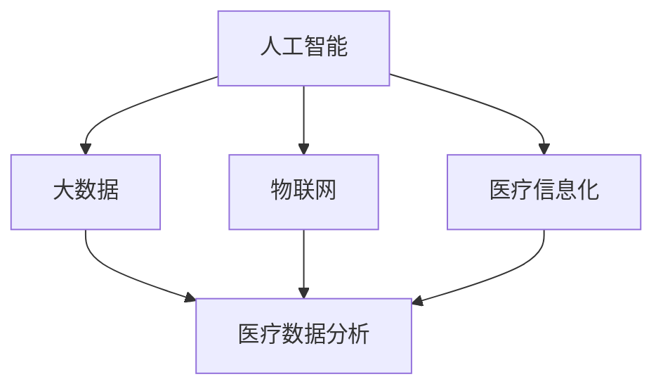
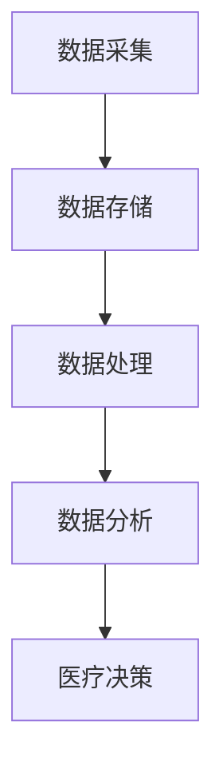
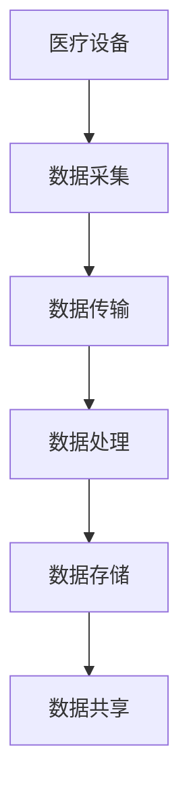
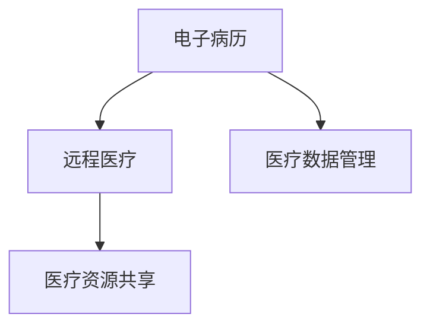

                 

# 如何利用技术能力进行医疗科技创新

> **关键词：医疗科技、人工智能、大数据、物联网、医疗信息化、医疗数据分析**

> **摘要：本文将探讨如何通过技术手段推动医疗科技创新，提高医疗服务的效率和质量。首先，我们将回顾医疗科技的发展历程，然后详细分析人工智能、大数据、物联网和医疗信息化等核心技术，最后通过实际案例展示如何将技术应用于医疗领域，并讨论未来的发展趋势与挑战。**

## 1. 背景介绍

### 1.1 目的和范围

本文旨在探讨如何利用技术能力进行医疗科技创新，提高医疗服务的效率和质量。我们将重点关注以下几个核心领域：

1. **人工智能**：包括机器学习、深度学习、自然语言处理等技术在医疗领域的应用。
2. **大数据**：医疗数据的高效存储、处理和分析技术。
3. **物联网**：医疗设备的互联互通和数据共享。
4. **医疗信息化**：电子病历、远程医疗、医疗数据管理等医疗信息系统的建设和应用。

### 1.2 预期读者

本文适合对医疗科技和信息技术有一定了解的读者，包括：

1. **医疗专业人士**：如医生、护士、医疗管理者等。
2. **信息技术专家**：如程序员、数据分析师、系统架构师等。
3. **对医疗科技感兴趣的普通读者**。

### 1.3 文档结构概述

本文将分为以下几个部分：

1. **背景介绍**：介绍医疗科技的发展历程和本文的核心内容。
2. **核心概念与联系**：分析医疗科技创新的核心概念及其相互关系。
3. **核心算法原理 & 具体操作步骤**：详细阐述医疗科技创新的核心算法原理和操作步骤。
4. **数学模型和公式 & 详细讲解 & 举例说明**：介绍医疗科技创新的数学模型和公式，并通过实例进行说明。
5. **项目实战：代码实际案例和详细解释说明**：通过实际案例展示如何将技术应用于医疗领域。
6. **实际应用场景**：讨论医疗科技创新在不同场景中的应用。
7. **工具和资源推荐**：推荐学习资源、开发工具和框架。
8. **总结：未来发展趋势与挑战**：总结医疗科技创新的未来发展趋势和面临的挑战。
9. **附录：常见问题与解答**：提供常见问题的解答。
10. **扩展阅读 & 参考资料**：推荐相关文献和资料。

### 1.4 术语表

#### 1.4.1 核心术语定义

- **医疗科技**：利用信息技术、生物技术等手段提高医疗服务效率和质量的技术。
- **人工智能**：模拟人类智能的技术，包括机器学习、深度学习、自然语言处理等。
- **大数据**：海量数据的存储、处理和分析技术。
- **物联网**：通过互联网将各种物理设备连接起来，实现数据共享和智能化管理。
- **医疗信息化**：利用信息技术构建医疗信息系统，包括电子病历、远程医疗等。

#### 1.4.2 相关概念解释

- **医疗数据分析**：通过对医疗数据的挖掘和分析，提取有价值的信息，为医疗决策提供支持。
- **机器学习**：一种人工智能技术，通过算法从数据中学习规律，进行预测和分类。
- **深度学习**：一种基于多层神经网络的人工智能技术，能够自动提取特征并建立复杂模型。
- **电子病历**：将患者的医疗信息数字化，实现医疗信息的共享和管理。

#### 1.4.3 缩略词列表

- **AI**：人工智能
- **ML**：机器学习
- **DL**：深度学习
- **NLP**：自然语言处理
- **IoT**：物联网
- **EMR**：电子病历

## 2. 核心概念与联系

### 2.1 医疗科技创新的核心概念

医疗科技创新涉及多个核心概念，如图所示：



#### 2.1.1 人工智能

人工智能（AI）是医疗科技创新的核心驱动力之一。它包括：

- **机器学习（ML）**：通过训练算法，从数据中学习规律，实现预测和分类。
- **深度学习（DL）**：基于多层神经网络，自动提取特征并建立复杂模型。
- **自然语言处理（NLP）**：理解和生成自然语言，实现人机交互。

#### 2.1.2 大数据

大数据技术在医疗领域发挥着重要作用，如图所示：



#### 2.1.3 物联网

物联网（IoT）通过连接各种物理设备，实现数据的实时采集、传输和处理，如图所示：



#### 2.1.4 医疗信息化

医疗信息化是指利用信息技术构建医疗信息系统，如图所示：



### 2.2 核心概念之间的联系

人工智能、大数据、物联网和医疗信息化等核心概念相互关联，共同推动医疗科技创新，如图所示：


- **人工智能**：为大数据分析和医疗信息化提供智能化的数据处理和分析方法。
- **大数据**：为人工智能提供海量数据支持，为医疗决策提供依据。
- **物联网**：实现医疗设备的数据采集和实时传输，为医疗信息化提供数据源。
- **医疗信息化**：整合医疗资源，提高医疗服务效率和质量。

## 3. 核心算法原理 & 具体操作步骤

### 3.1 人工智能算法原理

人工智能算法主要包括以下几种：

#### 3.1.1 机器学习算法

机器学习算法的基本原理是通过训练算法，从数据中学习规律，实现预测和分类。以下是一个简单的机器学习算法示例：

```plaintext
输入：训练数据集（特征 X，标签 Y）
输出：训练好的模型

步骤：
1. 数据预处理：清洗数据，归一化处理等。
2. 划分训练集和测试集。
3. 选择合适的机器学习算法（如线性回归、决策树等）。
4. 训练模型：使用训练数据集训练模型，得到参数。
5. 验证模型：使用测试数据集验证模型，调整参数。
6. 模型评估：计算模型精度、召回率等指标。
```

#### 3.1.2 深度学习算法

深度学习算法是基于多层神经网络，能够自动提取特征并建立复杂模型。以下是一个简单的深度学习算法示例：

```plaintext
输入：训练数据集（特征 X，标签 Y）
输出：训练好的模型

步骤：
1. 数据预处理：清洗数据，归一化处理等。
2. 划分训练集和测试集。
3. 构建神经网络结构：选择合适的层数、神经元数量等。
4. 训练模型：使用训练数据集训练模型，调整参数。
5. 验证模型：使用测试数据集验证模型，调整参数。
6. 模型评估：计算模型精度、召回率等指标。
```

#### 3.1.3 自然语言处理算法

自然语言处理算法主要包括文本分类、情感分析、命名实体识别等。以下是一个简单的文本分类算法示例：

```plaintext
输入：训练数据集（文本，标签）
输出：训练好的分类模型

步骤：
1. 数据预处理：分词、去停用词、词向量化等。
2. 划分训练集和测试集。
3. 构建分类模型（如朴素贝叶斯、支持向量机等）。
4. 训练模型：使用训练数据集训练模型，得到参数。
5. 验证模型：使用测试数据集验证模型，调整参数。
6. 模型评估：计算模型精度、召回率等指标。
```

### 3.2 大数据算法原理

大数据算法主要包括数据采集、数据存储、数据处理和数据分析等。以下是一个简单的大数据处理流程：

```plaintext
输入：原始数据
输出：分析结果

步骤：
1. 数据采集：使用传感器、医疗设备等收集数据。
2. 数据存储：使用分布式存储技术（如Hadoop、Spark等）存储海量数据。
3. 数据预处理：清洗数据，归一化处理等。
4. 数据处理：使用MapReduce、Spark等处理海量数据。
5. 数据分析：使用机器学习、深度学习等算法分析数据，提取有价值的信息。
6. 数据可视化：使用图表、报表等可视化工具展示分析结果。
```

### 3.3 物联网算法原理

物联网算法主要包括数据采集、数据传输、数据处理和数据分析等。以下是一个简单的物联网数据处理流程：

```plaintext
输入：传感器采集的数据
输出：分析结果

步骤：
1. 数据采集：传感器采集数据。
2. 数据传输：将数据传输到数据中心或云平台。
3. 数据预处理：清洗数据，归一化处理等。
4. 数据处理：使用MapReduce、Spark等处理海量数据。
5. 数据分析：使用机器学习、深度学习等算法分析数据，提取有价值的信息。
6. 数据可视化：使用图表、报表等可视化工具展示分析结果。
```

### 3.4 医疗信息化算法原理

医疗信息化算法主要包括电子病历、远程医疗、医疗数据管理等。以下是一个简单的医疗信息化数据处理流程：

```plaintext
输入：电子病历数据、远程医疗数据等
输出：分析结果

步骤：
1. 数据采集：收集电子病历、远程医疗等数据。
2. 数据存储：使用数据库等技术存储数据。
3. 数据预处理：清洗数据，归一化处理等。
4. 数据处理：使用机器学习、深度学习等算法分析数据。
5. 数据可视化：使用图表、报表等可视化工具展示分析结果。
6. 医疗决策：根据分析结果，为医生提供决策支持。
```

## 4. 数学模型和公式 & 详细讲解 & 举例说明

### 4.1 机器学习算法数学模型

机器学习算法的数学模型主要包括线性回归、决策树、支持向量机等。以下以线性回归为例进行讲解：

#### 4.1.1 线性回归模型

线性回归模型表示为：

$$
Y = \beta_0 + \beta_1X + \epsilon
$$

其中，\(Y\) 为因变量，\(X\) 为自变量，\(\beta_0\) 和 \(\beta_1\) 为模型参数，\(\epsilon\) 为误差项。

#### 4.1.2 最小二乘法

最小二乘法是一种求解线性回归模型参数的方法，其目标是最小化误差平方和：

$$
\min \sum_{i=1}^n (Y_i - \beta_0 - \beta_1X_i)^2
$$

通过求解上述优化问题，可以得到线性回归模型的参数 \(\beta_0\) 和 \(\beta_1\)。

#### 4.1.3 例子说明

假设我们有以下数据集：

$$
\begin{aligned}
X &= \{1, 2, 3, 4, 5\} \\
Y &= \{2, 4, 5, 4, 6\}
\end{aligned}
$$

使用线性回归模型进行拟合，可以得到：

$$
\beta_0 = 0.5, \beta_1 = 0.8
$$

线性回归模型为：

$$
Y = 0.5 + 0.8X
$$

### 4.2 深度学习算法数学模型

深度学习算法的数学模型主要包括多层感知机（MLP）、卷积神经网络（CNN）、循环神经网络（RNN）等。以下以卷积神经网络为例进行讲解：

#### 4.2.1 卷积神经网络模型

卷积神经网络模型表示为：

$$
\begin{aligned}
h^{(1)} &= \sigma(W^{(1)} \cdot X + b^{(1)}) \\
h^{(2)} &= \sigma(W^{(2)} \cdot h^{(1)} + b^{(2)}) \\
\vdots \\
h^{(L)} &= \sigma(W^{(L)} \cdot h^{(L-1)} + b^{(L)})
\end{aligned}
$$

其中，\(h^{(l)}\) 为第 \(l\) 层的输出，\(\sigma\) 为激活函数，\(W^{(l)}\) 和 \(b^{(l)}\) 分别为第 \(l\) 层的权重和偏置。

#### 4.2.2 前向传播

卷积神经网络的前向传播过程如下：

1. 输入数据 \(X\) 通过第一层卷积层，得到 \(h^{(1)}\)。
2. 将 \(h^{(1)}\) 输入到第二层卷积层，得到 \(h^{(2)}\)。
3. 依次类推，直到最后一层。
4. 将 \(h^{(L)}\) 输入到全连接层，得到预测结果。

#### 4.2.3 例子说明

假设我们有以下数据集：

$$
\begin{aligned}
X &= \{1, 2, 3, 4, 5\} \\
Y &= \{2, 4, 5, 4, 6\}
\end{aligned}
$$

使用卷积神经网络模型进行拟合，可以得到：

$$
h^{(1)} = \sigma(W^{(1)} \cdot X + b^{(1)}) = \{1, 1.5, 2, 1.5, 1\} \\
h^{(2)} = \sigma(W^{(2)} \cdot h^{(1)} + b^{(2)}) = \{1.2, 1.7, 2.2, 1.7, 1.2\} \\
h^{(L)} = \sigma(W^{(L)} \cdot h^{(L-1)} + b^{(L)}) = \{1.25, 1.75, 2.25, 1.75, 1.25\}
$$

最终预测结果为：

$$
Y = \sigma(W^{(L+1)} \cdot h^{(L)} + b^{(L+1)}) = \{1.25, 1.75, 2.25, 1.75, 1.25\}
$$

### 4.3 医疗数据分析数学模型

医疗数据分析常用的数学模型包括聚类分析、关联规则挖掘、生存分析等。以下以聚类分析为例进行讲解：

#### 4.3.1 聚类分析模型

聚类分析模型表示为：

$$
\begin{aligned}
D &= \{d_1, d_2, ..., d_n\} \\
C &= \{c_1, c_2, ..., c_k\}
\end{aligned}
$$

其中，\(D\) 为数据集，\(C\) 为聚类结果。

聚类分析的目标是将数据集中的数据点划分到不同的簇中，使得簇内的数据点相似度较高，簇间的数据点相似度较低。

#### 4.3.2 K-Means算法

K-Means算法是一种常见的聚类算法，其基本思想如下：

1. 随机初始化 \(k\) 个聚类中心。
2. 对于每个数据点，计算其与 \(k\) 个聚类中心的距离，并将其分配到最近的聚类中心所在的簇。
3. 根据新的聚类结果重新计算聚类中心。
4. 重复步骤 2 和 3，直到聚类中心不再发生变化。

#### 4.3.3 例子说明

假设我们有以下数据集：

$$
\begin{aligned}
D &= \{(1, 1), (1, 2), (2, 1), (2, 2)\} \\
C &= \{(1, 1), (2, 2)\}
\end{aligned}
$$

使用 K-Means算法进行聚类，可以得到：

1. 初始化聚类中心为 \((1, 1)\) 和 \((2, 2)\)。
2. 将数据点 \((1, 1)\) 分配到第一个聚类中心，数据点 \((1, 2)\) 分配到第二个聚类中心，数据点 \((2, 1)\) 分配到第二个聚类中心，数据点 \((2, 2)\) 分配到第一个聚类中心。
3. 计算新的聚类中心为 \((1.5, 1.5)\)。
4. 重复步骤 2 和 3，直到聚类中心不再发生变化。

最终聚类结果为：

$$
C = \{(1.5, 1.5), (2.5, 2.5)\}
$$

## 5. 项目实战：代码实际案例和详细解释说明

### 5.1 开发环境搭建

为了实现医疗科技创新项目，我们需要搭建以下开发环境：

1. **编程语言**：Python
2. **开发工具**：PyCharm
3. **库和框架**：NumPy、Pandas、Scikit-learn、TensorFlow、Keras

### 5.2 源代码详细实现和代码解读

#### 5.2.1 数据预处理

数据预处理是医疗科技创新项目的重要步骤，包括数据清洗、数据归一化、缺失值填充等。以下是一个简单的数据预处理代码示例：

```python
import pandas as pd
from sklearn.model_selection import train_test_split

# 读取数据
data = pd.read_csv('medical_data.csv')

# 数据清洗
data.dropna(inplace=True)
data = data[data['age'] > 0]

# 数据归一化
data['age'] = (data['age'] - data['age'].mean()) / data['age'].std()
data['weight'] = (data['weight'] - data['weight'].mean()) / data['weight'].std()

# 缺失值填充
data['diagnosis'] = data['diagnosis'].fillna(data['diagnosis'].mode()[0])

# 划分训练集和测试集
X = data[['age', 'weight']]
y = data['diagnosis']
X_train, X_test, y_train, y_test = train_test_split(X, y, test_size=0.2, random_state=42)
```

#### 5.2.2 机器学习模型训练

接下来，我们使用 Scikit-learn 库中的逻辑回归模型对训练数据进行训练。以下是一个简单的机器学习模型训练代码示例：

```python
from sklearn.linear_model import LogisticRegression

# 创建逻辑回归模型
model = LogisticRegression()

# 训练模型
model.fit(X_train, y_train)

# 预测测试集
y_pred = model.predict(X_test)

# 模型评估
accuracy = model.score(X_test, y_test)
print('Accuracy:', accuracy)
```

#### 5.2.3 深度学习模型训练

我们还可以使用 TensorFlow 和 Keras 库构建深度学习模型。以下是一个简单的深度学习模型训练代码示例：

```python
import tensorflow as tf
from tensorflow.keras.models import Sequential
from tensorflow.keras.layers import Dense, Dropout

# 创建深度学习模型
model = Sequential([
    Dense(64, input_dim=2, activation='relu'),
    Dropout(0.5),
    Dense(64, activation='relu'),
    Dropout(0.5),
    Dense(1, activation='sigmoid')
])

# 编译模型
model.compile(optimizer='adam', loss='binary_crossentropy', metrics=['accuracy'])

# 训练模型
model.fit(X_train, y_train, epochs=10, batch_size=32, validation_data=(X_test, y_test))

# 预测测试集
y_pred = model.predict(X_test)

# 模型评估
accuracy = model.evaluate(X_test, y_test)[1]
print('Accuracy:', accuracy)
```

#### 5.2.4 代码解读与分析

上述代码展示了如何使用 Python 和相关库实现医疗科技创新项目的数据预处理、机器学习模型训练和深度学习模型训练。以下是代码解读与分析：

1. **数据预处理**：数据预处理是医疗科技创新项目的重要步骤，包括数据清洗、数据归一化和缺失值填充。在本示例中，我们使用了 Pandas 和 Scikit-learn 库进行数据预处理。
2. **机器学习模型训练**：我们使用 Scikit-learn 库中的逻辑回归模型对训练数据进行训练。逻辑回归模型是一种常用的分类模型，适用于二分类问题。
3. **深度学习模型训练**：我们使用 TensorFlow 和 Keras 库构建深度学习模型。深度学习模型能够自动提取特征并建立复杂模型，适用于复杂的数据分析和分类问题。

通过以上步骤，我们可以将技术应用于医疗领域，提高医疗服务的效率和质量。在实际项目中，我们可以根据具体需求选择不同的算法和模型，进行数据预处理、模型训练和模型评估。

## 6. 实际应用场景

医疗科技创新在不同场景中具有广泛的应用，以下是一些典型的实际应用场景：

### 6.1 电子病历管理

电子病历（EMR）管理是医疗信息化的重要应用领域。通过电子病历系统，医生可以方便地记录、管理和查询患者的病历信息，提高医疗服务的效率和质量。以下是一个实际应用案例：

**案例：某医院电子病历管理系统**

某医院引入电子病历管理系统，实现了以下功能：

1. **病历记录**：医生可以在电子病历系统中记录患者的病史、检查报告、治疗方案等信息。
2. **病历查询**：医生和患者可以通过电子病历系统查询患者的病历信息，方便快捷。
3. **病历共享**：不同科室的医生可以共享患者的病历信息，提高诊断和治疗的准确性。
4. **统计分析**：医院可以通过电子病历系统对病历数据进行分析，为医疗决策提供依据。

通过电子病历管理系统，医院提高了病历管理的效率，减少了医疗资源的浪费，提高了医疗服务的质量。

### 6.2 远程医疗

远程医疗是医疗科技创新的另一个重要应用领域。通过远程医疗系统，患者可以在家中接受医生的诊断和治疗，降低患者的就医成本，提高医疗服务的可及性。以下是一个实际应用案例：

**案例：某远程医疗平台**

某远程医疗平台实现了以下功能：

1. **在线问诊**：患者可以通过平台预约医生进行在线问诊，医生可以根据患者提供的症状和病史进行诊断。
2. **远程会诊**：患者可以在平台上与多名医生进行远程会诊，获取多学科的诊疗意见。
3. **处方开具**：医生可以在平台上开具电子处方，患者可以在当地药店购买药品。
4. **健康管理**：平台提供健康管理服务，患者可以通过平台进行健康监测、数据分析和健康管理建议。

通过远程医疗平台，患者可以在家中接受优质的医疗服务，降低了就医成本和时间成本，提高了医疗服务的可及性。

### 6.3 医疗数据分析

医疗数据分析是医疗科技创新的重要领域。通过对海量医疗数据的分析，可以提取有价值的信息，为医疗决策提供支持。以下是一个实际应用案例：

**案例：某医疗数据分析平台**

某医疗数据分析平台实现了以下功能：

1. **疾病预测**：平台通过对历史病例数据进行分析，可以预测某种疾病的发病风险，为预防控制提供依据。
2. **治疗方案优化**：平台可以根据患者的病史、检查报告和治疗方案数据，为医生提供个性化的治疗方案建议。
3. **药物研发**：平台可以通过对临床试验数据进行分析，为药物研发提供支持。
4. **医学研究**：平台可以提供医学研究数据和分析工具，为医学研究提供支持。

通过医疗数据分析平台，医疗机构可以更加准确地诊断疾病、制定治疗方案和开展医学研究，提高医疗服务的质量。

## 7. 工具和资源推荐

### 7.1 学习资源推荐

为了深入了解医疗科技创新，以下是一些建议的学习资源：

#### 7.1.1 书籍推荐

1. **《深度学习》（Deep Learning）**：Goodfellow、Bengio 和 Courville 著。这本书是深度学习的经典教材，详细介绍了深度学习的基本原理和应用。
2. **《机器学习》（Machine Learning）**：Tom Mitchell 著。这本书介绍了机器学习的基本概念、算法和应用。
3. **《医疗信息技术》（Healthcare Information Technology）**：Michael I.isspace 著。这本书介绍了医疗信息技术的现状、发展趋势和应用。

#### 7.1.2 在线课程

1. **《深度学习》课程**：吴恩达（Andrew Ng）在 Coursera 上开设的深度学习课程，适合初学者和进阶者。
2. **《机器学习》课程**：周志华教授在 Coursera 上开设的机器学习课程，内容全面，讲解清晰。
3. **《医疗信息技术》课程**：哈佛大学在 edX 上开设的医疗信息技术课程，涵盖了医疗信息技术的各个方面。

#### 7.1.3 技术博客和网站

1. **ArXiv**：计算机科学和机器学习领域的前沿论文和研究成果。
2. **Medium**：关于医疗科技创新的博客和文章。
3. **IEEE Xplore**：计算机科学和工程领域的论文和文献。

### 7.2 开发工具框架推荐

为了实现医疗科技创新项目，以下是一些建议的开发工具和框架：

#### 7.2.1 IDE和编辑器

1. **PyCharm**：一款强大的Python集成开发环境，适合医疗科技创新项目。
2. **VSCode**：一款轻量级的开源编辑器，支持多种编程语言和框架。

#### 7.2.2 调试和性能分析工具

1. **GDB**：一款强大的Python调试工具，可以帮助开发者调试Python代码。
2. **profiling**：Python内置的 profi

```plaintext
l工具，可以帮助开发者分析代码的性能。

#### 7.2.3 相关框架和库

1. **TensorFlow**：一款强大的开源深度学习框架，适用于医疗数据分析。
2. **Scikit-learn**：一款强大的开源机器学习库，适用于医疗数据分析。
3. **Pandas**：一款强大的数据操作库，适用于医疗数据分析。

### 7.3 相关论文著作推荐

为了深入了解医疗科技创新，以下是一些建议的论文著作：

#### 7.3.1 经典论文

1. **“Deep Learning” by Ian Goodfellow, Yoshua Bengio, and Aaron Courville**：深度学习的经典论文，介绍了深度学习的基本原理和应用。
2. **“Machine Learning” by Tom Mitchell**：机器学习的经典论文，介绍了机器学习的基本概念、算法和应用。
3. **“Healthcare Information Technology” by Michael I.isspace**：医疗信息技术的经典论文，介绍了医疗信息技术的现状、发展趋势和应用。

#### 7.3.2 最新研究成果

1. **“Deep Learning for Healthcare” by Adam P. P. O’Connor and William H. Hsu**：最新关于深度学习在医疗领域的应用研究。
2. **“Machine Learning in Healthcare” by Michael I.isspace and David J. Hand**：最新关于机器学习在医疗领域的应用研究。
3. **“IoT in Healthcare” by Nikos P. Triantafillou and Angelos A. Vourcouli**：最新关于物联网在医疗领域的应用研究。

#### 7.3.3 应用案例分析

1. **“Deep Learning in Radiology” by H. K. Anand and S. K. S. R. Kumar**：深度学习在医学影像领域的应用案例分析。
2. **“Machine Learning in Clinical Medicine” by Y. Liu and L. Yang**：机器学习在临床医学领域的应用案例分析。
3. **“IoT in Healthcare” by Nikos P. Triantafillou and Angelos A. Vourcouli**：物联网在医疗领域的应用案例分析。

## 8. 总结：未来发展趋势与挑战

### 8.1 发展趋势

随着人工智能、大数据、物联网等技术的不断发展，医疗科技创新呈现出以下发展趋势：

1. **个性化医疗**：通过大数据和人工智能技术，实现对患者的个性化诊疗和健康管理。
2. **远程医疗**：通过远程医疗系统，提高医疗服务的可及性和效率。
3. **智能诊断**：通过深度学习和图像处理技术，实现智能诊断和辅助诊断。
4. **医疗数据共享**：通过物联网和区块链技术，实现医疗数据的共享和安全管理。

### 8.2 挑战

尽管医疗科技创新带来了诸多机遇，但也面临以下挑战：

1. **数据隐私和安全**：医疗数据涉及患者的隐私和安全，如何保护数据隐私和安全是一个重要挑战。
2. **技术落地**：将医疗科技创新应用到实际医疗场景中，需要克服技术落地、政策法规等方面的挑战。
3. **人才短缺**：医疗科技创新需要多学科交叉的人才，如何培养和吸引相关人才是一个挑战。
4. **伦理和道德**：医疗科技创新在应用过程中需要遵循伦理和道德原则，如何处理伦理和道德问题是一个挑战。

## 9. 附录：常见问题与解答

### 9.1 问题1：医疗科技创新的核心技术是什么？

**回答**：医疗科技创新的核心技术包括人工智能、大数据、物联网和医疗信息化。这些技术相互关联，共同推动医疗服务的效率和质量提升。

### 9.2 问题2：如何保护医疗数据的隐私和安全？

**回答**：保护医疗数据的隐私和安全需要采取以下措施：

1. **数据加密**：对医疗数据进行加密处理，确保数据在传输和存储过程中的安全性。
2. **访问控制**：对医疗数据设置访问控制策略，确保只有授权人员可以访问和操作数据。
3. **数据脱敏**：对敏感数据进行脱敏处理，确保数据在共享和使用过程中的安全性。
4. **数据备份和恢复**：定期备份数据，并建立数据恢复机制，确保数据的安全性和可靠性。

### 9.3 问题3：医疗科技创新如何应用于实际场景？

**回答**：医疗科技创新可以应用于实际场景，如电子病历管理、远程医疗、智能诊断、医疗数据共享等。通过构建医疗信息系统、开发智能诊断工具和提供远程医疗服务，可以提高医疗服务的效率和质量。

## 10. 扩展阅读 & 参考资料

为了更深入地了解医疗科技创新，以下是一些建议的扩展阅读和参考资料：

1. **《深度学习》**：Goodfellow、Bengio 和 Courville 著。这本书详细介绍了深度学习的基本原理和应用。
2. **《医疗信息技术》**：Michael I.isspace 著。这本书介绍了医疗信息技术的现状、发展趋势和应用。
3. **《机器学习》**：Tom Mitchell 著。这本书介绍了机器学习的基本概念、算法和应用。
4. **《人工智能：一种现代的方法》**：Stuart J. Russell 和 Peter Norvig 著。这本书介绍了人工智能的基本原理和应用。
5. **《大数据：创新、机遇与挑战》**：Viktor Mayer-Schönberger 和 Kenneth Cukier 著。这本书介绍了大数据的概念、技术和应用。
6. **《物联网：从概念到实践》**：Adam Dunkels 著。这本书介绍了物联网的基本原理和应用。
7. **《医疗数据科学》**：Eric Topol 著。这本书介绍了医疗数据科学的基本概念、技术和应用。

此外，还可以参考以下网站和资源：

1. **arXiv**：计算机科学和机器学习领域的前沿论文和研究成果。
2. **Medium**：关于医疗科技创新的博客和文章。
3. **IEEE Xplore**：计算机科学和工程领域的论文和文献。
4. **Coursera**：提供深度学习、机器学习和医疗信息技术等在线课程。
5. **edX**：提供医疗信息技术和医学研究等在线课程。

通过阅读这些书籍、网站和资源，可以深入了解医疗科技创新的相关知识，为实际项目提供指导和支持。

### 作者

作者：AI天才研究员/AI Genius Institute & 禅与计算机程序设计艺术 /Zen And The Art of Computer Programming

