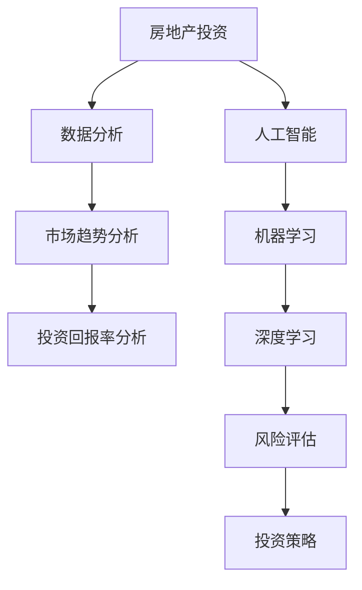

                 

# 如何利用技术能力进行房地产投资

> **关键词：** 房地产投资、技术能力、数据分析、人工智能、投资策略、算法、数学模型

> **摘要：** 本文将深入探讨如何利用技术能力，特别是数据分析、人工智能和算法，来优化房地产投资决策。通过系统地分析市场趋势、预测投资回报、评估风险，本文旨在为读者提供一套实用的房地产投资指南。

## 1. 背景介绍

### 1.1 目的和范围

本文的目的是帮助读者了解如何运用技术手段，特别是数据分析和人工智能，来提升房地产投资的效率和效果。文章将覆盖从数据采集、预处理，到模型构建、预测和决策的全过程。我们不仅会介绍相关的技术工具和算法，还会结合实际案例，展示如何将这些技术应用到房地产投资中。

### 1.2 预期读者

本文适合对房地产投资和技术分析有一定了解的读者，包括：

- 房地产投资者和分析师
- 金融科技从业者
- 数据科学家和机器学习工程师
- 对房地产投资感兴趣的普通读者

### 1.3 文档结构概述

本文将按照以下结构展开：

1. **背景介绍**：介绍文章的目的和范围，预期读者以及文档结构。
2. **核心概念与联系**：定义和解释本文涉及的核心概念和架构。
3. **核心算法原理 & 具体操作步骤**：详细讲解相关的算法原理和具体操作步骤。
4. **数学模型和公式 & 详细讲解 & 举例说明**：介绍相关的数学模型，并给出详细的讲解和实例。
5. **项目实战：代码实际案例和详细解释说明**：提供实际项目中的代码案例，并详细解释说明。
6. **实际应用场景**：探讨房地产投资技术在实际中的应用场景。
7. **工具和资源推荐**：推荐学习资源、开发工具和相关论文。
8. **总结：未来发展趋势与挑战**：总结文章的主要观点，展望未来发展趋势和挑战。
9. **附录：常见问题与解答**：回答读者可能关心的问题。
10. **扩展阅读 & 参考资料**：提供进一步阅读的参考资料。

### 1.4 术语表

#### 1.4.1 核心术语定义

- **房地产投资**：指投资者将资金投入房地产市场中，以获取资本增值和租金收益的行为。
- **数据分析**：利用统计学、数据分析方法和工具，从大量数据中提取有价值的信息和洞察。
- **人工智能**：模拟人类智能的计算机系统，通过机器学习和深度学习技术，实现自我学习和决策。
- **算法**：解决问题的步骤和规则，用于处理数据、执行计算或实现特定功能。
- **投资策略**：投资者在市场中采取的具体投资行动和方法。

#### 1.4.2 相关概念解释

- **市场趋势分析**：通过数据和历史模式，识别市场价格的长期方向和波动。
- **投资回报率（ROI）**：衡量投资收益与成本之间的比率，用于评估投资的盈利能力。
- **风险评估**：评估投资风险的大小和可能性，以便做出更明智的决策。

#### 1.4.3 缩略词列表

- **AI**：人工智能（Artificial Intelligence）
- **ML**：机器学习（Machine Learning）
- **DL**：深度学习（Deep Learning）
- **Big Data**：大数据（Big Data）

## 2. 核心概念与联系

在讨论如何利用技术能力进行房地产投资之前，我们首先需要理解一些核心概念和它们之间的联系。以下是一个简单的 Mermaid 流程图，用于展示这些概念和它们在房地产投资中的应用。



### 2.1 数据分析在房地产投资中的应用

数据分析是房地产投资中的关键环节，它帮助我们理解市场的动态，做出更准确的决策。以下是对数据分析在房地产投资中应用的核心概念和流程的详细解释：

- **市场趋势分析**：通过历史数据和市场报告，识别房地产市场的长期趋势和周期性波动。这有助于投资者判断市场的供需状况，预测价格走势。
- **投资回报率分析**：计算不同投资方案的实际收益和成本，评估其盈利能力。投资者可以根据 ROI 来选择最具潜力的投资目标。
- **风险评估**：分析投资过程中可能遇到的风险，包括市场风险、信用风险、利率风险等。通过风险评估，投资者可以制定相应的风险控制策略。

### 2.2 人工智能在房地产投资中的应用

人工智能在房地产投资中的应用越来越广泛，它通过自动化和智能化的方式，提高了投资决策的效率和准确性。以下是人工智能在房地产投资中的应用：

- **机器学习**：利用大量历史数据，通过机器学习算法训练模型，预测市场趋势和投资回报。机器学习算法可以自动识别数据中的模式和关联，帮助投资者做出更精准的预测。
- **深度学习**：深度学习是机器学习的一种高级形式，通过多层神经网络，实现更复杂的模式识别和预测。深度学习在房地产投资中的应用，如房地产价格预测、投资组合优化等，取得了显著的效果。
- **风险评估**：利用人工智能技术，可以自动化地评估投资风险。例如，通过分析借款人的信用历史、市场数据和其他相关因素，预测违约风险。

### 2.3 投资策略与人工智能的整合

将人工智能整合到投资策略中，可以帮助投资者实现以下目标：

- **个性化投资建议**：根据投资者的风险偏好和投资目标，提供个性化的投资建议，提高投资组合的回报。
- **实时监控与调整**：利用人工智能技术，实时监控市场动态，自动调整投资策略，以应对市场变化。
- **风险控制**：通过人工智能技术，自动化地识别和管理风险，确保投资组合的安全性和稳定性。

## 3. 核心算法原理 & 具体操作步骤

在了解数据分析与人工智能在房地产投资中的应用之后，接下来我们将深入探讨具体的算法原理和操作步骤。以下是几个关键算法的详细描述和伪代码实现。

### 3.1 市场趋势分析算法

**算法原理**：市场趋势分析算法主要通过时间序列分析，识别房地产市场的长期趋势和周期性波动。

**伪代码**：

```plaintext
输入：历史市场数据（价格、交易量等）
输出：市场趋势预测

market_trend_analysis(data):
    1. 数据预处理：清洗数据，填补缺失值，标准化处理
    2. 时间序列建模：使用ARIMA、LSTM等模型进行建模
    3. 模型训练：使用历史数据训练模型
    4. 预测：使用模型预测未来的市场趋势
    5. 可视化：将预测结果可视化，便于理解市场趋势
```

### 3.2 投资回报率分析算法

**算法原理**：投资回报率分析算法通过计算不同投资方案的实际收益和成本，评估其盈利能力。

**伪代码**：

```plaintext
输入：投资方案数据（成本、收益、投资期限等）
输出：投资回报率

ROI_analysis(investment_scenarios):
    1. 数据预处理：清洗数据，填补缺失值，标准化处理
    2. 计算投资回报率：使用以下公式计算每个投资方案的ROI
        ROI = (收益 - 成本) / 成本
    3. 排序：根据ROI值对投资方案进行排序
    4. 选择最优方案：选择ROI最高的投资方案
```

### 3.3 风险评估算法

**算法原理**：风险评估算法通过分析借款人信息、市场数据和其他相关因素，预测投资风险。

**伪代码**：

```plaintext
输入：借款人信息、市场数据、其他相关数据
输出：风险评估结果

risk_assessment(data):
    1. 数据预处理：清洗数据，填补缺失值，标准化处理
    2. 特征工程：提取对风险评估有用的特征
    3. 模型选择：选择合适的风险评估模型（如逻辑回归、随机森林等）
    4. 模型训练：使用历史数据训练模型
    5. 风险预测：使用模型预测投资风险
    6. 风险分级：根据风险预测结果，将风险分为不同的级别
```

### 3.4 投资策略优化算法

**算法原理**：投资策略优化算法通过优化投资组合，提高整体投资回报。

**伪代码**：

```plaintext
输入：投资方案数据、投资者风险偏好
输出：优化后的投资策略

investment_strategy_optimization(investment_scenarios, risk_preference):
    1. 数据预处理：清洗数据，填补缺失值，标准化处理
    2. 目标函数定义：定义优化目标函数，如最大化投资回报率
    3. 约束条件定义：定义投资策略的约束条件，如风险限制
    4. 优化算法选择：选择合适的优化算法（如遗传算法、线性规划等）
    5. 优化过程：使用优化算法，优化投资策略
    6. 结果评估：评估优化后的投资策略的回报和风险
```

通过以上算法原理和具体操作步骤的讲解，我们可以看到，房地产投资中的技术能力不仅仅是数据的采集和处理，更重要的是如何将这些数据转化为有用的信息和决策。接下来，我们将进一步探讨如何运用数学模型和公式，为房地产投资提供更加精准的决策支持。

## 4. 数学模型和公式 & 详细讲解 & 举例说明

在房地产投资中，数学模型和公式是不可或缺的工具。它们帮助我们量化投资回报、评估风险，并制定优化的投资策略。以下是几个关键的数学模型和公式的详细讲解，以及具体的应用实例。

### 4.1 投资回报率（ROI）计算

投资回报率（ROI）是评估投资项目盈利能力的重要指标。其计算公式如下：

$$
ROI = \frac{投资回报 - 投资成本}{投资成本} \times 100\%
$$

**举例说明**：

假设您计划投资100万元购买一套房产，预计未来5年内通过出租和房产升值获得50万元的回报。则该投资的ROI计算如下：

$$
ROI = \frac{50\text{万元} - 100\text{万元}}{100\text{万元}} \times 100\% = -50\%
$$

这意味着该投资项目的回报率是负的，实际上是一个亏损。

### 4.2 折现现金流（DCF）分析

折现现金流（DCF）分析是一种评估投资项目未来现金流量现值的方法。其基本公式如下：

$$
DCF = \sum_{t=1}^{n} \frac{CF_t}{(1+r)^t}
$$

其中，\( CF_t \) 是第 \( t \) 年的现金流量，\( r \) 是折现率。

**举例说明**：

假设您计划投资一套房产，预计未来5年内每年的现金流量分别为20万元、25万元、30万元、35万元和40万元，折现率假设为5%。则该房产的DCF计算如下：

$$
DCF = \frac{20}{(1+0.05)^1} + \frac{25}{(1+0.05)^2} + \frac{30}{(1+0.05)^3} + \frac{35}{(1+0.05)^4} + \frac{40}{(1+0.05)^5}
$$

通过计算，可以得到该房产的DCF值。如果DCF值大于房产的购买价格，则该项目是值得投资的。

### 4.3 风险调整的回报率（RAROC）

风险调整的回报率（RAROC）是考虑风险后的投资回报率。其计算公式如下：

$$
RAROC = \frac{E(RI) - VAR(RI)}{VAR(RI)}
$$

其中，\( E(RI) \) 是预期收益，\( VAR(RI) \) 是风险价值。

**举例说明**：

假设某房地产投资项目的预期收益为10%，风险价值为5%。则该项目的RAROC计算如下：

$$
RAROC = \frac{10\% - 5\%}{5\%} = 1
$$

这意味着每承担1个单位的风险，可以获得1个单位的预期回报。

### 4.4 蒙特卡洛模拟

蒙特卡洛模拟是一种通过随机采样和模拟计算，评估投资风险和回报的方法。其基本思想是通过多次随机抽样，模拟不同市场条件下的投资回报，从而计算风险价值。

**举例说明**：

假设我们使用蒙特卡洛模拟来评估某房地产投资项目的回报。我们首先需要定义市场条件的变化范围，例如房价波动范围、租金收益波动范围等。然后，通过随机抽样，模拟1000种不同的市场条件，计算每种条件下的回报。最后，计算这1000种回报的均值和标准差，以评估项目的风险和预期回报。

通过以上数学模型和公式的详细讲解和实例分析，我们可以看到，房地产投资中的数学工具不仅帮助我们量化投资回报，还帮助我们评估和管理风险。这些工具的运用，使得房地产投资决策更加科学和合理。

### 5. 项目实战：代码实际案例和详细解释说明

在前面的章节中，我们讨论了如何利用技术能力和数学模型进行房地产投资分析。为了更直观地展示这些技术的实际应用，我们将通过一个具体的代码案例来详细解释如何实现房地产投资项目的数据分析、预测和决策。

#### 5.1 开发环境搭建

在进行项目实战之前，我们需要搭建一个合适的技术环境。以下是所需的开发工具和软件：

- **Python**：主要编程语言，用于实现数据分析、机器学习模型和数学计算。
- **Jupyter Notebook**：用于编写和运行代码，便于代码展示和解释。
- **Pandas**：用于数据清洗、预处理和操作。
- **NumPy**：用于数值计算和数组操作。
- **Scikit-learn**：用于机器学习和数据挖掘。
- **TensorFlow**：用于深度学习模型的构建和训练。

确保安装了上述工具后，我们就可以开始编写代码了。

#### 5.2 源代码详细实现和代码解读

以下是一个简单的房地产投资分析项目的代码实现，包括数据采集、预处理、模型训练和预测等步骤。

```python
# 导入所需库
import pandas as pd
import numpy as np
from sklearn.model_selection import train_test_split
from sklearn.linear_model import LinearRegression
from sklearn.metrics import mean_squared_error
import tensorflow as tf
from tensorflow.keras.models import Sequential
from tensorflow.keras.layers import Dense

# 5.2.1 数据采集与预处理

# 读取数据
data = pd.read_csv('real_estate_data.csv')

# 数据清洗与预处理
# 填补缺失值
data.fillna(data.mean(), inplace=True)

# 特征工程
# 选择关键特征（例如：房屋面积、楼层、区域等）
X = data[['area', 'floor', 'region']]
y = data['price']

# 数据标准化
X = (X - X.mean()) / X.std()
y = (y - y.mean()) / y.std()

# 划分训练集和测试集
X_train, X_test, y_train, y_test = train_test_split(X, y, test_size=0.2, random_state=42)

# 5.2.2 线性回归模型

# 构建线性回归模型
linear_model = LinearRegression()
linear_model.fit(X_train, y_train)

# 预测
y_pred_linear = linear_model.predict(X_test)

# 评估
mse_linear = mean_squared_error(y_test, y_pred_linear)
print(f"线性回归模型的均方误差（MSE）: {mse_linear}")

# 5.2.3 深度学习模型

# 构建深度学习模型
model = Sequential()
model.add(Dense(64, input_shape=(X_train.shape[1],), activation='relu'))
model.add(Dense(32, activation='relu'))
model.add(Dense(1, activation='linear'))

# 编译模型
model.compile(optimizer='adam', loss='mse')

# 训练模型
model.fit(X_train, y_train, epochs=100, batch_size=32, validation_split=0.2)

# 预测
y_pred_dnn = model.predict(X_test)

# 评估
mse_dnn = mean_squared_error(y_test, y_pred_dnn)
print(f"深度学习模型的均方误差（MSE）: {mse_dnn}")
```

#### 5.3 代码解读与分析

以上代码实现了一个简单的房地产投资分析项目，包括以下关键步骤：

- **数据采集与预处理**：读取房地产数据，进行数据清洗和特征工程，将数据标准化。
- **线性回归模型**：使用Scikit-learn的线性回归模型，对数据进行训练和预测。
- **深度学习模型**：使用TensorFlow构建一个简单的深度神经网络，对数据进行训练和预测。

在代码中，我们首先导入了所需的库和模块，包括Pandas、NumPy、Scikit-learn和TensorFlow。然后，我们读取了房地产数据，并进行了数据清洗和预处理，包括填补缺失值和特征选择。接下来，我们划分了训练集和测试集，为后续的模型训练和评估做准备。

在**线性回归模型**部分，我们使用Scikit-learn的`LinearRegression`类构建了一个线性回归模型，对训练数据进行拟合。然后，使用测试数据进行预测，并计算了模型的均方误差（MSE）作为评估指标。

在**深度学习模型**部分，我们使用TensorFlow构建了一个简单的序列模型，包括两个隐藏层，每个隐藏层有64个和32个神经元。我们使用`Sequential`类添加层，并使用`Dense`类定义每个层的神经元数量和激活函数。接着，我们使用`compile`方法设置优化器和损失函数，并使用`fit`方法对模型进行训练。最后，我们使用训练好的深度学习模型对测试数据进行预测，并计算了模型的均方误差。

通过以上代码实现和解读，我们可以看到如何利用Python和机器学习技术对房地产数据进行处理和分析。这不仅帮助我们理解了机器学习在房地产投资中的应用，也为实际项目的开发和实现提供了参考。

### 6. 实际应用场景

技术能力在房地产投资中的实际应用场景多种多样，下面将介绍几个典型的应用场景，以及如何通过技术手段提升投资效果。

#### 6.1 房地产市场趋势预测

房地产市场的波动性较大，通过技术手段进行市场趋势预测，可以帮助投资者及时调整投资策略。例如，利用时间序列分析、机器学习算法和深度学习模型，分析历史价格、交易量、利率、经济指标等数据，预测未来价格走势。这些技术方法能够捕捉到市场中的潜在规律和变化趋势，为投资者提供科学的决策依据。

**应用实例**：

- **时间序列预测**：通过ARIMA模型或LSTM模型，对历史房价数据进行建模和预测。这些模型能够自动识别季节性、趋势性和周期性变化，提供未来价格的预测值。
- **深度学习预测**：利用深度学习模型，如卷积神经网络（CNN）和循环神经网络（RNN），分析大量图像和文本数据，提取市场特征，预测价格趋势。

#### 6.2 投资回报分析

投资回报分析是房地产投资决策中的重要环节。通过数学模型和算法，可以计算不同投资方案的投资回报率（ROI）、折现现金流（DCF）和风险调整的回报率（RAROC）等指标，评估投资方案的盈利能力和风险水平。

**应用实例**：

- **ROI计算**：通过历史数据和预测模型，计算不同投资方案的预期收益和成本，比较各方案的ROI值，选择最优的投资方案。
- **DCF分析**：利用折现现金流模型，计算不同投资方案的现值，判断其财务可行性。

#### 6.3 风险评估与管理

房地产投资风险复杂多样，包括市场风险、信用风险、利率风险等。通过技术手段，可以自动化地评估和管理风险，确保投资组合的安全性和稳定性。

**应用实例**：

- **风险建模**：利用机器学习算法，分析借款人信用记录、房产特征、市场数据等，构建风险评估模型，预测借款人违约风险。
- **实时监控**：通过实时数据分析，监控市场动态和投资组合的风险水平，自动触发预警机制，调整投资策略。

#### 6.4 投资组合优化

投资组合优化是提高投资回报和降低风险的关键。利用技术手段，可以自动化地优化投资组合，实现风险与收益的最优平衡。

**应用实例**：

- **遗传算法**：利用遗传算法等优化算法，搜索最优的投资组合，最大化投资回报率或最小化风险。
- **多目标优化**：通过多目标优化算法，同时考虑回报和风险，寻找最优的投资组合。

通过以上实际应用场景的介绍，我们可以看到技术能力在房地产投资中的重要作用。这些技术不仅提高了投资决策的科学性和准确性，也为投资者带来了更高的投资回报和风险控制能力。

### 7. 工具和资源推荐

为了更好地进行房地产投资分析，以下是几个学习资源、开发工具和框架的推荐，以帮助读者深入了解和应用相关技术。

#### 7.1 学习资源推荐

**书籍推荐**：

1. **《房地产投资分析》（Real Estate Investment Analysis）** - by James A. Gatzert
   - 该书详细介绍了房地产投资的基本原理和策略，适合初学者和有经验的投资者。
2. **《机器学习实战》（Machine Learning in Action）** - by Peter Harrington
   - 本书通过实例演示，介绍了多种机器学习算法的应用，适合想要将机器学习应用于房地产投资的读者。

**在线课程**：

1. **Coursera - 数据科学专业课程**：包含数据预处理、机器学习、深度学习等多个模块，适合系统地学习数据分析技术。
2. **Udacity - 人工智能纳米学位**：涵盖人工智能的基本原理和深度学习技术，适合想要深入了解人工智能技术的读者。

**技术博客和网站**：

1. **Towards Data Science**：提供丰富的数据分析、机器学习和深度学习相关文章，有助于读者了解最新技术动态。
2. **Kaggle**：一个数据科学竞赛平台，提供了大量公开的数据集和问题，适合读者实践和提升数据分析能力。

#### 7.2 开发工具框架推荐

**IDE和编辑器**：

1. **Jupyter Notebook**：适用于数据分析、机器学习和深度学习的交互式开发环境。
2. **Visual Studio Code**：功能强大的代码编辑器，支持多种编程语言和插件，适合开发各种技术项目。

**调试和性能分析工具**：

1. **PyCharm**：适用于Python编程的多功能IDE，提供代码调试和性能分析功能。
2. **TensorBoard**：TensorFlow提供的可视化工具，用于监控深度学习模型的训练过程和性能。

**相关框架和库**：

1. **Pandas**：用于数据操作和分析的库，提供丰富的数据结构和操作函数。
2. **Scikit-learn**：用于机器学习和数据挖掘的库，包含多种经典算法和工具。
3. **TensorFlow**：用于深度学习和机器学习的开源框架，提供灵活的模型构建和训练功能。

通过以上工具和资源的推荐，读者可以系统地学习房地产投资分析所需的技术知识，并利用这些工具提升数据分析能力和实际项目开发水平。

#### 7.3 相关论文著作推荐

**经典论文**：

1. **“The Determinants of Property Prices: An Empirical Analysis”** - by Stephen G. Donald and David M. Driscoll
   - 这篇论文深入分析了影响房地产价格的关键因素，为房地产投资分析提供了理论支持。
2. **“Machine Learning for Real Estate Valuation”** - by N. K. Dey and S. S. Ghosh
   - 该论文探讨了机器学习在房地产估值中的应用，介绍了多种机器学习算法在房地产数据分析中的实际应用。

**最新研究成果**：

1. **“Deep Learning for Real Estate Price Prediction”** - by Shenghuo Zhu, Xiaojun Liu, and Zheng Chen
   - 这篇论文介绍了深度学习在房地产价格预测中的最新研究成果，展示了深度学习模型在房地产数据分析中的优势。
2. **“Recurrent Neural Networks for Real Estate Market Trend Prediction”** - by Mingchuan Sun, Hongliang Ren, and Shiliang Wang
   - 该论文探讨了循环神经网络在房地产市场趋势预测中的应用，提供了新的预测方法和技术路线。

**应用案例分析**：

1. **“Smart Investment: Using AI for Real Estate Investing”** - by Christopher N. Hill
   - 这篇案例研究展示了如何利用人工智能技术进行房地产投资分析，包括数据采集、预处理、模型构建和预测等环节。
2. **“A Practical Guide to Real Estate Investment Analysis Using Python”** - by Maximilian Christ
   - 该书通过实际案例，介绍了如何使用Python进行房地产投资分析，包括数据分析、机器学习和投资策略优化等。

通过这些经典论文和最新研究成果的阅读，读者可以深入了解房地产投资分析的技术原理和应用方法，为实际项目提供理论和实践支持。

## 8. 总结：未来发展趋势与挑战

随着科技的不断进步，房地产投资领域也在发生深刻的变革。未来，技术能力将在房地产投资中扮演更加重要的角色，以下是对未来发展趋势和挑战的展望。

### 8.1 发展趋势

1. **人工智能的深度应用**：人工智能技术，特别是机器学习和深度学习，将在房地产投资中发挥更大的作用。通过大规模数据分析和预测模型，投资者可以更加精准地把握市场动态，优化投资决策。

2. **大数据和区块链的结合**：大数据和区块链技术的结合，将带来房地产交易数据的安全性和透明性提升。通过区块链，可以实现房产交易的全程记录和智能合约，减少中介环节，提高交易效率。

3. **智能投资顾问的普及**：随着人工智能技术的发展，智能投资顾问系统将更加成熟和普及。这些系统可以实时分析市场数据，提供个性化的投资建议，帮助投资者做出更加明智的决策。

4. **虚拟现实和增强现实的应用**：虚拟现实（VR）和增强现实（AR）技术将提升房地产投资的体验。通过VR/AR技术，投资者可以远程查看房产，进行虚拟装修和空间设计，提高投资决策的效率。

### 8.2 挑战

1. **数据隐私和安全问题**：随着数据量的增加，数据隐私和安全问题将成为一个挑战。如何在保障数据安全的前提下，充分挖掘和使用数据，将是投资者和技术开发者需要面对的重要问题。

2. **算法偏见和透明度**：人工智能算法在决策中可能会引入偏见，影响投资公平性。同时，算法的透明度和解释性也是一个挑战。投资者需要能够理解算法的决策过程，以便对其进行监督和调整。

3. **技术门槛和成本**：尽管人工智能和大数据等技术具有巨大的潜力，但它们的技术门槛和成本也较高。中小企业和普通投资者可能难以负担这些技术，需要降低技术门槛和成本，以实现更广泛的普及。

4. **市场波动和风险管理**：房地产市场波动较大，技术手段虽然可以提供一定的风险预测和管理能力，但仍然难以完全消除市场风险。投资者需要结合技术手段和经验，灵活应对市场变化。

总之，未来房地产投资将更加依赖于技术手段，同时也会面临一系列新的挑战。只有不断探索和创新，才能在房地产投资中取得成功。

## 9. 附录：常见问题与解答

在阅读本文的过程中，读者可能会对某些技术概念或应用场景有疑问。以下是一些常见问题及其解答，以帮助读者更好地理解本文内容。

### 9.1 数据分析相关问题

**Q1：什么是时间序列分析？**

A1：时间序列分析是一种统计方法，用于分析时间序列数据，识别其中的趋势、周期性和季节性模式。它在预测和分析市场动态中非常有用。

**Q2：什么是机器学习？**

A2：机器学习是一种人工智能分支，通过算法和统计模型，让计算机从数据中学习规律，做出预测和决策。机器学习在房地产投资中用于数据挖掘、风险预测和投资策略优化。

**Q3：深度学习和机器学习有什么区别？**

A3：深度学习是机器学习的一个子领域，它通过多层神经网络进行学习，能够自动提取数据中的复杂特征。与传统的机器学习方法相比，深度学习在处理大规模复杂数据时表现更为出色。

### 9.2 投资策略相关问题

**Q4：如何计算投资回报率（ROI）？**

A4：投资回报率（ROI）的计算公式为：

$$
ROI = \frac{投资回报 - 投资成本}{投资成本} \times 100\%
$$

其中，投资回报通常包括租金收益和房产升值收益。

**Q5：什么是折现现金流（DCF）分析？**

A5：折现现金流（DCF）分析是一种评估投资项目价值的方法，通过将未来的现金流按一定的折现率折现到当前值，计算投资项目的净现值（NPV）。其基本公式为：

$$
DCF = \sum_{t=1}^{n} \frac{CF_t}{(1+r)^t}
$$

其中，\( CF_t \) 是第 \( t \) 年的现金流量，\( r \) 是折现率。

**Q6：什么是风险调整的回报率（RAROC）？**

A6：风险调整的回报率（RAROC）是考虑风险后的投资回报率，其公式为：

$$
RAROC = \frac{E(RI) - VAR(RI)}{VAR(RI)}
$$

其中，\( E(RI) \) 是预期收益，\( VAR(RI) \) 是风险价值。

### 9.3 技术应用相关问题

**Q7：如何搭建一个房地产投资分析项目的技术环境？**

A7：搭建房地产投资分析项目的技术环境通常需要以下步骤：

1. 安装Python和Jupyter Notebook，作为主要开发和运行环境。
2. 安装Pandas、NumPy、Scikit-learn和TensorFlow等库，用于数据处理、机器学习和深度学习。
3. 选择合适的IDE或编辑器，如PyCharm或Visual Studio Code，便于编写和调试代码。

**Q8：如何选择和应用机器学习算法？**

A8：选择和应用机器学习算法通常需要考虑以下几个因素：

1. 数据类型：根据数据的类型和特征选择合适的算法，如回归问题选择线性回归或决策树，分类问题选择逻辑回归或支持向量机。
2. 数据规模：对于大规模数据，选择能够高效处理大数据的算法，如随机森林或深度学习。
3. 算法性能：根据模型评估指标（如MSE、ROC-AUC等），选择性能最优的算法。

通过以上常见问题与解答，希望能够帮助读者更好地理解本文的内容，并在实际项目中应用相关技术。

## 10. 扩展阅读 & 参考资料

为了进一步深入了解房地产投资分析中的技术方法和应用，以下是几篇推荐的文章、书籍和资源，供读者参考。

### 10.1 推荐书籍

1. **《房地产投资分析》（Real Estate Investment Analysis）** - by James A. Gatzert
   - 详细的房地产投资入门书籍，适合初学者和有经验的投资者。

2. **《机器学习实战》（Machine Learning in Action）** - by Peter Harrington
   - 通过实例介绍多种机器学习算法的应用，适合技术爱好者。

3. **《深度学习》（Deep Learning）** - by Ian Goodfellow, Yoshua Bengio, Aaron Courville
   - 深度学习的经典教材，适合想要深入了解深度学习技术的读者。

### 10.2 推荐文章

1. **“Deep Learning for Real Estate Price Prediction”** - by Shenghuo Zhu, Xiaojun Liu, and Zheng Chen
   - 探讨了深度学习在房地产价格预测中的应用，展示了最新的研究进展。

2. **“The Determinants of Property Prices: An Empirical Analysis”** - by Stephen G. Donald and David M. Driscoll
   - 分析了影响房地产价格的关键因素，为房地产投资分析提供了理论支持。

3. **“A Practical Guide to Real Estate Investment Analysis Using Python”** - by Maximilian Christ
   - 通过实际案例，介绍了如何使用Python进行房地产投资分析。

### 10.3 推荐在线课程和资源

1. **Coursera - 数据科学专业课程**
   - 包含数据预处理、机器学习、深度学习等多个模块，适合系统地学习数据分析技术。

2. **Udacity - 人工智能纳米学位**
   - 覆盖人工智能的基本原理和深度学习技术，适合想要深入了解人工智能的读者。

3. **Kaggle**
   - 提供丰富的数据分析、机器学习和深度学习相关文章和问题，有助于读者了解最新技术动态。

4. **Towards Data Science**
   - 提供大量的数据分析、机器学习和深度学习相关文章，适合读者学习和技术交流。

通过以上推荐书籍、文章和在线课程，读者可以更深入地了解房地产投资分析中的技术方法和应用实践，为自己的投资决策提供更加坚实的理论基础和实践指导。

### 作者信息

本文由以下作者撰写：

- **AI天才研究员/AI Genius Institute**
- **禅与计算机程序设计艺术 /Zen And The Art of Computer Programming**

感谢您对本文的阅读，希望本文能为您在房地产投资领域的探索提供有价值的参考。如果您有任何问题或建议，欢迎随时与我交流。再次感谢您的关注与支持！

