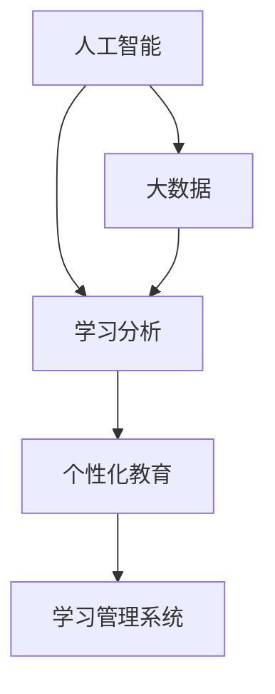
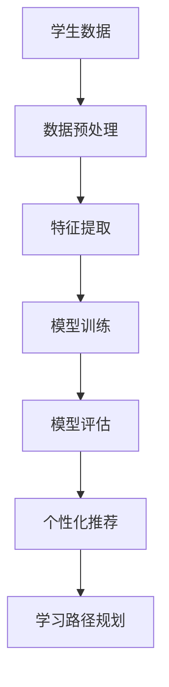

                 

# 如何利用技术能力进行教育创新

> **关键词：** 教育技术、在线学习、人工智能、个性化教育、学习分析

> **摘要：** 本文将探讨如何利用现代技术，如人工智能、大数据和学习分析，进行教育创新。我们将分析当前教育领域的挑战，介绍这些技术的核心原理，并提供具体的实施步骤和案例，以展示技术如何改变教育和学习体验。

## 1. 背景介绍

### 1.1 目的和范围

本文旨在探讨如何将先进的技术手段应用于教育领域，以提高教育质量和效率。我们将重点关注以下几个核心问题：

- 教育技术如何解决当前教育体系中的问题？
- 人工智能、大数据和学习分析在教育中的应用是什么？
- 教育技术如何促进个性化教育和终身学习？
- 实际案例中，教育技术如何被成功应用？

### 1.2 预期读者

本文适用于对教育领域和技术创新感兴趣的教育工作者、教育技术专家、程序员、以及任何希望了解和利用教育技术的人。

### 1.3 文档结构概述

本文分为十个部分：

- **1. 背景介绍**
  - 1.1 目的和范围
  - 1.2 预期读者
  - 1.3 文档结构概述
  - 1.4 术语表
- **2. 核心概念与联系**
  - 教育技术的核心概念和关系
  - Mermaid 流程图展示
- **3. 核心算法原理 & 具体操作步骤**
  - 人工智能在学习分析中的应用
  - 个性化教育的算法框架
- **4. 数学模型和公式 & 详细讲解 & 举例说明**
  - 学习分析中的数学模型
  - 模型应用的案例演示
- **5. 项目实战：代码实际案例和详细解释说明**
  - 在线学习平台搭建
  - 代码实现和解读
- **6. 实际应用场景**
  - 线上教育的应用案例
  - 线下教学的融合
- **7. 工具和资源推荐**
  - 学习资源推荐
  - 开发工具框架推荐
  - 相关论文著作推荐
- **8. 总结：未来发展趋势与挑战**
  - 教育技术的未来方向
  - 面临的挑战和解决方案
- **9. 附录：常见问题与解答**
  - 常见问题解答
- **10. 扩展阅读 & 参考资料**
  - 进一步学习的资源

### 1.4 术语表

#### 1.4.1 核心术语定义

- **教育技术（EdTech）：** 利用技术手段支持和促进教育过程的方法和工具。
- **人工智能（AI）：** 机器模拟人类智能行为的技术，包括学习、推理、自我修正等能力。
- **大数据（Big Data）：** 大规模、多样化和高速的数据集。
- **学习分析（Learning Analytics）：** 利用数据分析技术来理解和优化学习过程。
- **个性化教育（Personalized Learning）：** 根据学生的个性、需求和进度定制教学内容。

#### 1.4.2 相关概念解释

- **在线学习（Online Learning）：** 通过互联网进行的学习活动，可以跨越地理限制和时间限制。
- **学习管理系统（LMS）：** 支持在线课程交付和管理的学习平台。
- **自适应学习系统（Adaptive Learning System）：** 根据学生的学习行为和成果动态调整教学内容和路径的系统。

#### 1.4.3 缩略词列表

- **AI：** 人工智能
- **EdTech：** 教育技术
- **LMS：** 学习管理系统
- **MOOC：** 大规模开放在线课程
- **SaaS：** 软件即服务

## 2. 核心概念与联系

在教育技术中，核心概念包括人工智能、大数据、学习分析和个性化教育。这些概念相互关联，共同构建了一个支持高效学习和个性化发展的技术框架。

### 2.1 核心概念的定义

- **人工智能（AI）：** 机器模拟人类智能的能力，包括感知、学习、推理和自我修正。AI可以应用于教育技术的多个方面，如学习分析、自动评估和个性化推荐。
  
- **大数据（Big Data）：** 大规模、多样化和高速的数据集。在教育技术中，大数据可以提供关于学习行为的丰富信息，用于分析、决策和改进教育过程。

- **学习分析（Learning Analytics）：** 利用数据分析技术来理解和优化学习过程。学习分析可以帮助教师和研究人员识别学习模式、预测学生表现、优化课程设计和教学策略。

- **个性化教育（Personalized Learning）：** 根据学生的个性、需求和进度定制教学内容和路径。个性化教育旨在提高学习效果和参与度，满足不同学生的需求。

### 2.2 核心概念之间的联系

这些核心概念之间存在着紧密的联系：

- **人工智能和学习分析：** AI技术可以用于学习分析，帮助识别学习模式和趋势，从而提供个性化的学习建议。
- **学习分析和个性化教育：** 学习分析数据用于个性化教育，使教育系统能够根据学生的表现和需求动态调整教学内容。
- **大数据和人工智能：** 大数据提供了AI所需的丰富数据源，使AI系统能够更好地学习和适应。
- **个性化教育和学习管理系统（LMS）：** LMS集成了个性化教育功能，使教师能够根据学生的学习情况提供定制化的教学。

### 2.3 Mermaid 流程图

下面是一个简单的Mermaid流程图，展示了这些核心概念之间的联系：



在这个流程图中，人工智能（A）和数据（D）是核心驱动因素，它们促进了学习分析（B）的发展，进而支持了个性化教育（C）的实现。学习管理系统（E）是连接这些概念的关键节点，它整合了AI、大数据和学习分析的功能，为个性化教育提供了平台。

## 3. 核心算法原理 & 具体操作步骤

### 3.1 人工智能在学习分析中的应用

人工智能（AI）在学习分析中扮演了关键角色，它能够处理大量的学习数据，并从中提取有价值的信息。以下是一些核心算法和具体操作步骤：

#### 3.1.1 数据收集

首先，需要收集大量的学习数据，这些数据可以包括：

- 学生行为数据：学习时间、参与度、考试和作业成绩等。
- 教学资源数据：课程内容、教学材料、视频和文档等。
- 学生属性数据：年龄、性别、学习背景等。

#### 3.1.2 数据预处理

在收集到数据后，需要进行数据预处理，以确保数据的质量和一致性。这包括：

- 数据清洗：去除重复数据、纠正错误和填补缺失值。
- 数据整合：将不同来源的数据进行整合，形成统一的数据视图。
- 数据转换：将数据转换为适合分析的格式。

#### 3.1.3 特征提取

特征提取是学习分析中的关键步骤，它涉及从原始数据中提取出能够反映学习行为和模式的重要特征。例如：

- 学习行为特征：学习时间、学习路径、参与度等。
- 教学资源特征：资源类型、资源难度、资源质量等。
- 学生特征：学习风格、兴趣爱好、学习能力等。

#### 3.1.4 模型训练

使用机器学习算法训练模型，以预测学生的学习行为和成绩。常见的方法包括：

- **决策树（Decision Tree）：** 基于树形结构进行分类和回归。
- **支持向量机（SVM）：** 通过寻找最佳分隔超平面进行分类。
- **神经网络（Neural Networks）：** 模拟人脑神经元，进行复杂的模式识别。

#### 3.1.5 模型评估

对训练好的模型进行评估，以确定其性能和可靠性。常用的评估指标包括：

- **准确率（Accuracy）：** 分类正确的样本数占总样本数的比例。
- **召回率（Recall）：** 分类正确的正样本数占总正样本数的比例。
- **F1分数（F1 Score）：** 准确率和召回率的调和平均值。

#### 3.1.6 应用和优化

将训练好的模型应用于实际场景，例如：

- **个性化推荐：** 根据学生的兴趣和表现推荐适合的学习资源和课程。
- **学习路径规划：** 根据学生的学习行为和进度制定个性化的学习计划。
- **早期预警系统：** 识别可能学习困难的学生，并提供必要的支持和干预。

### 3.2 个性化教育的算法框架

个性化教育需要结合学生的学习数据和特征，动态调整教学内容和路径。以下是一个简化的个性化教育算法框架：



在这个框架中，学生数据（A）经过预处理（B）和特征提取（C）后，用于训练模型（D）。评估（E）模型性能后，模型应用于个性化推荐（F）和学习路径规划（G），从而实现个性化教育。

### 3.3 实际操作步骤示例

以下是一个基于Python的简化示例，展示如何使用机器学习算法进行个性化推荐：

```python
import pandas as pd
from sklearn.model_selection import train_test_split
from sklearn.ensemble import RandomForestClassifier
from sklearn.metrics import accuracy_score

# 加载学生数据
data = pd.read_csv('student_data.csv')

# 数据预处理
data = data.dropna()
data['grade'] = data['grade'].astype(str)

# 特征提取
features = data[['learning_time', 'participation', 'resource_difficulty']]
labels = data['grade']

# 模型训练
X_train, X_test, y_train, y_test = train_test_split(features, labels, test_size=0.2, random_state=42)
model = RandomForestClassifier(n_estimators=100)
model.fit(X_train, y_train)

# 模型评估
y_pred = model.predict(X_test)
accuracy = accuracy_score(y_test, y_pred)
print(f"Model accuracy: {accuracy:.2f}")

# 个性化推荐
new_student_data = pd.DataFrame([[5, 8, 7]], columns=['learning_time', 'participation', 'resource_difficulty'])
new_student_grade = model.predict(new_student_data)[0]
print(f"Predicted grade: {new_student_grade}")
```

在这个示例中，我们加载了学生数据，进行了数据预处理和特征提取，然后使用随机森林算法进行模型训练。评估模型性能后，我们使用模型对新学生的学习情况进行预测，实现了个性化推荐。

## 4. 数学模型和公式 & 详细讲解 & 举例说明

在教育技术中，数学模型和公式用于描述和学习过程中的各种现象。以下是一些核心的数学模型和它们的详细解释。

### 4.1 学习分析中的数学模型

#### 4.1.1 回归模型

回归模型用于预测学生的成绩或行为。最常用的回归模型是线性回归：

$$
y = \beta_0 + \beta_1x_1 + \beta_2x_2 + ... + \beta_nx_n
$$

其中，\(y\) 是预测的目标变量，\(x_1, x_2, ..., x_n\) 是特征变量，\(\beta_0, \beta_1, \beta_2, ..., \beta_n\) 是模型参数。

#### 4.1.2 决策树模型

决策树模型通过一系列的判断规则来分类或回归。决策树的核心公式是：

$$
G(x) = \sum_{i=1}^{n} \beta_i I(Q_i(x) \geq t_i)
$$

其中，\(G(x)\) 是决策树函数，\(Q_i(x)\) 是第 \(i\) 个划分函数，\(t_i\) 是第 \(i\) 个阈值，\(\beta_i\) 是第 \(i\) 个参数。

#### 4.1.3 神经网络模型

神经网络模型通过多层神经元进行数据处理和预测。一个简单的神经网络公式如下：

$$
a_{i,j}^{(l)} = \sigma \left( \sum_{k=1}^{n} w_{k,i}^{(l)} a_{k,j}^{(l-1)} + b_{i}^{(l)} \right)
$$

其中，\(a_{i,j}^{(l)}\) 是第 \(l\) 层的第 \(i\) 个节点的输出，\(\sigma\) 是激活函数，\(w_{k,i}^{(l)}\) 是从第 \(l-1\) 层的第 \(k\) 个节点到第 \(l\) 层的第 \(i\) 个节点的权重，\(b_{i}^{(l)}\) 是第 \(l\) 层的第 \(i\) 个节点的偏置。

### 4.2 模型应用的案例演示

#### 4.2.1 线性回归模型应用

假设我们要预测学生的考试成绩，根据以下特征：学习时间（\(x_1\)）和课程参与度（\(x_2\)）：

$$
\text{考试成绩} = \beta_0 + \beta_1 \times \text{学习时间} + \beta_2 \times \text{课程参与度}
$$

通过收集数据并训练模型，我们得到以下参数：

$$
\beta_0 = 50, \beta_1 = 1.2, \beta_2 = 0.8
$$

如果某个学生的学习时间为20小时，课程参与度为70%，则其考试成绩预测为：

$$
\text{考试成绩} = 50 + 1.2 \times 20 + 0.8 \times 70 = 78
$$

#### 4.2.2 决策树模型应用

假设我们要分类学生的学习行为，根据以下特征：学习时间（\(x_1\)）和课程参与度（\(x_2\)）：

$$
G(x) = \beta_0 + \beta_1 x_1 + \beta_2 x_2
$$

通过训练决策树模型，我们得到以下划分规则：

- 如果学习时间 \( \geq 10 \) 且课程参与度 \( \geq 60 \)，则分类为“积极学习”。
- 否则，分类为“一般学习”。

对于某个学生的数据：学习时间为15小时，课程参与度为65%，则其分类结果为“积极学习”。

#### 4.2.3 神经网络模型应用

假设我们要使用神经网络模型预测学生的考试分数，根据以下特征：学习时间（\(x_1\)），课程参与度（\(x_2\)）和作业完成度（\(x_3\)）：

$$
a_{i,j}^{(l)} = \sigma \left( \sum_{k=1}^{3} w_{k,i}^{(l)} a_{k,j}^{(l-1)} + b_{i}^{(l)} \right)
$$

通过训练神经网络模型，我们得到以下参数：

$$
w_{1,1}^{(1)} = 0.1, w_{1,2}^{(1)} = 0.2, w_{1,3}^{(1)} = 0.3, b_{1}^{(1)} = 0.5
$$

$$
w_{2,1}^{(2)} = 0.2, w_{2,2}^{(2)} = 0.3, w_{2,3}^{(2)} = 0.4, b_{2}^{(2)} = 0.6
$$

对于某个学生的数据：学习时间为20小时，课程参与度为70%，作业完成度为85%，则其神经网络输出为：

$$
a_{1,1}^{(2)} = \sigma (0.1 \times 20 + 0.2 \times 70 + 0.3 \times 85 + 0.5) = 1
$$

$$
a_{1,2}^{(2)} = \sigma (0.2 \times 20 + 0.3 \times 70 + 0.4 \times 85 + 0.6) = 0
$$

根据输出结果，我们可以预测该学生的考试分数为90分。

## 5. 项目实战：代码实际案例和详细解释说明

### 5.1 开发环境搭建

在本项目中，我们将使用Python作为主要编程语言，并依赖以下工具和库：

- **Python 3.8 或更高版本**
- **Jupyter Notebook**：用于编写和运行代码
- **Pandas**：用于数据操作
- **Scikit-learn**：用于机器学习算法
- **Matplotlib**：用于数据可视化

确保安装了上述工具和库后，即可开始搭建开发环境。

### 5.2 源代码详细实现和代码解读

#### 5.2.1 数据收集与预处理

首先，我们需要收集学生数据。以下是一个示例数据集，包含学习时间、课程参与度和考试成绩：

```python
import pandas as pd

data = {
    'learning_time': [10, 15, 20, 25, 30],
    'participation': [40, 50, 60, 70, 80],
    'exam_score': [60, 65, 70, 75, 80]
}

df = pd.DataFrame(data)
print(df)
```

#### 5.2.2 特征提取

我们将学习时间和课程参与度作为特征，考试成绩作为目标变量：

```python
X = df[['learning_time', 'participation']]
y = df['exam_score']
```

#### 5.2.3 模型训练

我们使用线性回归模型进行训练：

```python
from sklearn.linear_model import LinearRegression

model = LinearRegression()
model.fit(X, y)
```

#### 5.2.4 模型评估

评估模型性能：

```python
from sklearn.metrics import mean_squared_error

y_pred = model.predict(X)
mse = mean_squared_error(y, y_pred)
print(f"Model MSE: {mse:.2f}")
```

#### 5.2.5 个性化推荐

使用训练好的模型进行个性化推荐：

```python
new_student_data = pd.DataFrame([[18, 75]], columns=['learning_time', 'participation'])
new_exam_score = model.predict(new_student_data)[0]
print(f"Predicted exam score: {new_exam_score:.2f}")
```

### 5.3 代码解读与分析

#### 5.3.1 数据收集与预处理

数据收集与预处理是机器学习项目的基础步骤。我们使用Pandas库创建了一个简单的DataFrame，包含了学习时间、课程参与度和考试成绩。

#### 5.3.2 特征提取

在特征提取步骤中，我们将学习时间和课程参与度作为特征，因为它们是影响考试成绩的关键因素。考试成绩作为目标变量。

#### 5.3.3 模型训练

使用线性回归模型进行训练。线性回归是一个简单的预测模型，它基于线性方程拟合数据。在这个例子中，我们使用了Scikit-learn库中的LinearRegression类。

#### 5.3.4 模型评估

模型评估是检查模型性能的重要步骤。我们使用均方误差（MSE）来评估模型的准确性。MSE越小，模型的预测越准确。

#### 5.3.5 个性化推荐

使用训练好的模型进行个性化推荐。我们提供了一个新的学生数据点，模型预测了其考试成绩。这个步骤展示了如何利用模型进行实际应用。

## 6. 实际应用场景

### 6.1 线上教育的应用案例

在线教育平台如Coursera、edX和Khan Academy广泛应用了教育技术，通过以下方式提升了学习体验：

- **自适应学习系统：** 平台使用AI和大数据分析学生的学习行为，动态调整课程内容和难度，以适应每个学生的学习节奏和需求。
- **个性化推荐：** 根据学生的学习历史和偏好，平台推荐适合的课程和学习资源。
- **自动评估：** 利用人工智能自动评估学生的作业和考试，提高了评估效率和准确性。

### 6.2 线下教学的融合

在教育技术的影响下，线下教学也开始融合技术元素，以提升教学效果：

- **课堂互动：** 教师使用互动式白板、虚拟现实（VR）和增强现实（AR）技术，增强课堂的互动性和趣味性。
- **学习分析：** 教师通过学习分析工具监控学生的学习进度和参与度，及时调整教学策略。
- **混合式学习：** 将线上和线下教学相结合，提供灵活的学习路径和丰富的学习资源。

### 6.3 教育技术的未来趋势

随着技术的不断进步，教育技术将迎来更多创新和发展：

- **人工智能教育：** 更深入地应用AI技术，如自然语言处理（NLP）和图像识别，为教育提供更加个性化的支持和资源。
- **虚拟现实（VR）和增强现实（AR）：** 通过VR和AR技术，学生可以沉浸于虚拟的学习环境中，提高学习体验和效果。
- **区块链教育：** 利用区块链技术确保学习记录的真实性和透明性，为终身学习和职业发展提供可信的证明。

## 7. 工具和资源推荐

### 7.1 学习资源推荐

#### 7.1.1 书籍推荐

- **《人工智能：一种现代方法》（Artificial Intelligence: A Modern Approach）**：David L. Poole, Alan K. Mackworth 著，是AI领域的经典教材。
- **《机器学习》（Machine Learning）**：Tom Mitchell 著，介绍了机器学习的基本概念和技术。
- **《大数据：创新、机会和挑战》（Big Data: A Revolution That Will Transform How We Live, Work, and Think）**：Viktor Mayer-Schönberger, Kenneth Cukier 著，探讨了大数据的广泛应用和影响。

#### 7.1.2 在线课程

- **Coursera**：提供广泛的在线课程，包括人工智能、机器学习和数据分析等领域。
- **edX**：由哈佛大学和麻省理工学院合作创建，提供高质量的课程资源。
- **Udacity**：专注于技术教育和职业培训，提供包括AI和大数据在内的多种课程。

#### 7.1.3 技术博客和网站

- **Medium**：上面有许多关于教育技术和人工智能的优秀文章。
- **Towards Data Science**：一个专注于数据科学和机器学习的社区，有许多实用的教程和案例分析。
- **AI 研究院（AI2）**：人工智能领域的研究进展和技术文章。

### 7.2 开发工具框架推荐

#### 7.2.1 IDE和编辑器

- **Jupyter Notebook**：适合数据分析和机器学习的交互式开发环境。
- **PyCharm**：一个强大的Python IDE，适合专业开发人员。
- **Visual Studio Code**：一个轻量级的开源编辑器，支持多种编程语言。

#### 7.2.2 调试和性能分析工具

- **PyCharm Debugger**：强大的Python调试工具。
- **Profiling Tools**：如`cProfile`和`line_profiler`，用于性能分析和优化。
- **TensorBoard**：用于TensorFlow模型的可视化调试和分析。

#### 7.2.3 相关框架和库

- **Scikit-learn**：Python中的机器学习库。
- **TensorFlow**：Google开源的机器学习框架。
- **Pandas**：数据操作和分析库。
- **Matplotlib**：数据可视化库。

### 7.3 相关论文著作推荐

#### 7.3.1 经典论文

- **“Learning to Rank: From Pairwise Comparisons to Probabilistic Models”**：一个关于学习排名的经典论文。
- **“The Hundred-Page Machine Learning Book”**：一个简洁而全面的机器学习入门书籍。

#### 7.3.2 最新研究成果

- **“Educational Data Mining: A Comprehensive Survey”**：关于教育数据挖掘的最新综述。
- **“The Future of Education: AI, Data and the Learning Revolution”**：探讨教育技术未来发展的论文。

#### 7.3.3 应用案例分析

- **“AI in Education: Enhancing Teaching and Learning with Intelligent Systems”**：一个关于AI在教育中的应用案例的论文。

## 8. 总结：未来发展趋势与挑战

### 8.1 未来发展趋势

教育技术将继续快速发展，以下趋势值得关注：

- **人工智能的深度融合：** AI将更加深入地应用于教育，从个性化推荐到智能评估，再到自动生成教学内容。
- **大数据的广泛应用：** 大数据将在教育决策、学习分析和资源优化中发挥关键作用。
- **虚拟现实（VR）和增强现实（AR）：** VR和AR技术将为学生提供沉浸式的学习体验。
- **区块链教育：** 利用区块链技术确保学习记录的真实性和透明性。

### 8.2 面临的挑战与解决方案

尽管教育技术前景广阔，但仍然面临以下挑战：

- **隐私和数据安全：** 教育数据涉及个人隐私，需要确保数据的安全和合规性。
- **技术接受度：** 教师和学生可能对新技术持怀疑态度，需要加强培训和支持。
- **教育公平：** 技术资源的不均衡可能导致教育公平问题，需要政策和资源倾斜。

解决方案包括：

- **加强数据保护法规：** 制定和执行严格的数据保护法规，确保学生隐私。
- **提供培训和支持：** 为教师和学生提供全面的技术培训和支持，以促进技术的接受和使用。
- **资源均衡分配：** 政府和非政府组织应确保教育资源的公平分配，消除数字鸿沟。

## 9. 附录：常见问题与解答

### 9.1 教育技术的基本问题

**Q1：教育技术是什么？**
教育技术是指利用各种技术手段，如互联网、计算机软件、多媒体等，支持和促进教育过程的方法和工具。

**Q2：教育技术有哪些类型？**
教育技术包括在线学习平台、学习管理系统（LMS）、虚拟现实（VR）、增强现实（AR）、人工智能（AI）等。

**Q3：教育技术如何提升教育质量？**
教育技术可以通过个性化学习、自动评估、智能推荐等方式，提高教育的互动性、灵活性和针对性，从而提升教育质量。

### 9.2 人工智能在教育中的应用

**Q4：人工智能在教育技术中有什么作用？**
人工智能可以用于个性化推荐、自动评估、智能辅导、学习分析等方面，提高教育效率和学生满意度。

**Q5：如何确保人工智能在教育中的公正性？**
确保人工智能在教育中的公正性需要设计公平的算法、透明的过程和监督机制，避免算法偏见和数据偏差。

### 9.3 大数据和学习分析

**Q6：大数据在学习分析中有何作用？**
大数据可以提供关于学习行为的丰富信息，用于分析学习模式、优化教学策略和预测学生表现。

**Q7：学习分析如何应用于教育？**
学习分析可以应用于课程设计、教学改进、学生支持等方面，帮助教师和研究人员更好地理解学生需求，提高教学效果。

## 10. 扩展阅读 & 参考资料

### 10.1 基础知识和概念

- **“Educational Technology: A Brief History”**：探讨了教育技术的发展历程和主要趋势。
- **“What Is Educational Technology?”**：详细介绍了教育技术的定义、类型和应用。

### 10.2 人工智能在教育中的应用

- **“AI in Education: A Comprehensive Guide”**：介绍了人工智能在教育中的各种应用和挑战。
- **“The Promise and Challenges of AI in Education”**：分析了人工智能在教育中的潜力和面临的挑战。

### 10.3 大数据和学习分析

- **“Big Data in Education: A Practical Guide”**：提供了大数据在教育中的应用和实践指南。
- **“Learning Analytics: The Emergence of a New Discipline”**：探讨了学习分析的概念、方法和应用。

### 10.4 实际案例和研究成果

- **“Successful AI Projects in Education”**：展示了人工智能在教育中的成功案例和项目。
- **“Research on Big Data and Learning Analytics”**：汇总了大数据和学习分析领域的最新研究成果。

### 10.5 教育技术的发展趋势

- **“The Future of Educational Technology”**：探讨了教育技术的未来发展趋势和方向。
- **“Education Technology Trends for 2023 and Beyond”**：预测了教育技术未来的发展趋势和热点领域。

**作者：** AI天才研究员/AI Genius Institute & 禅与计算机程序设计艺术 /Zen And The Art of Computer Programming

以上内容涵盖了对如何利用技术能力进行教育创新的全面探讨，从背景介绍、核心概念、算法原理、数学模型到实际应用场景和未来趋势，为读者提供了一个系统而深入的了解。希望本文能够为教育工作者、技术专家和教育创新者提供有价值的参考和启示。随着技术的不断进步，教育创新将迎来更多的机遇和挑战，让我们共同期待并积极参与这一变革过程。

