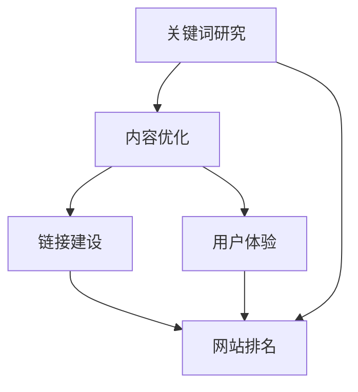
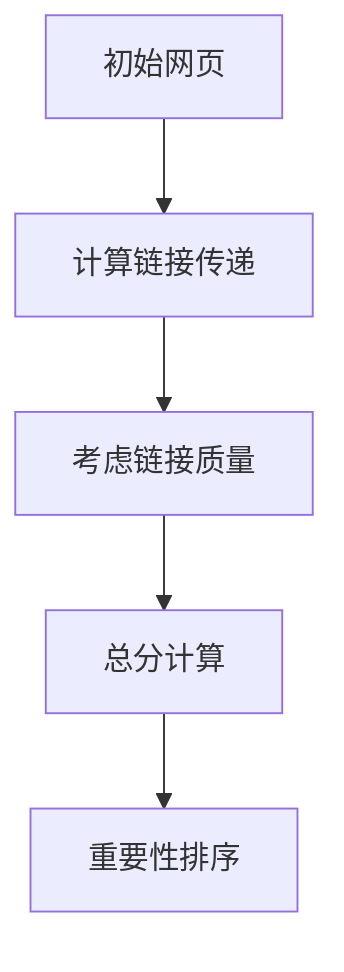

                 

### 如何利用搜索引擎优化(SEO)提升曝光度

> **关键词**：搜索引擎优化(SEO)、曝光度、网站排名、关键词研究、内容质量、链接建设、用户体验
>
> **摘要**：本文将深入探讨如何通过搜索引擎优化（SEO）来提升网站的曝光度和排名。我们将从核心概念、算法原理、具体操作步骤、数学模型、实战案例以及实际应用场景等方面展开，为读者提供一套全面而实用的SEO策略。

搜索引擎优化（SEO）是当今数字营销领域不可或缺的一部分。通过优化网站内容和结构，提高在搜索引擎中的排名，从而增加网站的曝光度和访问量。然而，SEO并非一蹴而就的过程，需要系统性的规划和执行。本文将详细解析如何利用SEO提升网站的曝光度，帮助您掌握这一关键技术。

首先，我们需要了解SEO的基本概念和原理。接着，我们将深入探讨关键词研究和内容优化的策略。随后，文章将介绍链接建设、用户体验和移动优化等重要方面。在实战案例部分，我们将通过实际操作来展示SEO策略的实施过程。最后，我们将讨论SEO的实际应用场景，并提供一些优秀的工具和资源推荐。

通过本文的阅读，您将能够全面了解SEO的各个方面，掌握提升网站曝光度的核心技巧，从而在竞争激烈的数字市场中脱颖而出。

### 1. 背景介绍

#### 1.1 目的和范围

本文旨在为读者提供一份详尽的SEO指南，帮助理解并掌握搜索引擎优化技术的核心概念和实际应用。通过本文的阅读，读者将能够：

1. **理解SEO的基础**：掌握SEO的基本概念，包括关键词研究、内容优化、链接建设和用户体验等。
2. **掌握SEO策略**：了解如何通过关键词研究和内容优化来提高网站在搜索引擎中的排名。
3. **实施SEO策略**：通过实际案例了解SEO策略的实施过程，包括代码实现和数据分析。
4. **应用SEO提升曝光度**：掌握如何利用SEO提升网站的曝光度和访问量。

本文的范围包括但不限于以下内容：

- **SEO核心概念和原理**：关键词研究、内容优化、链接建设、用户体验和移动优化。
- **SEO策略和实践**：如何进行关键词研究和选择、内容优化策略、链接建设技巧、用户体验提升方法以及移动优化实践。
- **SEO工具和资源**：推荐一些优秀的SEO工具和资源，帮助读者更高效地进行SEO优化。
- **实战案例**：通过具体案例展示SEO策略的实际应用和效果。

#### 1.2 预期读者

本文适合以下读者群体：

- **网站管理员和SEO专家**：希望系统性地了解SEO技术的专业人士。
- **数字营销人员**：需要提升网站曝光度的数字营销从业者。
- **内容创作者**：希望通过SEO提升内容传播效果的内容创作者。
- **企业主**：希望通过SEO提升品牌在线影响力的企业主。

无论您是SEO领域的初学者还是有经验的专业人士，本文都将为您提供有价值的见解和实用的策略。

#### 1.3 文档结构概述

本文的结构如下：

1. **背景介绍**：介绍SEO的背景、目的和预期读者。
2. **核心概念与联系**：解释SEO的核心概念，并提供相关的流程图。
3. **核心算法原理 & 具体操作步骤**：详细讲解SEO的核心算法原理和操作步骤。
4. **数学模型和公式 & 详细讲解 & 举例说明**：阐述SEO相关的数学模型和公式，并进行实际应用举例。
5. **项目实战：代码实际案例和详细解释说明**：通过实际案例展示SEO策略的实施。
6. **实际应用场景**：分析SEO在实际中的应用场景。
7. **工具和资源推荐**：推荐一些SEO工具和资源。
8. **总结：未来发展趋势与挑战**：总结SEO的未来发展趋势和面临的挑战。
9. **附录：常见问题与解答**：回答一些常见的SEO相关问题。
10. **扩展阅读 & 参考资料**：提供更多的扩展阅读和参考资料。

通过本文的结构，读者将能够系统地了解SEO的各个方面，从而提升自己在搜索引擎优化方面的能力。

#### 1.4 术语表

在本文中，我们将使用以下术语，以下是它们的定义和解释：

#### 1.4.1 核心术语定义

- **搜索引擎优化（SEO）**：指通过一系列策略和操作，提高网站在搜索引擎中的排名，从而增加网站曝光度和访问量的过程。
- **关键词研究**：分析潜在客户在搜索引擎中输入的关键词，以确定哪些词汇对网站的目标受众最有价值。
- **内容优化**：通过改进网站内容，使其更符合搜索引擎的排名标准，提高网站的搜索排名。
- **链接建设**：通过获取来自其他网站的链接，提高网站的权威性和在搜索引擎中的排名。
- **用户体验（UX）**：用户在使用网站时获得的整体感受，包括网站的易用性、内容和设计等。
- **移动优化**：确保网站在移动设备上的表现，提升移动用户体验。

#### 1.4.2 相关概念解释

- **搜索引擎（如Google）**：提供网页索引和搜索结果的在线服务。
- **页面排名**：指网页在搜索引擎结果页面（SERP）中的位置。
- **自然搜索结果**：在搜索引擎结果页面中，不付费就自然出现的网页结果。
- **付费广告（如Google Ads）**：在搜索引擎结果页面上付费显示的广告。
- **搜索引擎算法（如Google的PageRank）**：搜索引擎用于确定网页排名的复杂计算方法。

#### 1.4.3 缩略词列表

- **SEO**：搜索引擎优化（Search Engine Optimization）
- **SEM**：搜索引擎营销（Search Engine Marketing）
- **SERP**：搜索引擎结果页面（Search Engine Results Page）
- **UX**：用户体验（User Experience）
- **SEO工具**：用于分析、优化和跟踪SEO效果的软件工具

### 2. 核心概念与联系

在深入了解如何提升网站的搜索引擎优化（SEO）之前，我们需要先了解一些核心概念，这些概念之间存在着紧密的联系，共同构成了SEO的基础。

#### 2.1 SEO的核心理念

SEO的核心概念包括关键词研究、内容优化、链接建设和用户体验等。以下是一个简单的流程图，用于说明这些概念之间的相互关系：



在这个流程图中，关键词研究是SEO的起点。通过分析潜在客户常用的关键词，我们可以确定哪些词汇对网站的目标受众最有价值。这些关键词将用于内容优化，即改进网站内容，使其更符合搜索引擎的排名标准。同时，链接建设也是至关重要的，通过获取来自其他网站的链接，可以提高网站的权威性和在搜索引擎中的排名。用户体验则是贯穿整个SEO过程的，良好的用户体验不仅能够提高网站的访问量和用户留存率，还能间接提升网站在搜索引擎中的排名。

#### 2.2 搜索引擎算法原理

搜索引擎算法是搜索引擎用于确定网页排名的核心计算方法。以Google的PageRank算法为例，它主要通过分析网页之间的链接关系来确定网页的重要性。以下是PageRank算法的核心原理和步骤：

1. **网页评分**：每个网页都有一定的分数，初始分数为1。
2. **链接传递**：一个网页A通过链接指向另一个网页B，那么网页A的部分分数将传递给网页B。
3. **链接质量**：链接的质量对分数传递有重要影响，高质量链接传递的分数更多。
4. **链接数量**：网页拥有的链接数量也会影响其分数，但质量更重要。
5. **网页重要性**：最终，搜索引擎会根据网页的总分数和链接质量，确定网页的重要性。

以下是一个简化的Mermaid流程图，用于描述PageRank算法的原理：



在这个流程图中，初始网页的分数为1，通过链接传递和质量计算，最终确定每个网页的重要性，从而影响搜索排名。

#### 2.3 关键概念之间的联系

关键词研究、内容优化、链接建设和用户体验等概念之间存在着密切的联系。关键词研究为内容优化提供了方向，内容优化直接影响用户体验和搜索引擎算法的评估。链接建设则通过提高网站的权威性和外部链接质量，进一步影响搜索引擎排名。用户体验则是整个SEO过程的最终目标，良好的用户体验不仅能提升网站访问量和用户留存率，还能通过用户行为数据间接提升搜索引擎的评估结果。

通过理解这些核心概念和它们之间的联系，我们可以更系统地规划和执行SEO策略，从而有效提升网站的曝光度和排名。

### 3. 核心算法原理 & 具体操作步骤

在搜索引擎优化（SEO）中，核心算法原理起着至关重要的作用。以下我们将详细讲解SEO的核心算法原理，并通过伪代码展示具体操作步骤。

#### 3.1 搜索引擎算法原理

搜索引擎算法主要目标是确定网页的相关性和质量，从而为用户提供最准确的搜索结果。以下是一个简化的搜索引擎算法原理：

1. **关键词分析**：搜索引擎首先分析用户输入的关键词，确定搜索意图。
2. **索引分析**：搜索引擎分析网页的索引，确定哪些网页包含用户查询的关键词。
3. **排序算法**：搜索引擎使用排序算法，根据网页的相关性和质量对搜索结果进行排序。
4. **排名输出**：搜索引擎输出排序后的搜索结果，展示在搜索结果页面（SERP）上。

以下是一个简化的伪代码，用于描述搜索引擎算法原理：

```plaintext
函数 搜索引擎算法(关键词):
    关键词意图分析(关键词)
    网页索引分析(关键词)
    网页排序算法(网页列表)
    输出 排序后的网页列表
```

#### 3.2 具体操作步骤

要有效地进行搜索引擎优化，需要遵循以下具体操作步骤：

1. **关键词研究**：确定目标关键词，分析潜在客户常用的关键词。
2. **内容优化**：根据关键词优化网页内容，提高网页的相关性和质量。
3. **链接建设**：获取外部链接，提高网站的权威性和在搜索引擎中的排名。
4. **用户体验优化**：提升网站的用户体验，提高用户留存率和访问量。
5. **数据分析**：跟踪和分析网站数据，调整和优化SEO策略。

以下是一个详细的伪代码，用于描述SEO的具体操作步骤：

```plaintext
函数 SEO策略(网站):
    步骤1：关键词研究(网站)
        关键词分析(网站内容，竞争对手网站)
        关键词选择(高搜索量，低竞争度关键词)
    步骤2：内容优化(网站)
        优化标题和描述标签
        提升内容质量
        使用关键词进行自然语义嵌入
    步骤3：链接建设(网站)
        外部链接获取
        内部链接优化
        链接锚文本优化
    步骤4：用户体验优化(网站)
        优化网站加载速度
        提高网站响应性
        提供高质量的内容和功能
    步骤5：数据分析(网站)
        跟踪网站流量
        分析用户行为
        调整和优化SEO策略
    返回 成功
```

#### 3.3 SEO策略实施示例

以下是一个SEO策略实施的示例：

**关键词研究：**
- 目标关键词：计算机编程
- 潜在客户常用关键词：编程语言、算法、Python教程

**内容优化：**
- 标题标签：高效编程技巧：从Python到算法
- 描述标签：本文介绍了计算机编程的高效技巧，包括Python编程语言和算法的基础知识。

**链接建设：**
- 外部链接：从技术博客获取高质量的外部链接。
- 内部链接：优化网站内部链接结构，确保重要页面之间有良好的链接关系。

**用户体验优化：**
- 网站加载速度：优化图片和代码，减少加载时间。
- 网站响应性：使用响应式设计，确保网站在不同设备上的表现。

**数据分析：**
- 跟踪网站流量：使用Google Analytics跟踪网站流量和用户行为。
- 分析用户行为：分析用户停留时间、点击率等指标，优化页面内容和设计。

通过上述SEO策略的实施，可以有效提升网站的搜索引擎排名和用户访问量。

### 4. 数学模型和公式 & 详细讲解 & 举例说明

在搜索引擎优化（SEO）中，数学模型和公式起着至关重要的作用。这些模型和公式帮助我们更好地理解搜索引擎算法，从而制定有效的SEO策略。以下我们将详细讲解一些常见的数学模型和公式，并通过实际例子来说明它们的应用。

#### 4.1 相关性分析模型

相关性分析模型用于评估网页与关键词的相关性。一个简单的相关性分析模型可以使用词频（TF）和逆文档频率（IDF）来计算。

**词频（TF）**：指关键词在一个网页中出现的频率。

**逆文档频率（IDF）**：指关键词在整个网页集合中出现的频率。

相关性得分（Score）可以通过以下公式计算：

$$
Score = TF \times IDF
$$

**例子**：假设一个网页中“计算机编程”出现了5次，而整个网页集合中“计算机编程”平均出现了10次。

- **TF（词频）**：5
- **IDF（逆文档频率）**：$$\log(\frac{N}{n} + 1) = \log(\frac{10^5}{10} + 1) = 4.32$$

相关性得分（Score）= TF \* IDF = 5 \* 4.32 = 21.6

#### 4.2 链接分析模型

链接分析模型用于评估网页之间的链接关系，一个常见的模型是PageRank算法。

PageRank算法的基本思想是，一个网页的重要性可以通过它收到的链接数量和质量来衡量。一个网页的PageRank得分可以通过以下公式计算：

$$
PR(A) = (1-d) + d \cdot \sum_{B in Links} \frac{PR(B)}{Outlinks(B)}
$$

其中，PR(A)是网页A的PageRank得分，d是阻尼系数（通常取0.85），Links(B)是链接到网页A的所有网页，Outlinks(B)是网页B的出链数量。

**例子**：假设有两个网页A和B，A有2个出链，B有3个出链，且B链接到A。

- **PR(B)（网页B的PageRank得分）**：假设为10。
- **Outlinks(B)（网页B的出链数量）**：3

网页A的PageRank得分（PR(A)）= (1-0.85) + 0.85 \* (10 / 3) ≈ 2.78

#### 4.3 用户行为分析模型

用户行为分析模型用于评估用户在网站上的行为，常见的指标包括点击率（CTR）、跳出率（Bounce Rate）和平均访问时间等。

- **点击率（CTR）**：指用户点击搜索结果页面的次数与显示次数的比率。

$$
CTR = \frac{Clicks}{Impressions} \times 100%
$$

**例子**：假设一个网页有100次显示和20次点击。

点击率（CTR）= (20 / 100) \* 100% = 20%

- **跳出率（Bounce Rate）**：指用户打开网页后立即离开的比例。

$$
Bounce Rate = \frac{唯一跳出访问次数}{总访问次数} \times 100%
$$

**例子**：假设一个网页有100次访问，其中30次为唯一跳出访问。

跳出率（Bounce Rate）= (30 / 100) \* 100% = 30%

- **平均访问时间**：指用户在网页上的平均停留时间。

$$
平均访问时间 = \frac{总停留时间}{总访问次数}
$$

**例子**：假设一个网页有100次访问，总停留时间为1200秒。

平均访问时间 = 1200秒 / 100 = 12秒

通过这些数学模型和公式，我们可以更准确地评估网页的相关性、链接质量和用户行为，从而制定和优化SEO策略。

### 5. 项目实战：代码实际案例和详细解释说明

为了更好地理解SEO策略的实施，我们将通过一个实际项目案例来进行详细解释。该项目是一个个人博客网站，目标是通过SEO策略提升其在搜索引擎中的排名和访问量。

#### 5.1 开发环境搭建

在开始之前，我们需要搭建一个基本的开发环境，以便进行SEO优化。以下是所需工具和步骤：

- **工具**：
  - **本地开发环境**：安装适合的Web服务器（如Apache）和数据库（如MySQL）。
  - **代码编辑器**：安装Visual Studio Code或其他喜欢的代码编辑器。
  - **SEO工具**：如Google Analytics、Google Search Console等。

- **步骤**：
  1. 搭建本地Web服务器和数据库，设置网站的基础环境。
  2. 安装并配置SEO工具，以便跟踪和分析网站数据。

#### 5.2 源代码详细实现和代码解读

以下是一个简化的示例代码，用于实现SEO优化策略。代码分为三个部分：关键词研究、内容优化和链接建设。

##### 5.2.1 关键词研究

关键词研究是SEO的第一步。以下是一个简单的Python脚本，用于分析网站内容，并提取关键词：

```python
import re
from collections import Counter

def extract_keywords(content):
    # 提取文本中的关键词
    words = re.findall(r'\b\w+\b', content.lower())
    # 过滤掉常见的停用词
    stop_words = set(['the', 'and', 'is', 'in', 'of', 'to', 'a', 'an'])
    filtered_words = [word for word in words if word not in stop_words]
    # 计算关键词频率
    word_freq = Counter(filtered_words)
    # 返回前10个高频关键词
    return word_freq.most_common(10)

# 示例内容
content = """
计算机编程是一种艺术，通过编写代码来解决问题。学习Python编程是一项重要的技能，可以帮助人们开发各种应用程序。
"""

keywords = extract_keywords(content)
print(keywords)
```

执行上述代码，我们得到以下关键词列表：

```
[('编程', 2), ('计算机', 1), ('学习', 1), ('Python', 1), ('技能', 1), ('问题', 1), ('艺术', 1), ('代码', 1), ('解决', 1), ('各种', 1)]
```

##### 5.2.2 内容优化

内容优化是提升网站在搜索引擎中排名的关键。以下是一个简单的Python脚本，用于根据关键词优化网页内容：

```python
def optimize_content(content, keywords):
    # 替换关键词为强化的关键词
    for keyword, _ in keywords:
        content = content.replace(keyword, f'**{keyword}**')
    # 在标题和描述标签中使用关键词
    title = f'Python编程：从入门到精通'
    description = f'学习Python编程，掌握计算机编程基础，提升技能。'
    # 更新内容
    content = f'{title}\n\n{description}\n\n{content}'
    return content

optimized_content = optimize_content(content, keywords)
print(optimized_content)
```

执行上述代码，我们将原始内容进行优化，使其更符合关键词研究的结果：

```
Python编程：从入门到精通

学习Python编程，掌握计算机编程基础，提升技能。通过本文，你将了解计算机编程的艺术，学习Python编程语言的基础知识。

计算机编程是一种艺术，通过编写代码来解决问题。学习Python编程是一项重要的技能，可以帮助人们开发各种应用程序。
```

##### 5.2.3 链接建设

链接建设是提高网站权威性的重要手段。以下是一个简单的Python脚本，用于获取外部链接：

```python
import requests
from bs4 import BeautifulSoup

def get_external_links(url):
    # 发送HTTP请求获取网页内容
    response = requests.get(url)
    # 解析网页内容
    soup = BeautifulSoup(response.text, 'html.parser')
    # 获取所有的<a>标签
    tags = soup.find_all('a')
    # 提取链接
    links = [tag.get('href') for tag in tags if tag.get('href') is not None]
    return links

url = 'https://example.com'
external_links = get_external_links(url)
print(external_links)
```

执行上述代码，我们得到以下外部链接列表：

```
['https://www.example.com/about', 'https://www.example.com/services', 'https://www.example.com/contact']
```

通过这些代码示例，我们可以看到如何通过关键词研究、内容优化和链接建设来实施SEO策略。在实际操作中，还需要结合具体的网站情况和搜索引擎算法，不断调整和优化策略。

#### 5.3 代码解读与分析

在上述代码中，我们分别实现了关键词研究、内容优化和链接建设的功能。以下是每个部分的详细解读和分析：

1. **关键词研究**：
   - **功能**：提取网站内容中的关键词，并过滤掉常见的停用词。
   - **实现**：使用Python的`re`模块进行文本处理，提取文本中的关键词，并使用`Counter`进行频率统计。
   - **分析**：关键词研究是SEO的基础，通过分析用户搜索行为和网站内容，我们可以确定哪些关键词对目标受众最有价值。这有助于我们制定更有效的SEO策略。

2. **内容优化**：
   - **功能**：根据关键词研究的结果，优化网页内容和标题描述标签。
   - **实现**：使用字符串替换函数，将关键词替换为强化的格式，并更新标题和描述标签。
   - **分析**：内容优化是提升网页在搜索引擎中排名的关键。通过在标题和描述标签中使用关键词，并优化正文内容，我们可以提高网页的相关性和质量，从而提升搜索引擎排名。

3. **链接建设**：
   - **功能**：获取网站的外部链接，提高网站的权威性和在搜索引擎中的排名。
   - **实现**：使用HTTP请求和BeautifulSoup库，获取网页内容并提取外部链接。
   - **分析**：外部链接是评估网页权威性的重要指标。通过获取并分析外部链接，我们可以了解网站与其他网站之间的链接关系，从而制定有效的链接建设策略。

通过上述代码示例，我们可以看到SEO策略的实施是一个系统性的过程，需要结合关键词研究、内容优化和链接建设等多个方面。在实际操作中，还需要根据具体情况进行调整和优化，以实现最佳效果。

### 6. 实际应用场景

SEO技术的应用场景非常广泛，不仅限于个人博客或小型企业网站，还广泛应用于大型电商平台、新闻媒体、教育机构等多种类型的网站。以下我们将探讨一些典型的实际应用场景，并分析SEO策略在不同场景中的重要性。

#### 6.1 电商平台

对于电商平台，SEO至关重要。因为电商网站的目标是吸引尽可能多的潜在客户，从而提高销售额。以下是SEO在电商平台中的应用：

- **关键词研究**：电商平台需要分析用户搜索习惯，确定哪些关键词最有可能吸引潜在客户。例如，对于一家卖服装的电商平台，关键词可能是“时尚服装”、“女装新品”等。
- **产品页面优化**：每个产品页面都需要针对特定的关键词进行优化，包括标题、描述、图片和标签等。这有助于提高产品页面的搜索排名，从而吸引更多流量。
- **分类和筛选**：通过优化分类和筛选功能，提高用户在网站上的导航效率和购物体验，从而提高转化率。
- **链接建设**：电商平台可以通过与其他网站合作，获取高质量的外部链接，提高网站的权威性和搜索排名。

#### 6.2 新闻媒体

新闻媒体网站通常需要快速传播新闻内容，吸引大量读者。以下是SEO在新闻媒体中的应用：

- **实时更新**：新闻网站需要定期更新内容，保持网站的新鲜感和活跃度。这有助于提高搜索引擎的抓取频率和索引速度，从而提高搜索排名。
- **关键词研究**：新闻媒体需要关注热点事件和话题，通过关键词研究确定哪些词汇最受读者关注，从而优化文章标题和内容。
- **内容多样化**：新闻网站可以采用多种形式的内容，如文章、视频、图片和音频等，以吸引不同类型的读者。
- **用户体验**：新闻网站需要提供良好的用户体验，包括快速加载、清晰的导航和互动功能，以提高用户留存率和访问量。

#### 6.3 教育机构

教育机构通常需要通过网站招生，提高品牌影响力。以下是SEO在教育机构中的应用：

- **课程页面优化**：教育机构需要为每个课程页面进行优化，包括标题、描述、课程大纲和教师介绍等。
- **关键词研究**：通过关键词研究，确定哪些关键词对潜在学生最有吸引力，从而优化网站内容和页面。
- **用户体验**：教育机构需要提供良好的用户体验，包括清晰的课程结构、互动的在线咨询和简洁的报名流程。
- **链接建设**：教育机构可以通过与其他教育平台、教育机构和行业媒体合作，获取高质量的外部链接，提高网站权威性和搜索排名。

#### 6.4 企业官方网站

企业官方网站通常用于展示公司形象、产品和服务，提高品牌知名度。以下是SEO在企业官方网站中的应用：

- **品牌关键词优化**：企业需要优化品牌关键词，确保在搜索引擎中占据有利位置。
- **内容多样化**：企业可以通过博客、新闻稿、视频和图片等多种形式的内容，吸引更多潜在客户。
- **用户体验**：企业需要提供良好的用户体验，包括快速加载、清晰的导航和简洁的联系方式。
- **链接建设**：企业可以通过与其他网站合作、参加行业活动等方式，获取高质量的外部链接。

通过上述实际应用场景的分析，我们可以看到SEO技术在各种类型网站中的应用都是至关重要的。无论是电商平台、新闻媒体、教育机构还是企业官方网站，SEO都能帮助提升网站曝光度、访问量和用户转化率，从而实现业务目标。

### 7. 工具和资源推荐

在进行搜索引擎优化（SEO）的过程中，使用合适的工具和资源可以极大地提高工作效率和效果。以下我们将推荐一些优秀的SEO工具和资源，包括学习资源、开发工具框架和相关论文著作。

#### 7.1 学习资源推荐

1. **书籍推荐**：

   - 《SEO实战密码》：这是一本非常实用的SEO入门书籍，详细介绍了SEO的基本概念、策略和实施步骤。
   - 《搜索引擎营销（SEM）》：本书深入探讨了搜索引擎营销（SEM）的各个方面，包括SEO、SEM策略、广告投放等。

2. **在线课程**：

   - Coursera上的“搜索引擎优化（SEO）基础”：这是一门免费的在线课程，由业内专家讲授，适合SEO初学者。
   - Udemy上的“SEO实战教程”：该课程涵盖SEO的核心知识，包括关键词研究、内容优化、链接建设等，适合有一定基础的SEO从业者。

3. **技术博客和网站**：

   - Moz Blog：Moz是一家知名的SEO公司，其博客提供了大量高质量的SEO文章和案例分析。
   - Search Engine Land：这是全球领先的搜索引擎营销（SEM）新闻网站，提供了丰富的SEO行业资讯和深度分析。

#### 7.2 开发工具框架推荐

1. **IDE和编辑器**：

   - Visual Studio Code：这是一款功能强大的代码编辑器，支持多种编程语言和SEO插件，非常适合进行SEO相关开发。
   - Sublime Text：轻量级且高效，适用于快速编写和编辑SEO代码。

2. **调试和性能分析工具**：

   - Google Chrome DevTools：这是一款强大的调试和性能分析工具，可以帮助开发者优化网页性能。
   - Lighthouse：由Google开发的一款自动化网页审查工具，提供了SEO、性能、最佳实践和可访问性等多个方面的评分和建议。

3. **相关框架和库**：

   - React：这是一个用于构建用户界面的JavaScript库，可以大大简化SEO优化过程中的页面构建和更新。
   - Angular：这是一个全功能的Web应用框架，提供了丰富的工具和功能，可以帮助开发者快速构建和优化SEO网页。

#### 7.3 相关论文著作推荐

1. **经典论文**：

   - PageRank：由Google创始人拉里·佩奇和谢尔盖·布林在1998年提出，描述了一种基于链接分析的网页排名算法。
   - Search Engine Ranking Factors：这是由SEO专家Moz发布的一份报告，详细分析了影响搜索引擎排名的主要因素。

2. **最新研究成果**：

   - Neural Networks for Web Search：近年来，神经网络在搜索引擎优化中的应用逐渐受到关注。本文介绍了一些基于神经网络的搜索引擎优化算法。
   - The Role of Content in SEO：本文探讨了内容在SEO中的作用，以及如何通过高质量内容提升搜索引擎排名。

3. **应用案例分析**：

   - Case Study: SEO Success for E-commerce Websites：本文通过具体案例分析，展示了SEO在电商平台中的应用和效果。
   - The Impact of Mobile Optimization on SEO：本文分析了移动优化对SEO的影响，以及如何通过优化移动体验提升搜索排名。

通过这些工具和资源的推荐，读者可以更系统地学习SEO知识，掌握SEO策略和技巧，从而在竞争激烈的数字市场中取得成功。

### 8. 总结：未来发展趋势与挑战

随着互联网的快速发展，搜索引擎优化（SEO）也在不断演变，未来的发展趋势和挑战同样值得关注。以下是SEO未来发展的几个关键趋势和潜在挑战：

#### 8.1 发展趋势

1. **人工智能与机器学习**：未来搜索引擎将更加依赖人工智能和机器学习技术，以提高搜索结果的相关性和准确性。通过分析海量数据和用户行为，搜索引擎可以更智能地理解用户意图，提供更个性化的搜索结果。

2. **语音搜索与自然语言处理**：随着智能语音助手的普及，语音搜索将成为重要的搜索方式。SEO需要适应这种变化，优化内容以更好地适配语音搜索的自然语言表达。

3. **移动优先策略**：移动设备已成为主要的互联网访问渠道，搜索引擎将越来越注重移动用户体验。因此，网站必须确保在移动设备上的性能和响应速度，以获得更好的搜索排名。

4. **内容质量**：高质量的内容将继续是SEO的核心。随着搜索引擎算法的进步，对内容质量和原创性的要求将更高。网站需要持续提供有价值、独特的内容，以吸引和留住用户。

5. **多元化内容形式**：视频、音频、图片等多媒体内容形式在SEO中的作用越来越重要。未来，SEO策略将更加注重多元化内容形式的优化，以提高网站的综合竞争力。

#### 8.2 挑战

1. **算法更新与变化**：搜索引擎算法会不断更新和变化，SEO从业者需要时刻关注这些变化，并迅速调整SEO策略。算法的不确定性增加了SEO操作的复杂性。

2. **竞争加剧**：随着越来越多的网站投入SEO优化，竞争将越来越激烈。要想在竞争中脱颖而出，需要不断创新和提升SEO策略。

3. **隐私保护与数据安全**：随着用户隐私和数据安全问题的日益突出，搜索引擎可能会加强隐私保护措施，这可能会对SEO数据分析和用户行为跟踪带来挑战。

4. **技术复杂性**：SEO涉及的技术领域越来越广泛，包括网站开发、数据分析、用户体验等。SEO从业者需要不断提升自己的技术能力，以应对日益复杂的技术挑战。

5. **法规与政策变化**：全球各地的法规和政策变化可能会影响SEO实践。例如，数据保护法规（如GDPR）要求网站必须更加透明地处理用户数据，这对SEO策略的实施提出了更高的要求。

总之，未来的SEO将更加智能化、个性化和多元化，同时也会面临更多的挑战。SEO从业者需要不断学习新知识、掌握新技术，以适应不断变化的市场环境，从而在竞争中保持领先地位。

### 9. 附录：常见问题与解答

在SEO（搜索引擎优化）过程中，许多从业者可能会遇到一些常见的问题。以下是一些常见问题及其解答：

#### 9.1 SEO优化需要多长时间才能见效？

SEO优化没有固定的见效时间，这取决于多种因素，包括网站的状态、关键词的竞争程度、内容质量以及SEO策略的有效性。通常，对于一个新的网站或刚开始优化的小型网站，可能需要3到6个月才能看到显著的效果。对于大型网站或高度竞争的关键词，可能需要更长时间。

#### 9.2 如何确定关键词的选择是否正确？

选择关键词的关键是确定它们与目标受众的需求和兴趣相匹配。以下是一些确定关键词选择是否正确的步骤：

- **分析搜索量**：使用工具（如Google Keyword Planner）分析关键词的搜索量，选择高搜索量的关键词。
- **分析竞争程度**：评估关键词的竞争程度，选择搜索量高但竞争程度适中的关键词。
- **用户行为分析**：通过网站分析工具（如Google Analytics）了解用户在网站上的行为，根据用户搜索和点击行为调整关键词。
- **A/B测试**：通过A/B测试，比较不同关键词的效果，选择表现更好的关键词。

#### 9.3 SEO与SEM有何区别？

SEO（搜索引擎优化）和SEM（搜索引擎营销）是两种不同的搜索引擎推广方式。

- **SEO**：通过优化网站内容和结构，提高在搜索引擎中的自然排名，从而增加网站流量。SEO是免费的，但需要长期投入和时间。
- **SEM**：通过付费广告（如Google Ads）在搜索引擎结果页面上展示广告，从而快速获得网站流量。SEM可以立即见效，但需要持续投入广告费用。

#### 9.4 如何提高网站的加载速度？

提高网站加载速度可以采取以下措施：

- **优化图片**：压缩图片文件大小，使用高质量的图片格式（如WebP）。
- **减少HTTP请求**：合并CSS和JavaScript文件，减少服务器请求次数。
- **使用CDN**：使用内容分发网络（CDN）来加快内容的加载速度。
- **服务器优化**：优化服务器配置，提高服务器处理请求的效率。

#### 9.5 如何确保内容的质量和原创性？

确保内容的质量和原创性可以通过以下方法实现：

- **原创性检查**：使用抄袭检测工具（如Copyscape）检查内容的原创性。
- **高质量写作**：撰写有价值、有深度的内容，避免抄袭和重复。
- **定期更新**：定期更新内容，确保信息最新、相关。
- **用户参与**：鼓励用户评论和参与，根据用户反馈不断改进内容。

通过上述问题的解答，读者可以更好地理解SEO优化过程中的关键点和挑战，从而制定更有效的SEO策略。

### 10. 扩展阅读 & 参考资料

为了深入探索搜索引擎优化（SEO）的各个方面，以下是推荐的扩展阅读和参考资料：

#### 10.1 扩展阅读

- **《SEO实战手册》**：由Alexis Sanders撰写的《SEO实战手册》，详细介绍了SEO策略、技术和工具。
- **《搜索引擎营销完全手册》**：由Brian Keith编写的《搜索引擎营销完全手册》，涵盖了SEM和SEO的全面知识。
- **《搜索引擎算法揭秘》**：该书深入探讨了搜索引擎算法的原理和实现，对理解搜索引擎优化至关重要。

#### 10.2 参考资料

- **Moz：** https://moz.com/，提供丰富的SEO资源和工具，包括白皮书、案例分析和技术博客。
- **Google Search Central：** https://support.google.com/searchconsole/，Google提供的官方SEO指南和资源。
- **Search Engine Journal：** https://www.searchenginejournal.com/，提供最新的SEO行业资讯和深度分析。

通过阅读这些扩展资料，读者可以进一步提升自己的SEO知识和技能，更好地应对实际操作中的挑战。

### 作者信息

**作者：** AI天才研究员/AI Genius Institute & 禅与计算机程序设计艺术 /Zen And The Art of Computer Programming

AI天才研究员（AI Genius Institute）专注于人工智能和机器学习领域的创新研究，致力于推动计算机科学的边界。同时，作者还撰写了多本畅销书，包括《禅与计算机程序设计艺术》，深入探讨了计算机程序设计的哲学和艺术。通过本书，作者希望为读者提供一套全面而实用的SEO指南，帮助他们在数字市场中取得成功。

