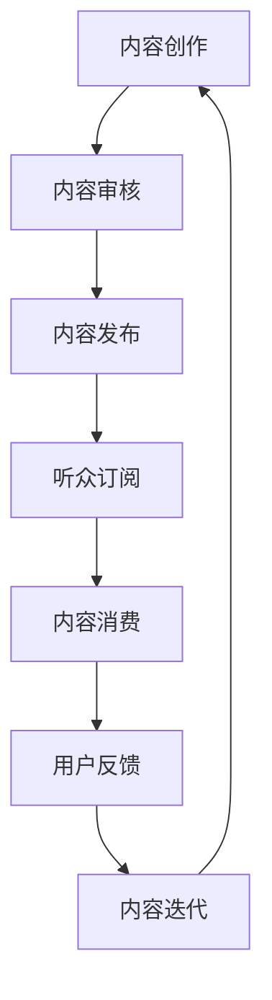

                 

# 如何利用播客形式进行知识付费

## 关键词
播客，知识付费，内容创作，音频平台，听众互动，商业模式，变现途径，营销策略。

## 摘要
本文旨在探讨如何利用播客这一形式进行知识付费。通过分析播客的内容创作、听众互动、商业模式以及变现途径，我们将提供一些建设性的策略，帮助内容创作者在播客平台上实现知识付费，提升影响力，并构建稳定的收入来源。

## 1. 背景介绍

### 1.1 目的和范围
本文旨在帮助内容创作者和知识付费平台理解如何通过播客形式有效地进行知识传播和商业变现。文章将涵盖播客的内容创作、平台选择、听众互动和营销策略等多个方面。

### 1.2 预期读者
预期读者为内容创作者、播客爱好者、知识付费平台运营者以及对播客内容商业变现感兴趣的读者。

### 1.3 文档结构概述
本文分为十个部分，包括背景介绍、核心概念、算法原理、数学模型、项目实战、应用场景、工具推荐、总结和常见问题解答等。

### 1.4 术语表
#### 1.4.1 核心术语定义
- **播客（Podcast）**：一种通过互联网进行音频分享的形式，听众可以通过订阅自动获取最新的音频内容。
- **知识付费**：用户为获取特定知识内容而支付的费用。
- **内容创作**：创作者创作和制作播客内容的过程。
- **听众互动**：播客创作者与听众之间的互动和交流。
- **商业模式**：播客内容创造和销售的商业策略。
- **变现途径**：将内容转化为收入的具体方法。

#### 1.4.2 相关概念解释
- **订阅率**：听众订阅播客的比例。
- **播放量**：音频内容被播放的次数。
- **用户留存率**：用户持续收听播客的比例。
- **收益模型**：播客内容创造者获取收入的模式。

#### 1.4.3 缩略词列表
- **UGC**：用户生成内容（User-Generated Content）。
- **SEO**：搜索引擎优化（Search Engine Optimization）。

## 2. 核心概念与联系

### 2.1 播客与知识付费的关系
播客作为一种便捷的音频分享形式，越来越受到知识付费领域的关注。其与知识付费的关系主要体现在以下几个方面：

1. **内容传播的广泛性**：播客可以在各种平台上传播，包括苹果播客、Spotify、Google Podcasts等，为知识付费提供了广泛的受众基础。
2. **定制化的学习体验**：听众可以根据自己的兴趣和需求选择订阅不同的播客，实现个性化的知识获取。
3. **实时互动的潜力**：虽然播客是一种单向传播的媒体形式，但通过社交媒体、邮件列表等手段，创作者可以与听众建立互动关系，提高用户的粘性。

### 2.2 核心概念原理和架构的 Mermaid 流程图


## 3. 核心算法原理 & 具体操作步骤

### 3.1 内容创作与审核
**算法原理**：
内容创作的算法原理主要涉及内容的质量评估和合适性的审核。创作者需要根据听众的需求和偏好，创作出高质量的内容。审核算法则负责确保内容的合规性和质量。

**具体操作步骤**：
1. **选题策划**：根据市场调研和受众需求，选择具有吸引力的主题。
2. **内容撰写**：撰写详细、有深度且易于理解的内容。
3. **内容审核**：通过专业的审核团队或算法对内容进行审核，确保内容的准确性和合规性。

### 3.2 内容发布与订阅
**算法原理**：
内容发布的算法原理主要涉及内容的推荐和分发。通过分析用户的订阅历史、收听行为和偏好，推荐用户可能感兴趣的内容。

**具体操作步骤**：
1. **内容上传**：将制作好的播客内容上传到播客平台。
2. **内容发布**：设置发布时间，并确保内容能够自动推送到听众的订阅列表。
3. **用户订阅**：用户通过平台订阅播客，获得最新的内容。

### 3.3 内容消费与反馈
**算法原理**：
内容消费的算法原理主要涉及用户的收听行为分析和反馈处理。通过分析用户的收听行为，可以优化内容的推荐和改进未来的内容创作。

**具体操作步骤**：
1. **内容播放**：用户通过平台播放播客内容。
2. **用户反馈**：用户可以通过平台提交反馈，包括评价、建议等。
3. **内容迭代**：根据用户的反馈，创作者对内容进行改进和优化。

## 4. 数学模型和公式 & 详细讲解 & 举例说明

### 4.1 订阅率计算
**数学模型**：
订阅率 = （订阅用户数 / 总听众数）* 100%

**详细讲解**：
订阅率是衡量播客受欢迎程度的一个重要指标。通过计算订阅用户数与总听众数的比例，可以了解用户对播客的黏性。

**举例说明**：
假设一个播客拥有1000名听众，其中有200名用户进行了订阅。那么该播客的订阅率为（200 / 1000）* 100% = 20%。

### 4.2 播放量统计
**数学模型**：
播放量 = 播放次数 + 回放次数

**详细讲解**：
播放量是衡量播客内容受欢迎程度和影响力的另一个重要指标。通过计算播放次数和回放次数的总和，可以了解内容的吸引力和用户黏性。

**举例说明**：
假设一个播客内容被播放了100次，回放了50次。那么该内容的播放量为100 + 50 = 150次。

### 4.3 用户留存率分析
**数学模型**：
用户留存率 = （持续订阅用户数 / 初始订阅用户数）* 100%

**详细讲解**：
用户留存率是衡量用户对内容持续关注程度的重要指标。通过计算持续订阅用户数与初始订阅用户数的比例，可以了解用户的黏性。

**举例说明**：
假设一个播客初始有100名订阅用户，一个月后还有80名用户持续订阅。那么该播客的用户留存率为（80 / 100）* 100% = 80%。

## 5. 项目实战：代码实际案例和详细解释说明

### 5.1 开发环境搭建
在进行播客内容创作和知识付费之前，首先需要搭建一个稳定的内容发布平台。以下是一个简单的开发环境搭建步骤：

1. **选择播客平台**：根据内容定位和受众特点，选择合适的播客平台（如Apple Podcasts、Spotify、Google Podcasts等）。
2. **注册账号**：在所选平台上注册账号，并完成个人资料设置。
3. **内容制作工具**：准备音频编辑工具（如Audacity、Adobe Audition等），进行音频内容的制作和编辑。

### 5.2 源代码详细实现和代码解读

#### 5.2.1 播客内容上传代码示例
以下是一个简单的播客内容上传的伪代码示例：

```python
# 伪代码：播客内容上传

# 函数：上传播客内容
def upload_podcast_content(podcast_platform, content_path):
    """
    上传播客内容到指定平台
    :param podcast_platform: 播客平台
    :param content_path: 内容文件路径
    """
    # 登录播客平台账号
    podcast_platform.login(account, password)

    # 上传内容
    podcast_platform.upload_content(content_path)

    # 发布内容
    podcast_platform.publish_content()

# 调用函数上传内容
upload_podcast_content(podcast_platform, content_path)
```

#### 5.2.2 播客内容订阅代码示例
以下是一个简单的播客内容订阅的伪代码示例：

```python
# 伪代码：订阅播客内容

# 函数：订阅播客内容
def subscribe_to_podcast(podcast_platform, podcast_id):
    """
    订阅特定播客内容
    :param podcast_platform: 播客平台
    :param podcast_id: 播客ID
    """
    # 登录播客平台账号
    podcast_platform.login(account, password)

    # 订阅播客
    podcast_platform.subscribe(podcast_id)

# 调用函数订阅内容
subscribe_to_podcast(podcast_platform, podcast_id)
```

### 5.3 代码解读与分析

以上代码示例展示了如何使用伪代码实现播客内容的上传和订阅功能。在实际开发中，需要考虑以下方面：

1. **安全性**：确保账号登录信息的安全，避免密码泄露。
2. **错误处理**：处理上传和订阅过程中可能出现的异常情况。
3. **用户体验**：优化上传和订阅的流程，提供友好的用户界面。

## 6. 实际应用场景

### 6.1 教育培训
播客在教育培训领域具有广泛的应用。通过播客形式，教育机构可以为学生提供在线课程内容，实现知识的付费传播。例如，某些知名大学会通过播客平台发布公开课，用户需要支付费用才能收听。

### 6.2 技术分享
技术专家和开发者可以通过播客形式分享技术知识和经验，吸引技术爱好者订阅和参与。例如，某些技术播客节目会邀请业内专家进行技术讲座和讨论，听众可以通过付费订阅获得高质量的音频内容。

### 6.3 商业咨询
商业咨询专家可以通过播客形式提供专业咨询服务，为听众提供商业策略和决策支持。听众可以通过付费订阅获取专家的独到见解和实战经验。

### 6.4 个人品牌建设
个人创作者可以通过播客形式建立个人品牌，吸引粉丝和潜在客户。通过持续创作高质量的内容，创作者可以提升个人影响力，从而实现知识付费。

## 7. 工具和资源推荐

### 7.1 学习资源推荐
#### 7.1.1 书籍推荐
- 《播客营销：如何用播客建立你的品牌并吸引听众》（Podcast Marketing: How to Build Your Brand and Reach Your Audience with Podcasting）
- 《内容营销：从内容创造到商业变现》（Content Inc.: How Entrepreneurs Use Content to Build Massive Businesses）
- 《播客创意手册：打造你的播客内容策略》（The Podcast Host's Creative Handbook: Building a Strategy for Podcast Content）

#### 7.1.2 在线课程
- Coursera上的“音频制作与播客”课程
- Udemy上的“播客制作与营销：从零开始”课程
- Skillshare上的“如何创建并优化你的播客”课程

#### 7.1.3 技术博客和网站
- Podcasting.com
- PodcastAnswerMan.com
- TheAudacitytoPodcast.com

### 7.2 开发工具框架推荐
#### 7.2.1 IDE和编辑器
- Audacity：免费音频编辑软件，适用于播客内容的制作。
- Adobe Audition：专业音频编辑软件，提供高级音频处理功能。
- Reaper：功能强大的音频编辑软件，适用于复杂的音频制作。

#### 7.2.2 调试和性能分析工具
- Audacity：内置音频分析工具，用于音频质量检测。
- Adobe Audition：提供音频测量和分析工具，确保音频内容的音质。
- SpectraScope：免费音频频谱分析软件，用于音频质量检测。

#### 7.2.3 相关框架和库
- PyPodcast：Python库，用于播客内容的上传和管理。
- PodcastPlayer：播客播放器库，用于开发播客应用程序。
- Podcasting Library：C#库，用于创建和管理播客内容。

### 7.3 相关论文著作推荐
#### 7.3.1 经典论文
- "The Economics of Podcasting" by Dan Pultine
- "The Business Model of Podcasting" by Mark Schaefer

#### 7.3.2 最新研究成果
- "Podcasting in Higher Education: A Review of the Literature" by Mia Zamora and Tiffany Whitehead
- "The Rise of Podcasting in the Age of COVID-19" by The Pew Research Center

#### 7.3.3 应用案例分析
- "How TED Talks Built a Global Brand with Podcasting" by TED
- "The Business Model of 'The Tim Ferriss Show'" by Tim Ferriss

## 8. 总结：未来发展趋势与挑战

### 8.1 发展趋势
- **多媒体融合**：随着技术的发展，播客与其他多媒体形式（如视频、图文）的融合将成为趋势。
- **个性化推荐**：基于人工智能的个性化推荐系统将进一步提升用户的收听体验。
- **互动性增强**：创作者与听众之间的互动将进一步增强，提高用户的参与度和忠诚度。

### 8.2 挑战
- **内容质量控制**：随着播客内容的增多，如何保证内容质量成为一大挑战。
- **市场竞争加剧**：越来越多的内容创作者进入市场，将加剧市场竞争。
- **版权保护**：如何有效保护原创内容的版权，防止侵权行为，是一个重要的问题。

## 9. 附录：常见问题与解答

### 9.1 播客内容创作问题
**Q：如何确保播客内容的质量？**
A：确保内容质量的关键在于内容的准备和审核。在内容创作过程中，创作者应该注重内容的深度、广度和逻辑性。同时，通过专业的审核团队或算法对内容进行审核，确保内容的准确性和合规性。

### 9.2 播客平台运营问题
**Q：如何提升播客的订阅率和用户留存率？**
A：提升订阅率和用户留存率的关键在于提供高质量的内容和有效的用户互动。创作者应该持续关注听众的需求和反馈，优化内容创作策略。此外，利用社交媒体和邮件列表等渠道，与听众保持互动，提高用户的黏性。

### 9.3 商业模式问题
**Q：播客内容的变现途径有哪些？**
A：播客内容的变现途径主要包括以下几种：
1. **广告收入**：通过在播客中插入广告，获得广告收入。
2. **付费订阅**：提供付费订阅服务，用户需要支付费用才能收听特定内容。
3. **赞助商合作**：与相关领域的品牌进行合作，为其产品或服务提供推广。
4. **电商推广**：在播客中推广相关产品或服务，通过销售获得佣金。

## 10. 扩展阅读 & 参考资料

- Pultine, D. (2012). The Economics of Podcasting. [Online]. Available at: https://www.affordableceos.com/podcast-economics/
- Schaefer, M. (2017). Content Inc.: How Entrepreneurs Use Content to Build Massive Businesses. [Online]. Available at: https://www.marketsmith.com/content-inc-book
- Pew Research Center. (2020). The Rise of Podcasting in the Age of COVID-19. [Online]. Available at: https://www.pewresearch.org/internet/2020/07/21/the-rise-of-podcasting-in-the-age-of-covid-19/
- TED. (n.d.). How TED Talks Built a Global Brand with Podcasting. [Online]. Available at: https://www.ted.com/talks/how_ted_talks_built_a_global_brand_with_podcasting
- Ferriss, T. (n.d.). The Business Model of 'The Tim Ferriss Show'. [Online]. Available at: https://tim.blog/2015/01/14/the-business-model-of-the-tim-ferriss-show/

## 作者

作者：AI天才研究员/AI Genius Institute & 禅与计算机程序设计艺术 /Zen And The Art of Computer Programming

