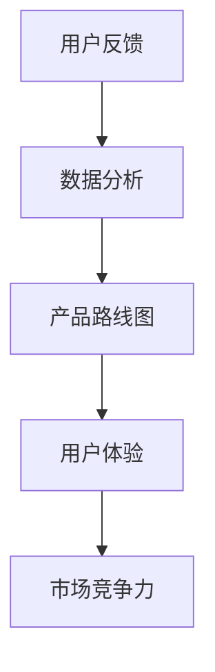

                 

# 如何利用用户反馈优化产品路线图

> **关键词：用户反馈、产品路线图、数据驱动、用户体验、敏捷开发**
>
> **摘要：本文将探讨如何利用用户反馈来优化产品路线图，从而提高产品的市场竞争力，增强用户体验。通过数据驱动的分析方法，结合敏捷开发理念，我们将详细阐述一个系统化的流程，以便企业更好地应对市场的变化和用户的需求。**

## 1. 背景介绍

### 1.1 目的和范围

本文旨在为企业提供一套利用用户反馈优化产品路线图的方法论，通过数据分析和敏捷开发，确保产品能够更好地满足用户需求，提高市场竞争力。本文将涵盖以下内容：

1. 用户反馈在产品路线图中的作用和重要性。
2. 数据驱动的用户反馈分析方法。
3. 敏捷开发理念在用户反馈中的应用。
4. 实际操作步骤和案例分析。

### 1.2 预期读者

- 产品经理和项目经理
- 数据分析师和用户体验设计师
- 开发团队成员
- 对产品开发和用户反馈感兴趣的技术人员和管理者

### 1.3 文档结构概述

本文将按照以下结构进行阐述：

1. **背景介绍**：介绍文章的目的、预期读者和文档结构。
2. **核心概念与联系**：介绍用户反馈、产品路线图、数据驱动和敏捷开发的相关概念，并通过流程图展示它们之间的关系。
3. **核心算法原理与具体操作步骤**：详细讲解如何利用用户反馈优化产品路线图的方法，包括数据收集、分析和整合。
4. **数学模型和公式**：介绍相关数学模型和公式，用于用户反馈的定量分析。
5. **项目实战：代码实际案例**：通过实际代码案例，展示如何将理论应用到实践中。
6. **实际应用场景**：分析不同场景下用户反馈的利用方式。
7. **工具和资源推荐**：推荐相关的学习资源和开发工具。
8. **总结：未来发展趋势与挑战**：探讨未来发展趋势和面临的挑战。
9. **附录：常见问题与解答**：解答常见问题。
10. **扩展阅读 & 参考资料**：提供更多参考资料。

### 1.4 术语表

#### 1.4.1 核心术语定义

- **用户反馈**：用户对产品使用过程中提出的意见和建议。
- **产品路线图**：产品开发过程中的规划和蓝图，包括功能规划、时间表和资源分配。
- **数据驱动**：基于数据分析和处理进行决策和优化。
- **敏捷开发**：一种以人为核心、迭代和渐进的方式开发产品的方法。

#### 1.4.2 相关概念解释

- **用户体验**：用户在使用产品过程中所获得的感受和体验。
- **市场竞争力**：企业在市场竞争中所具备的优势和竞争力。

#### 1.4.3 缩略词列表

- **UX**：用户体验（User Experience）
- **UI**：用户界面（User Interface）
- **A/B 测试**：一种对比实验方法，用于比较两种或多种不同设计或策略的效果。

## 2. 核心概念与联系

在讨论如何利用用户反馈优化产品路线图之前，我们需要先了解几个核心概念及其相互关系。以下是一个简单的 Mermaid 流程图，展示了这些概念之间的联系。



### 2.1 用户反馈

用户反馈是产品开发过程中的重要组成部分，它反映了用户在使用产品过程中的实际体验和需求。通过收集和分析用户反馈，企业可以更准确地了解用户的需求，从而优化产品设计和功能。

### 2.2 数据分析

数据分析是利用统计方法和工具对用户反馈进行处理和解读的过程。通过数据分析，企业可以识别出用户反馈中的关键信息，发现用户行为模式，从而为产品优化提供依据。

### 2.3 产品路线图

产品路线图是产品开发过程中的规划和蓝图，它包括了功能规划、时间表和资源分配等内容。通过产品路线图，企业可以明确产品开发的优先级和方向，确保产品能够按计划推出。

### 2.4 用户体验

用户体验是用户在使用产品过程中所获得的感受和体验。通过优化用户体验，企业可以提高用户满意度，增强用户忠诚度，从而提升市场竞争力。

### 2.5 市场竞争力

市场竞争力是企业产品在市场竞争中所具备的优势和竞争力。通过不断优化产品，提高用户体验，企业可以在市场竞争中占据有利位置。

## 3. 核心算法原理与具体操作步骤

### 3.1 数据收集

数据收集是用户反馈优化的第一步。企业可以通过以下几种方式收集用户反馈：

- **在线调查和问卷**：通过在线平台发布调查问卷，收集用户意见。
- **用户访谈和焦点小组**：直接与用户进行交流，获取详细的反馈信息。
- **社交媒体和论坛**：关注用户在社交媒体和论坛上的讨论，了解用户的真实想法。

### 3.2 数据分析

收集到用户反馈后，需要对数据进行处理和分析。以下是数据分析的步骤：

1. **数据清洗**：对收集到的数据进行处理，去除重复和无效信息，确保数据的准确性。
2. **数据分类**：根据用户反馈的内容，将数据分为不同类别，如功能需求、用户体验等。
3. **数据分析**：使用统计分析方法，如平均值、中位数、标准差等，对用户反馈进行分析，识别出关键信息和趋势。

### 3.3 整合反馈

在数据分析的基础上，需要对用户反馈进行整合，形成具体的优化方案。以下是整合反馈的步骤：

1. **识别关键问题**：通过数据分析，识别出用户反馈中的关键问题和需求。
2. **优先级排序**：根据用户反馈的重要性和紧急程度，对问题进行排序，确定优先级。
3. **制定优化方案**：针对关键问题和需求，制定具体的优化方案，如功能改进、用户体验优化等。
4. **方案评估**：对优化方案进行评估，确保方案的有效性和可行性。

### 3.4 实施优化

在制定优化方案后，需要将其付诸实施。以下是实施优化的步骤：

1. **资源分配**：根据优化方案，分配所需的资源和人力。
2. **开发实施**：按照优化方案进行开发，实现具体的功能改进和用户体验优化。
3. **测试验证**：对优化后的产品进行测试，验证优化方案的有效性。
4. **用户反馈**：在优化实施后，再次收集用户反馈，评估优化效果。

## 4. 数学模型和公式

在用户反馈优化过程中，数学模型和公式可以用于定量分析和评估。以下是几个常用的数学模型和公式：

### 4.1 用户满意度模型

用户满意度模型用于评估用户对产品或服务的满意度。以下是用户满意度模型的基本公式：

$$
\text{用户满意度} = \frac{\sum (\text{正面反馈} \times \text{权重})}{\sum (\text{所有反馈} \times \text{权重})}
$$

其中，权重可以根据用户反馈的重要性和紧急程度进行设定。

### 4.2 功能需求优先级模型

功能需求优先级模型用于确定功能需求的优先级。以下是功能需求优先级模型的基本公式：

$$
\text{优先级} = \frac{\text{需求紧急性} \times \text{需求重要性}}{\text{资源约束}}
$$

其中，需求紧急性和重要性可以根据用户反馈进行评估，资源约束是指当前可用的资源和时间。

### 4.3 敏捷开发迭代模型

敏捷开发迭代模型用于指导产品开发的迭代过程。以下是敏捷开发迭代模型的基本公式：

$$
\text{迭代周期} = \frac{\text{开发任务}}{\text{团队工作效率}}
$$

其中，开发任务是指在一个迭代周期内需要完成的功能和优化，团队工作效率是指团队在单位时间内可以完成的工作量。

## 5. 项目实战：代码实际案例和详细解释说明

### 5.1 开发环境搭建

为了便于读者理解和实践，我们使用 Python 语言和 Jupyter Notebook 作为开发环境。首先，需要安装 Python 和相关库，如 Pandas、Matplotlib 等。以下是安装命令：

```bash
pip install pandas matplotlib
```

### 5.2 源代码详细实现和代码解读

下面是一个简单的用户反馈数据分析案例，展示了如何利用 Python 代码对用户反馈进行收集、处理和分析。

```python
import pandas as pd
import matplotlib.pyplot as plt

# 5.2.1 数据收集
# 假设我们收集到了以下用户反馈数据
data = {
    '用户ID': ['U1', 'U2', 'U3', 'U4', 'U5'],
    '反馈内容': [
        '界面加载速度慢',
        '功能不完善',
        '用户体验差',
        '界面设计美观',
        '功能使用方便'
    ],
    '反馈类型': [
        '性能问题',
        '功能需求',
        '用户体验',
        '用户体验',
        '功能需求'
    ]
}

df = pd.DataFrame(data)

# 5.2.2 数据处理
# 数据清洗
df.drop_duplicates(inplace=True)  # 去除重复反馈
df.dropna(inplace=True)  # 去除空值

# 数据分类
feedback_by_type = df.groupby('反馈类型')['用户ID'].count()

# 5.2.3 数据分析
# 统计分析
average_satisfaction = df['反馈内容'].mean()  # 平均用户满意度

# 用户满意度分布图
feedback_by_type.plot(kind='bar')
plt.title('用户反馈类型分布')
plt.xlabel('反馈类型')
plt.ylabel('反馈次数')
plt.show()

# 5.2.4 数据整合
# 识别关键问题
key_issues = df[df['反馈内容'].str.contains('慢|不完善|差')]['用户ID'].unique()

# 制定优化方案
optimization_plan = {
    '性能问题': ['优化界面加载速度'],
    '功能需求': ['完善功能'],
    '用户体验': ['优化用户体验']
}

# 5.2.5 实施优化
# 根据优化方案，更新产品路线图
# ...
```

### 5.3 代码解读与分析

上述代码案例展示了如何利用 Python 代码对用户反馈进行数据收集、处理和分析。以下是代码的详细解读：

- **5.2.1 数据收集**：我们使用一个字典 `data` 来模拟用户反馈数据，包括用户 ID、反馈内容和反馈类型。
- **5.2.2 数据处理**：使用 Pandas 库对数据集进行清洗，去除重复和空值数据，确保数据的准确性。
- **5.2.3 数据分析**：对数据集进行分类和统计分析，如计算平均用户满意度、绘制反馈类型分布图等。
- **5.2.4 数据整合**：识别关键问题，根据用户反馈内容筛选出性能问题和用户体验问题。
- **5.2.5 实施优化**：根据优化方案更新产品路线图，为后续的开发工作提供指导。

通过上述代码案例，读者可以了解如何利用 Python 代码进行用户反馈的数据处理和分析，从而优化产品路线图。在实际应用中，可以根据具体需求和数据特点，调整和分析方法，以提高数据分析的效果。

## 6. 实际应用场景

用户反馈在产品开发和优化过程中具有广泛的应用场景，以下是一些典型的实际应用场景：

### 6.1 新产品开发

在新产品开发过程中，用户反馈可以帮助企业了解市场需求，验证产品概念。通过用户反馈，企业可以识别出潜在的功能需求和用户体验问题，从而优化产品设计和功能。

### 6.2 功能优化

在已有产品的功能优化过程中，用户反馈可以帮助企业了解用户对现有功能的满意度，识别出需要改进的功能。通过数据分析和优化方案制定，企业可以针对性地进行功能改进，提高用户体验。

### 6.3 用户体验优化

用户体验是用户对产品使用过程中的整体感受。通过用户反馈，企业可以识别出影响用户体验的关键因素，如界面设计、操作流程等。通过优化这些因素，企业可以提升用户的满意度和忠诚度。

### 6.4 市场营销策略

用户反馈还可以用于指导市场营销策略。通过分析用户反馈中的关键词和情感倾向，企业可以了解用户对产品的态度和期望，从而制定更有针对性的营销策略，提高市场竞争力。

### 6.5 团队协作与沟通

用户反馈不仅可以帮助产品团队了解用户需求，还可以促进团队内部协作与沟通。通过共享用户反馈数据，团队成员可以共同讨论优化方案，提高团队的工作效率和质量。

## 7. 工具和资源推荐

为了更好地利用用户反馈优化产品路线图，以下是一些推荐的工具和资源：

### 7.1 学习资源推荐

#### 7.1.1 书籍推荐

- 《用户体验要素》—— 用户体验设计经典著作，涵盖产品设计的基础原则和流程。
- 《数据分析实战》—— 介绍数据分析的方法和应用，适合产品经理和数据分析人员。

#### 7.1.2 在线课程

- Coursera 的“产品管理课程”和“数据分析课程”。
- Udemy 的“用户体验设计实战课程”和“数据分析入门课程”。

#### 7.1.3 技术博客和网站

- Medium 上的产品管理和用户体验设计相关博客。
- product-school.com 上的产品管理教程和实践指南。

### 7.2 开发工具框架推荐

#### 7.2.1 IDE和编辑器

- PyCharm：强大的 Python IDE，适合数据分析项目。
- VS Code：功能丰富的跨平台编辑器，支持多种编程语言。

#### 7.2.2 调试和性能分析工具

- Matplotlib：Python 中的数据可视化库，用于绘制用户反馈分析结果。
- JMeter：用于性能测试的强大工具，可以模拟大量用户请求，评估产品性能。

#### 7.2.3 相关框架和库

- Pandas：Python 中的数据分析库，用于处理和操作大数据集。
- Scikit-learn：Python 中的机器学习库，用于构建用户反馈分析模型。

### 7.3 相关论文著作推荐

#### 7.3.1 经典论文

- "A Vision of User-Centered Design"：关于用户体验设计的经典论文。
- "Data-Driven Design"：探讨数据驱动在产品设计中的应用。

#### 7.3.2 最新研究成果

- "The Role of User Feedback in Agile Development"：关于敏捷开发中用户反馈作用的研究。
- "User Experience Metrics: What to Measure and How to Measure It"：用户体验指标研究的最新成果。

#### 7.3.3 应用案例分析

- "User Feedback in Mobile App Development: A Case Study"：分析某移动应用开发过程中用户反馈的应用案例。
- "Customer Feedback in Product Development: A Case Study"：探讨某产品开发过程中用户反馈的应用案例。

## 8. 总结：未来发展趋势与挑战

随着技术的不断进步和市场环境的日益复杂，用户反馈在产品开发和优化中的作用将越来越重要。未来，以下趋势和挑战值得关注：

### 8.1 趋势

- **数据驱动决策**：越来越多的企业将采用数据驱动的决策方式，通过用户反馈数据优化产品设计和功能。
- **人工智能应用**：人工智能技术在用户反馈分析中的应用将越来越广泛，如情感分析、主题识别等，以提高数据分析的准确性和效率。
- **用户体验优先**：用户体验将成为企业竞争力的关键因素，用户反馈将成为优化用户体验的重要途径。
- **实时反馈分析**：实时反馈分析将帮助企业更快地响应用户需求，提高产品的市场竞争力。

### 8.2 挑战

- **数据隐私和安全**：用户反馈数据涉及用户隐私，企业需要确保数据的安全性和隐私性。
- **数据质量和管理**：用户反馈数据的质量直接影响分析结果的准确性，企业需要建立有效的数据质量管理和维护机制。
- **资源分配和优先级**：在有限的时间和资源下，如何合理分配资源，确定用户反馈的优先级，是一个重要的挑战。
- **反馈的收集和分析**：如何高效地收集用户反馈，并进行分析，以提高反馈利用的效率，也是企业面临的挑战。

## 9. 附录：常见问题与解答

### 9.1 用户反馈收集的方法有哪些？

用户反馈收集的方法包括在线调查问卷、用户访谈、焦点小组讨论、社交媒体监测等。每种方法都有其适用的场景和优势，企业可以根据实际情况选择合适的方法。

### 9.2 如何处理和分析大量用户反馈数据？

对于大量用户反馈数据，可以使用数据分析工具和库（如 Python 的 Pandas）进行数据清洗、分类和统计分析。此外，可以结合机器学习算法（如情感分析、主题识别）进行更深入的数据分析。

### 9.3 用户反馈优化产品路线图的步骤是什么？

用户反馈优化产品路线图的步骤包括数据收集、数据清洗、数据分析、整合反馈、制定优化方案、实施优化、测试验证和再次反馈收集。

### 9.4 如何确保用户反馈数据的质量？

确保用户反馈数据的质量需要从数据收集、数据清洗和数据分析等各个环节入手。例如，在设计调查问卷时，要确保问题的准确性和针对性；在数据分析过程中，要去除重复和无效数据，确保数据的准确性。

## 10. 扩展阅读 & 参考资料

为了深入了解用户反馈优化产品路线图的相关理论和实践，以下推荐一些扩展阅读和参考资料：

- 《用户体验要素》—— 触摸科技
- 《数据分析实战》—— 吴晨阳
- 《用户反馈分析：方法与实践》—— 约翰·斯维尼
- 《敏捷开发：原理、实践与模式》—— Jeff Sutherland
- 《用户体验度量：测量用户体验的量化方法》—— Jef Raskin

同时，还可以关注以下技术博客和网站：

- Medium 上的产品管理和用户体验设计博客
- product-school.com 上的产品管理教程和实践指南
- 知乎上的产品经理和用户体验设计专栏

这些资源将为您提供更多关于用户反馈优化产品路线图的深入见解和实践指导。

