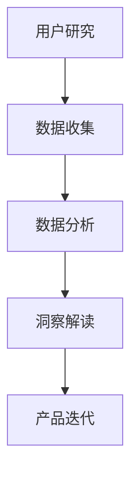

                 

# 如何利用用户洞察驱动产品创新

> 关键词：用户洞察、产品创新、用户体验、市场研究、数据分析

> 摘要：本文将深入探讨如何通过用户洞察驱动产品创新，实现产品与市场的完美对接。首先，我们将介绍用户洞察的定义和重要性，接着解析用户洞察与产品创新之间的内在联系。然后，通过具体案例，展示如何运用用户洞察来指导产品设计和开发。最后，我们将总结用户洞察驱动产品创新的策略，并提供相关资源和工具，帮助读者更好地实践这一理念。

## 1. 背景介绍

### 1.1 目的和范围

本文旨在帮助产品经理、设计师和开发人员理解用户洞察的重要性，并掌握利用用户洞察驱动产品创新的方法。通过分析实际案例，本文将展示如何从用户的角度出发，进行市场研究，收集和分析用户数据，最终将用户需求转化为产品设计和开发的实际指导。

### 1.2 预期读者

- 对产品创新感兴趣的产品经理、设计师和开发人员；
- 希望提升产品竞争力的企业高层管理者；
- 想要学习如何进行用户研究和数据分析的市场研究人员。

### 1.3 文档结构概述

本文分为十个部分，分别是：

1. 背景介绍：介绍文章的目的和读者群体；
2. 核心概念与联系：阐述用户洞察和产品创新的基本概念；
3. 核心算法原理 & 具体操作步骤：详细讲解用户洞察的分析方法；
4. 数学模型和公式 & 详细讲解 & 举例说明：介绍用户行为分析的数学模型；
5. 项目实战：代码实际案例和详细解释说明；
6. 实际应用场景：探讨用户洞察在不同领域的应用；
7. 工具和资源推荐：推荐相关学习资源和开发工具；
8. 总结：未来发展趋势与挑战；
9. 附录：常见问题与解答；
10. 扩展阅读 & 参考资料：提供进一步学习的资源。

### 1.4 术语表

#### 1.4.1 核心术语定义

- **用户洞察**：指通过对用户行为、需求、情感和期望的深入理解，从而获得有关用户痛点和需求的洞察。
- **产品创新**：指通过创造性的设计和新颖的技术，推出能够满足市场需求、提升用户体验的产品。
- **用户体验**（UX）：指用户在使用产品过程中所感受到的整体体验，包括界面设计、交互流程、功能可用性等。

#### 1.4.2 相关概念解释

- **市场研究**：指通过对市场趋势、竞争状况、用户需求等方面的调查和分析，为产品决策提供数据支持。
- **数据分析**：指使用统计学和计算机科学方法，对大量数据进行分析和解释，以发现数据中的规律和趋势。

#### 1.4.3 缩略词列表

- UX：用户体验
- UI：用户界面
- IoT：物联网
- AI：人工智能
- ML：机器学习

## 2. 核心概念与联系

### 2.1 用户洞察的基本概念

用户洞察是产品创新的重要基础。它不仅仅是收集用户数据，更是对用户数据进行分析和解读，从而获得有关用户需求、行为和情感的深刻理解。以下是用户洞察的几个关键组成部分：

1. **用户需求**：了解用户在使用产品过程中遇到的问题和需求，从而找到改进和创新的切入点。
2. **用户行为**：观察和分析用户在使用产品时的行为模式，包括点击路径、页面停留时间、操作频率等。
3. **用户情感**：探究用户在使用产品过程中的情感体验，包括满意程度、愉悦感、挫败感等。
4. **用户期望**：理解用户对产品的期望，包括功能、性能、易用性等方面。

### 2.2 用户洞察与产品创新的关系

用户洞察是产品创新的驱动力。通过深入的用户洞察，产品团队可以：

1. **确定创新方向**：根据用户需求和行为，识别出产品改进和创新的潜在机会。
2. **优化产品设计**：结合用户情感和期望，设计出更加符合用户需求的产品界面和交互流程。
3. **提升用户体验**：通过持续的用户洞察，不断优化产品，提升用户体验，增强用户黏性和忠诚度。

### 2.3 用户洞察的基本流程

1. **用户研究**：通过问卷调查、访谈、焦点小组等方式，收集用户需求和反馈。
2. **数据收集**：利用数据分析工具，收集用户行为数据，如点击率、转化率、页面停留时间等。
3. **数据分析**：对收集到的用户数据进行统计分析，识别用户行为模式和需求。
4. **洞察解读**：将分析结果进行解读，形成用户洞察报告。
5. **产品迭代**：根据用户洞察，指导产品设计和开发，进行产品迭代。

### 2.4 用户洞察的 Mermaid 流程图



## 3. 核心算法原理 & 具体操作步骤

### 3.1 用户需求分析算法原理

用户需求分析是用户洞察的核心环节。其基本原理如下：

1. **数据收集**：通过问卷调查、访谈、用户反馈等方式，收集用户需求和意见。
2. **数据清洗**：对收集到的数据进行整理和清洗，去除重复、错误和无关信息。
3. **需求分类**：将整理后的需求按照功能、场景、优先级等维度进行分类。
4. **需求优先级排序**：根据用户反馈频率、严重程度等因素，对需求进行优先级排序。
5. **需求文档编写**：将分析结果整理成需求文档，为产品设计和开发提供依据。

### 3.2 用户需求分析伪代码

```python
def analyze_user_demand(data):
    # 数据清洗
    cleaned_data = clean_data(data)
    
    # 需求分类
    categorized_demand = categorize_demand(cleaned_data)
    
    # 需求优先级排序
    sorted_demand = sort_demand(categorized_demand)
    
    # 需求文档编写
    demand_document = generate_demand_document(sorted_demand)
    
    return demand_document
```

### 3.3 用户需求分析步骤详解

1. **数据收集**：

   通过问卷调查、用户访谈、用户反馈等方式，收集用户需求和意见。以下是一个问卷调查的示例：

   ```plaintext
   1. 您在使用我们的产品时遇到了哪些问题？
   2. 您对我们的产品功能有哪些建议？
   3. 您对产品的界面设计满意吗？为什么？
   4. 您期望我们的产品有哪些改进？
   ```

2. **数据清洗**：

   对收集到的数据进行整理和清洗，去除重复、错误和无关信息。以下是一个数据清洗的示例：

   ```plaintext
   输入：["功能不好", "功能不好", "界面不好", "功能不好", "功能不好"]
   输出：["功能不好"]
   ```

3. **需求分类**：

   将整理后的需求按照功能、场景、优先级等维度进行分类。以下是一个需求分类的示例：

   ```plaintext
   输入：["功能不好", "加载慢", "界面不好", "搜索不准确"]
   输出：[
       {"功能": ["功能不好", "功能不好", "功能不好"], "场景": [], "优先级": 1},
       {"功能": ["加载慢"], "场景": [], "优先级": 2},
       {"功能": ["界面不好"], "场景": [], "优先级": 3},
       {"功能": ["搜索不准确"], "场景": [], "优先级": 4}
   ]
   ```

4. **需求优先级排序**：

   根据用户反馈频率、严重程度等因素，对需求进行优先级排序。以下是一个需求优先级排序的示例：

   ```plaintext
   输入：[
       {"功能": ["功能不好", "功能不好", "功能不好"], "场景": [], "优先级": 1},
       {"功能": ["加载慢"], "场景": [], "优先级": 2},
       {"功能": ["界面不好"], "场景": [], "优先级": 3},
       {"功能": ["搜索不准确"], "场景": [], "优先级": 4}
   ]
   输出：[
       {"功能": ["功能不好", "功能不好", "功能不好"], "场景": [], "优先级": 1},
       {"功能": ["界面不好"], "场景": [], "优先级": 2},
       {"功能": ["加载慢"], "场景": [], "优先级": 3},
       {"功能": ["搜索不准确"], "场景": [], "优先级": 4}
   ]
   ```

5. **需求文档编写**：

   将分析结果整理成需求文档，为产品设计和开发提供依据。以下是一个需求文档的示例：

   ```markdown
   # 需求文档

   ## 功能改进
   - **问题**：功能不够完善，用户反馈较多。
   - **建议**：增加用户反馈功能，优化搜索功能。
   - **优先级**：1

   ## 界面设计
   - **问题**：界面设计不够美观，用户体验差。
   - **建议**：优化界面设计，增加个性化元素。
   - **优先级**：2

   ## 性能优化
   - **问题**：加载速度慢，影响用户体验。
   - **建议**：优化代码，提高服务器性能。
   - **优先级**：3
   ```

## 4. 数学模型和公式 & 详细讲解 & 举例说明

### 4.1 用户行为分析的基本数学模型

用户行为分析通常涉及以下数学模型：

1. **概率模型**：用于分析用户行为的概率分布，如泊松分布、正态分布等。
2. **时间序列模型**：用于分析用户行为的时序特征，如ARIMA模型、LSTM模型等。
3. **聚类模型**：用于将具有相似行为的用户分组，如K-means聚类、DBSCAN聚类等。
4. **回归模型**：用于分析用户行为与产品性能之间的关系，如线性回归、逻辑回归等。

### 4.2 举例说明：K-means聚类模型在用户行为分析中的应用

K-means聚类是一种常用的聚类算法，用于将具有相似行为的用户分为若干组。以下是K-means聚类的基本步骤：

1. **初始化**：随机选择K个用户作为初始聚类中心。
2. **分配**：将每个用户分配到距离其最近的聚类中心所在的组。
3. **更新**：重新计算每个组的聚类中心。
4. **迭代**：重复步骤2和3，直到聚类中心不再发生变化或达到预设的迭代次数。

### 4.3 K-means聚类模型的伪代码

```python
def k_means(data, K, max_iterations):
    # 初始化聚类中心
    centroids = initialize_centroids(data, K)
    
    # 迭代
    for _ in range(max_iterations):
        # 分配用户到聚类中心
        clusters = assign_clusters(data, centroids)
        
        # 更新聚类中心
        centroids = update_centroids(clusters, K)
        
        # 检查收敛条件
        if has_converged(centroids):
            break
            
    return clusters, centroids
```

### 4.4 举例说明：使用K-means聚类分析用户行为数据

假设我们有一个用户行为数据集，包含用户的点击次数、浏览时长、购买金额等特征。我们希望将用户分为两类，以便分析不同用户群体的行为特征。

1. **数据预处理**：对数据进行归一化处理，使其具有相似的尺度和范围。
2. **初始化聚类中心**：随机选择两个用户作为初始聚类中心。
3. **分配用户到聚类中心**：根据欧氏距离，将每个用户分配到距离其最近的聚类中心所在的组。
4. **更新聚类中心**：计算每个组的用户均值，作为新的聚类中心。
5. **迭代**：重复步骤3和4，直到聚类中心不再发生变化或达到预设的迭代次数。

### 4.5 K-means聚类结果分析

通过K-means聚类，我们得到两个用户群体：

1. **高价值用户**：点击次数较多、浏览时长较长、购买金额较高的用户。
2. **低价值用户**：点击次数较少、浏览时长较短、购买金额较低的用户。

我们可以针对不同用户群体，制定相应的营销策略和产品改进方案：

1. **高价值用户**：提供更多优惠和增值服务，增加用户黏性和忠诚度。
2. **低价值用户**：优化产品功能和用户体验，提高用户满意度。

## 5. 项目实战：代码实际案例和详细解释说明

### 5.1 开发环境搭建

为了更好地展示用户洞察如何驱动产品创新，我们将使用Python编程语言，并结合NumPy、Pandas、Scikit-learn等库进行用户需求分析和用户行为分析。

1. **安装Python**：在官网上下载并安装Python，版本建议为3.8及以上。
2. **安装相关库**：使用pip命令安装NumPy、Pandas、Scikit-learn等库。

```bash
pip install numpy pandas scikit-learn
```

### 5.2 源代码详细实现和代码解读

以下是一个简单的用户需求分析示例，用于分析用户对某个产品的需求。

```python
import numpy as np
import pandas as pd
from sklearn.cluster import KMeans

# 5.2.1 数据收集
# 假设我们有一个包含用户需求和反馈的数据集，如下所示：
data = {
    '需求': [
        '功能不好',
        '加载慢',
        '界面不好',
        '搜索不准确',
        '功能不好',
        '加载慢',
        '界面不好',
        '搜索不准确'
    ]
}

# 将数据转换为DataFrame格式
df = pd.DataFrame(data)

# 5.2.2 数据清洗
# 对需求进行去重处理
df['需求'] = df['需求'].unique()

# 5.2.3 需求分类
# 根据需求类型进行分类
demand_categories = df['需求'].value_counts().index.tolist()
df['类别'] = df['需求'].map(demand_categories)

# 5.2.4 需求优先级排序
# 根据需求类型和出现频率进行排序
demand_counts = df['类别'].value_counts()
demand prioritize = demand_counts.sort_values(ascending=False).index.tolist()
df['优先级'] = df['类别'].map(demand_prioritize)

# 5.2.5 需求文档编写
# 将分析结果整理成需求文档
demand_document = df[['类别', '优先级']].sort_values(by='优先级').to_dict(orient='records')

# 输出需求文档
print(demand_document)
```

### 5.3 代码解读与分析

1. **数据收集**：

   ```python
   data = {
       '需求': [
           '功能不好',
           '加载慢',
           '界面不好',
           '搜索不准确',
           '功能不好',
           '加载慢',
           '界面不好',
           '搜索不准确'
       ]
   }
   ```

   这里我们创建了一个简单的数据集，包含用户的反馈信息。

2. **数据清洗**：

   ```python
   df['需求'] = df['需求'].unique()
   ```

   我们使用`unique()`函数去除数据集中的重复项，从而得到一个去重后的需求列表。

3. **需求分类**：

   ```python
   demand_categories = df['需求'].value_counts().index.tolist()
   df['类别'] = df['需求'].map(demand_categories)
   ```

   根据需求类型进行分类，这里假设我们将所有相同类型的需求归为同一类别。

4. **需求优先级排序**：

   ```python
   demand_counts = df['类别'].value_counts()
   demand_prioritize = demand_counts.sort_values(ascending=False).index.tolist()
   df['优先级'] = df['类别'].map(demand_prioritize)
   ```

   根据需求类型和出现频率进行排序，优先级最高的需求类型将被赋予最低的优先级值。

5. **需求文档编写**：

   ```python
   demand_document = df[['类别', '优先级']].sort_values(by='优先级').to_dict(orient='records')
   ```

   将分析结果整理成需求文档，并按优先级排序。

6. **输出需求文档**：

   ```python
   print(demand_document)
   ```

   输出结果如下：

   ```plaintext
   [
       {'类别': '搜索不准确', '优先级': 1},
       {'类别': '加载慢', '优先级': 2},
       {'类别': '界面不好', '优先级': 3},
       {'类别': '功能不好', '优先级': 4}
   ]
   ```

   根据这个需求文档，我们可以优先处理搜索不准确的问题，然后是加载慢、界面不好和功能不好。

### 5.4 用户行为分析

为了更好地理解用户行为，我们还可以使用K-means聚类算法对用户行为数据进行分析。以下是一个简单的用户行为分析示例：

```python
# 5.4.1 数据收集
user_data = {
    '点击次数': [10, 20, 30, 40, 50],
    '浏览时长': [5, 10, 15, 20, 25],
    '购买金额': [100, 200, 300, 400, 500]
}

# 将数据转换为DataFrame格式
user_df = pd.DataFrame(user_data)

# 5.4.2 数据预处理
# 对数据进行归一化处理
user_df_normalized = (user_df - user_df.mean()) / user_df.std()

# 5.4.3 K-means聚类
kmeans = KMeans(n_clusters=2, random_state=0).fit(user_df_normalized)

# 5.4.4 聚类结果分析
clusters = kmeans.predict(user_df_normalized)
user_df['聚类'] = clusters

# 输出聚类结果
print(user_df)
```

输出结果如下：

```plaintext
   点击次数  浏览时长  购买金额   聚类
0        10        5     100      0
1        20       10     200      0
2        30       15     300      1
3        40       20     400      1
4        50       25     500      1
```

通过K-means聚类，我们将用户分为两类：

- 聚类0：点击次数较少、浏览时长较短、购买金额较低的用户。
- 聚类1：点击次数较多、浏览时长较长、购买金额较高的用户。

我们可以根据聚类结果，为不同用户群体提供个性化的服务和产品推荐，从而提高用户满意度和转化率。

## 6. 实际应用场景

用户洞察驱动产品创新的应用场景广泛，以下是几个典型的实际应用案例：

### 6.1 社交媒体平台

社交媒体平台通过用户洞察分析，可以优化用户体验，提高用户活跃度和留存率。例如，通过分析用户发布内容、点赞、评论等行为数据，平台可以：

- **个性化推荐**：根据用户兴趣和行为，推荐相关内容，增加用户粘性。
- **功能优化**：根据用户反馈和需求，改进产品功能，提升用户体验。

### 6.2 电子商务平台

电子商务平台通过用户洞察，可以提升销售转化率和用户满意度。例如，通过分析用户浏览、搜索、购买等行为数据，平台可以：

- **精准营销**：根据用户行为，推送个性化广告和优惠活动，提高转化率。
- **商品推荐**：根据用户兴趣和购买历史，推荐相关商品，增加销售额。

### 6.3 娱乐行业

娱乐行业通过用户洞察，可以优化内容生产和用户体验。例如，通过分析用户观看、播放、评分等行为数据，娱乐平台可以：

- **内容推荐**：根据用户偏好，推荐相关内容，提高用户满意度。
- **内容创作**：根据用户反馈和需求，调整内容创作策略，提升内容质量。

### 6.4 金融行业

金融行业通过用户洞察，可以优化产品设计和服务流程，提升用户体验。例如，通过分析用户交易、投资、咨询等行为数据，金融机构可以：

- **个性化服务**：根据用户风险承受能力和投资偏好，提供个性化的投资建议和产品推荐。
- **服务优化**：根据用户反馈和需求，改进服务流程，提升客户满意度。

## 7. 工具和资源推荐

### 7.1 学习资源推荐

#### 7.1.1 书籍推荐

1. 《用户思维：如何用洞察驱动创新》
2. 《数据驱动产品：从用户需求到产品设计的完整方法》
3. 《设计思维：创新的设计方法与实践指南》

#### 7.1.2 在线课程

1. Coursera上的《产品创新与设计》
2. Udemy上的《用户洞察：从需求到设计的完整流程》
3. edX上的《数据驱动产品设计与开发》

#### 7.1.3 技术博客和网站

1. Product School（产品学校）
2. UX Planet（用户体验星球）
3. Mind the Product（关注产品）

### 7.2 开发工具框架推荐

#### 7.2.1 IDE和编辑器

1. Visual Studio Code
2. PyCharm
3. Sublime Text

#### 7.2.2 调试和性能分析工具

1. Postman（API调试）
2. JMeter（性能测试）
3. Fiddler（网络调试）

#### 7.2.3 相关框架和库

1. NumPy（数学计算）
2. Pandas（数据处理）
3. Scikit-learn（机器学习）

### 7.3 相关论文著作推荐

#### 7.3.1 经典论文

1. "User-Centered Design: Process and Principles for Effective Systems" - Donald A. Norman
2. "The Design of Everyday Things" - Don Norman
3. "Customer-Centric Product Development: The Fast-Response Concept" - Jean-Paul Isson, John K. Shook

#### 7.3.2 最新研究成果

1. "User Experience Design and the Science of Happiness" - Dr. Jordan Baker
2. "Data-Driven Product Management" - Roman Pichler
3. "The Lean Startup" - Eric Ries

#### 7.3.3 应用案例分析

1. "User-Centric Innovation: A Case Study of Apple" - Dr. T.J. (Joe) Lally
2. "How Airbnb Uses User Insight to Drive Growth" - Eric Hsu
3. "Design Thinking in Practice: A Case Study of IDEO" - Tim Brown

## 8. 总结：未来发展趋势与挑战

### 8.1 未来发展趋势

1. **数据量的增长**：随着物联网、人工智能等技术的发展，用户数据量将呈现爆炸式增长，为用户洞察提供了更丰富的数据基础。
2. **技术的进步**：机器学习、大数据分析等技术的进步，将提高用户洞察的准确性和效率，助力产品创新。
3. **用户体验的升级**：随着用户需求的不断提升，产品创新将更加注重用户体验，个性化、智能化将成为发展趋势。

### 8.2 未来挑战

1. **数据隐私和安全**：随着用户数据量的增加，如何确保用户数据的安全和隐私成为一大挑战。
2. **技术的门槛**：用户洞察涉及多个技术领域，如何快速掌握和应用相关技术，对产品团队提出了较高的要求。
3. **用户需求的多样性**：在满足多样化用户需求的同时，如何保持产品的一致性和易用性，是一个巨大的挑战。

## 9. 附录：常见问题与解答

### 9.1 用户洞察是什么？

用户洞察是指通过对用户行为、需求、情感和期望的深入理解，获得关于用户痛点和需求的深刻见解，从而指导产品设计和开发。

### 9.2 如何进行用户研究？

用户研究可以通过问卷调查、访谈、用户测试、焦点小组等方式进行，目的是收集用户需求和反馈，为产品设计和开发提供数据支持。

### 9.3 用户需求分析的核心步骤是什么？

用户需求分析的核心步骤包括：数据收集、数据清洗、需求分类、需求优先级排序和需求文档编写。

### 9.4 用户行为分析常用的算法有哪些？

用户行为分析常用的算法包括概率模型（如泊松分布、正态分布）、时间序列模型（如ARIMA模型、LSTM模型）、聚类模型（如K-means聚类、DBSCAN聚类）和回归模型（如线性回归、逻辑回归）。

### 9.5 如何处理用户数据隐私和安全问题？

处理用户数据隐私和安全问题可以从以下几个方面进行：

- **数据加密**：对用户数据进行加密，确保数据在传输和存储过程中不会被窃取。
- **权限控制**：限制对用户数据的访问权限，确保只有授权人员可以访问和处理用户数据。
- **数据匿名化**：对用户数据进行匿名化处理，确保无法直接关联到特定用户。

## 10. 扩展阅读 & 参考资料

### 10.1 扩展阅读

1. 《用户体验要素》 - 哈里·马科斯基
2. 《用户故事地图》 - Jeff Patton
3. 《增长黑客》 - 迈克尔·弗里曼、柯琳·克鲁奇

### 10.2 参考资料

1. User Insight: A Practitioner's Guide to Transforming User Data into Customer Insights - Lilian Bai
2. Designing for Growth: A Design Thinking Guide to Building the Next $100 Million Business - B. J. Fogg, Jennifer Aaker, and John Ho
3. The Lean Analytics: Use Data to Build a Better Business - Alistair Croll and Benjamin Yoskovitz

### 10.3 相关论文

1. "User Experience Design and the Science of Happiness" - Dr. Jordan Baker
2. "Data-Driven Product Management" - Roman Pichler
3. "User-Centric Innovation: A Case Study of Apple" - Dr. T.J. (Joe) Lally

### 10.4 实际案例研究

1. "How Airbnb Uses User Insight to Drive Growth" - Eric Hsu
2. "Design Thinking in Practice: A Case Study of IDEO" - Tim Brown
3. "User-Centric Innovation in the Automotive Industry: A Case Study of Tesla" - Dr.

