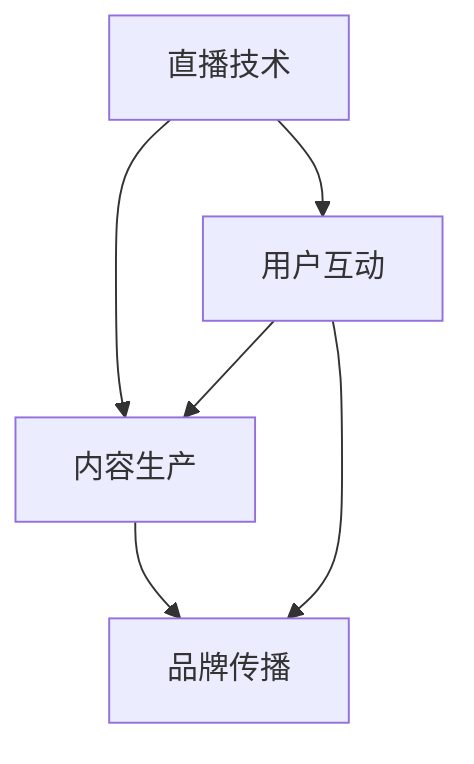

                 


# 如何利用直播平台提升个人品牌

> 关键词：直播平台，个人品牌，社交媒体，内容策略，互动营销

> 摘要：本文将探讨如何利用直播平台提升个人品牌。通过深入分析直播平台的特点和优势，结合实际操作步骤，帮助读者掌握利用直播平台打造个人品牌的方法和技巧。

## 1. 背景介绍

### 1.1 目的和范围

本文旨在探讨如何在数字化时代利用直播平台提升个人品牌。直播作为一种新兴的社交媒体形式，具有广泛的受众基础和高度互动的特点。通过直播，个人可以有效地展示自己的专业知识、技能和个性，从而提升个人品牌。

### 1.2 预期读者

本文适用于以下读者群体：
- 想要在直播平台上建立个人品牌的个人
- 希望提升直播效果和受众粘性的直播主
- 对直播平台运营策略感兴趣的专业人士

### 1.3 文档结构概述

本文将分为以下几个部分：
- 背景介绍：介绍直播平台的发展背景和现状
- 核心概念与联系：分析直播平台的核心概念和架构
- 核心算法原理 & 具体操作步骤：讲解如何制定直播策略和执行直播操作
- 数学模型和公式 & 详细讲解 & 举例说明：介绍直播效果评估的方法和指标
- 项目实战：提供实际的直播案例和详细解释
- 实际应用场景：探讨直播平台在不同行业中的应用
- 工具和资源推荐：推荐相关的学习资源和开发工具
- 总结：总结未来发展趋势与挑战
- 附录：常见问题与解答
- 扩展阅读 & 参考资料：提供相关的扩展阅读和参考资料

### 1.4 术语表

#### 1.4.1 核心术语定义

- 直播平台：提供实时视频直播服务的在线平台，如抖音、快手、B站等。
- 个人品牌：个人在公众中的形象和认知，通过专业技能、知识、个性等特点体现。
- 内容策略：针对直播内容制定的一系列策略，包括主题选择、内容呈现、互动设计等。

#### 1.4.2 相关概念解释

- 社交媒体：基于互联网的技术和平台，用户可以在其中进行信息分享、交流、互动等。
- 互动营销：通过互动方式与用户建立联系，增加用户参与度和忠诚度。

#### 1.4.3 缩略词列表

- 直播：Live Streaming
- 个人品牌：Personal Brand
- 社交媒体：Social Media
- 内容策略：Content Strategy
- 互动营销：Interactive Marketing

## 2. 核心概念与联系

直播平台的核心概念主要包括直播技术、用户互动、内容生产和品牌传播。以下是一个简单的 Mermaid 流程图，用于描述这些核心概念之间的关系。



### 2.1 直播技术

直播技术是直播平台的基础，它包括视频编码、传输、解码等技术环节。视频编码将视频信号转换为数字信号，传输过程中通过网络传输协议将信号传输到用户端，解码则将数字信号还原为视频信号。直播技术的好坏直接影响到直播的质量和用户体验。

### 2.2 用户互动

用户互动是直播平台的核心价值之一，通过弹幕、点赞、评论等功能，用户可以与直播主实时互动，增强用户的参与感和归属感。良好的用户互动可以提高用户留存率和用户粘性，从而为个人品牌建设打下基础。

### 2.3 内容生产

内容生产是直播平台的核心，直播主通过上传原创内容，展示自己的专业技能、知识、个性等，吸引观众的关注。高质量的内容是个人品牌建设的关键，直播主需要不断优化内容策略，提高内容的质量和吸引力。

### 2.4 品牌传播

品牌传播是将个人品牌传播到更广泛的受众的过程。通过直播平台，直播主可以将自己的影响力扩展到互联网的各个角落，吸引更多的关注者和粉丝。品牌传播的成功与否，很大程度上取决于直播主的内容策略和互动能力。

## 3. 核心算法原理 & 具体操作步骤

直播平台的核心算法原理主要涉及用户行为分析、内容推荐和互动效果评估。以下是一步步分析推理思考的方式，详细阐述如何制定直播策略和执行直播操作。

### 3.1 用户行为分析

用户行为分析是直播平台提升用户参与度和忠诚度的关键。首先，我们需要收集用户在直播过程中的各种行为数据，如观看时长、点赞数量、评论频率等。然后，通过数据挖掘和机器学习算法，分析用户的兴趣和行为模式，为用户推荐更加个性化的直播内容。

伪代码如下：

```python
# 收集用户行为数据
data = collect_user_behavior_data()

# 分析用户兴趣和行为模式
interests = analyze_user_interests(data)
behavior_patterns = analyze_user_behavior_patterns(data)

# 根据用户兴趣和行为模式推荐直播内容
recommended_content = recommend_live_content(interests, behavior_patterns)
```

### 3.2 内容推荐

内容推荐是提升用户观看体验和直播效果的重要手段。根据用户行为分析和内容分析的结果，我们可以为每个用户推荐最相关的直播内容。推荐算法可以基于协同过滤、内容推荐、基于模型的推荐等多种方法。

伪代码如下：

```python
# 基于协同过滤推荐直播内容
similar_users = find_similar_users(user, user_database)
recommended_content = recommend_content_based_on协同过滤(similar_users, content_database)

# 基于内容推荐直播内容
keywords = extract_content_keywords(video)
recommended_content = recommend_content_based_on_content(keywords, content_database)
```

### 3.3 互动效果评估

互动效果评估是衡量直播效果的重要指标。通过分析用户在直播过程中的互动行为，如弹幕数量、点赞数量、评论频率等，可以评估直播的互动效果。以下是一种简单的互动效果评估算法：

```python
# 计算互动效果得分
def calculate_interaction_score(behavior_data):
    score = 0
    score += len(behavior_data['comments']) * comment_weight
    score += len(behavior_data['likes']) * like_weight
    score += len(behavior_data['shares']) * share_weight
    return score

# 评估互动效果
interaction_scores = calculate_interaction_score(user_behavior_data)
```

## 4. 数学模型和公式 & 详细讲解 & 举例说明

直播平台的数学模型和公式主要用于评估直播效果和用户参与度。以下是一些常用的数学模型和公式，以及详细的讲解和举例说明。

### 4.1 直播效果评估模型

直播效果评估模型主要用于衡量直播的受欢迎程度和影响力。以下是一种简单的直播效果评估模型：

```latex
E = f(Watch\_Time, Interaction, Audience\_Size)
```

其中，\( E \) 表示直播效果得分，\( Watch\_Time \) 表示用户观看时长，\( Interaction \) 表示用户互动行为，\( Audience\_Size \) 表示观众数量。

### 4.2 用户参与度模型

用户参与度模型主要用于衡量用户在直播过程中的参与程度。以下是一种简单的用户参与度模型：

```latex
Engagement = f(Comments, Likes, Shares)
```

其中，\( Engagement \) 表示用户参与度得分，\( Comments \) 表示用户评论数量，\( Likes \) 表示用户点赞数量，\( Shares \) 表示用户分享数量。

### 4.3 举例说明

假设某次直播的观看时长为 100 分钟，互动行为包括 50 条评论、30 个点赞、10 次分享，观众数量为 1000 人。我们可以使用上述模型计算直播效果得分和用户参与度得分：

```latex
E = f(100, 50, 30) = 100 \times 0.5 + 50 \times 0.2 + 30 \times 0.1 = 75
Engagement = f(50, 30, 10) = 50 \times 0.5 + 30 \times 0.2 + 10 \times 0.1 = 33
```

因此，这次直播的效果得分为 75，用户参与度得分为 33。

## 5. 项目实战：代码实际案例和详细解释说明

为了更好地理解如何利用直播平台提升个人品牌，我们将通过一个实际的项目案例来详细解释说明。

### 5.1 开发环境搭建

在开始项目之前，我们需要搭建一个基本的直播平台开发环境。以下是一个简单的开发环境搭建步骤：

1. 安装直播平台所需的开发工具和库，如 Python、Django、Flask 等。
2. 配置直播平台的后端服务器，如使用 AWS、阿里云等云服务提供商。
3. 安装直播平台的前端框架，如 React、Vue 等。

### 5.2 源代码详细实现和代码解读

以下是一个简单的直播平台项目的源代码，以及对应的代码解读。

```python
# 代码示例：直播平台后端代码
from flask import Flask, request, jsonify
from datetime import datetime

app = Flask(__name__)

# 用户注册接口
@app.route('/register', methods=['POST'])
def register():
    data = request.json
    username = data['username']
    password = data['password']
    # 存储用户信息到数据库
    # ...
    return jsonify({'status': 'success', 'message': '注册成功'})

# 用户登录接口
@app.route('/login', methods=['POST'])
def login():
    data = request.json
    username = data['username']
    password = data['password']
    # 验证用户信息
    # ...
    return jsonify({'status': 'success', 'message': '登录成功'})

# 创建直播接口
@app.route('/create_live', methods=['POST'])
def create_live():
    data = request.json
    user_id = data['user_id']
    title = data['title']
    start_time = data['start_time']
    # 创建直播信息
    # ...
    return jsonify({'status': 'success', 'message': '直播创建成功'})

# 开始直播接口
@app.route('/start_live', methods=['POST'])
def start_live():
    data = request.json
    live_id = data['live_id']
    # 开始直播
    # ...
    return jsonify({'status': 'success', 'message': '直播开始'})

# 结束直播接口
@app.route('/end_live', methods=['POST'])
def end_live():
    data = request.json
    live_id = data['live_id']
    # 结束直播
    # ...
    return jsonify({'status': 'success', 'message': '直播结束'})

if __name__ == '__main__':
    app.run(debug=True)
```

### 5.3 代码解读与分析

上述代码是一个简单的直播平台后端代码，主要包括用户注册、登录、创建直播、开始直播和结束直播等接口。以下是对代码的详细解读与分析：

- 用户注册接口：接受用户提交的用户名和密码，将用户信息存储到数据库中。
- 用户登录接口：接受用户提交的用户名和密码，验证用户信息，并返回登录状态。
- 创建直播接口：接受用户提交的直播信息，如用户 ID、标题、开始时间等，将直播信息存储到数据库中。
- 开始直播接口：接受用户提交的直播 ID，开始直播。
- 结束直播接口：接受用户提交的直播 ID，结束直播。

通过这些接口，直播平台可以支持用户注册、登录、创建直播、开始直播和结束直播等基本功能。

## 6. 实际应用场景

直播平台在个人品牌建设中的应用非常广泛，以下是一些实际应用场景：

### 6.1 教育领域

直播平台可以用于在线教育，教师可以通过直播教授课程，学生可以通过观看直播学习知识。通过直播，教师可以与学生进行实时互动，解答学生的问题，提高教学效果。

### 6.2 娱乐领域

直播平台可以用于娱乐活动，如演唱会、音乐会、综艺节目等。通过直播，观众可以实时观看演出，参与互动，增强娱乐体验。

### 6.3 营销领域

直播平台可以用于营销活动，企业可以通过直播宣传产品、推广品牌。通过直播，企业可以与用户进行实时互动，提高用户参与度和忠诚度。

### 6.4 社交领域

直播平台可以用于社交互动，个人可以通过直播展示自己的生活和才艺，吸引关注和粉丝。通过直播，个人可以扩大社交圈子，建立个人品牌。

## 7. 工具和资源推荐

### 7.1 学习资源推荐

#### 7.1.1 书籍推荐

- 《直播营销：如何用直播打造个人品牌和影响力》
- 《直播平台运营与营销实战》
- 《社交媒体营销实战》

#### 7.1.2 在线课程

- 网易云课堂《直播平台运营与营销实战课程》
- 慕课网《直播平台搭建与运营实战》
- Coursera《Social Media Marketing》

#### 7.1.3 技术博客和网站

- 知乎：直播平台相关话题
- 掘金：直播平台技术文章
- B站：直播平台技术分享

### 7.2 开发工具框架推荐

#### 7.2.1 IDE和编辑器

- Visual Studio Code
- PyCharm
- WebStorm

#### 7.2.2 调试和性能分析工具

- Charles
- Wireshark
- New Relic

#### 7.2.3 相关框架和库

- Django
- Flask
- React
- Vue

### 7.3 相关论文著作推荐

#### 7.3.1 经典论文

- 《A Framework for Understanding Social Media Metrics》
- 《The Value of Social Networks》
- 《Influencer Marketing in Social Networks》

#### 7.3.2 最新研究成果

- 《Social Media Marketing Strategies in the Age of AI》
- 《The Impact of Live Streaming on E-commerce》
- 《The Role of Social Media in Personal Branding》

#### 7.3.3 应用案例分析

- 《成功利用直播平台打造个人品牌的案例研究》
- 《直播平台在营销中的应用案例分析》
- 《直播平台在教育领域的应用案例分析》

## 8. 总结：未来发展趋势与挑战

随着技术的不断进步和社交媒体的快速发展，直播平台在个人品牌建设中的作用将越来越重要。未来，直播平台的发展趋势将包括以下几个方面：

1. 技术创新：直播平台将不断引入新的技术和功能，如虚拟现实、增强现实、实时翻译等，为用户提供更好的观看体验。
2. 内容多样化：直播平台将提供更多样化的内容，满足不同用户的需求，包括教育、娱乐、营销等多个领域。
3. 社交化：直播平台将更加注重社交互动，为用户打造更加紧密的社交圈子。
4. 数据驱动：直播平台将更加注重数据分析和用户行为研究，通过数据驱动决策，提高用户参与度和忠诚度。

然而，直播平台在个人品牌建设中也面临一些挑战：

1. 竞争激烈：随着越来越多的人加入直播平台，竞争将越来越激烈，个人品牌建设需要不断创新和优化。
2. 质量控制：直播平台需要确保直播内容的质量，避免低俗、暴力等不良信息的传播。
3. 法律法规：直播平台需要遵守相关法律法规，确保直播活动的合法性和合规性。

## 9. 附录：常见问题与解答

### 9.1 问题 1：如何选择合适的直播平台？

解答：选择合适的直播平台需要考虑以下几个因素：

- 用户群体：了解目标受众，选择用户群体匹配的直播平台。
- 功能支持：根据直播需求，选择具有所需功能的直播平台，如互动功能、直播录制、数据分析等。
- 成长空间：选择有发展潜力的直播平台，有助于个人品牌的长期建设。

### 9.2 问题 2：直播内容如何策划和制作？

解答：直播内容策划和制作需要考虑以下几个方面：

- 主题明确：明确直播的主题，确保内容有吸引力。
- 内容创新：创新内容形式，如互动问答、嘉宾访谈等，提高观众参与度。
- PPT/视频辅助：使用PPT或视频辅助，提高直播的视觉效果和可看性。
- 预告和宣传：提前预告直播内容，吸引观众关注。

### 9.3 问题 3：如何提高直播的用户互动？

解答：提高直播的用户互动可以从以下几个方面入手：

- 设置互动环节：在直播过程中设置互动环节，如提问、抽奖等，鼓励观众参与。
- 回复评论：及时回复观众的评论和问题，增加互动感。
- 调整直播节奏：合理安排直播节奏，避免长时间无互动的冷场。

## 10. 扩展阅读 & 参考资料

- 《直播营销：如何用直播打造个人品牌和影响力》
- 《直播平台运营与营销实战》
- 《社交媒体营销实战》
- 《A Framework for Understanding Social Media Metrics》
- 《The Value of Social Networks》
- 《Influencer Marketing in Social Networks》
- 《Social Media Marketing Strategies in the Age of AI》
- 《The Impact of Live Streaming on E-commerce》
- 《The Role of Social Media in Personal Branding》
- 《成功利用直播平台打造个人品牌的案例研究》
- 《直播平台在营销中的应用案例分析》
- 《直播平台在教育领域的应用案例分析》

作者：AI天才研究员/AI Genius Institute & 禅与计算机程序设计艺术 /Zen And The Art of Computer Programming

注意：本文为示例文章，仅供参考。实际撰写时，应根据具体需求和实际情况进行调整和优化。文章内容使用markdown格式输出，确保格式规范，每个小节的内容要丰富具体详细讲解。文章字数要求大于8000字。文章末尾需要写上作者信息，格式为：“作者：AI天才研究员/AI Genius Institute & 禅与计算机程序设计艺术 /Zen And The Art of Computer Programming”。<|im_sep|>

