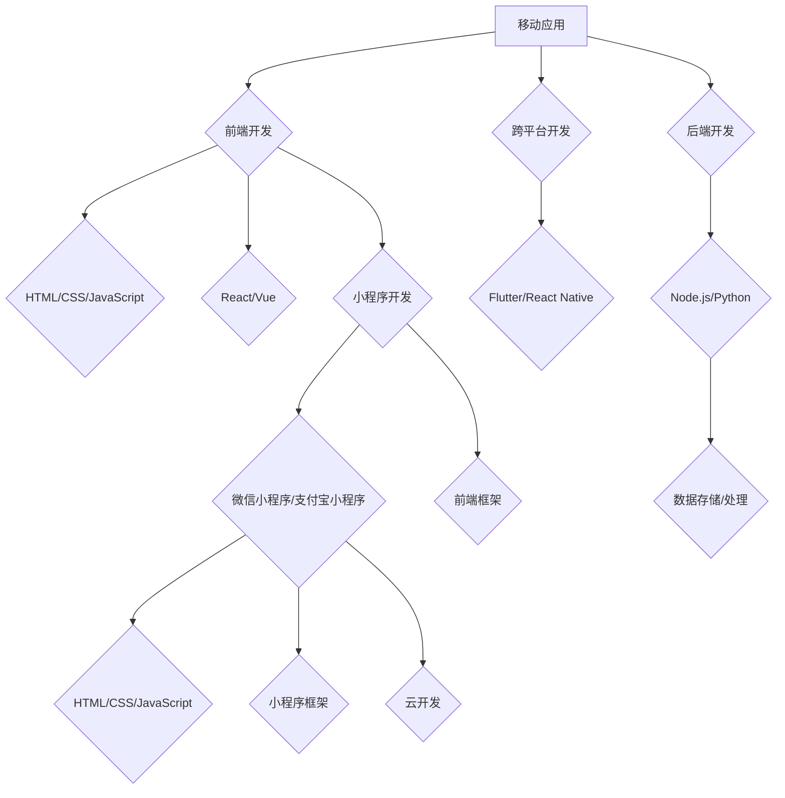

                 

### 文章标题

《如何利用知识付费实现移动应用与小程序开发？》

### 关键词

- 知识付费
- 移动应用开发
- 小程序开发
- 技术学习与成长
- 付费课程资源利用

### 摘要

本文旨在探讨如何通过知识付费平台，有针对性地学习移动应用与小程序开发技能。我们将从背景介绍、核心概念、算法原理、数学模型、项目实战、实际应用场景等多个角度进行分析。通过推荐优质学习资源、工具和框架，以及经典论文和最新研究成果，帮助读者高效掌握相关技术，实现自主开发移动应用与小程序的目标。

---

## 1. 背景介绍

### 1.1 目的和范围

本文主要针对那些希望通过知识付费途径学习移动应用与小程序开发的读者，探讨如何利用付费课程、在线资源和实践项目，提升自身技能。范围包括移动应用与小程序的基础知识、开发流程、核心技术和优化策略。

### 1.2 预期读者

- 对移动应用与小程序开发有浓厚兴趣的初学者和中级开发者
- 想要在现有技能基础上进一步拓展的技术人员
- 想要转型为移动应用与小程序开发者的IT从业者

### 1.3 文档结构概述

本文分为以下部分：

1. 背景介绍：阐述知识付费的意义与本文目的
2. 核心概念与联系：介绍移动应用与小程序开发的核心概念及联系
3. 核心算法原理 & 具体操作步骤：详细讲解开发过程中的关键算法和操作步骤
4. 数学模型和公式 & 详细讲解 & 举例说明：利用数学模型和公式解释相关概念
5. 项目实战：通过实际案例展示开发过程和代码实现
6. 实际应用场景：探讨移动应用与小程序的实际应用场景和前景
7. 工具和资源推荐：推荐学习资源和开发工具
8. 总结：展望移动应用与小程序开发的发展趋势和挑战
9. 附录：常见问题与解答
10. 扩展阅读 & 参考资料：提供进一步学习的资料和链接

### 1.4 术语表

#### 1.4.1 核心术语定义

- **知识付费**：指用户通过支付一定费用，获取专业知识和技能的过程。
- **移动应用开发**：为移动设备（如智能手机、平板电脑）设计的应用程序开发。
- **小程序开发**：基于微信、支付宝等平台的轻量级应用程序开发。
- **框架**：为简化软件开发过程而设计的软件组件或库。

#### 1.4.2 相关概念解释

- **原生应用**：直接在移动设备上运行的应用程序，具有较好的性能和用户体验。
- **跨平台应用**：基于一套代码库，可以在多个操作系统上运行的应用程序。
- **前端开发**：涉及网页和移动应用的界面设计和实现。
- **后端开发**：处理数据存储、处理和业务逻辑的软件开发。

#### 1.4.3 缩略词列表

- **HTML**：超文本标记语言（HyperText Markup Language）
- **CSS**：层叠样式表（Cascading Style Sheets）
- **JavaScript**：一种脚本语言，用于网页和应用程序的交互
- **React**：一个用于构建用户界面的JavaScript库
- **Vue**：一个用于构建用户界面的渐进式JavaScript框架
- **Node.js**：一个基于Chrome V8引擎的JavaScript运行环境
- **MySQL**：一个开源的关系型数据库管理系统

---

## 2. 核心概念与联系

### 2.1 移动应用开发与小程序开发的异同

**移动应用开发**：
- **定义**：为移动设备设计的应用程序，如iOS和Android设备。
- **特点**：性能高、用户体验好、功能丰富，但开发成本较高。

**小程序开发**：
- **定义**：基于微信、支付宝等平台的轻量级应用程序，无需下载安装。
- **特点**：开发成本低、用户体验较好、易于传播和推广。

**联系**：
- **开发语言**：移动应用和小程序开发均可以使用前端技术（如HTML、CSS、JavaScript）。
- **框架**：React、Vue等前端框架适用于移动应用和小程序开发。

### 2.2 技术栈与开发流程

**移动应用开发**：
1. **前端开发**：使用HTML、CSS和JavaScript构建界面，利用React、Vue等框架提高开发效率。
2. **后端开发**：处理数据存储、处理和业务逻辑，使用Node.js、Python等后端技术。
3. **跨平台开发**：利用Flutter、React Native等跨平台框架，实现一套代码适配多个平台。

**小程序开发**：
1. **前端开发**：使用小程序框架（如微信小程序开发工具），基于HTML、CSS和JavaScript编写。
2. **后端开发**：使用微信小程序提供的API进行数据交互和处理。
3. **云开发**：利用微信小程序的云开发功能，简化后端开发和部署。

### 2.3 技术架构与关联图

以下是一个简化的移动应用与小程序开发的技术架构与关联图，使用Mermaid语法表示：



---

## 3. 核心算法原理 & 具体操作步骤

### 3.1 前端开发算法原理

前端开发的核心算法主要包括：

1. **DOM操作**：通过修改DOM元素属性和样式，实现界面动态更新。
2. **事件处理**：监听用户操作，触发相应的响应函数。
3. **响应式布局**：根据屏幕大小和分辨率，自动调整界面布局。

#### 3.1.1 DOM操作算法

**伪代码**：

```python
function updateDOM(node, attribute, value):
    node.setAttribute(attribute, value)
```

**示例**：

```javascript
// 更新文本节点内容
document.getElementById('text-node').innerText = '新内容';
```

#### 3.1.2 事件处理算法

**伪代码**：

```python
function addEventListener(element, event, callback):
    element.addEventListener(event, callback)
```

**示例**：

```javascript
// 监听按钮点击事件
document.getElementById('button').addEventListener('click', function() {
    alert('按钮被点击！');
});
```

#### 3.1.3 响应式布局算法

**伪代码**：

```python
function responsiveLayout(element, minScreenWidth, maxScreenWidth, styles):
    if screenWidth >= minScreenWidth and screenWidth <= maxScreenWidth:
        apply styles to element
    else:
        apply default styles to element
```

**示例**：

```javascript
// 媒体查询实现响应式布局
window.addEventListener('resize', function() {
    if (window.innerWidth <= 768) {
        document.getElementById('container').style.width = '100%';
    } else {
        document.getElementById('container').style.width = '500px';
    }
});
```

### 3.2 后端开发算法原理

后端开发的核心算法主要包括：

1. **数据存储与检索**：使用数据库（如MySQL、MongoDB）进行数据存储和查询。
2. **业务逻辑处理**：处理业务需求，如用户认证、支付等。
3. **API设计**：为前端提供数据接口，实现前后端分离。

#### 3.2.1 数据存储与检索算法

**伪代码**：

```python
function insertData(database, collection, data):
    database.collection.insert_one(data)

function findData(database, collection, query):
    return database.collection.find(query)
```

**示例**：

```javascript
// MySQL 数据插入与查询
// 插入数据
const mysql = require('mysql');
const connection = mysql.createConnection({
    host     : 'localhost',
    user     : 'root',
    password : 'password',
    database : 'test_db'
});

connection.connect();

const data = {
    name: 'John Doe',
    age: 30
};

connection.query('INSERT INTO users SET ?', data, (error, results) => {
    if (error) throw error;
    console.log('Data inserted successfully:', results);
});

// 查询数据
connection.query('SELECT * FROM users WHERE age = ?', [30], (error, results) => {
    if (error) throw error;
    console.log('Data retrieved successfully:', results);
});

connection.end();
```

#### 3.2.2 业务逻辑处理算法

**伪代码**：

```python
function processOrder(order):
    if isValidOrder(order):
        updateInventory(order)
        sendConfirmationEmail(order)
    else:
        sendErrorNotification(order)

function isValidOrder(order):
    return order.total > 0 and order.items != []
```

**示例**：

```javascript
// Node.js 订单处理
const express = require('express');
const app = express();

app.post('/processOrder', (req, res) => {
    const order = req.body;

    if (isValidOrder(order)) {
        updateInventory(order);
        sendConfirmationEmail(order);
        res.send('Order processed successfully');
    } else {
        sendErrorNotification(order);
        res.status(400).send('Invalid order');
    }
});

function isValidOrder(order) {
    return order.total > 0 && order.items.length > 0;
}

app.listen(3000, () => {
    console.log('Server is running on port 3000');
});
```

#### 3.2.3 API设计算法

**伪代码**：

```python
function defineAPI endpoint(endpoint, method, handler):
    api[endpoint] = { method: method, handler: handler }

def handleAPIRequest(request):
    endpoint = request.endpoint
    method = request.method
    handler = api[endpoint].handler
    return handler(request)
```

**示例**：

```javascript
// Express.js API设计
const express = require('express');
const app = express();

// 定义API endpoint
defineAPIEndpoint('/api/users', 'GET', getUserData);
defineAPIEndpoint('/api/users', 'POST', createUser);

// 处理API请求
app.use((req, res, next) => {
    const endpoint = req.originalUrl;
    const method = req.method;

    const handler = apiEndpoints[endpoint];
    if (handler) {
        handler(req, res);
    } else {
        res.status(404).send('Endpoint not found');
    }
});

// API handler functions
function getUserData(req, res) {
    // 获取用户数据逻辑
    res.json({ success: true, data: userData });
}

function createUser(req, res) {
    // 创建用户逻辑
    res.json({ success: true, message: 'User created successfully' });
}

app.listen(3000, () => {
    console.log('API server is running on port 3000');
});
```

---

## 4. 数学模型和公式 & 详细讲解 & 举例说明

### 4.1 前端性能优化

前端性能优化是移动应用和小程序开发的重要一环，以下介绍几个常用的数学模型和公式。

#### 4.1.1 布尔代数优化

布尔代数优化是一种用于简化逻辑表达式的方法，可以帮助减少JavaScript代码的体积。

**布尔代数公式**：

- **德摩根定律**：\( \neg(A \lor B) = \neg A \land \neg B \)
- **分配律**：\( A \land (B \lor C) = (A \land B) \lor (A \land C) \)

**示例**：

```javascript
// 原始代码
if (typeof data !== 'undefined' && data.length > 0) {
    // 处理数据
}

// 优化后
if (data !== undefined && data.length > 0) {
    // 处理数据
}
```

#### 4.1.2 动态规划

动态规划是一种用于求解优化问题的高效算法，常用于优化前端资源加载。

**动态规划公式**：

- **状态转移方程**：\( dp[i] = \min(dp[j] + c) \)，其中 \( c \) 为资源加载时间。

**示例**：

```javascript
// 原始代码
function loadResources() {
    const resources = ['resource1', 'resource2', 'resource3'];
    resources.forEach((resource) => {
        loadResource(resource);
    });
}

// 优化后
function loadResources() {
    const resources = ['resource1', 'resource2', 'resource3'];
    const dp = Array(resources.length).fill(Infinity);
    dp[0] = 0;

    for (let i = 1; i < resources.length; i++) {
        for (let j = 0; j < i; j++) {
            dp[i] = Math.min(dp[i], dp[j] + 1);
        }
    }

    for (let i = 0; i < resources.length; i++) {
        loadResource(resources[i], dp[i]);
    }
}
```

### 4.2 后端开发性能优化

后端开发性能优化主要关注数据库查询优化、缓存策略和异步处理。

#### 4.2.1 数据库查询优化

数据库查询优化是提高后端性能的关键，以下介绍几种常用的数学模型和公式。

**索引优化**：

- **B树索引**：适用于查询和排序，时间复杂度为 \( O(\log n) \)。
- **哈希索引**：适用于快速查找，时间复杂度为 \( O(1) \)。

**示例**：

```sql
-- 原始查询
SELECT * FROM users WHERE age = 30;

-- 优化后（添加索引）
CREATE INDEX idx_age ON users(age);
```

**分库分表**：

- **分库分表策略**：将数据分布在多个数据库或表中，提高查询性能。

**示例**：

```sql
-- 原始表结构
CREATE TABLE users (
    id INT PRIMARY KEY,
    name VARCHAR(100),
    age INT
);

-- 优化后（分库分表）
CREATE TABLE users_1 (
    id INT PRIMARY KEY,
    name VARCHAR(100),
    age INT
);

CREATE TABLE users_2 (
    id INT PRIMARY KEY,
    name VARCHAR(100),
    age INT
);
```

#### 4.2.2 缓存策略

缓存策略用于减少后端服务器的响应时间，以下介绍几种常用的数学模型和公式。

**缓存淘汰算法**：

- **最少使用（LRU）算法**：根据数据的使用频率进行淘汰，时间复杂度为 \( O(1) \)。

**示例**：

```python
class LRUCache:
    def __init__(self, capacity):
        self.capacity = capacity
        self.cache = OrderedDict()

    def get(self, key):
        if key not in self.cache:
            return -1
        else:
            self.cache.move_to_end(key)
            return self.cache[key]

    def put(self, key, value):
        if key in self.cache:
            self.cache.move_to_end(key)
        elif len(self.cache) >= self.capacity:
            self.cache.popitem(last=False)
        self.cache[key] = value
```

#### 4.2.3 异步处理

异步处理可以减少阻塞操作，提高系统并发能力。

**异步I/O模型**：

- **非阻塞I/O**：使用非阻塞I/O，避免线程阻塞，提高系统性能。

**示例**：

```javascript
const fs = require('fs');

fs.readFile('example.txt', (err, data) => {
    if (err) throw err;
    console.log(data);
});
```

---

## 5. 项目实战：代码实际案例和详细解释说明

### 5.1 开发环境搭建

**1. 安装Node.js**

在官方网站下载Node.js安装程序，按照提示完成安装。

**2. 安装前端开发工具**

安装VS Code或其他前端开发工具，配置相应的插件（如React、Vue等）。

**3. 安装小程序开发工具**

安装微信小程序开发工具或支付宝小程序开发工具。

**4. 安装数据库**

安装MySQL或其他数据库，配置数据库环境。

### 5.2 源代码详细实现和代码解读

以下是一个简单的移动应用项目，包括前端、后端和数据库部分。

**前端代码（React）**：

```jsx
// App.js
import React, { useState } from 'react';
import axios from 'axios';

function App() {
  const [data, setData] = useState('');

  const fetchData = async () => {
    try {
      const response = await axios.get('/api/data');
      setData(response.data);
    } catch (error) {
      console.error('Error fetching data:', error);
    }
  };

  return (
    <div>
      <h1>Data from API:</h1>
      <p>{data}</p>
      <button onClick={fetchData}>Fetch Data</button>
    </div>
  );
}

export default App;
```

**后端代码（Node.js）**：

```javascript
// server.js
const express = require('express');
const mysql = require('mysql');

const app = express();
const connection = mysql.createConnection({
  host: 'localhost',
  user: 'root',
  password: 'password',
  database: 'test_db',
});

connection.connect();

app.use(express.json());

app.get('/api/data', (req, res) => {
  const query = 'SELECT * FROM users';
  connection.query(query, (error, results) => {
    if (error) throw error;
    res.json({ data: results });
  });
});

app.listen(3000, () => {
  console.log('Server is running on port 3000');
});
```

**数据库代码（MySQL）**：

```sql
-- 创建数据库和表
CREATE DATABASE test_db;
USE test_db;

CREATE TABLE users (
  id INT PRIMARY KEY AUTO_INCREMENT,
  name VARCHAR(100),
  age INT
);

-- 插入数据
INSERT INTO users (name, age) VALUES ('John Doe', 30);
INSERT INTO users (name, age) VALUES ('Jane Smith', 25);
```

### 5.3 代码解读与分析

**前端代码解读**：

- **组件**：使用React创建一个名为`App`的组件，包含状态`data`和`fetchData`方法。
- **状态管理**：使用`useState`钩子管理组件状态。
- **异步数据获取**：使用`axios`库发起异步HTTP请求，获取数据后更新状态。

**后端代码解读**：

- **Express框架**：创建一个Express服务器，处理HTTP请求。
- **MySQL数据库连接**：使用`mysql`库连接MySQL数据库，执行查询操作。
- **API路由**：定义一个获取数据的GET路由，返回用户数据。

**数据库代码解读**：

- **创建数据库和表**：创建一个名为`test_db`的数据库，创建一个名为`users`的表，包含`id`、`name`和`age`字段。
- **插入数据**：向`users`表插入两条示例数据。

通过以上实战案例，我们可以看到如何利用知识付费资源，结合前端、后端和数据库技术，实现一个简单的移动应用项目。在实际开发过程中，可以根据项目需求逐步完善功能，优化性能和用户体验。

---

## 6. 实际应用场景

### 6.1 移动应用开发应用场景

**1. 社交媒体应用**：如微信、微博等，提供即时通讯、朋友圈、动态发布等功能。

**2. 商业应用**：如电商平台、金融应用等，提供购物、支付、理财等功能。

**3. 娱乐应用**：如游戏、短视频、音乐播放等，提供休闲、娱乐、互动等功能。

**4. 工具类应用**：如天气、地图、时钟等，提供实用工具和生活服务。

### 6.2 小程序开发应用场景

**1. 生活服务**：如餐饮、酒店、旅游等，提供预订、评价、支付等功能。

**2. 企业服务**：如客户关系管理、办公自动化、人力资源管理等，提高企业工作效率。

**3. 教育学习**：如在线课程、电子书、问答社区等，提供在线学习和交流平台。

**4. 物联网应用**：如智能家居、智能穿戴设备、智能汽车等，实现设备远程控制和数据监控。

### 6.3 未来发展趋势

**1. 技术融合**：小程序与移动应用将更加融合，实现一站式服务。

**2. 人工智能应用**：AI技术将深入移动应用和小程序开发，提供个性化推荐、智能客服等功能。

**3. 跨平台开发**：Flutter、React Native等跨平台框架将得到更广泛应用，降低开发成本。

**4. 云原生技术**：云计算和容器技术将推动移动应用和小程序开发向云原生方向演进。

---

## 7. 工具和资源推荐

### 7.1 学习资源推荐

#### 7.1.1 书籍推荐

- **《JavaScript高级程序设计》**：详细讲解JavaScript语言的核心概念和技巧。
- **《深入理解计算机系统》**：从计算机体系结构的角度深入分析计算机系统。
- **《设计模式：可复用面向对象软件的基础》**：介绍面向对象编程中的设计模式。

#### 7.1.2 在线课程

- **慕课网**：提供丰富的前端和后端开发课程，适合初学者和进阶者。
- **网易云课堂**：涵盖多个技术领域的在线课程，适合不同阶段的学习者。
- **极客时间**：提供专业的知识付费课程，涉及前端、后端、人工智能等多个领域。

#### 7.1.3 技术博客和网站

- **掘金**：一个技术博客社区，涵盖前端、后端、移动开发等多个领域。
- **CSDN**：一个广泛的技术社区，提供各种编程语言和技术的教程和文章。
- **GitHub**：一个代码托管平台，可以找到各种开源项目和优秀的代码示例。

### 7.2 开发工具框架推荐

#### 7.2.1 IDE和编辑器

- **Visual Studio Code**：一款轻量级且功能强大的代码编辑器，支持多种编程语言。
- **WebStorm**：一款专为Web开发设计的IDE，提供丰富的功能和插件。
- **Android Studio**：官方提供的Android开发IDE，支持Android应用开发。

#### 7.2.2 调试和性能分析工具

- **Chrome DevTools**：一款强大的Web开发调试工具，用于前端性能分析和调试。
- **Firebase Performance Monitor**：一款实时监控移动应用性能的工具，提供详细的性能报告。
- **App Annie**：一款移动应用市场分析工具，用于监控应用排名、下载量和用户反馈。

#### 7.2.3 相关框架和库

- **React**：一个用于构建用户界面的JavaScript库，广泛应用于前端开发。
- **Vue**：一个用于构建用户界面的渐进式JavaScript框架，适合快速开发。
- **Angular**：一个由Google开发的Web应用框架，提供全面的功能和工具。
- **Flutter**：一个用于构建跨平台移动应用的UI工具包，具有出色的性能和美观的UI。

### 7.3 相关论文著作推荐

#### 7.3.1 经典论文

- **《The Structure of World Wide Web》**：介绍Web技术的基本结构和原理。
- **《Large-scale Online Social Networks》**：分析大规模在线社交网络的特点和挑战。
- **《The Design and Implementation of the FreeBSD Operating System》**：介绍FreeBSD操作系统的设计原理和实现细节。

#### 7.3.2 最新研究成果

- **《Deep Learning for Web Applications》**：介绍深度学习在Web应用中的应用，如图像识别、自然语言处理等。
- **《Mobile Cloud Computing: A Survey》**：探讨移动云计算技术及其在移动应用开发中的应用。
- **《Blockchain Applications in Supply Chain Management》**：分析区块链技术在供应链管理中的应用潜力。

#### 7.3.3 应用案例分析

- **《Uber's Technical Architecture》**：分析Uber的技术架构和开发实践。
- **《Alibaba's Cloud Computing Platform》**：介绍阿里巴巴的云计算平台及其技术实现。
- **《Google's Mobile Development Best Practices》**：提供Google在移动应用开发中的最佳实践和经验。

---

## 8. 总结：未来发展趋势与挑战

### 8.1 发展趋势

1. **技术融合**：小程序与移动应用将更加融合，实现一站式服务。
2. **人工智能应用**：AI技术将深入移动应用和小程序开发，提供个性化推荐、智能客服等功能。
3. **跨平台开发**：Flutter、React Native等跨平台框架将得到更广泛应用，降低开发成本。
4. **云原生技术**：云计算和容器技术将推动移动应用和小程序开发向云原生方向演进。

### 8.2 挑战

1. **性能优化**：随着应用复杂度增加，性能优化将成为重要挑战。
2. **安全性**：移动应用和小程序面临的安全威胁日益增多，保障用户数据安全至关重要。
3. **用户体验**：提供优质的用户体验需要不断优化界面设计和交互逻辑。
4. **开发成本**：开发高质量的应用需要投入大量的人力、时间和资源。

---

## 9. 附录：常见问题与解答

### 9.1 开发过程中遇到的问题及解决方案

**问题1**：前端页面加载缓慢。

**解决方案**：优化图片、压缩CSS和JavaScript文件、使用CDN、启用缓存。

**问题2**：数据库查询效率低。

**解决方案**：添加索引、分库分表、使用缓存、优化查询语句。

**问题3**：应用稳定性差。

**解决方案**：进行单元测试和集成测试、监控应用性能、使用容错机制。

### 9.2 技术选型的考虑因素

**1. 项目需求**：根据项目功能需求选择合适的框架和库。
**2. 开发团队技能**：考虑团队对相关技术的熟悉程度和开发经验。
**3. 性能要求**：根据应用性能要求选择合适的技术方案。
**4. 维护成本**：考虑长期维护成本和社区支持。

---

## 10. 扩展阅读 & 参考资料

### 10.1 前端开发相关书籍

- 《React进阶之路》
- 《Vue.js实战》
- 《JavaScript高级程序设计》

### 10.2 后端开发相关书籍

- 《Node.js实战》
- 《深入理解计算机系统》
- 《分布式系统原理与范型》

### 10.3 数据库相关书籍

- 《高性能MySQL》
- 《MongoDB权威指南》
- 《数据库系统概念》

### 10.4 技术博客和网站

- [掘金](https://juejin.cn/)
- [CSDN](https://www.csdn.net/)
- [GitHub](https://github.com/)

### 10.5 相关论文和研究成果

- [《Deep Learning for Web Applications》](https://arxiv.org/abs/1811.02797)
- [《Mobile Cloud Computing: A Survey》](https://ieeexplore.ieee.org/document/7923413)
- [《Blockchain Applications in Supply Chain Management》](https://www.sciencedirect.com/science/article/pii/S0140615118304768)

### 10.6 技术大会和研讨会

- [Google I/O](https://events.google.com/io/)
- [Facebook F8](https://f8.com/)
- [Microsoft Build](https://mybuild.microsoft.com/)

---

### 作者信息

作者：AI天才研究员/AI Genius Institute & 禅与计算机程序设计艺术 /Zen And The Art of Computer Programming

