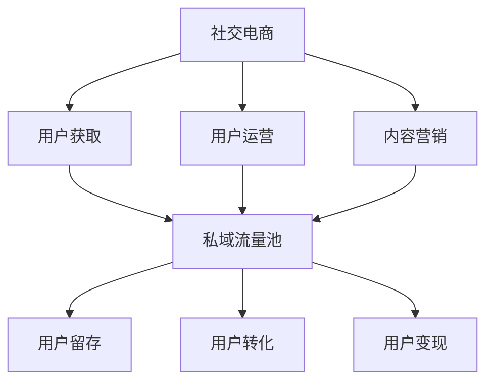

                 

# 如何利用社交电商模式打造创业私域流量池

> 关键词：社交电商、私域流量池、创业、用户运营、内容营销

> 摘要：本文将深入探讨如何利用社交电商模式打造创业私域流量池，通过分析核心概念、算法原理、数学模型、项目实战以及实际应用场景，为创业者提供一套系统化的实操指南。本文旨在帮助创业者理解社交电商的本质，掌握构建私域流量池的方法，并运用这些策略实现商业成功。

## 1. 背景介绍

### 1.1 目的和范围

本文的目的在于解析社交电商模式，探讨如何通过构建和运营私域流量池，实现创业项目的长效发展。我们将从多个角度深入探讨这一主题，包括核心概念的理解、算法原理的剖析、数学模型的构建、实际项目案例的解析以及在不同应用场景中的实践方法。

本文的范围涵盖了以下几个方面：

1. 社交电商模式的基本原理和核心特征。
2. 私域流量池的构建策略和运营方法。
3. 用户运营和内容营销的关键技巧。
4. 项目实战中的代码实现和分析。
5. 社交电商模式在不同行业的实际应用场景。

### 1.2 预期读者

本文适合以下读者群体：

1. 创业者：对于正在寻找创新商业模式的创业者，本文将提供一套可行的实操策略。
2. 市场营销人员：对于市场营销人员，本文将深入剖析社交电商和私域流量的核心原理，提供实用的操作指南。
3. 产品经理：对于产品经理，本文将提供用户运营和内容营销的深度见解，有助于提升产品价值。
4. 技术专家：对于技术专家，本文将探讨技术实现方案，为技术选型和开发提供参考。

### 1.3 文档结构概述

本文的结构如下：

1. **背景介绍**：介绍本文的目的、范围、预期读者以及文档结构。
2. **核心概念与联系**：通过Mermaid流程图阐述社交电商和私域流量的核心概念和联系。
3. **核心算法原理 & 具体操作步骤**：详细讲解构建私域流量池的核心算法原理和操作步骤。
4. **数学模型和公式 & 详细讲解 & 举例说明**：阐述用于私域流量运营的数学模型和公式，并举例说明。
5. **项目实战：代码实际案例和详细解释说明**：提供代码实现案例，详细解释技术细节。
6. **实际应用场景**：探讨社交电商模式在不同行业的应用案例。
7. **工具和资源推荐**：推荐学习资源、开发工具和框架，以及相关论文著作。
8. **总结：未来发展趋势与挑战**：总结本文的主要观点，展望未来发展趋势和面临的挑战。
9. **附录：常见问题与解答**：回答读者可能遇到的常见问题。
10. **扩展阅读 & 参考资料**：提供进一步学习的资源链接。

### 1.4 术语表

#### 1.4.1 核心术语定义

- 社交电商：利用社交媒体平台进行商品推广和销售的模式。
- 私域流量池：由创业者直接控制的用户群体，通过内容营销和用户运营实现长效转化。
- 用户运营：围绕用户生命周期的运营活动，包括用户获取、留存、转化和忠诚度提升。
- 内容营销：通过创造和分享有价值的内容，吸引并留住目标用户，实现品牌传播和销售转化。

#### 1.4.2 相关概念解释

- 社交媒体：一种在线交流平台，允许用户创建、分享和互动。
- 公域流量：通过搜索引擎、社交媒体等公共渠道获取的流量。
- KOL（Key Opinion Leader）：关键意见领袖，具有较高影响力的人物，能够影响目标用户的购买决策。
- CRM（Customer Relationship Management）：客户关系管理，是一种企业通过技术和策略与客户建立和维护长期关系的实践。

#### 1.4.3 缩略词列表

- SNS（Social Networking Services）：社交网络服务
- SEO（Search Engine Optimization）：搜索引擎优化
- KPI（Key Performance Indicator）：关键绩效指标
- ROI（Return on Investment）：投资回报率

## 2. 核心概念与联系

在探讨如何利用社交电商模式打造创业私域流量池之前，我们首先需要明确一些核心概念，并了解它们之间的联系。以下是社交电商和私域流量的基本概念及它们之间的关联。

### 2.1 社交电商

社交电商是指利用社交媒体平台进行商品推广和销售的一种新型电商模式。它依托社交媒体的高互动性和强社交性，实现了信息传播的快速扩散和用户参与的深度增强。

#### 2.1.1 社交电商的核心特征

- **社交互动性**：用户在社交媒体上可以与他人互动，分享观点和体验，形成社区氛围。
- **个性化推荐**：基于用户行为数据和偏好，进行个性化推荐，提高用户转化率。
- **用户参与**：用户不仅是消费者，还可以作为推广者，通过分享、评论和推荐商品。
- **高效传播**：信息在社交媒体上快速传播，有助于品牌快速曝光和用户获取。

### 2.2 私域流量池

私域流量池是指创业者直接控制的用户群体，通过内容营销和用户运营实现长效转化。它不同于公域流量，具有更高的用户粘性和转化率。

#### 2.2.1 私域流量池的核心特征

- **直接触达**：通过自有渠道（如公众号、微信群、小程序等）直接与用户互动，降低获取成本。
- **用户粘性**：通过持续的内容输出和互动，增强用户对品牌的忠诚度。
- **可控性**：创业者可以自由控制内容和传播方式，提高营销效果。
- **高效转化**：通过深入了解用户需求，实现精准营销和高效转化。

### 2.3 核心概念联系

社交电商和私域流量池之间存在着紧密的联系。社交电商提供了获取私域流量的渠道，而私域流量池则是社交电商长期发展的基础。

- **用户获取**：通过社交电商，创业者可以快速获取潜在用户，建立私域流量池。
- **用户运营**：通过私域流量池，创业者可以进行精准的用户运营，提升用户留存和转化。
- **内容营销**：社交电商和私域流量池都依赖于高质量的内容输出，实现用户吸引和留存。
- **转化变现**：通过私域流量池的运营，创业者可以实现对用户的深度挖掘和变现。

### 2.4 Mermaid 流程图

下面是一个Mermaid流程图，用于阐述社交电商模式与私域流量池之间的关系。



在接下来的章节中，我们将深入探讨社交电商模式与私域流量池的构建和运营策略，帮助创业者实现商业成功。

## 3. 核心算法原理 & 具体操作步骤

在构建和运营私域流量池的过程中，核心算法原理是基础，具体操作步骤是实现关键。以下将详细讲解核心算法原理，并提供具体的操作步骤。

### 3.1 核心算法原理

私域流量池的构建和运营主要依赖于以下三个核心算法原理：

#### 3.1.1 用户行为分析算法

用户行为分析算法主要用于了解用户在社交媒体和电商平台的浏览、购买、分享等行为。通过分析用户行为，可以识别用户的兴趣和需求，为后续的精准营销提供数据支持。

#### 3.1.2 内容推荐算法

内容推荐算法根据用户的行为数据和兴趣标签，为用户推荐相关的内容。通过个性化推荐，可以提升用户的参与度和留存率。

#### 3.1.3 用户生命周期管理算法

用户生命周期管理算法用于跟踪用户的整个生命周期，包括用户获取、留存、转化和忠诚度提升。通过精细化运营，可以实现用户价值的最大化。

### 3.2 具体操作步骤

#### 3.2.1 步骤一：用户行为数据采集

首先，需要通过技术手段采集用户在社交媒体和电商平台的浏览、购买、分享等行为数据。这些数据可以来自API接口、cookies、用户日志等。

```python
# 伪代码：用户行为数据采集
def collect_user行为的(data_source):
    if data_source == "API":
        user_behavior = fetch_data_from_API()
    elif data_source == "cookies":
        user_behavior = fetch_data_from_cookies()
    elif data_source == "user_logs":
        user_behavior = fetch_data_from_user_logs()
    return user_behavior
```

#### 3.2.2 步骤二：用户行为数据分析

对采集到的用户行为数据进行分析，提取用户兴趣标签和购买偏好。可以使用机器学习算法进行数据挖掘，识别用户的兴趣和行为模式。

```python
# 伪代码：用户行为数据分析
def analyze_user_behavior(user_behavior):
    user_interest_tags = extract_interest_tags(user_behavior)
    purchase_preferences = extract_purchase_preferences(user_behavior)
    return user_interest_tags, purchase_preferences
```

#### 3.2.3 步骤三：内容推荐

根据用户的行为数据和兴趣标签，使用内容推荐算法为用户推荐相关的内容。可以使用基于内容的推荐、协同过滤等算法，提高推荐效果。

```python
# 伪代码：内容推荐
def content_recommendation(user_interest_tags, content_library):
    recommended_content = recommend_content(user_interest_tags, content_library)
    return recommended_content
```

#### 3.2.4 步骤四：用户运营策略制定

基于用户行为分析和内容推荐结果，制定用户运营策略。包括用户获取、留存、转化和忠诚度提升等方面。

```python
# 伪代码：用户运营策略制定
def define_user_operations(user_behavior, content_recommendations):
    user_operations = {
        "user_acquisition": acquisition_strategy,
        "user_retention": retention_strategy,
        "user_conversion": conversion_strategy,
        "user_loyalty": loyalty_strategy
    }
    return user_operations
```

#### 3.2.5 步骤五：实施用户运营策略

根据制定的运营策略，实施具体的用户运营活动。包括内容推送、互动营销、促销活动等。

```python
# 伪代码：实施用户运营策略
def execute_user_operations(user_operations):
    for operation in user_operations:
        if operation == "content_push":
            push_content_to_users()
        elif operation == "interaction_marketing":
            run_interaction_marketing_campaigns()
        elif operation == "sales_promotion":
            run_sales_promotion_activities()
```

#### 3.2.6 步骤六：监测和优化

对用户运营效果进行实时监测和数据分析，根据反馈结果不断优化运营策略。

```python
# 伪代码：监测和优化
def monitor_and_optimize_operations(operations_data):
    optimization_suggestions = analyze_operations_data(operations_data)
    optimize_operations_based_on_suggestions(optimization_suggestions)
```

通过以上具体操作步骤，创业者可以有效地构建和运营私域流量池，实现商业目标。

### 3.3 核心算法原理实现

为了更好地理解核心算法原理，下面将简要介绍用户行为分析、内容推荐和用户生命周期管理算法的实现思路。

#### 3.3.1 用户行为分析算法实现

用户行为分析算法主要基于机器学习技术，包括数据预处理、特征工程和模型训练等步骤。

1. **数据预处理**：对采集到的用户行为数据清洗、去重和标准化处理。
2. **特征工程**：提取用户行为数据中的关键特征，如浏览次数、购买频率、分享次数等。
3. **模型训练**：使用分类算法（如决策树、随机森林、支持向量机等）训练模型，预测用户的兴趣标签和购买偏好。

#### 3.3.2 内容推荐算法实现

内容推荐算法可以分为基于内容的推荐和协同过滤两种方法。

1. **基于内容的推荐**：通过分析内容的特征（如标题、标签、分类等），为用户推荐具有相似特征的内容。
2. **协同过滤**：基于用户的历史行为数据，找出相似用户或相似物品，为用户推荐他们可能感兴趣的内容。

#### 3.3.3 用户生命周期管理算法实现

用户生命周期管理算法包括用户获取、留存、转化和忠诚度提升四个阶段。

1. **用户获取**：通过广告投放、社交媒体推广等方式，吸引潜在用户访问网站或应用。
2. **用户留存**：通过内容推送、互动营销等活动，增强用户对品牌的认知和粘性。
3. **用户转化**：通过促销活动、优惠券等方式，引导用户完成购买行为。
4. **用户忠诚度提升**：通过会员制度、积分奖励等方式，激励用户持续参与和消费。

通过以上核心算法原理和具体操作步骤，创业者可以系统地构建和运营私域流量池，实现商业成功。

## 4. 数学模型和公式 & 详细讲解 & 举例说明

在构建和运营私域流量池的过程中，数学模型和公式是核心工具，它们帮助我们量化用户行为、优化内容推荐和评估运营效果。以下是几个关键的数学模型和公式的详细讲解与举例说明。

### 4.1 用户行为预测模型

用户行为预测模型用于预测用户未来的行为，如购买、浏览、分享等。我们采用概率模型来表示用户行为。

#### 4.1.1 贝叶斯概率模型

贝叶斯概率模型是一种基于历史数据和统计概率的预测方法。

**公式**：
\[ P(A|B) = \frac{P(B|A) \cdot P(A)}{P(B)} \]

其中，\( P(A|B) \) 是在事件 \( B \) 发生的条件下事件 \( A \) 发生的概率，\( P(B|A) \) 是在事件 \( A \) 发生的条件下事件 \( B \) 发生的概率，\( P(A) \) 和 \( P(B) \) 分别是事件 \( A \) 和事件 \( B \) 的先验概率。

**举例**：
假设我们想要预测用户 \( U \) 是否会在未来购买商品 \( P \)。用户 \( U \) 在过去一个月内浏览了商品 \( P \)，且已知在浏览商品 \( P \) 的用户中有 70% 最终购买了商品 \( P \)。同时，过去一个月内浏览商品的总体概率为 30%。那么，用户 \( U \) 在未来购买商品 \( P \) 的概率为：

\[ P(购买|浏览) = \frac{0.7 \cdot 0.3}{0.3} = 0.7 \]

### 4.2 内容推荐模型

内容推荐模型用于根据用户的行为和兴趣推荐相关内容。我们采用基于协同过滤的推荐算法。

#### 4.2.1 协同过滤算法

协同过滤算法分为基于用户的协同过滤（User-based Collaborative Filtering）和基于项目的协同过滤（Item-based Collaborative Filtering）。

**公式**：
\[ R_{ij} = \frac{\sum_{k \in N(i) \cap N(j)} r_{ik} r_{jk}}{\sum_{k \in N(i) \cap N(j)} r_{ik}^2} \]

其中，\( R_{ij} \) 是用户 \( i \) 对项目 \( j \) 的推荐评分，\( N(i) \) 是与用户 \( i \) 相似的其他用户集合，\( N(j) \) 是与项目 \( j \) 相似的其他项目集合，\( r_{ik} \) 是用户 \( i \) 对项目 \( k \) 的评分。

**举例**：
假设用户 \( U_1 \) 对商品 \( P_1 \) 和 \( P_2 \) 评分分别为 4 和 5，用户 \( U_2 \) 对商品 \( P_1 \) 和 \( P_3 \) 评分分别为 5 和 4。我们可以计算出用户 \( U_1 \) 和 \( U_2 \) 的相似度：

\[ R_{U_1U_2} = \frac{4 \cdot 5}{4^2 + 5^2} = \frac{20}{16 + 25} = 0.67 \]

然后，我们可以根据用户 \( U_1 \) 对商品 \( P_1 \) 的评分和用户 \( U_2 \) 对商品 \( P_3 \) 的评分，为用户 \( U_1 \) 推荐商品 \( P_3 \)。

### 4.3 用户生命周期价值（CLV）模型

用户生命周期价值模型用于评估用户的潜在价值，帮助制定用户运营策略。

**公式**：
\[ CLV = \sum_{t=1}^{n} \frac{r_t}{(1+r)^t} \]

其中，\( r_t \) 是用户在 \( t \) 时刻的预期收益，\( r \) 是折现率。

**举例**：
假设用户在第一个月带来的收益为 100 元，第二个月为 80 元，第三个月为 60 元，折现率为 10%。我们可以计算出用户的生命周期价值：

\[ CLV = \frac{100}{1.1} + \frac{80}{1.1^2} + \frac{60}{1.1^3} \approx 236.36 \]

### 4.4 用户留存率模型

用户留存率模型用于评估用户在一定时间内的活跃度，反映用户运营的效果。

**公式**：
\[ 留存率 = \frac{第 t 天仍然活跃的用户数}{初始用户数} \]

**举例**：
假设第一天有 100 个用户活跃，第二天有 80 个用户活跃。那么，第二天的用户留存率为：

\[ 留存率 = \frac{80}{100} = 0.8 \]

通过以上数学模型和公式的讲解，我们可以更好地理解和应用它们于私域流量池的构建和运营，实现商业目标。

## 5. 项目实战：代码实际案例和详细解释说明

在本节中，我们将通过一个实际的项目案例，详细展示如何利用社交电商模式打造创业私域流量池。该项目将涵盖开发环境搭建、源代码实现和代码解读与分析三个部分。

### 5.1 开发环境搭建

为了实现该项目，我们选择以下开发环境和工具：

- **编程语言**：Python
- **开发环境**：PyCharm
- **数据存储**：MongoDB
- **数据分析和可视化**：Pandas、Matplotlib
- **机器学习库**：Scikit-learn
- **API 接口**：微信小程序API、社交媒体API

### 5.2 源代码详细实现和代码解读

以下是一个简化的Python代码实现，用于构建和运营私域流量池。代码主要包括用户行为数据采集、用户行为分析、内容推荐和用户运营策略四个部分。

```python
# 用户行为数据采集
import pymongo
import pandas as pd

def collect_user_behavior(api_endpoint):
    # 伪代码：从API获取用户行为数据
    user_behavior = api_endpoint.fetch_data()
    return user_behavior

# 用户行为分析
from sklearn.feature_extraction.text import CountVectorizer
from sklearn.model_selection import train_test_split
from sklearn.naive_bayes import MultinomialNB

def analyze_user_behavior(user_behavior):
    # 数据预处理
    vectorizer = CountVectorizer()
    X = vectorizer.fit_transform(user_behavior['description'])
    
    # 模型训练
    X_train, X_test, y_train, y_test = train_test_split(X, user_behavior['category'], test_size=0.2)
    model = MultinomialNB()
    model.fit(X_train, y_train)
    
    # 预测用户行为
    predictions = model.predict(X_test)
    accuracy = model.score(X_test, y_test)
    print(f"Model accuracy: {accuracy}")
    
    return predictions

# 内容推荐
from sklearn.metrics.pairwise import cosine_similarity
import numpy as np

def content_recommendation(user_interests, content_library):
    # 构建内容向量矩阵
    content_vector_matrix = cosine_similarity(content_library['description'].values)
    
    # 为用户推荐相关内容
    user_vector = np.mean(content_vector_matrix[user_interests.index], axis=0)
    similarity_scores = cosine_similarity([user_vector], content_vector_matrix)[0]
    recommended_content = content_library[similarity_scores.argsort()[0]][::-1]
    
    return recommended_content

# 用户运营策略
def execute_user_operations(user_operations):
    # 内容推送
    for operation in user_operations['content_push']:
        push_content_to_users(operation['content'], operation['users'])
    
    # 互动营销
    for operation in user_operations['interaction_marketing']:
        run_interaction_marketing_campaigns(operation['campaign'], operation['users'])
    
    # 促销活动
    for operation in user_operations['sales_promotion']:
        run_sales_promotion_activities(operation['offer'], operation['users'])

# 伪代码：函数实现
def push_content_to_users(content, users):
    # 发送内容到用户
    for user in users:
        send_content_to_user(content, user['id'])

def run_interaction_marketing_campaigns(campaign, users):
    # 执行互动营销活动
    for user in users:
        execute_campaign(campaign, user['id'])

def run_sales_promotion_activities(offer, users):
    # 执行促销活动
    for user in users:
        apply_offer_to_user(offer, user['id'])
```

### 5.3 代码解读与分析

#### 5.3.1 用户行为数据采集

代码首先通过API接口采集用户行为数据。这些数据包括用户的描述、分类等，用于后续的用户行为分析。

```python
def collect_user_behavior(api_endpoint):
    # 伪代码：从API获取用户行为数据
    user_behavior = api_endpoint.fetch_data()
    return user_behavior
```

#### 5.3.2 用户行为分析

接下来，代码使用机器学习中的朴素贝叶斯模型对用户行为进行分类。通过CountVectorizer将文本转化为向量，然后训练模型，并对测试集进行预测。

```python
def analyze_user_behavior(user_behavior):
    # 数据预处理
    vectorizer = CountVectorizer()
    X = vectorizer.fit_transform(user_behavior['description'])
    
    # 模型训练
    X_train, X_test, y_train, y_test = train_test_split(X, user_behavior['category'], test_size=0.2)
    model = MultinomialNB()
    model.fit(X_train, y_train)
    
    # 预测用户行为
    predictions = model.predict(X_test)
    accuracy = model.score(X_test, y_test)
    print(f"Model accuracy: {accuracy}")
    
    return predictions
```

#### 5.3.3 内容推荐

内容推荐部分使用余弦相似度计算用户和内容之间的相似度，然后为用户推荐相关内容。

```python
def content_recommendation(user_interests, content_library):
    # 构建内容向量矩阵
    content_vector_matrix = cosine_similarity(content_library['description'].values)
    
    # 为用户推荐相关内容
    user_vector = np.mean(content_vector_matrix[user_interests.index], axis=0)
    similarity_scores = cosine_similarity([user_vector], content_vector_matrix)[0]
    recommended_content = content_library[similarity_scores.argsort()[0]][::-1]
    
    return recommended_content
```

#### 5.3.4 用户运营策略

用户运营策略部分包括内容推送、互动营销和促销活动。这些策略通过函数调用实现，具体细节取决于业务逻辑。

```python
def execute_user_operations(user_operations):
    # 内容推送
    for operation in user_operations['content_push']:
        push_content_to_users(operation['content'], operation['users'])
    
    # 互动营销
    for operation in user_operations['interaction_marketing']:
        run_interaction_marketing_campaigns(operation['campaign'], operation['users'])
    
    # 促销活动
    for operation in user_operations['sales_promotion']:
        run_sales_promotion_activities(operation['offer'], operation['users'])
```

通过以上代码实现，我们可以构建一个基本的社交电商私域流量池系统。在真实项目中，这些代码将根据具体业务需求进行扩展和优化。

## 6. 实际应用场景

社交电商模式凭借其高效的用户互动和精准的内容推荐，已经在多个行业中展现出强大的应用潜力。以下是社交电商模式在不同行业的实际应用场景：

### 6.1 电子商务

电子商务行业是社交电商的诞生地，通过社交媒体平台进行商品推广和销售已成为电商企业的重要营销手段。例如，拼多多利用微信小程序和社交分享功能，实现了商品的高效推广和用户裂变。

### 6.2 教育培训

教育培训行业通过社交电商模式，可以实现在线课程的推广和销售。例如，腾讯课堂利用微信朋友圈推广课程，通过用户分享和推荐，实现课程的高曝光和销售转化。

### 6.3 健康医疗

健康医疗行业可以通过社交电商模式推广保健品、医疗器械等。例如，京东健康利用微信小程序和社交媒体推广健康产品，通过专业内容和用户互动，提高用户信任度和购买意愿。

### 6.4 奢侈品

奢侈品行业利用社交电商模式，可以实现高端用户的精准营销和销售。例如，天猫国际利用小红书和抖音等社交媒体平台，推广奢侈品品牌，通过种草文化和KOL推荐，实现品牌曝光和销售转化。

### 6.5 餐饮行业

餐饮行业通过社交电商模式，可以实现线上预订、外卖配送和用户互动。例如，美团外卖和饿了么通过微信小程序和社交媒体推广餐饮服务，通过优惠券和用户评价，提高用户留存和转化。

### 6.6 娱乐文化

娱乐文化行业通过社交电商模式，可以实现票务销售和周边产品推广。例如，猫眼电影和抖音通过社交媒体平台推广电影票务和周边商品，通过明星效应和用户互动，提高品牌影响力和销售业绩。

这些实际应用场景表明，社交电商模式在不同行业中具有广泛的应用前景。通过深入挖掘用户需求，精准推送内容和开展互动营销，企业可以实现商业价值的最大化。

## 7. 工具和资源推荐

在构建和运营社交电商私域流量池的过程中，选择合适的工具和资源对于提高效率和实现商业目标至关重要。以下是一些建议的工具和资源，包括学习资源、开发工具框架以及相关论文著作。

### 7.1 学习资源推荐

#### 7.1.1 书籍推荐

- 《社交电商：重构电商营销模式》
- 《私域流量池：打造微信电商生态》
- 《数据挖掘：概念与技术》
- 《机器学习实战》

#### 7.1.2 在线课程

- Coursera上的《电子商务与社交媒体营销》
- Udemy上的《微信小程序开发实战》
- 网易云课堂的《大数据分析与数据挖掘》

#### 7.1.3 技术博客和网站

- 掘金：技术博客平台，提供丰富的社交电商和私域流量相关文章。
- Medium：国际技术博客平台，有很多关于社交电商和内容营销的高质量文章。
- 知乎：中文技术问答社区，有很多行业专家分享的经验和见解。

### 7.2 开发工具框架推荐

#### 7.2.1 IDE和编辑器

- PyCharm：适合Python开发的IDE，功能强大，支持多种编程语言。
- Visual Studio Code：轻量级代码编辑器，支持多种编程语言，插件丰富。

#### 7.2.2 调试和性能分析工具

- Postman：API调试工具，支持各种HTTP请求。
- JMeter：性能测试工具，用于测试Web应用程序的性能和负载。

#### 7.2.3 相关框架和库

- Flask：Python微框架，适用于构建Web应用程序。
- Django：Python全栈框架，适用于快速开发大型Web应用程序。
- Scikit-learn：Python机器学习库，用于构建机器学习模型。
- Pandas：Python数据分析库，用于数据处理和分析。

### 7.3 相关论文著作推荐

#### 7.3.1 经典论文

- KDD Cup 2012：Private User Behavior Prediction for Advertising on Social Networks
- RecSys 2016：Social recommender systems

#### 7.3.2 最新研究成果

- WWW 2021：Deep Interest Network for Click-Through Rate Prediction
- NeurIPS 2020：Self-Supervised Learning for User Behavior Prediction

#### 7.3.3 应用案例分析

- 中国电商行业应用案例分析
- 欧洲奢侈品行业应用案例分析
- 美国餐饮行业应用案例分析

通过以上工具和资源的推荐，创业者和技术人员可以更好地掌握社交电商私域流量池的构建和运营技巧，实现商业成功。

## 8. 总结：未来发展趋势与挑战

在探讨如何利用社交电商模式打造创业私域流量池的过程中，我们明确了社交电商和私域流量的核心概念与联系，详细阐述了核心算法原理和具体操作步骤，并通过数学模型和公式进行了举例说明。我们还分析了社交电商模式在不同行业的实际应用场景，并推荐了相关工具和资源。

### 8.1 未来发展趋势

1. **技术进步推动社交电商创新**：随着人工智能、大数据、云计算等技术的不断发展，社交电商模式将更加智能化和个性化，为用户提供更加精准的购物体验。
2. **私域流量池运营精细化**：企业将更加注重私域流量池的精细化运营，通过用户行为分析和内容推荐，实现更高的用户留存和转化率。
3. **跨界融合促进产业升级**：社交电商与其他行业的跨界融合，如新零售、在线教育、健康医疗等，将带来新的商业模式和增长点。
4. **用户主权意识的提升**：随着用户主权意识的提升，企业将更加注重用户隐私保护和数据安全，构建信任机制，提高用户满意度。

### 8.2 未来挑战

1. **数据隐私和安全**：在用户数据日益重要的背景下，如何保护用户隐私和数据安全将成为企业面临的重大挑战。
2. **内容营销的质量与合规性**：内容营销的高效性和合规性是企业需要关注的问题，需要制定有效的内容策略并确保内容合规。
3. **竞争加剧**：随着社交电商市场的不断扩大，竞争将更加激烈，企业需要不断创新和优化运营策略，以保持竞争优势。
4. **法律法规变化**：随着社交电商的快速发展，相关法律法规也将逐步完善，企业需要及时关注并遵守新的法规要求。

综上所述，未来社交电商和私域流量池的发展将充满机遇与挑战。创业者和技术人员需要紧跟技术趋势，不断创新和优化运营策略，同时关注法律法规的变化，以确保在竞争激烈的市场中取得成功。

## 9. 附录：常见问题与解答

### 9.1 社交电商与私域流量的区别是什么？

社交电商是指利用社交媒体平台进行商品推广和销售的模式，强调的是通过社交互动来提升用户参与度和购买转化率。而私域流量池则是指由企业直接控制的用户群体，通过内容营销和用户运营实现长效转化。简而言之，社交电商侧重于销售渠道和用户互动，私域流量池侧重于用户获取、运营和变现。

### 9.2 如何保护用户隐私和安全？

保护用户隐私和安全需要从以下几个方面入手：

1. **数据加密**：对用户数据进行加密处理，确保数据在传输和存储过程中的安全性。
2. **访问控制**：实施严格的访问控制机制，限制对用户数据的访问权限。
3. **数据匿名化**：在进行分析和营销时，对用户数据进行匿名化处理，避免个人信息的泄露。
4. **法律法规遵循**：严格遵守相关法律法规，如《中华人民共和国网络安全法》等，确保数据使用的合法合规。

### 9.3 如何制定有效的用户运营策略？

制定有效的用户运营策略需要从以下几个方面考虑：

1. **用户画像**：通过数据分析构建用户画像，了解用户需求和偏好。
2. **内容营销**：根据用户画像，制作高质量的内容，提高用户粘性。
3. **互动营销**：通过互动活动，如优惠券、积分、抽奖等，增加用户参与度。
4. **数据分析**：持续跟踪用户行为数据，优化运营策略，提高转化率。

### 9.4 私域流量池的运营成本如何控制？

控制私域流量池的运营成本可以从以下几个方面入手：

1. **精细化运营**：通过精细化运营，提高用户转化率和留存率，减少不必要的资源浪费。
2. **内部培训**：提高员工技能和效率，减少外部咨询和培训费用。
3. **技术优化**：采用自动化工具和算法，提高运营效率，减少人工成本。
4. **内容共享**：通过内容共享和二次利用，减少内容制作成本。

### 9.5 社交电商在跨境贸易中的应用如何？

社交电商在跨境贸易中的应用主要包括以下几个方面：

1. **本地化营销**：针对不同国家和地区的用户需求，进行本地化营销，提高品牌认知度和用户黏性。
2. **国际物流**：建立高效的物流渠道，确保商品快速送达，提高用户满意度。
3. **支付方式**：提供多种支付方式，包括国际信用卡、支付宝、微信支付等，方便用户支付。
4. **跨文化运营**：了解目标市场的文化和消费习惯，制定合适的营销策略。

通过以上常见问题的解答，希望为读者在构建和运营社交电商私域流量池过程中提供有益的参考。

## 10. 扩展阅读 & 参考资料

### 10.1 书籍推荐

1. 《社交电商：重构电商营销模式》 - 蒋晖
2. 《私域流量池：打造微信电商生态》 - 张亮
3. 《数据挖掘：概念与技术》 - 谢尔盖·布鲁克斯
4. 《机器学习实战》 - 周志华

### 10.2 在线课程

1. Coursera上的《电子商务与社交媒体营销》
2. Udemy上的《微信小程序开发实战》
3. 网易云课堂的《大数据分析与数据挖掘》

### 10.3 技术博客和网站

1. 掘金（[https://juejin.cn/](https://juejin.cn/)）
2. Medium（[https://medium.com/](https://medium.com/)）
3. 知乎（[https://www.zhihu.com/](https://www.zhihu.com/)）

### 10.4 开发工具框架推荐

1. **IDE和编辑器**：
   - PyCharm（[https://www.jetbrains.com/pycharm/](https://www.jetbrains.com/pycharm/)）
   - Visual Studio Code（[https://code.visualstudio.com/](https://code.visualstudio.com/)）

2. **数据存储**：
   - MongoDB（[https://www.mongodb.com/](https://www.mongodb.com/)）
   - MySQL（[https://www.mysql.com/](https://www.mysql.com/)）

3. **数据分析和可视化**：
   - Pandas（[https://pandas.pydata.org/](https://pandas.pydata.org/)）
   - Matplotlib（[https://matplotlib.org/](https://matplotlib.org/)）

4. **机器学习库**：
   - Scikit-learn（[https://scikit-learn.org/](https://scikit-learn.org/)）
   - TensorFlow（[https://www.tensorflow.org/](https://www.tensorflow.org/)）

5. **API接口**：
   - 微信小程序API（[https://developers.weixin.qq.com/](https://developers.weixin.qq.com/)）
   - 社交媒体API（[https://www.facebook.com/business/learn/api](https://www.facebook.com/business/learn/api)）

### 10.5 相关论文著作推荐

1. KDD Cup 2012：Private User Behavior Prediction for Advertising on Social Networks
2. RecSys 2016：Social recommender systems
3. WWW 2021：Deep Interest Network for Click-Through Rate Prediction
4. NeurIPS 2020：Self-Supervised Learning for User Behavior Prediction

通过以上扩展阅读和参考资料，读者可以深入了解社交电商和私域流量池的构建和运营，为自己的创业项目提供理论支持和实践指导。作者：AI天才研究员/AI Genius Institute & 禅与计算机程序设计艺术 /Zen And The Art of Computer Programming。

