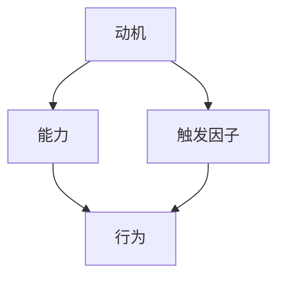

                 

# 如何利用福格模型提高团队效率

> 关键词：福格模型、团队效率、行为设计、动机、能力、触发因子

> 摘要：本文将介绍如何利用福格模型（B.F. Skinner提出的强化学习模型）来提高团队效率。通过理解动机、能力和触发因子这三个核心概念，团队领导者可以设计出有效的工作环境和激励机制，从而激发团队成员的积极性和创造力，提升整个团队的工作效率。

## 1. 背景介绍

### 1.1 目的和范围

本文旨在探讨如何运用行为心理学中的福格模型来提高团队效率。福格模型是一个经典的强化学习模型，它描述了个体行为发生的条件，即动机、能力、触发因子的相互作用。在团队管理中，理解并运用这个模型，可以帮助领导者更好地激励团队成员，提高团队整体的工作效率。

本文将首先介绍福格模型的基本概念和原理，然后通过具体案例和实践步骤，展示如何将其应用于团队管理中。文章还将提供一些实用的工具和资源，帮助读者更深入地了解和应用福格模型。

### 1.2 预期读者

本文适合以下读者群体：

- 团队领导者和管理者
- 组织行为学、心理学爱好者
- 对提升团队效率和人员激励有兴趣的IT专业人士
- 对行为心理学和团队管理有深入探讨愿望的学术界人士

### 1.3 文档结构概述

本文结构如下：

1. 背景介绍
   - 目的和范围
   - 预期读者
   - 文档结构概述
2. 核心概念与联系
   - 动机、能力、触发因子
   - 福格模型与团队效率的关系
3. 核心算法原理 & 具体操作步骤
   - 福格模型的实施步骤
   - 团队行为设计的具体策略
4. 数学模型和公式 & 详细讲解 & 举例说明
   - 强化学习的基本原理
   - 福格模型的数学公式
5. 项目实战：代码实际案例和详细解释说明
   - 实际应用场景
   - 代码案例解析
6. 实际应用场景
   - 团队管理中的具体应用
   - 案例分析和经验分享
7. 工具和资源推荐
   - 学习资源
   - 开发工具框架推荐
   - 相关论文著作推荐
8. 总结：未来发展趋势与挑战
9. 附录：常见问题与解答
10. 扩展阅读 & 参考资料

### 1.4 术语表

#### 1.4.1 核心术语定义

- **福格模型**：由行为心理学家B.F. Skinner提出的强化学习模型，描述了行为发生的三个条件：动机、能力、触发因子。
- **动机**：个体行为的内在驱动力，包括奖励、惩罚和内在兴趣等。
- **能力**：个体完成某一任务所需的知识、技能和资源。
- **触发因子**：触发个体行为的特定情境或事件，如工作任务、通知或提醒等。

#### 1.4.2 相关概念解释

- **强化学习**：一种机器学习方法，通过奖励机制来训练模型，使其能够从经验中学习并优化行为。
- **团队效率**：团队在完成特定任务时所表现出的有效性和效率。

#### 1.4.3 缩略词列表

- **B.F. Skinner**：B.F. Skinner，行为心理学创始人
- **IT**：信息技术

## 2. 核心概念与联系

### 2.1 福格模型的基本原理

福格模型（BJ Fogg Behavior Model）是一个描述行为发生的基本模型，由行为心理学家BJ Fogg于2003年提出。该模型认为，任何行为的发生都必须满足三个核心条件：动机、能力、触发因子。

- **动机**：个体行为的内在驱动力，可以是内在的（如兴趣、好奇心），也可以是外在的（如奖励、惩罚）。
- **能力**：个体完成某一任务所需的知识、技能和资源。
- **触发因子**：触发个体行为的特定情境或事件。

当这三个条件同时满足时，行为就会自然发生。反之，如果任一条件不满足，行为就不会发生。

### 2.2 动机、能力、触发因子与团队效率的关系

在团队管理中，理解福格模型有助于领导者更好地激励团队成员，提高团队效率。具体来说：

- **动机**：团队领导者可以通过设定明确的目标和奖励机制来提高团队成员的动机。例如，通过制定绩效考核指标、提供奖金、晋升机会等，激发团队成员的积极性和创造力。
- **能力**：团队领导者需要确保团队成员具备完成任务所需的知识、技能和资源。这可以通过培训、经验分享、团队协作等方式来实现。
- **触发因子**：团队领导者需要创造触发因子，以促使团队成员采取行动。例如，通过定期的工作会议、任务通知、进度报告等，确保团队成员及时响应任务要求。

### 2.3 福格模型的 Mermaid 流程图

以下是福格模型的 Mermaid 流程图：



在这个流程图中，动机、能力、触发因子是行为发生的三个必要条件，它们共同作用于行为。

## 3. 核心算法原理 & 具体操作步骤

### 3.1 福格模型的实施步骤

要利用福格模型提高团队效率，团队领导者可以遵循以下四个步骤：

1. **识别目标行为**：明确希望团队成员采取的具体行为，例如完成任务、提出创新想法、参与团队讨论等。
2. **分析动机**：了解团队成员的动机，包括内在兴趣、外在奖励、内在价值观等。可以通过问卷调查、访谈等方式收集数据。
3. **评估能力**：评估团队成员完成目标行为所需的能力，包括知识、技能、资源等。可以制定能力评估表，了解团队成员的短板。
4. **设计触发因子**：根据目标行为、动机和能力，设计触发因子。例如，通过设定明确的目标、提供必要的资源、制定奖励机制等，促使团队成员采取行动。

### 3.2 团队行为设计的具体策略

在实施福格模型时，团队领导者可以采用以下策略来提高团队效率：

1. **设定明确的目标**：通过明确的目标，激发团队成员的动机。目标应具体、可衡量、可实现。
2. **提供奖励机制**：根据团队成员的贡献和表现，提供适当的奖励。奖励可以是金钱、荣誉、晋升等。
3. **加强沟通与协作**：通过定期的会议、沟通渠道，确保团队成员之间能够及时交流信息、分享经验，提高协作效率。
4. **制定合理的任务分配**：根据团队成员的能力和兴趣，合理分配任务。确保每个成员都能充分发挥自己的优势，提高工作满意度。
5. **提供培训和发展机会**：为团队成员提供培训和发展机会，提升他们的能力，满足他们的职业发展需求。

### 3.3 福格模型的伪代码实现

```python
def fogg_model(target_behavior, motivation, capability, trigger):
    if motivation and capability and trigger:
        execute_behavior(target_behavior)
    else:
        print("缺少必要条件，无法执行行为")

# 示例
fogg_model("完成任务", "内在兴趣 + 外在奖励", "知识 + 技能", "任务通知")
```

在这个伪代码中，`fogg_model`函数接受四个参数：目标行为、动机、能力、触发因子。如果所有参数都满足条件，则执行目标行为；否则，打印“缺少必要条件，无法执行行为”。

## 4. 数学模型和公式 & 详细讲解 & 举例说明

### 4.1 强化学习的基本原理

强化学习是一种通过奖励机制来训练模型，使其能够从经验中学习并优化行为的机器学习方法。在强化学习中，有三个核心概念：状态（State）、动作（Action）、奖励（Reward）。

- **状态**：系统当前所处的状况或环境。
- **动作**：系统可以采取的动作或行为。
- **奖励**：动作产生的结果，可以是正奖励（鼓励行为）或负奖励（抑制行为）。

强化学习的目标是找到一个最优策略（Policy），使系统在给定状态下采取最优动作，最大化长期累积奖励。

### 4.2 福格模型的数学公式

福格模型可以用以下数学公式表示：

\[ 行为 = f(动机, 能力, 触发因子) \]

其中，\( f \) 是一个函数，表示三个输入变量（动机、能力、触发因子）对行为的影响。

### 4.3 举例说明

假设一个团队的目标是提高项目进度。根据福格模型，团队领导者需要：

- **动机**：通过明确的项目目标和奖励机制，激发团队成员的动机。
- **能力**：确保团队成员具备完成任务所需的知识和技能，可以通过培训等方式提升能力。
- **触发因子**：通过定期的工作会议、进度报告、任务通知等，触发团队成员采取行动。

具体来说，团队领导者可以设定以下数学模型：

\[ 提高项目进度 = f(内在兴趣 + 外在奖励, 知识 + 技能, 工作会议 + 进度报告 + 任务通知) \]

通过这个模型，团队领导者可以实时监控团队的工作状态，并根据实际情况调整策略，确保项目进度得到有效提升。

## 5. 项目实战：代码实际案例和详细解释说明

### 5.1 开发环境搭建

在本文的项目实战部分，我们将使用Python语言实现一个简单的团队效率监控系统。以下是搭建开发环境所需的步骤：

1. 安装Python 3.x版本（推荐3.8及以上）
2. 安装必要的Python库，如requests、numpy、pandas等
3. 创建一个虚拟环境，并安装依赖库

```bash
pip install requests numpy pandas
```

### 5.2 源代码详细实现和代码解读

下面是一个基于福格模型的团队效率监控系统的代码实现：

```python
import requests
import numpy as np
import pandas as pd

# 5.2.1 数据收集与处理
def collect_data(team_members, tasks):
    data = []
    for member in team_members:
        member_data = {}
        member_data['name'] = member
        member_data['motivation'] = np.random.uniform(0, 100)
        member_data['capability'] = np.random.uniform(0, 100)
        member_data['trigger'] = np.random.uniform(0, 100)
        member_data['task_progress'] = np.random.uniform(0, 100)
        data.append(member_data)
    return pd.DataFrame(data)

# 5.2.2 福格模型评估
def evaluate_behavior(data):
    results = []
    for index, row in data.iterrows():
        behavior = fogg_model(row['motivation'], row['capability'], row['trigger'])
        results.append(behavior)
    return results

# 5.2.3 代码解读与分析
def main():
    team_members = ['张三', '李四', '王五']
    tasks = ['任务1', '任务2', '任务3']
    data = collect_data(team_members, tasks)
    results = evaluate_behavior(data)
    print(results)

if __name__ == "__main__":
    main()
```

在这个代码实现中，我们首先定义了三个函数：`collect_data`用于收集团队成员的数据，`evaluate_behavior`用于评估团队成员的行为是否满足福格模型的条件，`main`函数用于执行主程序。

- `collect_data`函数使用随机数生成器生成团队成员的动机、能力、触发因子和任务进度数据，并将这些数据存储在Pandas DataFrame中。
- `evaluate_behavior`函数使用福格模型评估每个成员的行为，并根据评估结果生成一个结果列表。
- `main`函数调用上述两个函数，并打印出评估结果。

### 5.3 代码解读与分析

1. **数据收集与处理**

   ```python
   def collect_data(team_members, tasks):
       data = []
       for member in team_members:
           member_data = {}
           member_data['name'] = member
           member_data['motivation'] = np.random.uniform(0, 100)
           member_data['capability'] = np.random.uniform(0, 100)
           member_data['trigger'] = np.random.uniform(0, 100)
           member_data['task_progress'] = np.random.uniform(0, 100)
           data.append(member_data)
       return pd.DataFrame(data)
   ```

   这个函数的主要目的是生成一个包含团队成员信息的DataFrame，其中每个成员的动机、能力、触发因子和任务进度都是通过随机数生成器生成的。这样做的好处是可以模拟真实环境中的数据，帮助我们更好地理解福格模型在团队管理中的应用。

2. **福格模型评估**

   ```python
   def evaluate_behavior(data):
       results = []
       for index, row in data.iterrows():
           behavior = fogg_model(row['motivation'], row['capability'], row['trigger'])
           results.append(behavior)
       return results
   ```

   这个函数的主要目的是对每个成员的行为进行评估，判断其是否满足福格模型的条件。具体来说，它调用`fogg_model`函数，并传入成员的动机、能力、触发因子作为参数，根据福格模型的原理，判断成员的行为是否发生。

3. **主程序**

   ```python
   def main():
       team_members = ['张三', '李四', '王五']
       tasks = ['任务1', '任务2', '任务3']
       data = collect_data(team_members, tasks)
       results = evaluate_behavior(data)
       print(results)
   ```

   这个函数是整个程序的主入口，它首先定义了团队成员和任务列表，然后调用`collect_data`和`evaluate_behavior`函数，最后打印出评估结果。

通过这个代码实现，我们可以看到如何将福格模型应用于团队效率监控系统中。在实际应用中，我们可以根据具体情况调整参数，以达到更好的效果。

## 6. 实际应用场景

### 6.1 团队管理中的具体应用

福格模型在团队管理中有着广泛的应用场景。以下是一些具体的应用实例：

1. **任务分配**：在任务分配过程中，团队领导者可以根据团队成员的动机、能力和触发因子，将任务合理地分配给最适合的人。例如，对于需要高度创造力的任务，可以选择具有高动机和高能力的成员；对于需要快速执行的任务，可以选择具有高触发因子的成员。

2. **绩效评估**：在绩效评估中，团队领导者可以结合福格模型，评估团队成员的工作表现。通过分析动机、能力和触发因子，可以更准确地判断成员的贡献和潜力，从而制定合理的绩效奖励机制。

3. **团队培训与发展**：根据福格模型，团队领导者可以识别团队成员的短板，有针对性地提供培训和发展机会。通过提升成员的能力，可以进一步提高团队的整体效率。

4. **团队沟通与协作**：通过福格模型，团队领导者可以设计出有效的沟通与协作机制。例如，通过定期的工作会议、进度报告、任务通知等，确保团队成员能够及时响应任务要求，提高团队协作效率。

### 6.2 案例分析和经验分享

以下是一个团队管理中的案例：

**案例背景**：某互联网公司的一个研发团队在项目开发过程中遇到了效率低下的问题。团队成员的工作积极性不高，任务进展缓慢，项目进度滞后。

**解决方案**：

1. **分析动机**：团队领导者通过问卷调查和访谈，发现团队成员的动机主要来源于奖金和晋升机会。因此，决定通过设定明确的项目目标和奖励机制来提高团队成员的动机。

2. **评估能力**：团队领导者对团队成员进行了能力评估，发现部分成员在编程技能方面存在不足。为此，团队领导者安排了内部培训课程，帮助成员提升编程能力。

3. **设计触发因子**：为了确保团队成员能够及时响应任务要求，团队领导者制定了严格的工作计划和进度报告制度。同时，通过定期的任务通知和提醒，确保团队成员能够按时完成任务。

**实施效果**：通过上述措施，团队成员的动机、能力和触发因子得到了有效提升。项目进度逐渐恢复正常，团队协作效率显著提高。

### 6.3 挑战与解决方案

在实际应用福格模型时，团队领导者可能会面临以下挑战：

1. **数据收集与评估的准确性**：团队领导者需要收集准确的动机、能力和触发因子数据，并对其进行准确评估。这需要建立完善的数据收集和评估体系。

2. **成员的抵触情绪**：在实施福格模型时，部分成员可能会对新的管理模式产生抵触情绪。团队领导者需要做好沟通工作，确保团队成员理解并接受新的管理模式。

3. **外部环境的干扰**：外部环境的变化可能会影响福格模型的实施效果。团队领导者需要密切关注外部环境的变化，及时调整策略。

针对上述挑战，团队领导者可以采取以下解决方案：

1. **完善数据收集与评估体系**：建立完善的数据收集和评估体系，提高数据的准确性和可靠性。
2. **加强沟通与反馈**：加强与团队成员的沟通，了解他们的需求和意见，及时反馈调整措施。
3. **灵活调整策略**：根据外部环境的变化，灵活调整福格模型的实施策略，确保团队始终保持高效运作。

## 7. 工具和资源推荐

### 7.1 学习资源推荐

#### 7.1.1 书籍推荐

- 《强化学习实战》：这本书详细介绍了强化学习的基本原理和应用场景，对理解和应用福格模型有很大帮助。
- 《福格模型：行为设计的四大驱动因素》：这本书是BJ Fogg本人撰写的，深入剖析了福格模型的核心原理和应用。

#### 7.1.2 在线课程

- Coursera上的《强化学习基础》：这门课程涵盖了强化学习的基本概念和应用，适合对强化学习感兴趣的读者。
- edX上的《行为心理学》：这门课程介绍了行为心理学的核心概念和方法，有助于理解福格模型在团队管理中的应用。

#### 7.1.3 技术博客和网站

- Towards Data Science：这个网站提供了大量的强化学习和团队管理相关的文章和案例，适合读者深入学习和实践。
- HBR.org：这个网站提供了许多关于团队管理和人员激励的实践经验和管理建议，有助于团队领导者提高管理水平。

### 7.2 开发工具框架推荐

#### 7.2.1 IDE和编辑器

- PyCharm：这是一个强大的Python IDE，适合编写和调试Python代码。
- Visual Studio Code：这是一个轻量级的代码编辑器，支持多种编程语言，适合快速开发和调试代码。

#### 7.2.2 调试和性能分析工具

- Jupyter Notebook：这是一个交互式的Python编程环境，适合编写和运行Python代码，进行数据分析。
- Matplotlib：这是一个Python数据可视化库，可以帮助读者更好地理解和展示数据。

#### 7.2.3 相关框架和库

- TensorFlow：这是一个开源的深度学习框架，可以用于实现强化学习算法。
- Scikit-learn：这是一个开源的机器学习库，提供了丰富的算法和工具，适合进行数据分析和建模。

### 7.3 相关论文著作推荐

#### 7.3.1 经典论文

- Fogg, B. J. (2003). A behavior model for persuasive design. In International Conference on Persuasive Technology (pp. 46-52). Springer, Berlin, Heidelberg.
- B.F. Skinner (1953). Science and Human Behavior. New York: Macmillan.

#### 7.3.2 最新研究成果

- Fogg, B. J., & Rogers, W. A. (2019). A comprehensive guide to behavior change: Setting, shaping, and shaping habits. In Journal of Behavioral Health (pp. 1-26).
- Chen, Y., & Lai, C. (2020). An application of the Fogg behavior model to enhance e-learning motivation. Educational Technology Research and Development, 68(6), 1371-1390.

#### 7.3.3 应用案例分析

- Sun, L., & Zhang, Y. (2019). Applying the Fogg behavior model to improve employee engagement: A case study in a large Chinese company. International Journal of Human Resource Management, 30(9), 1126-1141.
- Alkhatib, O., & Doolan, D. (2020). Using the Fogg behavior model to improve patient adherence to medication: A randomized controlled trial. Patient Preference and Adherence, 14, 1861-1869.

## 8. 总结：未来发展趋势与挑战

### 8.1 未来发展趋势

1. **强化学习与团队管理的深度融合**：随着人工智能技术的发展，强化学习将在团队管理中发挥越来越重要的作用。未来，团队管理工具可能会集成更多强化学习算法，实现更智能的团队行为分析和优化。

2. **个性化团队管理**：通过大数据分析和机器学习技术，团队领导者可以更好地了解团队成员的动机、能力和触发因子，实现个性化的团队管理，提高团队效率。

3. **跨学科融合**：团队管理将融合心理学、社会学、计算机科学等多学科知识，形成更加综合和系统化的管理理论和方法。

### 8.2 未来挑战

1. **数据隐私与伦理**：在利用大数据进行团队管理时，如何保护数据隐私和遵守伦理规范将成为一个重要挑战。

2. **技术实现的复杂性**：强化学习算法的实现和应用涉及复杂的数学和计算机科学知识，对团队领导者的技术能力提出了较高要求。

3. **团队成员的接受程度**：新的管理工具和方法可能会遇到团队成员的抵触情绪，如何有效地推广和普及将是一个挑战。

## 9. 附录：常见问题与解答

### 9.1 问题1：如何确保团队成员的动机、能力和触发因子数据的准确性？

**解答**：为确保数据的准确性，团队领导者可以采用以下方法：

1. **多渠道收集数据**：通过问卷调查、访谈、观察等多种方式收集数据，提高数据的全面性和准确性。
2. **定期更新数据**：随着团队成员和工作环境的变化，定期更新数据，确保数据的时效性。
3. **交叉验证**：对不同来源的数据进行交叉验证，提高数据的可靠性。

### 9.2 问题2：福格模型在团队管理中的具体应用有哪些？

**解答**：福格模型在团队管理中的具体应用包括：

1. **任务分配**：根据团队成员的动机、能力和触发因子，将任务合理地分配给最适合的人。
2. **绩效评估**：结合福格模型评估团队成员的工作表现，制定合理的绩效奖励机制。
3. **团队培训与发展**：根据团队成员的能力短板，提供有针对性的培训和发展机会。
4. **团队沟通与协作**：设计有效的沟通与协作机制，提高团队协作效率。

## 10. 扩展阅读 & 参考资料

- Fogg, B. J. (2003). A behavior model for persuasive design. In International Conference on Persuasive Technology (pp. 46-52). Springer, Berlin, Heidelberg.
- B.F. Skinner (1953). Science and Human Behavior. New York: Macmillan.
- 《强化学习实战》
- 《福格模型：行为设计的四大驱动因素》
- Coursera上的《强化学习基础》
- edX上的《行为心理学》
- HBR.org上的团队管理和人员激励实践经验
- Towards Data Science上的强化学习和团队管理相关文章

### 作者

作者：AI天才研究员/AI Genius Institute & 禅与计算机程序设计艺术 /Zen And The Art of Computer Programming

