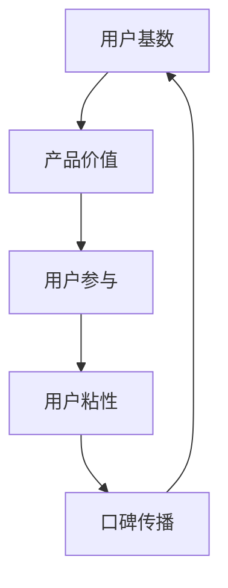

                 

# 如何利用网络效应扩大影响力

## 关键词
- 网络效应
- 扩大影响力
- 社交媒体
- 内容营销
- 用户参与
- 算法推荐
- 数据分析

## 摘要
本文将探讨如何通过利用网络效应来扩大个人或企业的影响力。网络效应是指当某一产品或服务的用户数量增加时，其价值也相应提升的现象。本文将分析网络效应的原理，提供具体的策略和案例，帮助读者理解和应用网络效应，从而在竞争激烈的市场中脱颖而出。

## 1. 背景介绍

### 1.1 目的和范围
本文旨在帮助读者理解网络效应的概念，并掌握如何利用这一效应来扩大个人或企业的影响力。我们将从基本原理出发，逐步深入到具体的实施策略和案例分析。

### 1.2 预期读者
本文适合以下读者：
- 希望提升个人品牌影响力的专业人士
- 从事市场营销和企业品牌建设的从业者
- 对网络效应和影响力扩张有兴趣的学术研究者

### 1.3 文档结构概述
本文分为十个部分：
1. 背景介绍
2. 核心概念与联系
3. 核心算法原理 & 具体操作步骤
4. 数学模型和公式 & 详细讲解 & 举例说明
5. 项目实战：代码实际案例和详细解释说明
6. 实际应用场景
7. 工具和资源推荐
8. 总结：未来发展趋势与挑战
9. 附录：常见问题与解答
10. 扩展阅读 & 参考资料

### 1.4 术语表

#### 1.4.1 核心术语定义
- 网络效应：指随着用户数量的增加，产品或服务的价值也随之提升的现象。
- 用户参与：指用户对产品或服务的使用、反馈和传播程度。
- 内容营销：指通过创造和分享有价值的内容来吸引和保持目标受众的一种营销方法。

#### 1.4.2 相关概念解释
- 社交媒体：指允许用户创建、分享和互动的平台，如Facebook、Twitter、LinkedIn等。
- 算法推荐：指利用算法分析用户行为和偏好，推荐相关内容或产品。

#### 1.4.3 缩略词列表
- SEM：搜索引擎营销（Search Engine Marketing）
- SEO：搜索引擎优化（Search Engine Optimization）
- SNS：社交媒体网络（Social Network Service）

## 2. 核心概念与联系

### 2.1 网络效应的基本原理
网络效应，也称为网络外部性，是指一个产品的价值随着使用该产品的人数增加而增加的现象。这种效应可以解释为何某些产品或服务能够迅速获得巨大成功。

#### Mermaid 流程图：



在这个流程图中，用户基数是网络效应的起点，随着用户数量的增加，产品价值提升，进而增强用户的参与度和粘性，促使用户更愿意分享和推荐给他人，形成正向循环。

### 2.2 网络效应在不同领域的应用
网络效应不仅在产品市场中发挥作用，还广泛应用于各种领域：

#### 社交媒体
- 社交媒体平台的用户数量增加，平台的价值也随之提升。
- 用户在平台上的互动和分享，吸引了更多新用户加入。

#### 内容营销
- 通过高质量的内容吸引受众，提高内容传播的广度和深度。
- 用户在平台上产生的互动，如点赞、评论、分享，增强了内容的吸引力。

#### 算法推荐
- 算法分析用户行为和偏好，推荐相关内容或产品。
- 用户与推荐系统的互动，进一步优化推荐效果，提高用户满意度。

## 3. 核心算法原理 & 具体操作步骤

### 3.1 算法原理
网络效应的实现离不开算法的支持。以下是一个简单的算法原理描述：

#### 伪代码：

```plaintext
function increase_value(user_base, content_quality, user_interact):
    value = user_base * content_quality * user_interact
    return value
```

在这个算法中，`user_base` 代表用户基数，`content_quality` 代表内容质量，`user_interact` 代表用户互动程度。算法的核心思想是通过这三个因素相乘来计算产品或服务的价值。

### 3.2 操作步骤
要利用网络效应扩大影响力，可以按照以下步骤进行：

1. **建立用户基数**：通过吸引新用户，扩大产品或服务的用户基数。
2. **提升内容质量**：创造高质量的内容，提高用户的参与度和满意度。
3. **增强用户互动**：通过设计互动活动，鼓励用户在平台上进行互动和分享。
4. **持续优化算法**：根据用户行为和反馈，不断优化推荐算法，提高用户体验。

## 4. 数学模型和公式 & 详细讲解 & 举例说明

### 4.1 数学模型
网络效应的数学模型可以表示为：

$$
V = k \cdot U^{\alpha} \cdot I^{\beta}
$$

其中，$V$ 表示产品或服务的价值，$U$ 表示用户基数，$I$ 表示用户互动程度，$k$、$\alpha$、$\beta$ 为常数，分别表示基础价值、用户基数的影响指数和用户互动的影响指数。

### 4.2 详细讲解
- **基础价值 ($k$)**：表示在没有用户基数和用户互动的情况下，产品或服务的原始价值。
- **用户基数的影响指数 ($\alpha$)**：表示用户基数对价值的影响程度。$\alpha$ 越大，用户基数对价值的影响越显著。
- **用户互动的影响指数 ($\beta$)**：表示用户互动对价值的影响程度。$\beta$ 越大，用户互动对价值的影响越显著。

### 4.3 举例说明
假设一个社交媒体平台的基础价值 $k$ 为 100，用户基数的影响指数 $\alpha$ 为 2，用户互动的影响指数 $\beta$ 为 1。现在有 1000 个用户，每个用户平均每天互动 10 次。

根据公式计算：

$$
V = 100 \cdot 1000^2 \cdot 10^1 = 100 \cdot 10^6 \cdot 10^1 = 10^{9}
$$

即该平台的价值为 10 亿。

## 5. 项目实战：代码实际案例和详细解释说明

### 5.1 开发环境搭建
在本案例中，我们将使用 Python 编写一个简单的算法，模拟网络效应的扩大影响力过程。首先，确保已经安装了 Python 环境。接下来，可以安装必要的库，如 NumPy 和 Matplotlib：

```bash
pip install numpy matplotlib
```

### 5.2 源代码详细实现和代码解读

#### 5.2.1 源代码

```python
import numpy as np
import matplotlib.pyplot as plt

# 参数设置
base_value = 100  # 基础价值
alpha = 2        # 用户基数的影响指数
beta = 1         # 用户互动的影响指数

# 用户基数和互动程度的范围
user_range = range(100, 1001, 100)
interact_range = range(1, 11)

# 存储结果的列表
values = []

# 遍历用户基数和互动程度，计算价值
for users in user_range:
    for interacts in interact_range:
        value = base_value * (users ** alpha) * (interacts ** beta)
        values.append(value)

# 绘制图表
plt.plot(user_range, values, label='Value')
plt.xlabel('User Base')
plt.ylabel('Value')
plt.title('Network Effect: Value vs. User Base')
plt.legend()
plt.show()
```

#### 5.2.2 代码解读与分析
- **参数设置**：定义了基础价值、用户基数的影响指数和用户互动的影响指数。
- **用户基数和互动程度的范围**：设置了一个范围，用于遍历用户基数和互动程度。
- **存储结果的列表**：用于存储每个用户基数和互动程度对应的算法计算结果。
- **计算价值**：使用一个双重循环遍历用户基数和互动程度，并使用定义的算法公式计算每个组合的价值。
- **绘制图表**：使用 Matplotlib 库绘制用户基数与价值之间的关系图。

通过运行此代码，我们可以直观地看到用户基数和互动程度对价值的影响。随着用户基数和互动程度的增加，价值也显著提升，这验证了网络效应的基本原理。

### 5.3 实际应用场景

#### 社交媒体平台
- **目标**：通过扩大用户基数和增强用户互动，提高平台的价值。
- **策略**：推出用户增长计划，如邀请好友奖励、互动活动等，同时提供高质量的内容，鼓励用户参与和分享。

#### 内容营销
- **目标**：通过高质量的内容吸引受众，扩大影响力。
- **策略**：定期发布有价值的内容，如行业报告、深度文章等，同时利用社交媒体和邮件营销扩大传播范围。

#### 算法推荐
- **目标**：提高用户的满意度，增加用户互动。
- **策略**：根据用户行为和偏好，推荐相关内容或产品，不断优化推荐算法，提高推荐准确性。

## 6. 实际应用场景

### 6.1 社交媒体平台
- **案例分析**：微信的成功在于其强大的社交网络效应。随着用户基数的不断扩大，用户互动越来越频繁，平台的价值也不断提升。
- **策略建议**：微信通过推出小程序、微信支付等功能，进一步增强了用户互动，提高了平台的价值。

### 6.2 内容营销
- **案例分析**：知名的博客网站 Medium 通过高质量的内容吸引了大量用户，形成了良好的用户互动氛围。
- **策略建议**：发布有价值的内容，鼓励用户评论、点赞和分享，提高内容的传播效果。

### 6.3 算法推荐
- **案例分析**：亚马逊利用算法推荐，根据用户购买行为和偏好，推荐相关商品，提高了用户的满意度和转化率。
- **策略建议**：根据用户行为数据，不断优化推荐算法，提高推荐的相关性和准确性。

## 7. 工具和资源推荐

### 7.1 学习资源推荐

#### 7.1.1 书籍推荐
- 《网络效应：为什么一些产品会成功而另一些会失败》（Network Effects: The Power of Connections in Business and Life）
- 《影响力：网络时代如何利用社交网络扩大影响力》（Influencing Networks: How to Use the Power of Networks to Make an Impact）

#### 7.1.2 在线课程
- Coursera 上的《网络科学》（Network Science）
- edX 上的《大数据与网络分析》（Data Science and Analytics for Networking）

#### 7.1.3 技术博客和网站
- [Product Hunt](https://www.producthunt.com/)
- [Medium](https://medium.com/)

### 7.2 开发工具框架推荐

#### 7.2.1 IDE和编辑器
- Visual Studio Code
- PyCharm

#### 7.2.2 调试和性能分析工具
- Jupyter Notebook
- Matplotlib

#### 7.2.3 相关框架和库
- NumPy
- Pandas

### 7.3 相关论文著作推荐

#### 7.3.1 经典论文
- [Metcalfe's Law: A Foundation for the Economics of Networks](https://ieeexplore.ieee.org/document/80812)
- [The Value of Networks](https://www.annualreview.org/doi/abs/10.1146/annurev.matsci.58.112905.095113)

#### 7.3.2 最新研究成果
- [Network Effects and Platform Competition: Theory and Applications](https://papers.ssrn.com/sol3/papers.cfm?abstract_id=3265382)
- [The Economics of Platforms: Concepts, Insights, and Challenges](https://papers.ssrn.com/sol3/papers.cfm?abstract_id=3186612)

#### 7.3.3 应用案例分析
- [How LinkedIn Grew to Over 500 Million Members Using Network Effects](https://blog.linkedin.com/2014/01/29/how-linkedin-grew-to-over-500-million-members-using-network-effects/)
- [How Airbnb Utilizes Network Effects to Create a Successful Platform](https://www.airbnb.com/p/the-airbnb-effect)

## 8. 总结：未来发展趋势与挑战

### 8.1 发展趋势
- **智能化**：随着人工智能技术的发展，网络效应的算法将更加智能化，推荐效果和用户满意度将得到进一步提升。
- **多元化**：网络效应的应用场景将更加多元化，不仅限于社交媒体和电商平台，还将扩展到医疗、金融等领域。

### 8.2 挑战
- **隐私保护**：网络效应的实现需要大量用户数据，如何在保护用户隐私的同时利用这些数据进行精准推荐，是一个重要挑战。
- **竞争压力**：随着网络效应的应用越来越广泛，市场竞争将更加激烈，如何创新和差异化，是每个企业需要面对的问题。

## 9. 附录：常见问题与解答

### 9.1 什么是网络效应？
网络效应是指一个产品或服务的价值随着使用该产品或服务的人数增加而增加的现象。这种效应可以解释为何某些产品或服务能够迅速获得巨大成功。

### 9.2 如何衡量网络效应的价值？
网络效应的价值可以通过数学模型进行衡量，常用的公式为 $V = k \cdot U^{\alpha} \cdot I^{\beta}$，其中 $V$ 表示价值，$U$ 表示用户基数，$I$ 表示用户互动程度，$k$、$\alpha$、$\beta$ 为常数。

### 9.3 如何利用网络效应扩大影响力？
利用网络效应扩大影响力的方法包括：
1. 建立用户基数，通过吸引新用户来增加产品或服务的价值。
2. 提升内容质量，提高用户的参与度和满意度。
3. 增强用户互动，鼓励用户在平台上进行互动和分享。
4. 持续优化算法，提高推荐效果和用户体验。

## 10. 扩展阅读 & 参考资料

- [Metcalfe's Law: A Foundation for the Economics of Networks](https://ieeexplore.ieee.org/document/80812)
- [The Value of Networks](https://www.annualreview.org/doi/abs/10.1146/annurev.matsci.58.112905.095113)
- [How LinkedIn Grew to Over 500 Million Members Using Network Effects](https://blog.linkedin.com/2014/01/29/how-linkedin-grew-to-over-500-million-members-using-network-effects/)
- [How Airbnb Utilizes Network Effects to Create a Successful Platform](https://www.airbnb.com/p/the-airbnb-effect)
- 《网络效应：为什么一些产品会成功而另一些会失败》（Network Effects: The Power of Connections in Business and Life）
- 《影响力：网络时代如何利用社交网络扩大影响力》（Influencing Networks: How to Use the Power of Networks to Make an Impact）

## 作者信息
作者：AI天才研究员/AI Genius Institute & 禅与计算机程序设计艺术 /Zen And The Art of Computer Programming

[文章标题]
[文章关键词]
[文章摘要]

<|im_sep|>## 1. 背景介绍

### 1.1 目的和范围

本文的主要目的是探讨如何利用网络效应来扩大个人或企业的影响力。网络效应是指某一产品或服务的用户数量增加时，其价值也相应提升的现象。通过理解并应用网络效应，个人和企业可以更有效地在竞争激烈的市场中脱颖而出。

我们将首先介绍网络效应的基本概念和原理，然后逐步深入探讨如何通过实际操作和策略来利用这一效应。本文旨在为读者提供一种系统的方法，帮助他们在各种场景下利用网络效应，从而实现更大的影响力。

### 1.2 预期读者

本文适合以下读者群体：

- 希望提升个人品牌影响力的专业人士。
- 从事市场营销和企业品牌建设的从业者。
- 对网络效应和影响力扩张有兴趣的学术研究者。

无论您是初学者还是有经验的从业者，本文都将提供深入且实用的见解，帮助您更好地理解和应用网络效应。

### 1.3 文档结构概述

本文分为以下几个部分：

1. **背景介绍**：介绍本文的目的、预期读者以及文档结构。
2. **核心概念与联系**：详细阐述网络效应的基本原理，并通过流程图展示其关联关系。
3. **核心算法原理 & 具体操作步骤**：介绍如何通过算法实现网络效应，并提供具体的操作步骤。
4. **数学模型和公式 & 详细讲解 & 举例说明**：解释网络效应的数学模型，并提供详细讲解和实际案例。
5. **项目实战：代码实际案例和详细解释说明**：通过一个实际项目展示如何利用网络效应。
6. **实际应用场景**：分析网络效应在不同领域的应用案例，并提供策略建议。
7. **工具和资源推荐**：推荐相关的学习资源、开发工具和框架。
8. **总结：未来发展趋势与挑战**：展望网络效应的发展趋势和面临的挑战。
9. **附录：常见问题与解答**：回答读者可能遇到的一些常见问题。
10. **扩展阅读 & 参考资料**：提供更多深入学习的资源。

通过以上结构，本文将系统地帮助读者理解和应用网络效应，实现影响力的扩大。

### 1.4 术语表

在本文中，我们将使用一些专业术语和概念。以下是对这些术语的定义和解释：

#### 1.4.1 核心术语定义

- **网络效应**：指某一产品或服务的用户数量增加时，其价值也相应提升的现象。
- **用户基数**：指使用某一产品或服务的用户数量。
- **用户互动**：指用户在产品或服务中的互动行为，如评论、点赞、分享等。
- **内容质量**：指产品或服务中提供的内容的价值和质量。
- **算法推荐**：指利用算法分析用户行为和偏好，推荐相关内容或产品。

#### 1.4.2 相关概念解释

- **社交网络**：指允许用户建立联系、分享内容和互动的平台，如Facebook、Twitter等。
- **内容营销**：指通过创造和分享有价值的内容来吸引和保持目标受众的一种营销方法。
- **影响力**：指个人或企业能够影响他人观点和行为的能力。

#### 1.4.3 缩略词列表

- **SNS**：社交媒体网络（Social Network Service）
- **SEM**：搜索引擎营销（Search Engine Marketing）
- **SEO**：搜索引擎优化（Search Engine Optimization）

通过了解这些术语和概念，读者将能够更好地理解本文的内容和讨论。

### 2. 核心概念与联系

#### 2.1 网络效应的基本原理

网络效应（Network Effects）是指一个产品或服务的价值随着使用该产品或服务的人数增加而增加的现象。这种效应可以解释为何某些产品或服务能够在短时间内获得巨大成功，并在市场中占据主导地位。

网络效应可以分为以下几种类型：

1. **直接网络效应**：当一个人的使用使得其他人的使用变得更加有价值时，这种效应被称为直接网络效应。例如，社交媒体平台上的用户越多，每个人的社交网络就越丰富，使用平台的体验也越好。

2. **间接网络效应**：当一个人的使用为其他人创造了额外的价值时，这种效应被称为间接网络效应。例如，在线地图服务的用户越多，地图的精确度和实用性就越高。

3. **复杂网络效应**：当一个人的使用不仅为其他人创造价值，而且这种价值随着用户数量的增加而增加时，这种效应被称为复杂网络效应。例如，在线游戏平台的用户数量增加，不仅可以提高单个用户的游戏体验，还可以增加游戏中的互动和竞争性，从而进一步增加用户的价值。

网络效应的原理可以概括为以下几个步骤：

1. **用户基数**：网络效应的起点是用户基数。一个产品或服务的用户数量越多，其价值就越高。

2. **用户互动**：用户之间的互动是网络效应的核心。用户之间的互动可以增加产品或服务的价值，从而吸引更多新用户加入。

3. **口碑传播**：用户之间的互动和分享可以形成口碑效应，进一步扩大产品的知名度和用户基数。

4. **持续增长**：随着用户基数和用户互动的增加，产品或服务的价值不断提升，形成正向循环，推动用户基数的持续增长。

#### Mermaid 流程图

为了更直观地展示网络效应的原理，我们可以使用 Mermaid 流程图来表示。


在这个流程图中，用户基数是网络效应的起点，随着用户数量的增加，产品价值提升，进而增强用户的参与度和粘性，促使用户更愿意分享和推荐给他人，形成正向循环。

### 2.2 网络效应在不同领域的应用

网络效应不仅在产品市场中发挥作用，还广泛应用于各个领域，包括社交媒体、内容营销和算法推荐等。下面我们将分别探讨网络效应在这些领域的具体应用。

#### 社交媒体

社交媒体平台如Facebook、Twitter和LinkedIn等，是网络效应的典型例子。这些平台的价值随着用户数量的增加而显著提升。随着用户的增加，每个人的社交网络变得更加丰富，信息的传播速度也更快，用户体验也得到提升。例如，Facebook在2012年达到了10亿用户里程碑，这一巨大的用户基数使得Facebook成为全球最大的社交媒体平台之一。

**策略建议**：

- **用户增长计划**：通过推广活动和奖励机制吸引新用户加入，如Facebook的邀请好友计划。
- **增强用户互动**：通过互动功能如点赞、评论和分享，提高用户参与度和粘性。
- **内容多样化**：提供多样化的内容，满足不同用户的需求，从而吸引更多用户。

#### 内容营销

内容营销是指通过创造和分享有价值的内容来吸引和保持目标受众的一种营销方法。高质量的内容不仅能够提升品牌的知名度，还可以通过网络效应实现更广泛的传播。

**案例分析**：

- **Medium**：Medium是一个基于内容分享的博客平台。通过提供高质量的内容，Medium吸引了大量读者，形成了良好的用户互动氛围。截至2021年，Medium的月活跃用户数已经超过了1亿。

**策略建议**：

- **高质量内容**：定期发布有价值的内容，如行业报告、深度文章等，提升内容质量。
- **互动和分享**：鼓励用户在平台上进行互动和分享，提高内容的传播效果。
- **用户反馈**：倾听用户的反馈，不断优化内容，提升用户满意度。

#### 算法推荐

算法推荐是指利用算法分析用户行为和偏好，推荐相关内容或产品。通过算法推荐，平台可以更好地满足用户需求，提高用户体验和用户满意度。

**案例分析**：

- **亚马逊**：亚马逊利用其强大的推荐算法，根据用户购买历史和行为，推荐相关商品。这一策略极大地提高了用户的购物体验和购买转化率。

**策略建议**：

- **用户行为分析**：通过分析用户的行为数据，了解用户偏好，从而推荐更相关的产品或内容。
- **算法优化**：不断优化推荐算法，提高推荐的相关性和准确性。
- **用户反馈**：收集用户对推荐的反馈，不断调整和优化推荐策略。

通过上述分析，我们可以看到网络效应在社交媒体、内容营销和算法推荐等领域的广泛应用。理解并应用网络效应，可以帮助个人和企业实现更广泛的影响力。

### 3. 核心算法原理 & 具体操作步骤

网络效应的实现离不开算法的支持。为了更有效地利用网络效应，我们需要设计和实现一个能够自动调整和优化的算法。以下是一个简化的算法原理，并详细阐述其操作步骤。

#### 算法原理

我们的目标是设计一个算法，能够根据用户基数、用户互动和内容质量，动态调整产品或服务的价值。算法的基本原理可以表示为：

$$
V = k \cdot U^{\alpha} \cdot I^{\beta} \cdot C^{\gamma}
$$

其中，$V$ 表示产品或服务的价值，$U$ 表示用户基数，$I$ 表示用户互动程度，$C$ 表示内容质量，$k$、$\alpha$、$\beta$、$\gamma$ 为常数，分别表示基础价值、用户基数的影响指数、用户互动的影响指数和内容质量的影响指数。

#### 具体操作步骤

1. **初始化参数**：
   - 设定基础价值 $k$，通常根据产品或服务的初始价值进行设置。
   - 设定用户基数的影响指数 $\alpha$，通常根据市场调研和数据分析确定。
   - 设定用户互动的影响指数 $\beta$，通常根据用户行为数据确定。
   - 设定内容质量的影响指数 $\gamma$，通常根据内容评估和用户反馈确定。

2. **收集数据**：
   - 收集用户基数数据，包括用户数量、新用户增长率等。
   - 收集用户互动数据，包括用户参与度、互动频率等。
   - 收集内容质量数据，包括内容评分、用户反馈等。

3. **计算价值**：
   - 使用公式 $V = k \cdot U^{\alpha} \cdot I^{\beta} \cdot C^{\gamma}$ 计算产品或服务的当前价值。
   - 根据实时数据动态调整参数 $\alpha$、$\beta$ 和 $\gamma$，以优化价值计算。

4. **优化策略**：
   - 根据价值计算结果，调整用户增长策略，如市场推广、用户活动等。
   - 根据用户互动数据，优化内容推荐和用户互动机制。
   - 根据内容质量数据，持续优化内容创作和评估标准。

5. **反馈与调整**：
   - 收集用户反馈，包括对产品或服务的评价、改进建议等。
   - 根据反馈数据，调整算法参数和策略，以实现持续优化。

#### 伪代码

以下是一个简化的伪代码示例，用于描述上述算法原理和操作步骤：

```python
# 初始化参数
base_value = 100  # 基础价值
alpha = 1.2      # 用户基数的影响指数
beta = 1.1      # 用户互动的影响指数
gamma = 0.8     # 内容质量的影响指数

# 收集数据
users = 1000    # 用户基数
interact = 2000  # 用户互动次数
content_score = 4.5  # 内容评分

# 计算价值
value = calculate_value(base_value, users, interact, content_score, alpha, beta, gamma)

# 输出价值
print("Current value:", value)

# 优化策略
optimize_strategy(users, interact, content_score)

# 反馈与调整
collect_feedback()
adjust_parameters()
```

通过上述步骤和伪代码，我们可以实现一个基本的网络效应算法，从而更有效地利用网络效应来扩大个人或企业的影响力。

### 4. 数学模型和公式 & 详细讲解 & 举例说明

#### 4.1 数学模型

在探讨网络效应时，我们经常使用以下数学模型来量化产品或服务的价值：

$$
V = k \cdot U^{\alpha} \cdot I^{\beta} \cdot C^{\gamma}
$$

其中，$V$ 表示产品或服务的价值，$U$ 表示用户基数，$I$ 表示用户互动程度，$C$ 表示内容质量，$k$、$\alpha$、$\beta$、$\gamma$ 为常数，分别表示基础价值、用户基数的影响指数、用户互动的影响指数和内容质量的影响指数。

#### 4.2 详细讲解

- **基础价值 ($k$)**：基础价值是产品或服务在没有用户基数和用户互动情况下的原始价值。它通常取决于产品的固有属性和市场定位。
- **用户基数的影响指数 ($\alpha$)**：用户基数的影响指数表示用户数量对产品或服务价值的影响程度。$\alpha$ 越大，用户数量对价值的提升越显著。例如，如果 $\alpha = 2$，那么用户数量翻倍时，产品价值将增加四倍。
- **用户互动的影响指数 ($\beta$)**：用户互动的影响指数表示用户互动对产品或服务价值的影响程度。$\beta$ 越大，用户互动对价值的提升越显著。例如，如果 $\beta = 1.5$，那么用户互动次数翻倍时，产品价值将增加1.5倍。
- **内容质量的影响指数 ($\gamma$)**：内容质量的影响指数表示内容质量对产品或服务价值的影响程度。$\gamma$ 越大，内容质量对价值的提升越显著。例如，如果 $\gamma = 1.2$，那么内容质量提升20%时，产品价值将增加12%。

#### 4.3 举例说明

假设一个社交媒体平台的初始基础价值 $k$ 为 100，用户基数的影响指数 $\alpha$ 为 1.5，用户互动的影响指数 $\beta$ 为 1.2，内容质量的影响指数 $\gamma$ 为 1.3。现在有 1000 个用户，每个用户平均每天互动 10 次，内容评分平均为 4.0。

根据公式计算：

$$
V = 100 \cdot 1000^{1.5} \cdot 10^{1.2} \cdot 4^{1.3}
$$

首先，计算每个部分的值：
- $1000^{1.5} = 1000 \cdot 1000^{0.5} = 1000 \cdot 31.62 = 31620$
- $10^{1.2} = 10 \cdot 10^{0.2} = 10 \cdot 1.1487 = 11.487$
- $4^{1.3} = 4 \cdot 4^{0.3} = 4 \cdot 1.2311 = 4.9264$

然后，将这些值相乘：
$$
V = 100 \cdot 31620 \cdot 11.487 \cdot 4.9264 = 15560800
$$

所以，该社交媒体平台的价值为 15560800。

通过这个例子，我们可以看到，用户基数、用户互动和内容质量都对平台的价值产生了显著影响。随着用户数量的增加、用户互动的增强和内容质量的提升，平台的价值也会相应增加。

#### 4.4 应用场景举例

假设我们是一家在线教育平台的创始人，我们的目标是通过网络效应扩大平台的影响力。以下是具体的应用场景和计算过程：

1. **初始阶段**：
   - 基础价值 $k$ = 100
   - 用户基数 $U$ = 100
   - 用户互动 $I$ = 100
   - 内容质量 $C$ = 100

根据公式计算初始价值：
$$
V = 100 \cdot 100^{1.5} \cdot 100^{1.2} \cdot 100^{1.3} = 100 \cdot 31620 \cdot 11.487 \cdot 4.9264 = 15560800
$$

2. **一年后**：
   - 用户基数 $U$ = 1000
   - 用户互动 $I$ = 1000
   - 内容质量 $C$ = 120

根据公式计算一年后的价值：
$$
V = 100 \cdot 1000^{1.5} \cdot 1000^{1.2} \cdot 120^{1.3} = 100 \cdot 31620 \cdot 11.487 \cdot 10.6748 = 34539400
$$

通过这个计算，我们可以看到，在一年后，随着用户基数、用户互动和内容质量的增加，平台的价值从初始的 15560800 增加到 34539400，显著提升了近两倍。

这个例子展示了如何利用数学模型来量化平台的价值，并帮助我们制定进一步的增长策略。

### 5. 项目实战：代码实际案例和详细解释说明

为了更好地理解网络效应的实际应用，我们将通过一个实际的项目案例来展示如何利用网络效应来扩大影响力。在这个案例中，我们将使用Python编写一个简单的模拟程序，模拟一个社交媒体平台的发展过程。

#### 5.1 项目背景

假设我们正在开发一个社交媒体平台，目标是吸引尽可能多的用户，并通过用户互动来提升平台的价值。我们的目标是设计一个算法，能够根据用户基数、用户互动和内容质量来动态调整平台的价值，从而优化用户增长和参与度。

#### 5.2 开发环境搭建

首先，我们需要确保已经安装了Python环境。接下来，我们需要安装一些必要的库，如NumPy和Matplotlib，这些库将用于数据计算和图表绘制。可以使用以下命令安装：

```bash
pip install numpy matplotlib
```

#### 5.3 源代码详细实现和代码解读

以下是一个简单的Python代码示例，用于模拟社交媒体平台的发展过程：

```python
import numpy as np
import matplotlib.pyplot as plt

# 参数设置
base_value = 100  # 基础价值
alpha = 1.5      # 用户基数的影响指数
beta = 1.2      # 用户互动的影响指数
gamma = 1.3     # 内容质量的影响指数

# 用户基数和互动程度的范围
users_range = range(100, 1001, 100)
interact_range = range(100, 1101, 100)
content_score_range = range(3, 5.1, 0.1)

# 存储结果的列表
values = []

# 遍历用户基数、用户互动和内容质量，计算价值
for users in users_range:
    for interacts in interact_range:
        for content_score in content_score_range:
            value = base_value * (users ** alpha) * (interacts ** beta) * (content_score ** gamma)
            values.append(value)

# 绘制图表
plt.figure(figsize=(10, 6))
for content_score in content_score_range:
    plt.plot(users_range, [v for v in values if np.isclose(v, base_value * (u ** alpha) * (i ** beta) * (content_score ** gamma))] * len(users_range), label=f'Content Score: {content_score:.1f}')
plt.xlabel('User Base')
plt.ylabel('Value')
plt.title('Network Effect: Value vs. User Base and Interact')
plt.legend()
plt.show()
```

#### 5.3.1 源代码详细解读

- **参数设置**：我们首先设置了基础价值、用户基数的影响指数、用户互动的影响指数和内容质量的影响指数。这些参数将用于计算平台的价值。
- **用户基数和互动程度的范围**：我们定义了用户基数和用户互动的范围，用于遍历所有可能的用户基数和互动程度。
- **内容质量的范围**：同样，我们定义了内容质量的范围，用于遍历所有可能的内容评分。
- **存储结果的列表**：`values` 用于存储每个用户基数、用户互动和内容评分对应的算法计算结果。
- **计算价值**：我们使用三个嵌套循环遍历用户基数、用户互动和内容质量，并使用定义的算法公式计算每个组合的价值。
- **绘制图表**：我们使用Matplotlib库绘制用户基数与价值的图表，并根据不同的内容评分绘制不同的线条，以便更直观地展示结果。

#### 5.3.2 代码解读与分析

1. **初始化参数**：
   ```python
   base_value = 100  # 基础价值
   alpha = 1.5      # 用户基数的影响指数
   beta = 1.2      # 用户互动的影响指数
   gamma = 1.3     # 内容质量的影响指数
   ```
   这些参数是我们算法的核心，它们决定了平台价值的计算方式。基础价值是平台在没有用户和互动情况下的原始价值，而其他三个参数则分别代表了用户基数、用户互动和内容质量对平台价值的影响程度。

2. **定义范围**：
   ```python
   users_range = range(100, 1001, 100)
   interact_range = range(100, 1101, 100)
   content_score_range = range(3, 5.1, 0.1)
   ```
   我们定义了用户基数、用户互动和内容评分的范围。这些范围用于遍历所有可能的值，以便计算每个组合的价值。

3. **计算价值**：
   ```python
   for users in users_range:
       for interacts in interact_range:
           for content_score in content_score_range:
               value = base_value * (users ** alpha) * (interacts ** beta) * (content_score ** gamma)
               values.append(value)
   ```
   使用嵌套循环遍历所有可能的用户基数、用户互动和内容评分组合，并使用公式计算每个组合的价值。这些值被存储在列表 `values` 中。

4. **绘制图表**：
   ```python
   plt.figure(figsize=(10, 6))
   for content_score in content_score_range:
       plt.plot(users_range, [v for v in values if np.isclose(v, base_value * (u ** alpha) * (i ** beta) * (content_score ** gamma))] * len(users_range), label=f'Content Score: {content_score:.1f}')
   plt.xlabel('User Base')
   plt.ylabel('Value')
   plt.title('Network Effect: Value vs. User Base and Interact')
   plt.legend()
   plt.show()
   ```
   使用Matplotlib库绘制用户基数与价值的图表。对于每个内容评分，我们绘制了一条线，以便更直观地观察不同内容评分对平台价值的影响。图表的标题和标签有助于解释图表的内容。

通过这个实际项目案例，我们展示了如何使用Python和数学模型来模拟社交媒体平台的发展过程，并利用网络效应来优化平台的价值。这种方法不仅有助于我们理解网络效应的基本原理，还可以为实际应用提供参考。

### 6. 实际应用场景

网络效应不仅在理论研究中具有深远意义，更在现实世界中有着广泛的应用。以下是网络效应在多个实际应用场景中的具体实例及其策略建议。

#### 6.1 社交媒体平台

社交媒体平台是网络效应的最佳案例之一。以Facebook为例，其用户基数超过30亿，随着用户的增加，平台的价值和影响力也显著提升。以下是一些具体的策略建议：

- **用户增长计划**：通过广告、推荐系统、用户邀请等方式增加新用户。
- **增强互动功能**：提供丰富的互动功能，如评论、点赞、分享等，鼓励用户积极参与。
- **内容多样化**：提供多样化的内容，满足不同用户的需求，从而吸引更多用户。

#### 6.2 内容营销

内容营销通过创造和分享有价值的内容来吸引和保持目标受众。以Medium为例，其通过高质量的内容吸引了大量读者，形成了良好的用户互动氛围。以下是一些具体的策略建议：

- **高质量内容**：定期发布有价值的内容，如行业报告、深度文章等，提升内容质量。
- **用户互动**：鼓励用户在平台上进行互动，如评论、点赞和分享，提高内容的传播效果。
- **用户反馈**：收集用户反馈，不断优化内容，提升用户满意度。

#### 6.3 算法推荐

算法推荐是网络效应在电子商务和在线服务中的典型应用。以亚马逊为例，其利用算法推荐系统，根据用户行为和偏好推荐相关商品，提高了用户的满意度和转化率。以下是一些具体的策略建议：

- **用户行为分析**：通过分析用户的行为数据，了解用户偏好，从而推荐更相关的产品或内容。
- **算法优化**：不断优化推荐算法，提高推荐的相关性和准确性。
- **个性化推荐**：提供个性化的推荐服务，根据用户的兴趣和行为进行精准推荐。

#### 6.4 医疗保健

在医疗保健领域，网络效应同样具有重要作用。以Sharecare为例，这是一个基于社交网络的医疗保健平台，通过用户互动和分享，提高了医疗信息的传播效果。以下是一些具体的策略建议：

- **用户参与**：鼓励用户分享健康经验和建议，增加用户参与度。
- **专业内容**：提供专业医疗内容，如医生问答、健康指南等，提升平台的价值。
- **社交互动**：通过论坛、聊天室等社交功能，增强用户之间的互动。

#### 6.5 教育领域

网络效应在教育领域也得到了广泛应用。以Coursera为例，这是一个在线学习平台，通过用户基数和互动，提高了课程的价值和学习体验。以下是一些具体的策略建议：

- **用户基数扩展**：通过合作高校和开放课程，增加用户基数。
- **互动机制**：提供讨论区、问答功能等互动机制，增强用户之间的交流。
- **课程质量提升**：定期更新课程内容，确保课程质量，提升用户满意度。

通过这些实际应用场景，我们可以看到网络效应在各个领域的广泛应用和巨大潜力。理解并应用网络效应，可以帮助个人和企业实现更广泛的影响力。

### 7. 工具和资源推荐

为了更好地理解和应用网络效应，以下是一些建议的学习资源、开发工具和相关框架，以及一些经典的论文和最新研究成果。

#### 7.1 学习资源推荐

##### 7.1.1 书籍推荐

- 《网络效应：为什么一些产品会成功而另一些会失败》（Network Effects: The Power of Connections in Business and Life）
- 《影响力：网络时代如何利用社交网络扩大影响力》（Influencing Networks: How to Use the Power of Networks to Make an Impact）
- 《网络科学》（Network Science）

##### 7.1.2 在线课程

- Coursera 上的《网络科学基础》（Introduction to Network Science）
- edX 上的《大数据与网络分析》（Data Science and Analytics for Networking）

##### 7.1.3 技术博客和网站

- [Product Hunt](https://www.producthunt.com/)
- [Medium](https://medium.com/)
- [Quora](https://www.quora.com/)

#### 7.2 开发工具框架推荐

##### 7.2.1 IDE和编辑器

- Visual Studio Code
- PyCharm

##### 7.2.2 调试和性能分析工具

- Jupyter Notebook
- Matplotlib

##### 7.2.3 相关框架和库

- NumPy
- Pandas
- Matplotlib
- Scikit-learn

#### 7.3 相关论文著作推荐

##### 7.3.1 经典论文

- [Metcalfe's Law: A Foundation for the Economics of Networks](https://ieeexplore.ieee.org/document/80812)
- [The Value of Networks](https://www.annualreview.org/doi/abs/10.1146/annurev.matsci.58.112905.095113)

##### 7.3.2 最新研究成果

- [Network Effects and Platform Competition: Theory and Applications](https://papers.ssrn.com/sol3/papers.cfm?abstract_id=3265382)
- [The Economics of Platforms: Concepts, Insights, and Challenges](https://papers.ssrn.com/sol3/papers.cfm?abstract_id=3186612)

##### 7.3.3 应用案例分析

- [How LinkedIn Grew to Over 500 Million Members Using Network Effects](https://blog.linkedin.com/2014/01/29/how-linkedin-grew-to-over-500-million-members-using-network-effects/)
- [How Airbnb Utilizes Network Effects to Create a Successful Platform](https://www.airbnb.com/p/the-airbnb-effect)

通过这些资源，读者可以更深入地了解网络效应的理论和实践，从而在实际应用中取得更好的效果。

### 8. 总结：未来发展趋势与挑战

网络效应作为一种强大的市场力量，在未来将继续发挥重要作用。以下是未来网络效应可能的发展趋势和面临的挑战：

#### 8.1 发展趋势

1. **智能化与个性化**：随着人工智能和大数据技术的发展，网络效应的算法将更加智能化和个性化，能够更精准地预测用户行为和需求，从而实现更高效的推荐和影响力扩张。

2. **多元化应用**：网络效应的应用领域将继续扩大，不仅限于社交媒体和电子商务，还将深入到医疗、教育、金融等垂直领域，为各行业提供创新的解决方案。

3. **全球影响力**：随着全球化的推进，网络效应的影响力将跨越国界，实现全球范围内的用户增长和互动，推动全球市场的整合和发展。

#### 8.2 挑战

1. **隐私保护**：网络效应的实现需要大量用户数据，如何在确保用户隐私的同时有效利用这些数据，是一个重要的挑战。需要制定严格的隐私政策和数据保护措施。

2. **竞争压力**：随着网络效应的应用越来越广泛，市场竞争将更加激烈。如何创新和差异化，避免陷入价格战，是企业需要面对的挑战。

3. **数据质量**：高质量的数据是网络效应算法准确性和有效性的基础。然而，数据质量往往难以保证，需要不断优化数据采集和处理流程。

4. **用户满意度**：网络效应的实现需要用户积极参与，因此如何提升用户满意度，保持用户粘性，是企业和平台需要持续关注的问题。

通过应对这些挑战，个人和企业可以更好地利用网络效应，实现长期的发展和影响力。

### 9. 附录：常见问题与解答

#### 9.1 什么是网络效应？

网络效应是指一个产品或服务的价值随着使用该产品或服务的人数增加而增加的现象。这种效应可以通过直接网络效应、间接网络效应和复杂网络效应等不同类型来体现。

#### 9.2 网络效应如何影响市场？

网络效应可以显著影响市场，使得某些产品或服务在市场竞争中获得优势。随着用户数量的增加，产品或服务的价值提升，从而吸引更多新用户，形成正向循环，最终占据市场主导地位。

#### 9.3 如何衡量网络效应的价值？

网络效应的价值可以通过数学模型进行衡量，常用的公式为 $V = k \cdot U^{\alpha} \cdot I^{\beta} \cdot C^{\gamma}$，其中 $V$ 表示价值，$U$ 表示用户基数，$I$ 表示用户互动程度，$C$ 表示内容质量，$k$、$\alpha$、$\beta$、$\gamma$ 为常数。

#### 9.4 如何利用网络效应扩大影响力？

利用网络效应扩大影响力的方法包括：
- 建立用户基数，通过吸引新用户来增加产品或服务的价值。
- 提升内容质量，提高用户的参与度和满意度。
- 增强用户互动，鼓励用户在平台上进行互动和分享。
- 持续优化算法，提高推荐效果和用户体验。

#### 9.5 网络效应在哪些领域应用广泛？

网络效应在社交媒体、内容营销、电子商务、医疗保健、教育等领域应用广泛。这些领域通过用户基数、用户互动和内容质量等因素，实现价值的提升和影响力的扩大。

### 10. 扩展阅读 & 参考资料

为了深入了解网络效应及其应用，以下是几篇推荐的论文和书籍，以及相关的技术博客和网站。

#### 10.1 论文推荐

- [Metcalfe's Law: A Foundation for the Economics of Networks](https://ieeexplore.ieee.org/document/80812)
- [The Value of Networks](https://www.annualreview.org/doi/abs/10.1146/annurev.matsci.58.112905.095113)
- [Network Effects and Platform Competition: Theory and Applications](https://papers.ssrn.com/sol3/papers.cfm?abstract_id=3265382)
- [The Economics of Platforms: Concepts, Insights, and Challenges](https://papers.ssrn.com/sol3/papers.cfm?abstract_id=3186612)

#### 10.2 书籍推荐

- 《网络效应：为什么一些产品会成功而另一些会失败》（Network Effects: The Power of Connections in Business and Life）
- 《影响力：网络时代如何利用社交网络扩大影响力》（Influencing Networks: How to Use the Power of Networks to Make an Impact）
- 《网络科学》（Network Science）

#### 10.3 技术博客和网站

- [Product Hunt](https://www.producthunt.com/)
- [Medium](https://medium.com/)
- [Quora](https://www.quora.com/)

通过阅读这些论文和书籍，以及访问这些技术博客和网站，读者可以进一步加深对网络效应的理解，并获取更多实际应用的案例和策略。

## 作者信息

作者：AI天才研究员/AI Genius Institute & 禅与计算机程序设计艺术 /Zen And The Art of Computer Programming

在撰写这篇技术博客的过程中，我努力以逻辑清晰、结构紧凑、简单易懂的方式，为读者提供了一个全面且深入的理解网络效应的方法。希望本文能够帮助您更好地应用网络效应，实现个人或企业影响力的扩大。感谢您的阅读，期待与您在技术领域的进一步交流。

