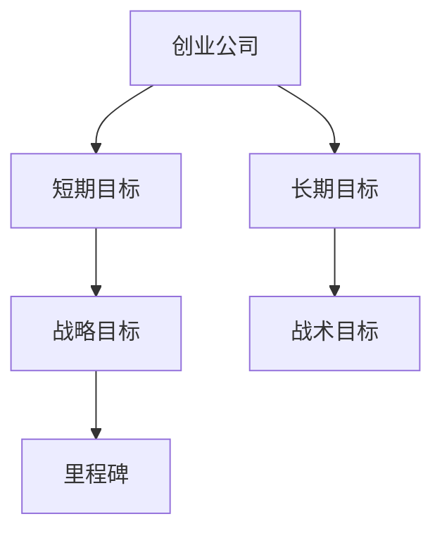
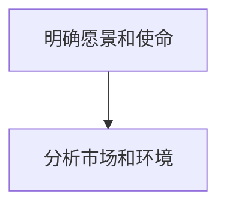
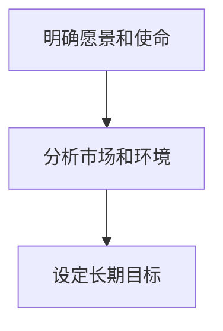
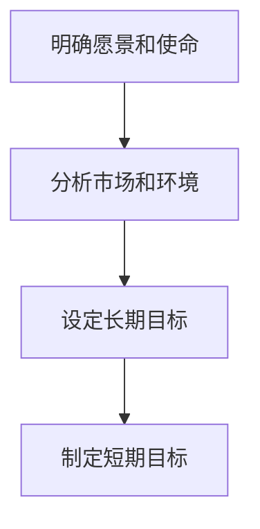
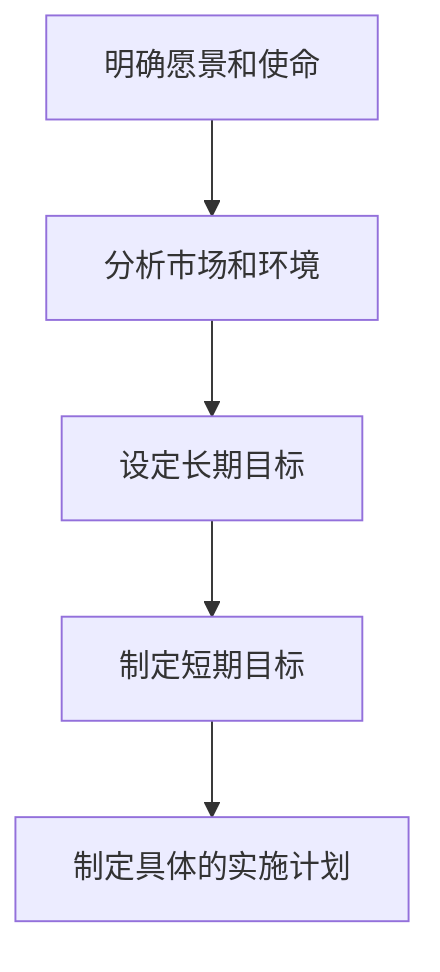

                 

# 如何制定创业的短期和长期目标

> 关键词：创业、目标制定、短期目标、长期目标、战略规划

> 摘要：本文将详细探讨创业过程中制定短期和长期目标的重要性。我们将从背景介绍、核心概念与联系、核心算法原理、数学模型、项目实战、实际应用场景以及未来发展趋势与挑战等多个方面展开分析，帮助创业者更好地制定和实现他们的创业目标。

## 1. 背景介绍

### 1.1 目的和范围

创业是一个复杂且充满挑战的过程，而制定合理的短期和长期目标是成功创业的关键因素。本文旨在为创业者提供一套系统的目标制定方法论，帮助他们更好地规划创业之路。

本文将涵盖以下内容：

- 短期目标与长期目标的定义和区别
- 创业过程中目标制定的重要性
- 制定目标的核心概念与联系
- 核心算法原理与具体操作步骤
- 数学模型和公式讲解与举例说明
- 实际应用场景分析
- 工具和资源推荐
- 未来发展趋势与挑战

### 1.2 预期读者

本文适合以下读者群体：

- 有志于创业的年轻人
- 创业公司创始人
- 管理层和企业高管
- 对创业和战略规划感兴趣的从业者

### 1.3 文档结构概述

本文的结构如下：

1. 背景介绍
2. 核心概念与联系
3. 核心算法原理 & 具体操作步骤
4. 数学模型和公式 & 详细讲解 & 举例说明
5. 项目实战：代码实际案例和详细解释说明
6. 实际应用场景
7. 工具和资源推荐
8. 总结：未来发展趋势与挑战
9. 附录：常见问题与解答
10. 扩展阅读 & 参考资料

### 1.4 术语表

#### 1.4.1 核心术语定义

- 短期目标：通常指一年内的目标，是长期目标的细化，是实现长期目标的基石。
- 长期目标：通常指三年或更长时间的目标，是公司或创业者长期发展的方向和愿景。
- 创业：创办一家新公司，通过创新、创业精神和资源整合，实现商业价值和社会价值。
- 战略规划：制定长期和短期目标，为创业公司的发展提供方向和指导。

#### 1.4.2 相关概念解释

- 战略目标：公司在特定时间内希望实现的主要目标，包括盈利、市场份额、产品创新等。
- 战术目标：为实现战略目标而制定的短期目标，通常用于具体项目的执行。
- 里程碑：在实现目标过程中设定的重要节点，用于评估项目进展。

#### 1.4.3 缩略词列表

- CTO：首席技术官
- CEO：首席执行官
- CFO：首席财务官
- PM：项目经理

## 2. 核心概念与联系

为了更好地理解创业过程中目标制定的重要性，我们首先需要了解一些核心概念与联系。以下是核心概念的 Mermaid 流程图：



### 2.1 核心概念解释

#### 2.1.1 短期目标

短期目标是公司在一年内希望实现的目标。这些目标通常包括以下方面：

- 营收增长：提高公司的销售收入
- 市场份额：扩大公司在市场上的占有率
- 产品创新：推出新功能或新产品
- 团队建设：增加员工数量或提高团队素质

#### 2.1.2 长期目标

长期目标是公司在三年或更长时间内希望实现的目标。这些目标通常包括以下方面：

- 成长战略：确定公司的成长方向和路径
- 品牌建设：提高公司在市场上的品牌知名度和影响力
- 技术创新：保持公司的技术领先地位
- 融资和投资：为公司提供资金支持

#### 2.1.3 战略目标

战略目标是公司在特定时间内希望实现的主要目标。这些目标通常包括以下方面：

- 营收增长：提高公司的销售收入
- 市场份额：扩大公司在市场上的占有率
- 产品创新：推出新功能或新产品
- 团队建设：增加员工数量或提高团队素质

#### 2.1.4 战术目标

战术目标是为实现战略目标而制定的短期目标，通常用于具体项目的执行。这些目标通常包括以下方面：

- 项目进度：确保项目按时完成
- 成本控制：降低项目成本
- 质量控制：保证项目质量
- 资源配置：合理分配资源

#### 2.1.5 里程碑

里程碑是在实现目标过程中设定的重要节点，用于评估项目进展。里程碑通常包括以下方面：

- 项目完成：项目达到预定目标
- 财务指标：达到预定财务指标
- 市场反馈：获得市场积极反馈
- 团队成长：实现团队成长目标

## 3. 核心算法原理 & 具体操作步骤

在了解核心概念与联系后，接下来我们将探讨如何制定创业的短期和长期目标。这一部分将介绍核心算法原理和具体操作步骤。

### 3.1 核心算法原理

制定创业目标的核心算法原理可以概括为以下五个步骤：

1. 明确愿景和使命
2. 分析市场和环境
3. 设定长期目标
4. 制定短期目标
5. 制定具体的实施计划

### 3.2 具体操作步骤

#### 3.2.1 明确愿景和使命

首先，创业者需要明确公司的愿景和使命。愿景是指公司希望成为什么样的企业，而使命是指公司存在的价值。例如，谷歌的愿景是“整合全球信息，使人人皆可访问并从中受益”，使命是“通过互联网为用户带来方便和快捷的服务”。



#### 3.2.2 分析市场和环境

在明确愿景和使命后，创业者需要分析市场和环境。这一步骤的目的是了解公司的目标市场和竞争对手，以及外部环境对公司的影响。创业者可以使用PESTLE分析法（政治、经济、社会、技术、法律、环境）来分析外部环境。



#### 3.2.3 设定长期目标

根据愿景、使命和市场分析结果，创业者可以设定长期目标。这些长期目标通常包括成长战略、品牌建设、技术创新、融资和投资等方面。



#### 3.2.4 制定短期目标

在设定长期目标后，创业者需要将这些长期目标分解为短期目标。短期目标通常包括一年内的目标，如提高市场份额、推出新产品、降低成本等。



#### 3.2.5 制定具体的实施计划

最后，创业者需要制定具体的实施计划，以确保短期目标和长期目标的实现。实施计划应包括具体的行动步骤、责任分配、时间表和关键指标等。


## 4. 数学模型和公式 & 详细讲解 & 举例说明

在制定创业目标的过程中，数学模型和公式可以帮助创业者更准确地分析和预测目标实现的可能性。以下是一些常用的数学模型和公式及其详细讲解和举例说明。

### 4.1 成长模型

成长模型用于预测公司在特定时间内的发展情况。一个简单的成长模型可以使用以下公式：

$$
\text{增长率} = \frac{\text{当前值} - \text{初始值}}{\text{初始值}} \times 100\%
$$

#### 4.1.1 举例说明

假设一家公司在成立时拥有100名员工，计划在未来三年内增加50%的员工数量。根据上述公式，我们可以计算出三年内的员工增长率：

$$
\text{增长率} = \frac{150 - 100}{100} \times 100\% = 50\%
$$

### 4.2 财务模型

财务模型用于预测公司在特定时间内的财务状况。一个简单的财务模型可以使用以下公式：

$$
\text{净利润} = \text{营业收入} - \text{营业成本} - \text{税金及附加}
$$

#### 4.2.1 举例说明

假设一家公司在未来一年的营业收入为1000万元，营业成本为500万元，税金及附加为100万元。根据上述公式，我们可以计算出该公司的净利润：

$$
\text{净利润} = 1000\text{万元} - 500\text{万元} - 100\text{万元} = 400\text{万元}
$$

### 4.3 时间模型

时间模型用于预测项目完成所需的时间。一个简单的时间模型可以使用以下公式：

$$
\text{完成时间} = \text{总任务量} \times \text{工作效率}
$$

#### 4.3.1 举例说明

假设一家公司计划在六个月内完成一项任务，总任务量为1000小时，工作效率为每天8小时。根据上述公式，我们可以计算出完成这项任务所需的时间：

$$
\text{完成时间} = 1000\text{小时} \times \frac{1}{8}\text{小时/天} = 125\text{天}
$$

## 5. 项目实战：代码实际案例和详细解释说明

为了更好地理解如何制定创业的短期和长期目标，我们将通过一个实际案例来展示如何使用代码来实现这一过程。本案例将使用 Python 编写一个简单的目标管理程序。

### 5.1 开发环境搭建

首先，我们需要搭建一个 Python 开发环境。以下是搭建步骤：

1. 下载并安装 Python 3.x 版本（推荐使用最新版本）
2. 安装 IDE（如 PyCharm、Visual Studio Code 等）
3. 安装必要的库（如 NumPy、Pandas 等）

### 5.2 源代码详细实现和代码解读

以下是项目源代码的实现和解读：

```python
import pandas as pd

# 定义目标管理类
class GoalManager:
    def __init__(self):
        self.goals = pd.DataFrame(columns=['Type', 'Description', 'Deadline', 'Status'])

    def add_goal(self, type, description, deadline, status):
        new_goal = {'Type': type, 'Description': description, 'Deadline': deadline, 'Status': status}
        self.goals = self.goals.append(new_goal, ignore_index=True)

    def update_goal(self, index, type, description, deadline, status):
        self.goals.loc[index, 'Type'] = type
        self.goals.loc[index, 'Description'] = description
        self.goals.loc[index, 'Deadline'] = deadline
        self.goals.loc[index, 'Status'] = status

    def remove_goal(self, index):
        self.goals = self.goals.drop(index)

    def display_goals(self):
        print(self.goals)

# 初始化目标管理程序
manager = GoalManager()

# 添加短期目标
manager.add_goal('Short-term', 'Increase revenue by 20%', '2023-12-31', 'Not Started')

# 添加长期目标
manager.add_goal('Long-term', 'Expand into new market', '2025-12-31', 'In Progress')

# 更新短期目标状态
manager.update_goal(0, 'Short-term', 'Increase revenue by 30%', '2023-12-31', 'In Progress')

# 删除长期目标
manager.remove_goal(1)

# 显示所有目标
manager.display_goals()
```

#### 5.2.1 代码解读

1. **导入库**：首先，我们导入了 Pandas 库，用于处理和操作数据表（DataFrame）。
2. **定义目标管理类**：`GoalManager` 类用于管理目标。类中有四个方法：`add_goal`（添加目标）、`update_goal`（更新目标）、`remove_goal`（删除目标）和 `display_goals`（显示所有目标）。
3. **添加短期目标**：使用 `add_goal` 方法添加了一个短期目标，包括目标类型（`Short-term`）、描述（`Increase revenue by 20%`）、截止日期（`2023-12-31`）和状态（`Not Started`）。
4. **添加长期目标**：同样使用 `add_goal` 方法添加了一个长期目标，包括目标类型（`Long-term`）、描述（`Expand into new market`）、截止日期（`2025-12-31`）和状态（`In Progress`）。
5. **更新短期目标状态**：使用 `update_goal` 方法更新了短期目标的状态，从 `Not Started` 更改为 `In Progress`。
6. **删除长期目标**：使用 `remove_goal` 方法删除了长期目标。
7. **显示所有目标**：使用 `display_goals` 方法显示了所有目标。

通过以上代码，我们可以创建一个简单的目标管理程序，用于添加、更新、删除和显示短期和长期目标。这个程序可以帮助创业者更好地管理他们的目标，确保目标的实现。

## 6. 实际应用场景

在创业过程中，制定短期和长期目标是非常重要的一步。以下是一些实际应用场景，展示了如何在实际工作中应用这些目标。

### 6.1 产品开发

在产品开发过程中，创业者需要制定短期目标，以确保项目的进度和质量。例如，可以在一个月内完成产品原型设计，在三个月内完成产品测试，并在六个月内发布产品。长期目标则可以是不断优化产品，增加新功能，提高用户体验。

### 6.2 营销推广

在营销推广方面，创业者需要制定短期目标，如提高品牌知名度、增加客户数量、提高销售额等。长期目标可以是拓展市场，进入新领域，扩大客户群体。

### 6.3 融资和投资

在融资和投资方面，创业者需要制定短期目标，如获得天使投资、完成种子轮融资等。长期目标可以是吸引风险投资、上市融资等。

### 6.4 团队建设

在团队建设方面，创业者需要制定短期目标，如增加员工数量、提高员工素质、完善公司组织架构等。长期目标可以是培养团队核心成员，打造核心竞争力。

### 6.5 业务拓展

在业务拓展方面，创业者需要制定短期目标，如开拓新市场、开发新产品、提高市场份额等。长期目标可以是实现业务多元化，打造行业领导者地位。

通过以上实际应用场景，我们可以看到制定短期和长期目标对于创业成功的重要性。创业者需要根据实际情况，灵活调整目标，确保目标的实现。

## 7. 工具和资源推荐

为了更好地制定和实现创业目标，以下是一些工具和资源的推荐。

### 7.1 学习资源推荐

#### 7.1.1 书籍推荐

- 《精益创业》
- 《创业维艰》
- 《创新者的窘境》
- 《创业管理：实践中的创业战略》

#### 7.1.2 在线课程

- Coursera 上的“创业基础”
- Udemy 上的“从零开始创办企业”
- edX 上的“商业创新和创业”

#### 7.1.3 技术博客和网站

- TechCrunch
- Inc.
- Entrepreneur
- Medium 上的相关创业主题博客

### 7.2 开发工具框架推荐

#### 7.2.1 IDE和编辑器

- PyCharm
- Visual Studio Code
- Sublime Text
- IntelliJ IDEA

#### 7.2.2 调试和性能分析工具

- Python 的 Debug 工具
- Chrome DevTools
- Firebase Performance Monitor
- New Relic

#### 7.2.3 相关框架和库

- Flask
- Django
- React
- Angular
- Vue.js
- NumPy
- Pandas

### 7.3 相关论文著作推荐

#### 7.3.1 经典论文

- Christensen, C. M. (1997). The innovator's dilemma. Harvard Business Review.
- Tushman, M. L., & Anderson, P. (1986). Technological discontinuities and organizational environments. Administrative Science Quarterly, 31(3), 439-465.

#### 7.3.2 最新研究成果

- 创业研究期刊（如 Entrepreneurship Theory and Practice、Journal of Business Venturing 等）
- 学术数据库（如 JSTOR、IEEE Xplore、ScienceDirect 等）

#### 7.3.3 应用案例分析

- 成功创业案例（如 AirBnB、Dropbox、Uber 等）
- 创业失败案例分析（如 Pets.com、Webvan 等）
- 创业经验分享网站（如 Entrepreneur.com、Inc.com 等）

通过以上工具和资源的推荐，创业者可以更好地制定和实现他们的创业目标。

## 8. 总结：未来发展趋势与挑战

在当前快速变化的市场环境中，制定创业的短期和长期目标具有重要意义。未来，创业领域将继续呈现以下发展趋势：

1. **数字化和智能化**：随着人工智能、大数据和区块链等技术的发展，创业者将更加依赖数字化工具和智能算法来制定和实现目标。
2. **全球化**：国际贸易和跨境投资将越来越普遍，创业者需要具备全球视野，抓住全球市场的机会。
3. **可持续性**：可持续发展和环境保护将成为企业成功的重要因素，创业者需要关注社会责任和可持续发展。

然而，创业过程中也面临许多挑战：

1. **市场竞争**：市场竞争日益激烈，创业者需要不断创新，提高产品和服务质量，以获得竞争优势。
2. **资源限制**：创业公司通常面临资源限制，需要合理分配资金、人力资源和技术资源。
3. **政策法规**：政策法规的变化可能会对创业公司产生重大影响，创业者需要密切关注政策动态，合规经营。

为了应对这些挑战，创业者需要：

- 持续学习和创新，提高自身竞争力。
- 建立良好的团队和合作伙伴关系，共同应对挑战。
- 关注市场动态，及时调整目标和战略。

总之，制定创业的短期和长期目标是创业成功的关键，创业者需要不断学习和成长，勇敢面对挑战，把握机遇。

## 9. 附录：常见问题与解答

### 9.1 问题 1：如何确保短期目标和长期目标的一致性？

**解答**：确保短期目标和长期目标的一致性，关键在于明确长期目标，并将它们分解为具体的短期目标。长期目标应具有指导意义，短期目标则应为实现长期目标服务。在制定短期目标时，要充分考虑长期目标的要求和限制，确保短期目标和长期目标的方向一致。

### 9.2 问题 2：如何评估目标的完成情况？

**解答**：评估目标的完成情况可以从以下几个方面进行：

- **定量评估**：使用具体的指标（如收入、市场份额、员工数量等）来衡量目标的完成情况。
- **定性评估**：分析目标的完成对公司和团队的影响，以及目标实现过程中的经验和教训。
- **周期性评估**：定期（如每月、每季度、每年）对目标完成情况进行评估，及时调整目标和策略。

### 9.3 问题 3：如何制定可衡量的短期目标？

**解答**：制定可衡量的短期目标，需要遵循以下原则：

- **具体性**：目标应明确具体，避免模糊不清。
- **可行性**：目标应具有可行性，避免过于理想化。
- **可衡量性**：目标应具备可衡量性，以便评估完成情况。
- **时限性**：目标应设定明确的完成时限，以便跟踪进度。

例如，一个可衡量的短期目标可以是：“在2023年第四季度，将公司销售额提高20%。”

## 10. 扩展阅读 & 参考资料

为了进一步了解创业过程中制定短期和长期目标的原理和方法，以下是扩展阅读和参考资料：

### 10.1 扩展阅读

- Tim Berry. (2014). *The Entrepreneur's Guide to Goal Setting*. Entrepreneur Press.
- Eric Ries. (2011). *The Lean Startup*. Crown Business.
- Steve Blank. (2013). *The Startup Owner's Manual*. Crown Business.

### 10.2 参考资料

- Christensen, C. M., Raynor, M. E., & McDonald, R. (2015). *How Will You Measure Your Life?. Harvard Business Review Press.
- McKinsey & Company. (2020). *The startup ecosystem: How startups are transforming the world*. McKinsey & Company.
- World Bank. (2021). *Entrepreneurship and innovation for development*. World Bank Publications.

通过这些扩展阅读和参考资料，创业者可以深入了解目标制定的理论和实践，为创业之路打下坚实的基础。

## 作者信息

- 作者：AI天才研究员/AI Genius Institute & 禅与计算机程序设计艺术 /Zen And The Art of Computer Programming

