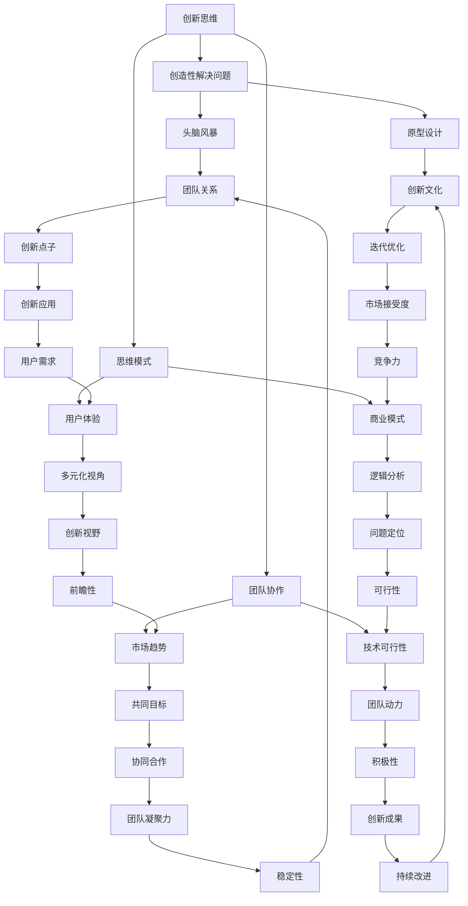

                 

# 如何培养团队的创新思维

> 关键词：创新思维，团队培养，协作，创造性解决问题，思维模式，团队建设，领导力，激励机制，创新方法论

> 摘要：本文将探讨如何有效培养团队的创新思维，从背景介绍、核心概念、算法原理、数学模型、项目实战、实际应用场景等多个方面进行分析和阐述。通过系统性的策略和具体的操作步骤，旨在帮助团队领导者和管理者激发团队成员的创新潜能，提升团队的创造力和竞争力。

## 1. 背景介绍

### 1.1 目的和范围

本文旨在为团队领导者提供一套系统性、可操作的策略和步骤，以培养团队的创新思维。文章将围绕以下几个方面展开讨论：

- 团队创新思维的内涵和重要性
- 创新思维的培养策略和方法
- 团队协作与沟通在创新思维培养中的作用
- 实际应用场景下的创新思维实践
- 未来创新思维培养的发展趋势与挑战

### 1.2 预期读者

本文的预期读者包括：

- 团队领导者和管理者
- 创新项目负责人
- 人力资源管理者
- 技术团队负责人
- 对创新思维培养感兴趣的读者

### 1.3 文档结构概述

本文结构如下：

- **第1章：背景介绍**：介绍文章的目的、范围、预期读者以及文档结构。
- **第2章：核心概念与联系**：阐述创新思维的核心概念，并给出相关流程图。
- **第3章：核心算法原理与具体操作步骤**：详细讲解创新思维的算法原理和操作步骤。
- **第4章：数学模型和公式**：介绍创新思维相关的数学模型和公式，并进行详细讲解和举例说明。
- **第5章：项目实战**：通过实际案例展示创新思维的运用。
- **第6章：实际应用场景**：探讨创新思维在不同领域的应用。
- **第7章：工具和资源推荐**：推荐相关的学习资源和开发工具。
- **第8章：总结**：总结未来发展趋势与挑战。
- **第9章：附录**：常见问题与解答。
- **第10章：扩展阅读**：提供相关的参考文献和资料。

### 1.4 术语表

#### 1.4.1 核心术语定义

- **创新思维**：指能够产生新颖、有价值的想法和解决方案的思维方式。
- **团队协作**：团队成员之间相互配合、协作完成任务的过程。
- **激励机制**：通过奖励和惩罚等手段激发团队成员积极性的措施。
- **思维模式**：个体或团队在解决问题和思考问题时所采用的固定思维路径。

#### 1.4.2 相关概念解释

- **头脑风暴**：一种集体创意思考的方法，鼓励参与者自由表达想法，不论想法是否实际可行。
- **思维导图**：一种通过节点、连接线和文字表达思维过程的图形化工具。
- **原型设计**：通过构建模型来验证和测试创新解决方案的过程。

#### 1.4.3 缩略词列表

- IDE：集成开发环境（Integrated Development Environment）
- latex：LaTeX排版系统（LATEX Typesetting System）
- Mermaid：一种基于Markdown的图形绘制语言（MERMAID Graph Drawing Language）

## 2. 核心概念与联系

创新思维是指个体或团队在面对问题时，能够产生新颖、有价值的想法和解决方案的能力。它是团队在复杂和不确定的环境中应对挑战、实现突破的关键。以下是创新思维相关的核心概念和联系，以及一个简单的Mermaid流程图来展示这些概念之间的关系。



### 2.1 创新思维的核心概念

1. **创造性解决问题**：创新思维的核心在于解决复杂问题时能够产生独特的解决方案。这需要团队具备批判性思维和开放思维，能够在面对挑战时灵活地转换思路，找到创新的解决方案。
2. **团队协作**：创新思维不是个体能力所能实现的，它需要团队成员之间的紧密协作。良好的沟通和反馈机制可以促进团队成员之间的思维碰撞，激发创新火花。
3. **思维模式**：思维模式决定了个体或团队在解决问题时的思考路径。开放思维和批判性思维是培养创新思维的关键，它们可以帮助团队成员跳出固有框架，从不同角度看待问题。

### 2.2 创新思维与相关概念的关联

创新思维与头脑风暴、原型设计、沟通与反馈、激励机制、开放思维、批判性思维等概念密切相关。通过头脑风暴，团队可以快速产生大量创意；通过原型设计，可以验证和优化创新解决方案；通过沟通与反馈，可以确保团队成员之间的思维同步；通过激励机制，可以激发团队成员的积极性。

## 3. 核心算法原理与具体操作步骤

在深入探讨如何培养团队的创新思维之前，我们需要了解一些核心算法原理，这些原理将为我们提供一套系统的方法来引导团队走向创新之路。以下是一个简单的伪代码，用于阐述培养创新思维的基本步骤：

```python
def CultivateInnovationTeam(team_members, project_scope):
    # 初始化团队创新思维培养环境
    initialize_environment()

    # 3.1 确定创新目标
    define_innovation_objectives()

    # 3.2 培养开放思维
    cultivate_open_mind()

    # 3.3 引入头脑风暴方法
    introduce_brainstorming()

    # 3.4 促进跨部门协作
    promote_cross-department Collaboration()

    # 3.5 建立激励机制
    establish_incentive_system()

    # 3.6 实施持续反馈机制
    implement_continuous_feedback()

    # 3.7 提供创新工具和资源
    provide_innovation_tools_and_resources()

    # 3.8 培养批判性思维
    cultivate_critical_thinking()

    # 3.9 开展项目演练
    conduct_project_practices()

    # 3.10 评估和调整
    evaluate_and_adjust()

    # 输出：团队创新思维提升情况
    return team_innovation_improvement_status
```

### 3.1 确定创新目标

在培养团队创新思维的第一步，我们需要明确团队的创新目标。这包括：

- **项目目标**：明确项目需要解决的问题和期望达成的目标。
- **创新目标**：基于项目目标，确定团队需要达成的创新目标，例如提高效率、降低成本、提升用户体验等。

### 3.2 培养开放思维

开放思维是创新思维的基础。以下是培养开放思维的具体步骤：

- **鼓励多样性**：鼓励团队成员提出不同观点和想法，不论这些想法是否与传统观点相符。
- **提供学习机会**：为团队成员提供跨学科、跨领域的培训和学习机会，以拓宽其视野。
- **建立思维模式**：引导团队成员采用多角度思考问题的方法，例如从用户、市场、技术等多个维度分析问题。

### 3.3 引入头脑风暴方法

头脑风暴是一种有效的创新思维工具。以下是实施头脑风暴的具体步骤：

- **明确问题**：明确需要解决的问题或需要达成的目标。
- **准备材料**：准备纸笔、思维导图工具等。
- **自由发言**：让团队成员自由发言，提出各种想法，不论这些想法是否可行。
- **记录和整理**：记录和整理所有提出的想法，并进行分类和筛选。

### 3.4 促进跨部门协作

跨部门协作有助于打破部门壁垒，促进创新思维的产生。以下是促进跨部门协作的具体步骤：

- **建立跨部门团队**：组建由不同部门成员组成的跨部门团队。
- **定期沟通**：定期组织跨部门会议，分享各自部门的进展和挑战。
- **共同目标**：确保跨部门团队的目标一致，以促进协作。

### 3.5 建立激励机制

激励机制可以激发团队成员的创新积极性。以下是建立激励机制的具体步骤：

- **设置奖励**：明确奖励标准，如创新成果、团队绩效等。
- **公开表彰**：对表现优异的团队成员进行公开表彰，以提高其积极性。
- **团队奖励**：对整个团队的创新成果进行奖励，以增强团队凝聚力。

### 3.6 实施持续反馈机制

持续反馈机制有助于团队成员了解自己的创新成果和不足，并进行改进。以下是实施持续反馈机制的具体步骤：

- **定期评估**：定期对团队成员的创新成果进行评估。
- **开放沟通**：鼓励团队成员之间进行开放、坦诚的沟通，分享经验和建议。
- **持续改进**：根据反馈结果，对创新过程和成果进行持续改进。

### 3.7 提供创新工具和资源

为团队成员提供必要的创新工具和资源，有助于提升团队的创新能力和效率。以下是提供创新工具和资源的具体步骤：

- **技术支持**：为团队成员提供技术支持，帮助他们解决在创新过程中遇到的技术难题。
- **学习资源**：提供相关的学习资源，如书籍、在线课程、技术博客等。
- **硬件设备**：为团队成员提供必要的硬件设备，如高性能计算机、原型设计工具等。

### 3.8 培养批判性思维

批判性思维是创新思维的重要组成部分。以下是培养批判性思维的具体步骤：

- **引导质疑**：鼓励团队成员对现有方案进行质疑，并提出改进建议。
- **分析评估**：对提出的想法和方案进行详细分析评估，找出其中的优势和不足。
- **提出替代方案**：鼓励团队成员提出替代方案，以实现更好的创新效果。

### 3.9 开展项目演练

通过实际项目演练，团队成员可以将创新思维应用于实际问题，提升创新能力。以下是开展项目演练的具体步骤：

- **选择项目**：选择具有挑战性和创新性的项目进行演练。
- **组建团队**：组建由不同背景和技能的团队成员组成的项目团队。
- **制定计划**：制定详细的项目计划，明确各阶段的目标和任务。
- **实施演练**：按照计划实施项目，鼓励团队成员积极协作，运用创新思维解决问题。
- **总结经验**：项目结束后，对项目过程和结果进行总结，分享经验和教训。

### 3.10 评估和调整

在创新思维培养过程中，定期评估和调整是确保团队创新效果的关键。以下是评估和调整的具体步骤：

- **评估创新成果**：对团队成员的创新成果进行评估，分析其价值和意义。
- **反馈与改进**：根据评估结果，对创新过程和成果进行反馈和改进。
- **持续跟踪**：对团队成员的创新思维培养效果进行持续跟踪，确保创新能力的不断提升。

通过以上步骤，我们可以有效地培养团队的创新思维，提升团队的创新能力和竞争力。

## 4. 数学模型和公式及详细讲解与举例说明

### 4.1 数学模型

在创新思维的培养过程中，我们可以借助一些数学模型和公式来量化评估团队的创新表现。以下是一个简单的创新思维评价指标体系：

```latex
\begin{aligned}
I &= \frac{E \times (1 + R) + M \times (1 - C)}{T} \\
\end{aligned}
```

其中：

- \( I \)：创新思维评价指标
- \( E \)：创新点子数量
- \( R \)：点子可行性
- \( M \)：市场接受度
- \( C \)：成本效益
- \( T \)：时间因素

### 4.2 公式详细讲解

1. **创新点子数量 \( E \)**

创新点子数量反映了团队的创意生成能力。它可以通过对团队成员提出的创意点子进行计数得到。例如，在一个项目会议上，团队成员提出了10个有价值的创新点子，则 \( E = 10 \)。

2. **点子可行性 \( R \)**

点子可行性反映了提出的创新点子在实际应用中的可行性。它可以通过对点子进行技术、市场、法律等多方面的评估得出。例如，假设10个点子中有7个具有较高的可行性，则 \( R = 0.7 \)。

3. **市场接受度 \( M \)**

市场接受度反映了创新点子在目标市场中的受欢迎程度。它可以通过市场调研、用户反馈等方式评估得出。例如，假设创新点子的市场接受度为0.8，则 \( M = 0.8 \)。

4. **成本效益 \( C \)**

成本效益反映了创新点子的经济价值。它可以通过计算创新点子带来的收益与成本之间的比值得到。例如，假设创新点子的成本为1000元，带来的收益为1500元，则 \( C = \frac{1500}{1000} = 1.5 \)。

5. **时间因素 \( T \)**

时间因素反映了团队在创新过程中所花费的时间。它可以通过对团队完成创新任务的时间进行统计得到。例如，假设团队完成创新任务花费了30天，则 \( T = 30 \)。

### 4.3 举例说明

假设一个团队在一个月的时间内提出了10个创新点子，其中7个具有较高的可行性，市场接受度为0.8，成本效益为1.5，完成创新任务花费了30天。则该团队的创新思维评价指标为：

```latex
I = \frac{10 \times (1 + 0.7) + 0.8 \times (1 - 1.5)}{30} \approx 0.436
```

该评价结果表明，团队在创新思维方面具有一定的表现，但仍有提升空间。团队可以通过进一步优化创新点子的可行性、提升市场接受度和降低成本效益，来提高整体创新思维评价指标。

### 4.4 评价指标调整

在实际应用中，可以根据具体情况对上述评价指标进行调整。例如，可以增加对团队创新氛围、团队协作等方面的评价，以更全面地反映团队的创新思维水平。同时，也可以引入其他数学模型和公式，以更精确地量化评估团队的创新表现。

## 5. 项目实战：代码实际案例和详细解释说明

### 5.1 开发环境搭建

在本节中，我们将以一个简单的项目为例，展示如何在实际环境中培养团队的创新思维。首先，我们需要搭建一个适合创新思维培养的开发环境。

**步骤 1**：选择合适的开发工具和框架

在本项目中，我们选择了Python作为主要编程语言，因为它具有良好的跨平台性、丰富的库支持和易于理解的语法。同时，我们使用了Django框架来构建Web应用，以及Redis作为缓存数据库。

**步骤 2**：搭建开发环境

在开发环境中，我们需要安装Python、Django和相关依赖库。以下是具体的安装命令：

```bash
# 安装Python和pip
wget https://www.python.org/ftp/python/3.9.1/Python-3.9.1.tgz
tar xvf Python-3.9.1.tgz
cd Python-3.9.1
./configure
make
make install

# 安装Django
pip install django

# 安装Redis
pip install redis
```

### 5.2 源代码详细实现和代码解读

**步骤 3**：创建Django项目

使用Django创建一个新的项目，并在项目中创建一个简单的应用。

```bash
# 创建Django项目
django-admin startproject innovation_project

# 进入项目目录
cd innovation_project

# 创建应用
python manage.py startapp innovation_app
```

**步骤 4**：设计数据模型

在设计数据模型时，我们需要考虑到项目的需求和团队的创新能力。以下是`models.py`文件的内容：

```python
from django.db import models

class InnovationPoint(models.Model):
    title = models.CharField(max_length=200)
    description = models.TextField()
    creator = models.ForeignKey('auth.User', on_delete=models.CASCADE)
    created_at = models.DateTimeField(auto_now_add=True)
    feasibility = models.FloatField()
    market_acceptance = models.FloatField()
    cost_efficiency = models.FloatField()

    def __str__(self):
        return self.title
```

**步骤 5**：创建视图和模板

在`views.py`中，我们创建一个视图来处理创新点子的提交和展示。

```python
from django.shortcuts import render
from .models import InnovationPoint
from .forms import InnovationPointForm

def index(request):
    if request.method == 'POST':
        form = InnovationPointForm(request.POST)
        if form.is_valid():
            form.save()
            return render(request, 'innovation_app/index.html', {'form': form})
    else:
        form = InnovationPointForm()
    return render(request, 'innovation_app/index.html', {'form': form})

def list_points(request):
    points = InnovationPoint.objects.all()
    return render(request, 'innovation_app/list_points.html', {'points': points})
```

在`templates/innovation_app/index.html`中，我们创建了一个简单的表单，用于提交创新点子。

```html
<!DOCTYPE html>
<html>
<head>
    <title>Innovation Points</title>
</head>
<body>
    <h1>Submit an Innovation Point</h1>
    <form method="post">
        
        {{ form.as_p }}
        <button type="submit">Submit</button>
    </form>
</body>
</html>
```

在`templates/innovation_app/list_points.html`中，我们展示所有提交的创新点子。

```html
<!DOCTYPE html>
<html>
<head>
    <title>Innovation Points</title>
</head>
<body>
    <h1>Innovation Points</h1>
    <ul>
        
            <li>
                <h2>{{ point.title }}</h2>
                <p>{{ point.description }}</p>
                <p>Feasibility: {{ point.feasibility }}</p>
                <p>Market Acceptance: {{ point.market_acceptance }}</p>
                <p>Cost Efficiency: {{ point.cost_efficiency }}</p>
            </li>
        
    </ul>
</body>
</html>
```

### 5.3 代码解读与分析

**步骤 6**：代码解读

在本项目中，我们使用了Django框架来快速搭建Web应用。以下是项目的核心代码和解读：

- **数据模型（models.py）**：定义了`InnovationPoint`模型，用于存储创新点子的信息，包括标题、描述、创建者、创建时间、可行性、市场接受度和成本效益。
- **视图（views.py）**：提供了两个视图，`index`用于处理创新点子的提交，`list_points`用于展示所有提交的创新点子。
- **表单（forms.py）**：定义了一个表单类`InnovationPointForm`，用于处理创新点子的提交。

**步骤 7**：分析

通过本项目的实际编码，我们可以看到以下几个关键点：

- **数据模型设计**：数据模型的设计需要考虑创新点子的各个方面，包括可行性、市场接受度和成本效益。这有助于后续对创新点子进行量化评估。
- **视图和表单**：视图和表单的设计需要确保用户能够方便地提交创新点子，并能够清晰地展示所有提交的创新点子。
- **数据库操作**：在数据库层面，我们需要确保数据的完整性和一致性。在本项目中，我们使用了Django的ORM（对象关系映射）机制来简化数据库操作。

### 5.4 代码优化

在实际项目中，代码的优化是一个持续的过程。以下是几个可能的优化方向：

- **性能优化**：对数据库查询进行优化，使用索引、缓存等技术提高查询效率。
- **安全性**：确保Web应用的安全性，例如使用HTTPS、验证用户输入等。
- **可扩展性**：在设计应用架构时，考虑到未来的扩展性，例如增加新的功能模块、支持多用户等。

通过以上实战案例，我们可以看到如何在实际项目中运用创新思维，并通过代码实现来培养团队的创新能力。在实际操作过程中，团队领导者和管理者可以不断优化和调整策略，以提升团队的创新思维水平。

## 6. 实际应用场景

创新思维在各个领域都有着广泛的应用，以下是一些具体的应用场景：

### 6.1 科技行业

在科技行业，创新思维的应用尤为重要。例如，在软件开发过程中，团队可以通过头脑风暴和原型设计来快速生成和验证新的功能模块。在人工智能领域，创新思维可以激发研究人员开发出更高效、更准确的算法。此外，通过持续反馈和改进，团队能够不断提升产品性能，满足用户需求。

### 6.2 医疗领域

在医疗领域，创新思维可以用于开发新的治疗方案、医疗设备和健康管理平台。例如，通过大数据分析和机器学习技术，团队能够发现新的疾病趋势，为患者提供个性化的治疗方案。此外，创新思维还可以帮助医疗团队提高医疗服务的质量和效率。

### 6.3 教育行业

在教育行业，创新思维可以帮助教师和学生开发新的教学方法和学习工具。例如，通过虚拟现实（VR）和增强现实（AR）技术，学生可以更加直观地学习复杂的概念。同时，创新思维还可以激发学生的创造力和解决问题的能力，培养未来的创新人才。

### 6.4 金融行业

在金融行业，创新思维可以用于开发新的金融产品和服务，提高客户体验和满意度。例如，通过区块链技术，团队能够创建安全的、透明的金融交易系统。此外，创新思维还可以帮助银行和金融机构优化业务流程，提高运营效率。

### 6.5 咨询服务

在咨询服务领域，创新思维可以帮助团队为客户提供更全面、更具创造性的解决方案。例如，在战略规划过程中，团队可以通过头脑风暴和思维导图工具，快速生成和筛选多个可行方案。通过持续反馈和优化，团队能够为客户提供高质量的服务。

### 6.6 绿色能源

在绿色能源领域，创新思维可以用于开发新的可再生能源技术和解决方案，以减少对环境的影响。例如，通过创新思维，团队能够设计出更高效、更环保的太阳能电池板。此外，创新思维还可以帮助推广绿色能源，提高公众对可再生能源的认识和接受度。

总之，创新思维在各个领域都有着广泛的应用。通过培养团队的创新思维，团队能够在复杂和不确定的环境中应对挑战，实现突破，从而提升竞争力和市场份额。

## 7. 工具和资源推荐

### 7.1 学习资源推荐

**7.1.1 书籍推荐**

1. **《创新者的窘境》** - 克里斯·兰迪
   - 本书详细分析了为什么许多成功的企业无法持续创新，并提供了解决方案。

2. **《创意的根源》** - 丹尼尔·卡尼曼
   - 该书探讨了人类思维和创意的来源，对理解创新思维的本质有很大帮助。

3. **《设计思维》** -蒂姆·布朗
   - 提供了一种基于用户体验的创新方法，适用于各种行业。

**7.1.2 在线课程**

1. **Coursera的《创新思维与设计》** - 斯坦福大学
   - 该课程介绍了创新思维和设计思维的基本原理，适合初学者。

2. **edX的《人工智能与机器学习》** - 密歇根大学
   - 虽然主要是关于AI和机器学习的，但课程中也涉及到创新思维的重要性。

**7.1.3 技术博客和网站**

1. **Medium上的《创新思考》** - 创新思维领域的优秀博客，涵盖多个领域的创新实践。

2. **FastCompany的《创新》** - 提供最新的创新趋势和案例分析，帮助读者了解创新的实际应用。

### 7.2 开发工具框架推荐

**7.2.1 IDE和编辑器**

1. **Visual Studio Code**
   - 适用于多种编程语言，拥有丰富的插件生态。

2. **PyCharm**
   - 专为Python开发设计，支持多种编程语言。

**7.2.2 调试和性能分析工具**

1. **Postman**
   - API调试工具，方便进行接口测试和调试。

2. **JProfiler**
   - Java应用程序的性能分析工具，用于识别和解决性能瓶颈。

**7.2.3 相关框架和库**

1. **Django**
   - Python Web开发框架，适用于快速搭建Web应用。

2. **React**
   - 前端JavaScript库，用于构建用户界面。

### 7.3 相关论文著作推荐

**7.3.1 经典论文**

1. **“The Innovator's Dilemma” by Clayton M. Christensen**
   - 创新者的窘境，分析了企业在创新过程中的挑战。

2. **“Cross-Disciplinary Collaboration and Innovation” by Henry Chesbrough**
   - 探讨了跨学科合作在创新中的作用。

**7.3.2 最新研究成果**

1. **“Design Thinking for Social Innovation” by Tim Brown and Claire Warnier**
   - 设计思维在解决社会问题中的应用。

2. **“Artificial Intelligence and Innovation” by Andrew M. Colman**
   - 探讨人工智能在创新领域的应用前景。

**7.3.3 应用案例分析**

1. **“Innovation in Healthcare: The Case of Google Health” by Farzad Mostashari**
   - 分析了谷歌健康如何通过创新改变医疗行业。

2. **“Innovation in Education: The Case of Khan Academy” by Sal Khan**
   - 探讨了可汗学院如何通过创新改善教育质量。

通过这些工具和资源，团队可以更好地培养和提升创新思维，从而在各自的领域取得更大的成就。

## 8. 总结：未来发展趋势与挑战

随着全球竞争的日益激烈，创新思维成为企业和团队在复杂环境中脱颖而出的关键。未来，创新思维培养将呈现以下发展趋势：

### 8.1 数字化转型的加速

数字化转型已经成为企业发展的主流趋势。在这一背景下，创新思维培养将更加注重如何将数字化技术应用于实际业务，以提升效率和创新能力。例如，人工智能、大数据、区块链等新兴技术将为团队提供更多的创新工具和方法。

### 8.2 交叉学科融合

创新往往来自于不同领域的交叉与融合。未来，团队将更加重视跨学科合作，通过引入不同领域的知识和方法，激发创新的火花。这种交叉学科融合的趋势将推动创新思维培养的深入发展。

### 8.3 个性化培养

每个团队和个体都有其独特的创新潜力，未来创新思维培养将更加注重个性化培养。通过针对团队成员的个性、技能和兴趣进行定制化培训，可以更有效地激发其创新潜能。

### 8.4 持续反馈与改进

持续反馈与改进是创新思维培养的重要环节。未来，团队将更加注重建立完善的反馈机制，通过实时数据分析和用户反馈，不断优化创新过程和成果，确保创新能力的持续提升。

### 8.5 挑战

尽管创新思维培养面临许多机遇，但也存在一些挑战：

- **资源分配**：如何确保创新思维培养获得足够的资源和支持？
- **文化适应**：如何将创新思维融入企业文化和价值观，确保其长期持续？
- **人才选拔**：如何选拔和培养具有创新思维的人才？
- **风险控制**：创新往往伴随着风险，如何平衡创新与风险控制？

面对这些挑战，团队领导者和管理者需要制定切实可行的策略，通过不断学习和实践，提升团队的创新能力，以应对未来的竞争和变革。

## 9. 附录：常见问题与解答

### 9.1 什么是创新思维？

创新思维是指个体或团队在面对问题时，能够产生新颖、有价值的想法和解决方案的能力。它涉及开放思维、批判性思维、跨学科融合等多种思维模式。

### 9.2 创新思维与创造力有何区别？

创新思维和创造力密切相关，但略有不同。创新思维更侧重于如何运用已有的知识和技能产生新的想法和解决方案，而创造力则侧重于产生新颖独特的创意。

### 9.3 如何评估团队的创新能力？

可以通过定量和定性的方法评估团队的创新能力。定量评估包括使用创新思维评价指标体系，如上文提到的 \( I \) 指标；定性评估则包括对团队的创新成果、项目进展和团队氛围进行综合评价。

### 9.4 创新思维培养对团队有哪些益处？

创新思维培养可以提高团队的创造力和竞争力，促进跨部门协作，增强团队凝聚力，并有助于企业在快速变化的市场环境中保持竞争优势。

### 9.5 创新思维培养需要多长时间见效？

创新思维培养的效果因团队而异，通常需要几个月到几年的持续努力和练习。通过不断的实践和优化，团队的创新思维水平将逐步提升。

## 10. 扩展阅读 & 参考资料

### 10.1 书籍

1. **《创新者的窘境》** - 克里斯·兰迪
2. **《创意的根源》** - 丹尼尔·卡尼曼
3. **《设计思维》** - 蒂姆·布朗

### 10.2 在线课程

1. **Coursera的《创新思维与设计》** - 斯坦福大学
2. **edX的《人工智能与机器学习》** - 密歇根大学

### 10.3 技术博客和网站

1. **Medium上的《创新思考》**
2. **FastCompany的《创新》**

### 10.4 论文著作

1. **“The Innovator's Dilemma” by Clayton M. Christensen**
2. **“Cross-Disciplinary Collaboration and Innovation” by Henry Chesbrough**
3. **“Design Thinking for Social Innovation” by Tim Brown and Claire Warnier**

### 10.5 相关研究

1. **“Artificial Intelligence and Innovation” by Andrew M. Colman**
2. **“Innovation in Healthcare: The Case of Google Health” by Farzad Mostashari**
3. **“Innovation in Education: The Case of Khan Academy” by Sal Khan**

通过这些扩展阅读和参考资料，读者可以更深入地了解如何培养团队的创新思维，并在实践中不断改进和提升。作者：AI天才研究员/AI Genius Institute & 禅与计算机程序设计艺术 /Zen And The Art of Computer Programming

