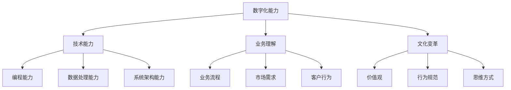

                 

# 如何培养团队的数字化能力

> **关键词：**数字化能力、团队建设、技术能力、业务理解、文化变革

> **摘要：**本文将深入探讨如何培养团队的数字化能力。通过分析数字化时代的背景，明确团队数字化能力的核心要素，阐述培养方法的步骤，并结合实际案例和资源推荐，为企业和团队提供可行的实践路径。

## 1. 背景介绍

### 1.1 目的和范围

在数字化浪潮席卷全球的今天，企业面临的挑战与机遇并存。本文旨在通过系统的分析和策略建议，帮助企业和团队构建和提升数字化能力，以适应快速变化的市场环境和技术趋势。

本文将探讨以下内容：

- 数字化时代的背景和重要性
- 团队数字化能力的核心要素
- 培养团队数字化能力的步骤和方法
- 实际案例分享和资源推荐

### 1.2 预期读者

- 企业决策者：需要了解如何通过提升团队数字化能力来增强企业竞争力的企业高层管理者。
- IT 领导者：希望提升团队技术水平，推动数字化转型的 IT 部门主管。
- 技术团队：希望提高自身数字化能力的软件开发人员、数据分析师等。
- 教育工作者：关注技术人才培养的教育者。

### 1.3 文档结构概述

本文结构如下：

1. **背景介绍**：介绍文章的目的、预期读者和文章结构。
2. **核心概念与联系**：阐述数字化能力的核心概念及其相互关系。
3. **核心算法原理 & 具体操作步骤**：详细讲解培养数字化能力的方法。
4. **数学模型和公式 & 详细讲解 & 举例说明**：使用数学模型和公式来解释培养方法。
5. **项目实战：代码实际案例和详细解释说明**：结合实际项目展示方法的应用。
6. **实际应用场景**：分析数字化能力在不同领域的应用。
7. **工具和资源推荐**：推荐相关学习和开发资源。
8. **总结：未来发展趋势与挑战**：探讨数字化能力的未来趋势和挑战。
9. **附录：常见问题与解答**：回答读者可能遇到的问题。
10. **扩展阅读 & 参考资料**：提供进一步阅读的资源。

### 1.4 术语表

#### 1.4.1 核心术语定义

- **数字化能力**：指团队在数字化环境中有效使用技术和数据的能力。
- **技术能力**：指团队在编程、数据处理、系统架构等方面的技术水平。
- **业务理解**：指团队对业务流程、市场需求和客户行为的深入理解。
- **文化变革**：指团队在价值观、行为规范和思维方式上适应数字化转型的过程。

#### 1.4.2 相关概念解释

- **数字化转型**：企业利用数字技术优化业务流程、运营模式和价值创造的方式。
- **敏捷开发**：一种以人为核心、迭代快速的软件开发方法。
- **数据驱动决策**：基于数据分析的决策过程，而非仅依赖经验和直觉。

#### 1.4.3 缩略词列表

- **AI**：人工智能
- **IoT**：物联网
- **ML**：机器学习
- **DL**：深度学习
- **API**：应用程序接口

## 2. 核心概念与联系

在数字化时代，团队数字化能力的培养不仅仅涉及技术层面的提升，还包括业务理解和文化变革。以下是一个简化的 Mermaid 流程图，展示这些核心概念及其相互关系。



通过上述关系图，我们可以看出数字化能力是一个多维度的综合体，涉及技术、业务和文化三个层面。各个要素之间相互作用，共同决定团队的数字化水平。

### 2.1 数字化能力的核心要素

#### 技术能力

技术能力是团队数字化能力的基础。它包括：

- **编程能力**：熟练掌握至少一门编程语言，如 Java、Python 或 JavaScript。
- **数据处理能力**：能够高效地进行数据清洗、转换和分析。
- **系统架构能力**：理解系统架构的设计原则，能够构建高效、可扩展的系统。

#### 业务理解

业务理解是团队在数字化时代立足的关键。它包括：

- **业务流程**：深入理解业务流程，能够识别并优化流程中的瓶颈。
- **市场需求**：能够分析市场需求，了解目标客户的需求和偏好。
- **客户行为**：通过数据分析，理解客户的购买行为和使用习惯。

#### 文化变革

文化变革是团队适应数字化转型的关键。它包括：

- **价值观**：培养数据驱动和创新的文化，鼓励员工勇于尝试和失败。
- **行为规范**：建立透明、开放和协作的工作环境。
- **思维方式**：鼓励员工具备前瞻性和系统性思维，能够从全局角度看待问题。

## 3. 核心算法原理 & 具体操作步骤

培养团队数字化能力的核心在于方法论的实施。以下是一系列具体操作步骤，包括技术能力提升、业务理解深入和文化变革推进的方法。

### 3.1 技术能力提升

#### 步骤 1：制定技术学习计划

- **目标**：确保团队成员掌握必要的编程语言、数据处理工具和系统架构知识。
- **方法**：
  1. 根据团队成员的技术背景，制定个性化的学习计划。
  2. 引入在线课程、技术书籍和技术博客，提供丰富的学习资源。
  3. 定期组织内部技术分享会，鼓励成员分享学习心得和经验。

#### 步骤 2：实践项目

- **目标**：通过实际项目，提升团队成员的技术应用能力。
- **方法**：
  1. 设计具有挑战性的项目，涵盖不同的技术领域。
  2. 采用敏捷开发方法，实现快速迭代和持续改进。
  3. 定期组织代码审查和项目评审，确保项目质量。

### 3.2 业务理解深入

#### 步骤 1：业务知识培训

- **目标**：确保团队成员对业务流程、市场需求和客户行为有深入理解。
- **方法**：
  1. 定期组织业务知识培训，包括市场分析、客户研究和业务流程优化。
  2. 引入外部专家，提供专业的业务咨询和指导。
  3. 鼓励团队成员参与业务会议和客户访谈，了解业务实际情况。

#### 步骤 2：案例分析

- **目标**：通过案例研究，加深对业务的理解和应用能力。
- **方法**：
  1. 选择行业内的成功案例，分析其业务模式、市场策略和运营流程。
  2. 组织讨论会，让团队成员分享案例学习心得和启示。
  3. 定期撰写案例分析报告，总结经验和教训。

### 3.3 文化变革推进

#### 步骤 1：领导力培养

- **目标**：培养领导者的数据驱动和创新意识，推动文化变革。
- **方法**：
  1. 定期组织领导力培训，引入数据驱动的领导力模型。
  2. 建立反馈机制，鼓励领导者和员工之间的开放沟通。
  3. 设立创新奖项，激励员工勇于尝试和探索。

#### 步骤 2：文化建设

- **目标**：营造一个数据驱动、创新和协作的工作环境。
- **方法**：
  1. 设立创新实验室，鼓励员工进行创新项目。
  2. 组织团队建设活动，增强团队合作和信任。
  3. 建立知识共享平台，鼓励团队成员分享知识和经验。

## 4. 数学模型和公式 & 详细讲解 & 举例说明

在数字化能力的培养过程中，数学模型和公式可以量化评估团队成员的能力和团队的整体表现。以下是一个简化的数学模型，用于评估团队的数字化能力。

### 4.1 数学模型

$$
\text{DigitalCapability} = w_1 \cdot \text{TechnicalSkill} + w_2 \cdot \text{BusinessUnderstanding} + w_3 \cdot \text{CulturalChange}
$$

其中，$w_1, w_2, w_3$ 分别代表技术能力、业务理解和文化变革的权重，$\text{DigitalCapability}$ 表示团队的数字化能力。

### 4.2 详细讲解

- **技术能力（TechnicalSkill）**：衡量团队成员在编程、数据处理和系统架构等方面的技术水平。可以使用以下指标进行评估：
  $$ \text{TechnicalSkill} = s_1 \cdot \text{Programming} + s_2 \cdot \text{DataProcessing} + s_3 \cdot \text{SystemArchitecture} $$
  其中，$s_1, s_2, s_3$ 分别代表编程能力、数据处理能力和系统架构能力的权重。

- **业务理解（BusinessUnderstanding）**：衡量团队成员对业务流程、市场需求和客户行为的理解程度。可以使用以下指标进行评估：
  $$ \text{BusinessUnderstanding} = b_1 \cdot \text{BusinessProcess} + b_2 \cdot \text{MarketRequirement} + b_3 \cdot \text{CustomerBehavior} $$
  其中，$b_1, b_2, b_3$ 分别代表业务流程、市场需求和客户行为的权重。

- **文化变革（CulturalChange）**：衡量团队在价值观、行为规范和思维方式上的变革程度。可以使用以下指标进行评估：
  $$ \text{CulturalChange} = c_1 \cdot \text{Values} + c_2 \cdot \text{Behavior} + c_3 \cdot \text{Mindset} $$
  其中，$c_1, c_2, c_3$ 分别代表价值观、行为规范和思维方式的权重。

### 4.3 举例说明

假设一个团队的技术能力得分为 80 分，业务理解得分为 75 分，文化变革得分为 70 分，权重分别为 $w_1=0.5, w_2=0.3, w_3=0.2$，则该团队的数字化能力计算如下：

$$
\text{DigitalCapability} = 0.5 \cdot 80 + 0.3 \cdot 75 + 0.2 \cdot 70 = 40 + 22.5 + 14 = 76.5
$$

该团队的数字化能力得分为 76.5 分，表明团队在数字化能力的各个方面都有较好的表现，但仍需在业务理解和文化变革方面继续提升。

## 5. 项目实战：代码实际案例和详细解释说明

### 5.1 开发环境搭建

为了更好地展示数字化能力的培养过程，我们选择一个实际项目——构建一个简单的数据分析应用。以下是开发环境搭建的步骤：

1. **安装 Python**：下载并安装 Python 3.8 以上版本。
2. **安装 Jupyter Notebook**：通过 pip 命令安装 Jupyter Notebook。
   ```bash
   pip install notebook
   ```
3. **安装必要的库**：安装 Pandas、NumPy 和 Matplotlib 等数据分析和可视化库。
   ```bash
   pip install pandas numpy matplotlib
   ```

### 5.2 源代码详细实现和代码解读

以下是一个简单的数据分析项目，展示如何使用 Python 进行数据处理和可视化：

```python
import pandas as pd
import numpy as np
import matplotlib.pyplot as plt

# 加载数据集
data = pd.read_csv('sales_data.csv')

# 数据预处理
data['Date'] = pd.to_datetime(data['Date'])
data.set_index('Date', inplace=True)

# 数据清洗
data.dropna(inplace=True)

# 数据分析
sales_by_month = data.groupby(data.index.month).sum()

# 可视化
sales_by_month.plot(figsize=(10, 6))
plt.title('Monthly Sales Trend')
plt.xlabel('Month')
plt.ylabel('Sales')
plt.show()
```

### 5.3 代码解读与分析

1. **数据加载和预处理**：
   - 使用 Pandas 读取 CSV 文件，并将其转换为日期格式。
   - 设置日期为索引，以便进行时间序列分析。
   - 删除缺失值，保证数据完整性。

2. **数据分析**：
   - 使用 `groupby` 方法按月份对销售额进行分组。
   - 使用 `sum` 方法计算每个月的总销售额。

3. **数据可视化**：
   - 使用 Matplotlib 进行绘图，展示销售额随时间的变化趋势。

通过这个实际案例，我们可以看到如何使用 Python 进行数据处理和可视化。这涉及到编程能力、数据处理能力和系统架构能力的综合应用。同时，为了确保项目顺利进行，团队成员需要具备业务理解能力，能够根据业务需求选择合适的数据处理方法和可视化工具。

### 5.4 项目实战总结

通过这个项目，我们展示了如何从零开始搭建开发环境，实现数据分析功能，并对代码进行详细解读。这个过程不仅提高了团队成员的技术能力，还加深了他们对业务流程和数据分析方法的了解。同时，通过实际操作，团队成员能够更好地理解数字化能力的重要性，并在实践中不断成长。

## 6. 实际应用场景

数字化能力的培养不仅在技术团队中至关重要，在各个行业中也有广泛的应用场景。以下是一些具体的实际应用场景：

### 6.1 金融行业

- **风险管理**：利用大数据和人工智能技术，对市场波动和风险进行预测和评估，提高风险管理的准确性。
- **客户服务**：通过自动化和智能化手段，提供高效、个性化的客户服务，提升客户体验。

### 6.2 制造业

- **智能制造**：通过物联网和大数据技术，实现生产线的自动化和智能化，提高生产效率和产品质量。
- **供应链管理**：利用数字化工具优化供应链管理，提高供应链的透明度和效率。

### 6.3 零售行业

- **精准营销**：通过数据分析，了解客户行为和偏好，实现精准营销和个性化推荐。
- **库存管理**：利用数字化手段进行实时库存监控和管理，减少库存成本和损失。

### 6.4 医疗保健

- **远程医疗**：利用物联网和人工智能技术，实现远程医疗诊断和治疗，提高医疗服务覆盖范围和效率。
- **健康数据分析**：通过收集和分析患者的健康数据，提供个性化的健康建议和治疗方案。

在这些实际应用场景中，团队数字化能力的提升能够显著提高业务效率、降低运营成本、提升客户满意度，从而为企业带来竞争优势。

## 7. 工具和资源推荐

### 7.1 学习资源推荐

#### 7.1.1 书籍推荐

- **《深度学习》**：Ian Goodfellow、Yoshua Bengio 和 Aaron Courville 著，系统介绍了深度学习的基本原理和应用。
- **《Python数据分析》**：William H. Press、Saul A. Teukolsky、William T. Vetterling 和 Brian P. Flannery 著，详细讲解了 Python 在数据分析中的应用。
- **《敏捷开发实践指南》**：Jeff Sutherland 著，介绍了敏捷开发的方法和实践。

#### 7.1.2 在线课程

- **Coursera**：提供丰富的计算机科学和数据分析课程，包括《深度学习特辑》和《Python数据分析》等。
- **edX**：哈佛大学和麻省理工学院等名校提供的在线课程，涵盖人工智能、机器学习和数据科学等领域。
- **Udacity**：提供实战项目驱动的课程，如《数据工程师纳米学位》和《深度学习工程师纳米学位》。

#### 7.1.3 技术博客和网站

- **Medium**：有许多优秀的计算机科学和数据分析博客，如《Python Data Science Handbook》和《Deep Learning Papers》等。
- **Towards Data Science**：一个涵盖数据科学、机器学习和深度学习的综合性博客，提供实用的教程和案例。
- **Stack Overflow**：一个问答社区，帮助开发者解决编程和软件开发中的问题。

### 7.2 开发工具框架推荐

#### 7.2.1 IDE和编辑器

- **Visual Studio Code**：一款轻量级但功能强大的开源编辑器，支持多种编程语言和扩展。
- **PyCharm**：专为 Python 开发者设计的 IDE，提供丰富的功能和工具。
- **Jupyter Notebook**：一个交互式的开发环境，适用于数据科学和机器学习项目。

#### 7.2.2 调试和性能分析工具

- **Visual Studio Debugger**：用于调试 Python 代码的强大工具，支持断点、单步执行和调试插件。
- **Py-Spy**：一个高性能的 Python 代码性能分析工具，能够实时监测代码的运行状态和性能瓶颈。
- **Grafana**：一个开源的数据可视化和监控工具，可以与 Prometheus 等监控系统集成。

#### 7.2.3 相关框架和库

- **Pandas**：一个强大的数据分析和操作库，适用于数据处理和分析任务。
- **NumPy**：一个基础的科学计算库，提供多维数组和矩阵操作功能。
- **TensorFlow**：一个开源的机器学习框架，支持深度学习和神经网络应用。
- **Scikit-learn**：一个开源的机器学习库，提供各种常用的机器学习算法和工具。

### 7.3 相关论文著作推荐

#### 7.3.1 经典论文

- **“Deep Learning”**：Ian Goodfellow、Yoshua Bengio 和 Aaron Courville 著，深度学习领域的经典论文。
- **“Learning to Rank for Information Retrieval”**：Chris Burges、Bill Freund 和 Réfael Mannor 著，介绍排序算法在信息检索中的应用。

#### 7.3.2 最新研究成果

- **“Attention Is All You Need”**：Ashish Vaswani、Noam Shazeer、Niki Parmar 等人著，介绍 Transformer 模型在序列模型中的应用。
- **“BERT: Pre-training of Deep Bidirectional Transformers for Language Understanding”**：Jacob Devlin、 Ming-Wei Chang、Kenton Lee 和 Kristina Toutanova 著，介绍 BERT 模型在自然语言处理中的应用。

#### 7.3.3 应用案例分析

- **“Using Machine Learning for Personalized Medicine”**：Michael J. Maciejowski 著，介绍如何使用机器学习在个性化医疗中的应用。
- **“Data-Driven Business Models”**：Michael Martin 著，探讨数据驱动业务模式的设计和应用。

这些资源为团队提供了丰富的知识和技术支持，有助于提升团队成员的数字化能力。

## 8. 总结：未来发展趋势与挑战

在未来，团队的数字化能力将成为企业竞争的核心。随着人工智能、大数据和云计算等技术的不断发展，团队需要不断提升自身的数字化水平，以应对不断变化的业务环境和市场需求。以下是未来发展趋势和面临的挑战：

### 8.1 发展趋势

- **技术融合**：多种技术（如物联网、区块链、增强现实等）将不断融合，为团队提供更丰富的工具和平台。
- **数据驱动决策**：越来越多的企业将采用数据驱动的决策模式，提高决策的准确性和效率。
- **敏捷组织**：敏捷开发和敏捷管理的理念将在更多企业中得到推广，促进团队快速响应市场变化。
- **人才多样性**：团队将更加重视多样性和包容性，吸引和培养不同背景和专业技能的人才。

### 8.2 面临的挑战

- **技术更新速度**：技术更新速度加快，团队需要不断学习新技术，以保持竞争力。
- **数据安全与隐私**：随着数据量的增加，数据安全与隐私问题日益突出，团队需要建立完善的数据安全策略。
- **人才短缺**：具有数字化能力的专业人才仍处于供不应求的状态，企业需要采取有效措施吸引和培养人才。
- **文化变革**：文化变革是一个长期而复杂的过程，团队需要克服内部阻力和惯性，推动文化变革。

### 8.3 建议

- **持续学习**：鼓励团队成员持续学习新技术，建立学习型组织。
- **数据安全**：加强数据安全意识，建立完善的数据安全策略和措施。
- **人才发展**：制定有效的人才培养计划，吸引和培养具有数字化能力的人才。
- **文化塑造**：营造开放、创新和协作的文化氛围，推动文化变革。

通过应对这些发展趋势和挑战，团队可以不断提升自身的数字化能力，为企业创造更大的价值。

## 9. 附录：常见问题与解答

### 9.1 数字化能力是什么？

数字化能力是指团队在数字化环境中有效使用技术和数据的能力，包括技术能力、业务理解和文化变革三个方面。

### 9.2 如何评估团队的数字化能力？

可以通过以下方法评估团队的数字化能力：

- **技术能力评估**：通过技能测试、项目评审和代码审查等方式，评估团队成员的技术水平。
- **业务理解评估**：通过业务知识考试、案例分析讨论和实际业务参与等方式，评估团队成员的业务理解程度。
- **文化变革评估**：通过员工满意度调查、团队合作测试和文化变革评估问卷等方式，评估团队的文化变革情况。

### 9.3 数字化能力培养有哪些关键步骤？

数字化能力培养的关键步骤包括：

- 制定个性化技术学习计划。
- 实践项目，提高技术应用能力。
- 定期进行业务知识培训，加深业务理解。
- 推动文化变革，营造数据驱动和创新的工作环境。

### 9.4 如何提高团队的技术能力？

提高团队的技术能力可以通过以下方式：

- 引入在线课程和书籍，提供丰富的学习资源。
- 定期组织内部技术分享会，鼓励成员分享知识和经验。
- 设计具有挑战性的项目，促进团队成员在实践中提升技术能力。
- 鼓励团队成员参加行业会议和培训，了解最新技术趋势。

## 10. 扩展阅读 & 参考资料

为了进一步了解团队的数字化能力培养，读者可以参考以下书籍、在线课程和技术博客：

### 10.1 书籍推荐

- **《深度学习》**：Ian Goodfellow、Yoshua Bengio 和 Aaron Courville 著，深度学习领域的经典教材。
- **《Python数据分析》**：William H. Press、Saul A. Teukolsky、William T. Vetterling 和 Brian P. Flannery 著，详细讲解 Python 在数据分析中的应用。
- **《敏捷开发实践指南》**：Jeff Sutherland 著，介绍敏捷开发的方法和实践。

### 10.2 在线课程

- **Coursera**：提供《深度学习特辑》和《Python数据分析》等在线课程。
- **edX**：哈佛大学和麻省理工学院等名校提供的在线课程，涵盖人工智能、机器学习和数据科学等领域。
- **Udacity**：提供实战项目驱动的课程，如《数据工程师纳米学位》和《深度学习工程师纳米学位》。

### 10.3 技术博客和网站

- **Medium**：有许多优秀的计算机科学和数据分析博客。
- **Towards Data Science**：一个涵盖数据科学、机器学习和深度学习的综合性博客。
- **Stack Overflow**：一个问答社区，帮助开发者解决编程和软件开发中的问题。

### 10.4 相关论文和著作

- **“Deep Learning”**：Ian Goodfellow、Yoshua Bengio 和 Aaron Courville 著，深度学习领域的经典论文。
- **“Learning to Rank for Information Retrieval”**：Chris Burges、Bill Freund 和 Réfael Mannor 著，介绍排序算法在信息检索中的应用。
- **“Attention Is All You Need”**：Ashish Vaswani、Noam Shazeer、Niki Parmar 等人著，介绍 Transformer 模型在序列模型中的应用。
- **“BERT: Pre-training of Deep Bidirectional Transformers for Language Understanding”**：Jacob Devlin、 Ming-Wei Chang、Kenton Lee 和 Kristina Toutanova 著，介绍 BERT 模型在自然语言处理中的应用。

通过阅读这些书籍、在线课程和技术博客，读者可以进一步了解团队的数字化能力培养方法，提升自身的技术水平和业务理解能力。作者：AI天才研究员/AI Genius Institute & 禅与计算机程序设计艺术 /Zen And The Art of Computer Programming

