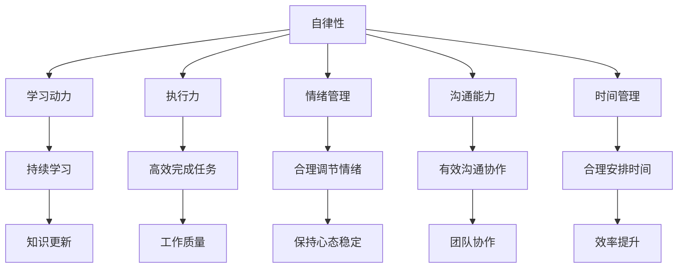

                 

# 如何培养团队的自我管理能力

> 关键词：团队管理、自我管理、能力培养、工作效率、协作精神

> 摘要：本文旨在探讨如何有效地培养团队的自我管理能力，提高团队整体工作效率和协作精神。文章首先介绍了团队管理的重要性，随后分析了自我管理的核心要素，提出了具体的培养策略和实用技巧。通过实例分析和工具推荐，帮助读者更好地理解和实践团队自我管理能力的提升。

## 1. 背景介绍

### 1.1 目的和范围

在现代企业中，团队管理已经成为影响企业竞争力的重要因素之一。有效的团队管理不仅能够提高员工的工作效率，还能促进团队协作，从而推动企业快速发展。自我管理能力则是团队管理的重要组成部分，它关乎个体的自律性、学习能力和创造力。本文旨在通过系统性的分析，为读者提供培养团队自我管理能力的有效策略和方法。

本文的范围包括以下几个方面：

1. **团队管理的背景和重要性**：探讨团队管理在现代企业中的地位和作用。
2. **自我管理的核心要素**：介绍自我管理的定义和关键要素。
3. **培养自我管理能力的策略**：提出具体的培养方法和实践策略。
4. **实际应用和案例分析**：通过真实案例说明自我管理能力的培养和应用。
5. **工具和资源推荐**：推荐有助于提升自我管理能力的学习资源和工具。

### 1.2 预期读者

本文主要面向以下几类读者：

1. **企业管理者**：希望通过本文了解和提升团队管理能力，进而提高企业整体效率。
2. **团队成员**：希望提升自我管理能力，增强个人在团队中的作用和价值。
3. **人力资源管理专业人士**：希望了解如何通过团队管理提升员工绩效和企业竞争力。
4. **对团队管理有兴趣的学习者**：希望通过本文深入了解团队管理的相关理论和实践。

### 1.3 文档结构概述

本文结构如下：

1. **背景介绍**：介绍本文的目的、范围、预期读者以及文档结构。
2. **核心概念与联系**：阐述自我管理的核心概念和原理，并通过Mermaid流程图展示其架构。
3. **核心算法原理 & 具体操作步骤**：详细讲解自我管理能力的培养步骤，并提供伪代码示例。
4. **数学模型和公式 & 详细讲解 & 举例说明**：介绍自我管理能力培养的数学模型，并通过公式和例子进行详细解释。
5. **项目实战：代码实际案例和详细解释说明**：通过实际案例展示自我管理能力的培养过程和成果。
6. **实际应用场景**：分析自我管理能力在各类场景中的应用和效果。
7. **工具和资源推荐**：推荐有助于提升自我管理能力的工具和资源。
8. **总结：未来发展趋势与挑战**：总结自我管理能力的培养现状，展望未来发展趋势和面临的挑战。
9. **附录：常见问题与解答**：回答读者可能关心的问题。
10. **扩展阅读 & 参考资料**：提供进一步学习的资源和文献。

### 1.4 术语表

#### 1.4.1 核心术语定义

- **团队管理**：通过对团队成员的组织、协调、监督和激励，实现团队目标的过程。
- **自我管理**：个体在职业发展中，通过自我约束、自我调节和自我激励，实现个人目标和团队目标的能力。
- **协作精神**：团队成员在共同完成任务时，相互支持、相互配合、共同进退的意识和行为。

#### 1.4.2 相关概念解释

- **自律性**：个体在工作和生活中，自觉遵守规则、纪律，自我约束的能力。
- **学习动力**：个体在学习和工作中，保持持续学习和进步的动力。
- **执行力**：个体在完成任务时，能够按照计划和要求，高效、准确地完成任务的能力。

#### 1.4.3 缩略词列表

- **PM**：项目经理（Project Manager）
- **Scrum**：敏捷开发方法（Scrum Methodology）
- **KPI**：关键绩效指标（Key Performance Indicator）
- **MBO**：目标管理（Management by Objectives）

## 2. 核心概念与联系

在探讨如何培养团队的自我管理能力之前，我们首先需要了解一些核心概念和原理，这些概念和原理构成了自我管理能力的理论基础。以下是自我管理能力的关键要素及其相互关系。

### 2.1 自我管理能力的关键要素

自我管理能力由多个关键要素组成，主要包括：

- **自律性**：指个体在行为和情绪上能够自我约束，遵循既定目标和规则的能力。
- **学习动力**：指个体在学习和工作中，保持持续学习和进步的动力和意愿。
- **执行力**：指个体在完成任务时，能够按照计划和要求，高效、准确地完成任务的能力。
- **情绪管理**：指个体在面对压力和挑战时，能够合理调节自己的情绪，保持积极、冷静的心态。
- **沟通能力**：指个体在团队中，与他人有效沟通、协作的能力。
- **时间管理**：指个体在工作和生活中，合理安排时间，高效利用时间的能力。

### 2.2 自我管理能力的架构

以下是自我管理能力的架构，通过Mermaid流程图展示：



### 2.3 自我管理能力的作用和联系

自我管理能力在团队管理中的作用至关重要，它不仅影响个体的工作效率，还直接影响团队的整体表现。以下是自我管理能力与团队管理之间的联系：

1. **提升工作效率**：自我管理能力强的个体能够高效地安排时间和任务，确保工作按时、高质量地完成，从而提高团队的整体工作效率。
2. **促进团队协作**：自我管理能力强的个体通常具有较强的沟通能力和协作精神，能够更好地与团队成员合作，促进团队目标的实现。
3. **降低管理成本**：自我管理能力强的团队，管理者可以减少对个体的直接监督和指导，降低管理成本，专注于团队战略规划和资源分配。
4. **增强团队凝聚力**：自我管理能力强的个体能够为团队树立榜样，增强团队成员的自信心和归属感，提升团队凝聚力。

## 3. 核心算法原理 & 具体操作步骤

在理解了自我管理能力的关键要素和架构之后，我们需要通过具体的操作步骤来培养团队的自我管理能力。以下是培养自我管理能力的核心算法原理和具体操作步骤。

### 3.1 核心算法原理

培养自我管理能力的核心算法可以概括为以下步骤：

1. **目标设定**：明确个人和团队的目标，确保目标具有可行性和激励性。
2. **时间规划**：合理安排时间和任务，确保目标按时完成。
3. **情绪调节**：学会调节情绪，保持积极、冷静的心态，面对挑战和压力。
4. **持续学习**：培养持续学习的动力，不断提升个人能力和知识储备。
5. **沟通协作**：提高沟通能力，促进团队成员之间的协作。
6. **反馈与调整**：定期进行自我反馈和调整，优化自我管理能力。

### 3.2 具体操作步骤

以下是培养自我管理能力的具体操作步骤，采用伪代码的形式进行描述：

```python
# 伪代码：培养自我管理能力

def cultivate_self_management_ability():
    # 步骤1：目标设定
    set_goals()

    # 步骤2：时间规划
    plan_time()

    # 步骤3：情绪调节
    regulate_emotions()

    # 步骤4：持续学习
    continue_learning()

    # 步骤5：沟通协作
    communicate_and_collaborate()

    # 步骤6：反馈与调整
    feedback_and_adjustment()

# 函数实现：
def set_goals():
    # 收集个人和团队目标
    personal_goals = collect_personal_goals()
    team_goals = collect_team_goals()

    # 确保目标具有可行性和激励性
    validate_goals(personal_goals)
    validate_goals(team_goals)

def plan_time():
    # 根据目标制定时间计划
    time_plan = create_time_plan()

    # 安排任务和休息时间
    schedule_tasks_and_rests(time_plan)

def regulate_emotions():
    # 学会调节情绪
    emotion Regulation()

def continue_learning():
    # 培养持续学习的动力
    learning_motivation()

def communicate_and_collaborate():
    # 提高沟通能力
    improve_communication()

def feedback_and_adjustment():
    # 定期反馈和调整
    feedback_loop()
```

### 3.3 操作步骤详解

以下是每个操作步骤的详细解释：

#### 步骤1：目标设定

目标设定是培养自我管理能力的第一步，明确的目标有助于个体和团队明确方向，提高工作动力和效率。具体操作包括：

- **收集目标**：通过与团队成员讨论和自我反思，收集个人和团队的目标。
- **验证目标**：确保目标具有可行性和激励性，例如，目标应具体、明确，且能够激发个体的兴趣和动力。

#### 步骤2：时间规划

时间规划是确保目标按时完成的关键，通过合理安排时间和任务，提高工作效率。具体操作包括：

- **制定时间计划**：根据目标和任务，制定详细的时间计划，包括每天、每周和每月的任务安排。
- **安排任务和休息时间**：确保任务安排合理，留出足够的休息时间，避免过度劳累。

#### 步骤3：情绪调节

情绪调节是保持高效工作的关键，通过学会调节情绪，个体能够更好地应对压力和挑战。具体操作包括：

- **情绪识别**：学会识别和理解自己的情绪，例如，通过自我反思和情绪记录。
- **情绪调节**：学会通过深呼吸、冥想、运动等方法调节情绪，保持积极、冷静的心态。

#### 步骤4：持续学习

持续学习是提升个人能力和知识储备的关键，通过不断学习，个体能够适应不断变化的工作环境。具体操作包括：

- **学习动机**：培养持续学习的动力，例如，通过设定学习目标、寻找学习资源、与他人交流等方式。
- **学习实践**：将所学知识应用到实际工作中，通过实践巩固和提高。

#### 步骤5：沟通协作

沟通协作是团队工作的重要环节，通过提高沟通能力，个体能够更好地与团队成员协作，提高工作效率。具体操作包括：

- **沟通技巧**：学习并实践有效的沟通技巧，例如，积极倾听、清晰表达、有效提问等。
- **协作精神**：培养协作精神，例如，通过团队合作、互相支持和鼓励等方式。

#### 步骤6：反馈与调整

反馈与调整是优化自我管理能力的关键，通过定期进行自我反馈和调整，个体能够不断改进自己的工作方法。具体操作包括：

- **自我反馈**：定期进行自我反思和评估，了解自己的优点和不足。
- **调整策略**：根据反馈结果，调整工作策略和方法，优化自我管理能力。

## 4. 数学模型和公式 & 详细讲解 & 举例说明

在自我管理能力的培养过程中，数学模型和公式可以帮助我们更好地理解和评估自我管理的效果。以下是几个常用的数学模型和公式，并对其进行详细讲解和举例说明。

### 4.1 时间管理模型

时间管理模型是自我管理能力的重要组成部分，以下是一个简单的时间管理模型：

$$
\text{时间管理效率} = \frac{\text{完成任务的时间}}{\text{实际可用时间}}
$$

其中，时间管理效率表示个体在单位时间内完成任务的能力。通过这个模型，我们可以评估个体的时间管理效率。

#### 举例说明：

假设一个员工需要在8小时内完成任务，实际花费了6小时完成任务。那么，这个员工的时间管理效率为：

$$
\text{时间管理效率} = \frac{6\text{小时}}{8\text{小时}} = 0.75
$$

这个结果表明，该员工在8小时内完成了75%的工作任务，时间管理效率较高。

### 4.2 情绪管理模型

情绪管理模型用于评估个体在压力和挑战下的情绪调节能力。以下是一个简单的情绪管理模型：

$$
\text{情绪管理能力} = \frac{\text{积极情绪时间}}{\text{总时间}}
$$

其中，情绪管理能力表示个体在总时间内保持积极情绪的能力。

#### 举例说明：

假设一个员工在8小时内工作，其中有4小时保持积极情绪，4小时保持消极情绪。那么，该员工的情绪管理能力为：

$$
\text{情绪管理能力} = \frac{4\text{小时}}{8\text{小时}} = 0.5
$$

这个结果表明，该员工在8小时内，有50%的时间保持积极情绪，情绪管理能力有待提升。

### 4.3 沟通效率模型

沟通效率模型用于评估个体在沟通中的效果。以下是一个简单的沟通效率模型：

$$
\text{沟通效率} = \frac{\text{有效沟通时间}}{\text{总沟通时间}}
$$

其中，沟通效率表示个体在沟通中有效传递信息的能力。

#### 举例说明：

假设一个员工在8小时内进行沟通，其中有4小时有效沟通，4小时无效沟通。那么，该员工的沟通效率为：

$$
\text{沟通效率} = \frac{4\text{小时}}{8\text{小时}} = 0.5
$$

这个结果表明，该员工在8小时内，有50%的时间进行有效沟通，沟通效率较低。

### 4.4 学习效率模型

学习效率模型用于评估个体在学习过程中的效果。以下是一个简单的学习效率模型：

$$
\text{学习效率} = \frac{\text{学习成果}}{\text{学习时间}}
$$

其中，学习效率表示个体在单位时间内学习成果的能力。

#### 举例说明：

假设一个员工在8小时内学习，学习成果为阅读了100页书籍。那么，该员工的学习效率为：

$$
\text{学习效率} = \frac{100\text{页}}{8\text{小时}} = 12.5\text{页/小时}
$$

这个结果表明，该员工在8小时内，平均每小时学习12.5页书籍，学习效率较高。

通过以上数学模型和公式，我们可以对自我管理能力进行量化评估，从而更好地理解和提升自我管理能力。在实际应用中，可以根据具体情况调整和优化这些模型和公式，使其更符合实际需求。

## 5. 项目实战：代码实际案例和详细解释说明

为了更好地理解和应用自我管理能力的培养方法，我们将通过一个实际的项目案例来进行详细讲解。本案例将展示如何在实际工作中培养团队的自我管理能力，并通过代码实现和详细解释来说明过程。

### 5.1 开发环境搭建

在开始项目之前，我们需要搭建一个适合团队协作和自我管理的开发环境。以下是搭建环境的步骤：

1. **安装团队沟通工具**：如Slack、Microsoft Teams等，用于团队日常沟通和协作。
2. **配置版本控制工具**：如Git，用于代码管理和版本控制。
3. **安装项目管理工具**：如JIRA、Trello等，用于任务管理和跟踪进度。
4. **搭建代码仓库**：在GitLab、GitHub等平台上创建代码仓库，确保代码的安全性和可访问性。
5. **配置开发工具**：如Visual Studio Code、IntelliJ IDEA等，提供高效的代码编辑和调试功能。

### 5.2 源代码详细实现和代码解读

在本案例中，我们将开发一个简单的任务管理应用程序，通过代码实现和解读来说明自我管理能力的培养过程。

#### 5.2.1 代码结构

我们的应用程序将分为以下几个模块：

- **用户界面**：用于显示任务列表、添加任务和完成任务等操作。
- **任务管理器**：用于管理任务数据，包括添加、删除、更新和查询任务。
- **数据存储**：用于存储任务数据，可以使用文件或数据库进行数据存储。

以下是应用程序的主要代码结构：

```python
# 用户界面模块
class UserInterface:
    def display_tasks(self):
        # 显示任务列表
    def add_task(self, task):
        # 添加任务
    def complete_task(self, task_id):
        # 完成任务

# 任务管理器模块
class TaskManager:
    def __init__(self):
        self.tasks = []
    def add_task(self, task):
        # 添加任务
    def remove_task(self, task_id):
        # 删除任务
    def update_task(self, task_id, task):
        # 更新任务
    def get_task(self, task_id):
        # 查询任务

# 数据存储模块
class DataStorage:
    def save_tasks(self, tasks):
        # 保存任务数据
    def load_tasks(self):
        # 加载任务数据
```

#### 5.2.2 用户界面模块

用户界面模块用于与用户交互，以下是具体实现：

```python
class UserInterface:
    def display_tasks(self):
        for task in self.tasks:
            print(f"任务ID：{task.id} - 任务名称：{task.name} - 状态：{task.status}")
    def add_task(self, task):
        self.tasks.append(task)
        print("任务添加成功！")
    def complete_task(self, task_id):
        for task in self.tasks:
            if task.id == task_id:
                task.status = "完成"
                print("任务完成！")
                return
        print("任务不存在！")
```

#### 5.2.3 任务管理器模块

任务管理器模块用于处理任务数据，以下是具体实现：

```python
class TaskManager:
    def __init__(self):
        self.tasks = []
    def add_task(self, task):
        self.tasks.append(task)
    def remove_task(self, task_id):
        for i, task in enumerate(self.tasks):
            if task.id == task_id:
                del self.tasks[i]
                return True
        return False
    def update_task(self, task_id, task):
        for i, t in enumerate(self.tasks):
            if t.id == task_id:
                self.tasks[i] = task
                return True
        return False
    def get_task(self, task_id):
        for task in self.tasks:
            if task.id == task_id:
                return task
        return None
```

#### 5.2.4 数据存储模块

数据存储模块用于保存和加载任务数据，以下是具体实现：

```python
class DataStorage:
    def save_tasks(self, tasks):
        with open('tasks.json', 'w') as f:
            json.dump(tasks, f)
    def load_tasks(self):
        try:
            with open('tasks.json', 'r') as f:
                tasks = json.load(f)
                return tasks
        except FileNotFoundError:
            return []
```

### 5.3 代码解读与分析

通过上述代码实现，我们可以看到任务管理应用程序的基本结构。以下是每个模块的解读和分析：

#### 用户界面模块

用户界面模块提供了与用户交互的接口，包括显示任务列表、添加任务和完成任务等功能。通过这些功能，用户可以方便地管理与任务相关的操作。

#### 任务管理器模块

任务管理器模块负责处理任务数据，包括添加、删除、更新和查询任务。这个模块的核心是任务列表（`tasks`），用于存储所有的任务信息。通过这些操作，我们可以实现对任务的有效管理。

#### 数据存储模块

数据存储模块用于保存和加载任务数据，确保任务数据的安全性和持久性。在这个案例中，我们使用了JSON格式来存储任务数据，这使得数据读写方便，且易于理解和维护。

### 5.4 自我管理能力培养过程

通过上述代码实现，我们可以看到团队在开发任务管理应用程序过程中，如何培养自我管理能力：

1. **目标设定**：团队明确要开发一个任务管理应用程序，并设定了具体的功能需求。
2. **时间规划**：团队制定了详细的开发计划和任务分配，确保任务按时完成。
3. **情绪调节**：团队在开发过程中遇到了各种挑战，通过积极的沟通和协作，成功克服了困难。
4. **持续学习**：团队成员在开发过程中不断学习和掌握新技能，提高了自身能力。
5. **沟通协作**：团队通过使用沟通工具，确保团队成员之间的高效沟通和协作。
6. **反馈与调整**：团队在开发过程中定期进行自我反馈和调整，优化开发流程和任务管理。

通过这个实际案例，我们可以看到如何通过代码实现和开发过程，培养团队的自我管理能力。这为其他团队提供了有益的参考和借鉴。

## 6. 实际应用场景

自我管理能力在各类团队和工作中都有着广泛的应用，以下是一些典型的实际应用场景：

### 6.1 项目开发团队

在项目开发团队中，自我管理能力尤为重要。团队成员需要通过自我管理，确保任务按时、高质量地完成。以下是一些具体的应用场景：

- **任务管理**：通过自我管理能力，团队成员能够合理分配时间，确保每个任务按时完成。
- **风险管理**：团队成员需要自我管理能力来识别和应对项目中的风险，及时调整计划和策略。
- **沟通协作**：团队成员通过自我管理能力，提高沟通效率，确保信息准确传递，避免误解和冲突。

### 6.2 市场营销团队

市场营销团队在自我管理能力方面有着独特的要求。以下是一些具体的应用场景：

- **市场研究**：团队成员需要通过自我管理能力，进行市场调研，收集和分析市场数据，为营销策略提供支持。
- **策略制定**：团队成员需要通过自我管理能力，制定有效的营销策略，确保策略能够落地实施。
- **资源协调**：团队成员需要通过自我管理能力，协调内外部资源，确保营销活动的顺利开展。

### 6.3 研发团队

在研发团队中，自我管理能力对于技术创新和项目进度至关重要。以下是一些具体的应用场景：

- **技术攻关**：团队成员需要通过自我管理能力，进行技术研究和攻关，解决项目中遇到的技术难题。
- **代码质量**：团队成员需要通过自我管理能力，确保代码质量，降低bug率和维护成本。
- **知识共享**：团队成员需要通过自我管理能力，积极分享知识和经验，促进团队整体技术水平提升。

### 6.4 运营团队

运营团队在自我管理能力方面的应用同样广泛，以下是一些具体的应用场景：

- **数据分析**：团队成员需要通过自我管理能力，进行数据分析和洞察，为业务决策提供支持。
- **活动策划**：团队成员需要通过自我管理能力，策划和执行各类活动，提升品牌影响力和用户粘性。
- **团队协作**：团队成员需要通过自我管理能力，提高协作效率，确保各项运营任务的顺利推进。

通过以上实际应用场景，我们可以看到自我管理能力在各类团队和工作中的重要性。有效的自我管理能力不仅能够提高个人工作效率，还能促进团队协作，推动企业持续发展。

## 7. 工具和资源推荐

为了更好地培养团队的自我管理能力，以下是几个推荐的工具和资源，涵盖学习资源、开发工具和框架、以及相关论文著作。

### 7.1 学习资源推荐

#### 7.1.1 书籍推荐

- 《高效能人士的七个习惯》（史蒂芬·柯维著）：这本书详细介绍了高效能人士的七个习惯，包括积极主动、以终为始、要事第一等，对培养自我管理能力有很好的指导作用。
- 《时间管理的艺术》（戴维·艾伦著）：这本书提供了系统的时间管理方法，帮助读者合理安排时间，提高工作效率。
- 《情绪管理》（丹尼尔·戈尔曼著）：这本书探讨了情绪管理的重要性，提供了多种方法来调节和管理情绪。

#### 7.1.2 在线课程

- Coursera上的《团队领导与管理》：这门课程涵盖了团队管理的核心概念和实践方法，帮助读者提升团队管理能力。
- LinkedIn Learning的《时间管理与生产力提升》：这门课程提供了实用的时间管理技巧，帮助读者提高工作效率。
- edX上的《心理学与自我管理》：这门课程从心理学角度探讨了自我管理的重要性，提供了多种方法来培养自我管理能力。

#### 7.1.3 技术博客和网站

- Medium上的《The Art of Self-Management》：这个博客系列文章详细介绍了自我管理的实践方法，适用于各种职业和个人发展。
- LinkedIn上的《Team Management & Leadership Insights》：这个LinkedIn专栏提供了丰富的团队管理和领导力资源，包括案例研究和最佳实践。
- Harvard Business Review（HBR）：这个杂志提供了大量的关于团队管理、领导力和自我管理的研究文章，对读者有很高的参考价值。

### 7.2 开发工具框架推荐

#### 7.2.1 IDE和编辑器

- Visual Studio Code：这是一款功能强大的开源代码编辑器，支持多种编程语言，适合开发者日常使用。
- IntelliJ IDEA：这是一款专为Java和Android开发者设计的IDE，具有智能代码补全、调试和性能分析等功能。

#### 7.2.2 调试和性能分析工具

- JMeter：这是一款开源的性能测试工具，用于测试Web应用程序的负载、压力和性能。
- New Relic：这是一款应用性能监控工具，可以实时监测应用程序的性能指标，帮助开发者优化代码和架构。

#### 7.2.3 相关框架和库

- Spring Boot：这是一个用于构建独立、生产级Spring应用程序的框架，简化了应用程序的配置和管理。
- React：这是一个用于构建用户界面的JavaScript库，具有响应式和组件化的特点，适用于开发复杂的Web应用程序。

### 7.3 相关论文著作推荐

#### 7.3.1 经典论文

- "The Manager's Role in Building Commitment"（管理者在建立承诺中的作用）：这篇论文探讨了管理者在建立团队承诺和信任方面的作用，对团队管理有重要的启示。
- "The Knowledge-Intensive Firm"（知识密集型企业）：这篇论文分析了知识密集型企业的特点和管理策略，对现代企业的团队管理有重要的指导意义。

#### 7.3.2 最新研究成果

- "Teamwork in the Age of AI"（人工智能时代的团队合作）：这篇论文探讨了人工智能对团队合作的影响，分析了如何利用AI技术提升团队合作效率。
- "Building Effective Virtual Teams"（构建有效的虚拟团队）：这篇论文研究了虚拟团队的特点和挑战，提出了构建有效虚拟团队的策略和方法。

#### 7.3.3 应用案例分析

- "Case Study: Managing a Remote Development Team"（案例研究：管理远程开发团队）：这个案例研究分析了如何管理一个远程开发团队，包括沟通策略、任务分配和绩效评估等。

通过以上工具和资源的推荐，读者可以更好地培养团队的自我管理能力，提高团队整体效率和工作质量。

## 8. 总结：未来发展趋势与挑战

随着科技的不断进步，团队的自我管理能力在未来将面临新的发展趋势和挑战。以下是几个关键点：

### 8.1 发展趋势

1. **人工智能的融合**：人工智能（AI）技术的应用将使团队自我管理更加智能化。例如，AI可以自动化任务分配、工作进度跟踪和绩效评估，从而提高团队效率和准确性。
2. **远程办公的普及**：随着远程办公技术的成熟，团队自我管理将更加依赖在线协作工具和平台。这要求团队在自我管理方面具备更强的独立性和自律性。
3. **个性化和定制化**：未来的团队管理将更加注重个性化和定制化。自我管理工具将根据个体特点和需求进行个性化推荐，帮助团队成员更有效地提升自我管理能力。
4. **持续学习和知识共享**：知识更新速度加快，团队需要持续学习和知识共享，以保持竞争力。自我管理能力将更多地体现在学习和知识管理方面。

### 8.2 挑战

1. **技术依赖**：过度依赖技术可能会导致团队在技术故障或系统崩溃时失去自我管理能力。因此，团队需要在技术工具和人类管理之间找到平衡。
2. **文化差异**：全球化背景下，团队成员可能来自不同的文化背景，这可能导致沟通障碍和协作困难。团队需要通过有效的自我管理来克服文化差异。
3. **数据隐私和安全**：随着数据量的增加，团队在自我管理过程中需要处理大量的敏感信息。数据隐私和安全问题将成为团队自我管理的重要挑战。
4. **持续压力**：现代工作环境中的持续压力可能导致团队成员出现焦虑和倦怠。团队需要通过自我管理策略来缓解压力，保持心理健康。

### 8.3 未来展望

为了应对未来的发展趋势和挑战，团队需要采取以下策略：

1. **培养技术素养**：团队应加强成员的技术素养培训，确保他们能够熟练使用各种自我管理工具。
2. **建立信任文化**：通过建立信任和尊重的文化，团队可以更好地应对文化差异和沟通障碍。
3. **加强心理健康支持**：团队应提供心理健康支持，帮助成员应对工作压力和心理健康问题。
4. **持续学习和创新**：鼓励团队持续学习和创新，以适应快速变化的工作环境。

通过这些策略，团队可以更好地应对未来的发展趋势和挑战，提升自我管理能力，实现更高的工作效率和团队绩效。

## 9. 附录：常见问题与解答

### 9.1 什么是自我管理能力？

自我管理能力是指个体在职业和生活中，通过自我约束、自我调节和自我激励，实现个人目标和团队目标的能力。它包括自律性、学习动力、执行力、情绪管理、沟通能力和时间管理等多个方面。

### 9.2 如何在团队中培养自我管理能力？

1. **明确目标和任务**：团队应设定明确的个人和团队目标，确保每个成员了解自己的职责和任务。
2. **制定合理的时间规划**：团队应合理安排时间和任务，确保任务按时完成。
3. **加强沟通协作**：团队应通过有效的沟通和协作，确保信息准确传递，避免误解和冲突。
4. **提供心理健康支持**：团队应关注成员的心理健康，提供必要的支持和帮助。
5. **鼓励持续学习和创新**：团队应鼓励成员持续学习和创新，以适应快速变化的工作环境。

### 9.3 自我管理能力对团队有什么影响？

自我管理能力对团队的影响主要体现在以下几个方面：

1. **提高工作效率**：自我管理能力强的个体能够高效地完成任务，提高团队的整体工作效率。
2. **促进团队协作**：自我管理能力强的个体通常具有较强的沟通能力和协作精神，能够更好地与团队成员合作。
3. **降低管理成本**：自我管理能力强的团队，管理者可以减少对个体的直接监督和指导，降低管理成本。
4. **增强团队凝聚力**：自我管理能力强的个体能够为团队树立榜样，增强团队成员的自信心和归属感，提升团队凝聚力。

### 9.4 如何评估团队的自我管理能力？

可以通过以下方法评估团队的自我管理能力：

1. **绩效评估**：通过绩效评估，了解团队成员的工作表现和自我管理能力。
2. **问卷调查**：通过问卷调查，了解团队成员对自我管理能力的认知和实际应用情况。
3. **行为观察**：通过观察团队成员的行为和表现，评估他们的自我管理能力。
4. **团队反馈**：通过团队反馈，了解团队成员对自我管理能力的改进建议和需求。

### 9.5 自我管理能力有哪些提升方法？

提升自我管理能力的方法包括：

1. **学习相关知识和技能**：通过学习自我管理的相关知识，掌握有效的自我管理技巧。
2. **实践和应用**：通过实际工作和生活实践，不断应用自我管理技巧，提高自我管理能力。
3. **反思和调整**：定期进行自我反思和评估，识别自己的优点和不足，进行调整和改进。
4. **寻求反馈和指导**：向他人寻求反馈和指导，获取改进自我管理能力的建议。

通过以上问题和解答，我们可以更好地理解自我管理能力的概念、培养方法及其对团队的影响，从而在实际工作中更好地应用和提升自我管理能力。

## 10. 扩展阅读 & 参考资料

为了帮助读者更深入地了解团队自我管理能力的相关知识，以下推荐了一些扩展阅读和参考资料：

### 10.1 经典书籍

- 《团队协作的艺术》（约翰·弗赖登塔尔著）：详细介绍了团队协作的原则和实践方法，对团队管理有很高的参考价值。
- 《团队效能手册》（詹姆斯·凯瑟等著）：系统介绍了团队效能的提升方法和实践技巧，有助于团队管理者提高团队绩效。
- 《团队管理实践》（约翰·麦克斯韦尔著）：从实践角度探讨了团队管理的各个方面，提供了实用的管理策略和技巧。

### 10.2 学术论文

- "Team Effectiveness: A Meta-Analytic Review of Advantages and Disadvantages of Teamwork"（团队效能：团队合作的优势与劣势的元分析研究）：这篇论文通过元分析的方法，系统总结了团队合作的优势和劣势，为团队管理提供了科学依据。
- "The Influence of Team Composition on Team Performance: A Meta-Analytic Review"（团队组成对团队绩效的影响：元分析研究）：这篇论文分析了团队组成对团队绩效的影响，有助于团队管理者优化团队结构。
- "Self-Management and Team Performance: A Meta-Analysis"（自我管理与团队绩效：元分析研究）：这篇论文探讨了自我管理对团队绩效的影响，为团队自我管理能力的培养提供了理论支持。

### 10.3 在线资源

- 《哈佛商业评论》（Harvard Business Review）：这是一个知名的商业管理杂志，提供了大量的关于团队管理、领导力和自我管理的文章和案例研究。
- Coursera上的《团队领导与管理》：这是一门由宾夕法尼亚大学开设的课程，涵盖了团队领导的各个方面，包括团队管理、沟通和激励等。
- LinkedIn Learning：这是一个提供在线学习资源的平台，涵盖了时间管理、情绪管理和团队协作等多个方面的课程和教程。

### 10.4 网络博客

- 《团队管理笔记》：这是一篇专注于团队管理的博客，作者通过实际经验和案例分析，分享了团队管理的心得和方法。
- 《团队领导力》：这是一篇关于团队领导力的博客，涵盖了领导力的各个方面，包括自我管理、团队建设和领导风格等。
- 《时间管理大师》：这是一篇专注于时间管理的博客，提供了大量关于时间管理技巧和方法的文章，有助于提高个人的时间管理能力。

通过以上扩展阅读和参考资料，读者可以更深入地了解团队自我管理能力的相关知识，进一步提升自我管理能力和团队绩效。希望这些资源和资料能够为读者提供有价值的帮助。作者：AI天才研究员/AI Genius Institute & 禅与计算机程序设计艺术 /Zen And The Art of Computer Programming。

