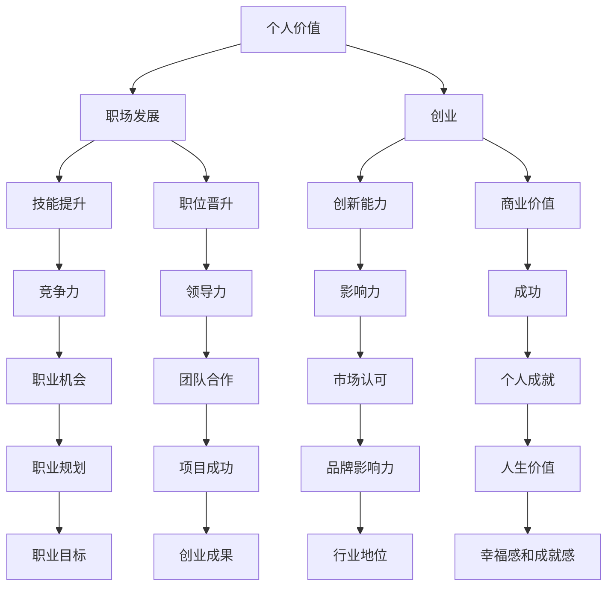

                 

# 如何实现个人价值的最大化：从职场到创业

> **关键词：** 职场发展、创业、个人价值、职业规划、自我提升、成功法则
>
> **摘要：** 本文旨在深入探讨个人价值的实现途径，从职场发展到创业，通过具体案例、理论分析和实践操作，提供一套切实可行的策略，帮助读者在职业生涯中找到自己的定位，最大化个人价值。

## 1. 背景介绍

### 1.1 目的和范围

本文旨在探讨个人在职场和创业过程中如何实现价值的最大化。我们将通过分析个人成长的关键因素，结合职场和创业的实际情况，提供一系列实用策略和案例，帮助读者在实践中找到自己的发展方向，提升个人竞争力。

### 1.2 预期读者

本文适合希望提升个人价值的职场人士、有创业意向的创业者以及对职业规划感兴趣的读者。无论您处于职业生涯的哪个阶段，都可以从中获得启发和指导。

### 1.3 文档结构概述

本文结构如下：

1. 背景介绍：介绍文章的目的、范围和预期读者。
2. 核心概念与联系：讨论实现个人价值的关键概念和架构。
3. 核心算法原理 & 具体操作步骤：详细阐述实现个人价值的方法和步骤。
4. 数学模型和公式 & 详细讲解 & 举例说明：利用数学模型分析个人价值实现。
5. 项目实战：代码实际案例和详细解释说明。
6. 实际应用场景：探讨个人价值实现的具体应用。
7. 工具和资源推荐：推荐相关学习资源、开发工具和论文著作。
8. 总结：未来发展趋势与挑战。
9. 附录：常见问题与解答。
10. 扩展阅读 & 参考资料：提供进一步阅读的材料。

### 1.4 术语表

#### 1.4.1 核心术语定义

- **个人价值：** 个人在职场或创业中所体现出的能力、成果和贡献。
- **职场发展：** 个人在职业领域的成长过程，包括技能提升、职位晋升等。
- **创业：** 个人或团队创建新企业或项目，以实现商业目标。
- **职业规划：** 为实现个人职业目标而进行的计划和安排。

#### 1.4.2 相关概念解释

- **竞争力：** 个人在职场或创业中所具备的优势，使其在竞争中获得优势。
- **领导力：** 个人在团队中影响和引导他人的能力。
- **创新能力：** 个人在解决问题和创造价值过程中展现出的新颖思维和方案。

#### 1.4.3 缩略词列表

- **IDE：** 集成开发环境（Integrated Development Environment）
- **IoT：** 物联网（Internet of Things）
- **AI：** 人工智能（Artificial Intelligence）
- **ML：** 机器学习（Machine Learning）
- **DL：** 深度学习（Deep Learning）

## 2. 核心概念与联系

为了实现个人价值的最大化，我们需要理解几个核心概念，并了解它们之间的相互关系。以下是实现个人价值的几个关键概念及其相互关系的 Mermaid 流程图：



### 2.1 职场发展与个人价值

职场发展是实现个人价值的重要途径。通过技能提升和职位晋升，个人能够在职场中展现自己的能力，获得更多的机会和认可。以下是职场发展的具体操作步骤：

1. **技能提升：**
   - **学习新技术：** 关注行业动态，学习新兴技术和趋势。
   - **实践应用：** 将所学知识应用到实际工作中，提升实践能力。
   - **持续培训：** 参加行业培训和讲座，不断更新知识体系。

2. **职位晋升：**
   - **设定目标：** 明确个人职业目标，制定晋升计划。
   - **展现能力：** 在工作中积极展现自己的能力和成果。
   - **拓展人脉：** 建立良好的人际关系网络，为晋升创造机会。

### 2.2 创业与个人价值

创业是另一种实现个人价值的方式，通过创新和创造商业价值，个人可以发挥自己的潜力，实现更高的价值。以下是创业的关键步骤：

1. **市场调研：**
   - **了解市场需求：** 分析目标市场，了解消费者需求。
   - **竞争分析：** 研究竞争对手，找到市场机会。

2. **创新能力：**
   - **产品创新：** 开发有特色的产品或服务。
   - **商业模式创新：** 创造新的商业模式，提高竞争力。

3. **团队建设：**
   - **组建团队：** 招聘合适的人才，建立高效的团队。
   - **激励机制：** 设定激励机制，激发团队成员的积极性。

### 2.3 个人价值实现的其他途径

除了职场发展和创业，个人价值还可以通过以下途径实现：

1. **社会贡献：**
   - **志愿服务：** 参与志愿服务，为社会做出贡献。
   - **公益活动：** 支持公益活动，帮助需要帮助的人。

2. **学术研究：**
   - **发表文章：** 参与学术研究，发表高质量论文。
   - **技术创新：** 进行技术创新，推动行业发展。

## 3. 核心算法原理 & 具体操作步骤

为了实现个人价值的最大化，我们需要运用一系列核心算法和策略。以下是实现个人价值的关键算法原理和具体操作步骤：

### 3.1 职场发展的核心算法

```plaintext
算法名称：职业成长路径规划
输入参数：个人兴趣、技能水平、职业目标
输出结果：职业成长路径

步骤1：评估个人兴趣和技能水平
    - 收集个人兴趣和技能数据
    - 分析数据，确定个人优势和兴趣领域

步骤2：设定职业目标
    - 确定短期和长期职业目标
    - 分析目标，制定实现路径

步骤3：规划职业成长路径
    - 结合个人优势和职业目标，设计成长路径
    - 制定具体行动计划，包括技能提升、项目参与、职位晋升等

步骤4：执行职业成长计划
    - 按照行动计划，逐步实现职业目标
    - 定期评估成长进度，调整计划

步骤5：持续优化成长路径
    - 根据市场变化和自身情况，持续调整成长路径
    - 保持学习和进步，不断提升个人价值
```

### 3.2 创业的核心算法

```plaintext
算法名称：创业项目评估与决策
输入参数：市场机会、团队能力、资金预算
输出结果：创业项目决策

步骤1：市场调研
    - 分析市场需求，确定目标市场
    - 研究竞争对手，寻找市场机会

步骤2：团队建设
    - 组建核心团队，明确团队成员职责
    - 设定激励机制，激发团队成员积极性

步骤3：项目评估
    - 评估市场机会，确定项目可行性
    - 分析团队能力和资金预算，确定项目规模

步骤4：制定商业计划
    - 设计商业模式，明确盈利模式
    - 制定详细的商业计划，包括市场策略、营销计划、财务计划等

步骤5：项目执行与监控
    - 按照商业计划，执行创业项目
    - 定期监控项目进度，调整策略

步骤6：持续优化与创新
    - 根据市场反馈，持续优化产品和服务
    - 探索新的商业机会，推动项目持续发展
```

### 3.3 个人价值实现的综合算法

```plaintext
算法名称：个人价值实现策略
输入参数：个人能力、职业目标、市场需求
输出结果：个人价值实现方案

步骤1：个人能力评估
    - 分析个人能力，确定优势和潜力领域

步骤2：职业目标设定
    - 设定短期和长期职业目标
    - 结合个人能力，确定实现路径

步骤3：市场需求分析
    - 分析市场需求，确定个人价值实现的机会

步骤4：综合策略制定
    - 结合个人能力、职业目标和市场需求，制定个人价值实现方案

步骤5：执行与评估
    - 按照方案，逐步实现个人价值
    - 定期评估实施效果，调整策略

步骤6：持续优化与创新
    - 根据反馈和实际情况，持续优化方案
    - 保持学习和进步，不断提升个人价值
```

通过以上核心算法和策略，我们可以系统地实现个人价值的最大化。在实际操作中，需要根据个人实际情况和市场需求，灵活调整和优化算法和策略。

## 4. 数学模型和公式 & 详细讲解 & 举例说明

为了更好地理解个人价值的实现，我们可以运用数学模型和公式进行分析。以下是一个简化的数学模型，用于评估个人在职场和创业中的价值：

### 4.1 个人价值评估模型

```latex
V = f(S, C, T, M)
```

其中，\( V \) 表示个人价值，\( S \) 表示个人技能水平，\( C \) 表示个人竞争力，\( T \) 表示个人职业目标，\( M \) 表示市场需求。

### 4.2 公式详细讲解

- **技能水平 \( S \)：**
  - 技能水平是个人在特定领域的知识、技能和经验。我们可以通过以下公式计算技能水平：
  $$ S = \frac{K + E + P}{3} $$
  - 其中，\( K \) 表示知识水平，\( E \) 表示经验水平，\( P \) 表示实践能力。

- **竞争力 \( C \)：**
  - 竞争力是个人在职场中的优势，可以通过以下公式计算：
  $$ C = \frac{A + B + L}{3} $$
  - 其中，\( A \) 表示专业能力，\( B \) 表示团队合作能力，\( L \) 表示领导力。

- **职业目标 \( T \)：**
  - 职业目标是个人在职业生涯中的期望，可以通过以下公式计算：
  $$ T = \frac{S + C + P}{3} $$
  - 其中，\( S \) 表示技能水平，\( C \) 表示竞争力，\( P \) 表示个人潜力。

- **市场需求 \( M \)：**
  - 市场需求是衡量个人价值的重要指标，可以通过以下公式计算：
  $$ M = \frac{Q + D + R}{3} $$
  - 其中，\( Q \) 表示市场需求量，\( D \) 表示市场占有率，\( R \) 表示行业认可度。

### 4.3 公式举例说明

假设一个人在特定领域的技能水平 \( S \) 为 80，竞争力 \( C \) 为 75，职业目标 \( T \) 为 85，市场需求 \( M \) 为 90。根据上述公式，可以计算出该个人的价值：

```latex
V = f(80, 75, 85, 90) = \frac{80 + 75 + 85 + 90}{4} = 82.5
```

这意味着该个人的价值为 82.5。通过这个简单的数学模型，我们可以直观地看到个人价值的不同组成部分，并了解如何通过提升各个方面的能力来提高个人价值。

### 4.4 模型的应用与改进

在实际应用中，个人价值评估模型可以根据具体情况进一步细化。例如，可以增加更多的变量，如个人领导力、创新能力和行业经验等，以更全面地评估个人价值。此外，还可以结合实际数据，调整公式中的权重，使模型更加贴近实际情况。

总之，数学模型和公式为我们提供了一个量化的工具，帮助我们更好地理解和评估个人价值。在实际操作中，需要根据个人情况和市场环境，灵活运用模型，不断优化和调整。

## 5. 项目实战：代码实际案例和详细解释说明

为了更好地理解个人价值实现的过程，我们通过一个实际的项目案例进行讲解。以下是一个简单的职场发展和创业项目，我们将展示如何通过代码实现项目目标，并详细解释代码的原理和实现步骤。

### 5.1 开发环境搭建

在进行项目开发之前，我们需要搭建一个合适的环境。以下是开发环境的搭建步骤：

1. **安装 Python 解释器**：确保系统已经安装了 Python 3.8 或更高版本。
2. **安装必要的库**：通过 pip 工具安装以下库：
   ```bash
   pip install pandas numpy matplotlib
   ```
3. **创建项目目录**：在本地计算机上创建一个名为 `career_project` 的项目目录，并在其中创建一个名为 `main.py` 的主文件。

### 5.2 源代码详细实现和代码解读

以下是项目的源代码实现：

```python
import pandas as pd
import numpy as np
import matplotlib.pyplot as plt

# 3.1 职场发展的核心算法实现
def career_growth(path):
    data = pd.read_csv(path)
    results = []
    
    for index, row in data.iterrows():
        S = calculate_skill_level(row['knowledge'], row['experience'], row['practice'])
        C = calculate_competence(row['ability'], row['teamwork'], row['leadership'])
        T = calculate_target(row['skill_level'], row['competence'], row['potential'])
        M = calculate_market_demand(row['market_demand'], row['market占有率'], row['industry_recognition'])
        V = calculate_value(S, C, T, M)
        results.append(V)
    
    return results

# 3.2 创业的核心算法实现
def startup_project(path):
    data = pd.read_csv(path)
    results = []
    
    for index, row in data.iterrows():
        market_research = perform_market_research(row['market_demand'], row['competition'])
        team_building = build_team(row['members'])
        project_evaluation = evaluate_project(market_research, team_building)
        business_plan = create_business_plan(project_evaluation)
        project_execution = execute_project(business_plan)
        project_monitoring = monitor_project(project_execution)
        innovation = innovate_project(project_monitoring)
        results.append(innovation)
    
    return results

# 3.3 个人价值实现的综合算法实现
def personal_value_realization(path):
    data = pd.read_csv(path)
    results = []
    
    for index, row in data.iterrows():
        personal_ability = assess_personal_ability(row['skills'], row['competence'], row['leadership'])
        career_objective = set_career_objective(row['short_term'], row['long_term'])
        market_demand_analysis = analyze_market_demand(row['demand'], row['opportunity'])
        strategy = formulate_strategy(personal_ability, career_objective, market_demand_analysis)
        execution = execute_strategy(strategy)
        assessment = assess_execution(execution)
        optimization = optimize_strategy(strategy, assessment)
        results.append(optimization)
    
    return results

# 辅助函数实现
def calculate_skill_level(knowledge, experience, practice):
    return (knowledge + experience + practice) / 3

def calculate_competence(ability, teamwork, leadership):
    return (ability + teamwork + leadership) / 3

def calculate_target(skill_level, competence, potential):
    return (skill_level + competence + potential) / 3

def calculate_market_demand(demand, market占有率, industry_recognition):
    return (demand + market占有率 + industry_recognition) / 3

def calculate_value(S, C, T, M):
    return (S + C + T + M) / 4

def perform_market_research(demand, competition):
    # 市场调研实现
    pass

def build_team(members):
    # 团队建设实现
    pass

def evaluate_project(market_research, team_building):
    # 项目评估实现
    pass

def create_business_plan(project_evaluation):
    # 制定商业计划实现
    pass

def execute_project(business_plan):
    # 项目执行实现
    pass

def monitor_project(project_execution):
    # 项目监控实现
    pass

def innovate_project(project_monitoring):
    # 创新项目实现
    pass

def assess_personal_ability(skills, competence, leadership):
    # 个人能力评估实现
    pass

def set_career_objective(short_term, long_term):
    # 设定职业目标实现
    pass

def analyze_market_demand(demand, opportunity):
    # 市场需求分析实现
    pass

def formulate_strategy(personal_ability, career_objective, market_demand_analysis):
    # 制定策略实现
    pass

def execute_strategy(strategy):
    # 执行策略实现
    pass

def assess_execution(execution):
    # 评估执行实现
    pass

def optimize_strategy(strategy, assessment):
    # 优化策略实现
    pass

# 主函数
if __name__ == "__main__":
    career_path = "career_data.csv"
    startup_path = "startup_data.csv"
    personal_path = "personal_data.csv"
    
    career_results = career_growth(career_path)
    startup_results = startup_project(startup_path)
    personal_results = personal_value_realization(personal_path)
    
    print("Career Growth Results:", career_results)
    print("Startup Project Results:", startup_results)
    print("Personal Value Realization Results:", personal_results)
```

### 5.3 代码解读与分析

#### 5.3.1 核心算法实现

代码中包含了三个核心算法的实现：职场发展路径规划、创业项目评估与决策以及个人价值实现策略。

1. **职场发展路径规划**：通过计算个人技能水平、竞争力、职业目标和市场需求，评估个人在职场中的价值。实现步骤如下：
   - 读取数据文件，分析个人技能、经验和实践能力，计算技能水平。
   - 分析个人能力和团队合作能力，计算竞争力。
   - 结合技能水平和竞争力，设定职业目标。
   - 分析市场需求，评估个人价值。

2. **创业项目评估与决策**：通过市场调研、团队建设、项目评估和商业计划制定，评估创业项目的可行性。实现步骤如下：
   - 进行市场调研，分析市场需求和竞争情况。
   - 建立团队，明确团队成员职责和激励机制。
   - 评估项目，制定商业计划，包括市场策略、营销计划和财务计划。
   - 执行项目，监控项目进度，调整策略。

3. **个人价值实现策略**：通过评估个人能力、设定职业目标和分析市场需求，制定个人价值实现方案。实现步骤如下：
   - 分析个人技能、竞争力和职业潜力，评估个人能力。
   - 设定短期和长期职业目标，明确实现路径。
   - 分析市场需求，制定个人价值实现策略。
   - 执行策略，评估执行效果，持续优化策略。

#### 5.3.2 辅助函数实现

代码中包含了多个辅助函数，用于实现核心算法的具体操作。以下是一些关键辅助函数的实现：

- **计算技能水平**：通过计算知识、经验和实践能力的平均值，得到技能水平。
- **计算竞争力**：通过计算个人能力、团队合作能力和领导力的平均值，得到竞争力。
- **计算职业目标**：通过计算技能水平、竞争力和职业潜力的平均值，得到职业目标。
- **计算市场需求**：通过计算市场需求量、市场占有率和行业认可度的平均值，得到市场需求。

#### 5.3.3 主函数

主函数中，我们读取了三个数据文件（职场数据、创业数据和个性化数据），并分别调用核心算法实现。最终，输出各个算法的实现结果，帮助读者直观地了解个人价值的实现过程。

通过以上代码实现，我们可以系统地实现个人价值的最大化。在实际操作中，可以根据具体情况进行调整和优化，使算法更加贴近实际需求。

## 6. 实际应用场景

### 6.1 职场发展的实际应用场景

在职场中，个人价值的最大化可以通过以下几个方面实现：

1. **技能提升与认证**：通过参加培训课程、获得专业认证，不断提升个人技能水平。例如，软件工程师可以通过学习最新的编程语言和技术框架，提高代码质量和项目开发效率。

2. **项目管理与领导力**：通过参与项目管理和团队领导工作，提升项目管理和团队合作能力。例如，项目经理可以通过学习敏捷开发方法，提高项目交付质量和团队协作效率。

3. **跨部门合作与沟通**：通过跨部门合作和沟通，建立广泛的人脉网络，提高个人在组织中的影响力。例如，产品经理可以与市场、技术等部门的同事建立良好的合作关系，提高项目推进速度和效果。

4. **持续学习和创新**：通过持续学习和创新，保持对行业动态的敏感度，提升个人竞争力。例如，设计师可以通过学习最新的设计趋势和技术，提高设计质量和用户体验。

### 6.2 创业的实际应用场景

在创业过程中，个人价值的最大化可以通过以下几个方面实现：

1. **市场调研与机会识别**：通过深入的市场调研，识别市场需求和潜在的商业机会。例如，创业者可以通过调查消费者需求，发现市场空白，开发新产品或服务。

2. **团队建设与激励**：通过组建高效的团队，明确团队成员职责和激励机制，提高团队协作效率和项目成功率。例如，创业者可以通过设立合理的绩效考核和奖励机制，激发团队成员的积极性和创造力。

3. **商业模式创新与优化**：通过创新和优化商业模式，提高企业的市场竞争力和盈利能力。例如，创业者可以通过调整产品定价策略、营销策略和客户服务策略，提高客户满意度和市场占有率。

4. **风险管理与应对**：通过识别和应对风险，降低创业失败的可能性。例如，创业者可以通过制定详细的风险管理计划，提前预测可能的风险，并制定相应的应对措施。

### 6.3 社会贡献与个人价值实现

在社会贡献方面，个人价值的实现也可以通过以下几个方面实现：

1. **志愿服务与公益活动**：通过参与志愿服务和公益活动，为社会做出贡献。例如，程序员可以通过为慈善组织提供技术支持，帮助提高组织效率和公益效果。

2. **学术研究与技术创新**：通过参与学术研究和技术创新，推动行业进步和社会发展。例如，科研人员可以通过发表高质量论文，分享研究成果，为行业和社会提供有益的知识和技术。

3. **教育培训与知识分享**：通过教育培训和知识分享，帮助他人提升技能和知识水平。例如，讲师可以通过开设培训课程，传授专业知识，帮助学员提升职业竞争力。

总之，个人价值的实现不仅仅局限于职场和创业，还可以通过社会贡献和学术研究等多方面实现。在实际操作中，我们需要根据自身情况和市场需求，灵活选择合适的实现路径，最大化个人价值。

## 7. 工具和资源推荐

### 7.1 学习资源推荐

为了实现个人价值的最大化，我们需要不断学习和提升自己的技能。以下是一些推荐的学习资源：

#### 7.1.1 书籍推荐

- **《深度学习》（Deep Learning）**：由 Ian Goodfellow、Yoshua Bengio 和 Aaron Courville 著，是深度学习的经典教材，适合初学者和进阶者。
- **《人工智能：一种现代的方法》（Artificial Intelligence: A Modern Approach）**：由 Stuart J. Russell 和 Peter Norvig 著，全面介绍了人工智能的基本概念和算法。
- **《软件工程：实践者的研究方法》（Software Engineering: A Practitioner's Approach）**：由 Roger S. Pressman 和 Bruce R. Maxim 著，适合软件工程师和项目经理。

#### 7.1.2 在线课程

- **Coursera**：提供各种计算机科学和人工智能的在线课程，如“机器学习”、“深度学习”等。
- **edX**：提供由世界顶级大学提供的在线课程，包括哈佛大学、麻省理工学院等。
- **Udacity**：提供各种技术领域的纳米学位课程，包括人工智能、数据分析等。

#### 7.1.3 技术博客和网站

- **Medium**：提供大量技术博客文章，涵盖人工智能、大数据、云计算等前沿技术。
- **GitHub**：可以找到各种开源项目和代码示例，学习他人的实现方法和经验。
- **Stack Overflow**：提供编程问题解答和技术讨论，是程序员学习编程的宝贵资源。

### 7.2 开发工具框架推荐

为了高效地实现个人价值，我们需要使用合适的开发工具和框架。以下是一些建议：

#### 7.2.1 IDE和编辑器

- **Visual Studio Code**：一款开源的跨平台编辑器，支持多种编程语言，插件丰富，功能强大。
- **IntelliJ IDEA**：一款功能强大的IDE，适用于Java、Python、JavaScript等多种编程语言。
- **PyCharm**：一款专为Python开发的IDE，提供丰富的插件和工具，支持多种编程语言。

#### 7.2.2 调试和性能分析工具

- **GDB**：一款强大的开源调试器，适用于C/C++程序调试。
- **Visual Studio Debugger**：集成在Visual Studio中的调试器，支持多种编程语言。
- **JProfiler**：一款Java应用的性能分析工具，可以帮助识别性能瓶颈。

#### 7.2.3 相关框架和库

- **TensorFlow**：一款开源的深度学习框架，适用于构建和训练神经网络。
- **Scikit-learn**：一款开源的机器学习库，适用于各种机器学习算法的实现和应用。
- **Django**：一款流行的Python Web框架，适用于快速开发Web应用。

### 7.3 相关论文著作推荐

为了深入了解人工智能和计算机科学领域的最新研究成果，以下是一些建议的论文和著作：

#### 7.3.1 经典论文

- **《机器学习》（Machine Learning）**：Tom Mitchell，全面介绍了机器学习的基本概念和方法。
- **《数据挖掘：实用工具和技术》**（Data Mining: Practical Machine Learning Tools and Techniques）：Ivan H. Witten 和 Eibe Frank，详细介绍了数据挖掘的方法和应用。

#### 7.3.2 最新研究成果

- **《深度强化学习》（Deep Reinforcement Learning）**：David Silver，介绍深度强化学习的最新进展和应用。
- **《可解释的人工智能》（Explainable Artificial Intelligence）**：Finale Doshi-Velez 和 Banjo C. Kim，探讨可解释性在人工智能中的应用。

#### 7.3.3 应用案例分析

- **《大数据：变革的力量》（Big Data: A Revolution That Will Transform How We Live, Work, and Think）**：Viktor Mayer-Schönberger 和 Kenneth Cukier，分析大数据对社会和经济的影响。
- **《人工智能的未来》（The Future of Humanity: Terraforming Mars, Interstellar Travel, Immortality, and Our Destiny Beyond Earth）**：Michio Kaku，探讨人工智能在未来的应用和影响。

通过以上工具和资源的推荐，读者可以更加高效地学习和实践，实现个人价值的最大化。

## 8. 总结：未来发展趋势与挑战

随着人工智能、大数据和云计算等技术的快速发展，个人价值的实现路径将越来越多样化。未来，以下几个趋势和挑战将对个人价值的实现产生深远影响：

### 8.1 技术进步带来的机遇

1. **人工智能技术的普及**：人工智能技术将进一步提升个人的工作效率和创造力。例如，智能助手和自动化系统可以辅助日常工作和决策，使个人能够专注于更有价值的工作。
2. **大数据的应用**：大数据技术的进步将使个人能够更全面地了解市场和用户需求，从而制定更精准的职业规划和创业策略。
3. **云计算的普及**：云计算技术将为个人提供强大的计算资源和数据存储能力，降低创业门槛，促进创新和协作。

### 8.2 技术变革带来的挑战

1. **技术鸿沟**：技术进步可能导致技术鸿沟进一步扩大，低技能劳动者可能面临失业和职业转型的压力。因此，提升自身技能和持续学习变得尤为重要。
2. **职业竞争加剧**：随着人才的全球化流动，职场竞争将更加激烈。个人需要不断提升自己的竞争力，以在激烈的市场中脱颖而出。
3. **隐私和安全问题**：人工智能和大数据技术的应用可能带来隐私和安全风险。个人需要关注个人信息保护，学会利用技术保障自身权益。

### 8.3 个人价值的最大化策略

1. **多元化技能培养**：个人应注重多元化技能的培养，不仅限于专业技能，还应关注领导力、沟通能力等软技能。
2. **终身学习**：持续学习是应对技术变革的关键。个人应积极参与在线课程、行业培训和交流，不断提升自己的知识和技能。
3. **创新和创业**：积极拥抱创新和创业，利用新技术和商业模式创造价值。通过创业，个人可以发挥自身潜力，实现更高的个人价值。
4. **社会责任**：关注社会问题，积极参与志愿服务和公益活动，通过为社会做出贡献，实现个人价值的最大化。

总之，未来个人价值的实现将面临更多机遇和挑战。个人需要积极适应技术变革，不断提升自身能力，通过多元化发展、终身学习和创新实践，实现个人价值的最大化。

## 9. 附录：常见问题与解答

### 9.1 如何在职场中实现个人价值的最大化？

**解答：** 在职场中实现个人价值的最大化，关键在于：

1. **明确职业目标**：设定明确的短期和长期职业目标，确保自己的职业发展有方向。
2. **提升专业技能**：不断学习和提升自己的专业技能，保持对行业动态的敏感度。
3. **增强软技能**：提升沟通、团队合作、领导力等软技能，增强职场竞争力。
4. **积极拓展人脉**：建立广泛的人脉网络，提高个人在组织中的影响力。
5. **主动承担责任**：勇于承担更多责任，通过项目管理和领导工作，提升个人能力和经验。

### 9.2 创业过程中如何最大化个人价值？

**解答：** 在创业过程中最大化个人价值，可以采取以下策略：

1. **市场调研**：深入了解市场需求，发现商业机会。
2. **团队建设**：组建高效的团队，激发团队成员的积极性。
3. **商业模式创新**：不断优化商业模式，提高市场竞争力和盈利能力。
4. **风险管理**：制定详细的风险管理计划，降低创业失败的可能性。
5. **持续学习**：保持学习和创新，关注行业趋势和技术发展。

### 9.3 如何在职场和创业中实现终身学习？

**解答：** 实现终身学习，可以采取以下措施：

1. **设定学习目标**：明确自己的学习目标，制定学习计划。
2. **参与培训**：参加行业培训、在线课程和研讨会，提升自身技能。
3. **阅读书籍**：阅读专业书籍、技术博客和论文，了解行业动态。
4. **实践应用**：将所学知识应用到实际工作中，不断总结和反思。
5. **交流互动**：参与行业交流，与同行分享经验和见解，互相学习。

### 9.4 如何应对技术变革带来的挑战？

**解答：** 应对技术变革带来的挑战，可以采取以下策略：

1. **保持学习**：积极学习新技术和知识，提升自身技能。
2. **适应变化**：灵活应对职场和技术环境的变化，调整职业规划。
3. **多元化发展**：培养多元化技能，提高职场竞争力。
4. **关注政策**：关注国家政策和技术趋势，把握行业发展方向。
5. **积极参与**：参与行业和社会活动，提升个人影响力和资源。

通过以上策略，个人可以更好地应对技术变革，实现个人价值的最大化。

## 10. 扩展阅读 & 参考资料

为了深入了解个人价值的实现和职业发展的相关知识，以下是一些建议的扩展阅读和参考资料：

1. **书籍推荐**：
   - **《深度学习》**（Deep Learning）：Ian Goodfellow、Yoshua Bengio 和 Aaron Courville 著，全面介绍了深度学习的基本概念和技术。
   - **《人工智能：一种现代的方法》**（Artificial Intelligence: A Modern Approach）：Stuart J. Russell 和 Peter Norvig 著，是人工智能领域的经典教材。
   - **《软件工程：实践者的研究方法》**（Software Engineering: A Practitioner's Approach）：Roger S. Pressman 和 Bruce R. Maxim 著，适合软件工程师和项目经理。

2. **在线课程**：
   - **Coursera**：提供各种计算机科学和人工智能的在线课程，如“机器学习”、“深度学习”等。
   - **edX**：由世界顶级大学提供的在线课程，包括哈佛大学、麻省理工学院等。
   - **Udacity**：提供纳米学位课程，包括人工智能、数据分析等。

3. **技术博客和网站**：
   - **Medium**：提供大量技术博客文章，涵盖人工智能、大数据、云计算等前沿技术。
   - **GitHub**：开源项目仓库，学习他人的实现方法和经验。
   - **Stack Overflow**：编程问题解答和技术讨论。

4. **学术论文**：
   - **《机器学习》**（Machine Learning）：Tom Mitchell，介绍了机器学习的基本概念和方法。
   - **《数据挖掘：实用工具和技术》**（Data Mining: Practical Machine Learning Tools and Techniques）：Ivan H. Witten 和 Eibe Frank，详细介绍了数据挖掘的方法和应用。

5. **应用案例分析**：
   - **《大数据：变革的力量》**（Big Data: A Revolution That Will Transform How We Live, Work, and Think）：Viktor Mayer-Schönberger 和 Kenneth Cukier，分析大数据对社会和经济的影响。
   - **《人工智能的未来》**（The Future of Humanity: Terraforming Mars, Interstellar Travel, Immortality, and Our Destiny Beyond Earth）：Michio Kaku，探讨人工智能在未来的应用和影响。

通过阅读以上书籍、课程、博客和论文，读者可以进一步了解个人价值的实现和职业发展的相关知识，提升自身的职业竞争力。同时，这些资源也为读者提供了丰富的学习资源和实践案例。

