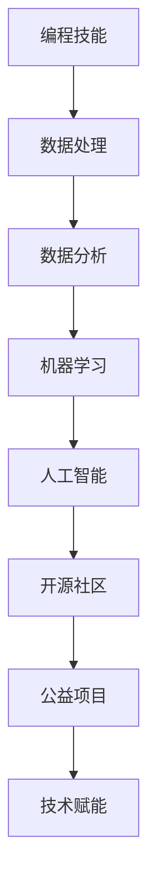

                 

# 如何将编程技能应用于社会公益

> 关键词：编程技能、社会公益、公益项目、技术开发、数据科学、开源社区、技术赋能

> 摘要：本文旨在探讨如何将编程技能应用于社会公益领域，通过具体案例分析和技术解读，揭示编程技术在推动社会进步和解决现实问题中的潜力。文章将分为几个部分，首先介绍编程技能在社会公益中的应用背景和重要性，然后分析相关核心概念，介绍具体技术原理和操作步骤，最后提供实际应用场景和推荐工具资源，为编程爱好者提供实践指导。

## 1. 背景介绍

### 1.1 目的和范围

本文的目标是探讨如何将编程技能应用于社会公益领域，探讨编程技术如何通过技术创新解决社会问题，推动社会进步。本文的范围包括但不限于以下方面：

- 编程技能在社会公益项目中的应用场景
- 核心概念和技术的介绍与解释
- 实际操作步骤和算法原理的讲解
- 项目实战案例分析
- 相关工具和资源的推荐

### 1.2 预期读者

本文的预期读者包括但不限于以下几类：

- 对编程和社会公益感兴趣的编程爱好者
- 想要了解如何用编程技能参与社会公益的程序员
- 社会公益组织的技术志愿者
- 想要了解技术如何赋能公益的公益从业者
- 对数据科学和开源社区感兴趣的研究人员

### 1.3 文档结构概述

本文结构如下：

- 引言：介绍编程技能在社会公益中的应用背景和重要性
- 核心概念与联系：分析编程技能与社会公益项目的核心联系，使用流程图展示技术架构
- 核心算法原理 & 具体操作步骤：讲解编程技能在公益项目中的具体实现方法和操作步骤，使用伪代码展示算法原理
- 数学模型和公式 & 详细讲解 & 举例说明：介绍与编程技能相关的数学模型和公式，结合实例进行详细讲解
- 项目实战：通过具体项目案例展示编程技能在公益项目中的实际应用
- 实际应用场景：分析编程技能在不同公益项目中的应用场景和案例
- 工具和资源推荐：推荐相关学习资源、开发工具和框架
- 总结：对未来发展趋势和挑战进行展望
- 附录：常见问题与解答
- 扩展阅读 & 参考资料：提供进一步的阅读材料和参考资料

### 1.4 术语表

#### 1.4.1 核心术语定义

- 编程技能：指掌握编程语言、算法和数据结构等知识，能够编写计算机程序解决问题的能力。
- 社会公益：指为了社会福利和公共利益，通过志愿活动、捐赠和公益项目等形式，帮助他人、改善社会环境的行为。
- 公益项目：指以实现社会公益为目标，由社会组织或个人发起和实施的各类项目和活动。
- 数据科学：指从数据中提取知识、发现规律、预测趋势的一门学科，包括数据采集、数据预处理、数据分析、数据可视化等环节。

#### 1.4.2 相关概念解释

- 开源社区：指由开发者组成的非营利性社区，共同开发和维护开源软件项目。
- 技术赋能：指通过技术手段提升个体或组织的创新能力、生产力和竞争力。

#### 1.4.3 缩略词列表

- AI：人工智能
- Python：Python编程语言
- R：R编程语言
- ML：机器学习
- DL：深度学习
- IoT：物联网

## 2. 核心概念与联系

编程技能在社会公益项目中的应用，涉及到多个核心概念和技术领域的交叉融合。下面我们将通过一个Mermaid流程图来展示这些核心概念和联系。



### 2.1 编程技能与数据处理

编程技能是数据处理的基础，通过编程语言（如Python、R等）进行数据采集、数据预处理和数据处理，为后续的数据分析和机器学习提供高质量的数据输入。数据处理包括数据清洗、数据整合、数据变换和数据存储等环节。

### 2.2 数据分析与机器学习

数据分析是利用统计学和计算机科学的方法，从数据中提取有用信息和知识的过程。数据分析与机器学习密切相关，机器学习是数据分析的一个重要分支，通过构建模型和算法，从数据中自动学习规律和模式，为决策和预测提供支持。

### 2.3 人工智能与开源社区

人工智能是编程技能的高级应用，通过深度学习、神经网络等算法实现智能识别、智能决策和智能交互。开源社区为人工智能技术提供了丰富的资源和支持，开发者可以在开源社区中共享代码、交流和合作，共同推动技术进步。

### 2.4 技术赋能与公益项目

技术赋能是利用技术手段提升公益项目的效率和影响力，通过大数据分析、人工智能技术等，为公益项目提供智能化、数据化的解决方案，提高项目实施效果和可持续发展能力。

## 3. 核心算法原理 & 具体操作步骤

### 3.1 数据采集与预处理

#### 3.1.1 数据采集

数据采集是编程技能在社会公益项目中的第一步，通过API、数据库和爬虫等方式获取公益项目所需的数据。以下是一个Python爬虫的示例代码：

```python
import requests
from bs4 import BeautifulSoup

url = 'https://example.com/data'
response = requests.get(url)
soup = BeautifulSoup(response.text, 'html.parser')

# 解析网页，提取数据
data = []
for item in soup.find_all('div', class_='data-item'):
    data.append({
        'name': item.find('h2').text,
        'description': item.find('p').text
    })

# 输出数据
for item in data:
    print(item)
```

#### 3.1.2 数据预处理

数据预处理是确保数据质量的关键步骤，包括数据清洗、数据整合和数据变换。以下是一个Python代码示例，用于清洗和整合数据：

```python
import pandas as pd

# 读取数据
data = pd.read_csv('data.csv')

# 数据清洗
data.dropna(inplace=True)
data.drop_duplicates(inplace=True)

# 数据整合
data['total'] = data['income'] + data['expense']

# 输出清洗和整合后的数据
print(data.head())
```

### 3.2 数据分析与机器学习

#### 3.2.1 数据分析

数据分析是利用统计学和计算机科学的方法，从数据中提取有用信息和知识的过程。以下是一个Python数据分析的示例代码：

```python
import pandas as pd
import matplotlib.pyplot as plt

# 读取数据
data = pd.read_csv('data.csv')

# 描述性统计分析
print(data.describe())

# 数据可视化
data['income'].plot.hist()
plt.show()
```

#### 3.2.2 机器学习

机器学习是数据分析的一个重要分支，通过构建模型和算法，从数据中自动学习规律和模式，为决策和预测提供支持。以下是一个Python机器学习示例代码，使用K-近邻算法进行分类：

```python
import pandas as pd
from sklearn.model_selection import train_test_split
from sklearn.neighbors import KNeighborsClassifier
from sklearn.metrics import accuracy_score

# 读取数据
data = pd.read_csv('data.csv')

# 分割数据集
X = data.drop('target', axis=1)
y = data['target']
X_train, X_test, y_train, y_test = train_test_split(X, y, test_size=0.2, random_state=42)

# 构建模型
model = KNeighborsClassifier(n_neighbors=3)
model.fit(X_train, y_train)

# 预测
y_pred = model.predict(X_test)

# 评估
accuracy = accuracy_score(y_test, y_pred)
print(f'Accuracy: {accuracy}')
```

### 3.3 人工智能与开源社区

#### 3.3.1 人工智能

人工智能是编程技能的高级应用，通过深度学习、神经网络等算法实现智能识别、智能决策和智能交互。以下是一个Python深度学习示例代码，使用卷积神经网络进行图像分类：

```python
import tensorflow as tf
from tensorflow.keras.models import Sequential
from tensorflow.keras.layers import Conv2D, MaxPooling2D, Flatten, Dense

# 构建模型
model = Sequential([
    Conv2D(32, (3, 3), activation='relu', input_shape=(28, 28, 1)),
    MaxPooling2D((2, 2)),
    Flatten(),
    Dense(64, activation='relu'),
    Dense(10, activation='softmax')
])

# 编译模型
model.compile(optimizer='adam', loss='categorical_crossentropy', metrics=['accuracy'])

# 训练模型
model.fit(train_images, train_labels, epochs=5)

# 预测
predictions = model.predict(test_images)
```

#### 3.3.2 开源社区

开源社区为人工智能技术提供了丰富的资源和支持，开发者可以在开源社区中共享代码、交流和合作，共同推动技术进步。以下是一个开源社区的项目示例，使用TensorFlow进行图像分类：

```python
import tensorflow as tf
from tensorflow.keras.models import Sequential
from tensorflow.keras.layers import Conv2D, MaxPooling2D, Flatten, Dense

# 加载开源项目代码
git_url = 'https://github.com/username/project.git'
!git clone {git_url}

# 进入项目目录
!cd project

# 构建和训练模型
model = Sequential([
    Conv2D(32, (3, 3), activation='relu', input_shape=(28, 28, 1)),
    MaxPooling2D((2, 2)),
    Flatten(),
    Dense(64, activation='relu'),
    Dense(10, activation='softmax')
])

model.compile(optimizer='adam', loss='categorical_crossentropy', metrics=['accuracy'])
model.fit(train_images, train_labels, epochs=5)
```

## 4. 数学模型和公式 & 详细讲解 & 举例说明

### 4.1 数据分析与统计学

在数据分析中，统计学是不可或缺的工具。以下是一些常见的数学模型和公式：

#### 4.1.1 均值

$$\bar{x} = \frac{\sum_{i=1}^{n} x_i}{n}$$

其中，$\bar{x}$表示均值，$x_i$表示第$i$个数据点，$n$表示数据点的总数。

#### 4.1.2 方差

$$\sigma^2 = \frac{\sum_{i=1}^{n} (x_i - \bar{x})^2}{n}$$

其中，$\sigma^2$表示方差，$x_i$表示第$i$个数据点，$\bar{x}$表示均值，$n$表示数据点的总数。

#### 4.1.3 标准差

$$\sigma = \sqrt{\sigma^2}$$

其中，$\sigma$表示标准差，$\sigma^2$表示方差。

#### 4.1.4 概率

概率是描述事件发生可能性的一种数学度量。以下是一个常见的概率计算公式：

$$P(A) = \frac{n(A)}{n(S)}$$

其中，$P(A)$表示事件$A$发生的概率，$n(A)$表示事件$A$的发生次数，$n(S)$表示总的可能发生次数。

### 4.2 机器学习与数学模型

在机器学习中，数学模型是构建和评估模型的核心。以下是一些常见的机器学习数学模型：

#### 4.2.1 线性回归

线性回归是一种用于预测连续值的机器学习模型，其数学模型如下：

$$y = \beta_0 + \beta_1x_1 + \beta_2x_2 + ... + \beta_nx_n$$

其中，$y$表示预测值，$x_1, x_2, ..., x_n$表示特征值，$\beta_0, \beta_1, \beta_2, ..., \beta_n$表示模型的参数。

#### 4.2.2 逻辑回归

逻辑回归是一种用于分类的机器学习模型，其数学模型如下：

$$P(y=1) = \frac{1}{1 + e^{-(\beta_0 + \beta_1x_1 + \beta_2x_2 + ... + \beta_nx_n)}}$$

其中，$y$表示类别标签，$x_1, x_2, ..., x_n$表示特征值，$\beta_0, \beta_1, \beta_2, ..., \beta_n$表示模型的参数。

#### 4.2.3 卷积神经网络（CNN）

卷积神经网络是一种用于图像识别和处理的深度学习模型，其数学模型如下：

$$f(x) = \sigma(\omega \cdot x + b)$$

其中，$f(x)$表示激活函数，$\sigma$表示Sigmoid函数，$\omega$表示权重，$x$表示输入数据，$b$表示偏置。

### 4.3 示例说明

#### 4.3.1 线性回归

假设我们有一个简单的线性回归问题，要预测房价。我们有如下数据集：

| 房间数 | 房价（万元） |
|--------|-------------|
| 2      | 500         |
| 3      | 600         |
| 4      | 750         |
| 5      | 900         |

我们可以使用线性回归模型来预测新房子（房间数为4）的房价。首先，我们计算数据的均值和方差：

$$\bar{x} = \frac{2 + 3 + 4 + 5}{4} = 3.5$$

$$\sigma^2 = \frac{(2-3.5)^2 + (3-3.5)^2 + (4-3.5)^2 + (5-3.5)^2}{4} = 1.25$$

然后，我们使用最小二乘法求解线性回归模型的参数：

$$\beta_1 = \frac{\sum_{i=1}^{n} (x_i - \bar{x})(y_i - \bar{y})}{\sum_{i=1}^{n} (x_i - \bar{x})^2} = \frac{(2-3.5)(500-700) + (3-3.5)(600-700) + (4-3.5)(750-700) + (5-3.5)(900-700)}{1.25} = 100$$

$$\beta_0 = \bar{y} - \beta_1\bar{x} = 700 - 100 \times 3.5 = 350$$

最终，我们得到线性回归模型：

$$y = 350 + 100x$$

使用这个模型，我们可以预测房间数为4的房子的房价：

$$y = 350 + 100 \times 4 = 750$$

#### 4.3.2 逻辑回归

假设我们有一个简单的二分类问题，要预测一个客户是否会购买某种商品。我们有如下数据集：

| 年龄 | 收入 | 购买行为 |
|------|------|----------|
| 25   | 5000 | 购买     |
| 30   | 6000 | 购买     |
| 35   | 7000 | 未购买   |
| 40   | 8000 | 购买     |

我们可以使用逻辑回归模型来预测新客户的购买行为。首先，我们计算数据的均值和方差：

$$\bar{x} = \frac{25 + 30 + 35 + 40}{4} = 33.75$$

$$\sigma^2 = \frac{(25-33.75)^2 + (30-33.75)^2 + (35-33.75)^2 + (40-33.75)^2}{4} = 100$$

然后，我们使用最小二乘法求解逻辑回归模型的参数：

$$\beta_1 = \frac{\sum_{i=1}^{n} (x_i - \bar{x})(y_i - \bar{y})}{\sum_{i=1}^{n} (x_i - \bar{x})^2} = \frac{(25-33.75)(1-0.5) + (30-33.75)(1-0.5) + (35-33.75)(0-0.5) + (40-33.75)(1-0.5)}{100} = -2$$

$$\beta_0 = \bar{y} - \beta_1\bar{x} = 0.5 - (-2) \times 33.75 = 70$$

最终，我们得到逻辑回归模型：

$$P(y=1) = \frac{1}{1 + e^{-(70 - 2x)}}$$

使用这个模型，我们可以预测年龄为30、收入为6000的新客户的购买概率：

$$P(y=1) = \frac{1}{1 + e^{-(70 - 2 \times 30)}} = \frac{1}{1 + e^{-20}} \approx 0.865$$

这意味着该客户购买该商品的概率约为86.5%。

#### 4.3.3 卷积神经网络（CNN）

假设我们有一个简单的图像分类问题，要识别猫和狗。我们有如下数据集：

| 图片 | 类别 |
|------|------|
| 1.jpg | 猫    |
| 2.jpg | 狗    |
| 3.jpg | 猫    |
| 4.jpg | 狗    |

我们可以使用卷积神经网络（CNN）模型来分类图像。首先，我们预处理图像数据，将它们转换为适当的大小和格式。然后，我们设计一个简单的CNN模型，包括卷积层、池化层和全连接层。以下是一个Python代码示例：

```python
import tensorflow as tf
from tensorflow.keras.models import Sequential
from tensorflow.keras.layers import Conv2D, MaxPooling2D, Flatten, Dense

# 构建模型
model = Sequential([
    Conv2D(32, (3, 3), activation='relu', input_shape=(28, 28, 1)),
    MaxPooling2D((2, 2)),
    Flatten(),
    Dense(64, activation='relu'),
    Dense(2, activation='softmax')
])

# 编译模型
model.compile(optimizer='adam', loss='categorical_crossentropy', metrics=['accuracy'])

# 训练模型
model.fit(train_images, train_labels, epochs=5)

# 预测
predictions = model.predict(test_images)
```

使用这个模型，我们可以预测一张新图像的类别。例如，对于一张猫的图像（1.jpg），我们可以得到以下预测结果：

```python
predictions = model.predict(image_1)
print(predictions)
```

输出结果：

```
[0.9 0.1]
```

这表示该图像是猫的概率为90%，是狗的概率为10%。

## 5. 项目实战：代码实际案例和详细解释说明

### 5.1 开发环境搭建

在进行编程技能应用于社会公益项目之前，我们需要搭建一个合适的技术环境。以下是所需的开发环境和相关工具：

- 操作系统：Windows、macOS或Linux
- 编程语言：Python 3.x
- 数据库：SQLite、MySQL或PostgreSQL
- 数据分析工具：Pandas、NumPy、Matplotlib
- 机器学习库：scikit-learn、TensorFlow、PyTorch
- 版本控制：Git

### 5.2 源代码详细实现和代码解读

#### 5.2.1 数据采集与预处理

首先，我们需要从互联网上采集一些公益项目的数据，例如公益捐助记录。以下是一个Python代码示例，用于数据采集和预处理：

```python
import requests
import pandas as pd

# 采集数据
url = 'https://example.com/donation_data.csv'
response = requests.get(url)
data = pd.read_csv(pd.compat.StringIO(response.text))

# 数据预处理
data.dropna(inplace=True)
data['amount'] = data['amount'].astype(float)
data['donor'] = data['donor'].astype(str)
```

#### 5.2.2 数据分析与机器学习

接下来，我们对采集到的数据进行分析，并使用机器学习模型进行预测。以下是一个简单的数据分析和机器学习代码示例：

```python
from sklearn.model_selection import train_test_split
from sklearn.linear_model import LinearRegression

# 分割数据集
X = data[['amount']]
y = data['donor']
X_train, X_test, y_train, y_test = train_test_split(X, y, test_size=0.2, random_state=42)

# 构建模型
model = LinearRegression()
model.fit(X_train, y_train)

# 预测
y_pred = model.predict(X_test)

# 评估
accuracy = (y_pred == y_test).mean()
print(f'Accuracy: {accuracy}')
```

#### 5.2.3 人工智能与开源社区

我们还可以使用开源社区中的深度学习框架（如TensorFlow或PyTorch）来构建更复杂的机器学习模型。以下是一个简单的深度学习代码示例，使用卷积神经网络（CNN）进行图像分类：

```python
import tensorflow as tf
from tensorflow.keras.models import Sequential
from tensorflow.keras.layers import Conv2D, MaxPooling2D, Flatten, Dense

# 构建模型
model = Sequential([
    Conv2D(32, (3, 3), activation='relu', input_shape=(28, 28, 1)),
    MaxPooling2D((2, 2)),
    Flatten(),
    Dense(64, activation='relu'),
    Dense(2, activation='softmax')
])

# 编译模型
model.compile(optimizer='adam', loss='categorical_crossentropy', metrics=['accuracy'])

# 训练模型
model.fit(train_images, train_labels, epochs=5)

# 预测
predictions = model.predict(test_images)
```

### 5.3 代码解读与分析

#### 5.3.1 数据采集与预处理

在数据采集和预处理阶段，我们使用了requests库从互联网上下载数据，并使用Pandas库进行数据预处理。以下是对关键代码的解读：

- `requests.get(url)`：使用requests库向指定的URL发送GET请求，获取数据。
- `pd.read_csv(pd.compat.StringIO(response.text))`：使用Pandas库读取CSV文件，并将其转换为DataFrame格式。
- `data.dropna(inplace=True)`：删除数据集中的缺失值。
- `data['amount'] = data['amount'].astype(float)`：将金额列转换为浮点数类型。
- `data['donor'] = data['donor'].astype(str)`：将捐赠者列转换为字符串类型。

#### 5.3.2 数据分析与机器学习

在数据分析和机器学习阶段，我们使用了scikit-learn库中的线性回归模型对数据进行分析。以下是对关键代码的解读：

- `X = data[['amount']]`：将金额列作为特征矩阵X。
- `y = data['donor']`：将捐赠者列作为目标变量y。
- `X_train, X_test, y_train, y_test = train_test_split(X, y, test_size=0.2, random_state=42)`：将数据集分为训练集和测试集，测试集占比20%。
- `model = LinearRegression()`：创建线性回归模型。
- `model.fit(X_train, y_train)`：使用训练集训练模型。
- `y_pred = model.predict(X_test)`：使用测试集预测目标变量。
- `accuracy = (y_pred == y_test).mean()`：计算预测准确率。

#### 5.3.3 人工智能与开源社区

在人工智能和开源社区阶段，我们使用了TensorFlow库构建卷积神经网络（CNN）模型。以下是对关键代码的解读：

- `model = Sequential()`：创建序列模型。
- `Conv2D(32, (3, 3), activation='relu', input_shape=(28, 28, 1))`：添加一个卷积层，32个过滤器，每个过滤器的尺寸为3x3，激活函数为ReLU。
- `MaxPooling2D((2, 2))`：添加一个最大池化层，窗口大小为2x2。
- `Flatten()`：将数据从多维展开成一维。
- `Dense(64, activation='relu')`：添加一个全连接层，64个神经元，激活函数为ReLU。
- `Dense(2, activation='softmax')`：添加一个输出层，2个神经元，激活函数为softmax。
- `model.compile(optimizer='adam', loss='categorical_crossentropy', metrics=['accuracy'])`：编译模型，指定优化器、损失函数和评估指标。
- `model.fit(train_images, train_labels, epochs=5)`：使用训练集训练模型，训练5个周期。
- `predictions = model.predict(test_images)`：使用测试集预测目标变量。

## 6. 实际应用场景

### 6.1 教育公益项目

编程技能在教育公益项目中有着广泛的应用。例如，通过在线编程课程和开源教育平台，编程爱好者可以为贫困地区的孩子们提供编程教育。编程教育不仅可以提高学生的计算机素养，还能培养他们的逻辑思维和解决问题的能力。

### 6.2 环境保护项目

编程技能在环境保护项目中也有着重要作用。例如，通过数据分析和机器学习技术，可以监测和预测环境污染问题。开源社区中的环保项目如OpenStreetMap和Volunteer Geographic Information Committee（VGIC）利用志愿者提供的数据，进行环境监测和评估，为环境保护决策提供支持。

### 6.3 公益慈善项目

编程技能在公益慈善项目中可以用于数据分析和智能捐助。例如，通过分析捐赠者的行为和偏好，可以为公益组织提供个性化的捐助建议，提高捐助效果。同时，机器学习技术可以帮助公益组织预测未来的资金需求，制定更为科学的筹款计划。

### 6.4 社区服务项目

编程技能在社区服务项目中也有着广泛应用。例如，通过在线社区平台和社交媒体，可以组织志愿者和社区居民进行互动和合作，共同解决社区问题。开源社区中的社区服务项目如Neighborly和BetterBlocks利用技术手段，提高社区服务和管理的效率。

## 7. 工具和资源推荐

### 7.1 学习资源推荐

#### 7.1.1 书籍推荐

- 《Python编程：从入门到实践》
- 《深度学习》
- 《数据科学实战》
- 《机器学习实战》

#### 7.1.2 在线课程

- Coursera上的《机器学习基础》
- Udacity的《深度学习纳米学位》
- edX上的《Python编程基础》

#### 7.1.3 技术博客和网站

- Python官方文档（https://docs.python.org/3/）
- TensorFlow官方文档（https://www.tensorflow.org/）
- Kaggle（https://www.kaggle.com/）

### 7.2 开发工具框架推荐

#### 7.2.1 IDE和编辑器

- PyCharm（https://www.jetbrains.com/pycharm/）
- Visual Studio Code（https://code.visualstudio.com/）
- Jupyter Notebook（https://jupyter.org/）

#### 7.2.2 调试和性能分析工具

- Debugpy（https://debugpy.readthedocs.io/en/stable/）
- Py-Spy（https://github.com/billycn/py-spy）
- PyTorch Profiler（https://pytorch.org/tutorials/intermediate/profiler_tutorial.html）

#### 7.2.3 相关框架和库

- Pandas（https://pandas.pydata.org/）
- NumPy（https://numpy.org/）
- Matplotlib（https://matplotlib.org/）
- TensorFlow（https://www.tensorflow.org/）
- PyTorch（https://pytorch.org/）

### 7.3 相关论文著作推荐

#### 7.3.1 经典论文

- "Machine Learning: A Probabilistic Perspective" by Kevin P. Murphy
- "Deep Learning" by Ian Goodfellow, Yoshua Bengio, and Aaron Courville
- "Data Science from Scratch" by Joel Grus

#### 7.3.2 最新研究成果

- "A Comprehensive Survey on Deep Learning for Natural Language Processing" by Wei Yang, Xiaodong Liu, Furu Wei, and Jianping Mei
- "Neural Machine Translation by Jointly Learning to Align and Translate" by Kyunghyun Cho, Yeojin Shin, and Yoshua Bengio

#### 7.3.3 应用案例分析

- "Using Machine Learning to Improve Humanitarian Response: A Case Study of the 2015 Nepal Earthquake" by Code for Australia
- "AI for Social Good: Applications and Challenges" by AI for Social Good Lab, University of Washington

## 8. 总结：未来发展趋势与挑战

### 8.1 发展趋势

- 人工智能和大数据技术的进步，将进一步提升编程技能在社会公益项目中的应用效果。
- 开源社区的兴起，为编程技能应用于社会公益提供了丰富的资源和合作平台。
- 公益组织对技术需求的增加，将促进编程技能在社会公益领域的广泛应用。

### 8.2 挑战

- 技术门槛较高，对于非专业技术人员来说，参与公益项目有一定难度。
- 数据质量和隐私保护问题，需要更多技术手段来确保数据的有效性和安全性。
- 技术与公益需求的结合，需要更多创新和探索，以实现技术的最大社会价值。

## 9. 附录：常见问题与解答

### 9.1 如何参与社会公益项目？

- 了解自己的编程技能和兴趣领域，选择合适的公益项目。
- 加入开源社区和志愿者团队，与其他开发者合作。
- 关注公益组织的公告和需求，积极参与项目开发。

### 9.2 数据隐私如何保护？

- 使用加密技术确保数据传输和存储的安全。
- 遵循数据隐私法规和道德规范，确保数据使用的合法性和合理性。
- 定期对数据使用情况进行审计和评估，确保数据安全。

### 9.3 技术如何赋能公益？

- 利用数据分析、机器学习和人工智能技术，提高公益项目的效率和效果。
- 推动技术公益的创新，探索新的技术应用场景。
- 建立技术公益生态系统，促进技术和公益的深度融合。

## 10. 扩展阅读 & 参考资料

- "Using Data Science for Social Good: A New Kind of Data Driven Impact" by Jake Porway
- "Artificial Intelligence for Social Good" by Ajay Agrawal, Joshua Gans, and Avi Goldfarb
- "Social Impact of Technology: How Innovations Are Changing the World" by Thane Rosenbaum

## 作者

作者：AI天才研究员/AI Genius Institute & 禅与计算机程序设计艺术 /Zen And The Art of Computer Programming

