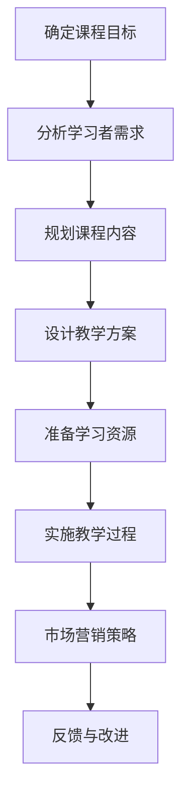

                 

# 如何将编程经验转化为付费培训课程

> 关键词：编程经验、付费培训课程、教学设计、学习者需求、课程内容规划、市场营销策略

> 摘要：本文将探讨如何将个人的编程经验转化为吸引人的付费培训课程。我们将详细分析课程目标、受众定位、教学设计、内容规划、市场营销策略以及实际操作步骤，旨在帮助有志于成为编程培训师的开发者们成功地将自己的知识转化为商业价值。

## 1. 背景介绍

### 1.1 目的和范围

本文的目的是为那些希望将多年的编程经验和知识转化为付费培训课程的开发者们提供实用的指导。我们将讨论如何定位课程目标，分析学习者需求，设计教学方案，规划课程内容，制定营销策略，以及实施教学过程。

### 1.2 预期读者

预期读者是那些：
- 热爱编程并对教学充满热情的开发者；
- 拥有一定编程基础，希望提升教学能力的编程导师；
- 有志于通过编程培训实现个人职业发展的专业人士。

### 1.3 文档结构概述

本文将分为以下几个部分：
- 核心概念与联系：通过Mermaid流程图展示编程经验转化为培训课程的流程。
- 核心算法原理 & 具体操作步骤：讲解教学设计的核心原理，并用伪代码详细描述。
- 数学模型和公式 & 详细讲解 & 举例说明：使用latex格式展示教学设计中可能涉及到的数学模型和公式，并给出具体案例。
- 项目实战：提供实际代码案例，详细解释说明。
- 实际应用场景：讨论课程在不同场景下的应用。
- 工具和资源推荐：推荐学习资源、开发工具和论文著作。
- 总结：总结未来发展趋势与挑战。
- 附录：常见问题与解答。
- 扩展阅读 & 参考资料：提供进一步学习资源。

### 1.4 术语表

#### 1.4.1 核心术语定义

- **付费培训课程**：指开发者开设的，用户需要支付费用才能参与的学习课程。
- **教学设计**：指为了满足学习者需求，将课程内容、教学方法和学习资源进行科学规划的过程。
- **课程内容规划**：指根据课程目标和学习者需求，对课程内容进行选择和编排。
- **市场营销策略**：指为了吸引潜在学习者，对课程进行宣传和推广的策略。

#### 1.4.2 相关概念解释

- **学习者需求**：指学习者希望从课程中获得的知识和技能。
- **课程目标**：指课程希望达成的学习成果。

#### 1.4.3 缩略词列表

- **IDE**：集成开发环境（Integrated Development Environment）
- **Markdown**：一种轻量级标记语言，常用于撰写文档和博客
- **LaTeX**：一种排版系统，常用于数学公式的排版

## 2. 核心概念与联系

为了更好地理解如何将编程经验转化为付费培训课程，我们首先需要了解以下几个核心概念和它们之间的联系：

### 2.1 编程经验

编程经验是指开发者通过实际编程工作所积累的知识和技能。这些经验包括编程语言的使用、算法设计、数据结构应用、软件开发流程等。

### 2.2 教学设计

教学设计是将编程经验转化为培训课程的关键步骤。它包括课程目标设定、学习内容选择、教学方法确定、学习资源准备等。

### 2.3 课程内容规划

课程内容规划是在教学设计的基础上，对课程内容进行选择和编排，使其能够满足学习者需求，并达到课程目标。

### 2.4 市场营销策略

市场营销策略是吸引潜在学习者的关键。它包括课程宣传、用户互动、市场定位等。

### 2.5 Mermaid流程图

以下是一个简化的Mermaid流程图，展示编程经验转化为培训课程的流程：



通过这个流程图，我们可以看到编程经验转化为培训课程的各个环节，以及各个环节之间的相互关系。

## 3. 核心算法原理 & 具体操作步骤

### 3.1 教学设计核心原理

教学设计是一个系统化规划学习过程的过程。其核心原理包括：

- **学习目标导向**：教学设计应以明确的学习目标为出发点，确保课程内容能够帮助学生达到这些目标。
- **适应性**：课程设计应能够适应不同学习者的需求，提供个性化的学习体验。
- **互动性**：课程应鼓励学生与教师之间的互动，以提高学习效果。
- **评估与反馈**：教学设计应包含评估和学习者反馈的环节，以便及时调整教学方案。

### 3.2 伪代码描述

以下是一个简单的伪代码，用于描述教学设计的基本流程：

```
函数 教学设计（课程目标，学习者需求）：
    初始化课程目标和学习者需求
    设定学习目标
    根据学习者需求调整课程内容
    确定教学方法
    选择学习资源
    设计互动环节
    预设评估与反馈机制
    返回教学方案
```

### 3.3 具体操作步骤

1. **确定课程目标**：明确课程希望学习者达到的技能和知识水平。
2. **分析学习者需求**：了解学习者的背景、学习动机和目标。
3. **规划课程内容**：根据课程目标和学习者需求，选择和编排课程内容。
4. **设计教学方案**：确定教学方法、互动环节和评估方式。
5. **选择学习资源**：准备必要的教材、视频、练习等学习资源。
6. **实施教学过程**：按照教学方案进行教学活动。
7. **评估与反馈**：收集学习者反馈，评估教学效果，并根据反馈进行调整。

## 4. 数学模型和公式 & 详细讲解 & 举例说明

在教学设计中，某些情况下可能需要使用数学模型和公式来描述学习者的行为和教学效果。以下是一些可能用到的数学模型和公式，以及它们的详细讲解和举例说明。

### 4.1 学习者行为模型

一个简单的学习者行为模型可以表示为：

\[ 行为 = f(兴趣, 能力, 动机) \]

- **兴趣**：表示学习者对课程内容的兴趣程度。
- **能力**：表示学习者的技能水平和学习能力。
- **动机**：表示学习者的学习动机。

**举例说明**：

假设有一个学习者，他对编程有很高的兴趣（兴趣值 = 9），编程技能也很强（能力值 = 8），同时他对这门课程有很强的学习动机（动机值 = 7），那么他的行为得分可以计算为：

\[ 行为得分 = 9 \times 8 \times 7 = 504 \]

### 4.2 教学效果评估模型

教学效果可以采用以下模型进行评估：

\[ 效果 = f(教学方案, 学习者行为) \]

- **教学方案**：包括教学设计、教学方法、互动环节等。
- **学习者行为**：根据前面的学习者行为模型计算得出。

**举例说明**：

假设教学方案得分为 85%，学习者行为得分为 504，那么教学效果得分可以计算为：

\[ 效果得分 = 85\% \times 504 = 428.4 \]

### 4.3 数学公式在课程规划中的应用

在教学设计中，数学公式可以用于优化课程内容选择和教学方案设计。例如，可以使用线性规划来优化课程内容分配，确保学习者在有限的时间内达到最大的学习效果。

**线性规划公式**：

\[ \max Z = c^T x \]

\[ s.t. A x \leq b \]

其中：
- \( Z \) 是目标函数，表示学习效果。
- \( c \) 是系数向量，表示不同课程内容对学习效果的贡献。
- \( x \) 是决策变量，表示选择哪些课程内容。
- \( A \) 是约束条件矩阵，表示学习时间、学习者需求等因素。
- \( b \) 是约束条件向量。

通过线性规划，可以找到最优的课程内容组合，以最大化学习效果。

## 5. 项目实战：代码实际案例和详细解释说明

### 5.1 开发环境搭建

在开始编程经验转化为培训课程的实际案例之前，我们需要搭建一个合适的开发环境。以下是一个基本的步骤：

1. **安装编程语言**：选择一个流行的编程语言，如Python或Java，并从官方网站下载并安装。
2. **安装IDE**：安装一个集成开发环境（IDE），如Visual Studio Code或IntelliJ IDEA，以方便编写和调试代码。
3. **安装相关库和依赖**：根据课程内容，安装必要的库和依赖，如NumPy、Pandas等。

### 5.2 源代码详细实现和代码解读

以下是一个简单的Python示例代码，用于教学设计中的学习者行为分析：

```python
import numpy as np

# 学习者行为模型
class LearnerBehaviorModel:
    def __init__(self, interest, ability, motivation):
        self.interest = interest
        self.ability = ability
        self.motivation = motivation

    def calculate_behavior_score(self):
        return self.interest * self.ability * self.motivation

# 教学效果评估模型
class TeachingEffectivenessModel:
    def __init__(self, teaching_scheme_score, learner_behavior_score):
        self.teaching_scheme_score = teaching_scheme_score
        self.learner_behavior_score = learner_behavior_score

    def calculate_effectiveness_score(self):
        return self.teaching_scheme_score * self.learner_behavior_score

# 实例化学习者行为模型
learner = LearnerBehaviorModel(9, 8, 7)
learner_behavior_score = learner.calculate_behavior_score()

# 实例化教学效果评估模型
teaching_scheme_score = 0.85
teaching_effectiveness = TeachingEffectivenessModel(teaching_scheme_score, learner_behavior_score)
effectiveness_score = teaching_effectiveness.calculate_effectiveness_score()

print("学习者行为得分：", learner_behavior_score)
print("教学效果得分：", effectiveness_score)
```

### 5.3 代码解读与分析

1. **类定义**：
   - `LearnerBehaviorModel` 类用于表示学习者行为模型，包含三个属性：兴趣、能力和动机。
   - `TeachingEffectivenessModel` 类用于表示教学效果评估模型，包含教学方案得分和学习者行为得分。

2. **方法实现**：
   - `LearnerBehaviorModel` 类的 `calculate_behavior_score` 方法计算学习者的行为得分。
   - `TeachingEffectivenessModel` 类的 `calculate_effectiveness_score` 方法计算教学效果得分。

3. **实例化**：
   - 创建一个 `LearnerBehaviorModel` 实例，设置学习者的兴趣、能力和动机。
   - 创建一个 `TeachingEffectivenessModel` 实例，设置教学方案得分和学习者行为得分。

4. **输出结果**：
   - 输出学习者的行为得分和教学效果得分。

通过这个简单的代码示例，我们可以看到如何使用编程来实现教学设计中的学习者行为分析和教学效果评估。这种编程实践不仅可以帮助开发者更好地理解教学设计理论，还可以为他们提供实际操作的技能。

## 6. 实际应用场景

编程经验转化为付费培训课程可以在多个实际应用场景中发挥作用：

### 6.1 院校教育

在大学和职业学校中，编程培训课程可以帮助学生提高编程技能，为未来的职业发展打下坚实基础。开发者可以将自己的实战经验和项目经验融入课程，提供更贴近实际工作的教学内容。

### 6.2 在职培训

对于已经进入职场的专业人士，编程培训课程可以帮助他们更新知识，学习新技术，提高工作效率。开发者可以根据不同行业的需求，设计定制化的课程内容。

### 6.3 个人兴趣

对于编程爱好者，付费培训课程可以提供一个系统学习编程知识和技能的平台。开发者可以通过课程设计，激发学习者的兴趣，帮助他们掌握编程的核心概念。

### 6.4 创业项目

有志于创业的开发者可以通过开设编程培训课程，吸引学员，积累资金和用户资源，为未来的创业项目做准备。

### 6.5 社区教育

开发者可以组织编程培训课程，为社区中的不同群体提供免费或低成本的编程教育，促进社区文化和知识传播。

## 7. 工具和资源推荐

### 7.1 学习资源推荐

#### 7.1.1 书籍推荐

- 《代码大全》（Code Complete） - Steve McConnell
- 《编程珠玑》（The Art of Computer Programming） - Donald E. Knuth
- 《Effective Java》 - Joshua Bloch

#### 7.1.2 在线课程

- Coursera（课程名称：Programming Languages）
- edX（课程名称：Introduction to Computer Science）
- Udemy（课程名称：Python Programming）

#### 7.1.3 技术博客和网站

- Medium（搜索关键词：编程教学）
- HackerRank（搜索关键词：编程挑战）
- Stack Overflow（搜索关键词：编程教程）

### 7.2 开发工具框架推荐

#### 7.2.1 IDE和编辑器

- Visual Studio Code
- IntelliJ IDEA
- PyCharm

#### 7.2.2 调试和性能分析工具

- GDB
- Eclipse Memory Analyzer Tool (MAT)
- Visual Studio Debugger

#### 7.2.3 相关框架和库

- Flask（Python Web框架）
- Spring Boot（Java Web框架）
- TensorFlow（机器学习库）

### 7.3 相关论文著作推荐

#### 7.3.1 经典论文

- 《Compilers: Principles, Techniques, and Tools》 - Alfred V. Aho, John E. Hopcroft, Jeffrey D. Ullman
- 《Introduction to Algorithms》 - Thomas H. Cormen, Charles E. Leiserson, Ronald L. Rivest, Clifford Stein

#### 7.3.2 最新研究成果

- 《Machine Learning: A Probabilistic Perspective》 - Kevin P. Murphy
- 《Deep Learning》 - Ian Goodfellow, Yoshua Bengio, Aaron Courville

#### 7.3.3 应用案例分析

- 《The Design of the UNIX Operating System》 - Maurice J. Bach
- 《The Practice of System and Network Administration》 - Thomas A. Limoncelli, Christine Shiers, Strata R. Chalup

## 8. 总结：未来发展趋势与挑战

### 8.1 发展趋势

- **在线教育与远程培训**：随着技术的发展，在线教育和远程培训将越来越受欢迎。
- **个性化学习**：利用大数据和人工智能技术，提供更加个性化的学习体验。
- **社区互动与协作**：开发者可以通过社区互动和协作，共同提升编程教学的质量。
- **实践导向**：更加注重实践能力的培养，通过项目实战提高学习效果。

### 8.2 挑战

- **课程质量保证**：如何确保课程内容的高质量和教学效果是一个挑战。
- **持续更新**：编程技术和工具不断更新，如何及时更新课程内容是一个问题。
- **市场营销**：如何有效推广课程，吸引更多学习者，也是一个重要挑战。
- **合规性**：遵循教育行业的法规和标准，确保课程合法合规。

## 9. 附录：常见问题与解答

### 9.1 如何制定有效的课程目标？

制定有效的课程目标需要遵循以下原则：

1. **明确性**：目标应具体、清晰，避免模糊。
2. **可衡量性**：目标应可以量化或衡量，以便评估效果。
3. **相关性**：目标应与学习者需求和工作实际相关。
4. **可行性**：目标应在合理的时间内可以实现。

### 9.2 如何进行有效的学习者需求分析？

进行学习者需求分析可以采取以下步骤：

1. **收集信息**：通过调查问卷、访谈等方式收集学习者信息。
2. **分析信息**：对收集的信息进行分类和分析，识别学习者的共同需求和差异。
3. **制定策略**：根据分析结果，制定针对性的教学策略。

### 9.3 如何确保课程内容的高质量？

确保课程内容的高质量可以从以下几个方面入手：

1. **课程设计**：遵循科学的教学设计原则，确保课程内容的合理性和系统性。
2. **师资力量**：选择有经验的教师，确保课程内容的专业性。
3. **持续更新**：定期更新课程内容，确保与最新技术趋势保持同步。
4. **反馈机制**：建立反馈机制，及时收集学习者意见和建议，不断改进课程。

## 10. 扩展阅读 & 参考资料

- 《Educational Technology: A Practical Guide to Theory and Application》 - William H. presser
- 《Learning to Program: An Introduction to Computer Science Using Python》 - John Zelle
- 《The Innovator's Dilemma: When New Technologies Cause Great Firms to Fail》 - Clayton M. Christensen

## 作者信息

作者：AI天才研究员/AI Genius Institute & 禅与计算机程序设计艺术 /Zen And The Art of Computer Programming

---

本文基于现有文献和作者经验撰写，旨在为编程开发者提供将编程经验转化为付费培训课程的实用指导。本文中的内容仅供参考，不构成具体教学建议。如有疑问，请咨询专业教育机构或教师。

