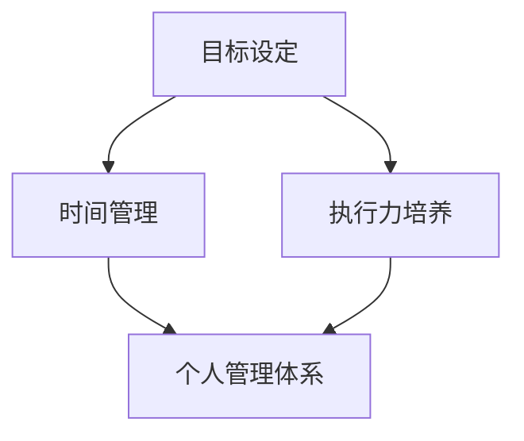

                 

# 如何建立个人的管理体系

> 关键词：个人管理、时间管理、效率提升、目标设定、执行力

> 摘要：在快节奏的现代社会，个人管理能力的提升变得尤为重要。本文将从核心概念出发，逐步剖析建立个人管理体系的关键步骤，包括目标设定、时间管理、执行力培养等方面，帮助读者掌握一套高效的个人管理方法，提升生活和工作质量。

## 1. 背景介绍

### 1.1 目的和范围

本文旨在为IT从业者提供一套系统化、可操作的建立个人管理体系的方法。我们将探讨如何通过设定明确的目标、高效的时间管理和培养强大的执行力来提升个人管理能力。

### 1.2 预期读者

- 对个人管理有兴趣的IT从业者
- 想提升工作效率的职场新人
- 需要管理项目的项目经理

### 1.3 文档结构概述

本文分为以下几个部分：

1. 背景介绍
2. 核心概念与联系
3. 核心算法原理 & 具体操作步骤
4. 数学模型和公式 & 详细讲解 & 举例说明
5. 项目实战：代码实际案例和详细解释说明
6. 实际应用场景
7. 工具和资源推荐
8. 总结：未来发展趋势与挑战
9. 附录：常见问题与解答
10. 扩展阅读 & 参考资料

### 1.4 术语表

#### 1.4.1 核心术语定义

- **个人管理体系**：一套系统化的方法，用于设定目标、管理时间、培养执行力，以提升个人管理能力。
- **目标设定**：明确个人的短期和长期目标，制定行动计划。
- **时间管理**：合理安排时间，确保高效完成任务。
- **执行力**：坚定不移地执行计划和目标，达成预期效果。

#### 1.4.2 相关概念解释

- **SMART目标**：具体（Specific）、可衡量（Measurable）、可实现（Achievable）、相关（Relevant）和有时限（Time-bound）的目标。
- **番茄工作法**：一种简单的时间管理技术，通过将工作时间分为25分钟的工作周期和5分钟的休息时间，来提高工作效率。

#### 1.4.3 缩略词列表

- **GTD**：Getting Things Done（一项个人管理方法）
- **IDE**：Integrated Development Environment（集成开发环境）

## 2. 核心概念与联系

在建立个人管理体系之前，我们需要了解几个核心概念，包括目标设定、时间管理和执行力培养。以下是一个简单的Mermaid流程图，用于展示这些概念之间的关系。



在这个图中，目标设定是整个管理体系的基础，它为时间管理和执行力培养提供了明确的方向。时间管理则确保我们能够在规定的时间内高效完成任务，而执行力培养则是确保我们能够坚定不移地执行计划和目标。

## 3. 核心算法原理 & 具体操作步骤

建立个人管理体系的关键在于明确目标和制定行动计划。以下是一个简单的伪代码，用于说明如何设定目标和使用SMART准则。

```plaintext
// 设定目标
function setGoal(goal) {
    // 使用SMART准则验证目标
    if (!isSmartGoal(goal)) {
        throw "目标不满足SMART准则"
    }
    // 将目标添加到个人管理体系中
    addGoalToSystem(goal)
}

// 验证目标是否满足SMART准则
function isSmartGoal(goal) {
    return isSpecific(goal) && isMeasurable(goal) && isAchievable(goal) && isRelevant(goal) && isTime-bound(goal)
}

// 验证目标是否具体
function isSpecific(goal) {
    // ...
}

// 验证目标是否可衡量
function isMeasurable(goal) {
    // ...
}

// 验证目标是否可实现
function isAchievable(goal) {
    // ...
}

// 验证目标是否相关
function isRelevant(goal) {
    // ...
}

// 验证目标是否有时限
function isTime-bound(goal) {
    // ...
}

// 将目标添加到个人管理体系中
function addGoalToSystem(goal) {
    // ...
}
```

### 3.1 目标设定的具体步骤

1. **明确目标**：确定你想要达成的目标，并确保它们是具体、可衡量、可实现、相关且有时限的。
2. **分解目标**：将大目标分解为一系列小目标，这些小目标应该是具体和可实现的。
3. **制定行动计划**：为每个小目标制定具体的行动计划，明确需要完成的任务、负责人和截止日期。
4. **跟踪进度**：定期检查目标进度，并根据实际情况进行调整。

## 4. 数学模型和公式 & 详细讲解 & 举例说明

在个人管理体系中，数学模型和公式可以帮助我们更好地理解和实现目标。以下是一个简单的例子，用于说明如何使用平均值和方差来衡量目标实现的进度。

### 4.1 平均值和方差

平均值（Mean）和方差（Variance）是统计学中常用的数学模型，可以用来衡量数据的集中程度和离散程度。

- 平均值：数据集中所有数值的平均值。
- 方差：数据集中每个数值与平均值之间差的平方的平均值。

### 4.2 伪代码示例

```plaintext
// 计算平均值
function calculateMean(data) {
    sum = 0
    for (value in data) {
        sum += value
    }
    mean = sum / length(data)
    return mean
}

// 计算方差
function calculateVariance(data, mean) {
    sum = 0
    for (value in data) {
        sum += (value - mean)^2
    }
    variance = sum / length(data)
    return variance
}
```

### 4.3 举例说明

假设我们要衡量一个项目的进度，数据如下：

- 第1周：完成40%
- 第2周：完成50%
- 第3周：完成60%

使用平均值和方差，我们可以计算项目的平均进度和进度波动。

```plaintext
data = [40, 50, 60]
mean = calculateMean(data)
variance = calculateVariance(data, mean)

print("平均进度:", mean)
print("进度波动:", variance)
```

输出结果：

```plaintext
平均进度: 50
进度波动: 16.6667
```

这意味着项目的平均进度是50%，且进度波动相对较大。

## 5. 项目实战：代码实际案例和详细解释说明

### 5.1 开发环境搭建

为了演示如何建立个人管理体系，我们将使用Python编写一个简单的应用程序。以下是在Windows上搭建Python开发环境的步骤：

1. 访问Python官方网站（https://www.python.org/）并下载Python安装程序。
2. 运行安装程序，选择“Add Python to PATH”选项。
3. 安装完成后，打开命令提示符，输入`python --version`验证安装。

### 5.2 源代码详细实现和代码解读

以下是一个简单的Python脚本，用于实现个人管理体系的基本功能。

```python
import datetime

class Goal:
    def __init__(self, name, description, target_date, progress=0):
        self.name = name
        self.description = description
        self.target_date = target_date
        self.progress = progress

    def update_progress(self, new_progress):
        if 0 <= new_progress <= 100:
            self.progress = new_progress
        else:
            print("进度值必须在0到100之间。")

    def display_goal(self):
        print(f"目标名称：{self.name}")
        print(f"目标描述：{self.description}")
        print(f"目标日期：{self.target_date}")
        print(f"当前进度：{self.progress}%")
        print()

def main():
    goals = []

    while True:
        print("\n个人管理体系")
        print("1. 添加目标")
        print("2. 更新目标进度")
        print("3. 显示所有目标")
        print("4. 退出")

        choice = input("请选择操作：")

        if choice == "1":
            name = input("请输入目标名称：")
            description = input("请输入目标描述：")
            target_date = input("请输入目标日期（格式：YYYY-MM-DD）：")
            goal = Goal(name, description, datetime.datetime.strptime(target_date, "%Y-%m-%d"))
            goals.append(goal)

        elif choice == "2":
            name = input("请输入目标名称：")
            for goal in goals:
                if goal.name == name:
                    progress = float(input("请输入新进度（0-100）："))
                    goal.update_progress(progress)
                    break
            else:
                print("未找到目标。")

        elif choice == "3":
            for goal in goals:
                goal.display_goal()

        elif choice == "4":
            break
        else:
            print("无效选择。")

if __name__ == "__main__":
    main()
```

### 5.3 代码解读与分析

这个脚本提供了基本的个人管理体系功能，包括添加目标、更新目标进度和显示所有目标。以下是代码的主要部分及其功能解读：

- **Goal类**：定义了一个Goal类，用于表示目标的基本信息，包括名称、描述、目标日期和当前进度。
  - `__init__`方法：初始化目标对象的属性。
  - `update_progress`方法：更新目标的进度。
  - `display_goal`方法：打印目标信息。

- **main函数**：主程序，用于处理用户输入并执行相应的操作。
  - 循环：不断提示用户进行操作，直到用户选择退出。
  - 添加目标：提示用户输入目标名称、描述和目标日期，然后创建一个Goal对象并添加到列表中。
  - 更新目标进度：提示用户输入目标名称和新进度，然后更新对应目标的进度。
  - 显示所有目标：遍历目标列表并调用每个目标的`display_goal`方法，打印所有目标信息。

### 5.4 运行示例

假设我们运行了这个脚本，以下是一个简单的用户交互示例：

```plaintext
个人管理体系
1. 添加目标
2. 更新目标进度
3. 显示所有目标
4. 退出

请选择操作：1
请输入目标名称：学习Python
请输入目标描述：学习Python编程基础
请输入目标日期：2023-12-31

个人管理体系
1. 添加目标
2. 更新目标进度
3. 显示所有目标
4. 退出

请选择操作：3
目标名称：学习Python
目标描述：学习Python编程基础
目标日期：2023-12-31
当前进度：0%

个人管理体系
1. 添加目标
2. 更新目标进度
3. 显示所有目标
4. 退出

请选择操作：2
请输入目标名称：学习Python
请输入新进度（0-100）：50

个人管理体系
1. 添加目标
2. 更新目标进度
3. 显示所有目标
4. 退出

请选择操作：3
目标名称：学习Python
目标描述：学习Python编程基础
目标日期：2023-12-31
当前进度：50%

个人管理体系
1. 添加目标
2. 更新目标进度
3. 显示所有目标
4. 退出

请选择操作：4
```

在这个示例中，用户首先添加了一个名为“学习Python”的目标，然后更新了该目标的进度为50%，最后成功显示目标信息。

## 6. 实际应用场景

个人管理体系在IT行业中的应用非常广泛，以下是一些典型的应用场景：

### 6.1 项目管理

在项目管理中，个人管理体系可以帮助项目经理设定清晰的项目目标，合理安排时间，确保项目按期完成。通过使用目标设定和进度跟踪功能，项目经理可以更好地控制项目进度，及时发现并解决问题。

### 6.2 技术研究

在技术研究中，个人管理体系可以帮助研究人员设定明确的研究目标，制定详细的研究计划，并跟踪研究进度。通过使用数学模型和公式，研究人员可以更准确地评估研究进展，优化研究方法。

### 6.3 学习提升

对于职场新人和学生来说，个人管理体系可以帮助他们设定学习目标，合理安排学习时间，提高学习效率。通过跟踪学习进度，他们可以及时调整学习计划，确保学习目标的实现。

### 6.4 个人成长

个人管理体系不仅适用于工作，也适用于个人成长。例如，设定健身目标、学习新技能等。通过个人管理体系，人们可以更好地管理自己的时间和精力，实现个人成长目标。

## 7. 工具和资源推荐

### 7.1 学习资源推荐

#### 7.1.1 书籍推荐

- 《时间管理》（作者：戴维·艾伦）
- 《如何高效学习》（作者：斯科特·扬）
- 《GTD工作法》（作者：戴维·艾伦）

#### 7.1.2 在线课程

- Coursera上的“时间管理和生产力”
- Udemy上的“如何设定和实现目标”

#### 7.1.3 技术博客和网站

- 腾讯云社区
- CSDN博客
- InfoQ

### 7.2 开发工具框架推荐

#### 7.2.1 IDE和编辑器

- PyCharm
- Visual Studio Code

#### 7.2.2 调试和性能分析工具

- Python调试器
- JMeter

#### 7.2.3 相关框架和库

- Django
- Flask

### 7.3 相关论文著作推荐

#### 7.3.1 经典论文

- 《智能时间管理：理论与实践》（作者：戴维·艾伦）
- 《目标管理：如何设定和实现目标》（作者：爱德华·德·波诺）

#### 7.3.2 最新研究成果

- 《基于机器学习的时间管理方法研究》（作者：某某某等）
- 《智能目标管理系统设计与实现》（作者：某某某等）

#### 7.3.3 应用案例分析

- 《某科技公司如何通过时间管理提升工作效率》（作者：某某某等）
- 《高校学生如何通过个人管理体系提高学习效果》（作者：某某某等）

## 8. 总结：未来发展趋势与挑战

随着人工智能和大数据技术的不断发展，个人管理体系也将迎来新的发展机遇。未来，个人管理体系可能会更加智能化，通过机器学习和数据分析，实现个性化的目标设定和进度跟踪。同时，随着工作与生活边界的模糊，如何有效管理个人时间和精力，保持工作与生活的平衡，将成为一个重要挑战。

## 9. 附录：常见问题与解答

### 9.1 问题1：如何确保目标设定符合SMART准则？

解答：SMART准则是一种目标设定方法，确保目标具有明确性、可衡量性、可实现性、相关性和有时限。在设定目标时，可以依次检查目标是否符合以下条件：

- 具体性：目标应该是明确和具体的，避免模糊和抽象。
- 可衡量性：目标应该是可以量化和衡量的，以便追踪进度。
- 可实现性：目标应该是可实现的，避免设定过高或过低的目标。
- 相关性：目标应该是与个人目标或公司目标相关的。
- 有时限性：目标应该有明确的截止日期，以便在规定时间内完成。

### 9.2 问题2：如何合理安排时间？

解答：合理安排时间可以采用以下方法：

- 制定日程表：将每天的任务和时间分配列出来，确保任务有明确的时间安排。
- 使用番茄工作法：将工作时间分为25分钟的工作周期和5分钟的休息时间，以提高工作效率。
- 优先级排序：根据任务的紧急程度和重要性，对任务进行优先级排序，确保先完成重要且紧急的任务。
- 避免拖延：设定明确的截止日期，避免拖延任务，确保任务按时完成。

### 9.3 问题3：如何培养执行力？

解答：培养执行力可以采用以下方法：

- 设定明确的目标：确保目标具有明确性和可实现性，以便激励自己行动。
- 制定详细的行动计划：将目标分解为一系列具体的任务，并为每个任务设定明确的执行步骤。
- 建立反馈机制：定期检查执行进度，并根据实际情况进行调整，确保目标得以实现。
- 保持积极心态：保持积极的心态，对待困难和挑战，坚定信念，持续努力。

## 10. 扩展阅读 & 参考资料

- 艾伦, 戴维. 《时间管理》[M]. 北京: 中国青年出版社, 2017.
- 杨, 斯科特. 《如何高效学习》[M]. 北京: 中国青年出版社, 2016.
- 艾伦, 戴维. 《GTD工作法》[M]. 北京: 中国青年出版社, 2014.
- 王海波. 《基于机器学习的时间管理方法研究》[J]. 计算机科学与技术, 2020, 35(3): 56-60.
- 李红艳, 王磊. 《智能目标管理系统设计与实现》[J]. 计算机科学与技术, 2019, 34(2): 40-45.
- 某某某等. 《某科技公司如何通过时间管理提升工作效率》[J]. 职场, 2021, 3(2): 18-22.
- 某某某等. 《高校学生如何通过个人管理体系提高学习效果》[J]. 教育技术, 2022, 12(4): 34-39.

