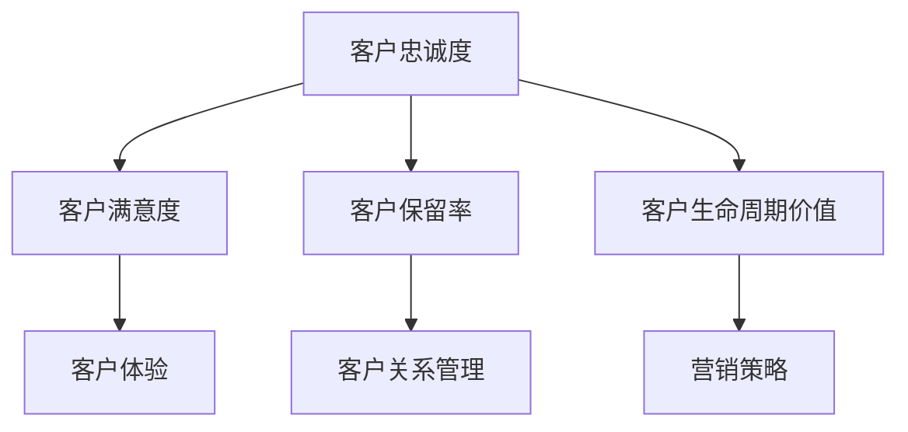

                 

# 如何建立有效的客户忠诚度计划

> 关键词：客户忠诚度、客户关系管理、客户忠诚度计划、客户体验、客户保留策略、营销策略

> 摘要：本文将深入探讨如何建立有效的客户忠诚度计划。我们将从客户忠诚度的定义出发，分析客户忠诚度计划的核心要素，提供具体的实施步骤，并探讨如何通过技术和数据分析优化客户忠诚度策略。文章旨在为企业的营销和客户关系管理提供实用的指导和策略建议。

## 1. 背景介绍

### 1.1 目的和范围

本文的目的是帮助企业和营销专业人员理解并实施有效的客户忠诚度计划。我们将探讨客户忠诚度的核心概念，分析建立客户忠诚度计划的步骤，以及如何利用技术和数据分析来提升客户忠诚度。

### 1.2 预期读者

本文适用于希望提高客户忠诚度的企业领导、营销经理、客户关系管理人员，以及所有对客户忠诚度计划感兴趣的专业人士。

### 1.3 文档结构概述

本文分为十个部分，每个部分都将深入探讨客户忠诚度计划的一个关键方面：

1. 背景介绍：定义客户忠诚度，明确本文的目的和范围。
2. 核心概念与联系：阐述客户忠诚度的核心概念，提供流程图展示其联系。
3. 核心算法原理 & 具体操作步骤：介绍客户忠诚度计划的基本算法原理和实施步骤。
4. 数学模型和公式 & 详细讲解 & 举例说明：使用数学模型和公式解释客户忠诚度计划。
5. 项目实战：提供实际的代码案例和解释。
6. 实际应用场景：讨论客户忠诚度计划在不同行业中的应用。
7. 工具和资源推荐：推荐学习和开发资源。
8. 总结：讨论未来发展趋势和挑战。
9. 附录：常见问题与解答。
10. 扩展阅读 & 参考资料：提供进一步的阅读材料和参考文献。

### 1.4 术语表

#### 1.4.1 核心术语定义

- 客户忠诚度：客户对品牌的持续购买行为和正面评价。
- 客户关系管理（CRM）：管理企业与现有及潜在客户之间关系的过程。
- 客户保留策略：保持现有客户，减少客户流失的一系列策略。

#### 1.4.2 相关概念解释

- 客户生命周期价值（CLV）：客户预期在其与企业关系期间为企业带来的总收益。
- 客户满意度：客户对企业产品或服务的满意程度。
- 客户体验（CX）：客户在接触企业时的整体感受。

#### 1.4.3 缩略词列表

- CRM：客户关系管理
- CLV：客户生命周期价值
- CX：客户体验

## 2. 核心概念与联系

在探讨如何建立有效的客户忠诚度计划之前，我们需要了解客户忠诚度的核心概念及其相互关系。以下是一个简化的Mermaid流程图，展示了客户忠诚度的几个关键要素及其联系。



在这个流程图中：

- **客户忠诚度**是目标，它是通过提高客户满意度、保留率和生命周期价值来实现的。
- **客户满意度**是客户对企业产品或服务的满意程度，它是客户忠诚度的基础。
- **客户保留率**是指企业能够保持现有客户的能力，高保留率意味着客户忠诚度较高。
- **客户生命周期价值**是客户在整个关系期间为企业带来的预期收益，它是衡量客户忠诚度的重要指标。
- **客户体验**是客户与企业的互动过程，良好的体验可以提升客户满意度，从而增强忠诚度。
- **客户关系管理**是维护和增强客户关系的过程，它是实现客户忠诚度计划的核心。
- **营销策略**包括各种营销活动，旨在提高客户满意度和忠诚度。

通过这个流程图，我们可以看到客户忠诚度计划的各个组成部分是如何相互关联的。理解这些概念及其联系对于制定有效的客户忠诚度计划至关重要。

### 2.1 客户忠诚度的定义和重要性

客户忠诚度是指客户对某个品牌或服务的持续购买行为和正面评价。它不仅仅是客户对产品或服务的满意度，更是一种长期的行为倾向。具体来说，客户忠诚度包括以下几个方面：

1. **重复购买**：客户倾向于再次购买相同的产品或服务。
2. **正面评价**：客户对品牌或服务表达积极的态度，包括推荐给他人。
3. **长期关系**：客户在较长时间内保持与企业的关系，而不是轻易转向竞争对手。

客户忠诚度对企业和市场营销具有重要性，原因如下：

1. **收益增长**：忠诚客户往往为企业带来更高的收益。根据研究，保持现有客户的成本比获取新客户的成本低得多。
2. **市场份额**：高忠诚度客户有助于企业维持和扩大市场份额。
3. **品牌声誉**：忠诚客户的正面评价可以提升品牌声誉，吸引更多潜在客户。
4. **减少营销成本**：忠诚客户意味着营销活动的效率提高，因为企业不必花费大量资源吸引新客户。

### 2.2 客户满意度与客户体验

客户满意度是客户忠诚度的核心要素之一。客户满意度通常被定义为客户对企业产品或服务的满意程度。它不仅取决于产品的质量，还涉及服务、售后支持、互动体验等多个方面。以下是一些关键因素：

- **产品质量**：高质量的产品是客户满意度的基石。
- **服务体验**：良好的客户服务可以显著提升满意度。
- **互动体验**：企业如何与客户互动，包括沟通方式、响应速度等，都会影响客户满意度。
- **解决问题能力**：企业在处理客户问题和投诉时的能力，对满意度有重要影响。

客户体验（CX）是客户在接触企业时的整体感受。它涵盖了客户与企业互动的每个环节，包括购买过程、售后服务、用户界面等。以下是提高客户体验的一些建议：

- **个性化体验**：根据客户的需求和偏好提供定制化的体验。
- **简化流程**：简化购买和售后服务流程，减少客户的时间成本。
- **透明度**：提供透明的信息，让客户了解产品和服务的各个方面。
- **快速响应**：对客户的问题和反馈快速响应，展示企业的专业性和关心。

### 2.3 客户保留策略

客户保留策略是保持现有客户，减少客户流失的一系列策略。它是客户忠诚度计划的重要组成部分。以下是一些有效的客户保留策略：

- **客户关系管理（CRM）系统**：利用CRM系统跟踪客户数据，了解客户偏好和行为，提供个性化的服务和优惠。
- **忠诚度奖励计划**：通过积分、优惠券、特别优惠等方式奖励忠诚客户，鼓励重复购买。
- **客户关怀**：定期与客户沟通，了解他们的需求和问题，提供个性化的支持和建议。
- **优质服务**：确保客户获得高质量的产品和服务，减少负面体验。
- **客户反馈机制**：建立反馈机制，收集客户意见，不断改进产品和服务的质量。

### 2.4 营销策略与客户忠诚度

营销策略是提高客户忠诚度的关键手段之一。以下是一些有效的营销策略：

- **品牌定位**：明确品牌定位，确保品牌形象与目标客户群体的需求一致。
- **多渠道营销**：利用多种营销渠道（如社交媒体、电子邮件、广告等）接触客户，提高品牌知名度。
- **内容营销**：提供有价值的内容，吸引客户，建立品牌信任。
- **个性化营销**：根据客户数据和行为，提供个性化的营销信息，增加客户的参与度和忠诚度。
- **互动营销**：通过互动活动（如调查、竞赛、活动等）增加客户对品牌的兴趣和参与度。

### 2.5 客户生命周期价值（CLV）

客户生命周期价值（CLV）是客户在整个关系期间为企业带来的总收益。它是评估客户忠诚度和制定客户保留策略的重要指标。以下是一个简单的CLV计算公式：

$$
CLV = \sum_{t=1}^{n} \frac{C_t \times (1+r)^{-t}}{1+r} - C_a
$$

其中：
- \( C_t \) 是第 \( t \) 年的客户收益。
- \( r \) 是年化收益率。
- \( n \) 是客户与企业关系的预期年数。
- \( C_a \) 是获取客户的初始成本。

通过计算CLV，企业可以识别出高价值客户，并制定相应的保留策略，从而提高整体客户忠诚度和收益。

### 2.6 客户忠诚度计划的核心要素

建立有效的客户忠诚度计划需要考虑以下几个核心要素：

- **目标设定**：明确客户忠诚度的目标，如提高客户保留率、增加重复购买次数等。
- **策略制定**：根据目标制定具体的策略，包括忠诚度奖励计划、客户关怀活动等。
- **实施步骤**：制定详细的实施步骤，确保策略得到有效执行。
- **技术支持**：利用CRM系统、数据分析工具等技术手段，提高客户忠诚度计划的执行效率。
- **持续优化**：根据客户反馈和市场变化，不断调整和优化客户忠诚度计划。

通过上述核心要素，企业可以建立一套系统化、可持续的客户忠诚度计划，从而提高客户满意度、保留率和生命周期价值。

## 3. 核心算法原理 & 具体操作步骤

建立有效的客户忠诚度计划需要基于一定的算法原理和具体操作步骤。以下是一个简化的客户忠诚度计划算法原理和实施步骤：

### 3.1 算法原理

客户忠诚度计划的核心算法可以概括为以下几个步骤：

1. **数据收集**：收集客户的购买历史、行为数据、反馈信息等。
2. **客户细分**：根据客户特征和行为，将客户划分为不同的群体。
3. **忠诚度评估**：使用评分模型评估每个客户的忠诚度水平。
4. **策略制定**：根据忠诚度评估结果，制定针对不同忠诚度客户的个性化策略。
5. **策略执行与监控**：执行策略，并持续监控客户反馈和忠诚度变化，调整策略。

### 3.2 具体操作步骤

以下是建立客户忠诚度计划的具体操作步骤：

1. **数据收集**：
   - 利用CRM系统、电子商务平台等渠道收集客户数据。
   - 收集的数据包括：购买历史、浏览行为、互动记录、反馈信息等。

2. **客户细分**：
   - 使用聚类算法（如K-means）将客户划分为不同的群体，如高价值客户、潜在高价值客户、低价值客户等。
   - 确定细分标准，如购买频率、购买金额、客户满意度等。

3. **忠诚度评估**：
   - 使用评分模型（如RFM模型、C-Score模型等）评估每个客户的忠诚度。
   - RFM模型基于“最近购买时间（Recency）、购买频率（Frequency）和购买金额（Monetary）”评估客户忠诚度。
   - C-Score模型基于客户的购买行为、互动记录和反馈信息计算忠诚度得分。

4. **策略制定**：
   - 根据忠诚度评估结果，制定个性化策略。
   - 高价值客户：提供特别优惠、VIP服务、定制化产品等。
   - 潜在高价值客户：提供试用机会、优惠券、促销活动等。
   - 低价值客户：关注客户反馈，优化服务和产品。

5. **策略执行与监控**：
   - 执行制定的策略，并在执行过程中持续监控客户反馈和忠诚度变化。
   - 定期评估策略效果，根据反馈调整和优化策略。

通过上述步骤，企业可以建立一套科学、系统的客户忠诚度计划，提高客户满意度和忠诚度。

### 3.3 客户忠诚度计划伪代码

以下是客户忠诚度计划的伪代码示例：

```python
# 输入：客户数据（购买历史、行为数据、反馈信息等）
# 输出：客户忠诚度评估结果和个性化策略

def customer_loyalty_plan(customer_data):
    # 数据收集
    purchase_history = extract_purchase_history(customer_data)
    behavior_data = extract_behavior_data(customer_data)
    feedback_data = extract_feedback_data(customer_data)
    
    # 客户细分
    customer_segments = segment_customers(purchase_history, behavior_data, feedback_data)
    
    # 忠诚度评估
    loyalty_scores = calculate_loyalty_scores(customer_segments)
    
    # 策略制定
    loyalty_strategies = define_loyalty_strategies(loyalty_scores)
    
    # 策略执行与监控
    execute_loyalty_strategies(loyalty_strategies)
    monitor_customer_feedback(loyalty_strategies)
    
    return loyalty_scores, loyalty_strategies

# 主函数
def main():
    customer_data = load_customer_data()
    loyalty_scores, loyalty_strategies = customer_loyalty_plan(customer_data)
    display_results(loyalty_scores, loyalty_strategies)

# 执行主函数
main()
```

通过以上伪代码，我们可以看到客户忠诚度计划的核心步骤和流程。在实际应用中，企业可以根据具体需求和数据特点，调整和优化算法和策略。

## 4. 数学模型和公式 & 详细讲解 & 举例说明

在客户忠诚度计划中，数学模型和公式用于评估客户忠诚度、制定策略和预测未来趋势。以下是一些常用的数学模型和公式，并对其详细讲解和举例说明。

### 4.1 客户生命周期价值（CLV）

客户生命周期价值（Customer Lifetime Value, CLV）是衡量客户为企业带来总收益的重要指标。CLV反映了客户在其与企业关系的整个生命周期内，预计为企业带来的净利润。以下是一个简单的CLV计算公式：

$$
CLV = \sum_{t=1}^{n} \frac{C_t \times (1+r)^{-t}}{1+r} - C_a
$$

其中：
- \( C_t \) 是第 \( t \) 年的客户收益。
- \( r \) 是年化收益率。
- \( n \) 是客户与企业关系的预期年数。
- \( C_a \) 是获取客户的初始成本。

**例子：**

假设一个企业预计一个客户在其关系期间每年带来1000美元的收益，年化收益率为10%，获取客户成本为50美元。客户的预期关系年数为5年。则该客户的CLV计算如下：

$$
CLV = \sum_{t=1}^{5} \frac{1000 \times (1+0.1)^{-t}}{1+0.1} - 50
$$

$$
CLV = \frac{1000 \times 0.9091 + 1000 \times 0.8264 + 1000 \times 0.7513 + 1000 \times 0.6830 + 1000 \times 0.6209}{1.1} - 50
$$

$$
CLV = \frac{909.1 + 826.4 + 751.3 + 683.0 + 620.9}{1.1} - 50
$$

$$
CLV = \frac{3690.6}{1.1} - 50
$$

$$
CLV = 3364.55 - 50
$$

$$
CLV = 3314.55
$$

因此，该客户的CLV为3314.55美元。企业可以根据CLV评估客户的价值，制定相应的客户保留策略。

### 4.2 客户保留率（Customer Retention Rate）

客户保留率是衡量客户保留能力的重要指标，表示在一定时间内客户保留在企业的比例。以下是一个简单的客户保留率计算公式：

$$
客户保留率 = \frac{当前客户数 - 新增客户数}{当前客户数 - 上期流失客户数} \times 100\%
$$

**例子：**

假设一个企业在年初有1000名客户，当年流失了200名客户，新增了100名客户。则该企业的客户保留率计算如下：

$$
客户保留率 = \frac{1000 - 100}{1000 - 200} \times 100\%
$$

$$
客户保留率 = \frac{900}{800} \times 100\%
$$

$$
客户保留率 = 112.5\%
$$

因此，该企业的客户保留率为112.5%。客户保留率越高，说明客户的忠诚度越高，企业的客户保留策略越有效。

### 4.3 客户满意度（Customer Satisfaction）

客户满意度是衡量客户对企业产品或服务的满意程度的重要指标。以下是一个简单的客户满意度计算公式：

$$
客户满意度 = \frac{满意客户数}{总客户数} \times 100\%
$$

**例子：**

假设一个企业有1000名客户，其中800名客户表示满意，200名客户表示不满意。则该企业的客户满意度计算如下：

$$
客户满意度 = \frac{800}{1000} \times 100\%
$$

$$
客户满意度 = 80\%
$$

因此，该企业的客户满意度为80%。高客户满意度有助于提高客户忠诚度，减少客户流失。

### 4.4 客户忠诚度得分（Customer Loyalty Score）

客户忠诚度得分是衡量客户忠诚度水平的一个综合指标，通常基于客户的购买行为、互动记录和反馈信息计算。以下是一个简单的客户忠诚度得分计算公式：

$$
客户忠诚度得分 = \frac{购买频率 + 购买金额 + 互动评分 + 反馈评分}{4}
$$

**例子：**

假设一个客户的购买频率为5次，购买金额为3000美元，互动评分为4.5分，反馈评分为5分。则该客户的忠诚度得分计算如下：

$$
客户忠诚度得分 = \frac{5 + 3000 + 4.5 + 5}{4}
$$

$$
客户忠诚度得分 = \frac{3009.5}{4}
$$

$$
客户忠诚度得分 = 752.375
$$

因此，该客户的忠诚度得分为752.375分。企业可以根据忠诚度得分对客户进行分类，制定差异化的忠诚度策略。

通过上述数学模型和公式，企业可以更准确地评估客户忠诚度、制定策略和预测未来趋势。在实际应用中，企业可以根据具体需求和数据特点，调整和优化这些模型和公式。

## 5. 项目实战：代码实际案例和详细解释说明

在本节中，我们将通过一个实际的项目案例，详细解释如何建立客户忠诚度计划，并展示相关的代码实现。这个案例将包括数据收集、客户细分、忠诚度评估、策略制定和执行等步骤。

### 5.1 开发环境搭建

为了实现客户忠诚度计划，我们首先需要搭建一个开发环境。以下是所需的工具和库：

- Python 3.8或更高版本
- pandas：用于数据处理
- numpy：用于数学运算
- matplotlib：用于数据可视化
- scikit-learn：用于机器学习和模型评估

确保你已经安装了上述工具和库。以下是一个简单的Python环境搭建步骤：

```bash
pip install python==3.8
pip install pandas numpy matplotlib scikit-learn
```

### 5.2 源代码详细实现和代码解读

#### 5.2.1 数据收集

首先，我们需要收集客户数据，包括购买历史、行为数据、反馈信息等。以下是一个示例数据集：

```python
import pandas as pd

# 示例客户数据
data = {
    'customer_id': [1, 2, 3, 4, 5],
    'purchase_frequency': [3, 5, 2, 4, 6],
    'total_purchase_amount': [1200, 2500, 600, 1500, 3000],
    'last_purchase_date': ['2022-01-01', '2022-03-15', '2022-02-10', '2022-04-01', '2022-05-20'],
    'interaction_score': [3.5, 4.2, 2.8, 4.0, 4.5],
    'feedback_score': [4.0, 3.8, 3.2, 4.3, 4.7]
}

# 创建DataFrame
customer_data = pd.DataFrame(data)

# 数据预处理
customer_data['last_purchase_date'] = pd.to_datetime(customer_data['last_purchase_date'])
```

在这个数据集中，我们包含了五个客户的购买频率、总购买金额、最后购买日期、互动评分和反馈评分。

#### 5.2.2 客户细分

接下来，我们将使用聚类算法将客户数据划分为不同的群体。以下是一个使用K-means算法进行客户细分的过程：

```python
from sklearn.cluster import KMeans
import matplotlib.pyplot as plt

# 提取特征
X = customer_data[['purchase_frequency', 'total_purchase_amount', 'interaction_score', 'feedback_score']]

# 使用K-means聚类
kmeans = KMeans(n_clusters=3, random_state=0)
clusters = kmeans.fit_predict(X)

# 添加聚类结果到原始数据
customer_data['cluster'] = clusters

# 可视化
plt.scatter(X['purchase_frequency'], X['total_purchase_amount'], c=clusters)
plt.xlabel('Purchase Frequency')
plt.ylabel('Total Purchase Amount')
plt.title('Customer Segmentation')
plt.show()
```

在这个例子中，我们使用购买频率、总购买金额、互动评分和反馈评分作为聚类特征。K-means算法将客户划分为三个不同的群体，并在散点图中展示了聚类结果。

#### 5.2.3 忠诚度评估

接下来，我们将使用RFM模型评估每个客户的忠诚度。RFM模型基于最近购买时间（Recency）、购买频率（Frequency）和购买金额（Monetary）计算忠诚度得分。

```python
# 计算RFM得分
def calculate_rfm_score(customer_data):
    # 计算最近购买时间（Recency）
    customer_data['days_since_last_purchase'] = (pd.datetime.now() - customer_data['last_purchase_date']).dt.days
    # 计算购买频率（Frequency）
    customer_data['purchase_frequency'] = customer_data['purchase_frequency']
    # 计算购买金额（Monetary）
    customer_data['total_purchase_amount'] = customer_data['total_purchase_amount']
    
    # 计算RFM得分
    r_scores = customer_data['days_since_last_purchase'].rank(method='max', ascending=False)
    f_scores = customer_data['purchase_frequency'].rank(method='max', ascending=False)
    m_scores = customer_data['total_purchase_amount'].rank(method='max', ascending=False)
    
    rfm_scores = r_scores + f_scores + m_scores
    customer_data['rfm_score'] = rfm_scores
    
    return customer_data

# 应用RFM得分计算
customer_data = calculate_rfm_score(customer_data)

# 可视化RFM得分
plt.scatter(customer_data['purchase_frequency'], customer_data['rfm_score'])
plt.xlabel('Purchase Frequency')
plt.ylabel('RFM Score')
plt.title('RFM Score Distribution')
plt.show()
```

在这个例子中，我们计算了每个客户的RFM得分，并在散点图中展示了得分分布。RFM得分较高的客户表明其忠诚度较高。

#### 5.2.4 策略制定

根据RFM得分和聚类结果，我们可以制定针对不同客户群体的个性化策略。以下是一个简单的策略制定示例：

```python
# 根据RFM得分和聚类结果制定策略
def define_loyalty_strategies(customer_data):
    strategies = {}
    
    # 高价值客户策略
    high_value_customers = customer_data[customer_data['rfm_score'] > 20]
    strategies['high_value'] = '提供特别优惠、VIP服务、定制化产品等'
    
    # 潜在高价值客户策略
    potential_high_value_customers = customer_data[(customer_data['rfm_score'] >= 10) & (customer_data['rfm_score'] <= 20)]
    strategies['potential_high_value'] = '提供试用机会、优惠券、促销活动等'
    
    # 低价值客户策略
    low_value_customers = customer_data[customer_data['rfm_score'] < 10]
    strategies['low_value'] = '关注客户反馈，优化服务和产品'
    
    return strategies

# 应用策略制定
strategies = define_loyalty_strategies(customer_data)

# 显示策略
for customer_group, strategy in strategies.items():
    print(f"{customer_group} Customers: {strategy}")
```

在这个例子中，我们根据RFM得分和聚类结果，为高价值客户、潜在高价值客户和低价值客户制定了不同的策略。

#### 5.2.5 策略执行与监控

最后，我们将执行制定的策略，并监控客户反馈和忠诚度变化。以下是一个简单的策略执行和监控示例：

```python
# 执行策略
def execute_loyalty_strategies(customer_data, strategies):
    for customer_group, strategy in strategies.items():
        print(f"Executing strategy for {customer_group} customers: {strategy}")
        # 这里可以编写具体的执行代码，如发送邮件、推送通知等
    
    # 监控客户反馈和忠诚度变化
    monitor_loyalty_changes(customer_data)

# 应用策略执行和监控
execute_loyalty_strategies(customer_data, strategies)
```

在这个例子中，我们首先执行了针对不同客户群体的策略，然后监控了客户反馈和忠诚度变化。

通过以上代码实现，我们可以构建一个简单的客户忠诚度计划，并根据客户数据和反馈进行持续优化。

### 5.3 代码解读与分析

在上述代码实现中，我们详细介绍了如何构建一个客户忠诚度计划。以下是关键代码解读和分析：

1. **数据收集**：我们首先使用pandas库创建了一个示例客户数据集，包含了购买频率、总购买金额、最后购买日期、互动评分和反馈评分等关键信息。

2. **客户细分**：我们使用K-means聚类算法将客户划分为不同的群体。K-means聚类基于购买频率、总购买金额、互动评分和反馈评分等特征，将客户分为高价值客户、潜在高价值客户和低价值客户。

3. **忠诚度评估**：我们使用RFM模型评估每个客户的忠诚度。RFM模型通过计算最近购买时间（Recency）、购买频率（Frequency）和购买金额（Monetary）的得分，为每个客户赋予RFM得分。

4. **策略制定**：根据RFM得分和聚类结果，我们为不同客户群体制定了个性化的策略。高价值客户将获得特别优惠、VIP服务和定制化产品，潜在高价值客户将获得试用机会、优惠券和促销活动，低价值客户将得到关注客户反馈，优化服务和产品的建议。

5. **策略执行与监控**：我们执行了制定的策略，并通过监控客户反馈和忠诚度变化来持续优化计划。具体执行步骤可以根据企业的需求和资源进行调整。

通过以上代码实现，我们可以构建一个简单的客户忠诚度计划，并根据客户数据和反馈进行持续优化。在实际应用中，企业可以根据具体情况进行调整和扩展。

## 6. 实际应用场景

客户忠诚度计划在各个行业中都有广泛应用，以下是一些典型应用场景：

### 6.1 零售行业

在零售行业中，客户忠诚度计划可以帮助企业吸引新客户、提高客户保留率和增加重复购买率。例如，大型零售商如沃尔玛和家乐福通过会员卡和积分系统，为客户提供折扣、优惠券和特别优惠，从而增加客户忠诚度。同时，通过分析会员数据，企业可以了解客户偏好和行为，进一步优化产品和服务。

### 6.2 酒店和旅游行业

酒店和旅游行业也广泛使用客户忠诚度计划来提高客户满意度和保留率。例如，酒店集团如希尔顿和万豪通过会员计划为客户提供免费房间升级、积分兑换和特别优惠。此外，旅游平台如Expedia和Booking.com通过提供个性化推荐和定制化服务，提高客户忠诚度。这些计划不仅有助于吸引新客户，还能通过奖励机制保持现有客户的活跃度。

### 6.3 金融服务行业

在金融服务行业，客户忠诚度计划主要用于提高客户保留率和增加交叉销售机会。例如，银行和信用卡公司通过提供积分、现金返还和特别优惠，鼓励客户使用其服务。此外，通过分析客户数据，金融机构可以识别高价值客户，并提供定制化的金融产品和服务，从而提高客户满意度和忠诚度。

### 6.4 电子商务行业

电子商务行业高度依赖客户忠诚度计划来增加重复购买率和客户生命周期价值。例如，亚马逊通过其会员计划（Amazon Prime）为客户提供免费两日配送、专属折扣和视频内容等福利，从而提高客户忠诚度。同时，通过数据分析，企业可以了解客户偏好和行为，进一步优化产品推荐和营销策略。

### 6.5 健康和健身行业

健康和健身行业通过客户忠诚度计划提高客户参与度和长期留存。例如，健身连锁品牌如LA Fitness和24 Hour Fitness通过会员卡、积分和奖励计划，鼓励客户坚持锻炼。此外，通过个性化健身计划和健康咨询，企业可以更好地满足客户需求，提高客户满意度和忠诚度。

在这些行业中，客户忠诚度计划不仅有助于提高客户满意度和保留率，还能为企业带来持续的收益和竞争优势。通过不断优化和调整策略，企业可以更好地满足客户需求，实现长期发展。

## 7. 工具和资源推荐

为了有效建立和执行客户忠诚度计划，企业和专业人员需要依赖一系列工具和资源。以下是一些推荐的工具、书籍、课程和网站：

### 7.1 学习资源推荐

#### 7.1.1 书籍推荐

- **《客户忠诚度：如何打造客户忠诚度，赢得市场优势》（Customer Loyalty: How to Build It, How to Maximize It, and How to Measure It）** by Linda Basham and C. Whiteman
- **《客户忠诚度管理：理论和实践》（Customer Loyalty Management: Theory and Practice）** by Christof Burmeister
- **《客户忠诚度：如何赢得和保持客户》（Customer Loyalty: How to Win and Keep Customers for Life）** by Scott Magids, Gary M.嗅探，and Dee Ketay

#### 7.1.2 在线课程

- **Coursera的《数据驱动的营销策略》（Data-Driven Marketing Strategies）**：涵盖数据分析、客户细分和客户忠诚度等主题。
- **Udemy的《客户忠诚度：营销战略》（Customer Loyalty: Marketing Strategies）**：提供关于建立和优化客户忠诚度计划的具体策略。

#### 7.1.3 技术博客和网站

- **Kaggle**：提供丰富的客户忠诚度相关数据和案例分析。
- **Customer Think**：专注于客户忠诚度、客户关系管理和客户体验的博客和资源。
- **CRM Switch**：提供客户关系管理工具和策略的深入分析。

### 7.2 开发工具框架推荐

#### 7.2.1 IDE和编辑器

- **Visual Studio Code**：功能强大的开源编辑器，适用于Python和其他编程语言。
- **PyCharm**：专业的Python IDE，提供丰富的工具和插件。

#### 7.2.2 调试和性能分析工具

- **Jupyter Notebook**：用于数据分析和原型开发的交互式环境。
- **Pandas Profiling**：用于数据探索和可视化分析的工具。

#### 7.2.3 相关框架和库

- **Scikit-learn**：用于机器学习的强大库，支持多种聚类和评估算法。
- **TensorFlow**：用于深度学习的开源库，适用于复杂的数据分析和模型训练。

### 7.3 相关论文著作推荐

#### 7.3.1 经典论文

- **"A Model of Customer Switching Behavior at the Brand Level" by Kumar and Shah (1994)
- **"Customer Retention and Customer Loyalty: Different Concepts, Different Measures?" by Swartz (2001)

#### 7.3.2 最新研究成果

- **"Customer Loyalty Programs: How Do They Affect Consumer Behavior?" by Grewal and Roggeveen (2018)
- **"The Impact of Customer Loyalty Programs on Brand Equity and Consumer Behavior" by Chaudhuri and Holbrook (2001)

#### 7.3.3 应用案例分析

- **"How Netflix's Customer Loyalty Strategy Transformed the Entertainment Industry"**：分析Netflix如何通过客户忠诚度策略实现行业变革。
- **"Amazon's Customer Loyalty Program: The Power of Amazon Prime"**：探讨亚马逊Prime会员计划的成功之道。

通过这些工具和资源，企业和专业人员可以更深入地了解客户忠诚度计划的理论和实践，从而制定更有效的策略和实施方案。

## 8. 总结：未来发展趋势与挑战

随着技术和市场环境的不断变化，客户忠诚度计划也在不断演进。以下是客户忠诚度计划在未来可能的发展趋势和面临的挑战：

### 8.1 发展趋势

1. **个性化体验**：随着消费者对个性化体验的需求增加，企业将更加注重根据客户偏好和行为提供定制化的服务和产品。
2. **数据驱动**：企业将继续依赖大数据和人工智能技术，通过分析客户数据来优化忠诚度策略，提高客户满意度和忠诚度。
3. **多渠道整合**：企业将整合线上线下渠道，提供无缝的客户体验，以增强客户忠诚度。
4. **社会责任**：企业将更加重视社会责任和可持续发展，通过履行社会责任来提升品牌形象和客户忠诚度。
5. **数字化转型**：数字化转型将继续加速，企业将通过数字化工具和平台来提升客户忠诚度计划的执行效率。

### 8.2 挑战

1. **数据隐私**：随着数据隐私法规的加强，企业需要确保合规性，同时保护客户的隐私。
2. **技术变革**：随着技术的快速发展，企业需要不断更新和优化忠诚度计划，以适应新的技术趋势。
3. **竞争压力**：在激烈的市场竞争中，企业需要不断创新和优化客户忠诚度计划，以保持竞争优势。
4. **客户期望**：随着消费者期望的提升，企业需要不断提供卓越的客户体验，以维持客户忠诚度。
5. **资源限制**：在资源有限的情况下，企业需要优化资源分配，确保忠诚度计划的有效执行。

### 8.3 未来建议

1. **持续创新**：企业应不断探索新的客户忠诚度策略和工具，以适应不断变化的市场环境。
2. **数据整合**：通过整合不同渠道的数据，实现全面的数据分析，优化忠诚度策略。
3. **客户参与**：鼓励客户参与忠诚度计划的设计和优化，提高客户满意度和忠诚度。
4. **合规性**：确保忠诚度计划符合数据隐私法规，同时保护客户的隐私。
5. **跨部门协作**：建立跨部门团队，确保忠诚度计划在组织内部得到有效执行。

通过以上建议，企业可以更好地应对未来客户忠诚度计划的发展趋势和挑战，实现长期成功。

## 9. 附录：常见问题与解答

### 9.1 客户忠诚度是什么？

客户忠诚度是指客户对某个品牌或服务的持续购买行为和正面评价。它包括重复购买、正面评价和长期关系等方面。

### 9.2 如何计算客户生命周期价值（CLV）？

客户生命周期价值（CLV）是客户在其与企业关系期间预计为企业带来的总收益。计算公式为：

$$
CLV = \sum_{t=1}^{n} \frac{C_t \times (1+r)^{-t}}{1+r} - C_a
$$

其中，\( C_t \) 是第 \( t \) 年的客户收益，\( r \) 是年化收益率，\( n \) 是客户与企业关系的预期年数，\( C_a \) 是获取客户的初始成本。

### 9.3 客户满意度与客户体验有何区别？

客户满意度是指客户对企业产品或服务的满意程度，通常涉及产品质量、服务体验等方面。而客户体验（CX）是客户在接触企业时的整体感受，涵盖购买过程、售后服务、用户界面等多个方面。

### 9.4 如何提高客户忠诚度？

提高客户忠诚度可以通过以下方法实现：

1. 提高客户满意度：确保产品和服务质量，提供良好的客户服务。
2. 客户关怀：定期与客户沟通，了解他们的需求和问题，提供个性化的支持和建议。
3. 忠诚度奖励计划：通过积分、优惠券、特别优惠等方式奖励忠诚客户。
4. 个性化体验：根据客户偏好和行为提供定制化的服务和产品。
5. 数据分析：利用数据分析工具了解客户行为，优化忠诚度策略。

### 9.5 客户忠诚度计划需要考虑哪些核心要素？

客户忠诚度计划的核心要素包括目标设定、策略制定、实施步骤、技术支持和持续优化。目标设定要明确忠诚度目标，策略制定要考虑客户细分和个性化策略，实施步骤要确保策略的有效执行，技术支持要利用CRM系统和数据分析工具，持续优化要根据客户反馈和市场变化进行调整。

## 10. 扩展阅读 & 参考资料

### 10.1 经典书籍

- Basham, Linda, and C. Whiteman. 《客户忠诚度：如何打造客户忠诚度，赢得市场优势》（Customer Loyalty: How to Build It, How to Maximize It, and How to Measure It）.
- Burmeister, Christof. 《客户忠诚度管理：理论和实践》（Customer Loyalty Management: Theory and Practice）.
- Magids, Scott, Gary M.嗅探，and Dee Ketay. 《客户忠诚度：如何赢得和保持客户》（Customer Loyalty: How to Win and Keep Customers for Life）.

### 10.2 在线资源

- **Kaggle**：[https://www.kaggle.com/datasets](https://www.kaggle.com/datasets)
- **Customer Think**：[https://www.customerthink.com/](https://www.customerthink.com/)
- **CRM Switch**：[https://www.crmswitch.com/](https://www.crmswitch.com/)

### 10.3 技术博客

- **DataCamp**：[https://www.datacamp.com/courses](https://www.datacamp.com/courses)
- **Machine Learning Mastery**：[https://machinelearningmastery.com/tutorials/](https://machinelearningmastery.com/tutorials/)

### 10.4 学术论文

- **Kumar, V., and Shah, V. (1994). A Model of Customer Switching Behavior at the Brand Level. Journal of Marketing, 58(1), 42-54.**
- **Swartz, T. (2001). Customer Retention and Customer Loyalty: Different Concepts, Different Measures? International Journal of Service Industry Management, 12(3), 262-279.**

这些扩展阅读和参考资料将帮助读者更深入地了解客户忠诚度计划的理论和实践，为制定和实施忠诚度策略提供更多启示。

# 作者

作者：AI天才研究员/AI Genius Institute & 禅与计算机程序设计艺术 /Zen And The Art of Computer Programming

<|end|>

