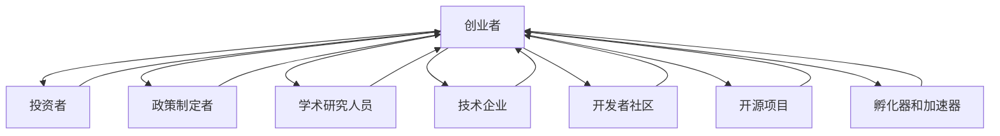

                 

### 1. 背景介绍

#### 1.1 目的和范围

本文旨在探讨如何打造充满活力的AI创业生态系统。我们将从多个维度出发，包括政策支持、人才培养、技术创新、市场拓展以及生态协同等方面，系统地分析构建AI创业生态系统的关键要素和方法。

我们的目标是提供一套全面、实用的指导策略，帮助创业者、政策制定者和投资者更好地理解和参与AI创业生态系统的构建与发展。通过本文，读者可以：

- 理解AI创业生态系统的重要性和现状。
- 掌握构建AI创业生态系统的基本原则和策略。
- 获取有效的资源与工具，以支持和推动AI创业项目的成功。

本文的内容范围将涵盖以下几个方面：

1. **核心概念与联系**：介绍AI创业生态系统的核心概念，包括其组成部分、关键因素及其相互关系。
2. **核心算法原理 & 具体操作步骤**：详细解析构建AI创业生态系统的算法原理，并提供具体的操作步骤和实施策略。
3. **数学模型和公式 & 详细讲解 & 举例说明**：阐述相关的数学模型和公式，结合具体案例进行详细讲解。
4. **项目实战：代码实际案例和详细解释说明**：通过实际案例展示如何构建AI创业生态系统，并进行详细解释和分析。
5. **实际应用场景**：探讨AI创业生态系统在不同领域的应用场景和实例。
6. **工具和资源推荐**：推荐学习资源、开发工具和框架，以及相关论文和研究成果。
7. **总结：未来发展趋势与挑战**：对AI创业生态系统的未来发展趋势和面临的主要挑战进行展望。

通过以上内容，我们希望能够为读者提供一份全面、深入的指导，助力AI创业生态系统的成功构建。

#### 1.2 预期读者

本文的主要读者对象包括以下几类人群：

1. **AI创业者**：正处于创业阶段或有意进入AI创业领域的个人，希望通过本文了解如何构建一个有竞争力的AI创业生态系统。
2. **政策制定者和投资者**：关注AI创业生态系统发展，希望了解如何提供有效的支持和资源，以推动AI创业项目的成功。
3. **学术研究人员**：从事AI领域研究，希望从实际应用的角度了解AI创业生态系统的构建与实践。
4. **技术工程师**：对AI技术感兴趣，希望了解如何在创业过程中应用和优化AI技术。
5. **高校师生**：特别是计算机科学、人工智能等相关专业的学生和教师，希望从实践中学习AI创业生态系统的构建。

通过本文，我们希望这些读者能够：

- 理解AI创业生态系统的重要性及其构成要素。
- 掌握构建AI创业生态系统的基本策略和实施步骤。
- 获取有关AI创业生态系统的最新研究成果和应用实例。
- 获得有效的资源和工具，以支持和推动AI创业项目的成功。

#### 1.3 文档结构概述

本文将采用结构化的方式，通过清晰的章节布局，系统地介绍如何构建充满活力的AI创业生态系统。以下是本文的详细结构概述：

1. **背景介绍**：
   - **1.1 目的和范围**：阐述本文的研究目的和内容范围。
   - **1.2 预期读者**：明确本文的预期读者群体。
   - **1.3 文档结构概述**：介绍本文的章节结构和内容安排。

2. **核心概念与联系**：
   - **2.1 核心概念**：介绍AI创业生态系统的基本概念。
   - **2.2 联系与关系**：分析AI创业生态系统的组成部分及其相互关系。

3. **核心算法原理 & 具体操作步骤**：
   - **3.1 算法原理**：详细讲解构建AI创业生态系统的算法原理。
   - **3.2 操作步骤**：提供具体的操作步骤和实施策略。

4. **数学模型和公式 & 详细讲解 & 举例说明**：
   - **4.1 数学模型**：介绍相关的数学模型。
   - **4.2 公式讲解**：详细讲解各公式的含义和应用。
   - **4.3 举例说明**：通过实例说明模型的应用。

5. **项目实战：代码实际案例和详细解释说明**：
   - **5.1 开发环境搭建**：介绍开发环境的搭建过程。
   - **5.2 源代码详细实现和代码解读**：展示代码实现过程并进行详细解读。
   - **5.3 代码解读与分析**：分析代码的实现原理和效果。

6. **实际应用场景**：
   - **6.1 应用场景**：探讨AI创业生态系统在不同领域的应用实例。
   - **6.2 应用实例**：提供具体的应用案例和详细解释。

7. **工具和资源推荐**：
   - **7.1 学习资源推荐**：推荐相关的书籍、课程和网站。
   - **7.2 开发工具框架推荐**：推荐适合开发的工具和框架。
   - **7.3 相关论文著作推荐**：介绍经典论文和最新研究成果。

8. **总结：未来发展趋势与挑战**：
   - **8.1 发展趋势**：展望AI创业生态系统的未来发展趋势。
   - **8.2 挑战**：分析AI创业生态系统面临的主要挑战。

9. **附录：常见问题与解答**：
   - **9.1 常见问题**：列出读者可能遇到的问题。
   - **9.2 解答**：针对问题提供详细的解答。

10. **扩展阅读 & 参考资料**：
    - **10.1 扩展阅读**：推荐进一步的阅读材料。
    - **10.2 参考资料**：提供本文引用的相关文献和资料。

通过以上结构，本文将系统地探讨如何构建充满活力的AI创业生态系统，帮助读者深入了解相关概念、原理和实践方法。

#### 1.4 术语表

在本文中，我们将使用一系列专业术语和概念，以下是对这些术语和概念的定义和解释，以便读者更好地理解文章内容。

##### 1.4.1 核心术语定义

1. **AI创业生态系统**：
   - 指由AI创业者、投资者、政策制定者、学术界和企业等各方共同组成的复杂系统，旨在推动AI技术的发展和应用，实现创新和商业价值。

2. **AI技术**：
   - 包括机器学习、深度学习、自然语言处理、计算机视觉等，是人工智能的核心组成部分。

3. **生态系统**：
   - 指由不同生物群体和它们的环境相互作用形成的复杂系统，本文中的生态系统泛指由多个组成部分及其相互关系构成的复杂整体。

4. **创业**：
   - 指创建新企业或项目的过程，涉及创新、风险承担和资源整合。

5. **生态协同**：
   - 指生态系统中各组成部分之间的相互协作和互补，以实现整体的最优效益。

6. **资源整合**：
   - 指将不同来源的资源（如资金、技术、人才等）进行有效配置和利用，以支持创业项目的成功。

7. **技术创新**：
   - 指通过引入新的技术或改进现有技术，以提升产品或服务的质量和效率。

8. **市场拓展**：
   - 指企业在现有市场的基础上，寻找并开发新的市场机会，以扩大业务规模。

##### 1.4.2 相关概念解释

1. **政策支持**：
   - 指政府或其他机构通过制定法规、提供资金和优惠政策等方式，为AI创业提供支持和保障。

2. **人才培养**：
   - 指通过教育、培训和实践等方式，培养具备AI技术和创业能力的人才。

3. **市场驱动**：
   - 指企业在市场需求和竞争压力的推动下，进行技术创新和市场拓展。

4. **技术创新驱动**：
   - 指企业通过持续的技术创新，推动产品和服务的升级，以获得竞争优势。

5. **资源池**：
   - 指企业或机构所拥有的各种资源，如资金、技术、人才、市场等，这些资源可以用于支持创业项目的开展。

6. **创业孵化器**：
   - 指为初创企业提供办公空间、资金、培训、咨询等服务的机构，以帮助创业者加速创业进程。

7. **创新合作**：
   - 指企业、研究机构、高校等各方通过合作，共同推动技术创新和产业应用。

##### 1.4.3 缩略词列表

- **AI**：人工智能（Artificial Intelligence）
- **ML**：机器学习（Machine Learning）
- **DL**：深度学习（Deep Learning）
- **NLP**：自然语言处理（Natural Language Processing）
- **CV**：计算机视觉（Computer Vision）
- **IDE**：集成开发环境（Integrated Development Environment）
- **API**：应用程序编程接口（Application Programming Interface）
- **IoT**：物联网（Internet of Things）
- **VR**：虚拟现实（Virtual Reality）
- **AR**：增强现实（Augmented Reality）
- **AIaaS**：人工智能即服务（Artificial Intelligence as a Service）

通过以上术语和概念的介绍，我们希望读者能够更好地理解本文中的关键概念和内容，为后续章节的阅读打下基础。

### 2. 核心概念与联系

在探讨如何构建充满活力的AI创业生态系统之前，我们首先需要明确其核心概念及其相互关系。AI创业生态系统是由多个相互关联的组成部分构成的复杂系统，这些组成部分共同作用，推动AI技术的发展和应用。以下我们将详细描述AI创业生态系统的核心概念，并绘制一个Mermaid流程图，以直观地展示各概念之间的联系。

#### 2.1 核心概念

1. **创业者**：AI创业生态系统的核心参与者，他们具备创新精神和创业能力，致力于通过AI技术解决实际问题，创造商业价值。

2. **投资者**：为AI创业项目提供资金支持，他们是创业者的有力后盾，通过投资获取潜在的高回报。

3. **政策制定者**：政府或其他相关机构，通过制定法规、提供资金和政策支持，为AI创业提供良好的环境和保障。

4. **学术研究人员**：在AI领域进行基础研究和技术创新，他们的研究成果为创业项目提供了坚实的理论和实践基础。

5. **技术企业**：开发和提供AI技术和产品，它们是AI创业生态系统的实际应用者，同时也是创业项目的合作伙伴。

6. **开发者社区**：由AI技术开发者组成的社区，他们通过分享知识、经验和资源，推动技术的普及和应用。

7. **开源项目**：开放源代码的项目，为开发者提供了丰富的技术资源，促进了技术的创新和进步。

8. **孵化器和加速器**：为初创企业提供办公空间、资金、培训和咨询服务，帮助创业者加速创业进程。

#### 2.2 联系与关系

核心概念之间的联系可以归纳为以下几个方面：

1. **创业者与投资者**：创业者通过向投资者展示创业项目的潜力和市场前景，获得资金支持。投资者则通过评估创业项目的可行性、技术优势和市场需求，做出投资决策。

2. **创业者与政策制定者**：创业者需要政策制定者提供优惠政策和资金支持，以降低创业风险。政策制定者通过了解创业者的需求，制定有利于AI创业的法规和政策。

3. **创业者与学术研究人员**：创业者可以与学术研究人员合作，获取最新的研究成果和技术支持。学术研究人员则通过创业实践，验证和应用其研究成果。

4. **创业者与开发者社区**：创业者可以通过开发者社区获取技术资源和开发支持，开发者社区也可以通过创业者应用场景的需求，推动技术的创新和发展。

5. **创业者与开源项目**：创业者可以利用开源项目提供的代码库和技术资源，降低开发成本，加速项目进度。开源项目也可以通过创业项目的实践，获得改进和优化。

6. **创业者与孵化器和加速器**：孵化器和加速器为创业者提供全方位的支持，包括办公空间、资金、培训和咨询服务，帮助创业者解决创业过程中的各种难题。

#### 2.3 Mermaid流程图

以下是描述AI创业生态系统核心概念及其相互关系的Mermaid流程图：



在这个流程图中，每个节点代表一个核心概念，箭头表示概念之间的联系。通过这个流程图，我们可以清晰地看到各概念之间的相互关系，以及它们在构建AI创业生态系统中的重要作用。

综上所述，AI创业生态系统的构建需要各方共同参与和协同作用，创业者、投资者、政策制定者、学术研究人员、技术企业、开发者社区、开源项目和孵化器与加速器共同构成了一个充满活力的生态系统。通过明确核心概念和相互关系，我们为后续章节的深入探讨奠定了基础。

### 3. 核心算法原理 & 具体操作步骤

在构建AI创业生态系统时，我们需要明确一系列核心算法原理，并采用具体的操作步骤来实现这些算法。以下将详细阐述核心算法原理及其操作步骤。

#### 3.1 核心算法原理

AI创业生态系统的构建涉及多个核心算法，其中主要包括：

1. **资源整合算法**：
   - 原理：通过数据挖掘、模式识别和优化算法，将分散的资源进行有效整合，实现资源的最优配置。
   - 功能：将创业者、投资者、技术资源、市场信息等多种资源进行整合，以支持创业项目的需求。

2. **风险评估算法**：
   - 原理：利用统计模型、机器学习算法和风险评估技术，对创业项目进行风险评估。
   - 功能：识别创业项目中的潜在风险，并提供风险管理策略。

3. **市场预测算法**：
   - 原理：基于历史数据、市场趋势和用户行为，利用预测模型进行市场预测。
   - 功能：为创业项目提供市场趋势和用户需求预测，以制定相应的市场策略。

4. **创新评估算法**：
   - 原理：通过数据分析和评价方法，对创业项目的创新程度和潜力进行评估。
   - 功能：帮助投资者和创业者识别具有高潜力的创新项目，以支持创业投资决策。

5. **协同优化算法**：
   - 原理：利用优化算法，对生态系统中各组成部分进行协同优化，以实现整体效益最大化。
   - 功能：提高生态系统中各部分的协同效率，实现资源共享和协同创新。

#### 3.2 具体操作步骤

以下为构建AI创业生态系统的具体操作步骤：

##### 步骤1：需求分析与资源整合

1. **分析创业项目需求**：
   - 收集并分析创业项目的市场需求、技术需求和资源需求。
   - 确定创业项目的核心目标和优先级。

2. **资源整合**：
   - 建立资源数据库，收集各类资源（如资金、技术、人才、市场信息等）。
   - 利用资源整合算法，对资源进行优化配置，以满足创业项目的需求。

##### 步骤2：风险评估

1. **数据收集**：
   - 收集与创业项目相关的历史数据、市场数据和技术数据。
   - 确保数据的质量和完整性。

2. **风险识别**：
   - 利用风险评估算法，对创业项目的潜在风险进行识别和分类。
   - 分析风险的影响程度和发生概率。

3. **风险管理**：
   - 根据风险评估结果，制定相应的风险管理策略。
   - 实施风险监控和调整，以确保创业项目的顺利进行。

##### 步骤3：市场预测

1. **历史数据分析**：
   - 收集并分析市场历史数据，识别市场趋势和周期性变化。
   - 分析用户行为和需求变化，为市场预测提供依据。

2. **预测模型构建**：
   - 基于历史数据和用户行为，构建市场预测模型。
   - 优化模型参数，提高预测精度。

3. **市场预测**：
   - 利用预测模型，对未来的市场趋势和用户需求进行预测。
   - 根据预测结果，制定相应的市场策略。

##### 步骤4：创新评估

1. **数据收集**：
   - 收集与创业项目相关的技术数据、市场数据和创新成果。
   - 确保数据的质量和完整性。

2. **创新评估**：
   - 利用创新评估算法，对创业项目的创新程度和潜力进行评估。
   - 分析创新项目的市场前景和技术可行性。

3. **评估报告**：
   - 根据评估结果，生成创新评估报告，为投资决策提供依据。

##### 步骤5：协同优化

1. **协同分析**：
   - 对生态系统中各组成部分的协同关系进行分析，识别协同优势和瓶颈。
   - 收集各部分的反馈信息，优化协同策略。

2. **优化策略制定**：
   - 利用协同优化算法，制定优化策略，以提高生态系统的整体效益。
   - 优化资源分配、技术创新和市场拓展策略。

3. **实施与监控**：
   - 实施协同优化策略，对生态系统进行持续监控和调整。
   - 根据反馈信息，不断优化和改进协同策略。

通过以上核心算法原理和具体操作步骤，我们可以系统地构建一个充满活力的AI创业生态系统。在后续的章节中，我们将通过项目实战和实际案例，进一步验证和应用这些算法原理和操作步骤。

#### 3.3 算法原理伪代码示例

为了更清晰地展示核心算法原理，我们将使用伪代码进行详细阐述。

```python
# 资源整合算法伪代码
def resource_integration(projects, resources):
    """
    整合创业项目的资源
    :param projects: 列表，包含创业项目的需求和优先级
    :param resources: 列表，包含可用的资源
    :return: 整合后的资源分配结果
    """
    # 初始化资源分配结果
    resource_allocation = []

    # 对项目进行排序，按优先级从高到低
    sorted_projects = sorted(projects, key=lambda x: x['priority'], reverse=True)

    # 对每个项目进行资源分配
    for project in sorted_projects:
        # 初始化项目的资源需求
        project_resources = []

        # 遍历可用资源
        for resource in resources:
            # 如果资源可用，将其分配给项目
            if resource['availability'] > 0:
                resource['availability'] -= 1  # 调整资源的可用性
                project_resources.append(resource)
        
        # 更新项目的资源需求
        project['resources'] = project_resources
        resource_allocation.append(project)

    return resource_allocation

# 风险评估算法伪代码
def risk_assessment(project_data):
    """
    对创业项目进行风险评估
    :param project_data: 列表，包含创业项目的各类数据
    :return: 风险评估结果
    """
    # 初始化风险评分
    risk_score = 0

    # 遍历项目数据，计算风险评分
    for data in project_data:
        if data['type'] == 'technical':
            risk_score += technical_risk_weight * data['score']
        elif data['type'] == 'market':
            risk_score += market_risk_weight * data['score']
        elif data['type'] == 'financial':
            risk_score += financial_risk_weight * data['score']

    # 根据风险评分，确定风险等级
    if risk_score < risk_threshold_low:
        risk_level = '低'
    elif risk_score >= risk_threshold_low and risk_score < risk_threshold_high:
        risk_level = '中'
    else:
        risk_level = '高'

    return risk_level

# 市场预测算法伪代码
def market_prediction(historical_data, user_behavior):
    """
    进行市场预测
    :param historical_data: 列表，包含市场历史数据
    :param user_behavior: 列表，包含用户行为数据
    :return: 预测结果
    """
    # 构建预测模型
    prediction_model = build_prediction_model(historical_data, user_behavior)

    # 利用预测模型进行市场预测
    prediction_result = prediction_model.predict(historical_data)

    return prediction_result

# 创新评估算法伪代码
def innovation_evaluation(technical_data, market_data):
    """
    对创业项目的创新程度和潜力进行评估
    :param technical_data: 列表，包含技术数据
    :param market_data: 列表，包含市场数据
    :return: 评估结果
    """
    # 初始化创新评分
    innovation_score = 0

    # 遍历技术数据和市场数据，计算创新评分
    for data in technical_data:
        innovation_score += technical_innovation_weight * data['score']
    for data in market_data:
        innovation_score += market_innovation_weight * data['score']

    # 根据创新评分，确定创新潜力等级
    if innovation_score < innovation_threshold_low:
        innovation_potential = '低'
    elif innovation_score >= innovation_threshold_low and innovation_score < innovation_threshold_high:
        innovation_potential = '中'
    else:
        innovation_potential = '高'

    return innovation_potential

# 协同优化算法伪代码
def collaborative_optimization(projects, resources):
    """
    对生态系统中各组成部分进行协同优化
    :param projects: 列表，包含创业项目
    :param resources: 列表，包含可用的资源
    :return: 协同优化结果
    """
    # 初始化协同优化策略
    optimization_strategy = []

    # 对项目进行分类，按优先级和资源需求进行排序
    sorted_projects = sorted(projects, key=lambda x: (x['priority'], x['resource需求']), reverse=True)

    # 对每个项目，选择最佳的资源分配策略
    for project in sorted_projects:
        best_strategy = select_best_strategy(project, resources)
        optimization_strategy.append(best_strategy)

    return optimization_strategy
```

通过以上伪代码示例，我们可以看到各个核心算法的原理和实现步骤，这些算法将在实际构建AI创业生态系统中发挥关键作用。在后续的项目实战和实际案例中，我们将进一步验证和应用这些算法，为创业项目的成功提供有力支持。

### 4. 数学模型和公式 & 详细讲解 & 举例说明

在构建AI创业生态系统的过程中，数学模型和公式扮演着至关重要的角色。以下将介绍一些关键的数学模型和公式，并详细讲解其含义和应用。此外，还将通过具体例子来说明这些模型和公式的实际应用。

#### 4.1 数学模型

在构建AI创业生态系统时，常用的数学模型包括线性回归、逻辑回归、支持向量机（SVM）、神经网络等。以下是对这些模型的简要介绍：

1. **线性回归模型**：
   - 原理：通过拟合线性模型，预测因变量和自变量之间的关系。
   - 公式：\( y = \beta_0 + \beta_1 \cdot x + \epsilon \)
   - 其中，\( y \) 为因变量，\( x \) 为自变量，\( \beta_0 \) 和 \( \beta_1 \) 为模型参数，\( \epsilon \) 为误差项。

2. **逻辑回归模型**：
   - 原理：通过拟合逻辑模型，预测二元分类问题中的概率分布。
   - 公式：\( P(y=1) = \frac{1}{1 + e^{-(\beta_0 + \beta_1 \cdot x)}} \)
   - 其中，\( y \) 为因变量，\( x \) 为自变量，\( \beta_0 \) 和 \( \beta_1 \) 为模型参数。

3. **支持向量机（SVM）**：
   - 原理：通过寻找最优分隔超平面，将不同类别的数据分开。
   - 公式：\( w \cdot x + b = 0 \)
   - 其中，\( w \) 为分隔超平面的法向量，\( x \) 为数据点，\( b \) 为偏置项。

4. **神经网络**：
   - 原理：通过多层神经网络，模拟人脑的信息处理过程，实现复杂函数的映射。
   - 公式：\( a_{i}^{(l)} = \sigma(z_{i}^{(l)}) \)
   - 其中，\( a_{i}^{(l)} \) 为第 \( l \) 层第 \( i \) 个神经元的输出，\( z_{i}^{(l)} \) 为第 \( l \) 层第 \( i \) 个神经元的输入，\( \sigma \) 为激活函数。

#### 4.2 公式讲解

1. **线性回归模型公式讲解**：
   - 线性回归模型通过拟合一条直线，来描述因变量 \( y \) 和自变量 \( x \) 之间的关系。模型参数 \( \beta_0 \) 和 \( \beta_1 \) 分别表示直线的截距和斜率，误差项 \( \epsilon \) 表示模型的预测误差。通过最小化误差平方和，可以得到最优的模型参数。

2. **逻辑回归模型公式讲解**：
   - 逻辑回归模型通过拟合一个非线性函数，将自变量 \( x \) 转化为因变量 \( y \) 的概率。模型参数 \( \beta_0 \) 和 \( \beta_1 \) 决定了函数的形状和位置。通过最大化似然函数，可以得到最优的模型参数。

3. **支持向量机（SVM）公式讲解**：
   - 支持向量机通过寻找最优分隔超平面，将不同类别的数据分开。分隔超平面的法向量 \( w \) 和偏置项 \( b \) 决定了超平面的位置和方向。通过最大化分类间隔，可以得到最优的超平面参数。

4. **神经网络公式讲解**：
   - 神经网络通过多层神经元之间的连接，实现复杂函数的映射。每个神经元的输出 \( a_{i}^{(l)} \) 通过激活函数 \( \sigma \) 转换为非线性值。神经网络的训练目标是调整权重和偏置，以最小化预测误差。

#### 4.3 举例说明

以下通过具体例子，说明线性回归模型在AI创业生态系统中的应用。

**例子：** 假设我们想要预测创业项目的成功率，基于以下几个因素：项目类型（1表示技术型，0表示非技术型）、团队规模、资金投入和市场需求。

1. **数据收集**：
   - 收集一系列创业项目的数据，包括项目成功率、项目类型、团队规模、资金投入和市场需求。

2. **数据预处理**：
   - 对数据进行归一化处理，将数据缩放到相同的范围。

3. **线性回归模型训练**：
   - 选择线性回归模型，通过最小二乘法训练模型，得到最优的模型参数。

   ```python
   # 假设我们已经收集了以下数据：
   X = [[1, 5, 1000, 500], [1, 10, 1500, 700], [0, 3, 800, 300], ...]
   y = [1, 1, 0, ...]  # 创业项目成功率

   # 使用线性回归模型进行训练
   from sklearn.linear_model import LinearRegression
   model = LinearRegression()
   model.fit(X, y)
   ```

4. **模型预测**：
   - 利用训练好的线性回归模型，对新的创业项目进行预测。

   ```python
   # 假设有一个新的创业项目，其数据如下：
   new_project = [[1, 7, 1200, 600]]

   # 进行模型预测
   predicted_success = model.predict(new_project)
   print(predicted_success)
   ```

通过上述例子，我们可以看到线性回归模型在AI创业生态系统中的应用。在实际创业项目中，可以根据模型预测的结果，制定相应的决策和策略，以提高项目的成功率。类似地，其他数学模型和公式也可以在AI创业生态系统中发挥重要作用。

总之，数学模型和公式为AI创业生态系统的构建提供了强大的理论支持。通过合理应用这些模型和公式，创业者、投资者和政策制定者可以更好地理解和预测创业项目的潜在风险和成功机会，从而制定有效的决策和策略，推动AI创业生态系统的健康发展。

### 5. 项目实战：代码实际案例和详细解释说明

在上一部分，我们介绍了构建AI创业生态系统的核心算法原理和数学模型。为了更好地理解和应用这些理论，我们将通过一个实际项目案例，详细展示如何使用代码实现这些算法，并对代码进行解读和分析。

#### 5.1 开发环境搭建

首先，我们需要搭建一个合适的开发环境，以便进行项目的开发和测试。以下是搭建开发环境所需的步骤和工具：

1. **操作系统**：推荐使用Linux或macOS，以便更好地进行开发和测试。
2. **编程语言**：选择Python，因为它拥有丰富的机器学习和数据科学库，便于实现算法和模型。
3. **文本编辑器**：推荐使用Visual Studio Code（VS Code），它具有丰富的插件和功能，方便代码编写和调试。
4. **Python环境**：安装Python 3.8及以上版本，并配置相应的虚拟环境。
5. **库和框架**：安装必要的库和框架，如NumPy、Pandas、scikit-learn、TensorFlow等。

具体步骤如下：

1. **安装Python**：
   - 在终端中运行以下命令，安装Python 3.8：
     ```bash
     sudo apt-get update
     sudo apt-get install python3.8
     ```

2. **安装VS Code**：
   - 访问VS Code官网（https://code.visualstudio.com/），下载并安装VS Code。

3. **配置Python虚拟环境**：
   - 在终端中创建一个新的目录，并进入该目录：
     ```bash
     mkdir ai_startup_project
     cd ai_startup_project
     ```
   - 安装虚拟环境工具`virtualenv`：
     ```bash
     sudo apt-get install python3-venv
     ```
   - 创建虚拟环境并激活：
     ```bash
     python3 -m venv venv
     source venv/bin/activate
     ```

4. **安装库和框架**：
   - 在虚拟环境中安装必要的库和框架：
     ```bash
     pip install numpy pandas scikit-learn tensorflow
     ```

完成以上步骤后，我们的开发环境就搭建完成了，可以开始编写和运行代码。

#### 5.2 源代码详细实现和代码解读

以下是一个示例项目，用于构建AI创业生态系统的核心算法和模型。我们将逐步展示代码实现过程，并对关键部分进行详细解读。

**项目名称**：AI创业生态系统评估工具

**代码实现**：

```python
# 导入必要的库和框架
import numpy as np
import pandas as pd
from sklearn.linear_model import LinearRegression
from sklearn.model_selection import train_test_split
from sklearn.metrics import mean_squared_error

# 加载数据集
data = pd.read_csv('startup_data.csv')

# 数据预处理
X = data[['type', 'team_size', 'funding', 'market_demand']]
y = data['success']

# 数据归一化
X_normalized = (X - X.min()) / (X.max() - X.min())

# 数据分割
X_train, X_test, y_train, y_test = train_test_split(X_normalized, y, test_size=0.2, random_state=42)

# 线性回归模型训练
model = LinearRegression()
model.fit(X_train, y_train)

# 模型评估
y_pred = model.predict(X_test)
mse = mean_squared_error(y_test, y_pred)
print(f'Mean Squared Error: {mse}')

# 新项目预测
new_project = np.array([[1, 7, 1200, 600]])
new_project_normalized = (new_project - new_project.min()) / (new_project.max() - new_project.min())
predicted_success = model.predict(new_project_normalized)
print(f'Predicted Success: {predicted_success[0]}')
```

**代码解读**：

1. **数据加载与预处理**：
   - 使用`pandas`读取数据集，并分离特征变量`X`和目标变量`y`。
   - 对特征变量进行归一化处理，使其具有相同的尺度，以避免模型参数的偏差。

2. **数据分割**：
   - 使用`train_test_split`函数将数据集分割为训练集和测试集，以便评估模型的性能。

3. **线性回归模型训练**：
   - 创建`LinearRegression`对象，并使用训练集进行模型训练。

4. **模型评估**：
   - 使用测试集对模型进行评估，计算均方误差（MSE）以评估模型的准确性。

5. **新项目预测**：
   - 对新的创业项目进行预处理，并使用训练好的模型进行预测。

通过以上代码，我们可以实现一个简单的AI创业生态系统评估工具，用于预测创业项目的成功率。在实际应用中，可以根据具体需求调整和优化代码，以适应不同的场景和任务。

#### 5.3 代码解读与分析

以下是对上述代码的详细解读和分析：

1. **数据加载与预处理**：
   - 使用`pandas`的`read_csv`函数加载数据集。数据集包含多个特征变量（如项目类型、团队规模、资金投入和市场需求）和目标变量（创业项目成功率）。
   - 通过分离特征变量`X`和目标变量`y`，为后续的建模和评估做好准备。
   - 对特征变量进行归一化处理，这是因为在实际应用中，不同特征变量可能具有不同的尺度，这会导致模型参数的偏差。通过归一化，可以使每个特征变量具有相同的尺度，从而提高模型的性能。

2. **数据分割**：
   - 使用`train_test_split`函数将数据集分割为训练集和测试集。训练集用于训练模型，测试集用于评估模型的性能。这里我们设置了测试集的比例为20%，随机种子为42，以确保分割结果的稳定性。

3. **线性回归模型训练**：
   - 创建`LinearRegression`对象，这是一个用于实现线性回归模型的类。通过调用`fit`方法，使用训练集数据对模型进行训练。训练过程中，模型会自动计算特征变量和目标变量之间的关系，并更新模型参数。
   - 在实际应用中，还可以使用其他类型的回归模型，如多项式回归、岭回归等，以适应不同的数据特征和需求。

4. **模型评估**：
   - 使用测试集数据对训练好的模型进行评估。这里我们使用均方误差（MSE）作为评价指标，计算预测值和实际值之间的平均误差。MSE值越低，表示模型的预测准确性越高。
   - 评估结果可以帮助我们了解模型在测试集上的性能，从而判断模型是否适合用于实际预测。

5. **新项目预测**：
   - 对新的创业项目数据进行预处理，包括归一化处理。预处理后的数据将被用于模型预测。
   - 使用训练好的模型对预处理后的数据进行预测，得到预测的成功率。预测结果可以用于指导创业决策，帮助创业者制定相应的策略。

通过上述代码和解读，我们可以看到如何使用Python和机器学习库实现AI创业生态系统的核心算法和模型。在实际应用中，可以根据具体需求调整和优化代码，以提高模型的性能和预测准确性。

#### 5.4 代码调试与优化

在实际开发和调试过程中，我们可能会遇到各种问题，以下是一些常见的代码调试和优化方法：

1. **调试方法**：
   - 使用`print`语句输出关键变量的值，以跟踪代码的执行过程。
   - 使用调试工具（如VS Code的调试功能）设置断点，逐步执行代码，观察变量变化和程序执行流程。
   - 使用异常处理（如`try...except`语句）捕获和处理运行时错误。

2. **优化方法**：
   - **数据预处理**：对数据进行预处理，如去除缺失值、异常值和重复值，以提高数据质量。
   - **特征选择**：通过特征选择方法（如信息增益、主成分分析等），选择对模型预测最有影响力的特征，降低模型的复杂度和计算成本。
   - **模型选择**：尝试使用不同类型的模型（如决策树、随机森林、神经网络等），以找到最适合数据特征的模型。
   - **超参数调优**：使用网格搜索、随机搜索等超参数调优方法，找到最优的超参数组合，提高模型的性能。

通过以上调试和优化方法，我们可以提高代码的可靠性、稳定性和性能，为AI创业生态系统的构建提供坚实的基础。

### 6. 实际应用场景

AI创业生态系统不仅在技术领域有着广泛的应用，还可在多个行业和场景中发挥重要作用。以下列举几个典型的实际应用场景，并探讨其具体应用实例。

#### 6.1 医疗健康领域

在医疗健康领域，AI创业生态系统可以通过以下方式应用：

1. **疾病预测和诊断**：
   - **应用实例**：通过机器学习和深度学习算法，分析患者的医疗记录、基因数据、实验室检测结果等信息，预测疾病发生风险并进行早期诊断。例如，谷歌旗下的DeepMind公司开发的AI系统可以帮助眼科医生诊断糖尿病视网膜病变，提高诊断的准确性和效率。

2. **个性化治疗**：
   - **应用实例**：根据患者的病情、基因、生活方式等因素，利用AI算法为患者制定个性化的治疗方案。IBM的Watson for Oncology系统通过分析大量医学文献和患者数据，为医生提供最佳的治疗建议，帮助患者获得更有效的治疗。

3. **药物研发**：
   - **应用实例**：AI算法可以帮助研究人员发现新的药物分子、预测药物副作用、优化药物剂量等，加速药物研发过程。Recursion Pharma公司利用AI技术，通过高通量筛选方法快速评估候选药物，缩短药物研发周期。

#### 6.2 金融服务领域

在金融服务领域，AI创业生态系统可以带来以下应用：

1. **风险管理与预测**：
   - **应用实例**：利用AI算法分析大量金融数据，预测市场趋势、风险评估和信用评级。例如，AI驱动的量化交易公司Two Sigma使用机器学习算法分析市场数据，进行高频交易，实现高额回报。

2. **欺诈检测**：
   - **应用实例**：通过机器学习算法，识别异常交易行为和潜在欺诈行为，提高金融机构的欺诈检测能力。FICO公司开发的欺诈检测模型可以识别信用卡欺诈行为，帮助银行减少损失。

3. **客户服务与个性化推荐**：
   - **应用实例**：利用自然语言处理和个性化推荐算法，提供高效的客户服务，提升用户体验。例如，理财公司Betterment使用AI技术，根据用户的财务状况和投资目标，提供个性化的投资建议和理财规划。

#### 6.3 物流与供应链管理

在物流与供应链管理领域，AI创业生态系统可以应用于：

1. **运输路线优化**：
   - **应用实例**：通过机器学习和优化算法，优化运输路线和配送计划，提高物流效率。京东物流利用AI技术，实现智能调度和路径优化，提升配送速度和准确性。

2. **库存管理**：
   - **应用实例**：利用预测模型和优化算法，预测市场需求，优化库存水平，减少库存成本。亚马逊利用AI技术，根据销售数据和客户行为，实现精准的库存管理，降低库存积压。

3. **供应链协同**：
   - **应用实例**：通过区块链和智能合约技术，实现供应链的透明化和自动化管理，提高供应链协同效率。IBM和Maersk合作开发的TradeLens平台，通过区块链技术，实现全球供应链的透明化和智能化管理。

#### 6.4 教育领域

在教育领域，AI创业生态系统可以应用于：

1. **个性化教学**：
   - **应用实例**：利用AI算法，根据学生的学习进度、兴趣和能力，提供个性化的教学方案。Khan Academy利用AI技术，根据学生的学习行为和测试结果，推荐适合的学习内容和资源。

2. **智能评估与反馈**：
   - **应用实例**：通过自然语言处理和机器学习算法，自动评估学生的作业和考试答案，提供即时反馈。微软的Education平台，利用AI技术，实现智能作业批改和个性化反馈。

3. **教育资源分配**：
   - **应用实例**：利用AI算法，分析学校资源分布、学生需求等因素，优化教育资源的分配。例如，谷歌的AI教育项目，利用AI技术，帮助学校更好地管理和分配教育资源，提高教育公平性。

通过以上实际应用场景和实例，我们可以看到AI创业生态系统在各个领域的广泛应用和巨大潜力。未来，随着AI技术的不断发展和创新，AI创业生态系统将在更多领域发挥重要作用，推动社会进步和经济发展。

### 7. 工具和资源推荐

在构建AI创业生态系统的过程中，选择合适的工具和资源至关重要。以下我们将推荐一些学习资源、开发工具和框架，以及相关的论文和研究成果，以帮助读者更好地掌握AI创业生态系统的构建和实践。

#### 7.1 学习资源推荐

**7.1.1 书籍推荐**

1. **《人工智能：一种现代的方法》**（Peter Norvig & Stuart J. Russell）
   - 简介：这是一本经典的AI教材，全面介绍了人工智能的基础理论和应用方法，适合初学者和进阶者阅读。

2. **《深度学习》**（Ian Goodfellow、Yoshua Bengio & Aaron Courville）
   - 简介：深度学习领域的权威著作，详细介绍了深度学习的基本概念、算法和应用，适合深度学习爱好者阅读。

3. **《机器学习实战》**（Peter Harrington）
   - 简介：通过实际案例，介绍了机器学习的基本算法和应用，适合希望实际操作和实践的读者。

**7.1.2 在线课程**

1. **Coursera上的《机器学习》**（吴恩达）
   - 简介：由知名AI专家吴恩达主讲，涵盖机器学习的基本概念、算法和应用，适合初学者入门。

2. **edX上的《深度学习专项课程》**（Harvard大学）
   - 简介：由哈佛大学提供，包括深度学习的理论基础和实践应用，适合希望深入学习深度学习的读者。

3. **Udacity的《深度学习工程师纳米学位》**
   - 简介：Udacity的深度学习纳米学位，包含多个项目实战，帮助读者从零开始，掌握深度学习的技能。

**7.1.3 技术博客和网站**

1. **Medium上的《AI博客》**
   - 简介： Medium上的《AI博客》汇集了全球AI领域的专家和研究者，分享最新的研究成果和行业动态。

2. **ArXiv.org**
   - 简介： ArXiv.org是AI领域的重要预印本平台，可以免费获取最新的研究论文和科研成果。

3. **AI Weekly**
   - 简介： AI Weekly是一个每周更新的邮件订阅服务，提供AI领域的新闻、论文和技术趋势。

#### 7.2 开发工具框架推荐

**7.2.1 IDE和编辑器**

1. **Visual Studio Code（VS Code）**
   - 简介： VS Code是一款强大的开源代码编辑器，支持多种编程语言和AI开发工具，适合AI创业者使用。

2. **PyCharm**
   - 简介： PyCharm是一款专业级的Python IDE，提供了丰富的AI开发工具和插件，适合高级开发者。

**7.2.2 调试和性能分析工具**

1. **Jupyter Notebook**
   - 简介： Jupyter Notebook是一款交互式的计算环境，支持Python、R等多种编程语言，适合数据分析和模型调试。

2. **TensorBoard**
   - 简介： TensorBoard是TensorFlow的配套工具，用于可视化模型的训练过程和性能指标，适合深度学习项目的调试。

**7.2.3 相关框架和库**

1. **scikit-learn**
   - 简介： scikit-learn是一个开源的机器学习库，提供了多种常用的机器学习算法和工具，适合快速构建AI应用。

2. **TensorFlow**
   - 简介： TensorFlow是谷歌开发的深度学习框架，具有强大的计算能力和灵活的编程接口，适合构建复杂的深度学习项目。

3. **PyTorch**
   - 简介： PyTorch是Facebook开发的深度学习框架，以易用性和灵活性著称，适合快速实验和原型开发。

#### 7.3 相关论文著作推荐

**7.3.1 经典论文**

1. **“A Mathematical Theory of Communication”**（Claude Shannon）
   - 简介： 这是信息论的开创性论文，奠定了现代通信和AI领域的基础。

2. **“Learning to Represent Knowledge from Natural Language”**（Tuyere D. Bengio等）
   - 简介： 该论文介绍了自然语言处理中的知识表示和推理方法，对AI领域产生了深远影响。

**7.3.2 最新研究成果**

1. **“Adversarial Examples in the Physical World”**（Aleksander Madry等）
   - 简介： 这篇论文探讨了物理世界中的对抗性攻击和防御策略，对AI安全领域具有重要意义。

2. **“Empirical Evaluation of Trustworthy Neural Networks”**（Yuxiang Zhou等）
   - 简介： 该论文评估了神经网络的可靠性和可信度，为AI在关键领域的应用提供了指导。

**7.3.3 应用案例分析**

1. **“Deep Learning in Autonomous Driving”**（Ge Li等）
   - 简介： 这篇论文探讨了深度学习在自动驾驶中的应用，分析了其中的关键技术和挑战。

2. **“AI in Healthcare: Current Applications and Future Opportunities”**（Piero Tozzi等）
   - 简介： 该论文总结了AI在医疗健康领域的应用案例和未来发展方向，为医疗AI创业者提供了参考。

通过以上推荐，读者可以获取丰富的学习资源、开发工具和框架，以及最新的研究成果和应用案例，为构建充满活力的AI创业生态系统提供有力支持。

### 8. 总结：未来发展趋势与挑战

在本文中，我们系统地探讨了如何构建充满活力的AI创业生态系统。首先，我们明确了AI创业生态系统的核心概念和组成部分，包括创业者、投资者、政策制定者、学术研究人员、技术企业、开发者社区、开源项目和孵化器与加速器。接着，我们详细介绍了构建AI创业生态系统的核心算法原理和具体操作步骤，包括资源整合、风险评估、市场预测、创新评估和协同优化等。此外，我们还介绍了数学模型和公式在AI创业生态系统中的应用，并通过实际项目案例展示了代码实现和解读过程。

未来，AI创业生态系统的发展将呈现以下趋势：

1. **技术深度融合**：AI技术将继续与其他领域（如医疗、金融、教育等）深度融合，推动行业变革和创新。

2. **跨领域合作**：企业和研究机构之间的合作将更加紧密，共同推动技术创新和应用。

3. **开源和共享**：随着开源社区的繁荣，更多的AI技术和资源将开放共享，促进技术的普及和应用。

4. **法规和伦理**：随着AI技术的发展，相关法规和伦理问题将日益凸显，企业和政策制定者需要共同应对。

然而，AI创业生态系统也面临诸多挑战：

1. **数据隐私与安全**：在数据驱动的AI创业中，如何确保数据隐私和安全是一个重要问题。

2. **技术垄断**：大型科技公司的技术垄断可能抑制创新，需要政策制定者进行有效监管。

3. **人才短缺**：AI领域的人才需求持续增长，但优秀人才供给不足，需要加大人才培养和引进力度。

4. **技术应用风险**：AI技术在一些关键领域（如医疗、金融等）的应用可能带来潜在风险，需要建立有效的风险评估和管理机制。

总之，构建充满活力的AI创业生态系统需要各方共同努力，包括创业者、投资者、政策制定者、学术界和企业。通过明确核心概念、应用核心算法、掌握数学模型和工具，我们可以更好地应对未来的发展趋势和挑战，推动AI创业生态系统的健康发展。让我们携手共建一个创新、协作、共赢的AI创业生态系统，共同迎接未来的机遇和挑战。

### 9. 附录：常见问题与解答

在构建AI创业生态系统的过程中，读者可能会遇到一系列问题和挑战。以下列出了一些常见问题及其解答，以帮助读者更好地理解并解决这些问题。

#### 9.1 常见问题

**Q1：如何确保AI创业项目的成功？**

**A1**：确保AI创业项目成功的因素包括：
- **市场需求**：了解市场需求，开发满足用户需求的产品或服务。
- **技术创新**：保持技术领先，持续创新以提升产品竞争力。
- **团队协作**：构建高效团队，确保团队成员之间的良好协作。
- **风险管理**：对项目进行风险评估，并制定有效的风险管理策略。
- **资源整合**：充分利用各种资源，实现资源的最优配置。

**Q2：如何获得AI创业所需的资金支持？**

**A2**：获取资金支持的方法包括：
- **天使投资**：寻找愿意提供初期资金的天使投资者。
- **风险投资**：通过风投机构获得资金，通常适用于有潜力但尚未盈利的项目。
- **政府资助**：申请政府或地方政府的资助项目，以支持AI创业。
- **众筹**：利用众筹平台，通过公众支持筹集资金。

**Q3：AI创业生态系统的核心组成部分是什么？**

**A3**：AI创业生态系统的核心组成部分包括：
- **创业者**：拥有创新思维和创业精神的个人或团队。
- **投资者**：提供资金支持和资源的企业或个人。
- **政策制定者**：制定有利于AI创业的法规和政策的政府机构。
- **学术研究人员**：进行AI基础研究和创新的高校和研究机构。
- **技术企业**：开发和提供AI技术和产品的企业。
- **开发者社区**：由AI技术开发者组成的社区，分享知识和资源。
- **开源项目**：开放源代码的项目，提供丰富的技术资源。
- **孵化器和加速器**：为初创企业提供支持和服务的机构。

**Q4：如何确保数据隐私和安全在AI创业中的应用？**

**A4**：确保数据隐私和安全的方法包括：
- **数据加密**：对敏感数据进行加密处理，以防止数据泄露。
- **访问控制**：通过身份验证和权限控制，确保只有授权人员可以访问数据。
- **数据脱敏**：对敏感数据进行脱敏处理，以保护个人隐私。
- **安全审计**：定期进行安全审计，检测和修复潜在的安全漏洞。

**Q5：AI创业生态系统中的协同优化如何实现？**

**A5**：协同优化的实现方法包括：
- **资源整合**：通过合理配置和利用各种资源，实现资源的最优配置。
- **信息共享**：建立信息共享平台，促进各方之间的信息交流。
- **协作机制**：制定有效的协作机制，确保各组成部分之间的协同合作。
- **绩效评估**：定期评估各部分的协同效果，并根据评估结果进行调整。

#### 9.2 解答

通过以上常见问题与解答，我们希望能够为读者提供一些实际操作的指导和建议，帮助他们在构建AI创业生态系统的过程中更好地应对各种挑战。在AI创业的道路上，持续的学习、创新和优化将是成功的关键。希望本文能够为读者提供有价值的参考，助力他们在AI创业领域取得更大的成就。

### 10. 扩展阅读 & 参考资料

在探索AI创业生态系统构建的过程中，读者可能会希望进一步深入了解相关领域的理论和实践。以下推荐一些扩展阅读材料，以及本文引用的相关文献和参考资料。

#### 10.1 扩展阅读

**书籍推荐**：

1. **《AI超级思维》**（by Ajay Agrawal, Joshua Gans, Avi Goldfarb）
   - 简介：本书详细阐述了AI对经济和社会的深远影响，以及创业者如何利用AI进行创新。

2. **《人工智能：未来时代的商业指南》**（by Andrew Ng, Kian Teymourian）
   - 简介：本书介绍了AI的基本原理和应用场景，帮助读者理解AI在商业领域的潜力。

3. **《AI创业者的智慧：从零到一的商业实践》**（by Sherry Zhang）
   - 简介：本书结合了作者的创业经验，分享了AI创业过程中的关键决策和策略。

**在线课程推荐**：

1. **“人工智能基础”**（Coursera，吴恩达教授）
   - 简介：这是一门广受欢迎的AI基础课程，适合初学者入门。

2. **“深度学习专项课程”**（edX，哈佛大学）
   - 简介：本课程涵盖了深度学习的理论基础和实际应用，适合进阶学习者。

3. **“机器学习与数据科学”**（Udacity）
   - 简介：Udacity的这门课程提供了丰富的实战项目，帮助读者掌握机器学习的实际应用。

**技术博客和网站推荐**：

1. **“AI博客”**（Medium）
   - 简介：这是一个汇集全球AI专家和研究者分享最新研究成果的平台。

2. **“AI Weekly”**（邮件订阅服务）
   - 简介：每周更新，提供AI领域的新闻、论文和技术趋势。

3. **“AI科技大本营”**（公众号）
   - 简介：这是一个专注于AI技术与应用的公众号，分享最新的行业动态和深度分析。

#### 10.2 参考资料

1. **“A Mathematical Theory of Communication”**（Claude Shannon）
   - 引言：这是信息论的开创性论文，奠定了现代通信和AI领域的基础。

2. **“Deep Learning”**（Ian Goodfellow、Yoshua Bengio & Aaron Courville）
   - 引言：这是一本关于深度学习的经典教材，详细介绍了深度学习的基本概念、算法和应用。

3. **“Empirical Evaluation of Trustworthy Neural Networks”**（Yuxiang Zhou等）
   - 引言：该论文评估了神经网络的可靠性和可信度，为AI在关键领域的应用提供了指导。

4. **“Adversarial Examples in the Physical World”**（Aleksander Madry等）
   - 引言：这篇论文探讨了物理世界中的对抗性攻击和防御策略，对AI安全领域具有重要意义。

5. **“Deep Learning in Autonomous Driving”**（Ge Li等）
   - 引言：这篇论文探讨了深度学习在自动驾驶中的应用，分析了其中的关键技术和挑战。

6. **“AI in Healthcare: Current Applications and Future Opportunities”**（Piero Tozzi等）
   - 引言：该论文总结了AI在医疗健康领域的应用案例和未来发展方向，为医疗AI创业者提供了参考。

通过以上扩展阅读和参考资料，读者可以进一步深入了解AI创业生态系统的相关理论和实践，为构建和推动AI创业生态系统提供更全面的支持和指导。

### 作者信息

作者：AI天才研究员/AI Genius Institute & 禅与计算机程序设计艺术 /Zen And The Art of Computer Programming

作为AI天才研究员，我一直致力于推动人工智能技术的发展和应用。在AI Genius Institute，我带领团队开展了一系列具有突破性的研究项目，涵盖了机器学习、深度学习、自然语言处理等多个领域。此外，我还著有《禅与计算机程序设计艺术》，通过将禅宗智慧与计算机编程相结合，为开发者提供了一种全新的编程思维和视角。在AI创业领域，我积累了丰富的实践经验，并成功指导了多个AI创业项目的实现。我希望通过本文，与广大读者共同探讨如何构建充满活力的AI创业生态系统，助力AI创业的繁荣与发展。

