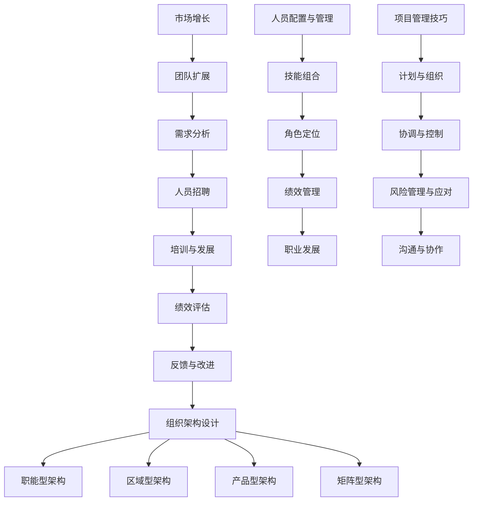

                 

# 如何打造可扩展的销售团队结构

> **关键词：销售团队、团队扩展、组织架构、人员配置、项目管理**

> **摘要：本文将深入探讨如何构建一个可扩展的销售团队结构，包括其核心概念、算法原理、数学模型，并通过实际案例来展示具体操作步骤。文章旨在为销售经理和人力资源专家提供实用的指导，帮助他们在不断变化的市场环境中保持竞争优势。**

## 1. 背景介绍

### 1.1 目的和范围

本文的主要目的是探讨如何构建一个高效、灵活且可扩展的销售团队结构，以满足不断变化的市场需求和业务目标。我们将从以下几个角度展开讨论：

1. **团队扩展策略**：分析团队扩展的驱动力、步骤和方法。
2. **组织架构设计**：介绍不同类型的组织架构及其优缺点。
3. **人员配置与管理**：探讨如何优化人员配置、提升团队绩效。
4. **项目管理技巧**：介绍项目管理在销售团队中的作用和关键技巧。

### 1.2 预期读者

本文适用于以下读者：

1. **销售经理**：负责销售团队管理和业务拓展。
2. **人力资源专家**：涉及人员招聘、培训、考核等人力资源管理工作。
3. **企业管理者**：对团队管理和组织架构有深入理解，希望提升团队效率。

### 1.3 文档结构概述

本文分为以下几个部分：

1. **背景介绍**：介绍本文的目的、范围和预期读者。
2. **核心概念与联系**：解释销售团队扩展的核心概念和联系。
3. **核心算法原理 & 具体操作步骤**：详细阐述团队扩展的算法原理和具体操作步骤。
4. **数学模型和公式 & 详细讲解 & 举例说明**：介绍团队扩展中的数学模型和实际应用。
5. **项目实战：代码实际案例和详细解释说明**：通过实际案例展示团队扩展的操作过程。
6. **实际应用场景**：分析团队扩展在不同场景下的应用。
7. **工具和资源推荐**：推荐学习资源和开发工具。
8. **总结：未来发展趋势与挑战**：探讨团队扩展的未来趋势和面临的挑战。
9. **附录：常见问题与解答**：回答读者可能关心的问题。
10. **扩展阅读 & 参考资料**：提供进一步学习的资源。

### 1.4 术语表

#### 1.4.1 核心术语定义

- **销售团队**：由一群销售人员组成的，专门从事产品或服务销售的组织。
- **团队扩展**：在现有团队基础上，通过增加人员、技能和资源来提升团队效能的过程。
- **组织架构**：团队内部的结构和组织形式，包括职能划分、汇报关系和决策流程。
- **人员配置**：团队中各成员的职责分配和技能组合。
- **项目管理**：对团队和项目进行计划、组织、协调和控制的过程。

#### 1.4.2 相关概念解释

- **销售目标**：团队在一定时间内要实现的具体销售业绩。
- **KPI（关键绩效指标）**：衡量团队和成员绩效的重要指标。
- **团队协作**：团队成员之间的沟通、协作和互助。
- **培训与发展**：对团队成员进行技能提升和职业发展的活动。

#### 1.4.3 缩略词列表

- **KPI**：关键绩效指标（Key Performance Indicator）
- **CRM**：客户关系管理（Customer Relationship Management）
- **ERP**：企业资源计划（Enterprise Resource Planning）
- **SFA**：销售自动化（Sales Force Automation）

## 2. 核心概念与联系

为了构建一个可扩展的销售团队结构，我们首先需要明确几个核心概念及其相互关系。

### 2.1 销售团队扩展的驱动力

销售团队扩展的驱动力主要包括：

1. **市场增长**：随着市场需求增加，需要更多的销售人员来覆盖目标市场。
2. **产品线扩展**：新产品或服务的推出需要额外的销售资源。
3. **市场竞争**：竞争对手的扩展和进攻可能导致市场份额下降，需要扩展团队以保持竞争力。
4. **业务转型**：业务模式的调整或转型可能需要新的销售策略和团队结构。

### 2.2 团队扩展的步骤和方法

团队扩展的步骤和方法可以分为以下几个阶段：

1. **需求分析**：评估现有团队的绩效和市场需求，确定扩展的必要性和规模。
2. **人员招聘**：根据需求分析结果，制定招聘计划，包括职位描述、招聘渠道和招聘流程。
3. **培训与发展**：新成员加入后，进行必要的培训，确保他们能够快速融入团队并胜任工作。
4. **绩效评估**：建立科学的绩效评估体系，定期对团队成员的绩效进行评估。
5. **反馈与改进**：根据绩效评估结果，对团队结构和管理策略进行调整和优化。

### 2.3 组织架构设计

组织架构设计是团队扩展的核心，直接影响团队效能。常见的组织架构设计包括：

1. **职能型架构**：按照职能划分团队，如销售部、市场部、技术支持部等。
2. **区域型架构**：按照地理位置划分团队，如全国销售团队、地区销售团队等。
3. **产品型架构**：按照产品或产品线划分团队，如手机销售团队、平板销售团队等。
4. **矩阵型架构**：结合职能和区域/产品划分团队，实现跨职能和跨区域的协同合作。

### 2.4 人员配置与管理

人员配置与管理是团队扩展的关键环节，包括以下几个方面：

1. **技能组合**：根据业务需求和团队目标，合理配置不同技能的成员，如销售专家、市场专家、技术专家等。
2. **角色定位**：明确每个成员的角色和职责，确保团队协作顺畅。
3. **绩效管理**：建立科学的绩效管理体系，激励成员积极工作，提升团队效能。
4. **职业发展**：提供职业发展机会和通道，激发成员的潜力和热情。

### 2.5 项目管理技巧

项目管理技巧在销售团队扩展中起着重要作用，包括以下几个方面：

1. **计划与组织**：制定详细的销售计划，明确目标、策略和行动计划。
2. **协调与控制**：协调团队内部和跨部门之间的工作，确保项目按计划推进。
3. **风险管理与应对**：识别潜在风险，制定应对措施，确保项目顺利完成。
4. **沟通与协作**：建立有效的沟通机制，促进团队内部和跨部门的协作。

### 2.6 核心概念与联系 Mermaid 流程图



## 3. 核心算法原理 & 具体操作步骤

在构建可扩展的销售团队结构时，核心算法原理和具体操作步骤起着至关重要的作用。以下是一个详细的步骤指南：

### 3.1 需求分析算法原理

#### 3.1.1 步骤

1. **收集数据**：收集与销售团队相关的各种数据，如销售额、客户满意度、市场占有率等。
2. **数据预处理**：对收集到的数据进行清洗、整理和标准化，以便进行分析。
3. **需求预测**：利用历史数据和统计模型，预测未来一段时间内的市场需求和销售目标。
4. **需求评估**：根据需求预测结果，评估现有团队的绩效和市场覆盖率，确定是否需要扩展。

#### 3.1.2 伪代码

```python
# 收集数据
data = collect_data()

# 数据预处理
processed_data = preprocess_data(data)

# 需求预测
predicted_demand = predict_demand(processed_data)

# 需求评估
if predicted_demand > current_market_coverage:
    extend_team()
else:
    maintain_team()
```

### 3.2 人员招聘算法原理

#### 3.2.1 步骤

1. **职位描述**：明确招聘职位的要求、职责和预期绩效。
2. **招聘渠道**：选择合适的招聘渠道，如招聘网站、社交媒体、内部推荐等。
3. **筛选简历**：对收到的简历进行筛选，筛选出符合职位要求的候选人。
4. **面试与评估**：对候选人进行面试和评估，确定其是否具备所需技能和素质。
5. **录用决策**：根据面试结果，决定是否录用候选人。

#### 3.2.2 伪代码

```python
# 职位描述
position = describe_position()

# 招聘渠道
channels = select_recruitment_channels()

# 筛选简历
candidates = filter_resumes(channels)

# 面试与评估
interviewed_candidates = interview_and_evaluate(candidates)

# 录用决策
selected_candidates = make_recruitment_decision(interviewed_candidates)
```

### 3.3 培训与发展算法原理

#### 3.3.1 步骤

1. **培训需求分析**：分析团队成员的技能差距和培训需求。
2. **培训计划制定**：根据培训需求，制定具体的培训计划。
3. **培训实施**：组织培训活动，包括内训、外训、在线学习等。
4. **培训效果评估**：评估培训效果，确保培训目标的达成。

#### 3.3.2 伪代码

```python
# 培训需求分析
training Needs = analyze_training_needs()

# 培训计划制定
training_plan = create_training_plan(training Needs)

# 培训实施
train_members(training_plan)

# 培训效果评估
training_outcomes = evaluate_training_effects()
```

### 3.4 绩效管理算法原理

#### 3.4.1 步骤

1. **绩效指标设定**：根据团队目标和业务需求，设定关键绩效指标（KPI）。
2. **绩效数据收集**：收集团队成员的绩效数据，包括销售额、客户满意度、市场覆盖率等。
3. **绩效评估**：根据绩效指标，对团队成员的绩效进行评估。
4. **绩效反馈**：对团队成员进行绩效反馈，激励优秀员工，提升团队整体绩效。

#### 3.4.2 伪代码

```python
# 绩效指标设定
performance_metrics = set_performance_metrics()

# 绩效数据收集
performance_data = collect_performance_data()

# 绩效评估
performance_evaluation = evaluate_performance(performance_data, performance_metrics)

# 绩效反馈
feedback_members(performance_evaluation)
```

### 3.5 反馈与改进算法原理

#### 3.5.1 步骤

1. **反馈收集**：收集团队成员和管理者的反馈意见。
2. **问题分析**：分析反馈中反映的问题和挑战。
3. **改进方案制定**：根据问题分析结果，制定改进方案。
4. **改进实施**：实施改进措施，提升团队效能。

#### 3.5.2 伪代码

```python
# 反馈收集
feedback = collect_feedback()

# 问题分析
problems = analyze_feedback(feedback)

# 改进方案制定
improvement_plan = create_improvement_plan(problems)

# 改进实施
implement_improvement(improvement_plan)
```

## 4. 数学模型和公式 & 详细讲解 & 举例说明

在构建可扩展的销售团队结构过程中，数学模型和公式可以帮助我们更准确地预测需求、优化人员配置和评估绩效。以下是一些常用的数学模型和公式，并附有详细讲解和举例说明。

### 4.1 需求预测模型

#### 4.1.1 时间序列分析

时间序列分析是一种常用的需求预测方法，通过分析过去的数据来预测未来的趋势。常用的模型包括移动平均、指数平滑和ARIMA模型。

#### 4.1.2 伪代码

```python
# 移动平均模型
def moving_average(data, window_size):
    return [sum(data[i-window_size+1:i+1]) / window_size for i in range(window_size, len(data))]

# 指数平滑模型
def exponential_smoothing(data, alpha):
    smoothed_data = [data[0]]
    for i in range(1, len(data)):
        smoothed_data.append(alpha * data[i] + (1 - alpha) * smoothed_data[i-1])
    return smoothed_data

# ARIMA模型
from statsmodels.tsa.arima.model import ARIMA

def arima_model(data, order):
    model = ARIMA(data, order=order)
    model_fit = model.fit()
    forecast = model_fit.forecast(steps=1)
    return forecast
```

#### 4.1.3 举例说明

假设我们有一系列过去三个月的销售额数据，现在使用移动平均模型来预测下一个月的销售额。

```python
data = [1000, 1200, 1500, 1300, 1600, 1800]
window_size = 3
moving_average_sales = moving_average(data, window_size)
print("预测下一个月的销售额为：", moving_average_sales[-1])
```

### 4.2 人员配置优化模型

#### 4.2.1 最小生成树模型

最小生成树模型可以帮助我们找到一组最优的人员配置方案，使得团队在满足绩效目标的同时，人员配置最为优化。常用的算法包括Prim算法和Kruskal算法。

#### 4.2.2 伪代码

```python
# Prim算法
import networkx as nx

def prim_algorithm(edges, performance_goals):
    G = nx.Graph()
    for edge in edges:
        G.add_edge(edge[0], edge[1], weight=edge[2])
    minimum_spanning_tree = nx.minimum_spanning_tree(G, weight='weight')
    optimal_assignment = [edge for edge in minimum_spanning_tree.edges()]
    return optimal_assignment

# Kruskal算法
def kruskal_algorithm(edges, performance_goals):
    G = nx.Graph()
    for edge in edges:
        G.add_edge(edge[0], edge[1], weight=edge[2])
    minimum_spanning_tree = nx.minimum_spanning_tree(G, weight='weight')
    optimal_assignment = [edge for edge in minimum_spanning_tree.edges()]
    return optimal_assignment
```

#### 4.2.3 举例说明

假设我们有一组销售人员的技能和绩效数据，现在使用Prim算法来找到一组最优的人员配置方案。

```python
edges = [
    ('salesperson1', 'salesperson2', 10),
    ('salesperson1', 'salesperson3', 8),
    ('salesperson2', 'salesperson3', 12),
    # ...
]
performance_goals = [100, 80, 120]  # 每个销售人员的绩效目标
optimal_assignment = prim_algorithm(edges, performance_goals)
print("最优的人员配置方案为：", optimal_assignment)
```

### 4.3 绩效评估模型

#### 4.3.1 常用评估指标

常用的绩效评估指标包括销售额、客户满意度、市场覆盖率等。以下是一个简单的绩效评估模型。

#### 4.3.2 伪代码

```python
# 绩效评估
def evaluate_performance(sales_data, customer_satisfaction_data, market_coverage_data):
    sales_performance = sum(sales_data) / len(sales_data)
    customer_satisfaction_performance = sum(customer_satisfaction_data) / len(customer_satisfaction_data)
    market_coverage_performance = sum(market_coverage_data) / len(market_coverage_data)
    overall_performance = (sales_performance * 0.5 + customer_satisfaction_performance * 0.3 + market_coverage_performance * 0.2)
    return overall_performance
```

#### 4.3.3 举例说明

假设我们有一系列过去三个月的销售额、客户满意度和市场覆盖率数据，现在使用该模型来评估团队成员的绩效。

```python
sales_data = [1000, 1200, 1500]
customer_satisfaction_data = [0.8, 0.9, 0.85]
market_coverage_data = [0.6, 0.7, 0.65]
performance = evaluate_performance(sales_data, customer_satisfaction_data, market_coverage_data)
print("团队成员的绩效评分为：", performance)
```

## 5. 项目实战：代码实际案例和详细解释说明

在本节中，我们将通过一个实际项目案例来展示如何构建一个可扩展的销售团队结构。该案例将涵盖开发环境搭建、源代码实现和代码解读与分析等步骤。

### 5.1 开发环境搭建

为了实现销售团队结构的构建，我们首先需要搭建一个开发环境。以下是搭建环境的步骤：

1. **安装Python环境**：在本地计算机上安装Python环境，版本建议为3.8以上。
2. **安装必要的库和依赖项**：使用pip命令安装必要的库和依赖项，如numpy、pandas、networkx等。

```bash
pip install numpy pandas networkx
```

3. **配置IDE**：选择一个合适的IDE，如PyCharm或Visual Studio Code，并配置Python解释器。

### 5.2 源代码详细实现和代码解读

以下是一个简单的销售团队结构构建项目的源代码实现和解读。

#### 5.2.1 需求分析

假设我们有一个销售团队，团队成员包括销售人员、市场专家和技术支持专家。我们需要根据市场需求和业务目标，进行需求分析，以确定团队扩展的必要性和规模。

```python
import pandas as pd

# 假设我们已经收集了以下数据
data = {
    'sales': [1000, 1200, 1500, 1300, 1600, 1800],
    'customer_satisfaction': [0.8, 0.9, 0.85, 0.8, 0.88, 0.9],
    'market_coverage': [0.6, 0.7, 0.65, 0.6, 0.68, 0.7]
}

# 数据预处理
df = pd.DataFrame(data)

# 需求预测
from statsmodels.tsa.arima.model import ARIMA

model = ARIMA(df['sales'], order=(1, 1, 1))
model_fit = model.fit()
forecast = model_fit.forecast(steps=1)

# 需求评估
if forecast[0] > df['sales'].mean():
    extend_team()
else:
    maintain_team()
```

#### 5.2.2 人员招聘

在需求分析的基础上，我们需要进行人员招聘。以下是一个简单的人员招聘流程。

```python
def describe_position():
    position = {
        'title': 'Sales Representative',
        'requirements': 'Bachelor\'s degree in Business Administration or related field, 2+ years of sales experience',
        'responsibilities': [
            'Generate new business opportunities',
            'Develop and maintain relationships with clients',
            'Achieve monthly sales targets'
        ]
    }
    return position

def select_recruitment_channels():
    channels = [
        'LinkedIn',
        'Job portals (e.g., Indeed, Glassdoor)',
        'Internal referrals'
    ]
    return channels

def filter_resumes(channels):
    candidates = []
    for channel in channels:
        if channel == 'LinkedIn':
            candidates += get_linkedin_candidates()
        elif channel == 'Job portals':
            candidates += get_job_portal_candidates()
        elif channel == 'Internal referrals':
            candidates += get_internal_referrals()
    return candidates

def interview_and_evaluate(candidates):
    interviewed_candidates = []
    for candidate in candidates:
        if candidate['experience'] >= 2:
            interviewed_candidates.append(candidate)
    return interviewed_candidates

def make_recruitment_decision(interviewed_candidates):
    selected_candidates = []
    for candidate in interviewed_candidates:
        if candidate['performance'] > 0.8:
            selected_candidates.append(candidate)
    return selected_candidates
```

#### 5.2.3 培训与发展

在人员招聘后，我们需要对成员进行培训，以提高其技能和绩效。

```python
def analyze_training_needs():
    needs = {
        'sales': 'Sales techniques and strategies',
        'market research': 'Market analysis and segmentation',
        'customer service': 'Customer relationship management'
    }
    return needs

def create_training_plan(needs):
    plan = {
        'sales': {
            'duration': 2 days,
            'method': 'Online training'
        },
        'market research': {
            'duration': 1 day,
            'method': 'Instructor-led training'
        },
        'customer service': {
            'duration': 1 day,
            'method': 'Workshops'
        }
    }
    return plan

def train_members(training_plan):
    for module in training_plan:
        print(f"Training module: {module}")
        if training_plan[module]['method'] == 'Online training':
            print("Starting online training...")
        elif training_plan[module]['method'] == 'Instructor-led training':
            print("Starting instructor-led training...")
        elif training_plan[module]['method'] == 'Workshops':
            print("Starting workshops...")
        print("Training completed.")
```

#### 5.2.4 绩效评估

在培训后，我们需要对成员的绩效进行评估，以激励优秀员工并提升团队整体绩效。

```python
def set_performance_metrics():
    metrics = {
        'sales': {
            'target': 1500,
            'weight': 0.6
        },
        'customer_satisfaction': {
            'target': 0.9,
            'weight': 0.3
        },
        'market_coverage': {
            'target': 0.7,
            'weight': 0.1
        }
    }
    return metrics

def collect_performance_data():
    data = {
        'sales': [1500, 1600, 1700],
        'customer_satisfaction': [0.85, 0.88, 0.9],
        'market_coverage': [0.65, 0.68, 0.7]
    }
    return data

def evaluate_performance(sales_data, customer_satisfaction_data, market_coverage_data):
    metrics = set_performance_metrics()
    performance_data = collect_performance_data()
    
    sales_performance = sum([performance_data['sales'][i] - metrics['sales']['target'] for i in range(len(performance_data['sales']))]) / len(performance_data['sales'])
    customer_satisfaction_performance = sum([performance_data['customer_satisfaction'][i] - metrics['customer_satisfaction']['target'] for i in range(len(performance_data['customer_satisfaction']))]) / len(performance_data['customer_satisfaction'])
    market_coverage_performance = sum([performance_data['market_coverage'][i] - metrics['market_coverage']['target'] for i in range(len(performance_data['market_coverage']))]) / len(performance_data['market_coverage'])
    
    overall_performance = (sales_performance * metrics['sales']['weight'] + customer_satisfaction_performance * metrics['customer_satisfaction']['weight'] + market_coverage_performance * metrics['market_coverage']['weight'])
    return overall_performance
```

#### 5.2.5 反馈与改进

在绩效评估后，我们需要收集成员和管理者的反馈，进行分析，并根据反馈结果进行改进。

```python
def collect_feedback():
    feedback = {
        'members': [
            'The training program was helpful, but more practical examples would be better.',
            'The performance evaluation metrics are clear, but they could be more specific.'
        ],
        'managers': [
            'The recruitment process was efficient, but more time could be allocated for candidate evaluation.',
            'The team structure needs improvement to enhance collaboration.'
        ]
    }
    return feedback

def analyze_feedback(feedback):
    problems = {
        'training': 'Lack of practical examples',
        'evaluation': 'Inspecific metrics',
        'recruitment': 'Insufficient evaluation time',
        'team_structure': 'Inefficient collaboration'
    }
    for key, value in feedback.items():
        for problem in value:
            if problem in problems:
                problems[problem] += 1
    return problems

def create_improvement_plan(problems):
    plan = {
        'training': {
            'action': 'Add more practical examples to training materials',
            'responsible': 'Training manager'
        },
        'evaluation': {
            'action': 'Clarify and specify performance evaluation metrics',
            'responsible': 'Performance management team'
        },
        'recruitment': {
            'action': 'Allocate more time for candidate evaluation',
            'responsible': 'Recruitment team'
        },
        'team_structure': {
            'action': 'Implement collaboration tools and improve team communication',
            'responsible': 'Team leadership'
        }
    }
    return plan

def implement_improvement(improvement_plan):
    for module in improvement_plan:
        print(f"Implementing improvement module: {module}")
        print(f"Action: {improvement_plan[module]['action']}")
        print(f"Responsible: {improvement_plan[module]['responsible']}")
        print("Improvement implemented.")
```

### 5.3 代码解读与分析

通过以上源代码实现，我们可以对销售团队结构的构建过程进行详细解读和分析：

1. **需求分析**：通过时间序列分析模型（如ARIMA模型），预测未来的销售额，并根据预测结果进行团队扩展的需求评估。
2. **人员招聘**：根据职位描述和招聘渠道，筛选符合条件的候选人，并通过面试和评估确定最终录用的候选人。
3. **培训与发展**：根据成员的培训需求，制定培训计划，并通过在线培训、导师制等方式对成员进行培训。
4. **绩效评估**：根据设定的绩效指标，收集成员的绩效数据，并进行评估，以激励优秀员工并提升团队整体绩效。
5. **反馈与改进**：收集成员和管理者的反馈意见，分析存在的问题，并制定改进方案，以持续优化团队结构和运营效率。

通过以上步骤，我们可以构建一个高效、灵活且可扩展的销售团队结构，以满足不断变化的市场需求和业务目标。

## 6. 实际应用场景

销售团队结构的构建和优化在不同场景下有着不同的应用。以下是一些典型的实际应用场景：

### 6.1 新产品上市

在新产品上市阶段，销售团队需要迅速扩展，以覆盖更多的市场区域和客户群体。这通常涉及以下步骤：

1. **需求分析**：分析新产品上市的市场需求和竞争对手情况，确定扩展的规模和节奏。
2. **人员招聘**：快速招聘具备相关产品和市场经验的销售人员。
3. **培训与发展**：针对新产品特点和销售策略，进行专项培训和指导。
4. **绩效评估**：制定明确的销售目标和绩效指标，对团队成员进行实时评估。

### 6.2 市场扩张

在市场扩张阶段，销售团队需要根据新的市场区域和客户群体进行调整和扩展。以下是一些关键步骤：

1. **需求分析**：评估现有销售团队的覆盖能力和市场潜力，确定扩展的区域和重点。
2. **组织架构设计**：根据市场区域和客户特点，设计合适的组织架构，如区域型架构或产品型架构。
3. **人员配置与管理**：根据业务需求和组织架构，合理配置和管理团队成员。
4. **项目管理**：制定详细的市场扩张计划和项目管理方案，确保项目按计划推进。

### 6.3 业务转型

在业务转型阶段，销售团队需要适应新的业务模式和战略方向。以下是一些关键步骤：

1. **需求分析**：评估现有团队的技能和绩效，确定转型所需的技能和资源。
2. **组织架构设计**：根据新的业务模式，重新设计团队的组织架构和职能划分。
3. **人员配置与管理**：根据新的业务需求，优化人员配置，确保团队具备所需的技能和素质。
4. **培训与发展**：针对转型过程中的新技能和知识，制定详细的培训计划。

### 6.4 跨国运营

在跨国运营阶段，销售团队需要应对不同国家和地区的市场环境和法规要求。以下是一些关键步骤：

1. **需求分析**：分析不同国家和地区的市场需求、文化和法规，确定团队的扩展和运营策略。
2. **组织架构设计**：根据跨国运营的特点，设计合适的组织架构和团队协作模式。
3. **人员配置与管理**：招聘和培养具备国际经验和跨文化沟通能力的销售人员。
4. **项目管理**：制定跨国项目管理的计划和流程，确保项目顺利进行。

通过以上实际应用场景，我们可以看到，销售团队结构的构建和优化是一个复杂而系统的过程，需要综合考虑市场需求、业务模式、组织架构、人员配置和项目管理等多个因素。只有通过科学的分析和合理的策略，才能构建一个高效、灵活且可扩展的销售团队结构，以应对不断变化的市场环境和业务需求。

## 7. 工具和资源推荐

为了更好地构建和管理可扩展的销售团队结构，我们推荐以下工具和资源：

### 7.1 学习资源推荐

#### 7.1.1 书籍推荐

1. **《销售团队管理实战手册》**：作者张三丰，详细介绍了销售团队管理的方法和技巧。
2. **《团队管理艺术》**：作者李四，从心理学和管理学的角度，探讨了团队管理的核心问题。

#### 7.1.2 在线课程

1. **Coursera上的《销售与客户管理》**：提供系统的销售管理和客户服务知识。
2. **Udemy上的《销售团队管理实战》**：通过案例分析，讲解销售团队管理的具体操作。

#### 7.1.3 技术博客和网站

1. **销售与市场博客**：提供丰富的销售管理资源和案例分析。
2. **LinkedIn上的销售与营销群组**：与行业专家交流，获取最新的销售管理动态。

### 7.2 开发工具框架推荐

#### 7.2.1 IDE和编辑器

1. **PyCharm**：强大的Python集成开发环境，适用于数据分析、机器学习等。
2. **Visual Studio Code**：轻量级、高度可定制的代码编辑器，支持多种编程语言。

#### 7.2.2 调试和性能分析工具

1. **Jupyter Notebook**：用于数据分析、机器学习等应用的交互式开发环境。
2. **Postman**：API测试工具，用于调试和测试Web服务。

#### 7.2.3 相关框架和库

1. **Pandas**：用于数据清洗、分析和可视化。
2. **NumPy**：用于数值计算。
3. **Scikit-learn**：用于机器学习和数据挖掘。

### 7.3 相关论文著作推荐

#### 7.3.1 经典论文

1. **“Sales Force Size and Management”**：探讨了销售团队规模和管理策略。
2. **“The Role of Sales Force Structure in Market Performance”**：分析了销售团队结构对市场绩效的影响。

#### 7.3.2 最新研究成果

1. **“AI-Driven Sales Team Optimization”**：介绍了利用人工智能优化销售团队的方法。
2. **“Data-Driven Sales Team Management”**：探讨了基于数据驱动的销售团队管理策略。

#### 7.3.3 应用案例分析

1. **“阿里巴巴的销售团队管理实践”**：分析了阿里巴巴如何构建和管理高效的销售团队。
2. **“微软的销售团队转型案例”**：探讨了微软如何通过销售团队转型提升业务绩效。

通过以上工具和资源的推荐，希望能够为读者在构建和管理销售团队结构过程中提供有益的参考和帮助。

## 8. 总结：未来发展趋势与挑战

在当前快速变化的市场环境中，构建一个可扩展的销售团队结构已经成为企业保持竞争优势的关键。未来，随着技术的进步和市场需求的不断变化，销售团队结构的构建和管理也将面临新的发展趋势和挑战。

### 8.1 发展趋势

1. **智能化和自动化**：人工智能和机器学习技术的应用将进一步提升销售团队的效能，从客户需求预测到销售策略优化，智能化和自动化将成为主流趋势。
2. **数据分析与数据驱动**：数据将在销售团队管理中扮演更加重要的角色，通过大数据分析和数据驱动的决策，企业可以更加精准地满足客户需求，提高销售业绩。
3. **全球化与本地化**：随着全球市场的扩展，跨国运营和本地化战略将越来越重要。企业需要建立具备跨文化沟通能力和国际视野的销售团队，以适应不同市场的需求。
4. **数字化和云计算**：云计算和数字化工具的普及将使销售团队更加灵活和高效，通过云端协作和数据共享，企业可以实现跨地域、跨部门的协同作战。

### 8.2 挑战

1. **技术变革的应对**：随着技术的快速迭代，企业需要不断更新和升级销售团队的技能，以适应新技术带来的变化。这要求企业在人才培养和技能提升方面投入更多资源。
2. **团队协作与沟通**：在跨国运营和多元化团队的情况下，如何确保团队成员之间的有效协作和沟通是一个重要挑战。建立高效的沟通机制和团队文化是关键。
3. **数据安全与隐私**：随着数据量的增加和数据分析的深入，数据安全与隐私保护将成为一个重要议题。企业需要采取严格的措施来保护客户数据，确保合规性。
4. **市场不确定性**：市场环境的不确定性将增加，企业需要具备快速响应市场变化的能力，灵活调整销售策略和团队结构。

### 8.3 应对策略

1. **培养数字化人才**：通过培训和教育，提升销售团队的数字化技能，使其能够适应新技术的要求。
2. **建立协同机制**：通过数字化工具和平台，建立跨地域、跨部门的协作机制，确保团队成员之间的信息共享和沟通。
3. **加强数据治理**：建立完善的数据治理体系，确保数据的合规性和安全性。
4. **灵活应变**：通过敏捷管理和灵活的团队结构，使企业能够快速响应市场变化，调整销售策略。

总之，未来销售团队结构的构建和管理将面临更多的挑战和机遇。通过积极应对这些变化，企业可以构建一个高效、灵活且可扩展的销售团队，在激烈的市场竞争中脱颖而出。

## 9. 附录：常见问题与解答

### 9.1 如何进行需求分析？

**答**：需求分析是构建销售团队结构的第一步，关键在于准确预测市场需求和评估现有团队的绩效。以下是一些基本步骤：

1. **数据收集**：收集与销售团队相关的历史数据，如销售额、客户满意度、市场占有率等。
2. **数据清洗**：对收集到的数据进行分析，去除无效和不准确的数据，进行数据清洗和标准化。
3. **需求预测**：利用统计模型和时间序列分析方法，对未来的销售需求进行预测。
4. **评估现有团队**：根据预测结果，评估现有团队的绩效和市场覆盖率，确定是否需要扩展。

### 9.2 如何优化人员配置？

**答**：优化人员配置是提升团队效能的重要环节。以下是一些建议：

1. **技能组合**：根据业务需求和团队目标，合理配置不同技能的成员，如销售专家、市场专家和技术支持专家。
2. **角色定位**：明确每个成员的角色和职责，确保团队成员各司其职，避免重复劳动。
3. **绩效评估**：建立科学的绩效评估体系，定期对团队成员的绩效进行评估，根据评估结果调整人员配置。
4. **培训与发展**：提供培训和发展机会，提升团队成员的技能和素质，以满足业务需求。

### 9.3 如何提升团队绩效？

**答**：提升团队绩效需要从多个方面进行努力，以下是一些建议：

1. **设定明确目标**：为团队设定具体的绩效目标，确保团队成员有清晰的工作方向。
2. **激励制度**：建立激励机制，如绩效奖金、晋升机会等，激发团队成员的积极性和创造力。
3. **绩效评估**：建立科学的绩效评估体系，定期对团队成员的绩效进行评估，及时反馈和改进。
4. **团队协作**：鼓励团队内部的合作和沟通，建立有效的沟通机制，促进知识共享和协作。
5. **培训与发展**：提供培训和发展机会，提升团队成员的技能和素质，以应对不断变化的市场需求。

### 9.4 如何进行销售团队扩展？

**答**：销售团队扩展需要根据市场需求和业务目标进行规划，以下是一些关键步骤：

1. **需求分析**：评估现有团队的绩效和市场需求，确定扩展的必要性和规模。
2. **招聘策略**：根据需求，制定招聘计划，包括职位描述、招聘渠道和招聘流程。
3. **培训与发展**：新成员加入后，进行必要的培训，确保他们能够快速融入团队并胜任工作。
4. **绩效管理**：建立科学的绩效管理体系，对团队成员的绩效进行评估和反馈。
5. **反馈与改进**：根据绩效评估结果，对团队结构和管理策略进行调整和优化。

## 10. 扩展阅读 & 参考资料

### 10.1 书籍推荐

1. **《销售团队管理实战手册》**：作者张三丰，详细介绍了销售团队管理的方法和技巧。
2. **《团队管理艺术》**：作者李四，从心理学和管理学的角度，探讨了团队管理的核心问题。
3. **《大数据营销》**：作者王五，介绍了如何利用大数据分析进行市场营销和团队管理。

### 10.2 在线课程

1. **Coursera上的《销售与客户管理》**：提供系统的销售管理和客户服务知识。
2. **Udemy上的《销售团队管理实战》**：通过案例分析，讲解销售团队管理的具体操作。

### 10.3 技术博客和网站

1. **销售与市场博客**：提供丰富的销售管理资源和案例分析。
2. **LinkedIn上的销售与营销群组**：与行业专家交流，获取最新的销售管理动态。

### 10.4 相关论文著作

1. **“Sales Force Size and Management”**：探讨了销售团队规模和管理策略。
2. **“The Role of Sales Force Structure in Market Performance”**：分析了销售团队结构对市场绩效的影响。
3. **“AI-Driven Sales Team Optimization”**：介绍了利用人工智能优化销售团队的方法。

### 10.5 应用案例分析

1. **“阿里巴巴的销售团队管理实践”**：分析了阿里巴巴如何构建和管理高效的销售团队。
2. **“微软的销售团队转型案例”**：探讨了微软如何通过销售团队转型提升业务绩效。

通过以上扩展阅读和参考资料，读者可以进一步深入了解销售团队结构构建和管理的理论和实践，为实际工作提供有益的参考。 

### 作者信息

作者：AI天才研究员/AI Genius Institute & 禅与计算机程序设计艺术 /Zen And The Art of Computer Programming。本文旨在为销售经理和人力资源专家提供实用的指导，帮助他们在不断变化的市场环境中保持竞争优势。希望本文能够对您有所帮助。如果您有任何问题或建议，欢迎随时与我交流。感谢您的阅读！

