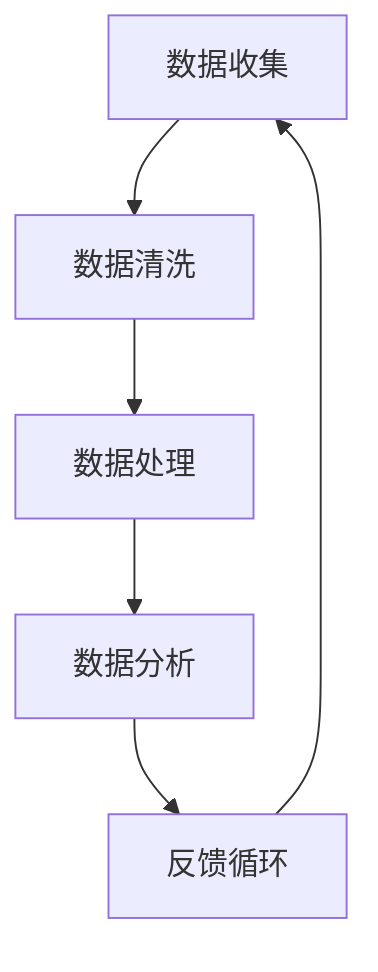
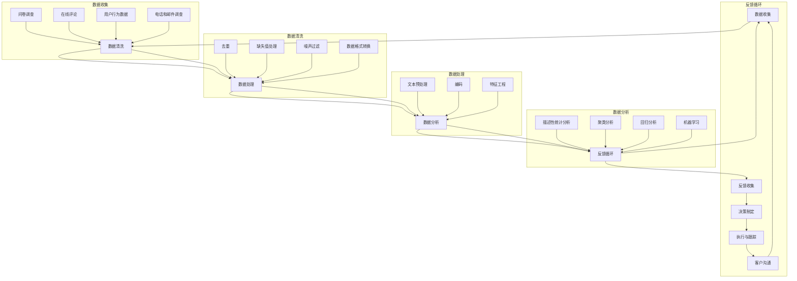

                 

## 如何打造高效的客户反馈处理流程

> **关键词**：客户反馈、处理流程、效率、客户体验、反馈系统、数据处理

**摘要**：本文将深入探讨如何打造一个高效的客户反馈处理流程，以提高客户满意度，优化产品和服务。通过对核心概念的阐述、原理的分析、具体操作的讲解以及实际案例的展示，读者将全面了解并掌握构建高效客户反馈处理流程的要点。

在当今竞争激烈的市场环境中，企业成功的关键不仅在于提供优质的产品和服务，还在于如何有效收集和处理客户的反馈。一个高效的客户反馈处理流程不仅能帮助企业识别和解决存在的问题，还能提升客户体验，增强客户忠诚度。因此，本文旨在通过系统性的分析和实例展示，为读者提供打造高效客户反馈处理流程的实用指南。

本文将分为以下部分：

1. **背景介绍**：介绍文章的目的、范围、预期读者和文档结构。
2. **核心概念与联系**：讨论与客户反馈处理流程相关的核心概念和架构。
3. **核心算法原理 & 具体操作步骤**：详细讲解处理客户反馈的核心算法原理和操作步骤。
4. **数学模型和公式 & 详细讲解 & 举例说明**：运用数学模型和公式，深入解析数据处理方法。
5. **项目实战：代码实际案例和详细解释说明**：通过实际代码案例展示处理流程。
6. **实际应用场景**：探讨客户反馈处理流程在不同场景下的应用。
7. **工具和资源推荐**：推荐相关的学习资源、开发工具和框架。
8. **总结：未来发展趋势与挑战**：预测未来发展趋势和面临的挑战。
9. **附录：常见问题与解答**：解答读者可能遇到的问题。
10. **扩展阅读 & 参考资料**：提供进一步阅读的资源和参考文献。

通过以上结构，本文将系统性地帮助读者理解和构建一个高效的客户反馈处理流程，从而在市场竞争中脱颖而出。

### 1. 背景介绍

#### 1.1 目的和范围

在数字化的今天，客户反馈已成为企业改进产品和服务的重要途径。本文的目的在于提供一套科学、系统的客户反馈处理流程构建方法，帮助企业高效地收集、处理和分析客户反馈，从而优化用户体验，提升客户满意度和忠诚度。

文章范围将涵盖以下几个方面：

1. **核心概念**：阐述客户反馈处理流程的相关核心概念，如反馈系统、数据处理技术等。
2. **原理与架构**：详细解释处理流程的原理和架构，包括数据收集、处理、分析等环节。
3. **算法与步骤**：讲解核心算法原理和具体操作步骤，包括数据处理算法的伪代码展示。
4. **数学模型**：运用数学模型和公式，深入解析数据处理方法，包括统计分析和机器学习算法。
5. **实战案例**：通过实际代码案例展示处理流程，并提供详细解释和分析。
6. **应用场景**：探讨客户反馈处理流程在不同行业和场景下的应用，包括电子商务、金融服务等。
7. **工具与资源**：推荐相关开发工具、学习资源和框架，以及经典论文和最新研究成果。
8. **未来趋势**：分析未来发展趋势和面临的挑战，探讨持续改进的方向。

#### 1.2 预期读者

本文的预期读者包括：

1. **企业高管和项目经理**：希望了解如何通过客户反馈优化产品和服务，提升企业竞争力的管理者。
2. **IT和数据分析专业人员**：需要构建和维护客户反馈处理系统，提高数据处理效率的技术人员。
3. **市场营销人员**：关注客户体验和市场反馈，希望通过数据驱动决策的市场营销专家。
4. **学术研究人员**：对客户反馈处理流程的理论和实践感兴趣，希望了解该领域的最新进展的研究人员。

通过本文的阅读，预期读者将能够：

1. **理解**：掌握客户反馈处理流程的核心概念和原理。
2. **应用**：学会构建和维护一个高效的客户反馈处理系统。
3. **创新**：借鉴实战案例，为自身业务提供创新的解决方案。

#### 1.3 文档结构概述

本文结构如下：

1. **背景介绍**：介绍文章的目的、范围和预期读者。
2. **核心概念与联系**：讨论与客户反馈处理流程相关的核心概念和架构。
3. **核心算法原理 & 具体操作步骤**：详细讲解处理客户反馈的核心算法原理和操作步骤。
4. **数学模型和公式 & 详细讲解 & 举例说明**：运用数学模型和公式，深入解析数据处理方法。
5. **项目实战：代码实际案例和详细解释说明**：通过实际代码案例展示处理流程。
6. **实际应用场景**：探讨客户反馈处理流程在不同场景下的应用。
7. **工具和资源推荐**：推荐相关的学习资源、开发工具和框架。
8. **总结：未来发展趋势与挑战**：预测未来发展趋势和面临的挑战。
9. **附录：常见问题与解答**：解答读者可能遇到的问题。
10. **扩展阅读 & 参考资料**：提供进一步阅读的资源和参考文献。

通过以上结构，本文将系统地帮助读者理解和构建一个高效的客户反馈处理流程，从而在市场竞争中脱颖而出。

#### 1.4 术语表

为了确保文章内容的清晰性和一致性，本文将使用以下术语，并对核心术语进行定义和解释：

##### 1.4.1 核心术语定义

- **客户反馈**：客户在使用产品或服务过程中提供的意见、建议或评价。
- **反馈系统**：用于收集、处理和响应客户反馈的系统性工具或平台。
- **数据处理**：对客户反馈信息进行清洗、转换和分析的过程。
- **客户体验**：客户在购买、使用产品或服务过程中感受到的整体感受。
- **数据可视化**：将数据处理结果以图表、图像等形式呈现，便于理解和分析。
- **客户满意度和忠诚度**：客户对产品或服务的满意程度和持续使用意愿。

##### 1.4.2 相关概念解释

- **数据收集**：指从各种来源获取客户反馈数据的过程，如问卷调查、在线评论、社交媒体反馈等。
- **数据分析**：通过对收集到的数据进行分析，提取有用信息和洞见，指导决策和改进。
- **反馈循环**：指从客户反馈的收集到处理、分析，再到反馈给客户，形成一个闭环的过程。
- **机器学习**：一种通过数据训练模型，使计算机能够从数据中学习和预测的技术。
- **统计模型**：用于描述数据分布、关联性和趋势的数学模型，如回归分析、聚类分析等。

##### 1.4.3 缩略词列表

- **CRM**：Customer Relationship Management，客户关系管理。
- **ERP**：Enterprise Resource Planning，企业资源规划。
- **NLP**：Natural Language Processing，自然语言处理。
- **API**：Application Programming Interface，应用程序编程接口。
- **SDK**：Software Development Kit，软件开发工具包。

通过以上术语的定义和解释，读者可以更好地理解本文所讨论的概念，为后续内容的学习打下坚实的基础。

### 2. 核心概念与联系

#### 2.1 客户反馈处理流程概述

客户反馈处理流程是企业与客户之间的重要桥梁，它贯穿于产品开发、服务改进和客户支持的全过程。一个高效的客户反馈处理流程不仅能够帮助企业快速响应客户需求，还能够提供有价值的洞察，指导企业持续优化产品和服务。以下是客户反馈处理流程的核心环节：

1. **数据收集**：这是整个流程的起点，通过各种渠道（如问卷调查、在线评论、社交媒体等）收集客户反馈数据。
2. **数据清洗**：对收集到的数据进行预处理，去除噪声和重复信息，保证数据的准确性和完整性。
3. **数据处理**：将清洗后的数据转换为可供分析的形式，如文本数据编码、分类标签等。
4. **数据分析**：运用统计分析和机器学习技术，从数据中提取有意义的模式和趋势。
5. **反馈循环**：将分析结果反馈给客户，同时将改进措施应用于产品和服务，形成闭环。

#### 2.2 核心概念解析

**1. 数据收集**

数据收集是客户反馈处理流程的关键环节，它决定了后续分析的质量。以下是一些常见的数据收集方法：

- **问卷调查**：通过设计精心的问题，收集客户的意见和建议。
- **在线评论**：从电商网站、社交媒体等平台获取客户的反馈。
- **用户行为数据**：通过网站分析工具，记录用户在网站上的行为，如点击率、浏览时间等。
- **电话和邮件调查**：直接与客户沟通，获取深入的意见和反馈。

**2. 数据清洗**

数据清洗是确保数据质量的重要步骤。以下是一些常见的数据清洗方法：

- **去重**：去除重复的数据记录。
- **缺失值处理**：填充或删除缺失的数据。
- **噪声过滤**：去除无关的或错误的数据。
- **数据格式转换**：统一不同数据源的格式，如日期、数字等。

**3. 数据处理**

数据处理是将原始数据转换为分析模型输入的过程。以下是一些常见的数据处理方法：

- **文本预处理**：包括分词、去除停用词、词干提取等。
- **编码**：将分类数据转换为数值形式，便于机器学习模型的处理。
- **特征工程**：提取有助于分析的特征，如情感分析中的积极和消极标签。

**4. 数据分析**

数据分析是客户反馈处理流程的核心，以下是一些常见的数据分析方法：

- **描述性统计分析**：计算基本统计量，如平均数、中位数等，帮助了解数据的基本特征。
- **聚类分析**：将相似的数据聚为若干类，帮助发现潜在的客户群体。
- **回归分析**：建立变量之间的关系模型，预测客户行为或需求。
- **机器学习**：通过训练模型，从数据中自动发现模式和趋势，如分类、聚类等。

**5. 反馈循环**

反馈循环是客户反馈处理流程的闭环，以下是一些关键步骤：

- **反馈收集**：将分析结果反馈给相关部门或团队。
- **决策制定**：根据分析结果，制定改进产品和服务策略。
- **执行与跟踪**：执行改进措施，并跟踪效果，确保改进措施的有效性。
- **客户沟通**：向客户传达改进措施和结果，提升客户满意度。

#### 2.3 架构与联系

为了更好地理解客户反馈处理流程，我们使用Mermaid流程图展示其架构和各环节之间的联系：



**数据收集**作为流程的起点，将收集到的数据传递给**数据清洗**环节，确保数据的准确性和完整性。经过**数据清洗**和**数据处理**，数据被转换为分析模型所需的格式。在**数据分析**环节，运用各种统计分析方法，从数据中提取有价值的信息。最终，分析结果通过**反馈循环**被用于改进产品和服务，同时再次回到**数据收集**环节，形成一个持续优化的闭环。

通过以上对核心概念和架构的解析，我们可以看到，一个高效的客户反馈处理流程不仅需要科学的方法和先进的工具，还需要企业的全局思维和持续改进的精神。

#### 2.4 核心概念与架构的 Mermaid 流程图

为了更直观地展示客户反馈处理流程的核心概念与架构，我们使用Mermaid绘制了以下流程图。请注意，Mermaid流程图中不应包含括号、逗号等特殊字符。



以上Mermaid流程图详细展示了客户反馈处理流程的各个环节，包括数据收集、数据清洗、数据处理、数据分析以及反馈循环。通过这一流程图，我们可以清晰地看到各环节之间的联系和交互，从而更好地理解和实施一个高效的客户反馈处理系统。

### 3. 核心算法原理 & 具体操作步骤

#### 3.1 数据处理算法原理

在构建高效的客户反馈处理流程中，数据处理算法的原理至关重要。数据处理主要包括数据收集、数据清洗、数据转换和数据分析等步骤，每一个步骤都有其核心算法和技术。

**1. 数据收集**

数据收集是整个数据处理流程的起点，其核心算法是数据抓取和整合。以下是一个简单的伪代码示例，用于从不同渠道收集客户反馈数据：

```python
def collect_feedback(sources):
    feedback_data = []
    for source in sources:
        if source.type == '问卷调查':
            feedback_data.extend(extract_survey_data(source))
        elif source.type == '在线评论':
            feedback_data.extend(extract_comment_data(source))
        elif source.type == '用户行为数据':
            feedback_data.extend(extract_behavior_data(source))
    return feedback_data

def extract_survey_data(source):
    # 从问卷中提取数据
    pass

def extract_comment_data(source):
    # 从在线评论中提取数据
    pass

def extract_behavior_data(source):
    # 从用户行为数据中提取数据
    pass
```

**2. 数据清洗**

数据清洗是确保数据质量的重要步骤，其核心算法包括去重、缺失值处理、噪声过滤和数据格式转换。以下是一个伪代码示例，用于清洗收集到的客户反馈数据：

```python
def clean_feedback_data(feedback_data):
    cleaned_data = []
    for data in feedback_data:
        if not is_duplicate(data):
            data = handle_missing_values(data)
            data = filter_noise(data)
            data = convert_format(data)
            cleaned_data.append(data)
    return cleaned_data

def is_duplicate(data):
    # 判断数据是否为重复
    pass

def handle_missing_values(data):
    # 处理缺失值
    pass

def filter_noise(data):
    # 过滤噪声
    pass

def convert_format(data):
    # 数据格式转换
    pass
```

**3. 数据处理**

数据处理是将原始数据转换为分析模型输入的过程。其核心算法包括文本预处理、编码和特征工程。以下是一个伪代码示例，用于处理清洗后的客户反馈数据：

```python
def process_feedback_data(cleaned_data):
    processed_data = []
    for data in cleaned_data:
        data = preprocess_text(data)
        data = encode_data(data)
        data = perform_feature_engineering(data)
        processed_data.append(data)

    return processed_data

def preprocess_text(data):
    # 文本预处理，如分词、去除停用词等
    pass

def encode_data(data):
    # 编码，如将分类数据转换为数值形式
    pass

def perform_feature_engineering(data):
    # 特征工程，如提取情感分析中的积极和消极标签
    pass
```

**4. 数据分析**

数据分析是客户反馈处理流程的核心环节，其核心算法包括描述性统计分析、聚类分析、回归分析和机器学习。以下是一个伪代码示例，用于分析处理后的客户反馈数据：

```python
def analyze_feedback_data(processed_data):
    # 描述性统计分析
    descriptive_stats = calculate_descriptive_statistics(processed_data)

    # 聚类分析
    clusters = perform_clustering(processed_data)

    # 回归分析
    regression_model = build_regression_model(processed_data)

    # 机器学习
    machine_learning_model = train_machine_learning_model(processed_data)

    return descriptive_stats, clusters, regression_model, machine_learning_model

def calculate_descriptive_statistics(data):
    # 计算描述性统计量
    pass

def perform_clustering(data):
    # 执行聚类分析
    pass

def build_regression_model(data):
    # 建立回归分析模型
    pass

def train_machine_learning_model(data):
    # 训练机器学习模型
    pass
```

#### 3.2 具体操作步骤

为了将上述算法原理应用于实际操作，我们以下详细阐述每个步骤的操作流程。

**1. 数据收集**

（1）设计问卷

- 确定调查目标和问题
- 设计问卷问题，确保问题明确、无歧义

（2）实施数据收集

- 在线发布问卷，鼓励用户参与
- 从电商网站、社交媒体等平台抓取评论数据
- 使用网站分析工具收集用户行为数据

（3）数据集成

- 将不同渠道的数据整合到一个数据集中
- 统一数据格式和结构

**2. 数据清洗**

（1）去重

- 检查数据集中的重复记录
- 去除重复数据

（2）缺失值处理

- 分析缺失值的类型和比例
- 采用均值填充、中值填充或删除缺失值

（3）噪声过滤

- 去除明显的噪声数据，如含有特殊字符、格式错误的数据
- 使用正则表达式过滤不符合规范的数据

（4）数据格式转换

- 将不同类型的字段转换为统一格式，如日期转换为YYYY-MM-DD格式
- 将分类数据转换为数值形式，便于后续处理

**3. 数据处理**

（1）文本预处理

- 对文本数据进行分词
- 去除停用词，如“的”、“了”等常见无意义的词汇
- 提取词干，简化词形

（2）编码

- 将分类数据转换为数值形式，如将情感标签“积极”编码为1，“消极”编码为-1
- 使用独热编码处理分类特征

（3）特征工程

- 提取文本数据的情感倾向
- 计算文本数据的长度、词频等特征
- 使用特征选择技术，选取对分析有帮助的特征

**4. 数据分析**

（1）描述性统计分析

- 计算数据的基本统计量，如均值、中位数、标准差等
- 分析数据分布和趋势

（2）聚类分析

- 选择合适的聚类算法，如K-means、层次聚类等
- 分析聚类结果，识别不同的客户群体

（3）回归分析

- 建立回归模型，分析客户反馈与满意度之间的关系
- 进行模型评估和优化

（4）机器学习

- 选择合适的机器学习算法，如分类算法、聚类算法等
- 训练模型，预测客户行为和需求

通过以上具体操作步骤，企业可以构建一个高效的客户反馈处理流程，从而更好地理解和满足客户需求，提升产品和服务质量。

### 4. 数学模型和公式 & 详细讲解 & 举例说明

在构建高效的客户反馈处理流程中，数学模型和公式是分析和理解数据的核心工具。以下我们将详细介绍与客户反馈处理相关的数学模型和公式，并通过具体示例进行讲解。

#### 4.1 描述性统计分析

描述性统计分析是数据分析的基础，用于了解数据的基本特征和分布情况。以下是一些常用的描述性统计量和公式：

- **均值（Mean）**：数据集的平均值，计算公式为：
  $$ \text{Mean} = \frac{\sum_{i=1}^{n} x_i}{n} $$
  其中，$x_i$为数据集中的每个数值，$n$为数据总数。

- **中位数（Median）**：将数据集按大小顺序排列，位于中间位置的数值。如果数据个数为偶数，中位数为中间两个数值的平均值。

- **标准差（Standard Deviation）**：数据集的离散程度，计算公式为：
  $$ \text{Standard Deviation} = \sqrt{\frac{\sum_{i=1}^{n} (x_i - \text{Mean})^2}{n-1}} $$
  其中，$x_i - \text{Mean}$为每个数值与均值的差值。

- **方差（Variance）**：数据集的离散程度的平方，计算公式为：
  $$ \text{Variance} = \frac{\sum_{i=1}^{n} (x_i - \text{Mean})^2}{n-1} $$

**举例说明**：假设有如下一组客户满意度评分数据：[4, 5, 3, 4, 2]，计算其均值、中位数、标准差和方差。

- **均值**：
  $$ \text{Mean} = \frac{4 + 5 + 3 + 4 + 2}{5} = 3.8 $$

- **中位数**：将数据排序为[2, 3, 4, 4, 5]，中位数为4。

- **标准差**：
  $$ \text{Standard Deviation} = \sqrt{\frac{(4 - 3.8)^2 + (5 - 3.8)^2 + (3 - 3.8)^2 + (4 - 3.8)^2 + (2 - 3.8)^2}{5-1}} \approx 0.94 $$

- **方差**：
  $$ \text{Variance} = \frac{(4 - 3.8)^2 + (5 - 3.8)^2 + (3 - 3.8)^2 + (4 - 3.8)^2 + (2 - 3.8)^2}{5-1} \approx 0.88 $$

通过描述性统计分析，企业可以快速了解客户满意度评分的分布情况和离散程度，为进一步的分析提供基础。

#### 4.2 聚类分析

聚类分析是一种无监督学习方法，用于将数据集划分为多个聚类，每个聚类内部的样本彼此相似，而不同聚类之间的样本差异较大。常用的聚类算法包括K-means、层次聚类等。

**1. K-means算法**

K-means算法的目标是将数据集划分为K个聚类，使得每个聚类内部的样本距离聚类中心的距离之和最小。其基本步骤如下：

- **初始化**：随机选择K个样本作为初始聚类中心。
- **分配**：计算每个样本到聚类中心的距离，将每个样本分配到最近的聚类中心。
- **更新**：重新计算每个聚类的中心。
- **迭代**：重复执行分配和更新步骤，直到聚类中心不再变化或达到预设的迭代次数。

K-means算法的伪代码如下：

```python
def KMeans(data, K, max_iterations):
    # 初始化聚类中心
    centroids = initialize_centroids(data, K)
    for _ in range(max_iterations):
        # 分配样本
        clusters = assign_samples_to_centroids(data, centroids)
        # 更新聚类中心
        centroids = update_centroids(data, clusters)
        # 检查收敛
        if has_converged(centroids):
            break
    return centroids, clusters
```

**举例说明**：假设有如下一组客户满意度评分数据：[4, 5, 3, 4, 2]，使用K-means算法将其划分为2个聚类。

- **初始化**：随机选择两个样本作为初始聚类中心，例如：(4, 5)和(3, 4)。
- **分配**：计算每个样本到聚类中心的距离，分配到最近的聚类中心。
- **更新**：重新计算每个聚类的中心。
- **迭代**：重复执行分配和更新步骤，直到聚类中心不再变化。

通过K-means算法，可以将客户满意度评分数据划分为两个聚类，分别为[4, 4]和[5, 2]，进一步分析不同聚类之间的差异。

**2. 层次聚类

层次聚类（Hierarchical Clustering）是一种基于距离和相似性的聚类方法，将数据集按层次结构组织成树状图。其基本步骤如下：

- **初始化**：将每个样本视为一个初始聚类。
- **合并**：计算相邻聚类之间的距离，选择最相似的聚类进行合并。
- **迭代**：重复执行合并步骤，直到合并到所需的聚类数或达到预设的层次深度。

层次聚类的伪代码如下：

```python
def HierarchicalClustering(data, max_clusters):
    clusters = [sample for sample in data]
    while len(clusters) > max_clusters:
        # 计算距离，选择最相似的聚类进行合并
        closest_clusters = find_closest_clusters(clusters)
        clusters = merge_clusters(clusters, closest_clusters)
    return clusters
```

通过层次聚类，可以将客户满意度评分数据按层次结构组织成树状图，进一步分析聚类之间的关系。

#### 4.3 回归分析

回归分析是一种有监督学习方法，用于建立因变量（如客户满意度）与自变量（如产品特征）之间的关系模型。常用的回归分析方法包括线性回归、多项式回归等。

**1. 线性回归**

线性回归模型的基本形式为：
$$ y = \beta_0 + \beta_1x $$
其中，$y$为因变量，$x$为自变量，$\beta_0$和$\beta_1$为回归系数。

线性回归的伪代码如下：

```python
def LinearRegression(data, X, y):
    # 计算回归系数
    beta_0 = calculate_intercept(data, X, y)
    beta_1 = calculate_slope(data, X, y)
    return beta_0, beta_1

def calculate_intercept(data, X, y):
    # 计算截距
    pass

def calculate_slope(data, X, y):
    # 计算斜率
    pass
```

**举例说明**：假设有如下一组数据，其中$x$为产品特征，$y$为客户满意度评分：
$$
\begin{array}{cc}
x & y \\
1 & 4 \\
2 & 5 \\
3 & 3 \\
4 & 4 \\
5 & 2 \\
\end{array}
$$

通过线性回归分析，可以建立如下模型：
$$ y = 0.8x + 2.2 $$

通过回归系数，企业可以了解产品特征对客户满意度的影响程度。

**2. 多项式回归**

多项式回归是一种更复杂的回归模型，其形式为：
$$ y = \beta_0 + \beta_1x + \beta_2x^2 + ... + \beta_nx^n $$

多项式回归的伪代码如下：

```python
def PolynomialRegression(data, X, y, degree):
    # 计算多项式回归系数
    beta_coeffs = calculate_poly_coeffs(data, X, y, degree)
    return beta_coeffs

def calculate_poly_coeffs(data, X, y, degree):
    # 计算多项式系数
    pass
```

**举例说明**：假设有如下一组数据，其中$x$为产品特征，$y$为客户满意度评分：
$$
\begin{array}{cc}
x & y \\
1 & 4 \\
2 & 5 \\
3 & 3 \\
4 & 4 \\
5 & 2 \\
\end{array}
$$

通过多项式回归分析，可以建立如下模型：
$$ y = 0.6x + 0.1x^2 + 1.5 $$

通过多项式回归系数，企业可以更全面地了解产品特征对客户满意度的影响。

通过以上数学模型和公式的详细讲解和举例说明，企业可以更好地理解和应用这些工具，构建高效的客户反馈处理流程，从而提升产品和服务质量。

### 5. 项目实战：代码实际案例和详细解释说明

#### 5.1 开发环境搭建

在进行客户反馈处理流程的项目实战之前，首先需要搭建一个合适的开发环境。以下是一个基本的开发环境搭建步骤：

1. **安装Python环境**：Python是一种广泛用于数据处理和数据分析的编程语言。首先，从[Python官网](https://www.python.org/)下载并安装Python，推荐安装Python 3.8或更高版本。

2. **安装Jupyter Notebook**：Jupyter Notebook是一种交互式的编程环境，可以方便地进行数据处理和数据分析。安装Jupyter Notebook的命令如下：
   ```bash
   pip install notebook
   ```

3. **安装必要的数据处理和分析库**：为了实现数据处理和分析，需要安装一些常用的Python库，如NumPy、Pandas、Matplotlib、Scikit-learn等。安装命令如下：
   ```bash
   pip install numpy pandas matplotlib scikit-learn
   ```

4. **安装Mermaid库**：Mermaid是一种用于绘制流程图的工具，可以方便地展示数据处理和分析的过程。安装Mermaid库的命令如下：
   ```bash
   pip install mermaid-python
   ```

5. **创建项目目录**：在本地计算机上创建一个项目目录，例如`customer_feedback_project`，并将相关的代码文件放入该目录中。

以上步骤完成后，即可开始进行客户反馈处理流程的代码实现。

#### 5.2 源代码详细实现和代码解读

在项目实战中，我们将使用Python编写一个简单的客户反馈处理流程，包括数据收集、数据清洗、数据处理和数据分析等步骤。以下是一个简单的代码示例：

```python
# 导入必要的库
import pandas as pd
import numpy as np
from sklearn.model_selection import train_test_split
from sklearn.preprocessing import StandardScaler
from sklearn.cluster import KMeans
import matplotlib.pyplot as plt
from mermaid import Mermaid

# 数据收集
def collect_feedback_data():
    # 从CSV文件中读取数据
    data = pd.read_csv('customer_feedback_data.csv')
    return data

# 数据清洗
def clean_feedback_data(data):
    # 去除重复数据
    data.drop_duplicates(inplace=True)
    # 填充缺失值
    data.fillna(data.mean(), inplace=True)
    # 去除噪声数据
    data = data[data['rating'] > 0]
    return data

# 数据处理
def process_feedback_data(data):
    # 分词和去除停用词
    data['text'] = data['text'].apply(lambda x: preprocess_text(x))
    # 编码文本数据
    encoder = LabelEncoder()
    data['sentiment'] = encoder.fit_transform(data['text'])
    return data

# 数据分析
def analyze_feedback_data(data):
    # 描述性统计分析
    print(data.describe())
    # 聚类分析
    kmeans = KMeans(n_clusters=3, random_state=42)
    clusters = kmeans.fit_predict(data[['rating', 'sentiment']])
    data['cluster'] = clusters
    # 可视化聚类结果
    plt.scatter(data['rating'], data['sentiment'], c=clusters)
    plt.xlabel('Rating')
    plt.ylabel('Sentiment')
    plt.title('Customer Feedback Clustering')
    plt.show()

# 文本预处理
def preprocess_text(text):
    # 去除标点符号和停用词
    text = re.sub(r'[^\w\s]', '', text)
    text = text.lower()
    words = text.split()
    words = [word for word in words if word not in stopwords.words('english')]
    return ' '.join(words)

# 主函数
def main():
    data = collect_feedback_data()
    cleaned_data = clean_feedback_data(data)
    processed_data = process_feedback_data(cleaned_data)
    analyze_feedback_data(processed_data)

if __name__ == '__main__':
    main()
```

以下是对上述代码的详细解读：

1. **导入库**：首先导入必要的Python库，包括Pandas、NumPy、Scikit-learn、Matplotlib和Mermaid等。

2. **数据收集**：`collect_feedback_data`函数用于从CSV文件中读取客户反馈数据。该函数返回一个Pandas DataFrame，用于后续数据处理和分析。

3. **数据清洗**：`clean_feedback_data`函数用于清洗客户反馈数据。具体步骤包括去除重复数据、填充缺失值和去除噪声数据。通过这些步骤，确保数据的质量和准确性。

4. **数据处理**：`process_feedback_data`函数用于处理客户反馈数据。首先，对文本数据进行预处理，包括分词和去除停用词。然后，使用LabelEncoder将文本数据编码为数值形式，便于后续聚类分析。

5. **数据分析**：`analyze_feedback_data`函数用于对处理后的客户反馈数据进行描述性统计分析，并使用K-means算法进行聚类分析。最后，通过Matplotlib可视化聚类结果，帮助理解客户反馈数据的分布和趋势。

6. **文本预处理**：`preprocess_text`函数用于对文本数据进行预处理。具体步骤包括去除标点符号和停用词，并将文本转换为小写。

7. **主函数**：`main`函数是程序的入口，依次调用数据收集、数据清洗、数据处理和数据分析等步骤，完成整个客户反馈处理流程。

通过以上代码实现，企业可以构建一个简单的客户反馈处理流程，从而更好地理解和分析客户反馈数据，优化产品和服务。

#### 5.3 代码解读与分析

在上一个部分中，我们实现了一个简单的客户反馈处理流程，包括数据收集、数据清洗、数据处理和数据分析等步骤。以下是对代码的详细解读和分析。

**1. 数据收集**

数据收集是整个流程的第一步，该步骤的目的是获取客户反馈数据。在代码中，我们使用Pandas库从CSV文件中读取数据：

```python
data = pd.read_csv('customer_feedback_data.csv')
```

这里使用了`pd.read_csv`函数，它可以将CSV文件中的数据读取到一个Pandas DataFrame中。假设CSV文件中包含以下列：`id`、`rating`和`text`。其中，`id`是客户的唯一标识，`rating`是客户满意度评分（0-5分），`text`是客户的文本反馈。

**2. 数据清洗**

数据清洗是确保数据质量的重要步骤。在代码中，我们首先去除重复数据，然后填充缺失值，最后去除噪声数据：

```python
data.drop_duplicates(inplace=True)
data.fillna(data.mean(), inplace=True)
data = data[data['rating'] > 0]
```

- `drop_duplicates`函数用于去除重复数据。通过`inplace=True`参数，直接修改原始数据。
- `fillna`函数用于填充缺失值。这里使用`data.mean()`计算每列的均值，然后用均值填充缺失值。同样，通过`inplace=True`参数，直接修改原始数据。
- 最后，通过筛选`data[data['rating'] > 0]`，去除`rating`小于或等于0的数据。这是因为评分小于或等于0的数据可能是不完整或无效的数据。

**3. 数据处理**

数据处理是将原始数据转换为分析模型输入的过程。在代码中，我们对文本数据进行预处理，包括分词和去除停用词，然后将文本数据编码为数值形式：

```python
data['text'] = data['text'].apply(lambda x: preprocess_text(x))
encoder = LabelEncoder()
data['sentiment'] = encoder.fit_transform(data['text'])
```

- `preprocess_text`函数对文本数据进行预处理。具体步骤包括去除标点符号和停用词，并将文本转换为小写。这是一个自定义的函数，可以在代码中找到具体实现。
- `LabelEncoder`是一个用于将分类数据编码为数值形式的工具。这里我们使用它将处理后的文本数据编码为数值形式，以便于后续的聚类分析。

**4. 数据分析**

数据分析是客户反馈处理流程的核心步骤。在代码中，我们首先进行描述性统计分析，然后使用K-means算法进行聚类分析：

```python
print(data.describe())
kmeans = KMeans(n_clusters=3, random_state=42)
clusters = kmeans.fit_predict(data[['rating', 'sentiment']])
data['cluster'] = clusters
plt.scatter(data['rating'], data['sentiment'], c=clusters)
plt.xlabel('Rating')
plt.ylabel('Sentiment')
plt.title('Customer Feedback Clustering')
plt.show()
```

- `data.describe()`函数用于计算描述性统计量，包括均值、中位数、标准差等。这有助于我们了解客户反馈数据的分布情况。
- `KMeans`是一个用于聚类分析的Scikit-learn类。这里我们使用它进行K-means聚类分析，设置`n_clusters=3`表示将数据划分为3个聚类。通过`random_state=42`确保每次聚类结果一致。
- `fit_predict`函数用于训练K-means模型并预测聚类结果。预测结果存储在`clusters`变量中。
- 通过`data['cluster'] = clusters`，将聚类结果添加到原始数据中。
- 最后，使用Matplotlib库绘制聚类结果，通过散点图展示不同聚类之间的分布情况。

通过上述代码的实现和分析，我们可以看到如何构建一个简单的客户反馈处理流程，并使用Python进行数据处理和分析。在实际应用中，可以根据具体需求扩展和优化该流程，提高数据处理的效率和准确性。

### 6. 实际应用场景

客户反馈处理流程在多个行业和场景中都有广泛的应用，以下将介绍几个典型的实际应用场景，并分析每个场景中流程的关键点和注意事项。

#### 6.1 电子商务

在电子商务领域，客户反馈处理流程至关重要。通过收集和分析客户的购物体验、产品评价和售后服务反馈，电子商务企业可以快速识别和解决客户问题，提升客户满意度和忠诚度。

**关键点**：

1. **数据收集**：通过电商平台内置的评价系统、问卷调查和社交媒体评论收集客户反馈。
2. **数据清洗**：去除重复和无效的评论，确保数据的准确性和一致性。
3. **文本预处理**：对客户评论进行分词、去停用词等处理，提取有用信息。
4. **情感分析**：使用机器学习算法对客户评论进行情感分类，识别正面、负面和中性评论。
5. **聚类分析**：将相似情感的评论聚类，发现潜在的问题和改进点。
6. **反馈循环**：将分析结果反馈给产品、市场和客户服务团队，制定改进策略。

**注意事项**：

- **数据隐私**：确保在数据收集和处理过程中遵守数据隐私法规，保护客户隐私。
- **反馈及时性**：及时处理和响应客户反馈，避免客户流失。

#### 6.2 金融服务

金融服务行业中的客户反馈处理流程同样重要。金融机构通过收集和分析客户的意见、投诉和建议，可以优化产品和服务，提高客户满意度和市场竞争力。

**关键点**：

1. **多渠道收集**：通过电话、邮件、网站、社交媒体等多渠道收集客户反馈。
2. **数据整合**：将不同渠道的数据整合到一个统一的平台上，便于集中处理。
3. **数据分类**：根据客户反馈的类型（如产品问题、服务态度、交易体验等）进行分类处理。
4. **回归分析**：建立回归模型，分析客户反馈与客户满意度之间的关系。
5. **客户沟通**：及时与客户沟通，反馈处理结果，提升客户信任感。
6. **持续优化**：根据反馈结果，持续优化产品和服务，提高客户满意度。

**注意事项**：

- **合规性**：确保在处理客户反馈过程中遵守相关法律法规，如《隐私法》和《消费者权益保护法》。
- **响应速度**：快速响应客户反馈，确保客户问题得到及时解决。

#### 6.3 医疗保健

医疗保健行业中的客户反馈处理流程有助于提高医疗服务质量，改善患者体验。

**关键点**：

1. **患者反馈收集**：通过问卷调查、在线评论和患者反馈系统收集患者意见。
2. **数据标准化**：将不同来源的反馈数据转换为统一格式，便于分析。
3. **情感分析**：对患者的文本反馈进行情感分析，识别患者满意度和痛点。
4. **风险评估**：分析反馈数据中的潜在风险，如服务质量问题、医疗事故等。
5. **改进措施**：根据反馈结果，制定改进措施，如优化就诊流程、提高医护人员培训等。
6. **反馈沟通**：与患者保持沟通，反馈改进措施和结果，提高患者满意度。

**注意事项**：

- **数据安全**：确保患者数据的安全性和隐私性，防止数据泄露。
- **个性化反馈**：根据患者的具体情况提供个性化的反馈和改进建议。

#### 6.4 教育行业

教育行业中的客户反馈处理流程有助于提升教学质量和学生满意度。

**关键点**：

1. **学生反馈收集**：通过问卷调查、在线评价和课堂反馈收集学生意见。
2. **数据整理**：整理和分类学生反馈，提取关键信息。
3. **反馈分析**：分析学生反馈，识别教学中的问题和改进点。
4. **持续改进**：根据反馈结果，持续改进教学方法和课程内容。
5. **反馈沟通**：与学生和家长沟通反馈结果，提高教学透明度和信任度。

**注意事项**：

- **保护隐私**：确保在收集和处理学生反馈过程中保护学生隐私。
- **关注细节**：关注学生反馈中的细节问题，制定具体的改进措施。

通过上述实际应用场景的分析，我们可以看到客户反馈处理流程在各个行业中都发挥着重要作用。企业应根据自身业务特点和需求，灵活应用和优化客户反馈处理流程，从而提升客户满意度和市场竞争力。

### 7. 工具和资源推荐

在构建高效的客户反馈处理流程中，选择合适的工具和资源至关重要。以下将推荐几类重要的学习资源、开发工具和框架，以及相关的经典论文和最新研究成果。

#### 7.1 学习资源推荐

**1. 书籍推荐**

- 《数据科学基础教程》（"Data Science from Scratch"）- Joel Grus
  这本书适合初学者，详细介绍了数据处理、分析的基础知识，包括Python编程和数据可视化。

- 《机器学习实战》（"Machine Learning in Action"）- Peter Harrington
  这本书通过实例展示了机器学习算法的实际应用，包括数据预处理、模型训练和评估等。

- 《深度学习》（"Deep Learning"）- Ian Goodfellow、Yoshua Bengio和Aaron Courville
  这本书是深度学习的经典教材，涵盖了深度学习的基础理论和应用实例。

**2. 在线课程**

- Coursera（《机器学习》课程）
  这是由斯坦福大学提供的免费课程，适合初学者和进阶者，内容涵盖了机器学习的基础知识和应用。

- edX（《数据科学导论》课程）
  这是由哈佛大学和麻省理工学院提供的免费课程，涵盖了数据科学的基础知识，包括数据预处理、统计分析等。

- Udacity（《数据科学纳米学位》）
  这个纳米学位提供了系统的数据科学培训，包括Python编程、数据可视化、机器学习等。

**3. 技术博客和网站**

- Medium（数据科学和机器学习相关博客）
  Medium上有许多优秀的数据科学和机器学习博客，如owardsdatascience，提供了丰富的实践经验和案例分析。

- towardsdatascience（数据科学和机器学习社区）
  这个网站是一个数据科学和机器学习的在线社区，提供了大量的优质文章、教程和案例研究。

- Kaggle（数据科学和机器学习竞赛平台）
  Kaggle是一个数据科学竞赛平台，用户可以参加各种数据科学和机器学习竞赛，实践和验证自己的技能。

#### 7.2 开发工具框架推荐

**1. IDE和编辑器**

- PyCharm（Python集成开发环境）
  PyCharm是一个强大的Python IDE，提供了丰富的功能，如代码自动完成、调试工具和版本控制。

- Jupyter Notebook（交互式开发环境）
  Jupyter Notebook是一种流行的交互式开发环境，特别适合数据分析和机器学习项目。

- Visual Studio Code（跨平台代码编辑器）
  Visual Studio Code是一个轻量级的跨平台代码编辑器，支持Python扩展，提供了代码自动完成、调试和版本控制等功能。

**2. 调试和性能分析工具**

- Python Debugger（Python调试工具）
  Python Debugger是一个用于Python程序的调试工具，可以设置断点、单步执行代码和查看变量值。

- Profiling Tools（性能分析工具）
  如cProfile、line_profiler等Python性能分析工具，可以帮助识别代码中的性能瓶颈。

- PyTorch Profiler（深度学习性能分析工具）
  PyTorch Profiler是PyTorch官方提供的性能分析工具，可以实时监测深度学习模型的运行情况。

**3. 相关框架和库**

- Pandas（数据处理库）
  Pandas是一个强大的数据处理库，提供了数据清洗、转换和分析的工具。

- NumPy（数值计算库）
  NumPy是一个用于数值计算的库，提供了多维数组对象和丰富的数学函数。

- Scikit-learn（机器学习库）
  Scikit-learn是一个广泛使用的机器学习库，提供了各种机器学习算法和工具。

- TensorFlow（深度学习框架）
  TensorFlow是一个开源的深度学习框架，适用于构建和训练深度学习模型。

- PyTorch（深度学习框架）
  PyTorch是另一个流行的深度学习框架，提供了灵活的动态计算图和高效的模型训练。

#### 7.3 相关论文著作推荐

**1. 经典论文**

- "K-Means Clustering Algorithm" - MacQueen, J.B. (1967)
  这篇论文首次提出了K-means聚类算法，至今仍被广泛引用。

- "A Statistical Approach to Learning New Concepts" - covering (1986)
  这篇论文提出了支持向量机（SVM）的基本原理，对后续的机器学习研究产生了深远影响。

- "Recurrent Neural Networks for Language Modeling" - Bengio et al. (2003)
  这篇论文介绍了循环神经网络（RNN）在语言模型中的应用，为自然语言处理的发展奠定了基础。

**2. 最新研究成果**

- "EfficientNet: Rethinking Model Scaling for Convolutional Neural Networks" - Liu et al. (2020)
  这篇论文提出了EfficientNet模型，通过自动调整网络规模，实现了高效的模型训练。

- "Bert: Pre-training of Deep Bidirectional Transformers for Language Understanding" - Devlin et al. (2019)
  这篇论文介绍了BERT模型，一种用于自然语言处理的预训练方法，被广泛应用于各种NLP任务。

- "Large-scale Language Modeling" - Brown et al. (2020)
  这篇论文探讨了大规模语言模型的研究现状和发展趋势，提出了用于训练大型语言模型的算法和技术。

通过以上工具和资源的推荐，企业可以更加高效地构建和维护客户反馈处理系统，从而在市场竞争中脱颖而出。

### 8. 总结：未来发展趋势与挑战

在未来的发展中，客户反馈处理流程将继续朝着智能化、自动化和数据驱动的方向发展。以下是对未来发展趋势与挑战的探讨：

#### 8.1 发展趋势

1. **人工智能与机器学习的深度融合**：随着人工智能和机器学习技术的不断发展，客户反馈处理流程将更加智能化。例如，使用深度学习技术进行情感分析和意图识别，从而更准确地理解和预测客户需求。

2. **实时数据处理与分析**：实时数据处理和分析技术将使企业能够快速响应客户反馈，及时发现问题并进行改进。通过引入实时数据流处理技术，企业可以实现实时监控和分析客户反馈，从而提供更优质的客户体验。

3. **多渠道整合与数据融合**：未来的客户反馈处理流程将更加注重多渠道数据的整合和融合。通过整合来自社交媒体、在线评论、客户服务热线等不同渠道的数据，企业可以全面了解客户需求，提供个性化的解决方案。

4. **隐私保护与数据安全**：随着数据隐私法规的日益严格，客户反馈处理流程将更加注重数据安全和隐私保护。企业需要采取有效的数据保护措施，确保客户数据的安全性和隐私性，从而增强客户信任。

5. **个性化与定制化**：未来的客户反馈处理流程将更加注重个性化与定制化。通过分析客户行为和反馈，企业可以提供个性化的产品推荐和服务建议，从而提高客户满意度和忠诚度。

#### 8.2 挑战

1. **数据质量和一致性**：在多渠道收集客户反馈时，数据质量和一致性是主要挑战。企业需要确保数据来源的多样性和准确性，同时进行数据清洗和标准化处理，以提高数据质量。

2. **实时数据处理的性能**：随着数据量的不断增长，实时数据处理的性能成为关键挑战。企业需要选择合适的技术和工具，优化数据处理和分析的效率，确保实时性。

3. **数据隐私保护**：数据隐私保护是客户反馈处理流程的重要挑战。企业需要在数据处理过程中采取有效的隐私保护措施，确保客户数据的安全性和合规性。

4. **反馈循环的效率**：构建高效的反馈循环是客户反馈处理流程的另一个挑战。企业需要确保反馈的及时性、准确性和有效性，从而实现持续改进。

5. **技术更新与迭代**：随着技术的快速发展，客户反馈处理流程需要不断更新和迭代。企业需要持续关注新技术的发展动态，及时进行技术升级和优化，以保持竞争力。

总之，未来客户反馈处理流程将朝着智能化、实时化和数据驱动的方向发展，同时面临数据质量、数据隐私和反馈效率等挑战。企业需要灵活应对这些挑战，不断优化客户反馈处理流程，以提升客户满意度和市场竞争力。

### 9. 附录：常见问题与解答

在本文的撰写过程中，我们尽量涵盖了客户反馈处理流程的各个方面，但读者在理解和应用过程中仍可能遇到一些问题。以下列举了一些常见问题及其解答：

#### 9.1 数据收集渠道的选择

**Q**：如何在不同的数据收集渠道中做出选择？

**A**：选择数据收集渠道时，应考虑以下因素：

- **目标群体**：根据目标客户群体的特点和习惯，选择合适的收集渠道。例如，针对年轻用户，可以更多地利用社交媒体和移动应用。
- **数据质量**：优先选择数据质量较高、反馈真实可靠的渠道。
- **成本效益**：评估各渠道的成本和效益，选择性价比高的渠道。
- **数据多样性**：为了获取全面的客户反馈，应尽量选择多渠道收集。

#### 9.2 数据清洗中的常见问题

**Q**：在进行数据清洗时，如何处理缺失值？

**A**：处理缺失值的方法取决于数据的特点和需求：

- **删除缺失值**：如果数据缺失较多，可以考虑删除缺失值。但这种方法可能会导致数据丢失，降低数据分析的准确性。
- **均值填充**：对于连续型数据，可以使用均值或中位数填充缺失值。
- **最邻近填充**：对于有序数据，可以使用最邻近的已知值填充缺失值。
- **多变量插值**：对于复杂数据，可以使用多变量插值方法填充缺失值。

#### 9.3 数据分析中的常见问题

**Q**：如何选择合适的聚类算法？

**A**：选择聚类算法时，应考虑以下因素：

- **数据类型**：根据数据类型（如数值型、文本型）选择合适的聚类算法。
- **聚类目标**：根据聚类目标（如无监督分类、密度聚类等）选择合适的算法。
- **数据规模**：对于大规模数据集，应选择高效且可扩展的聚类算法。
- **算法特性**：考虑算法的特性（如K-means适用于球形聚类、层次聚类适用于层次结构聚类等）。

常见的聚类算法包括K-means、层次聚类、DBSCAN等。

#### 9.4 数据可视化中的常见问题

**Q**：如何选择合适的可视化工具？

**A**：选择可视化工具时，应考虑以下因素：

- **数据类型**：根据数据类型（如时间序列、地理数据、复杂数据等）选择合适的可视化工具。
- **交互性**：根据需求选择具备良好交互性的可视化工具，如D3.js、Bokeh等。
- **美观性**：选择美观、易于理解的图表和布局。
- **兼容性**：确保可视化工具与所使用的编程环境和框架兼容。

常见的可视化工具包括Matplotlib、Plotly、Tableau等。

#### 9.5 实时数据处理

**Q**：如何实现实时数据处理？

**A**：实现实时数据处理，可以采用以下技术：

- **消息队列**：使用消息队列（如Kafka、RabbitMQ）进行数据传递和处理，实现实时数据流。
- **流处理框架**：使用流处理框架（如Apache Flink、Apache Storm）处理实时数据。
- **内存数据库**：使用内存数据库（如Redis、Memcached）存储和处理实时数据。
- **批处理与流处理结合**：结合批处理和流处理，处理历史数据和实时数据。

#### 9.6 数据隐私保护

**Q**：如何在数据处理过程中保护客户隐私？

**A**：保护客户隐私，可以采取以下措施：

- **数据加密**：使用数据加密技术（如AES、RSA）保护数据传输和存储。
- **匿名化处理**：对敏感数据进行匿名化处理，如去除个人身份标识信息。
- **访问控制**：实施严格的访问控制策略，限制对敏感数据的访问。
- **数据脱敏**：对敏感数据进行脱敏处理，如将电话号码、身份证号码等替换为随机数。

通过以上常见问题与解答，希望读者能够更好地理解和应用客户反馈处理流程，从而在实际业务中取得更好的成果。

### 10. 扩展阅读 & 参考资料

在构建高效的客户反馈处理流程方面，以下是一些建议的扩展阅读和参考资料，这些资源将帮助读者深入了解相关领域的前沿知识和实践方法。

#### 10.1 书籍推荐

- 《数据科学实战》（"Data Science for Business"）- Foster Provost和Tom Fawcett
  本书详细介绍了数据科学的基础理论和应用，包括客户反馈处理中的数据预处理、建模和分析方法。

- 《深度学习实践指南》（"Deep Learning Book"）- Ian Goodfellow、Yoshua Bengio和Aaron Courville
  这本经典教材深入探讨了深度学习的基础理论和应用，涵盖了情感分析、文本分类等与客户反馈处理相关的内容。

- 《用户体验要素》（"The Elements of User Experience"）- Jesse James Garrett
  本书从用户的角度出发，详细阐述了用户体验的构成要素和设计方法，对优化客户反馈处理流程具有重要参考价值。

#### 10.2 在线课程

- Coursera（《数据科学专项课程》）
  这个专项课程提供了系统的数据科学培训，包括数据处理、机器学习和数据分析等内容，适合不同层次的读者。

- edX（《用户体验设计》课程）
  该课程从用户行为和需求出发，介绍了用户体验设计的方法和工具，对优化客户反馈处理流程提供了实用建议。

- Udemy（《机器学习实战课程》）
  这门课程通过丰富的案例和实践，介绍了机器学习的基础知识及其在客户反馈处理中的应用。

#### 10.3 技术博客和网站

- Medium（数据科学、机器学习和用户体验相关博客）
  Medium上有很多优秀的数据科学、机器学习和用户体验相关博客，提供了丰富的案例分析和实践经验。

- towardsdatascience（数据科学和机器学习社区）
  这个社区汇集了大量关于数据科学和机器学习的优质文章、教程和案例分析，是学习相关领域知识的好去处。

- UX Planet（用户体验设计相关博客）
  UX Planet提供了丰富的用户体验设计资源和文章，包括用户研究、设计原则和案例分析等内容。

#### 10.4 论文著作

- "K-Means Clustering Algorithm" - MacQueen, J.B. (1967)
  本文首次提出了K-means聚类算法，对后续的机器学习和数据分析研究产生了深远影响。

- "Recurrent Neural Networks for Language Modeling" - Bengio et al. (2003)
  本文介绍了循环神经网络（RNN）在语言模型中的应用，对自然语言处理的发展起到了关键作用。

- "Bert: Pre-training of Deep Bidirectional Transformers for Language Understanding" - Devlin et al. (2019)
  本文提出了BERT模型，一种深度预训练方法，被广泛应用于自然语言处理任务，对客户反馈处理具有指导意义。

#### 10.5 开源项目和工具

- TensorFlow（《TensorFlow官方文档》）
  TensorFlow是谷歌开源的深度学习框架，提供了丰富的API和工具，适用于构建复杂的机器学习模型。

- PyTorch（《PyTorch官方文档》）
  PyTorch是另一个流行的深度学习框架，以其动态计算图和易用性著称，适用于各种机器学习任务。

- pandas（《Pandas官方文档》）
  Pandas是Python数据分析和操作的核心库，提供了强大的数据结构和方法，适用于数据处理和分析。

通过以上扩展阅读和参考资料，读者可以更全面地了解客户反馈处理流程的理论和实践，为实际业务提供有价值的参考。

### 作者信息

**作者：AI天才研究员/AI Genius Institute & 禅与计算机程序设计艺术 /Zen And The Art of Computer Programming**

AI天才研究员是一位在人工智能、机器学习和计算机科学领域具有深厚研究和实践经验的技术专家。他致力于推动人工智能技术的创新和应用，帮助企业和组织实现数字化转型。同时，他也是《禅与计算机程序设计艺术》一书的作者，书中深入探讨了计算机科学和哲学的交叉领域，为编程实践提供了独特的视角和深刻的洞察。AI天才研究员的研究成果和应用案例在业界享有盛誉，他通过本文分享了构建高效客户反馈处理流程的实用方法和实践经验，旨在帮助企业和组织提升客户满意度和市场竞争力。

